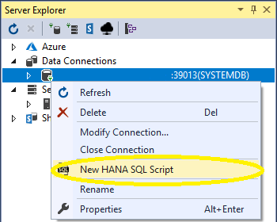
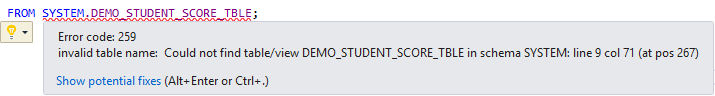

## Prerequisites
 - **Tutorials:** [Setup the SAP HANA Plugin for Microsoft Visual Studio 2017](https://developers.sap.com/tutorials/hxe-ua-visual-studio.html)

## Next Steps
 - **Tutorials:** [SAP HANA Plugin for Microsoft Visual Studio 2017 - Debugging Procedures](https://developers.sap.com/tutorials/hxe-ua-visual-studio-debugging.html)

## Details
### You will learn
  - How to create and debug sample tables by using the SAP HANA plugin for Microsoft Visual Studio 2017.

---

[ACCORDION-BEGIN [Step 1: ](Open HANA SQL Script Editor)]

Right-click on your SAP HANA or SAP HANA, express edition connection in the **Server Explorer**. Select *New HANA SQL Script*.



> **Note:**
> The SAP HANA Plugin works with SAP HANA and SAP HANA, express edition. For these tutorials, we use an SAP HANA, express edition installation as an example.

[DONE]

[ACCORDION-END]

[ACCORDION-BEGIN [Step 2: ](Cleanup Student Score Tables)]

Before you begin creating and working with tables, check if tables with similar names exist already. This step deletes any such tables in case you have them.

To clear the tables, execute the following statements:

```bash
DROP TABLE SYSTEM.DEMO_STUDENT_SCORE_TABLE;
DROP PROCEDURE SYSTEM.CALCHISTORYAVERAGE;
DROP PROCEDURE SYSTEM.CALCMATHAVERAGE;
DROP PROCEDURE SYSTEM.CALCAVERAGESCORE;
```

Click  **Verify** to check the statements.

Click  **Execute** to execute the statements.

> **Note:**
> If this is your first time going through this tutorial, then this step will not yield a positive result. It ensures that the rest of the tutorial will run successfully if you have run through the tutorial previously.

[DONE]

[ACCORDION-END]

[ACCORDION-BEGIN [Step 3: ](Make Student Score Table)]

Create the student score table by executing the following statements:

```bash
CREATE TABLE SYSTEM.DEMO_STUDENT_SCORE_TABLE (name varchar(25),  SCORE_MATH int, SCORE_HISTORY int, PRIMARY KEY(name));
INSERT INTO SYSTEM.DEMO_STUDENT_SCORE_TABLE VALUES('Jerry','90','80');
INSERT INTO SYSTEM.DEMO_STUDENT_SCORE_TABLE VALUES('Albert','91','81');
INSERT INTO SYSTEM.DEMO_STUDENT_SCORE_TABLE VALUES('ShaoWei','92','82');
INSERT INTO SYSTEM.DEMO_STUDENT_SCORE_TABLE VALUES('Xinhan','93','83');
INSERT INTO SYSTEM.DEMO_STUDENT_SCORE_TABLE VALUES('Tim','94','84');
```
Click  **Verify** to check the statements.

Click  **Execute** to execute the statements.

> **Note:**
> If this is the first time you are running the script, then you will receive an error if you verify the script because the _INSERT_ statements add values to the table the first statement makes.

This table is the basis for the rest of the tutorial.

[DONE]

[ACCORDION-END]


[ACCORDION-BEGIN [Step 4: ](Make Class Average Score Tables)]

Calculate the average student score for the History and Math classes by executing the following statements.

Click  **Verify** to check the code.

Click  **Execute** to execute the code.

> **Note:**
> There is an intentional error in this code. You fix the error in the next step to highlight one of the debugging features in the plugin.

```bash
-- This procedure calculates the average score for the history course.

CREATE OR REPLACE PROCEDURE calcHistoryAverage (OUT HISTORY_AVERAGE INT)
LANGUAGE SQLSCRIPT AS
BEGIN

	DECLARE SCORE_SUMMARY int = 0;
	DECLARE SCORE_CURRENT int = 0;
	DECLARE SCORE_COUNT int = 0;

	DECLARE CURSOR C_HISTORY_SCORES FOR SELECT SCORE_HISTORY FROM SYSTEM.DEMO_STUDENT_SCORE_TBLE;

	FOR cur_row AS C_HISTORY_SCORES
		  DO
			   SCORE_SUMMARY = SCORE_SUMMARY + cur_row.SCORE_HISTORY;
			   SCORE_COUNT = SCORE_COUNT + 1;
	END	FOR;

	HISTORY_AVERAGE = SCORE_SUMMARY / SCORE_COUNT;

END;


-- This procedure calculates the average score for the math course.

CREATE OR REPLACE PROCEDURE calcMathAverage (OUT MATH_AVERAGE INT)
LANGUAGE SQLSCRIPT AS
BEGIN

	DECLARE SCORE_SUMMARY int = 0;
	DECLARE SCORE_CURRENT int = 0;
	DECLARE SCORE_COUNT int = 0;
	DECLARE CURSOR C_MATH_SCORES FOR SELECT SCORE_HISTORY FROM SYSTEM.DEMO_STUDENT_SCORE_TABLE;

	FOR cur_row AS C_MATH_SCORES
		  DO
			   SCORE_SUMMARY = SCORE_SUMMARY + cur_row.SCORE_HISTORY;
			   SCORE_COUNT = SCORE_COUNT + 1;
	END FOR;

	MATH_AVERAGE = SCORE_SUMMARY / SCORE_COUNT;
END;

-- This procedure is the root procedure that calls the sub-procedures to calculate the average score between the classes.
CREATE OR REPLACE PROCEDURE calcAverageScore()
LANGUAGE SQLSCRIPT AS
BEGIN
	DECLARE MATH_AVERAGE_SCORE INT = 0;
	DECLARE HISTORY_AVERAGE_SCORE INT = 0;
	CALL system.calchistoryaverage(HISTORY_AVERAGE => HISTORY_AVERAGE_SCORE);
	CALL system.calcmathaverage(MATH_AVERAGE => MATH_AVERAGE_SCORE);
	SELECT MATH_AVERAGE_SCORE AS MATH_AVG, HISTORY_AVERAGE_SCORE AS HISTORY_AVG FROM SYS.DUMMY;
END;
```

[DONE]

[ACCORDION-END]

[ACCORDION-BEGIN [Step 5: ](Fixing Errors)]

You receive the following error message because the table name is not spelled correctly:



Click the  light bulb to receive suggested fixes for the error. Select the fix that edits line 11 to read as follows:

```
DECLARE CURSOR C_HISTORY_SCORES FOR SELECT SCORE_HISTORY FROM SYSTEM.DEMO_STUDENT_SCORE_TABLE;
```

When you run the code again, it runs successfully and calculates the average History and Math class scores.

[DONE]

[ACCORDION-END]
