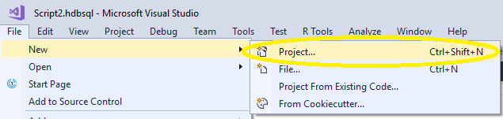
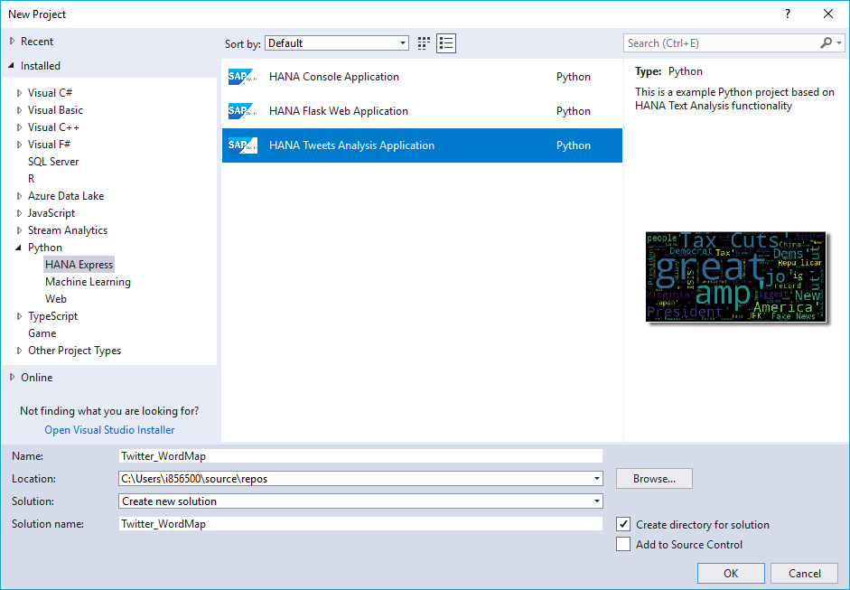
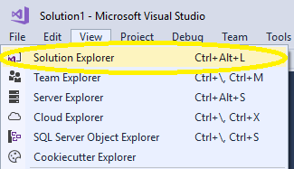

## Prerequisites
 - **Tutorials:** [SAP HANA Plugin for Microsoft Visual Studio 2017 - Debugging Procedures](https://developers.sap.com/tutorials/hxe-ua-visual-studio-debugging.html)

## Next Steps
 - **Tutorials:** [SAP HANA Plugin for Microsoft Visual Studio 2017 - Deploy to the Google Cloud Platform](https://developers.sap.com/tutorials/hxe-ua-visual-studio-google-cloud.html)


## Details
### You will learn
  - How to use the SAP HANA plugin for Microsoft Visual Studio 2017 to create a Twitter Word Map.

---

[ACCORDION-BEGIN [Step 1: ](Open New Project)]

Click **File** > **New** > **Project...**.



In the **New Project** window, under **Installed** cascade from **Other Languages** to **Python** and click **HANA Express**.



> **Note:**
> The Category **Other Languages** may not appear on the list. Go straight to the **Python** category if you see it.

For this project select *HANA Express Tweets Analysis Application*. Choose a name and save location for your project and then click **OK**.

> **Note:**
> This project requires some external packages. Follow the prompt to install these packages and then continue with the tutorial.

[DONE]

[ACCORDION-END]

[ACCORDION-BEGIN [Step 2: ](Load the Python Scripts and Open Solution Explorer)]

At the top of the Microsoft Visual Studio window, select **View** and then click **Solution Explorer**. The **Solution Explorer** window opens.



> **Note:**
> This application is compatible with Python version 3.6 and later. If you have multiple Python environments, you will need to set the appropriate environment and load the corresponding SAP HANA client driver libraries in the **Solution Explorer** window.

[DONE]

[ACCORDION-END]

[ACCORDION-BEGIN [Step 3: ](Get Your Twitter API Credentials)]

To generate the word map, you require the proper Twitter credentials (listed below). Set up the credentials on the [Twitter Applications](https://apps.twitter.com) page.

    * Twitter username
    * Consumer Key
    * Consumer Secret
    * Access Key
    * Access Secret

You need these values for the next step.

[DONE]

[ACCORDION-END]

[ACCORDION-BEGIN [Step 4: ](Modify Python Script)]

In the `HANATweetsAnalysis.py` script, edit the following section to include your Twitter API credentials:

```
TWEET_USERNAME = "tweet_username"
CONSUMER_KEY = "consumer_key"
CONSUMER_SECRET =  "consumer_secret"
ACCESS_KEY = "access_key"
ACCESS_SECRET = "access_secret"
```

Here is an example:

```
TWEET_USERNAME = "SAPInMemory"
CONSUMER_KEY = "Thisismyconsumerkey123"
CONSUMER_SECRET =  "Thisismyconsumersecret123"
ACCESS_KEY = "Thisismyaccesskey123"
ACCESS_SECRET = "Thisismyaccesssecret123"
```

Edit the following section to include your SAP HANA, express edition installation information:

```
HANA_HOST = "hana_host"
HANA_PORT = "hana_port"
HANA_USER = "hana_user"
HANA_PASSWORD = "hana_password"
```

Here is an example:

```
HANA_HOST = "my.HANA.host"
HANA_PORT = "39013"
HANA_USER = "SYSTEM"
HANA_PASSWORD = "HXEHana1"
```

[DONE]

[ACCORDION-END]

[ACCORDION-BEGIN [Step 5: ](Execute the Project)]

To run the project, go to **Debug** at the top of the window. Click **Start Without Debugging**. A command prompt window opens and executes the program.

After a few moments, the word map for your Twitter account displays.

[DONE]

[ACCORDION-END]
