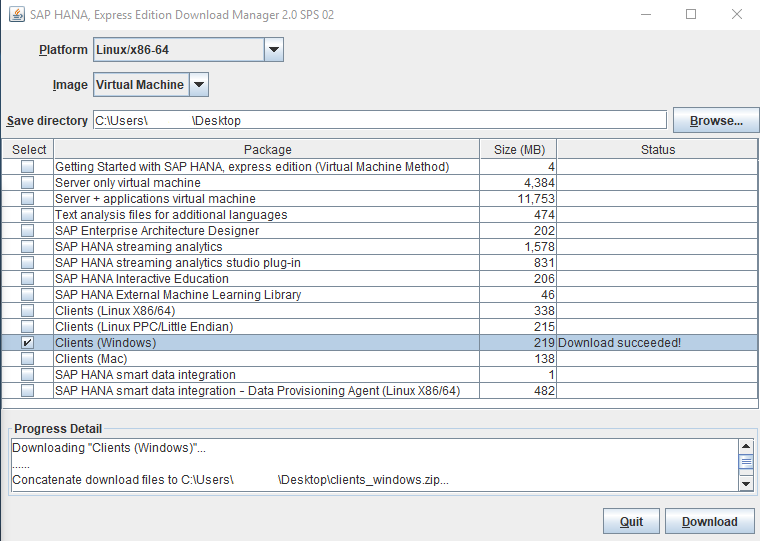
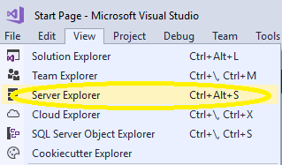
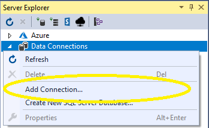
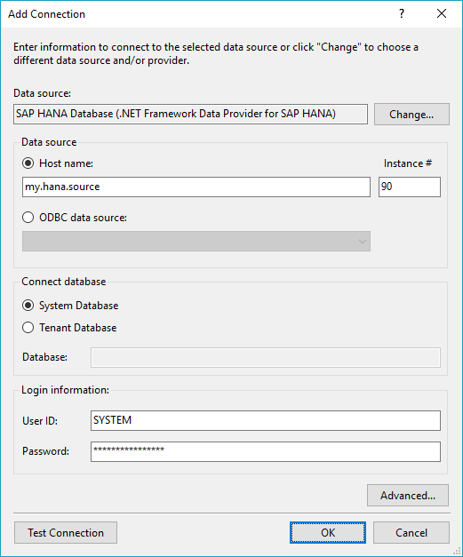

## Prerequisites  
 - **Proficiency:** Beginner

## Next Steps
 - **Tutorials:** [SAP HANA Plugin for Microsoft Visual Studio - Working with Tables](https://developers.sap.com/tutorials/hxe-ua-visual-studio-tables.html)

## Details
### You will learn  
How to install the SAP HANA plugin on your Microsoft Visual Studio installation. The SAP HANA Plugin for Microsoft Visual Studio allows you to connect to your SAP HANA or SAP HANA, express edition installation through Microsoft Visual Studio. For these tutorials, we use an SAP HANA, express edition installation as an example.

The SAP HANA plugin is compatible with Microsoft Visual Studio Community edition, Platform edition, and Enterprise edition 2017 and later.

You do not have to install the Microsoft Visual Studio plugin on the same machine or VM as your SAP HANA or SAP HANA, express edition installation.

### Time to Complete
**5 Min**

---

[ACCORDION-BEGIN [Step 1: ](Download and Install Microsoft Visual Studio)]

Download and install Microsoft Visual Studio directly from Microsoft. The Microsoft Visual Studio plugin is compatible with Microsoft Visual Studio Community edition, Platform edition, and Enterprise edition 2017 and later.

For more information, visit the [Microsoft Visual Studio](https://www.visualstudio.com/) webpage.

[ACCORDION-END]

[ACCORDION-BEGIN [Step 2: ](Download the SAP HANA, express edition Download Manager )]

You can download the SAP HANA plugin for Microsoft Visual Studio by downloading the SAP HANA, express edition download manager. Go to the [SAP HANA, express edition](https://www.sap.com/sap-hana-express) homepage and click **Install SAP HANA, express edition**.

Enter your information and click **Register**.

Click on the appropriate Download Manager version for your system to download.

> **Note:**
> The SAP HANA Plugin works with SAP HANA and SAP HANA, express edition. For these tutorials, we use an SAP HANA, express edition installation as an example.

[ACCORDION-END]

[ACCORDION-BEGIN [Step 3: ](Install the Plugin for Microsoft Visual Studio)]

Open the Download Manager on your machine. Select and download **Clients (Windows)**. This downloads `clients_windows.zip` which contains the files `hdb_client_windows_x86_32.zip`, `hdb_client_windows_x86_64.zip`, and `xs.onpremise.runtime.client_ntamd64.zip`.

Unzip `hdb_client_windows_x86_64.zip` and run `hdbinst.exe`. Follow the onscreen instructions. This installs the Microsoft Visual Studio plugin, as well as the SAP HANA HDB Client.

> **Note:**
> Ensure that you are not running an instance of Microsoft Visual Studio while you are installing the plugin.

[ACCORDION-END]

[ACCORDION-BEGIN [Step 4: ](Connect to SAP HANA, express edition)]

Open Microsoft Visual Studio. Go to __View__ then click __Server Explorer__.

In the __Server Explorer__ window, right-click __Data Connections__ and then click __Add Connection...__.

In the __Add Connection__ window, for __Data source:__, select _SAP HANA Database (.NET Framework Data Provider for SAP HANA)_.

For __Server name:__ enter the server name of your SAP HANA or SAP HANA, express edition installation. The __Instance no:__ is __90__ (for SAP HANA, express edition 1.0 installations, the instance number is __00__).

Alternatively, for __Server name:__ you can include the server name of your SAP HANA or SAP HANA, express edition installation and specify the port in the following format: `<my.hana.source>:<port_number>`.

Ensure that __Connect database__ is set to __System Database__.

For __Login information__, the __User name:__ is __SYSTEM__ and the __Password:__ is the password you set when you installed SAP HANA or SAP HANA, express edition.

[ACCORDION-END]

