## Prerequisites  
 - **Proficiency:** Beginner

## Details
### You will learn  
This tutorial will walk you through the setup process of SAP HANA, express edition, and the XS Advanced applications platforms from an Amazon Marketplace Image in Amazon Web Services

### Time to Complete
**35 Min**

---

[ACCORDION-BEGIN [Step 1: ](Sign in and select the AMI)]

Sign in or create an account to access the [Amazon Web Services Marketplace](https://aws.amazon.com/marketplace/).

After you perform the next search, you will be presented with two options. The right one will depend on what you are looking to do. **This tutorial covers the database + XS Advanced application option**.

  -    **SAP HANA, express edition:** The database server. This includes the in-memory database, to which you can connect using different drivers and connectors for different languages (`JDBC`, `ODBC`, `ADO.NET`, driver for Python, Node.js modules, etc.). You can use the database services and the advanced analytics processing engines (e.g., geospatial, text analytics, Extended Machine Library or Predictive Analytics Library, etc.) **Go to the following tutorial for this option**:  <https://www.sap.com/developer/tutorials/hxe-aws-setup.html>
  -    **SAP HANA, express edition (server + applications):** The database server plus the XS Advanced platform. This includes the database server and the micro-services oriented, polyglot development platform. This includes the SAP Web IDE for SAP HANA, the administration cockpit among other applications like SHINE, Enterprise Architecture Designer and Smart Data Streaming. OData V2 and V4 support, Node.js and Java runtime environments are also included. This option requires more resources.

Look for **HANA Express** and choose **SAP HANA, express edition**


Select the option with `(server +  applications)`. **Review** the provided information and click on **Continue to Subscribe**

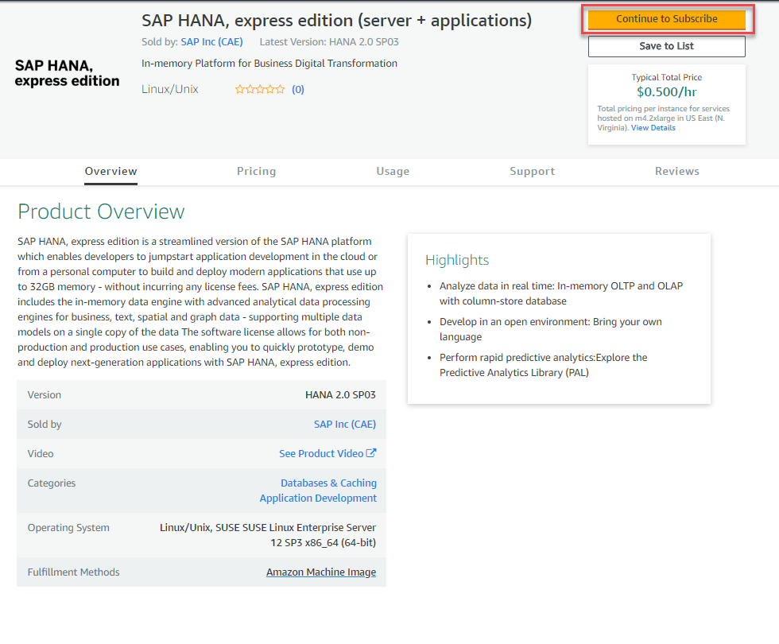

Continue scrolling down to review the **pricing** and additional information. Once you are ready, click **Continue to Configuration**.

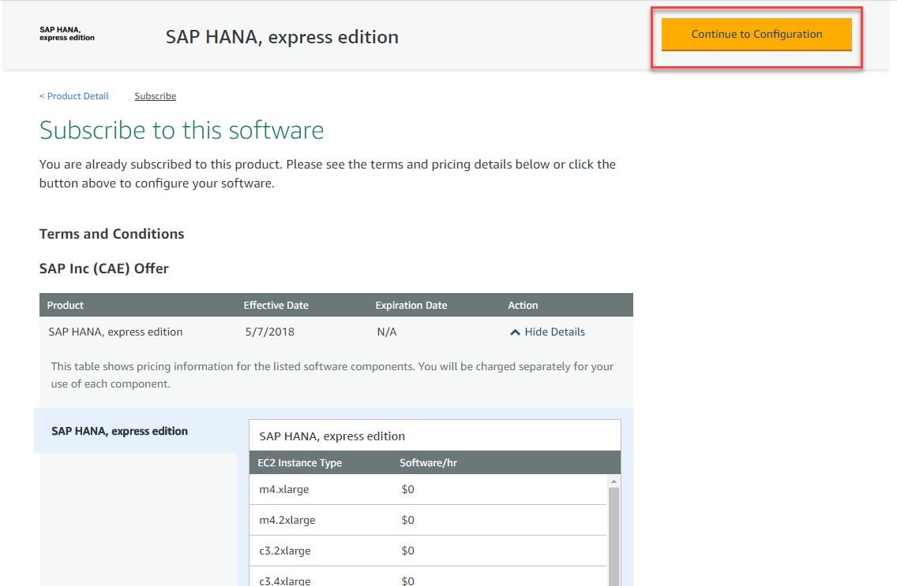

[ACCORDION-END]

[ACCORDION-BEGIN [Step 2: ](Choose instance type)]

Review the pricing, choose a region and click **Continue to Launch**.

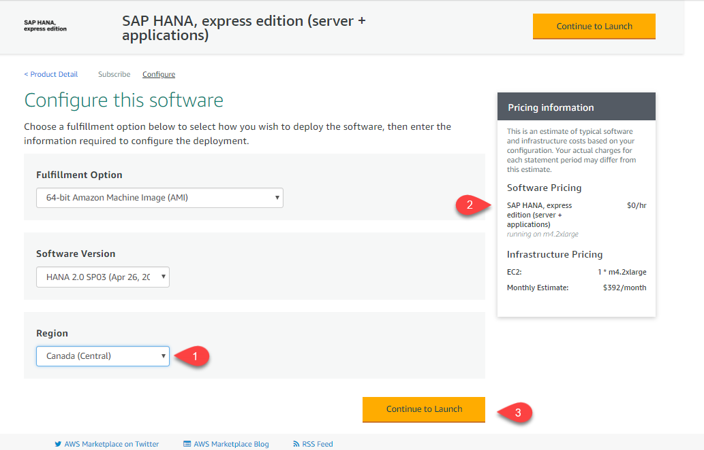

Choose **Launch from Website**, `m4.2xlarge` as the instance and select or create a `VPC`.

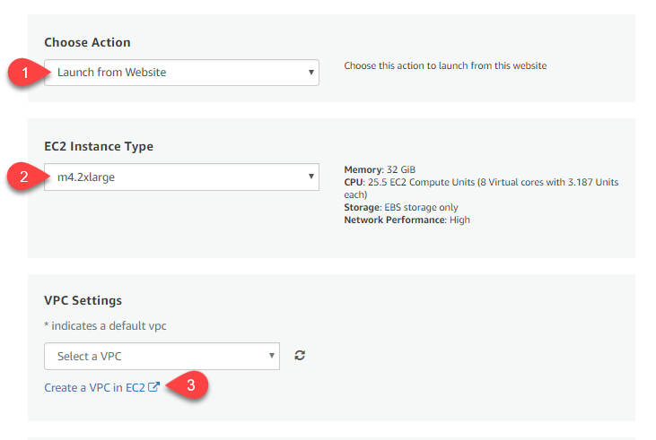

[ACCORDION-END]


[ACCORDION-BEGIN [Step 3: ](Configure network)]

Choose or create a subnet and **Create a security group based on Seller Settings**

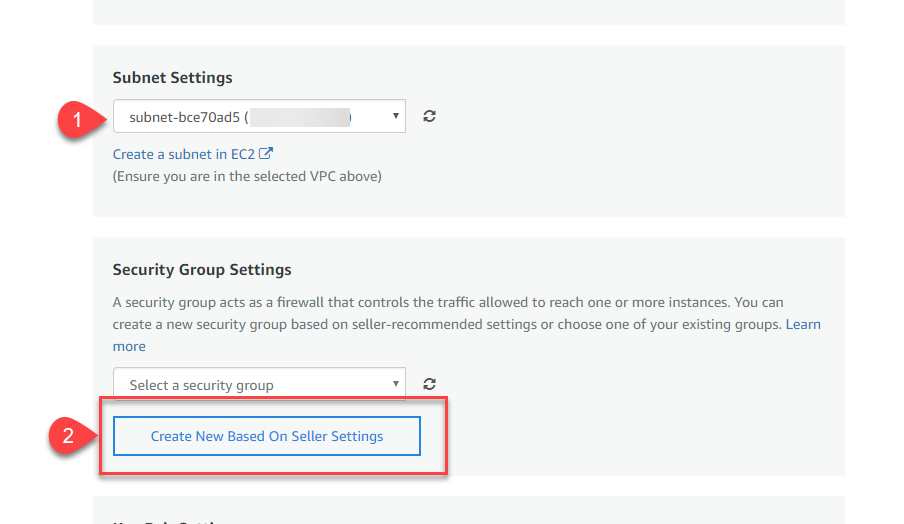

Name the security group, add a description and click **Save**

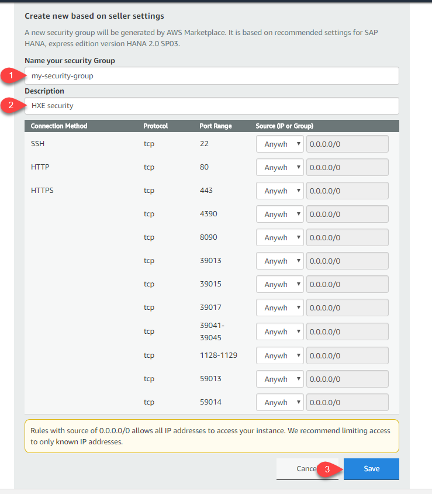

[ACCORDION-END]


[ACCORDION-BEGIN [Step 4: ](Launch your instance)]

Click **Create a key pair**.


Click the button to **Create a Key pair**, set a name and click **Create**

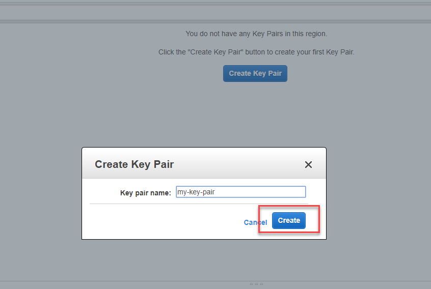

**Download** the generated file and store it in a secure location.

> ### **You will need the generated file to access your instance**
>
> This file is your key to access the server. If you lose your `.pem` file you will not be able to access the instance later.
>

&nbsp;

Click the `refresh` buttons to choose the newly-create settings


Click **`EC2 Console`** to see your instance


[ACCORDION-END]

[ACCORDION-BEGIN [Step 5: ](Connect to your instance)]

Once the instance is ready, you can connect to it using an SSH client. Copy the external IP address from the instance information:


There are different methods to connect to your instance depending on the system you are using to connect from:

  -  Windows computer: If you are using a Windows PC, you will need to download an SSH client, [such as PuTTY](https://winscp.net/eng/download.php) and `PuTTYgen` to convert your `.pem` file to a `.ppk` private key file. Follow this guide for further information: <http://docs.aws.amazon.com/AWSEC2/latest/UserGuide/putty.html>

  

  Use user `ec2-user` when prompted.

  -  Mac or Linux computer: You can use command `ssh` from a terminal as follows

  ```ssh
  ssh -i /path/my-key-pair.pem ec2-user@your_ip_address
  ```

  There is more information about connecting to your instance on this guide: <http://docs.aws.amazon.com/AWSEC2/latest/UserGuide/AccessingInstancesLinux.html>

[ACCORDION-END]

[ACCORDION-BEGIN [Step 6: ](Configure your server)]

Once you have established an SSH session, use user `ec2-user` to log in

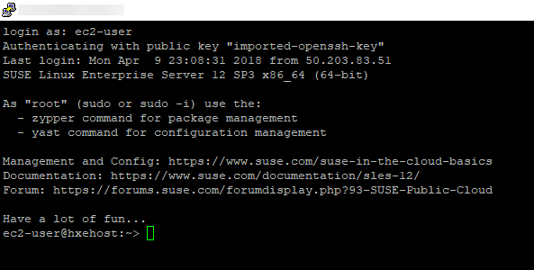

Change the password for `hxeadm` using the following command:

```
sudo passwd hxeadm
```

As follows:

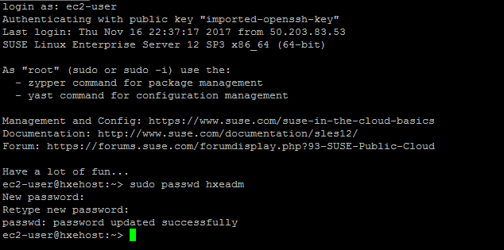


Use the following command to start configuring your instance:

```ssh
sudo su - hxeadm
```


You will be prompted for the master password for your database. **If you lose this password, you will lose access to your instance**.

> ### **Note: The password has to follow these rules**
> The master password you will specify is used for the `<sid>adm` and `sapadm` OS users, the telemetry technical user, and the HANA SYSTEM user.
>
> SAP HANA, express edition requires a very strong password that complies with these rules:
>
> - At least 8 characters
> - At least 1 uppercase letter
> - At least 1 lowercase letter
> - At least 1 number
> - Can contain special characters, but not _&grave;_ (backtick), _&#36;_ (dollar sign),  _&#92;_ (backslash), _&#39;_ (single quote), or _&quot;_ (double quotes)
> - Cannot contain dictionary words
> - Cannot contain simplistic or systematic values, like strings in ascending or descending numerical or alphabetical order
>

&nbsp;

Enter the password you want to set for your administration user and then type **Y** to continue setup.


You will not need a proxy to access the internet. You will also be asked if you want to wait for XSA configuration to finish. The recommended option is **N** (no), so that the installation continues even if you lose connectivity.

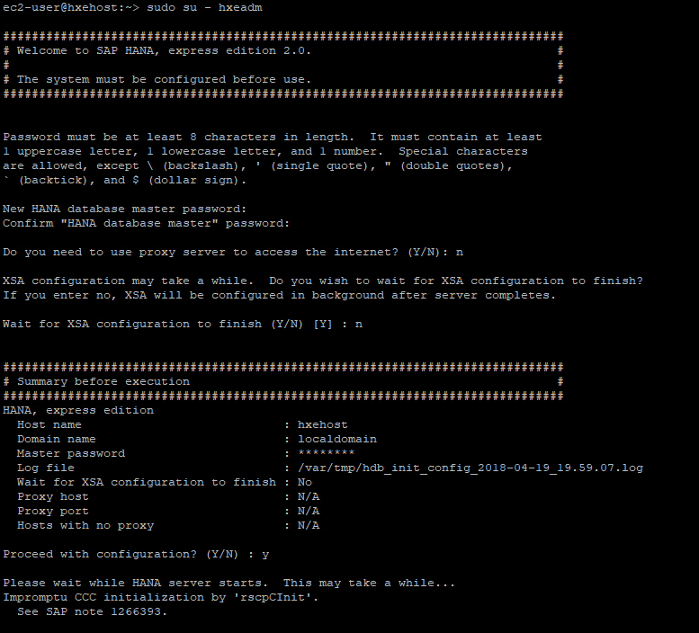

The setup script will perform different configurations for the next 10 minutes. After the core database has been set up, you should see a success message, This means the XS Advanced applications are now being configured.

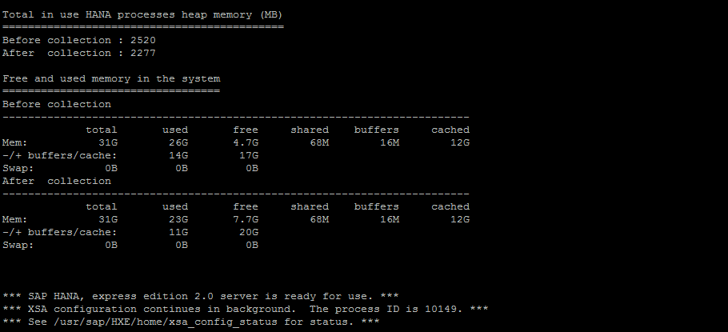

Repeat the following command to check if the XS Advanced installation has finished, or wait until you get a success message if you chose to wait until the configuration finishes.

```
cat /usr/sap/HXE/home/xsa_config_status
```

You will see `status=success` once it has finished:

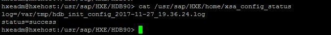

> Note: If the status is not successful, you can check the log to see what errors occurred using the command `cat`, for example, `cat /var/tmp/hdb_init_config_2017-11-27_19.36.24.log`.

[ACCORDION-END]

[ACCORDION-BEGIN [Step 7: ](Check your instance)]

You can now check your instance is running properly. From the console log, use the following command as user `hxeadm` to see which processes your database is running:

```ssh
HDB info
```
You should see (at least) the following processes:

- `hdbnameserver`
- `hdbcompileserver`
- `hdbwebdispatcher`
- `hdbwebdispatcher`

&nbsp;

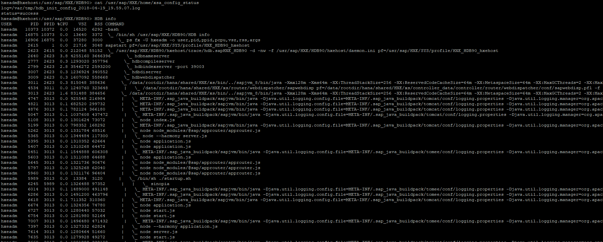

>Note: You can run commands `HDB start` and `HDB stop` respectively to start and stop your SAP HANA instance

&nbsp;

Although the database is running, the XS Advanced applications and services may still be loading. Check the progress by running the following command in the XS Command Line Interface.

> Note: You can also execute the CLI locally from your computer. Make sure to download it from the [download site using the Download Manager](https://www.sap.com/developer/topics/sap-hana-express.html) and to map your hosts file as explained in step 9.

&nbsp;

```
xs-admin-login
xs apps | grep webide
```

When prompted, use the password you provided at the beginning of the installation script.

Repeat the second command until you see `STARTED` and **`1/1`** for applications `webide`.

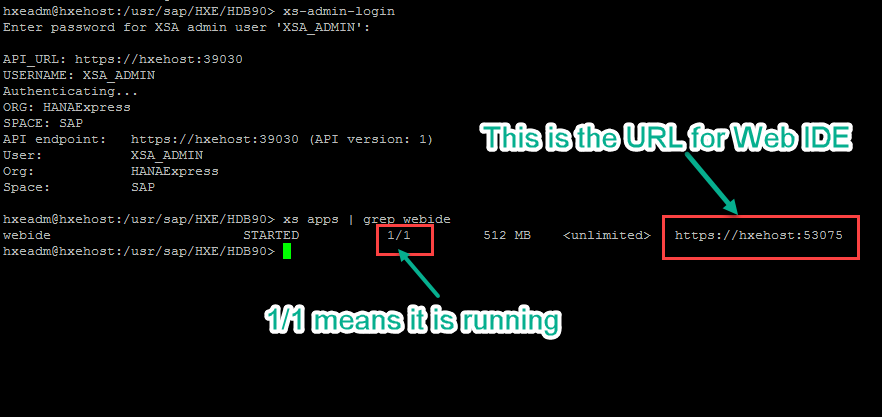

Make sure you map the hosts file as indicated in the next step before you call Web IDE.

If anything is going wrong, [check the questions and answers from the community](https://answers.sap.com/index.html).

[ACCORDION-END]

[ACCORDION-BEGIN [Step 8: ](Map the hosts file)]
Use the external IP address on the Amazon Web Services EC2 console to map it to the hosts file in your computer.

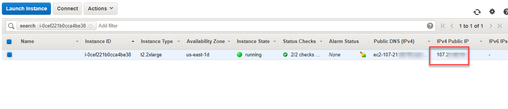

You need administration permissions on your computer to do this.

- For Windows Computers:
  If your user is not an administrator but has administrator rights, right-click on Notepad and choose `Run as Administrator`. If you are an administrator user, proceed to the next point.

  

  Open the file or navigate with Windows explorer. You need to edit the file called `hosts` in the directory `C:\Windows\System32\drivers\etc`

  


- For Mac OS:
  Open a terminal (`Finder -> Applications -> Terminal`) and type `sudo nano /etc/hosts`

  


Add the IP address followed by the name of the host, `hxehost`.


**Save** and close the editor.

> Note: If Notepad asks you to create a new file you do not have enough permissions to save the file. Creating a new file will not alter the configuration as intended.

</br>


You can now use your browser to call SAP Web IDE for SAP HANA using link `https://hxehost:53075`

Log in with user `XSA_DEV` and the password you indicated during the initial setup script.

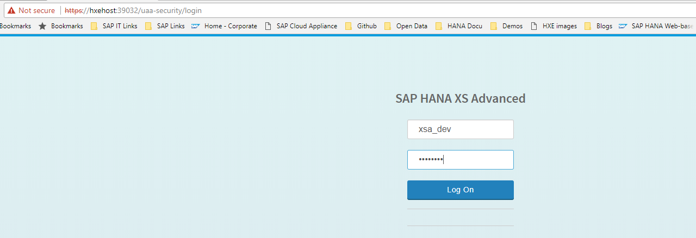

> Note: You may get a message stating that your connection is not private. This is generally expected because you are using a self-signed certificate.

> You can use address `https://hxehost:39030` to see additional links such as the Administration Cockpit. Make sure you use user `XSA_ADMIN` in different browsers or incognito mode to avoid authorization errors.


</br>

You can now start to use your SAP HANA, express edition, instance.
Learn [how to develop your first XS Advanced application](https://www.sap.com/developer/groups/hana-xsa-get-started.html) or go to the [SAP Developer site](https://www.sap.com/developer/tutorial-navigator.html) for tutorials you can complete with your new instance.

[ACCORDION-END]
