## Details
### You will learn  
This tutorial will walk you through the setup process of SAP HANA, express edition, and the XS Advanced applications platforms from an Amazon Marketplace Image in Amazon Web Services.

---
<b>
<div align="center">
<span style="color:red;align:middle">WARNING: Please read carefully before starting!</span>
</div>
<div>&nbsp;</div>
<div align="left">
<span style="color:black;align:middle">Before you get started, please be aware that using SAP HANA, express AMI on AWS is <span style="color:red;align:middle">not covered by the AWS Free tier, </span>and therefore charges for both the EC2 instance AND the provisioned EBS volumes used by this instance will incur.  </span>
</div>
<div>&nbsp;</div>
<div align="left"><span style="color:black;align:middle">With the EBS volumes types in use, <span style="color:red;align:middle">even if your EC2 instance running your SAP HANA, express edition is _stopped_, charges will be incurred </span>for the provisioned EBS volumes.</span></div>
<div>&nbsp;</div>
<span style="color:red;align:middle">Only detaching and deleting the EBS volumes will prevent charges.</span>
<div>&nbsp;</div>
<span style="color:black;align:middle">However, this will make your SAP HANA express edition no longer usable. <span style="color:red;align:middle"> Therefore it is highly recommended that you allocate enough time to complete the tutorial in one sitting to avoid losing work and incurring extra charges.</span></span></b>

---

[ACCORDION-BEGIN [Step 1: ](Sign in and select the AMI)]

Sign in or create an account on [Amazon Web Services Portal](https://portal.aws.amazon.com/billing/signup#/start)

> When creating a new account with AWS, a background validation and verification process is started. This process can take up to 2 hours.**

>During this process, some AWS services, like the AWS Marketplace, will not be available.

>Therefore, you will need to wait for the completion of the validation process before being able to proceed with the SAP HANA, express edition creation.

Access the [Amazon Web Services Marketplace](https://aws.amazon.com/marketplace/seller-profile?id=ba115d7b-68d6-4d81-ba4c-fa035c62bebf).

Select the free option of **SAP HANA, express edition (32GB)** option.

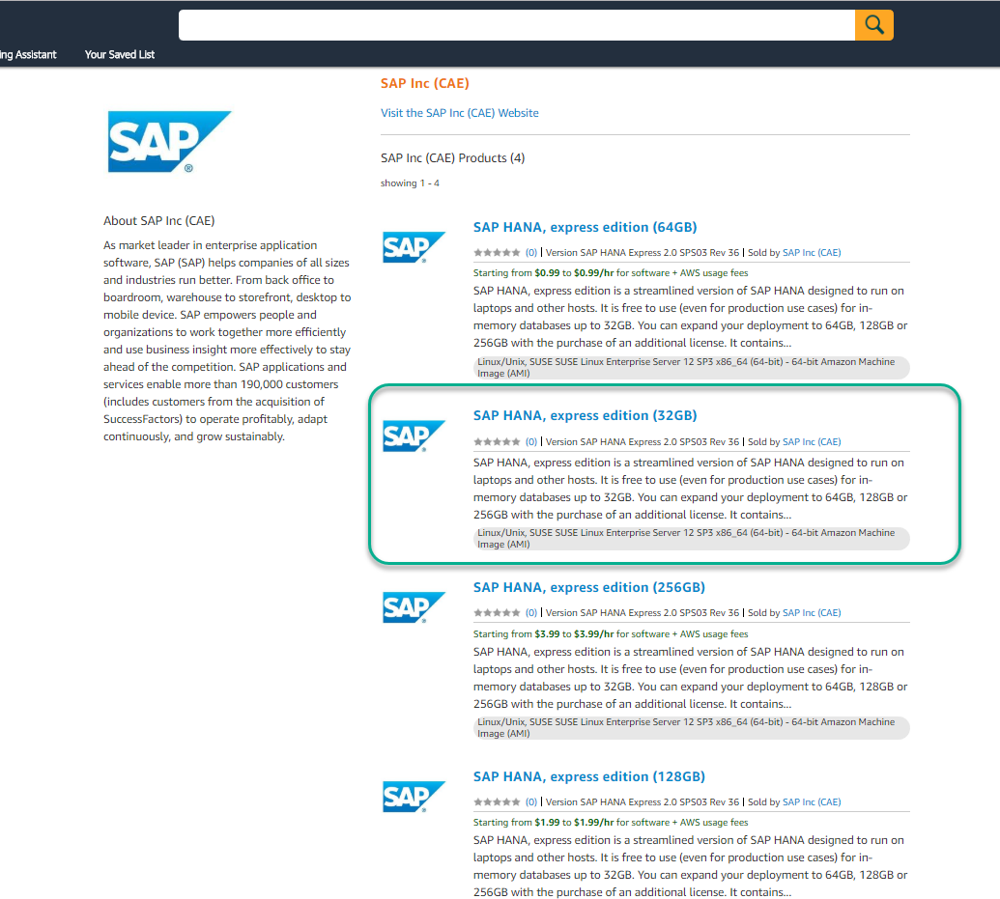

Scroll down and review the **Pricing** and additional information.

Click on **Continue to Subscribe**

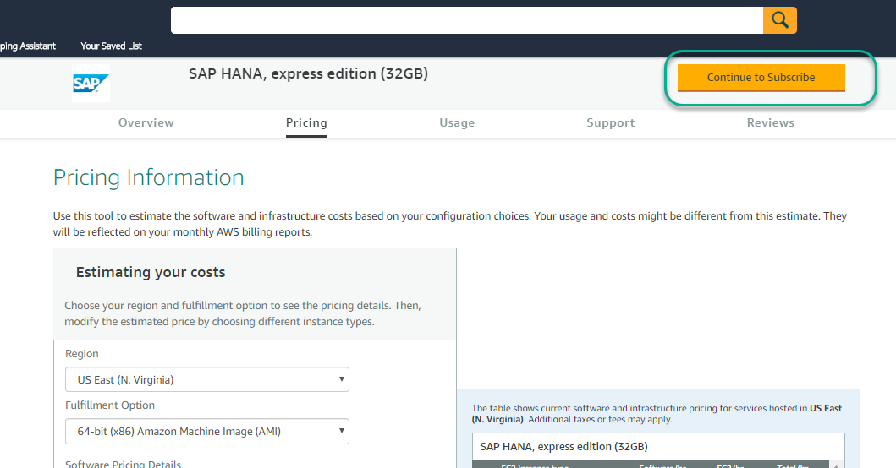

Review and accept the software **Terms and Conditions**.

Click **Continue to Configuration**.


[DONE]
[ACCORDION-END]

[ACCORDION-BEGIN [Step 2: ](Choose instance type)]

Review the pricing, choose a region and click **Continue to Launch**.


Select:

 - Choose Action:  **Launch from Website**.
 - EC2 Instance Type : **`m4.xlarge`**

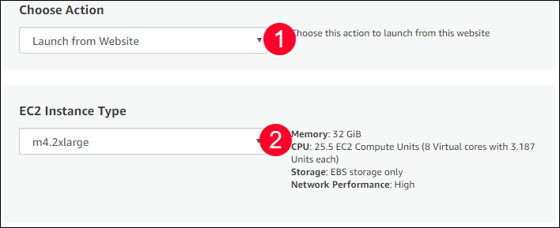

[DONE]
[ACCORDION-END]

[ACCORDION-BEGIN [Step 3: ](Configure network)]

Select or create a **`VPC`**


Once the **`VPC`** is created or selected, select a **Subnet**

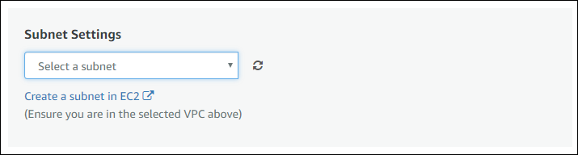

Click on **Create a security group based on Seller Settings**.


Name your security group, add a description and click **Save**

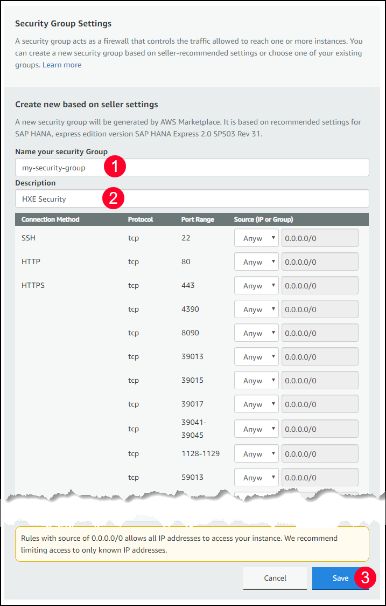

[DONE]
[ACCORDION-END]

[ACCORDION-BEGIN [Step 4: ](Create a key pair)]

Click **Create a key pair**.


The **EC2 Dashboard** will open.

Click on **Create a Key pair**.


Set a name and click **Create**

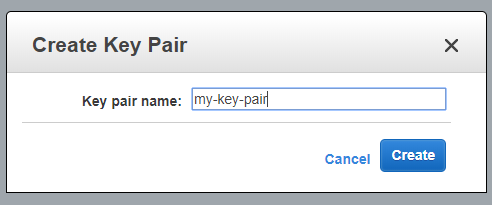

**Download** the generated file and store it in a secure location.

> ### Note:  **You will need the generated file to access your instance**
>
> This file is your key to access the server. If you lose your `.pem` file you will not be able to access the instance later.

>

**If you get an error where `my-key-pair.pem` is not accessible the solution is to type one of these two commands:**

1:  `chmod 777 my-key-pair.pem`

2:  `chmod 400 my-key-pair.pem`


Go back to the instance creation page, and click the ***refresh*** buttons.

Choose the newly-create setting.


[DONE]
[ACCORDION-END]

[ACCORDION-BEGIN [Step 4: ](Launch your instance)]

Once the configuration is completed, click on the **Launch** button.

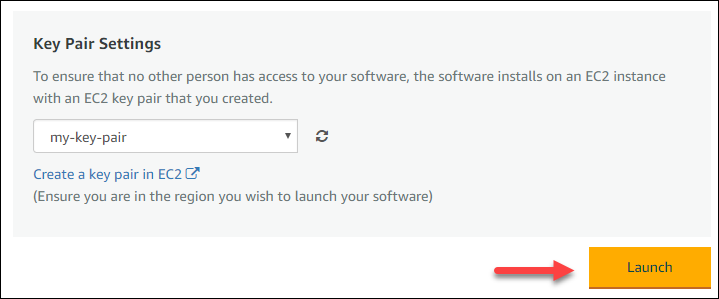

Click on the **[EC2 Console](https://console.aws.amazon.com/ec2)** link to see your instance


From the **EC2 Console**, you will be able to monitor the instance initialization.


You may need to refresh the page to get the **Status Checks** updated.

Once the instance is ready, you can connect to it using an SSH client.

To ensure you can connect to your instance you need some required ports open.  To do this add 3 ranges (highlighted to the security group) to be able to access the XSA services (like SAP Web IDE):

Open security group my-security-group and go to Inbound and click on Edit to Add Rule and add the following ports:

51000-51500

39030-39033

53075
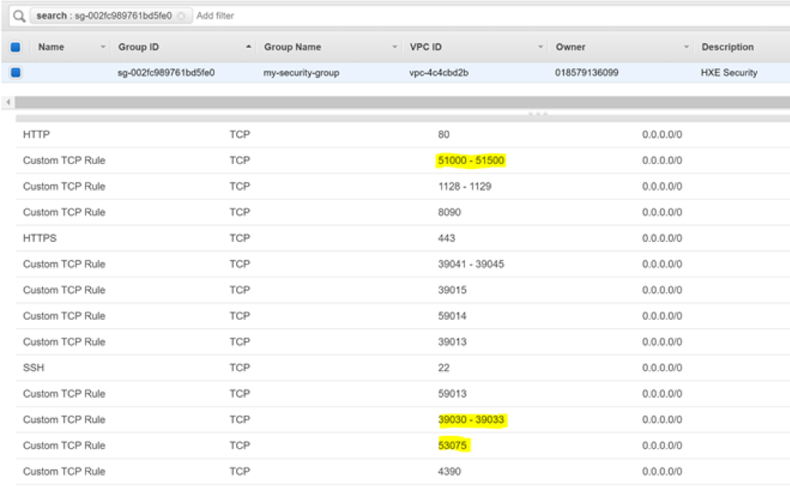

After that your security group settings should like below:
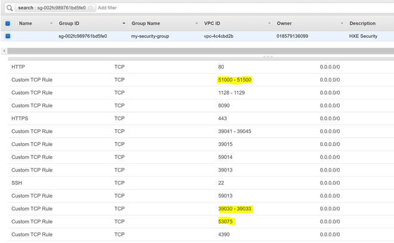

[DONE]
[ACCORDION-END]

[ACCORDION-BEGIN [Step 5: ](Connect to your instance)]
There are different methods to connect to your instance depending on the system you are using to connect from.

You can use a **standalone SSH client** like **`PuTTY`**.

> ### **Note:** There is also a option to use **Java SSH Client** directly from your browser which uses **`MindTerm`**.
>
>However this require the use of NPAPI, which is being deprecated and unsupported by most browsers like Chrome, Microsoft Edge or recent version of Firefox.

>Therefore, it is recommended to use a ***standalone SSH client***.

From the **EC2 Console**, select your EC2 instance:

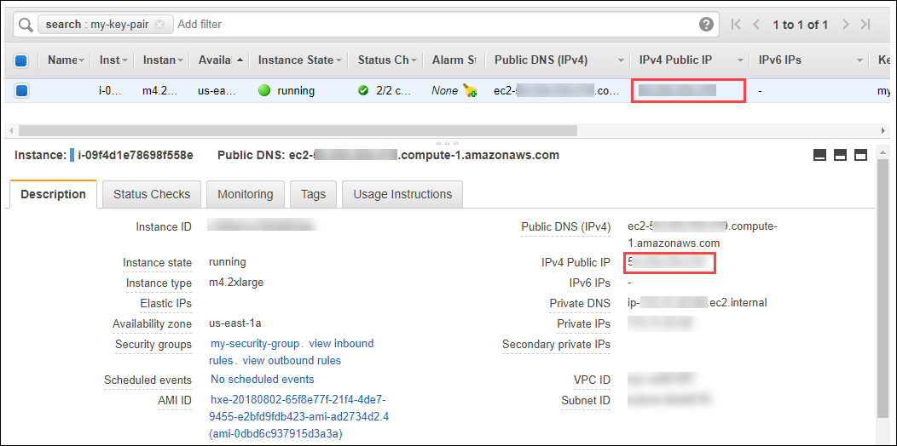

Copy the **`IPv4` Public IP** or the **Public DNS (`IPv4`)** address from the instance information.

Then follow the instruction based on your client platform using the ***Public DNS*** host name as highlighted above.

### **Windows platform**:

If you are using a Windows PC, you will need to download and install:

- an SSH client, such as **`PuTTY`**
- a key pair converter such as **`PuTTYgen`** (one time operation)

#### **Create private key file**

***This is a one time operation.***

Open **`PuTTYgen`**.

Use the **Load** button to import your `X.509` certificate **`.pem`** file.

Use the **Save private key** button to save your private key file as **`.ppk`**.


**Connect**:

Start a new **`PuTTY`** session.

Enter the **`IPv4` Public IP** or the **Public DNS (`IPv4`)** address in the **Host Name (or IP address)** field.


On the left tree, select **Connection > SSH > Auth**, select the generated private key **`.ppk`** file:

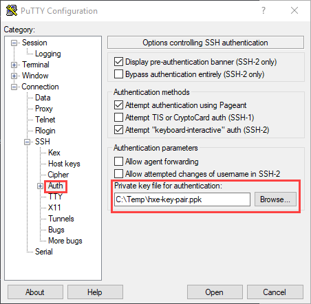

Click on **Open**.

When prompted, use **`ec2-user`** as user.

Check the following guide for further information: [Connecting to Your Linux Instance from Windows Using PuTTY](http://docs.aws.amazon.com/AWSEC2/latest/UserGuide/putty.html)

### **Mac or Linux platform**

You can use command `ssh` from a terminal as follows:

```shell
ssh -i /path/my-key-pair.pem ec2-user@public_ip_address
```

For more details about standalone SSH client option, you can check the [Connecting to Your Linux Instance Using SSH](https://docs.aws.amazon.com/AWSEC2/latest/UserGuide/AccessingInstancesLinux.html) guide.

[DONE]
[ACCORDION-END]

[ACCORDION-BEGIN [Step 6: ](Configure your server)]

Once you have established an SSH session, use the **`ec2-user`** user to log in:


The prompt should become:

```
ec2-user@hxehost:~>
```

Change the password for `hxeadm` using the following command:

```shell
sudo passwd hxeadm
```

As follows:


Switch now to user **`hxeadm`** to start configuring your instance:

```ssh
sudo su - hxeadm
```


You will be prompted for the master password for your database. **If you lose this password, you will lose access to your instance**.

> ### **Note: The password has to follow these rules**
> The master password you will specify is used for the `<sid>adm` and `sapadm` OS users, the telemetry technical user, and the HANA SYSTEM user.
>
> SAP HANA, express edition requires a very strong password that complies with these rules:
>
> - At least 8 characters
> - At least 1 uppercase letter
> - At least 1 lowercase letter
> - At least 1 number
> - Can contain special characters, but not _&grave;_ (backtick), _&#36;_ (dollar sign),  _&#92;_ (backslash), _&#39;_ (single quote), or _&quot;_ (double quotes)
> - Cannot contain dictionary words
> - Cannot contain simplistic or systematic values, like strings in ascending or descending numerical or alphabetical order
>

Enter the password you want to set for your administration user.


You will not need a proxy to access the internet, so enter **N** (no) when prompted.

You will also be asked if you want to wait for XSA configuration to finish.

The recommended option is **N** (no), so that the installation continues even if you lose connectivity.

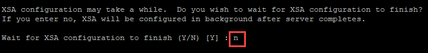

The setup script will perform different configurations for the next 10 minutes.

After the core database has been set up, you should see a success message.

This means the XS Advanced applications are now being configured.

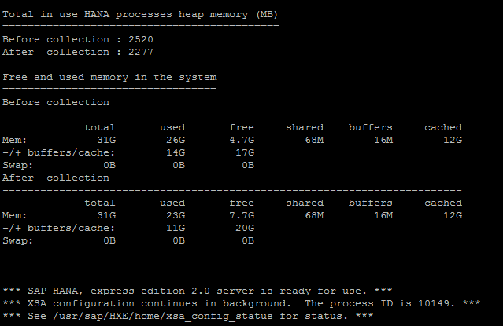

Repeat the following command to check if the XS Advanced installation has finished, or wait until you get a success message if you chose to wait until the configuration finishes.

```shell
cat /usr/sap/HXE/home/xsa_config_status
```

You will see `status=success` once it has finished:

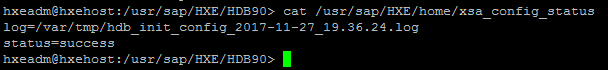

> Note: If the status is not successful, you can check the log to see what errors occurred using the command, for example:
> `cat /var/tmp/hdb_init_config_2017-11-27_19.36.24.log`.

[DONE]
[ACCORDION-END]

[ACCORDION-BEGIN [Step 7: ](Check your instance)]

You can now check your instance is running properly. From the console log, use the following command as user `hxeadm` to see which processes your database is running:

```ssh
HDB info
```
You should see (at least) the following processes:

- `hdbnameserver`
- `hdbcompileserver`
- `hdbindexserver`
- `hdbwebdispatcher`

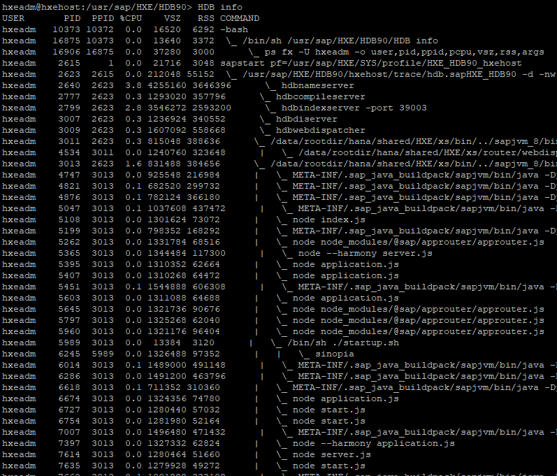

> ### **Note**: You can run commands `HDB start` and `HDB stop` respectively to start and stop your SAP HANA instance

Although the database is running, the XS Advanced applications and services may still be loading. Check the progress by running the following command in the XS Command Line Interface.

> ### **Note**: You can also execute the CLI locally from your computer. Make sure to download it from the [download site using the Download Manager](https://developers.sap.com/topics/hana.html) and to map your hosts file as explained in step 9.

```
xs-admin-login
xs apps | grep webide
```

When prompted, use the password you provided at the beginning of the installation script.

Repeat the second command until you see `STARTED` and **`1/1`** for applications `webide`.

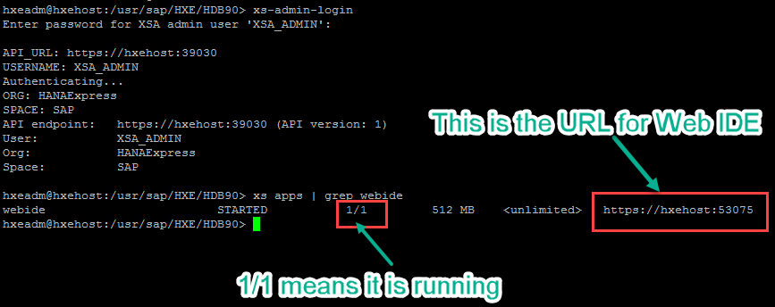

Make sure you update the hosts file as indicated in the next step before you call Web IDE.

Provide an answer to the question below then click on **Validate**.

[VALIDATE_1]
[ACCORDION-END]

[ACCORDION-BEGIN [Step 8: ](Map the host)]

Use the external IP address collected from the Amazon Web Services EC2 console to map it in your computer hosts file.  In addition you will also need to give your IP access for ports 51000 - 51500.


> ### **Warning:** **You will need administration permissions on your computer to do this.**

  - On **Windows**:

	If your user is not an administrator but has administrator rights, right-click on Notepad and choose **Run as Administrator**.

	

	If you are an administrator user, proceed to the next point.

	Open the file or navigate with Windows explorer. You need to edit the file called **`hosts`** in the directory **`C:\Windows\System32\drivers\etc`**.

	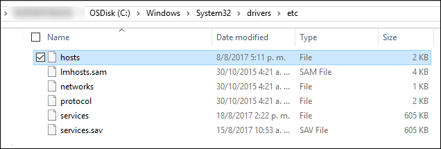


  - On **Mac**:

	Open a terminal ( **Finder -> Applications -> Terminal**) and type

	```shell
	sudo nano /etc/hosts
	```

    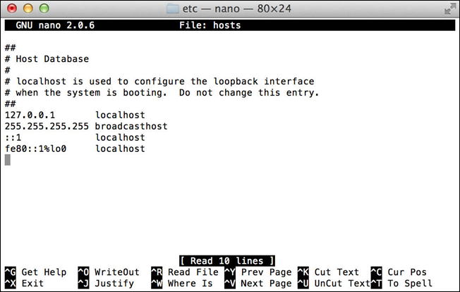

Add the external IP address followed by the name of the host, **`hxehost`** like this:

```
xxx.xxx.xxx.xxx hxehost
```

**Save** and close the text editor.

You will also need to add 3 ranges (highlighted to the security group) to be able to be able to access the XSA services (like SAP Web IDE).  Open your AWS console and add the highlighted ports to the roles created earlier:


> Note: If Notepad asks you to create a new file, it means that you do not have enough permissions to save the file and that you didn't start your program as ***Administrator***.
>Creating a new file will not alter the configuration as intended.

You can now use your browser to call SAP Web IDE for SAP HANA using link **`https://hxehost:53075`**.

Log in with user `XSA_DEV` and the password you provided during the initial setup script.

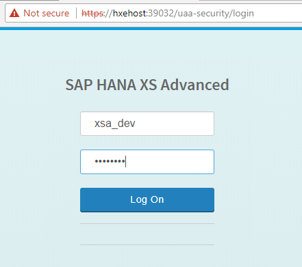

> ### **Note:** You may get a message stating that your connection is not private. This is generally expected because you are using a self-signed certificate.
&nbsp;
> You can use address `https://hxehost:39030` to see additional links such as the Administration Cockpit.
&nbsp;
>Make sure you use user `XSA_ADMIN` in different browsers or incognito mode to avoid authorization errors.

[DONE]
[ACCORDION-END]

If anything is going wrong, [check the questions and answers from the community](https://answers.sap.com/index.html).

> ### **Warning:** When using the SAP HANA, express edition AMI from AWS, you will be charged for both the EC2 instance and the provisioned EBS volumes used by this instance.
Therefore, even if you ***suspend*** your EC2 instance running your SAP HANA, express edition instance, you will still be charged for the provisioned EBS volumes.
Only detaching and deleting the EBS volumes will prevent that but your SAP HANA, express edition will no longer be usable.
