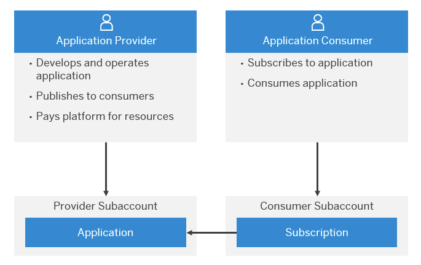
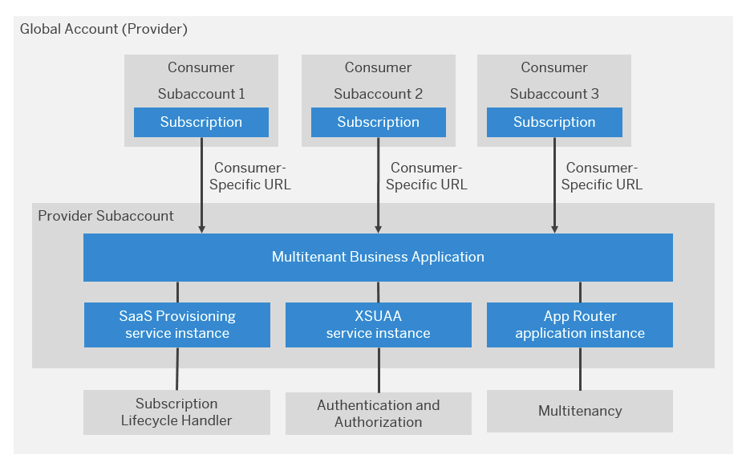
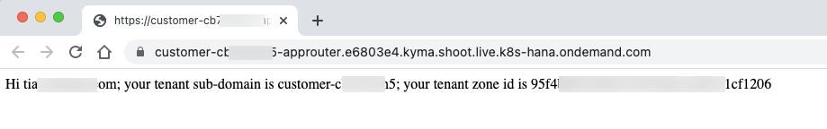
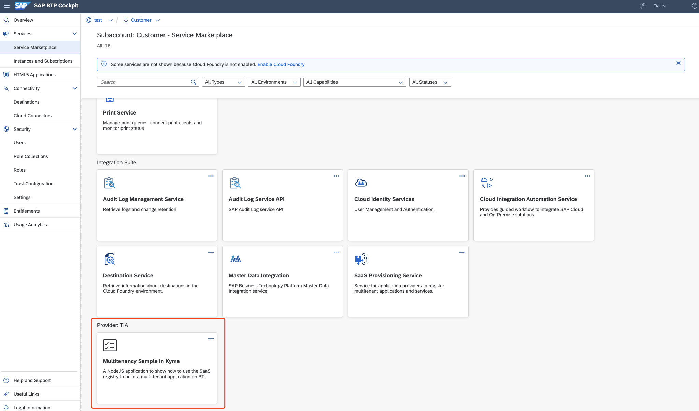

# Introduce Multitenant Application Development on SAP BTP, Kyma Runtime
<!-- description --> Introduce what is multitenancy and how to develop multitenant application on SAP BTP, Kyma Runtime.

## You will learn
- What is multitenancy
- How does multitenancy work for the application consumer
- What is the workflow of developing multitenant application

---

### Multitenancy

In the Kyma environment, you can develop and run multitenant applications, and share them with multiple consumers simultaneously on SAP BTP.

SAP BTP provides a multitenant functionality that allows application providers to own, deploy, and operate tenant-aware applications for multiple consumers, with reduced costs.

With tenant-aware applications, you can:

- Separate data securely for each tenant
- Save resources by sharing them among tenants
- Update applications efficiently, in a single step

> For more details, please visit SAP Help Portal: [Multitenancy](https://help.sap.com/products/BTP/65de2977205c403bbc107264b8eccf4b/5e8a2b74e4f2442b8257c850ed912f48.html?locale=en-US).

### How Does Multitenancy Work for the Application Consumer

For a consumer to use a tenant-aware application on SAP BTP, the application owner must ensure that each consumer:

1. <u>Has a dedicated subaccount</u> in the application provider's global account.

2. <u>Subscribes to the application</u> using either the SAP BTP cockpit, SAP BTP command-line interface, or a dedicated REST API.
> A subscription means that there is a direct relationship between an application provider and the consumer's tenant. The application provider authorizes the consumer tenant to use the application.

3. <u>Receives a dedicated URL</u> so that its business users can access the application
> As with any application running in SAP BTP, these multitenant applications consume platform resources, such as compute units, structured and unstructured storage, and outgoing bandwidth. The costs for these consumed resources, and those of the application consumer, are billed to the provider of the multitenant application.

> To gain a deeper understanding of the architecture, please read this [blog](https://blogs.sap.com/2018/09/26/multitenancy-architecture-on-sap-cloud-platform-cloud-foundry-environment/).

### Sample Scenario

**Persona**: <u>Multitenant Application Provider</u>

Let's assume you are a multitenant application provider, for example: `Provider: TIA`. `Provider: TIA` would like to provide an application that displays the logged-in user's name and customer's tenant-related information, shown as below:

<!-- border -->

**Persona**: <u>Customer</u>

A consumer can subscribe to the multitenant application through the SAP BTP Account Cockpit.

<!-- border -->

### Workflow of Developing Multitenant Application

- Create and Configure the Approuter Application for a Multitenant Application in the Kyma Runtime
- Secure a Multitenant Application with the Authorization and Trust Management Service (XSUAA) in the Kyma Runtime
- Implement Subscription callbacks for a Multitenant Application in the Kyma Runtime
- Register a Multitenant Application to the SAP SaaS Provisioning Service in the Kyma Runtime
- Deploy a Multitenant Application to a Provider subaccount, Kyma Runtime
- Subscribe a Multitenant Application by a Consumer

---
