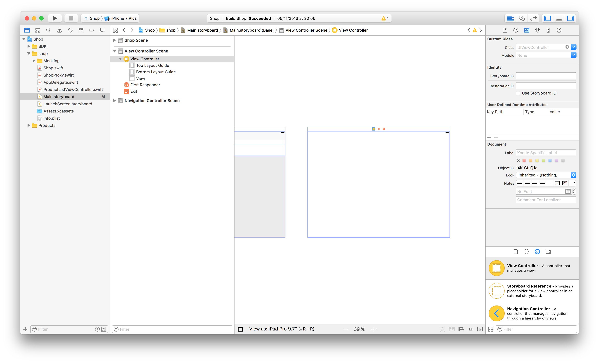
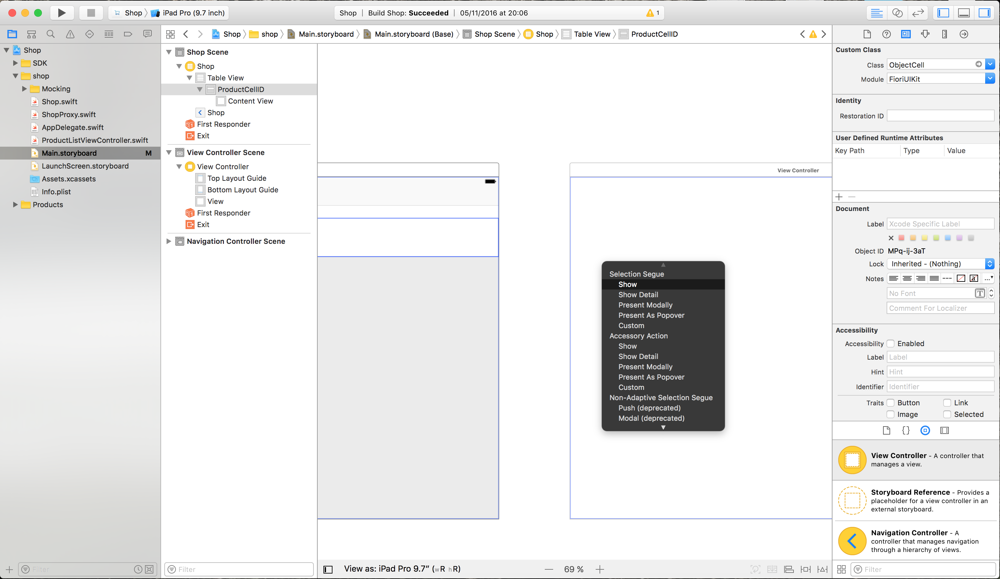
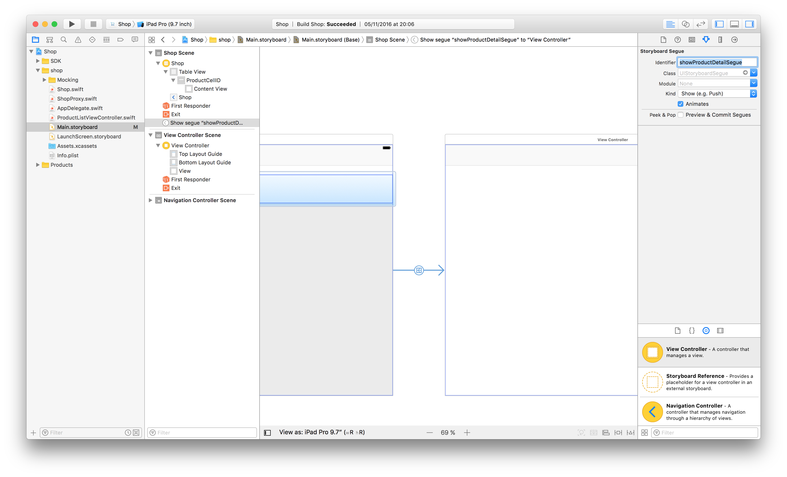
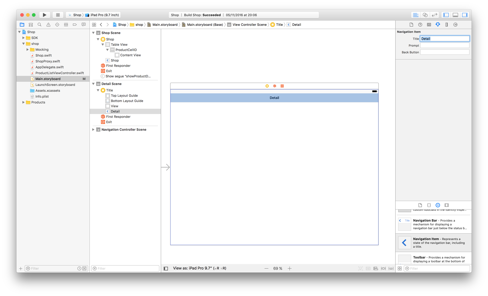
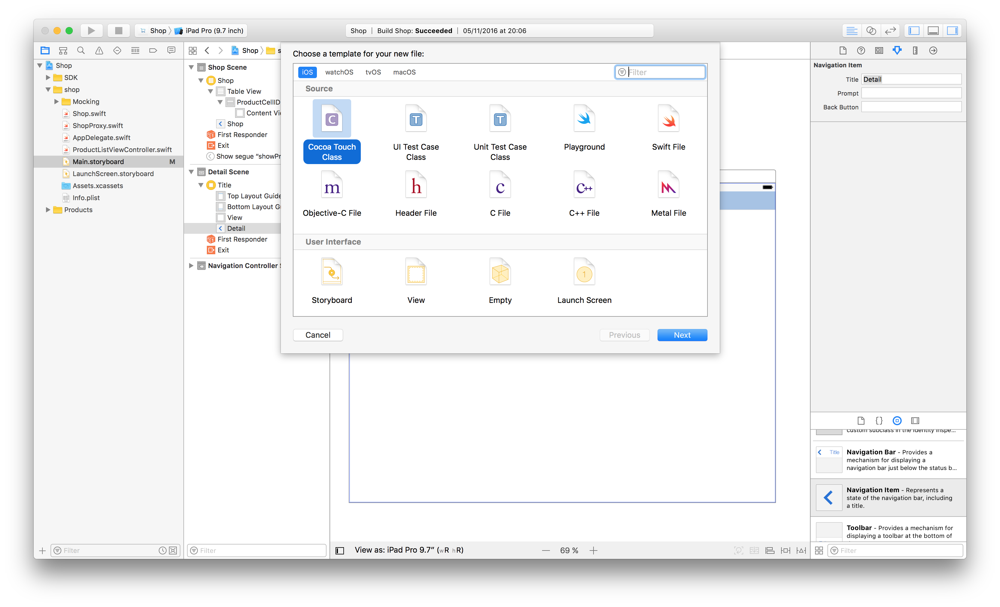
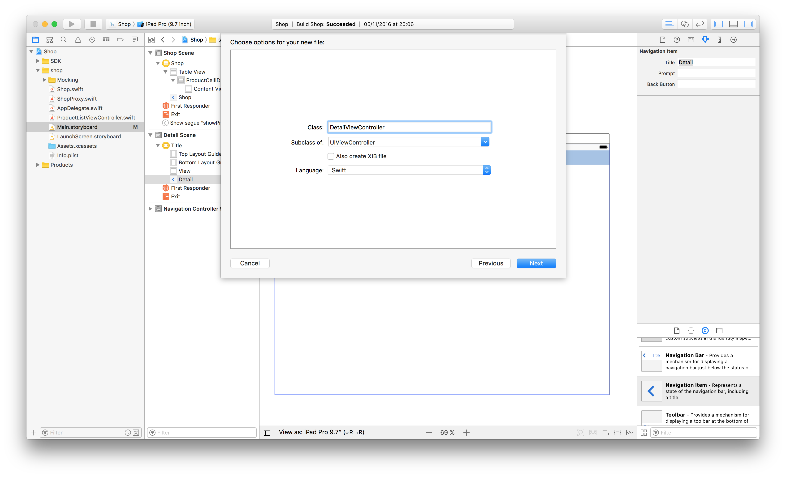
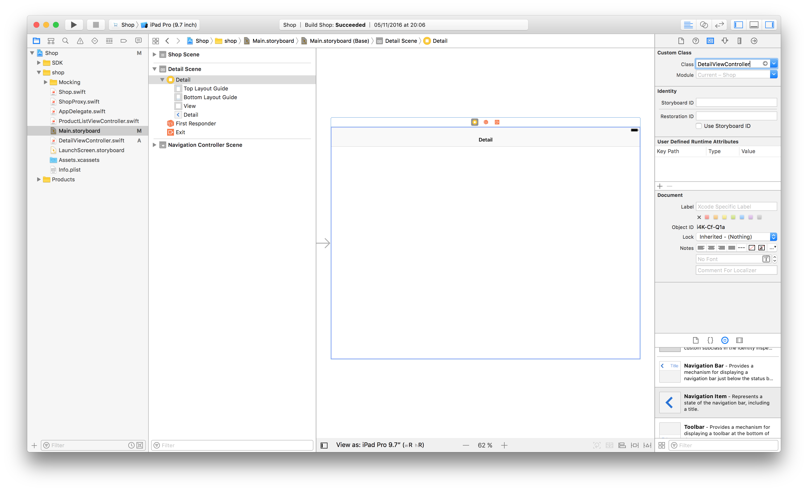
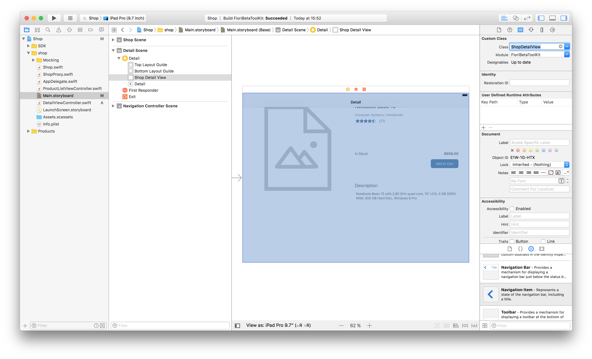
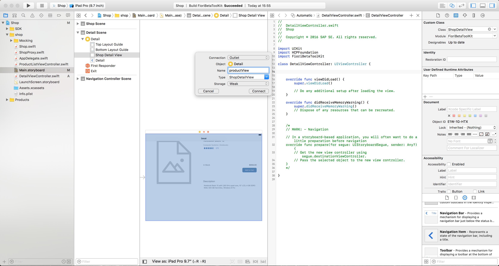
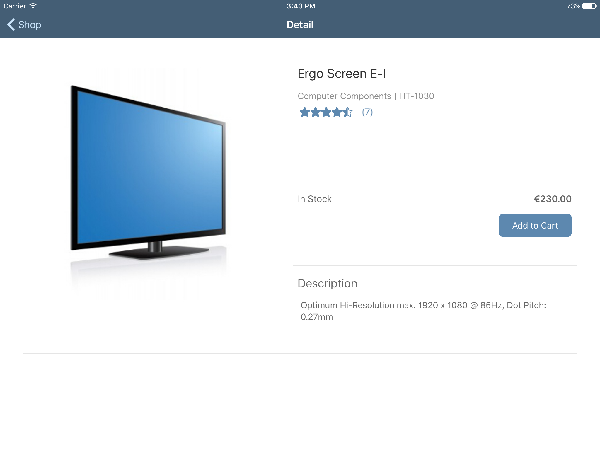

## Prerequisites  
 - **Proficiency:** Beginner
 - **Tutorials:** [Load product data from SAP HANA Cloud Platform](http://go.sap.com/developer/tutorials/ios-shopping-load-data.html)

## Next Steps
 - Select a tutorial from the [Tutorial Navigator](http://go.sap.com/developer/tutorial-navigator.html) or the [Tutorial Catalog](http://go.sap.com/developer/tutorials.html)

## Details
### You will learn  
In this tutorial you will implement the display of product details by adding a new view and a navigation from the product list to the new details view.

### Time to Complete
**10 Min**.

---

[ACCORDION-BEGIN [Step 1: ]( )]

Select `Main.storyboard` in the **Project Navigator** and drag a new **View Controller** from the Object library to the storyboard.



[DONE]
[ACCORDION-END]

[ACCORDION-BEGIN [Step 2: ]( )]

Select the prototype cell of the `ShopTableViewController` and control-drag from the cell to the new `ViewController`. Once you dropped on the new **View Controller** you will be asked which segue type you want to create. Select **Show**.



[DONE]
[ACCORDION-END]


[ACCORDION-BEGIN [Step 3: ]( )]

Now select the created segue and set the **Identifier** in the **Attribute Inspector** to `showProductDetailSegue`.



[DONE]
[ACCORDION-END]


[ACCORDION-BEGIN [Step 4: ]( )]

Next drag and drop a new **Navigation Item** from the Object library onto the new **View Controller** and change the title in the **Attribute Inspector** to `Detail`.



[DONE]
[ACCORDION-END]


[ACCORDION-BEGIN [Step 5: ]( )]

Create a new Swift file to implement the logic for the `Detail Scene`. Create a new file and make sure you select **`Cocoa Touch Class`** in the **iOS** section. Click **Next**.



[DONE]
[ACCORDION-END]


[ACCORDION-BEGIN [Step 6: ]( )]

For class name enter `DetailViewController` and make sure it is a subclass of `UIViewController` and the selected language is `Swift`. 

You will not need an additional `XIB` file, so make sure it’s not selected. Click **Next** to create the file.



[DONE]
[ACCORDION-END]


[ACCORDION-BEGIN [Step 7: ]( )]

As you can see, Xcode created the `DetailViewController.swift` file and already added some functions for you to use later. For now you will add two additional import statements and also create the logger for this `view` controller.

```swift
import UIKit
import HCPFoundation
import FioriBetaToolKit
class DetailViewController: UIViewController {
    let logger = Logger.shared(withName: "DetailViewController")
    ...
```


[DONE]
[ACCORDION-END]


[ACCORDION-BEGIN [Step 8: ]( )]

Open `Main.storyboard` from the **Project Navigator** and select the **Detail Scene**. Now set the **Custom class** in the **Identity Inspector** to `DetailViewController`. Click **Return** to accept and validate the input. Now the **Module** should be automatically updated to `Current - Shop`.



[DONE]
[ACCORDION-END]


[ACCORDION-BEGIN [Step 9: ]( )]

Next select the **View** in the **Detail Scene** set it’s **Custom class** to `ShopDetailView`. Again hit return and the Module should be automatically be updated to `FioriBetaToolKit`.




[DONE]
[ACCORDION-END]


[ACCORDION-BEGIN [Step 10: ]( )]

Now open the **Detail Scene** using the **Assistant Editor**. Control-drag the **Product View** to the `DetailViewController.swift` and create an `Outlet` named `productView`.




[DONE]
[ACCORDION-END]


[ACCORDION-BEGIN [Step 11: ]( )]

Switch back to the **Standard Editor** and select the `DetailViewController.swift` in the **Project Navigator**. Add a local variable named `product` of type `Product`.

```swift
var product: Product!
```

[DONE]
[ACCORDION-END]


[ACCORDION-BEGIN [Step 12: ]( )]

Next implement the function `updateValues()`. This function will set the values of the product to the respective properties of the `shopDetailView`. In addition we will create an empty function `addToShoppingCart()` which will be used later on to add the product to the shopping cart. The registration for the event is already implemented in `updateValues()`.

```
    func updateValues() {
        guard let currentProduct = self.product else {
            return
        }
        
        OperationQueue.main.addOperation {
            self.productView.titleText = currentProduct.name
            self.productView.subhead1Text = currentProduct.mainCategoryName
            self.productView.subhead2Text = currentProduct.id
            self.productView.availabilityText = currentProduct.stockAvailability()
            self.productView.priceText = currentProduct.formattedPrice()
            self.productView.infoText = currentProduct.description
            self.productView.rating = CGFloat(currentProduct.averageRating.floatValue())
            self.productView.numberOfRatings = currentProduct.ratingCount
            
            self.productView.addToCartButton.addTarget(self, action: #selector(self.addToShoppingCart(_:)), for: .touchUpInside)
            
            currentProduct.loadImage { image, error in
                if let error = error {
                    self.logger.warn("Error while loading image.", error: error)
                }

                self.productView.previewImage = image
            }
        }
    }
```

[DONE]
[ACCORDION-END]


[ACCORDION-BEGIN [Step 13: ]( )]

Now we need to make sure that the function `updateValues()` is called every time the product variable is set. Update the definition of the local product variable as below.

 ```
 var product: Product! {
     didSet {
         updateValues()
     }
 }
 ```

[DONE]
[ACCORDION-END]


[ACCORDION-BEGIN [Step 14: ]( )]

Select the `ProductListViewController.swift` and add a new function which is called before the segue is executed. Here we can pass a reference of the selected product to the `DetailViewController` so that the product is shown on the Detail View.

```
override func prepare(for segue: UIStoryboardSegue, sender: Any?) {
    if segue.identifier == "showProductDetailSegue" {
        if let detailController = segue.destination as? DetailViewController,
           let selectedRow = sender as? ObjectCell {
             let selectedIndexPath = self.tableView.indexPath(for: selectedRow)!
             let selectedProduct = self.products[selectedIndexPath.row]
             detailController.product = selectedProduct
         }
     }
 }
 
```

[DONE]
[ACCORDION-END]


[ACCORDION-BEGIN [Step 15: ]( )]

Run your application.



[DONE]
[ACCORDION-END]


## Next Steps
 - Select a tutorial from the [Tutorial Navigator](http://go.sap.com/developer/tutorial-navigator.html) or the [Tutorial Catalog](http://go.sap.com/developer/tutorials.html)
