## Prerequisites
- Basic knowledge of REST, APIs and Postman
- Followed the Tutorial [Install Postman Rest Client](api-tools-postman-install)
- You have installed and setup [MQTT Box](https://github.com/workswithweb/MQTTBox)
- You have licensed SAP Internet of Things (with the new capacity unit based licensing introduced in August 2020, your company has a Cloud Platform Enterprise Agreement or Pay-As-You-Go for SAP BTP and you have subscribed to the `oneproduct` service plan)
- You have setup the subscription for SAP IoT in your global account in a tenant (e.g. in the DEV tenant, the guide for the basic setup is at [Get Started with Your SAP IoT Account](https://help.sap.com/viewer/195126f4601945cba0886cbbcbf3d364/latest/en-US/bfe6a46a13d14222949072bf330ff2f4.html) ).
- Your SAP User has at a minimum the `iot_role_collection` created during onboarding of your tenant and the associated roles (see [SAP Help on Providing Authorizations in SAP IoT](https://help.sap.com/viewer/195126f4601945cba0886cbbcbf3d364/latest/en-US/2810dd61e0a8446d839c936f341ec46d.html ) )
 - You have created an empty `package` in SAP Internet of Things (see [SAP Help on Creating a Package](https://help.sap.com/viewer/e057ad687acc4d2d8f2893609aff248b/latest/en-US/5ba36c7bc9af4576997f72d6dddfc951.html) )

## Details
### You will learn
  - How to create a Device Model
  - How to create a Thing
  - How to ingest an EPCIS event via MQTT

---

[ACCORDION-BEGIN [Step 1:](Set up Postman and retrieve OAuth token)]


You can access the SAP IoT APIs using an OAuth Token. After you subscribe your subaccount to SAP IoT, you can retrieve the client secret from the service keys you created for your subaccount.

1.    Retrieve client credentials

    Refer to this document to [retrieve Client ID and Client Secret](https://help.sap.com/viewer/fffd6ca18e374c2e80688dab5c31527f/2009a/en-US/a41c28db0cf449059d48c23fa5f7b24b.html). You can use the client credentials to retrieve the OAuth token. You can access all the APIs and data within the subaccount using this OAuth token.

2.    Set up Postman collection

    Postman is a popular and easy to use REST client which you can use to access the SAP IoT APIs. Please refer to the introduction guide for understanding the usage of Postman.

      We have provided a set of sample Postman collections on GitHub for you to download. Please clone or download/unzip the repository [sap-iot-samples](https://github.com/SAP-samples/sap-iot-samples/tree/master/iot-autoid-services-samples). The Postman collections and environment (in folder `iot-autoid-services-samples`) includes all the API calls used in the tutorials of this tutorial group and the payload structures for the same. Import both into your Postman.


3.    Generate OAuth token

    To retrieve the OAuth token, you must do the following:

      - Update the tenant name (your subaccount name - for example, trainingf954d) to the `tenant_name` Postman environment variable.

      - Update the `uaadomain` from the service key to `uaadomain` Postman environment variable.

      - Copy the Client ID and Client Secret from the service key you generated in your subaccount into the `client_id` and `client_secret` Postman environment variables.

      - You can retrieve the `OAuth` token by using the Postman collection (iot-auto-id-samples) and triggering the request **Step 1: GET OAuth Token**.

      - Update the generated token to `LoginToken1` Postman environment variable appending 'Bearer' at the beginning. For accessing the SAP IoT APIs, enter this OAuth token as an authorization header in the Postman calls (the script in **Tests** should take care of this for you).

      !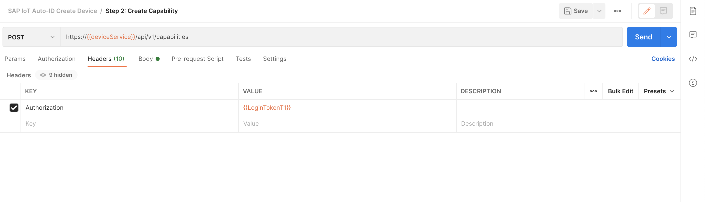

> You can refer to the [SAP Help Portal](https://help.sap.com/viewer/fffd6ca18e374c2e80688dab5c31527f/latest/en-US/7b3a94e68be9460680a915138a160c67.html) to create an OAuth Token if you would like to understand the steps for generating the token in detail.

[DONE]
[ACCORDION-END]


[ACCORDION-BEGIN [Step 2: ](Create device model and generate certificate)]

In order to create a digital twin of a physical asset (e.g. a RFID scanner that generates EPCIS Events) in the SAP Internet of Things system, the Device entity needs to be onboarded. This is done by creating a Device Model, which includes four entities: Capability, Sensor Type, Device, and Sensor. The following steps will guide you through this setup. For more information on the Device Model see [SAP Help Portal on IoT Device Connectivity](https://help.sap.com/viewer/104567de4c2547a4ac32ba9b362e60ec/latest/en-US/2b5ac1ae2bf843d691ed763a96b10712.html)

  1.  Update the `deviceService` URL in the Postman environment. You can find it in the service key you generated in your subaccount, for example **`iot-device-connectivity-noah-live.cfapps.eu10.hana.ondemand.com`**

  2.  Trigger the request **Step 2.1 Create Capability** and copy the **"id"** into the Postman environment variable `CapabilityId`.

  3.  Trigger the request **Step 2.2 Create Sensor Type** and copy the **"id"** into the Postman environment variable `SensorTypeId`.

  4.  Trigger the request **Step 2.3 Create Device** and copy the **"id"** into the Postman environment variable `DeviceId`.

  5.  Trigger the request **Step 2.4 Create Sensor** and copy the **"id"** into the Postman environment variable `SensorId`.

  6.  Trigger the request **Step 2.5 GET Device Certificate**, save the content of the `secret` object and copy the content of the `pem` object into an editor of your choice (e.g. Notepad++, Atom) and safe it as **key.pem**.

    !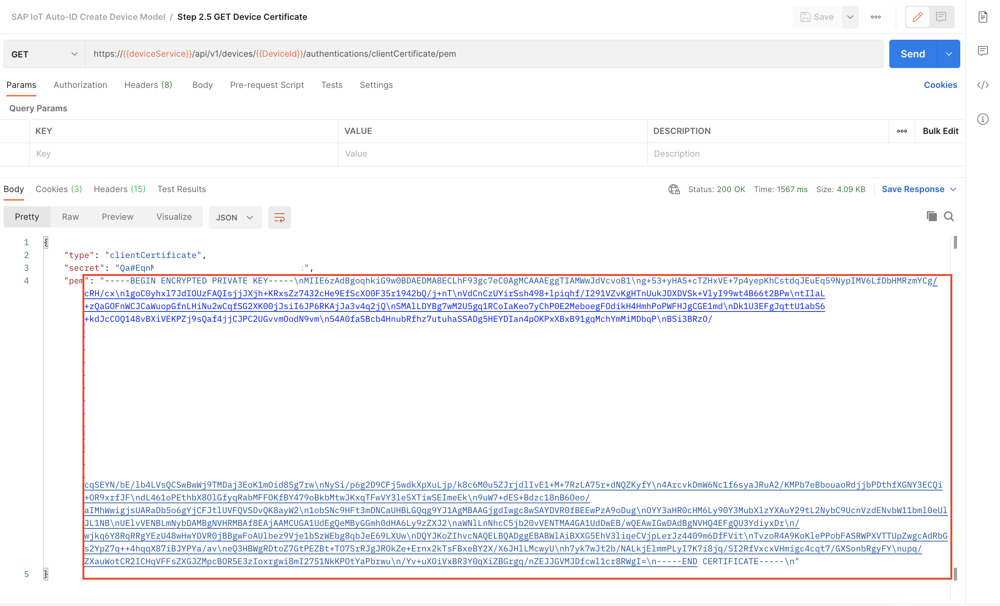

  7.  If you are running on a Unix machine (e.g. MacOS) start a terminal at the same place the **key.pem** file is stored and execute the following command `sed 's/\\n/\n/g' key.pem > key2.pem`

  8.  If you are running on a Windows machine open the **key.pem** file in an editor and replace all `\n` with line breaks using the search & replace function (Control+F) of your editor.

  The result of formatting the `.pem` file should look like this:

  !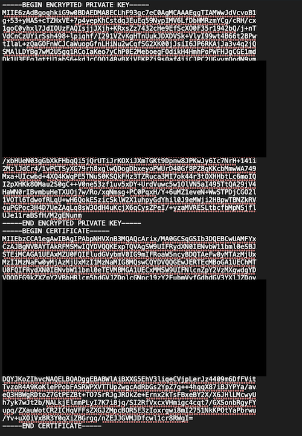

> You will use the `pem` file later on to authenticate against SAP IoT's Device Connectivity to send your EPCIS Event via MQTT.

[DONE]
[ACCORDION-END]

[ACCORDION-BEGIN [Step 3: ](Create thing property and thing type)]
Open the Fiori launchpad of your SAP Internet of Things tenant and navigate to the **Thing Engineer OData** tab and open the app **Thing Modeler**

  1.   Open your **Package** (in this example a package with name  `sap.tutorial` is used ) in the **Select Package** dialog.

  2.   Create a new **Thing Type** **`epcis`** and **Save**

  3.   Open the **Thing Properties Catalog**:

      !

  4.   Create a new **Property Set** called **`epcis_data`** of type **Measured Values**

      !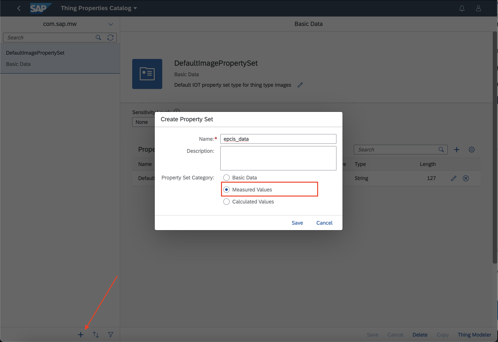

  5.  Add a new **Measured Value** **`eventxml`** of type **Large String**

      !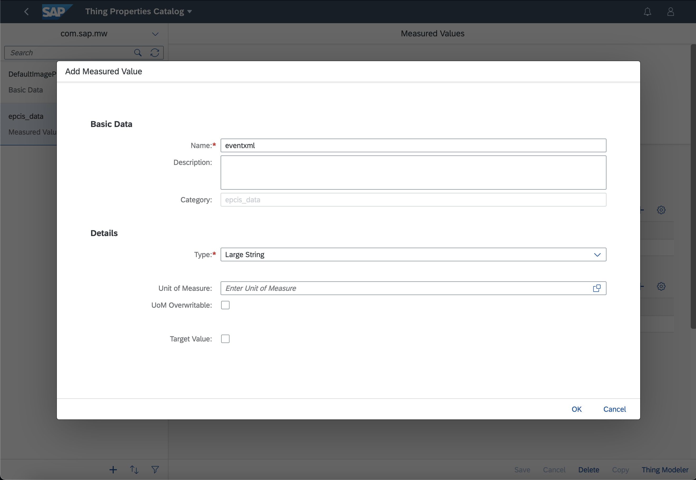

  6.  **Save** the created **Thing Property** and switch back to the **Thing Modeler**

  7.  On your **Thing Type** `epcis` switch to the **Measured Values (0)** tab and click **+** to add your property set `epcis_data`

      !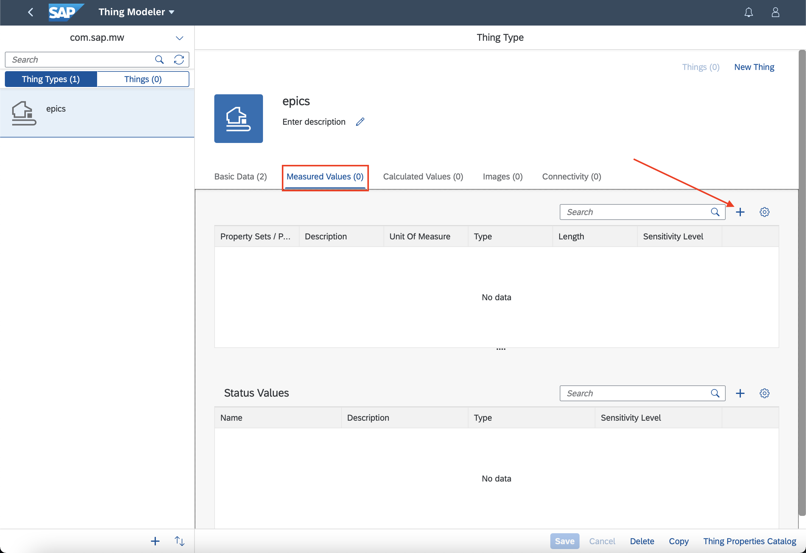

  8. Finally **Save** the **Thing Type**

At the end the result should look like this:

!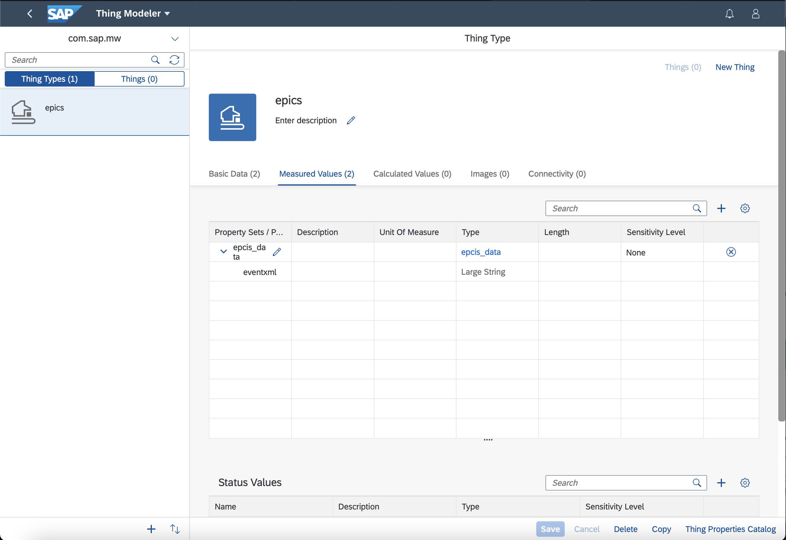


> Ensure that the property is called `eventxml`

[DONE]
[ACCORDION-END]

[ACCORDION-BEGIN [Step 4: ](Create mapping in thing type)]
Open the Fiori launchpad of your SAP Internet of Things tenant and navigate to the **Thing Engineer OData** tab and open the app **Thing Modeler**

  1.   Open the **Package** `sap.tutorial` in the **Select Package** dialog.

    !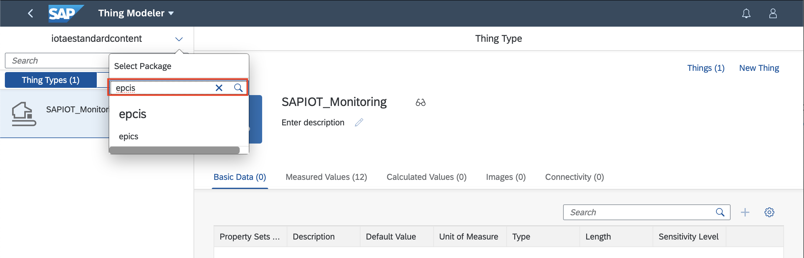

  2. On the **Thing Type** `epcis` switch to the tab **Connectivity** and select `SAP Cloud Platform IoT Service for Cloud Foundry Environment`.

    !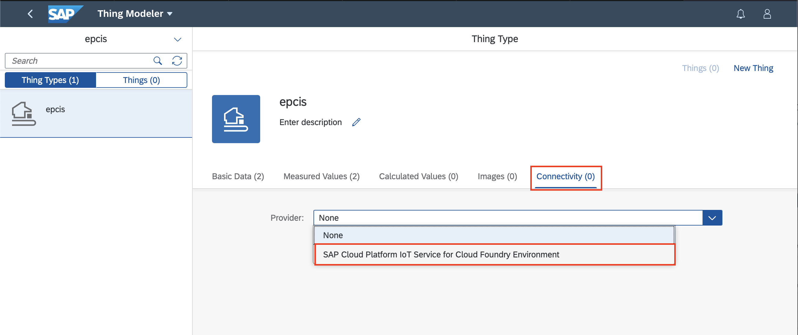

  3. Create a new **Mapping** called **`epcis_mapping`**, select your **Sensor Type** created previously and map the Property `eventxml` to your **Device Property** `eventxml` and **Save** it.

    !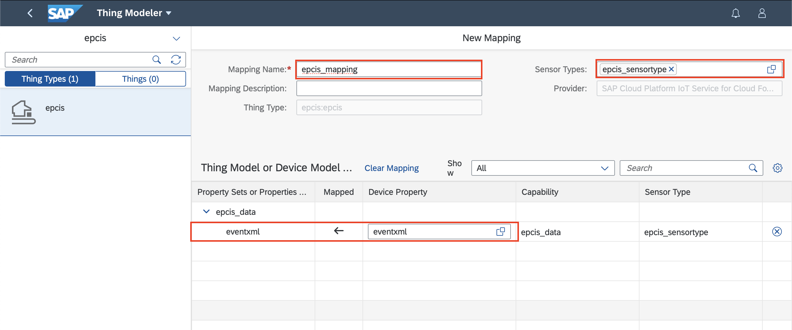

At the end the result you look like this:

!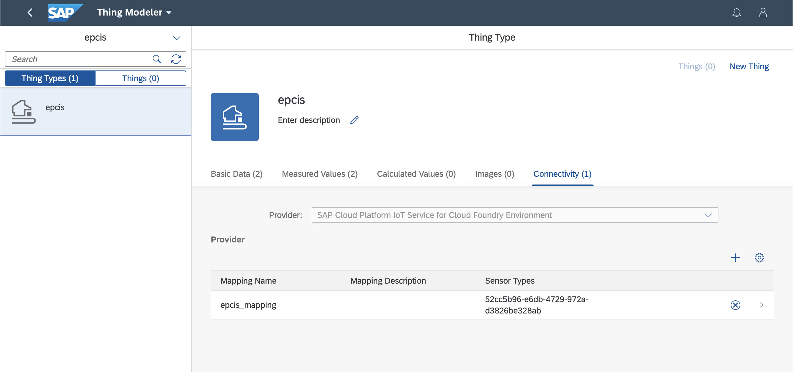

[DONE]
[ACCORDION-END]

[ACCORDION-BEGIN [Step 5: ](Create thing and assign device)]
Open the Fiori launchpad of your SAP Internet of Things tenant and navigate to the **Thing Engineer OData**, open the app **Thing Modeler** and select again the `epcis` package.

  1. Switch to the **Things** tab and create a new Thing. Provide an appropriate name (e.g. **`epcis_scanner`** ) and description and select `epcis` as **Thing Type** and choose `TENANT_ROOT` as Authorization Group and **Save**.

    !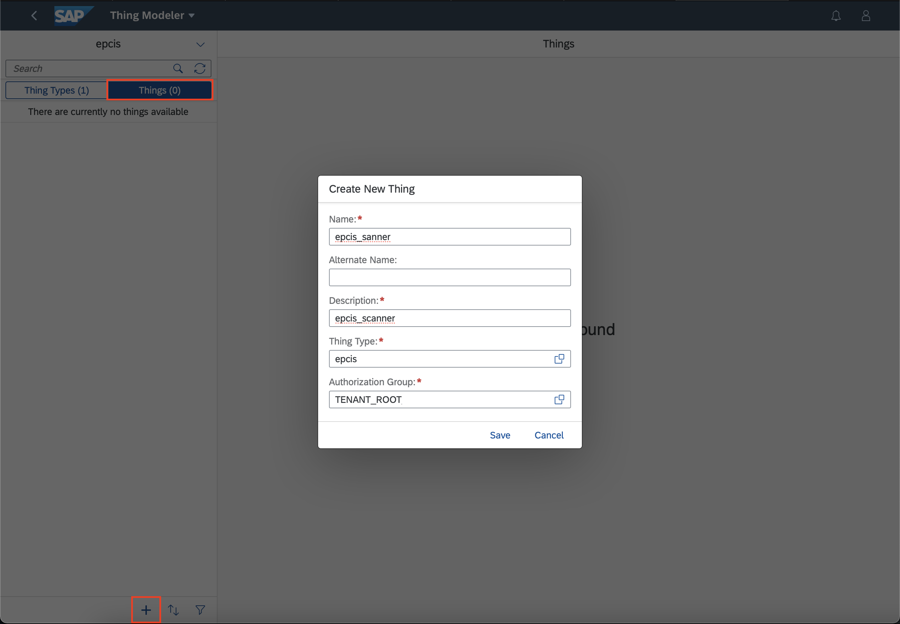

  2. On the **Thing** `epcis_scanner` switch to the tab **Connectivity** and select `SAP Cloud Platform IoT Service for Cloud Foundry Environment`.

    !

  3. Select your **Mapping** and **Sensor** and **Save** the changes.

    !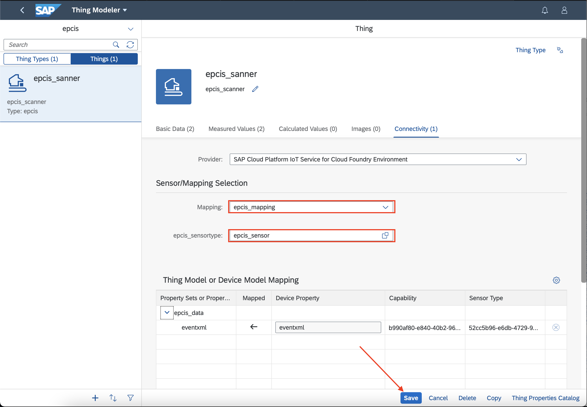

[DONE]
[ACCORDION-END]

[ACCORDION-BEGIN [Step 6: ](Set up MQTT box)]

Start the `MQTTBox` application and click on **Create MQTT Client**. Maintain the following fields in the **MQTT Client Setting**:

> For more information see [SAP Help Portal on Sending Data with MQTT](https://help.sap.com/viewer/5ada15f8efb64fccad30b87f1d94a068/latest/en-US/7c1018348c7743a8abb950f6d82a4159.html)

|  Property Name  | Value
|  :------------- | :-------------
|  MQTT Client Id           | Your Device `alternateId` (e.g. **`epcis_scanner`**)
|  Host                     | MQTT iot-device-connectivity endpoint which you can retrieve from your service key (e.g. **`1234556-1234-12345-h4563-93193ad8348.eu10.cp.iot.sap:8883`** )
|  Protocol                 | `mqtts / tls`
|  Client key passphrase    | `secret` saved in Step 2
|  Client certificate file  | Your **key.pem** file
|  Client key file          | Your **key.pem** file
|  Append timestamp to MQTT client id? | `No`
|  Auto connect on app launch? | `No`

The configurations should look similar to this:

!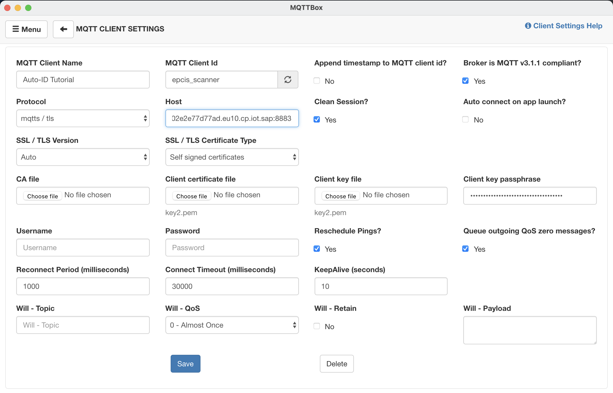

Now you can **Save** the Configuration and the status should switch to **Connected**. You now need to maintain the **Topic to subscribe** and the **Topic to publish**:

  - **Topic to subscribe:** **`ack/<DEVICE_ALTERNATE_ID>`**

  - **Topic to publish:** **`measures/<DEVICE_ALTERNATE_ID>`**


Furthermore you can test if your Device Model is setup correctly and the MQTT connection works by sending a test message as array of JSON objects where the name of each property (e.g. `eventxml` ) defined in the capability is the key. You should see a **code 202** message on the subscribed topic.

If you have used the `alternateIds` maintained in the Postman collection you can use this example payload:

```JSON

{
  "capabilityAlternateId": "epcis_data",
  "sensorAlternateId": "epcis_sensor",
  "measures": [
    {
      "eventxml": "test"
    }
  ]
}

```

!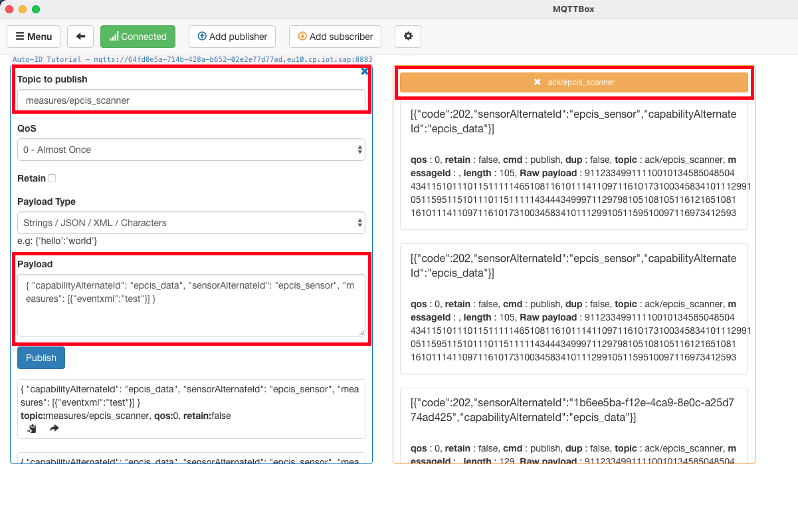


[DONE]
[ACCORDION-END]

[ACCORDION-BEGIN [Step 7: ](Ingest EPCIS event)]
Once you have established the connection you can try to send an EPCIS Event via MQTT. To do so you have to escape the the XML format based EPCIS and send it is value of `eventxml`. Here you can find an example payload:

```JSON

{
  "capabilityAlternateId": "epcis_data",
  "sensorAlternateId": "epcis_sensor",
  "measures": [
    {
      "eventxml":"<?xml version=\"1.0\" encoding=\"UTF-8\"?>\r\n<epcis:EPCISDocument\r\n    xmlns:epcis=\"urn:epcglobal:epcis:xsd:1\">\r\n    <EPCISBody>\r\n        <EventList>\r\n            <ObjectEvent>\r\n                <readPoint>\r\n                    <id>Reader_02<\/id>\r\n                <\/readPoint>\r\n                <epcList>\r\n                    <epc>urn:epc:id:sscc:0614141.1234567890<\/epc>\r\n                <\/epcList>\r\n                <bizStep>urn:epcglobal:cbv:bizstep:shipping<\/bizStep>\r\n                <disposition>urn:epcglobal:cbv:disp:in_progress<\/disposition>\r\n            <\/ObjectEvent>\r\n        <\/EventList>\r\n    <\/EPCISBody>\r\n<\/epcis:EPCISDocument>"
    }
  ]
}

```

You can see the result of the ingestion in the **Measured Values** tab of your Thing:

!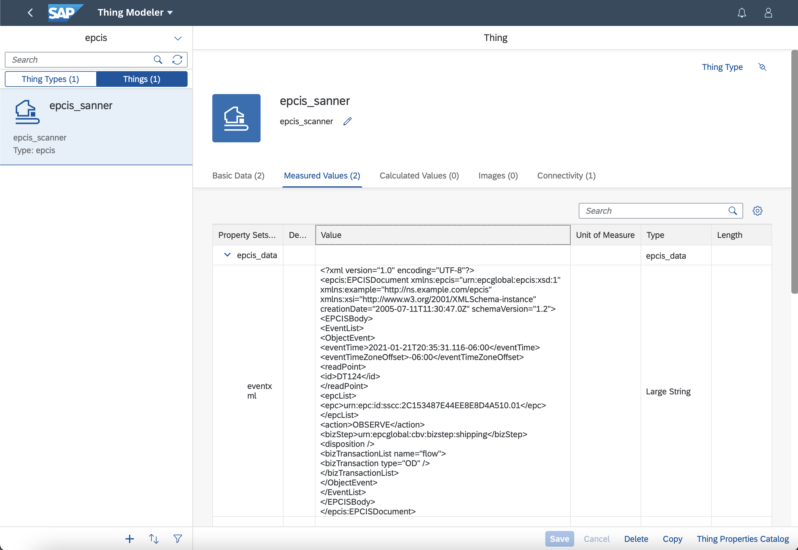

The next tutorial to consider doing might be this one to [Create the Destinations for Kanban APIs](iot-autoid-kanban-destination)

[VALIDATE_1]
[ACCORDION-END]


---
