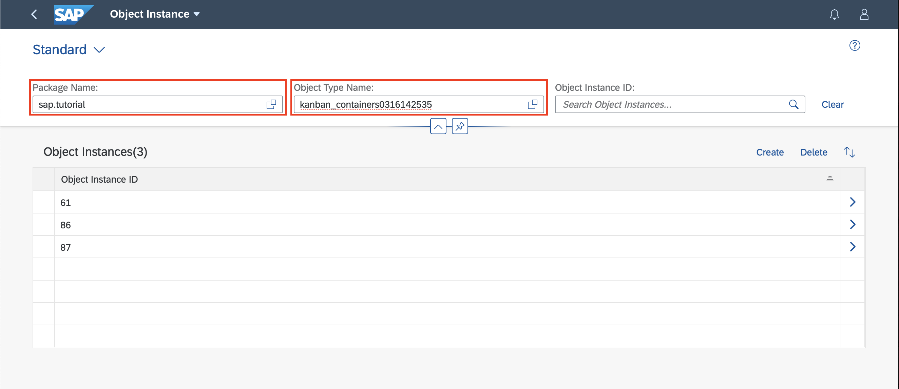
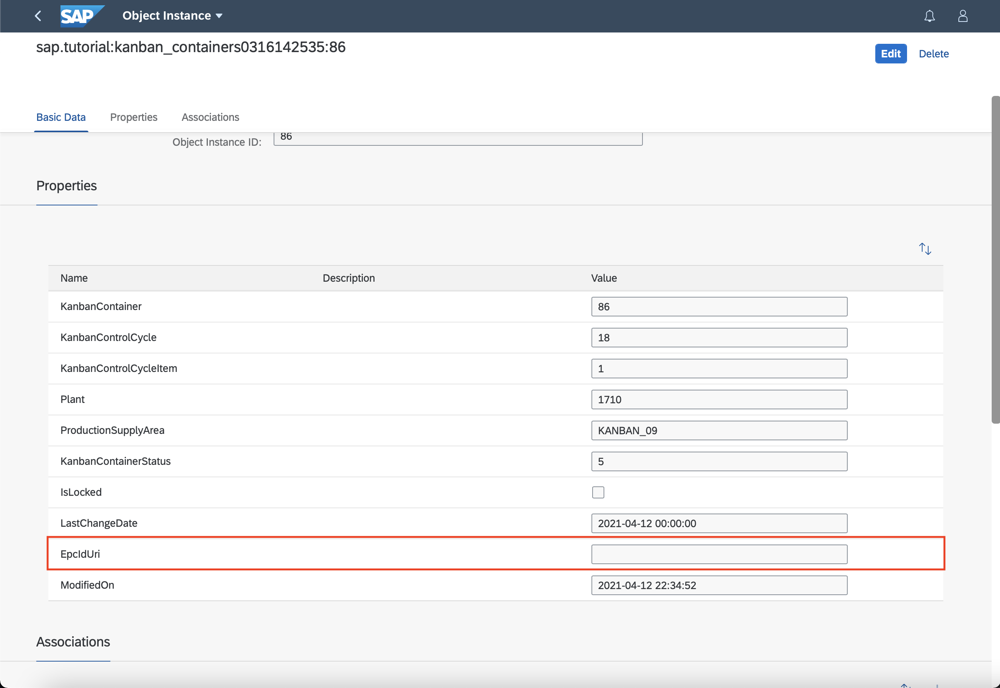
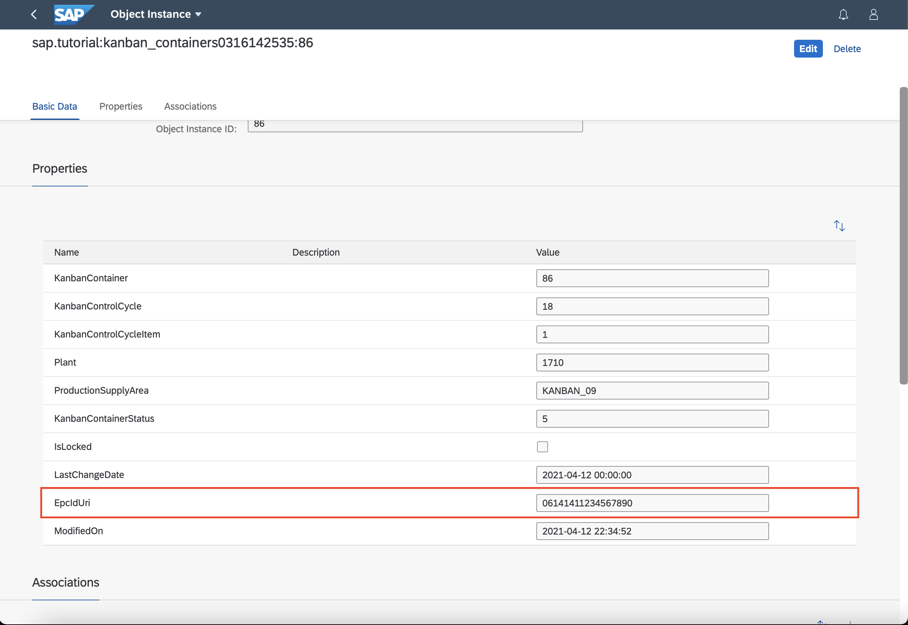
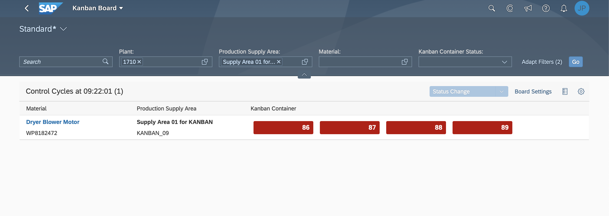
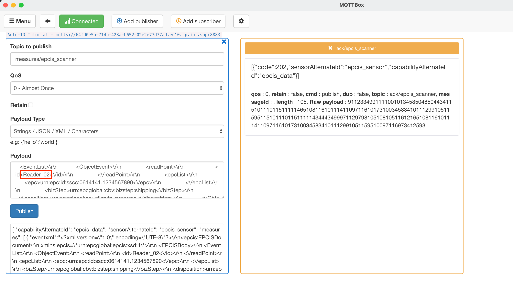
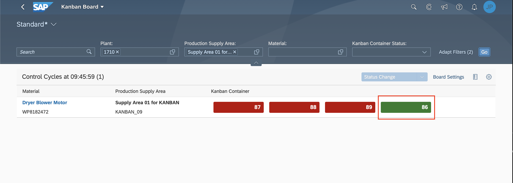
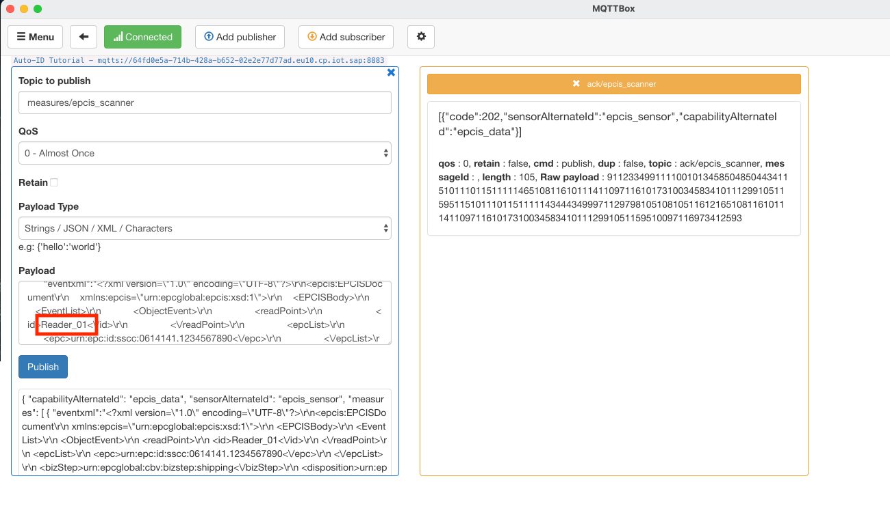
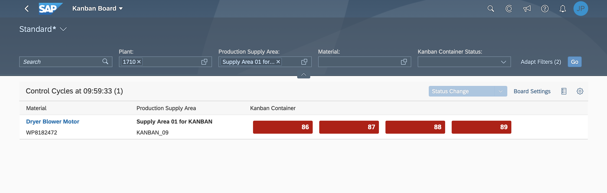

 
## Prerequisites
- You have licensed SAP Internet of Things (with the new capacity unit based licensing introduced in August 2020, your company has a Cloud Platform Enterprise Agreement or Pay-As-You-Go for SAP BTP and you have subscribed to the `oneproduct` service plan)
- You have setup the subscription for SAP IoT in your global account in a tenant (e.g. in the DEV tenant, the guide for the basic setup is at [Get Started with Your SAP IoT Account](https://help.sap.com/viewer/195126f4601945cba0886cbbcbf3d364/latest/en-US/bfe6a46a13d14222949072bf330ff2f4.html) ).
- Your SAP User has at a minimum the `iot_role_collection` created during onboarding of your tenant and the associated roles (see [SAP Help on Providing Authorizations in](https://help.sap.com/viewer/195126f4601945cba0886cbbcbf3d364/latest/en-US/2810dd61e0a8446d839c936f341ec46d.html ) )
- You have created and setup the kanban **Business Context Hierarchy** and **Auto-ID Event Enrichment** using the [Activate Kanban Business Template](iot-autoid-kanban-bt) and [Adjust the Business Context Hierarchy for Kanban](iot-autoid-kanban-dls) tutorials.
- You have created destinations for the kanban APIs as described in [Create Destinations for Kanban APIs](iot-autoid-kanban-destination)
- You have created your custom kanban Event, Rule Project and Action as described in [Create custom Kanban Event, Rule Project and Action](iot-autoid-kanban-custom-event)
- You have access to your SAP S/4HANA Cloud system and your user has a role collection assigned the includes the Business Catalog `SAP_SCM_BC_KNBN_MNTRG_MC`
- You have access to your SAP S/4HANA system and your user has a role collection assigned the includes the Business Catalog `SAP_SCM_BC_KNBN_MNTRG`

## Details
### You will learn
  - How to maintain the EPC ID of you business object instance
  - How to ingest an EPCIS Event that triggers an kanban container status update
  - How to review the kanban container status in SAP S/4HANA or SAP S/4HANA Cloud

---

[ACCORDION-BEGIN [Step 1: ](Update kanban container object instances)]
Open the Fiori launchpad and navigate to the **Custom Master Data** tab and open the app **Object Instances** and filter for your **Package** and **Object Type Name** (name of your `Business Context Object Type`):

!

  1.    Navigate to one of the **Object Instances**:
        !

  2.    Change the `EPC ID URI` to the id that you have maintained in the `epc` tag of both XML snippets above (e.g. **`06141411234567890`** ):
        !

[DONE]
[ACCORDION-END]

[ACCORDION-BEGIN [Step 2: ](Adjust EPCIS XML)]

This is an example of an EPCIS Event in XML format:

```XML[7,10]
<?xml version="1.0" encoding="UTF-8"?>
<epcis:EPCISDocument xmlns:epcis="urn:epcglobal:epcis:xsd:1">
    <EPCISBody>
        <EventList>
            <ObjectEvent>
                <readPoint>
                    <id>Reader_01</id>
                </readPoint>
                <epcList>
                    <epc>urn:epc:id:sscc:0614141.1234567890</epc>
                </epcList>
                <bizStep>urn:epcglobal:cbv:bizstep:shipping</bizStep>
                <disposition>urn:epcglobal:cbv:disp:in_progress</disposition>
            </ObjectEvent>
        </EventList>
    </EPCISBody>
</epcis:EPCISDocument>

```
Copy this XML snippet to an editor of your choice as have to adjust line 7 and 10 to your needs. Create two copies of the snippet and adjust the `readPoint` in one copy to **`Reader_01`** and in the second to **`Reader_02`**  (see [Create custom kanban Event, Rule Project and Action](iot-autoid-kanban-custom-event) for more details)

You can adjust the value in the `epc` tag if you would like to do so. In the `epc` tag the identifier of the kanban containers is maintained (e.g. SSCC, SGTIN or LGTIN).

Save both XML snippets for later use and continue with the next step.

[DONE]
[ACCORDION-END]


[ACCORDION-BEGIN [Step 3: ](Ingest EPCIS event via MQTT)]
Escape both XML snippets (e.g. using a JSON String Escape tool) and copy it into the value of `eventxml` in the MQTT JSON Payload. The result will look similar to the two JSON examples below.

Use the following payload to set the status of your kanban container to `2 - empty container with replenishment`:

``` JSON

{
  "capabilityAlternateId": "epcis_data",
  "sensorAlternateId": "epcis_sensor",
  "measures": [
    {
      "eventxml":"<?xml version=\"1.0\" encoding=\"UTF-8\"?>\r\n<epcis:EPCISDocument\r\n    xmlns:epcis=\"urn:epcglobal:epcis:xsd:1\">\r\n    <EPCISBody>\r\n        <EventList>\r\n            <ObjectEvent>\r\n                <readPoint>\r\n                    <id>Reader_01<\/id>\r\n                <\/readPoint>\r\n                <epcList>\r\n                    <epc>urn:epc:id:sscc:0614141.1234567890<\/epc>\r\n                <\/epcList>\r\n                <bizStep>urn:epcglobal:cbv:bizstep:shipping<\/bizStep>\r\n                <disposition>urn:epcglobal:cbv:disp:in_progress<\/disposition>\r\n            <\/ObjectEvent>\r\n        <\/EventList>\r\n    <\/EPCISBody>\r\n<\/epcis:EPCISDocument>"
    }
  ]
}

```

Use the following payload to set the status of your kanban container to `5 - full container`:

``` JSON

{
  "capabilityAlternateId": "epcis_data",
  "sensorAlternateId": "epcis_sensor",
  "measures": [
    {
      "eventxml":"<?xml version=\"1.0\" encoding=\"UTF-8\"?>\r\n<epcis:EPCISDocument\r\n    xmlns:epcis=\"urn:epcglobal:epcis:xsd:1\">\r\n    <EPCISBody>\r\n        <EventList>\r\n            <ObjectEvent>\r\n                <readPoint>\r\n                    <id>Reader_02<\/id>\r\n                <\/readPoint>\r\n                <epcList>\r\n                    <epc>urn:epc:id:sscc:0614141.1234567890<\/epc>\r\n                <\/epcList>\r\n                <bizStep>urn:epcglobal:cbv:bizstep:shipping<\/bizStep>\r\n                <disposition>urn:epcglobal:cbv:disp:in_progress<\/disposition>\r\n            <\/ObjectEvent>\r\n        <\/EventList>\r\n    <\/EPCISBody>\r\n<\/epcis:EPCISDocument>"
    }
  ]
}

```


[DONE]
[ACCORDION-END]

[ACCORDION-BEGIN [Step 3: ](Check kanban status in SAP S/4HANA Cloud)]
Open the Fiori launchpad of your SAP S/4HANA or SAP S/4HANA Cloud system and navigate to the **Kanban Monitoring** tab, open the app **Kanban Monitor** and filter on your **Production Supply Area**:

!

All kanban Containers are currently in status **empty**. By ingesting a MQTT message where `readPoint`= **`Reader_02`** the container status changes to **full**:

!

!

By ingesting a MQTT message where `readPoint`= **`Reader_01`** the container status changes to **empty** again.

!

!

[VALIDATE_1]
[ACCORDION-END]

---
