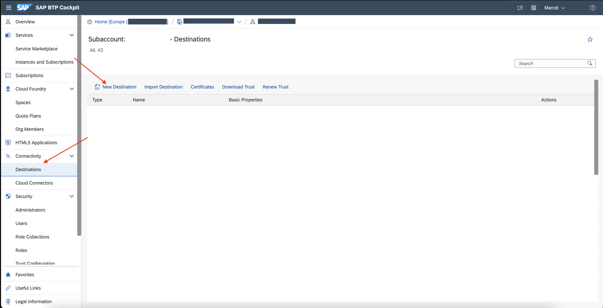
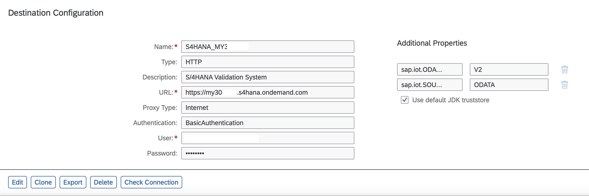

 
## Prerequisites
 - Your accounts.sap.com User has been added to this tenant as a `OrgManager`, `SpaceManager` or `SpaceDeveloper` to manage destinations.
 - Either you have setup the APIs for the `Kanban Control Cycle Integration` in your SAP S/4HANA system including SAP Cloud Connector setup. See [API Business Hub](https://api.sap.com/api/OP_API_KANBAN_CONTROL_CYCLE_SRV_0002/overview) and [SAP Help Portal on SAP Cloud Connector](https://help.sap.com/viewer/cca91383641e40ffbe03bdc78f00f681/Cloud/en-US/e6c7616abb5710148cfcf3e75d96d596.html) for further information.
 - Or you have setup the APIs for the `Kanban Control Cycle Integration` in your SAP S/4HANA Cloud system. See [API Business Hub](https://api.sap.com/api/API_KANBAN_CONTROL_CYCLE_SRV_0002/overview) for further information.

## Details
### You will learn
  - How to create a destination for retrieving kanban container from SAP S/4HANA or SAP S/4HANA Cloud
  - How to create a destination for updating the kanban container status (e.g. EMPTY, FULL, IN USE) in SAP S/4HANA or SAP S/4HANA Cloud
  - How to specify the SAP Internet of Things specific additional properties in the destination

Destinations are key building blocks in SAP Business Technology Platform, and are used to define connections for outbound communication from your application to remote systems. Here we would like to define connections to your SAP S/4HANA or SAP S/4HANA Cloud system.

---

[ACCORDION-BEGIN [Step 1: ](Create new destination)]
You will create a Destination which will allow you the read the kanban container and control cycle in upcoming tutorials:

1.    Go to your Cloud Foundry subaccount at [https://hana.ondemand.com/](https://hana.ondemand.com/), click **Connectivity** on the left panel and then click **Destinations** and **New Destination**

    !

    Under Destination Configuration, add the information of your SAP S/4HANA Cloud system.

    |  Property Name  | Value          | Remark
    |  :------------- | :------------- | :-------------
    |  Name           | **`S/4HANA_MY30000`**  | of your choice, will be used in SAP IoT Action |
    |  Type           | `HTTP` |  |
    |  Description    | **`S/4HANA Development System`**  | of your choice |
    |  URL            | **`https://my300000.s4hana.ondemand.com`** | URL of your SAP S/4HANA Cloud system or Virtual Host for SAP S/4HANA |
    |  Proxy Type     | `Internet` or `OnPremise`| depending on Cloud or On-premise system |
    |  Authentication | `BasicAuthentication`, `OAuth2ClientCredentials` ... | based on your setup in the Communication Arrangement or Cloud Connector |

2.    Choose **New Property** under Additional Properties and add the following properties:

    |  Property Name    | Value
    |  :-------------   | :-------------
    |  `sap.iot.ODATA_VERSION`          | **`V2`**
    |  `sap.iot.SOURCE_TYPE`     | **`ODATA`**

3.    Check `Use default JDK truststore` and **Save** the Destination.

You destination should look similar to this one at the end:

!

> Further information on Destinations and supported Authentication methods see [SAP Help Portal of Internet of Things](https://help.sap.com/viewer/fbf2583f7bcf47fcb5107bf4d358770e/latest/en-US/87ec372e20ea48ba9843fc60a4723895.html) and [SAP Help Portal of SAP BTP Connectivity](https://help.sap.com/viewer/cca91383641e40ffbe03bdc78f00f681/Cloud/en-US/42a0e6b966924f2e902090bdf435e1b2.html)

[DONE]
[ACCORDION-END]

[ACCORDION-BEGIN [Step 2: ](Create destination for kanban status change)]

 Create a second Destination which will allow you to update the kanban container status. You will invoke it in upcoming tutorials to create an **Action** in SAP Internet of Things.

1. Go again to your Cloud Foundry subaccount click **Connectivity** on the left panel and then click **Destinations** and **New Destination**.

2. Under **Destination Configuration**, add the information according to your SAP S/4HANA Cloud Kanban Control Cycle Integration setup:

    |  Property Name  | Value          | Remark
    |  :------------- | :------------- | :-------------
    |  Name           | **`S/4HANA_MY30000`**  | of your choice, will be used in SAP IoT Action |
    |  Type           | `HTTP` |  |
    |  Description    | **`S/4HANA Development System`**  | of your choice |
    |  URL            | **`https://my300000.s4hana.ondemand.com/sap/opu/odata/sap/API_KANBAN_CONTROL_CYCLE_SRV;v=0002/SetKanbanContainerStatus?KanbanContainer='^{lastValue(${Rule_Output.KanbanContainer})}'&KanbanContainerStatus='^{lastValue(${Rule_Output.KanbanContainerStatus})}'`** | URL to the kanban APIs incl. placeholder tokens of your SAP S/4HANA Cloud system or Virtual Host for SAP S/4HANA |
    |  Proxy Type     | `Internet` or `OnPremise`| depending on Cloud or On-premise system |
    |  Authentication | `BasicAuthentication`, `OAuth2ClientCredentials` ... | based on your setup in the Communication Arrangement or Cloud Connector |

    > The placeholder tokens `^{lastValue(${Rule_Output.KanbanContainer})}` and `^{lastValue(${Rule_Output.KanbanContainerStatus})}'` are being replaced at runtime of Actions in SAP Internet of Things with the actual values. In this case with the values of your kanban container ID and status of your Custom Event Type `Rule_Output` which you will create in an upcoming tutorial.
    For further information see [SAP Help on Creating an Action](https://help.sap.com/viewer/1ab61090ec4c4c779cd4360372ab95b5/latest/en-US/4f3f9a4388fa4df8b55260a8deca1c0d.html)

3. Choose **New Property** under Additional Properties and add the following properties:

    |  Property Name    | Value |     Remark
    |  :-------------   | :-------------
    |  `sap.iot.etagURL`          | **`https://my300000.s4hana.ondemand.com/sap/opu/odata/sap/API_KANBAN_CONTROL_CYCLE_SRV;v=0002/A_KanbanContainer('^{lastValue(${Rule_Output.KanbanContainer})}')`** | URL to the kanban APIs incl. placeholder tokens of your SAP S/4HANA Cloud system or Virtual Host for SAP S/4HANA |
    |  `sap.iot.XcsrfURL`     | **`https://my300000.s4hana.ondemand.com/sap/opu/odata/sap/API_KANBAN_CONTROL_CYCLE_SRV;v=0002/A_KanbanContainer('^{lastValue(${Rule_Output.KanbanContainer})}')`** | URL to the kanban APIs incl. placeholder tokens of your SAP S/4HANA Cloud system or Virtual Host for SAP S/4HANA |

    > The property `sap.iot.etagURL` retrieves and adds an `ETag` Token during Action execution. It is an identifier for a specific version of a resource and helps to prevent simultaneous updates of a resource from overwriting each other.

    > SAP systems are often requiring a `CRSF` token. The destination definition can be enhanced using the property `sap.iot.XcsrfURL` to retrieve and add it during the Action execution.

4. Check **Use default JDK truststore** and **Save** the Destination.

The next tutorial to consider doing might be this one to activate kanban Business Template in the Smart Sensing Services of SAP Internet of Things: [Activate Kanban Business Template](iot-autoid-kanban-bt)

[VALIDATE_2]
[ACCORDION-END]

---
