## Prerequisites
 - Your tenant is onboarded in or after SAP IoT 2010b release.
 - You created an application and a device model using the tutorial [Create Application and Device Model](iot-model-create).
 - You onboarded virtual device and enabled the device to send data using the tutorial [Onboard Virtual Devices and have them send Data Continuously](iot-onboard-device).
   <ul> <li>For testing purpose, you can ingest data for a week so that you have a considerable amount of data for further analysis.</li></ul>

## Details
### You will learn
  - How to initiate time series data export
  - How to download the `.csv` file
  - How to import data into a table using SAP HANA Database Explorer
  - How to execute SQL query on the time series data

For data analytics or machine learning scenarios, there is a need to extract time series data for a longer duration spanning across multiple months or years.  You can export time series data and derived data to a file format GZIP, so that the data can be used as is without any need for de-serialization logic.

---

[ACCORDION-BEGIN [Step 1: ](Initiate time series data export)]

>To learn how to call an API using Postman, see [Call SAP IoT APIs with Postman](iotae-api-postman).

>For more information about the time series data export APIs, see [Export Time Series Data](https://help.sap.com/viewer/fffd6ca18e374c2e80688dab5c31527f/2012b/en-US/48394008958d468c95d1e9bd85c73121.html) in SAP Help Portal.

1. In Postman, choose the **POST** method.

2. Enter the following request URL to initiate time series data export: `https://coldstore-export-sap.cfapps.eu10.hana.ondemand.com/v1/InitiateDataExport/iot.training.f954.d.com.sap.silo9960:silo_status?timerange=2020-12-01-2020-12-07`.

    The method after successfully initiating the data export, will display a request ID in the response header.

      - The data to be exported must be less than or equal to 7GB. If the data is beyond 7GB, you must export the data in multiple requests by splitting the date range.
      - The date range should be greater than 48 hours and less than 365 days.

      For better understanding of the property set type name in the request URL, refer the below table:


    | Text | Description |
    |--------|-------------|
    |`iot.training.f954.d`|Assume your tenant namespace is iot-training-f954-d. The package name must be prefixed with tenant namespace and the hyphen is replaced with dot.|
    |`com.sap.silo9960`|Unique identifier of the package|
    |`silo_status`|Name of the property set type|

    For more information about the naming convention of property set type, see [Create a Property Set Type](https://help.sap.com/viewer/fffd6ca18e374c2e80688dab5c31527f/2012b/en-US/7e40790cad924439be08981c745f615b.html).

3. In Postman, choose the **GET** method.

4. Enter the following request URL to know the status of the initiated data export: `https://coldstore-export-sap.cfapps.eu10.hana.ondemand.com/v1/DataExportStatus?requestId=0B003FE2F4DE43FC810E041CD4FD5D14`.

    - If the method returns the status with the following message, you can proceed with the download of data:

    ```JSON

    {
        "RequestId": "0B003FE2F4DE43FC810E041CD4FD5D14",
        "Status": "The file is available for download."
    }
    ```
    - The possible status messages that you could see are as follows:

    | Status | Description |
    |------|--------------|
    |Initiated|The request is placed successfully.|
    |Submitted|The request for data export is initiated and the method is retrieving the data and preparing for the export process.|
    |Failed|The request for data export failed due to various reasons. The reasons are listed in the response payload.|
    |Exception|The system retried to initiate the data export but failed.|
    |Ready for Download|The request for data export succeeded and the data is available in a file format for download.|
    |Expired|The data that is ready for download is available only for seven days, beyond which the exported data is not available for download. You should re-initiate the request for data export.|

5. In Postman, choose the **GET** method.

6. Enter the following request URL to download the data: `https://coldstore-downloader-sap.cfapps.eu10.hana.ondemand.com/v1/DownloadData('0B003FE2F4DE43FC810E041CD4FD5D14')`.

    Click the **Send and Download** button instead of the **Send** button.

    The method prompts you to choose a folder path to save the `*.zip` file. By default, the name of the zip file is same as the time range provided in the initiate data export request. For example, `2020-12-01-2020-12-07.zip`.

7. Use the **WinZip** application to extract the content of the `.zip` files.
The extracted file will be a `*.gz` file.

8.	Use the **7-zip** application to extract the contents of the `.gz` file.

    The extracted files are `.csv` files. Each `.csv` file corresponds to the respective epoch days for which the data for the requested property set type is available.

[VALIDATE_1]
[ACCORDION-END]


[ACCORDION-BEGIN [Step 2: ](Import data into SAP HANA database)]

1. Create a database in your SAP HANA trial account following Step 1-3 in the tutorial [Choose an SAP HANA Database](hana-clients-choose-hana-instance).

    After creating the database, you are now ready to import the data in the `*.csv` file into SAP HANA Database.

2. In **SAP HANA Database Explorer**, right click the database name and select **Import Data** from the context menu.

    !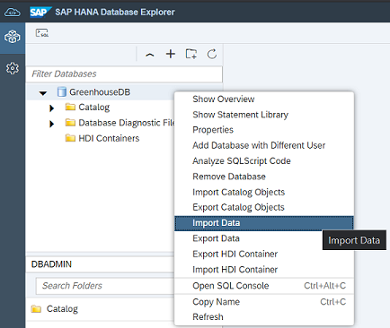

    The **Import Data** wizard appears.

3. Choose **Import Data** in the **IMPORT TYPE** tab.

    !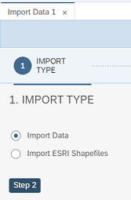

4. Click the **Step 2** button.

5. Select the source of data from the **Import Data From** dropdown list.

    !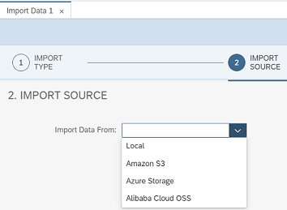

    - In this tutorial, the source data is available in the local system. Hence, the next step is to navigate to the folder where the `*.csv` file is available.

    !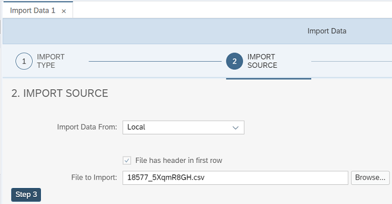

6. Click the **Step 3** button.

7. You can import the data into a new table or an existing table. In this tutorial, the data is imported into a new table.

    - Select the **Create a new table** option in the **IMPORT TARGET** tab.
    - Select **DBADMIN** for the **Schema** and enter a table name.

     !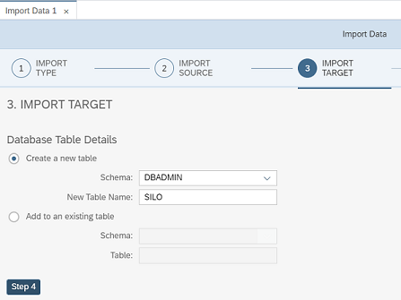

8. Click the **Step 4** button.

9. In the **TABLE MAPPING** tab, you configure the  mapping between the column names in the `*.csv` file and the database.

    - Use the arrow keys to include or exclude the columns in the database.
    - Define the data type and data length for the columns that will be included in the database table. The following image illustrates the column names included in the database and the data type chosen.

      !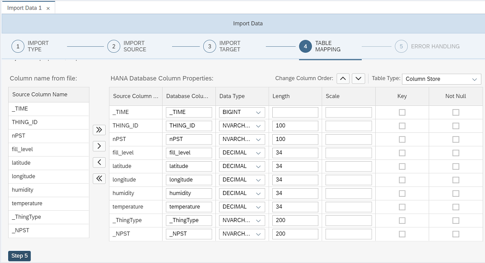

10. Click the **Step 5** button.

11. Choose the appropriate error handling option in the **ERROR HANDLING** tab.

      !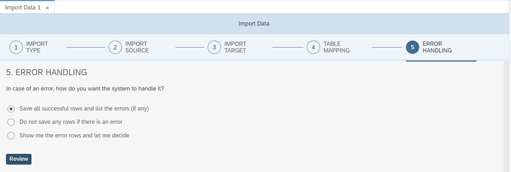

12. Click the **Review** button  to preview the import.

      !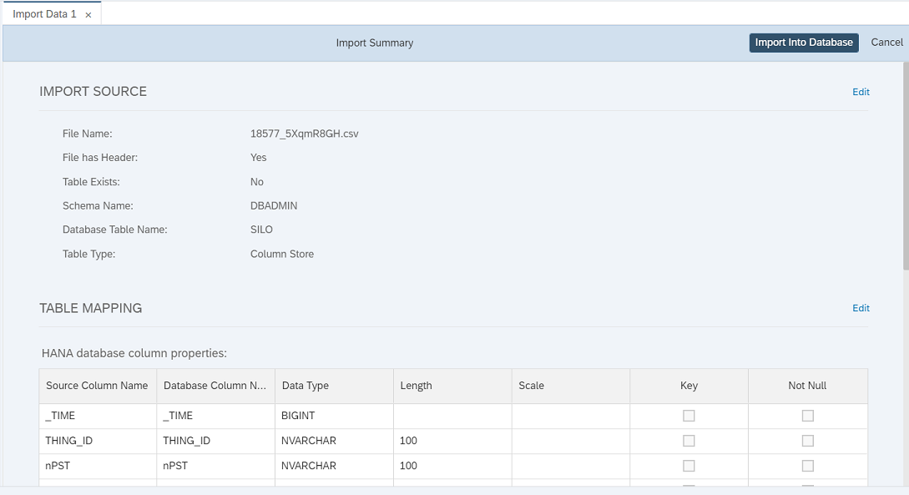

13. Click the **Import Into Database** button. The data is imported into the specified table and the import status is displayed.

      !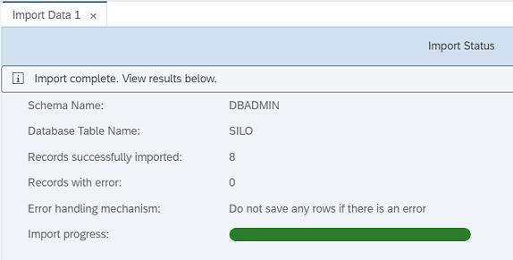

14. You can now access the table and the data that is imported into the table.


[DONE]
[ACCORDION-END]

[ACCORDION-BEGIN [Step 3: ](Analyze data using SQL Query)]

1. In **SAP HANA Database Explorer**, you can run SQL queries on data using **SQL Console**. Open the **SQL Console** using the icon.

    !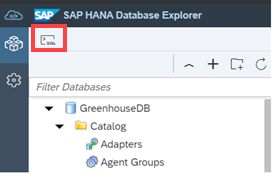

    Following are the example SQL queries and the result data fetched:

    **Example 1**: Select all rows from the table `SILO`.

    ```SQL
    Select * from SILO;
    ```

    !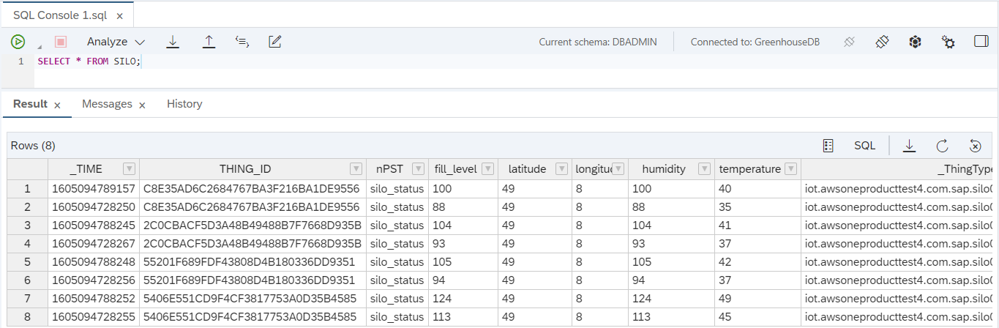

    **Example 2**: Select list of things and temperature from the table `SILO` where the temperature value is greater than 40

    ```SQL
    Select THING_ID, "temperature" from SILO where "temperature" > 40
    ```

    !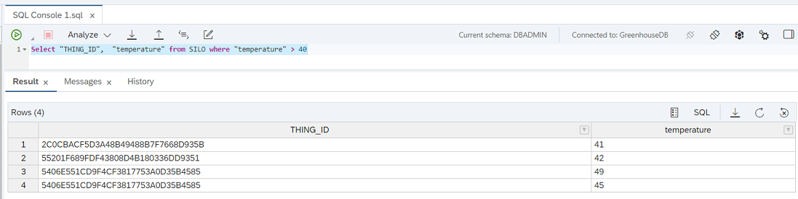

    **Example 3**: Select list of things from the table `SILO` with maximum temperature value for every thing ID.

    ```SQL
    Select THING_ID,  Max("temperature") from SILO group by THING_ID
    ```

    !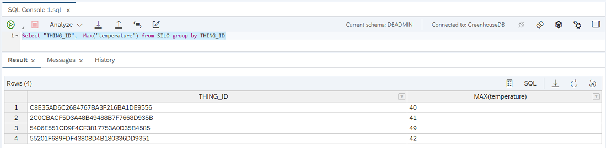

    **Example 4**: Select list of things from the table `SILO` along with their minimum timestamp value.

    ```SQL
    Select THING_ID, Min (ADD_SECONDS (TO_TIMESTAMP ('1970-01-01 00:00:00'), "_TIME" / 1000.0)) from SILO group by THING_ID
    ```

    !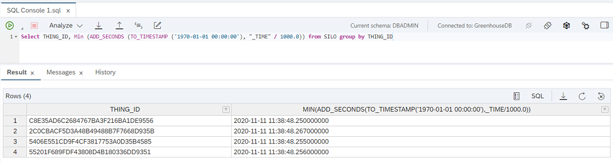

2. In the left pane, expand **`GreenhouseDB`**, then **Catalog** and then choose **Tables**.

    - If the schema is not selected, you may have to select the **DBADMIN** schema.

    - The table you created appears in the left pane.

3. Click the table name in the left pane. The column details of the selected table appears in the right pane.

4. Click the **Open Data** button.

    !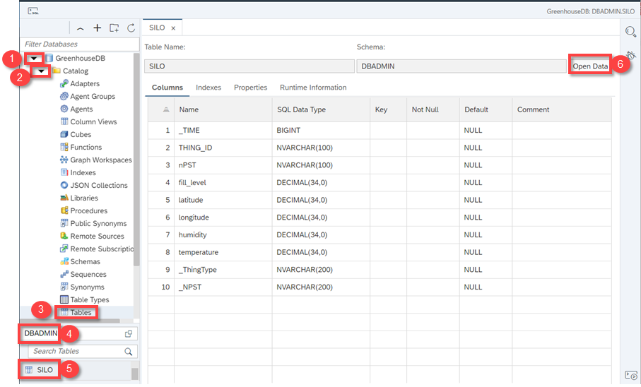

    The data stored in the table is displayed.

    !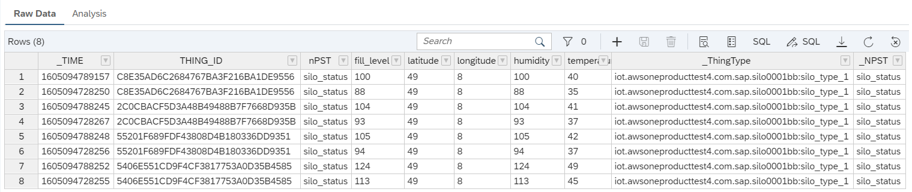

5. In **SAP HANA Database Explorer**, you can use the **Analysis** tab to display the data in graphical representation. Click the **Analysis** tab.
6. In the **Analysis** tab, drag and drop one or more fields into the **Label Axis** frame and **Value Axis** frame.

    !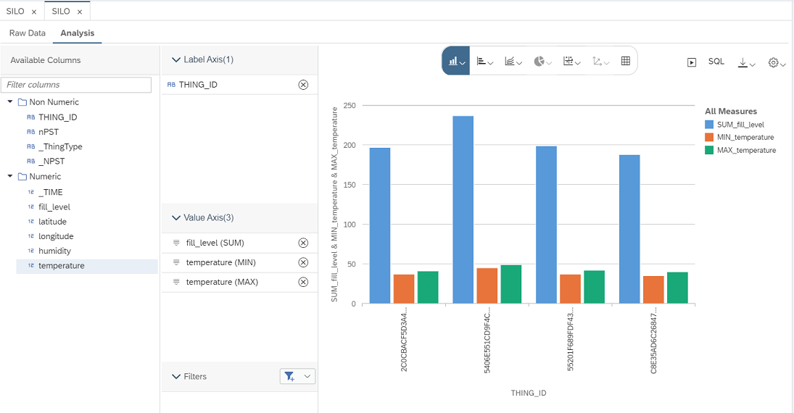

    For each field, you can change the function to be executed, such as minimum temperature value and sum of fill levels. Use the arrow-like button before the field name to change the function.

    !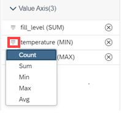

7. Click the **SQL** icon to view the corresponding SQL query which looks as follows:

    ```SQL
    SELECT TOP 1000 DISTINCT  
	"THING_ID",
	SUM("fill_level") AS "SUM_fill_level",
	MIN("temperature") AS "MIN_temperature",
	MAX("temperature") AS "MAX_temperature"
FROM "DBADMIN"."SILO"
GROUP BY "THING_ID"
ORDER BY "THING_ID" ASC
```

    In the **SQL Query** window, you have an option to copy the query to the clipboard.


[DONE]
[ACCORDION-END]

[ACCORDION-BEGIN [Step 4: ](More ways to download exported data)]

To explore more about downloading the exported data in different ways, you can go to the SAP blog [Downloading files from the Coldstore-Downloader app of SAP Internet of Things (SAP IoT)](https://blogs.sap.com/2021/01/27/downloading-files-from-the-coldstore-downloader-app-of-sap-internet-of-things-sap-iot./).

[DONE]
[ACCORDION-END]
