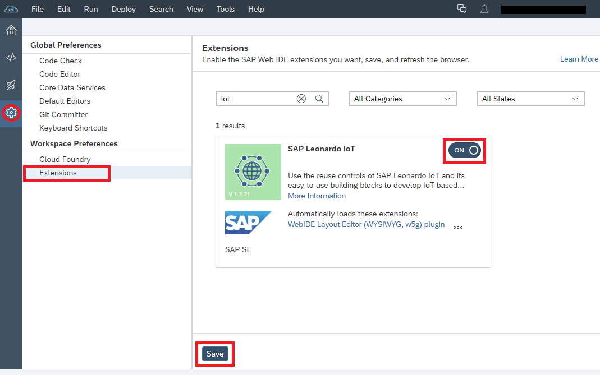
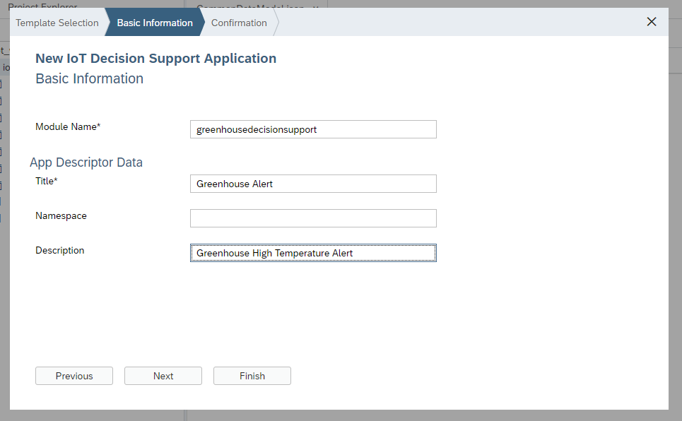
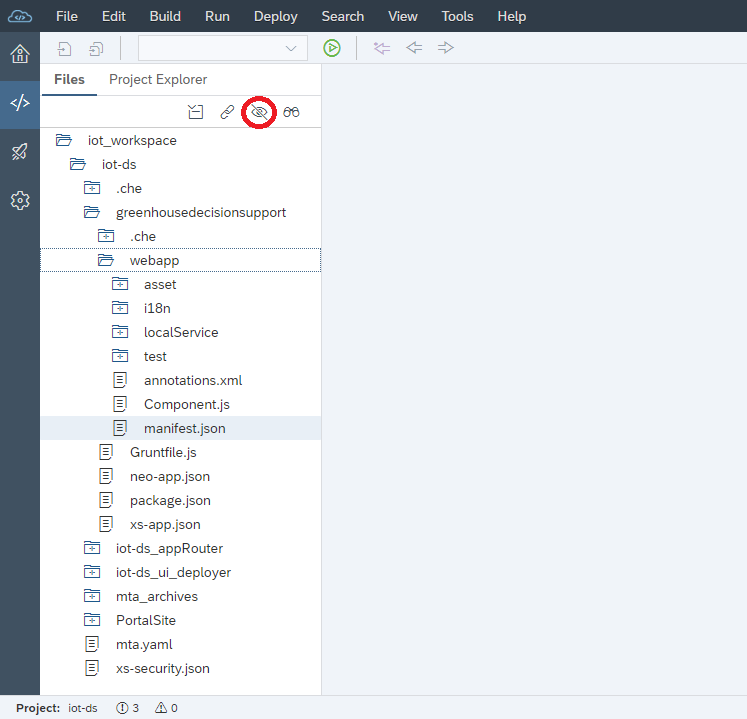
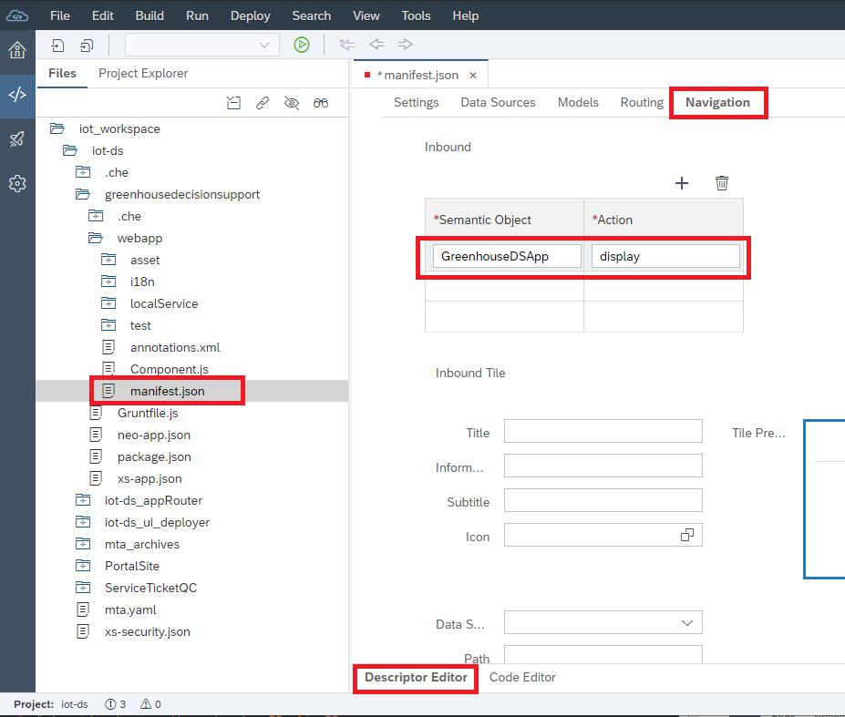
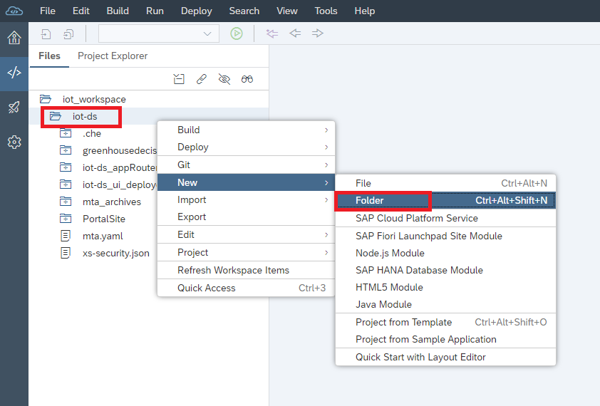

## Details
### You will learn
  - How to create a Decision Support application in SAP Web IDE

---

[ACCORDION-BEGIN [Step 1: ](Enable SAP IoT extension in SAP Web IDE)]

  1. In SAP Web IDE, go to **Preferences > Extensions**, search for `iot`.

  2. Turn on this feature.

  3. Click **Save**.

    


[DONE]
[ACCORDION-END]


[ACCORDION-BEGIN [Step 2: ](Add decision support application to MTA project)]

>If you have commented out the references to `UI Deployer` in `mta.yaml` in Step 7 of [Set up SAP Fiori launchpad in Cloud Foundry to receive Notifications](iot-ds-2-create-flp) to test notification, **please revert those changes before continuing**.

  1. Right click your MTA project and add a new HTML5 Module.  You'll reuse the MTA project created in the tutorial [Setting up the SAP Fiori launchpad in Cloud Foundry to receive Notifications](iot-ds-2-create-flp).

    

  2. Choose `IoT Decision Support Application` from the `Internet of Things` category, click **Next**.

    

  3. Enter `greenhousedecisionsupport` as a **Module Name**.

  4. Enter `Greenhouse Alert` as **Title**.

  5. Enter `Greenhouse High Temperature Alert` as **Description**.

  6. Click **Finish**.

    

  7. The SAP IoT decision support module is added to the project. Now open any of the subfolders to examine the generated source files.  You can also toggle the visibility of hidden files.

    

[DONE]
[ACCORDION-END]

[ACCORDION-BEGIN [Step 3: ](Define semantic object and action)]

1. Open the `manifest.json` file in the **Descriptor Editor**.

2. Go to **Navigation** tab, enter `GreenhouseDSApp` as the value for **Semantic Object**

3. Enter `display` as the value for **Action**.

4. From the Web IDE toolbar, click **Save** in the **File** menu to save the changes.

    

[DONE]
[ACCORDION-END]


[ACCORDION-BEGIN [Step 4: ](Create sample quick create application (part 1))]

In this step, you'll create a sample service ticket quick create application which will be one of the configured option in the decision support application for the greenhouse demo scenario. Quick create application is a SAP Fiori application based on the SAP Fiori quick create element.

This sample quick create application uses mock data.

  1. Right click the project and create a new folder with the name `ServiceTicketQC`.

    

  2. In the new folder `ServiceTicketQC`, create a new folder `webapp`.

  3. In the folder `webapp`, create two new folders named `annotations` and `data`.

    

  4. In the folder `webapp\annotations`, create a new file `annotations.xml` with the following content:

    ```XML
    <edmx:Edmx xmlns:edmx="http://docs.oasis-open.org/odata/ns/edmx" Version="4.0">
        <edmx:Reference Uri="http://docs.oasis-open.org/odata/odata-data-aggregation-ext/v4.0/cs02/vocabularies/Org.OData.Aggregation.V1.xml">
            <edmx:Include Alias="Aggregation" Namespace="Org.OData.Aggregation.V1"/>
        </edmx:Reference>
        <edmx:Reference Uri="http://docs.oasis-open.org/odata/odata/v4.0/errata03/os/complete/vocabularies/Org.OData.Capabilities.V1.xml">
            <edmx:Include Alias="Capabilities" Namespace="Org.OData.Capabilities.V1"/>
        </edmx:Reference>
        <edmx:Reference Uri="https://wiki.scn.sap.com/wiki/download/attachments/448470974/Common.xml?api=v2">
            <edmx:Include Alias="Common" Namespace="com.sap.vocabularies.Common.v1"/>
        </edmx:Reference>
        <edmx:Reference Uri="https://wiki.scn.sap.com/wiki/download/attachments/448470971/Communication.xml?api=v2">
            <edmx:Include Alias="vCard" Namespace="com.sap.vocabularies.Communication.v1"/>
        </edmx:Reference>
        <edmx:Reference Uri="http://docs.oasis-open.org/odata/odata/v4.0/errata03/os/complete/vocabularies/Org.OData.Core.V1.xml">
            <edmx:Include Alias="Core" Namespace="Org.OData.Core.V1"/>
        </edmx:Reference>
        <edmx:Reference Uri="http://docs.oasis-open.org/odata/odata/v4.0/errata03/os/complete/vocabularies/Org.OData.Measures.V1.xml">
            <edmx:Include Alias="CQP" Namespace="Org.OData.Measures.V1"/>
        </edmx:Reference>
        <edmx:Reference Uri="https://wiki.scn.sap.com/wiki/download/attachments/448470968/UI.xml?api=v2">
            <edmx:Include Alias="UI" Namespace="com.sap.vocabularies.UI.v1"/>
        </edmx:Reference>
        <edmx:DataServices>
            <Schema xmlns="http://docs.oasis-open.org/odata/ns/edm">
                <Annotations Target="S1.ServiceTicket">
                    <Annotation Term="UI.HeaderInfo">
                        <Record Type="UI.HeaderInfoType">
                            <PropertyValue Property="TypeName" String="Service Ticket"/>
                            <PropertyValue Property="TypeNamePlural" String="Service Tickets"/>
                            <PropertyValue Property="TypeImageUrl" String="sap-icon://customer-and-supplier"/>
                            <PropertyValue Property="Title">
                                <Record Type="UI.DataField">
                                    <PropertyValue Property="Value" Path="Name/content"/>
                                </Record>
                            </PropertyValue>
                        </Record>
                    </Annotation>
                    <Annotation Term="UI.QuickCreateFacets">
                        <Collection>
                            <Record Type="UI.ReferenceFacet">
                                <PropertyValue Property="Label" String="Service Ticket"/>
                                <PropertyValue Property="Target" AnnotationPath="@UI.FieldGroup#QuickCreate"/>
                                <Annotation Term="UI.Importance" EnumMember="UI.ImportanceType/High"/>
                            </Record>
                        </Collection>
                    </Annotation>
                    <Annotation Term="UI.FieldGroup" Qualifier="QuickCreate">
                        <Record>
                            <PropertyValue Property="Data">
                                <Collection>
                                    <Record Type="UI.DataField">
                                        <PropertyValue Property="Value" Path="SerialID"/>
                                        <Annotation Term="UI.Importance" EnumMember="UI.ImportanceType/High"/>
                                    </Record>
                                    <Record Type="UI.DataField">
                                        <PropertyValue Property="Value" Path="CustomerID"/>
                                        <Annotation Term="UI.Importance" EnumMember="UI.ImportanceType/High"/>
                                    </Record>
                                    <Record Type="UI.DataField">
                                        <PropertyValue Property="Value" Path="Name"/>
                                        <Annotation Term="UI.Importance" EnumMember="UI.ImportanceType/High"/>
                                    </Record>
                                    <Record Type="UI.DataField">
                                        <PropertyValue Property="Value" Path="HeaderDescription"/>
                                        <Annotation Term="UI.Importance" EnumMember="UI.ImportanceType/High"/>
                                    </Record>
                                    <Record Type="UI.DataField">
                                        <PropertyValue Property="Value" Path="ServicePriorityCode"/>
                                        <Annotation Term="UI.Importance" EnumMember="UI.ImportanceType/High"/>
                                    </Record>
                                    <Record Type="UI.DataField">
                                        <PropertyValue Property="Value" Path="ProcessingTypeCode"/>
                                        <Annotation Term="UI.Importance" EnumMember="UI.ImportanceType/High"/>
                                    </Record>
                                    <Record Type="UI.DataField">
                                        <PropertyValue Property="Value" Path="InstallationPointID"/>
                                        <Annotation Term="UI.Importance" EnumMember="UI.ImportanceType/High"/>
                                    </Record>
                                    <Record Type="UI.DataField">
                                        <PropertyValue Property="Value" Path="DataOriginTypeCode"/>
                                        <Annotation Term="UI.Importance" EnumMember="UI.ImportanceType/High"/>
                                    </Record>
                                </Collection>
                            </PropertyValue>
                            <PropertyValue Property="Label" String="Service Ticket"/>
                        </Record>
                    </Annotation>
                </Annotations>
                <Annotations Target="S1.ServiceTicket/HeaderDescription">
                    <Annotation Term="UI.MultiLineText"/>
                </Annotations>
                <Annotations Target="S1.ServiceTicket/ServicePriorityCode" xmlns="http://docs.oasis-open.org/odata/ns/edm">
                    <Annotation Term="com.sap.vocabularies.Common.v1.ValueList">
                        <Record>
                            <PropertyValue Property="CollectionPath" String="ServiceTicketPriorities"/>
                            <PropertyValue Property="SearchSupported" Bool="false"/>
                            <PropertyValue Property="Parameters">
                                <Collection>
                                    <Record Type="com.sap.vocabularies.Common.v1.ValueListParameterInOut">
                                        <PropertyValue Property="LocalDataProperty" PropertyPath="ServicePriorityCode"/>
                                        <PropertyValue Property="ValueListProperty" String="ObjectID"/>
                                    </Record>
                                </Collection>
                            </PropertyValue>
                        </Record>
                    </Annotation>
                </Annotations>
            </Schema>
        </edmx:DataServices>
    </edmx:Edmx>    
    ```
  5. In the folder `webapp\data`, create a new file `metadata.xml` with the following content:

    ```XML
    <?xml version="1.0" encoding="utf-8"?>
    <edmx:Edmx Version="1.0" xmlns:edmx="http://schemas.microsoft.com/ado/2007/06/edmx" xmlns:m="http://schemas.microsoft.com/ado/2007/08/dataservices/metadata" xmlns:sap="http://www.sap.com/Protocols/SAPData">
        <edmx:DataServices m:DataServiceVersion="2.0">
            <Schema Namespace="S1" xml:lang="en" sap:schema-version="1" xmlns="http://schemas.microsoft.com/ado/2008/09/edm">
                <EntityType Name="ServiceTicket" sap:content-version="1">
                    <Key>
                        <PropertyRef Name="ObjectID"/>
                    </Key>
                    <Property Name="ObjectID" Type="Edm.String" Nullable="false" sap:label="Service Ticket" sap:visible="false" sap:sortable="false" sap:filterable="false"/>
                    <Property Name="SerialID" Type="Edm.String" Nullable="false" sap:label="Device" sap:creatable="false" sap:updatable="false" sap:sortable="false" sap:filterable="false"/>
                    <Property Name="CustomerID" Type="Edm.String" Nullable="false" sap:label="Customer" sap:creatable="false" sap:updatable="false" sap:sortable="false" sap:filterable="false"/>
                    <Property Name="ServicePriorityCode" Type="Edm.String" Nullable="false" sap:label="Priority" sap:value-list="fixed-values" sap:sortable="false" sap:filterable="false"/>
                    <Property Name="Name" Type="Edm.String" Nullable="false" sap:label="Name" sap:sortable="false" sap:filterable="false"/>
                    <Property Name="HeaderDescription" Type="Edm.String" Nullable="false" sap:label="Description" sap:sortable="false" sap:filterable="false"/>
                    <Property Name="ProcessingTypeCode" Type="Edm.String" Nullable="false" sap:label="Type" sap:visible="false" sap:sortable="false" sap:filterable="false"/>
                    <Property Name="InstallationPointID" Type="Edm.String" Nullable="false" sap:label="Installation Point" sap:visible="false" sap:sortable="false" sap:filterable="false"/>
                    <Property Name="DataOriginTypeCode" Type="Edm.String" Nullable="false" sap:label="Data Type" sap:visible="false" sap:sortable="false" sap:filterable="false"/>
                </EntityType>
                <EntityType Name="ServiceTicketPriority" sap:content-version="1">
                    <Key>
                        <PropertyRef Name="ObjectID"/>
                    </Key>
                    <Property Name="ObjectID" Type="Edm.String" Nullable="false" sap:text="Priority" sap:label="ObjectID" sap:visible="false" sap:sortable="false" sap:filterable="false"/>
                    <Property Name="Priority" Type="Edm.String" Nullable="false" sap:label="Priority" sap:sortable="false" sap:filterable="false"/>
                </EntityType>
                <EntityContainer Name="S1_Entities" m:IsDefaultEntityContainer="true" sap:supported-formats="atom json xlsx">
                    <EntitySet Name="ServiceTickets" EntityType="S1.ServiceTicket" sap:deletable="false" sap:pageable="false" sap:content-version="1"/>
                    <EntitySet Name="ServiceTicketPriorities" EntityType="S1.ServiceTicketPriority" sap:deletable="false" sap:pageable="false" sap:content-version="1"/>
                </EntityContainer>
            </Schema>
        </edmx:DataServices>
    </edmx:Edmx>    
    ```

  6. In the folder `webapp\data`, create a new file `ServiceTicketPriority.json` with the following content:

    ```JSON
    [
      {
          "__metadata": {
              "id": "https://test.sap.hana.ondemand.com:443/gw/odata/SAP/TT_SHIPMENT_SERVICE;v=1/ServiceTicketPriorities('1')",
              "uri": "https://test.sap.hana.ondemand.com:443/gw/odata/SAP/TT_SHIPMENT_SERVICE;v=1/ServiceTicketPriorities('1')",
              "type": "S1.ServiceTicketPriority"
          },
          "ObjectID": "7",
          "Priority": "Low"
      },
      {
          "__metadata": {
              "id": "https://test.sap.hana.ondemand.com:443/gw/odata/SAP/TT_SHIPMENT_SERVICE;v=1/ServiceTicketPriorities('2')",
              "uri": "https://test.sap.hana.ondemand.com:443/gw/odata/SAP/TT_SHIPMENT_SERVICE;v=1/ServiceTicketPriorities('2')",
              "type": "S1.ServiceTicketPriority"
          },
          "ObjectID": "3",
          "Priority": "Normal"
      },
      {
          "__metadata": {
              "id": "https://test.sap.hana.ondemand.com:443/gw/odata/SAP/TT_SHIPMENT_SERVICE;v=1/ServiceTicketPriorities('3')",
              "uri": "https://test.sap.hana.ondemand.com:443/gw/odata/SAP/TT_SHIPMENT_SERVICE;v=1/ServiceTicketPriorities('3')",
              "type": "S1.ServiceTicketPriority"
          },
          "ObjectID": "2",
          "Priority": "Urgent"
      },
      {
          "__metadata": {
              "id": "https://test.sap.hana.ondemand.com:443/gw/odata/SAP/TT_SHIPMENT_SERVICE;v=1/ServiceTicketPriorities('4')",
              "uri": "https://test.sap.hana.ondemand.com:443/gw/odata/SAP/TT_SHIPMENT_SERVICE;v=1/ServiceTicketPriorities('4')",
              "type": "S1.ServiceTicketPriority"
          },
          "ObjectID": "1",
          "Priority": "Immediate"
      }
    ]    
    ```

  7. In the folder `webapp`, create a new file `Component.js` with the following content:

    ```JavaScript
    sap.ui.define(['/sap/suite/ui/generic/template/QuickCreate/Component'],
    function(QuickCreateComponent) {
      "use strict";

      jQuery.sap.require("sap.ui.core.util.MockServer");
      sap.ui.core.util.MockServer.config({
        autoRespond: true
      });

      var mpath = jQuery.sap.getModulePath("iot.ds.test.quickcreate.serviceticket");
      var oMockServer = new sap.ui.core.util.MockServer({ rootUri: "/sap/opu/odata/sap/S_PROTOTYPE_MDS_SRV/" });
      oMockServer.simulate(mpath+"/data/metadata.xml", { sMockdataBaseUrl: mpath+"/data", bGenerateMissingMockData: true });
      oMockServer.start();

      var QCComponent = QuickCreateComponent.extend("iot.ds.test.quickcreate.serviceticket.Component",
      {
        metadata: {
          "manifest": "json",
          properties: {
            "entitySet": {
              "type": "string",
              "defaultValue": "ServiceTickets"
            }
          }
        }
      });
      return QCComponent;
    }, true);    
    ```

  8. In the folder `webapp`, create a new file `manifest.json` with the following content:

    ```JSON
    {
    	"_version": "1.5.0",
    	"sap.app": {
    		"id": "iot.ds.test.quickcreate.serviceticket",
    		"type": "application",
    		"i18n": "i18n/i18n.properties",
    		"applicationVersion": {
    			"version": "1.0.0"
    		},
    		"title": "Service Ticket Quick Create",
    		"description": "Quick Create",
    		"tags": {
    			"keywords": []
    		},
    		"ach": "te",
    		"resources": "resources.json",
        "dataSources": {
            "mainService": {        
                "uri": "//sap/opu/odata/sap/S_PROTOTYPE_MDS_SRV/",
                "type": "OData",
                "settings": {
                    "annotations": ["mainAnnotations","localAnnotations"]
                 }
            },
            "localAnnotations": {
                "uri": "annotations/annotations.xml",
                "type": "ODataAnnotation",
                "settings": {
                    "localUri": "annotations/annotations.xml"
                 }
            }
        },
    		"offline": true,
    		"sourceTemplate": {
    			"id": "com.sap.webide.annotationmodeller.CreateAnnotationTemplate",
    			"version": "1.0.0"
    		},
    		"crossNavigation": {
    			"inbounds": {
    				"intent2": {
    					"signature": {
    						"parameters": {
    						},
    						"additionalParameters": "allowed"
    					},
    					"semanticObject": "ServiceTicketQC",
    					"action": "quickcreate"
    				}
    			}
    		}		
    	},
    	"sap.ui": {
    		"technology": "UI5",
    		"icons": {
    			"icon": "",
    			"favIcon": "/iot/dor/resources/assets/bridge_favicon.ico",
    			"phone": "",
    			"phone@2": "",
    			"tablet": "",
    			"tablet@2": ""
    		},
    		"deviceTypes": {
    			"desktop": true,
    			"tablet": true,
    			"phone": true
    		},
    		"supportedThemes": [
    			"sap_hcb",
    			"sap_belize"
    		]
    	},
    	"sap.ui5": {
    		"resources": {
    			"js": [],
    			"css": []
    		},
    		"dependencies": {
    			"minUI5Version": "1.56.6",
    			"libs": {
    				"sap.ui.core": {},
    				"sap.m": {},
    				"sap.ui.comp": {},
    				"sap.uxap": {},
    				"sap.suite.ui.generic.template": {},
    				"sap.ui.layout": {},
    				"sap.f": {},
    				"sap.ushell": {},
    				"sap.collaboration": {}
    			},
    			"components": {}
    		},
    		"models": {
    			"i18n": {
    				"type": "sap.ui.model.resource.ResourceModel",
    				"uri": "i18n/i18n.properties"
    			},
    			"@i18n": {
    				"type": "sap.ui.model.resource.ResourceModel",
    				"uri": "i18n/i18n.properties"
    			},
    			"": {
    				"dataSource": "mainService",
    				"settings": {
    					"defaultBindingMode": "TwoWay",
    					"defaultCountMode": "Inline",
    					"refreshAfterChange": false,
    					"useBatch" : false,
    					"json" : true
    				}
    			}
    		},
    		"contentDensities": {
    			"compact": true,
    			"cozy": true
    		}
    	},
    	"sap.fiori": {
    		"registrationIds": [],
    		"archeType": "transactional"
    	},
    	"sap.platform.hcp": {
    		"uri": ""
    	}
    }    
    ```
  9. In the folder `ServiceTicketQC`, create the file `Gruntfile.js` with the following content:

    ```JavaScript
    module.exports = function (grunt) {
    	"use strict";
    	grunt.loadNpmTasks("@sap/grunt-sapui5-bestpractice-build");
    	grunt.config.merge({
    		compatVersion: "edge",
    		deploy_mode: "html_repo"
    	});
    	grunt.registerTask("default", [
    		"clean",
    		"lint",
    		"build"
    	]);
    	grunt.loadNpmTasks("@sap/grunt-sapui5-bestpractice-test");
    	grunt.registerTask("unit_and_integration_tests", ["test"]);
    	grunt.config.merge({
    		coverage_threshold: {
    			statements: 0,
    			branches: 100,
    			functions: 0,
    			lines: 0
    		}
    	});
    };    
    ```

  10. In the folder `ServiceTicketQC`, create the file `package.json` with the following content:

    ```JSON
    {
    	"name": "ServiceTicketQC",
    	"version": "0.0.1",
    	"description": "",
    	"devDependencies": {
    		"@ui5/cli": "1.13.0",
    		"@sap/ui5-builder-webide-extension": "1.0.x"
    	},
    	"scripts": {
    		"build": "ui5 build --clean-dest --include-task=generateManifestBundle generateCachebusterInfo"
    	},
    	"ui5": {
    		"dependencies": [
    			"@sap/ui5-builder-webide-extension"
    		]
    	}
    }       
    ```
  11. In the folder `ServiceTicketQC`, create the file `ui5.yaml` with the following content:

    ```YAML
    specVersion: '1.0'
    metadata:
      name: ServiceTicketQC
    type: application
    resources:
      configuration:
        propertiesFileSourceEncoding: UTF-8
    builder:
      customTasks:
        - name: webide-extension-task-updateManifestJson
          beforeTask: generateManifestBundle
          configuration:
            appFolder: webapp
            destDir: dist
        - name: webide-extension-task-resources
          afterTask: generateVersionInfo
          configuration:
            nameSpace: iot/ds/test/quickcreate
        - name: webide-extension-task-copyFile
          afterTask: webide-extension-task-resources
          configuration:
            srcFile: "/xs-app.json"
            destFile: "/xs-app.json"
        - name: webide-extension-task-lint
          afterTask: webide-extension-task-copyFile
          configuration:
            destDir: dist
            appFolder: webapp
            nameSpace: iot/ds/test/quickcreate
    ```

  11. In the folder `ServiceTicketQC`, create the file `xs-app.json` with the following content:

    ```JSON
    {
    	"welcomeFile": "/index.html",
    	"authenticationMethod": "route",
    	"logout": {
    		"logoutEndpoint": "/do/logout"
    	},
    	"routes": [
    		{
    			"source": "^/destination/([^/]+)/(.*)$",
    			"target": "$2",
    			"destination": "$1",
    			"authenticationType": "xsuaa"
    		},		
    		{
    			"source": "^(.*)$",
    			"target": "$1",
    			"service": "html5-apps-repo-rt",
    			"authenticationType": "xsuaa"
    		}
    	]
    }    
    ```

  13. Please **Save** all the new files.

  13. Your `ServiceTicketQC` folder should look like this:

            

[DONE]
[ACCORDION-END]

  [ACCORDION-BEGIN [Step 5: ](Create sample quick create application (part 2))]

  1. Double-click the `mta.yaml` file to open it in **Code Editor**.  

        

  2. Add the following configuration as a required `build-parameters`  of  `iot-ds_ui_deployer`.  Please use the *Copy* button to copy the formatted configuration and paste it in the specified location in the `yaml` file.

    ```YAML
            - name: ServiceTicketQC
              artifacts:
                - './*'
              target-path: resources/ServiceTicketQC
    ```

  3. Add the following `module` in the file.  Please use the *Copy* button to copy the formatted configuration and paste it in the specified location in the `yaml` file.

    ```YAML
      - name: ServiceTicketQC
        type: html5
        path: ServiceTicketQC
        build-parameters:
          builder: custom
          commands:
            - npm install
            - npm run build
          supported-platforms: []
          build-result: dist
    ```
    

    >Please **use spaces** and **not tabs** when applying indentations in the `mta.yaml` file.

  4. Since you are going to register the decision support and quick create applications with the SAP Fiori launchpad site in the next step, these modules have to be declared before the SAP Fiori launchpad site module in the `mta.yaml`, otherwise, you'll get an error when you try to deploy the project in a later step.

    

  5. Click **Save**.

[DONE]
[ACCORDION-END]

[ACCORDION-BEGIN [Step 6: ](Register UI components in SAP Fiori launchpad site)]

  In order to run the decision support application, it needs to be registered with a SAP Fiori launchpad site.  You'll reuse the Fiori launchpad site created in the tutorial [Setting up the Fiori launchpad in Cloud Foundry to receive notifications](iot-ds-2-create-flp).  You'll also register the sample quick create application.

  1. Open `CommonDataModel.json` in **Code Editor**.

  2. Update the JSON key `payload.catalogs.payload.viz` with this value:

    ```JSON
    "viz": [{
      "id": "greenhousedecisionsupport",
      "vizId": "GreenhouseDSApp-display"
    }, {
      "id": "iot.ds.test.quickcreate.serviceticket",
      "vizId": "ServiceTicketQC-quickcreate"
    }]    
    ```

    

  3. **Save** the changes.

  4. Please continue to the next tutorial to test the application.

[VALIDATE_1]

[ACCORDION-END]

---
