## Prerequisites

 -   You have licensed SAP Internet of Things (with the new capacity unit based licensing introduced in August 2020, your company has a Cloud Platform Enterprise Agreement or Pay-As-You-Go for SAP BTP and you have subscribed to the `oneproduct` service plan)
 -   You have setup the subscription for SAP IoT in your global account in a tenant (e.g. in the DEV tenant, the guide for the basic setup is at [Get Started with Your SAP IoT Account](https://help.sap.com/viewer/195126f4601945cba0886cbbcbf3d364/latest/en-US/bfe6a46a13d14222949072bf330ff2f4.html) ).
 - You have knowledge how to [manage users](https://help.sap.com/viewer/65de2977205c403bbc107264b8eccf4b/Cloud/en-US/a3bc7e863ac54c23ab856863b681c9f8.html) and [role collections](https://help.sap.com/viewer/65de2977205c403bbc107264b8eccf4b/Cloud/en-US/9e1bf57130ef466e8017eab298b40e5e.html) in the SAP Business Technology Platform
 - Your SAP User has at a minimum the `iot_role_collection` created during onboarding of your tenant and the associated roles (see [SAP Help on Providing Authorizations](https://help.sap.com/viewer/195126f4601945cba0886cbbcbf3d364/latest/en-US/2810dd61e0a8446d839c936f341ec46d.html) ) and all the required roles for the SAP Internet of Things Edge feature, see [Configure Role Collections for Users](https://help.sap.com/viewer/247022ddd1744053af376344471c0821/2109b/en-US/7e0ddf3d1ef24a42b68cd75fc526302c.html#5f0427eab54d467bb18871ce0d41e862.html)
 -   You have already completed the [initial setup for the Identity Authentication Service](https://help.sap.com/viewer/6d6d63354d1242d185ab4830fc04feb1/Cloud/en-US/31af7da133874e199a7df1d42905241b.html)

## Details
### You will learn
  - How to create the users and configurations required for the onboarding process
  - How to configure the onboarding process UI for the first time

For the first time initialisation, the Edge Lifecycle Management application requires some technical users to enable the Edge Nodes to download container images as well as to be able to complete the onboarding process of the node itself correctly.

---

[ACCORDION-BEGIN [Step 1: ](Initialize onboarding UI)]

1.  In the navigation area **IoT Edge**, click on the **Edge Lifecycle Management** application in the SAP Internet of Things Fiori Launchpad

2.  Click on the **Add Edge Node**, check you have already satisfied all the prerequisites specified in the UI. Check all the checkboxes and press **Continue**

   !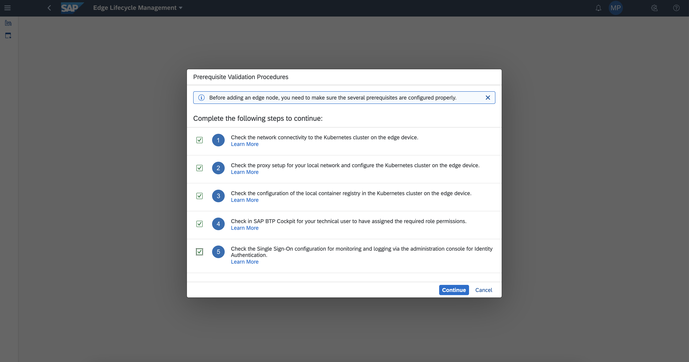

An empty form will be shown. To start compiling the form you have to create several users and configurations.

[DONE]
[ACCORDION-END]

[ACCORDION-BEGIN [Step 2: ](Create a container registry user)]

The first section of the **Add Edge Node** form contains the details for the `Repository-Based Shipment Channel (Container Registry)`. It requires a technical user to authenticate the Edge Lifecycle Management component in the Container Registry to download the SAP container images.

1.  As also suggested in the tooltip, open the [repositories portal page](https://ui.repositories.cloud.sap/) and log in with your SAP S-user.

    !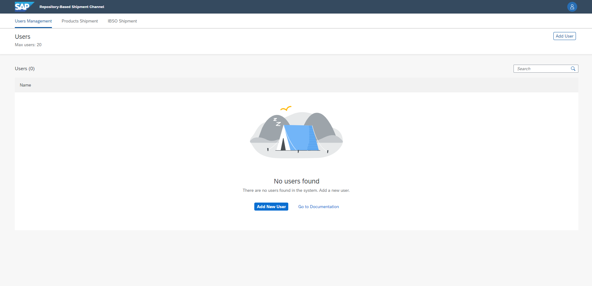

2.  Click the button **Add User** or **Add New User** to start the creation of a new technical user

3.  In the next form, type a username (e.g.: `sap-pmuser`) and press **Add User** to create the new user

4.  Select the created user in the list of users and press the last icon in the line of **Basic Auth Password** to copy the user password in the clipboard.

    !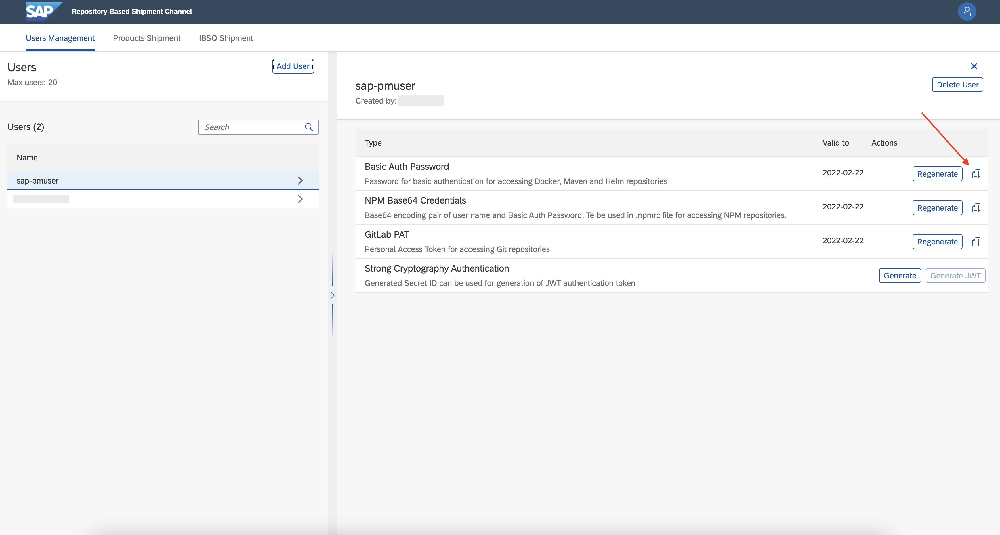

5.  Go back to the Edge `Lifecycle Management` UI and fill the form `Repository-Based Shipment Channel (Container Registry)` with the created user (e.g.: `sap-pmuser`) and the copied password

6.  Press the **Test Connection** button to check the provided credentials are correct and after a validation success press **Update** to save the provided credentials

    !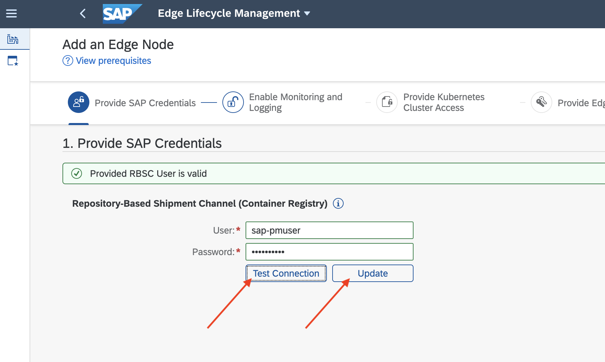

[VALIDATE_1]
[ACCORDION-END]

[ACCORDION-BEGIN [Step 3: ](Create BTP user)]

The second section in the UI needs `SAP Business Technology Platform` technical user. It will be used during the onboard process to set up correctly the connection of the Edge Node with the cloud.

1.  Open the SAP community page, and make the [login](https://accounts.sap.com)

2.  Click **Get SAP Universal ID** to open the registration form

    !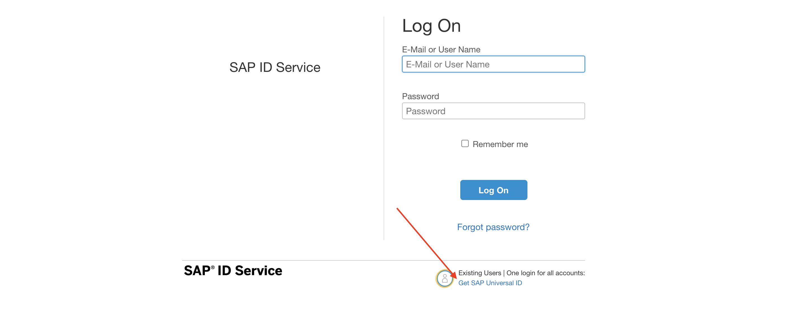

3.  Complete the Registration form by using a **temporary email**, not business nor personal.

4.  Open the temporary email and wait for the `verification code` sent by SAP.

    !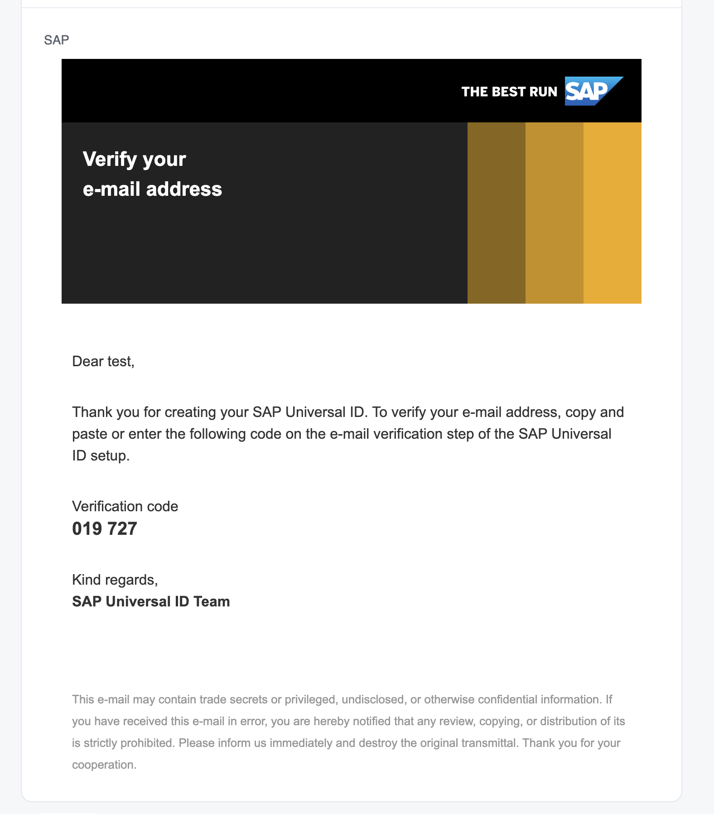

5.  Complete the verification process, using the verification code.

6.  Login into the [SAP Universal ID user management](https://account.sap.com/manage/accounts) page. The technical P-user assigned is visible in the list of **Accounts**.

    !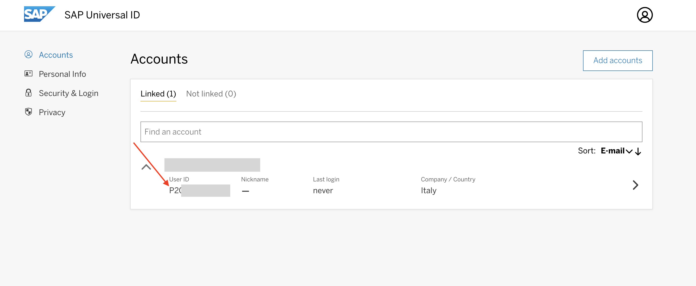

7.  Open the [SAP BTP Cockpit](https://cockpit.sap.hana.ondemand.com/cockpit/#) and navigate to the sub-account of SAP IoT.

8.  Click to **Users** and then **Create** a new user in the BTP. Use the temporary email used for the `SAP Universal ID` registration process.

9.  Assign the **`Cloud Connector Administrator`** role collection and the collection containing the role `EdgeLMAccess` to the user.

10. Go back to the **Edge Lifecycle Management** UI and fill the form with the created P-user details.

11. Press the **Test Connection** button to check the provided credentials are correct and after a validation success press **Update** to save the provided credentials.

    !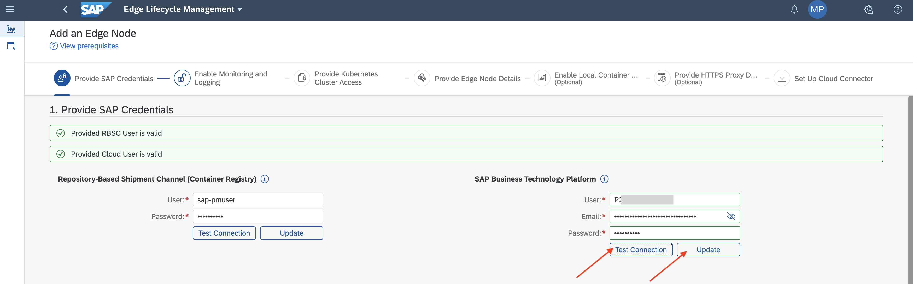

12. Click **Step 2**.

[VALIDATE_2]
[ACCORDION-END]

[ACCORDION-BEGIN [Step 4: ](Configure Identity Authentication Service)]

>This step is optional and only required in case you are enabling monitoring and logging for the edge node. Check the checkbox to enable the form.

 1. Open your SAP Identity Authentication Service administrator interface.

 2. Click the **Applications** tile.

 3. Click **Create** button to create a new application.

    !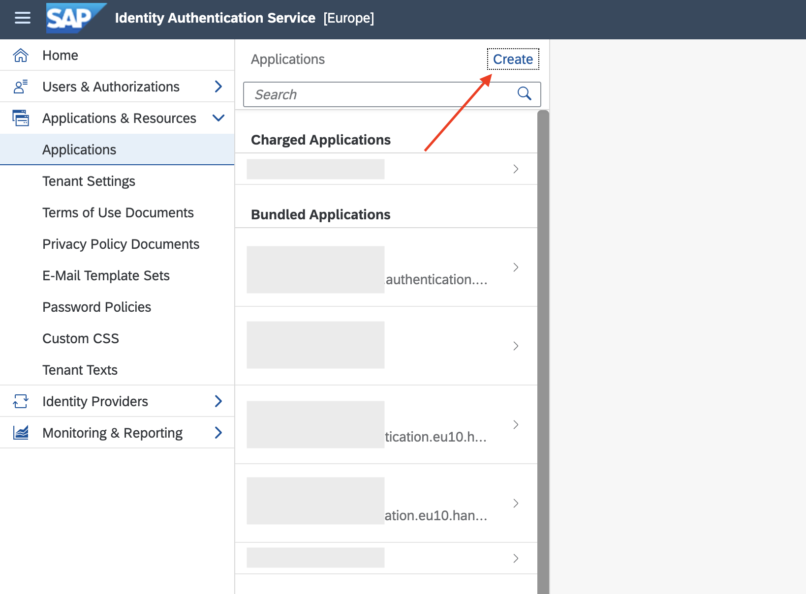

 4. Specify an **Application Display Name**  (e.g.: **`mpedge`**) and, optionally, the other fields.

 5. Select the created application.

    !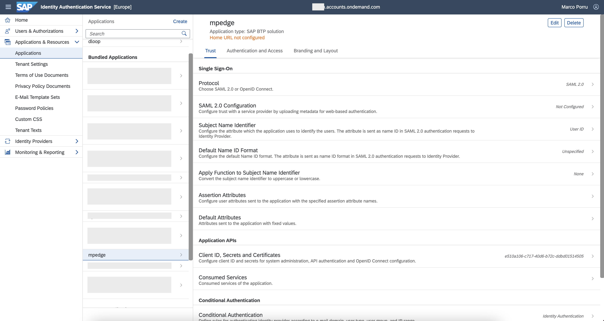

 6. Set the **Protocol** to **`OpenID Connect`** and press **Save**. As further confirmation it has been applied, the field `SAML 2.0 Configuration` is now changed to `OpenID Connect Configuration`.

 7. Open **`OpenID Connect Configuration`** and set the **Name** for your configuration (e.g.: **`mpedge`**), then press **Save**.

    !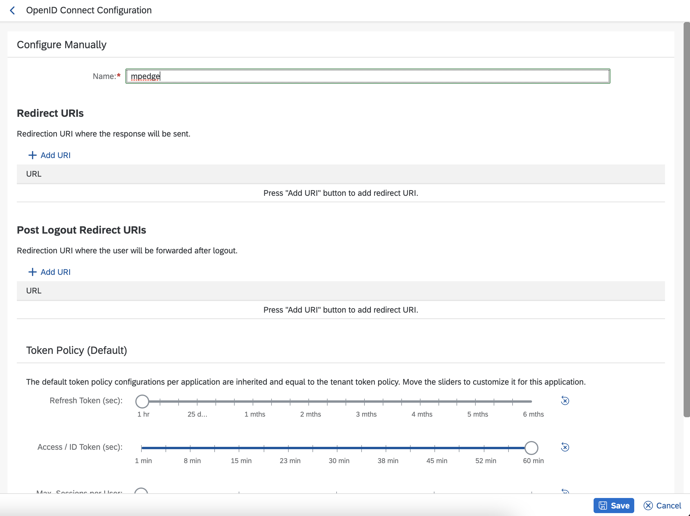

 8. Go to **Assertion Attributes** and press the **Add** button, then add **`Groups`**

    !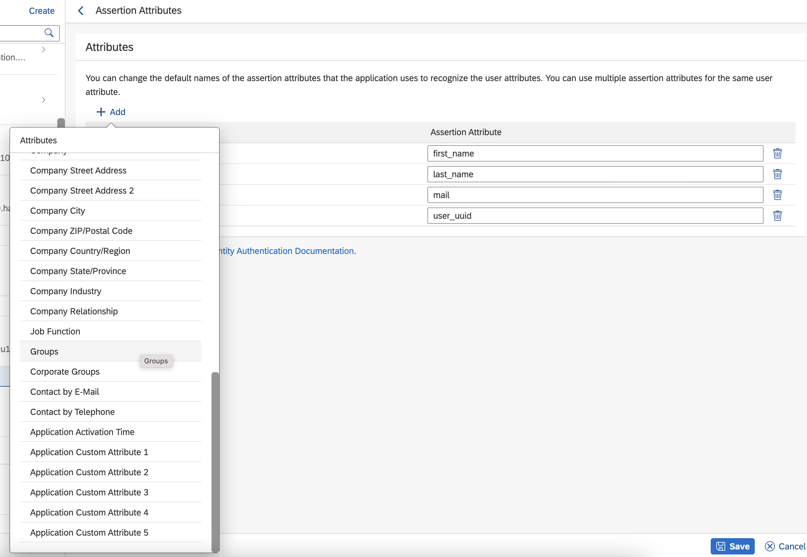

 9. Check all the attributes are correctly valued

    |  User Attribute     | 	Assertion Attribute
    |  :------------- | :-------------
    |  `Groups`   | `groups`
    |  `First Name`           | `first_name`
    |  `Last Name`           | `last_name`
    |  `E-Mail`    | `mail`
    |  `User UUID`          | `user_uuid`

 10. Go to **Client ID, Secrets and Certificates** and in the `Secret` section click the **Add** button to create a new secret.

     !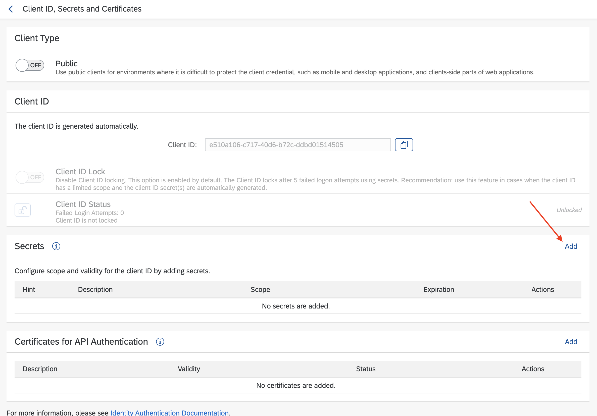

 11. Optionally specify a description and press **Save**.

 12. A window will appear with the created credentials. Copy both the `Client Id` and the `Client Secret` in an note, you will need them later.

     !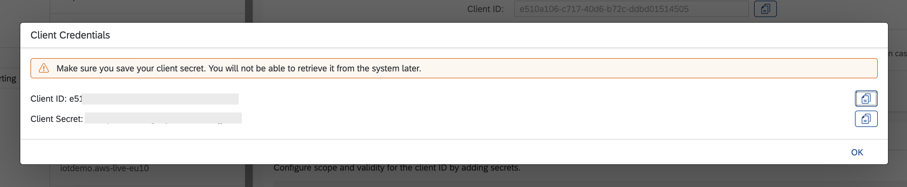

 13. Copy in a note the application id from the URL bar of your browser, you will need it later.

     !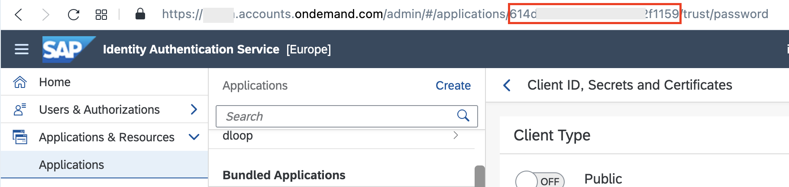

 14. Under **Users & Authorizations** click on **User Groups**, then click on **Create** to create a new group.

 15. Provide a **Name** and a **Display Name** (e.g.: **`mpedge`**) and press **Create** to complete the creation.

     !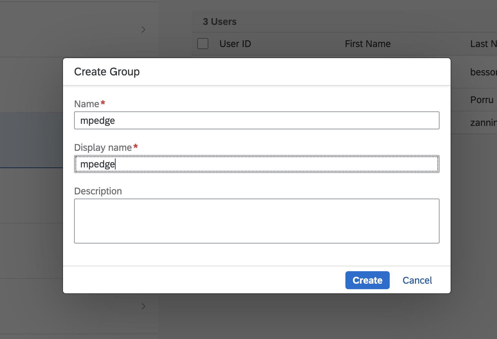

    > **Note:** You need to add as part of the user group all the Identity Authentication Service users who need to have access to the logging and monitoring dashboard. You can also add the technical user in the group, in this case everyone could access to the dashboards with his credentials.

 16. Go back to the Edge `Lifecycle Management` UI and fill the form with the following details:

    |  Field Name     | Value
    |  :------------- | :-------------
    |  `FQDN for Identity Authentication`           | the URL of your `Identity uthentication Service` (e.g.: `test.accounts.ondemand.com`)
    |  `Group Name`           | the name provided for the creation of the group n the step 15
    |  `Application ID`    | the application id retrieved in the step 13
    |  `Client Id`          | the client id created in the step 12
    |  `Client Secret`   | the client secret created in the step 12
 17. Press **Update** to save the provided configuration

[VALIDATE_3]
[ACCORDION-END]

---
