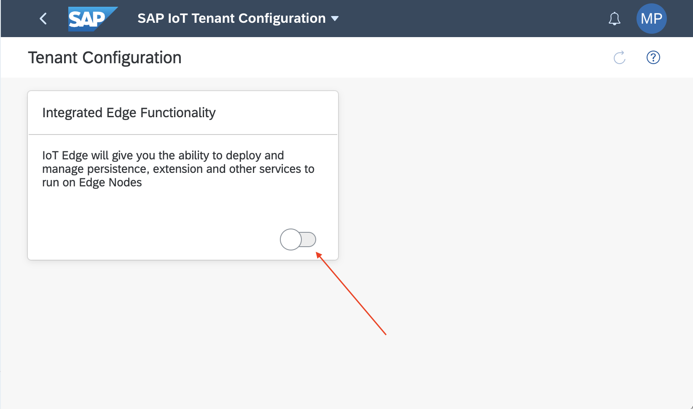
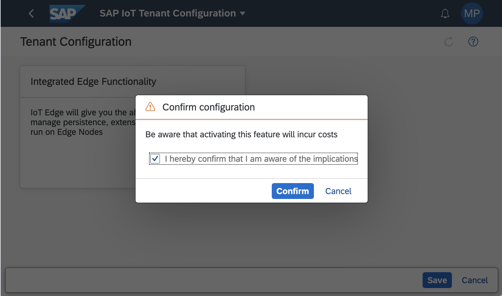
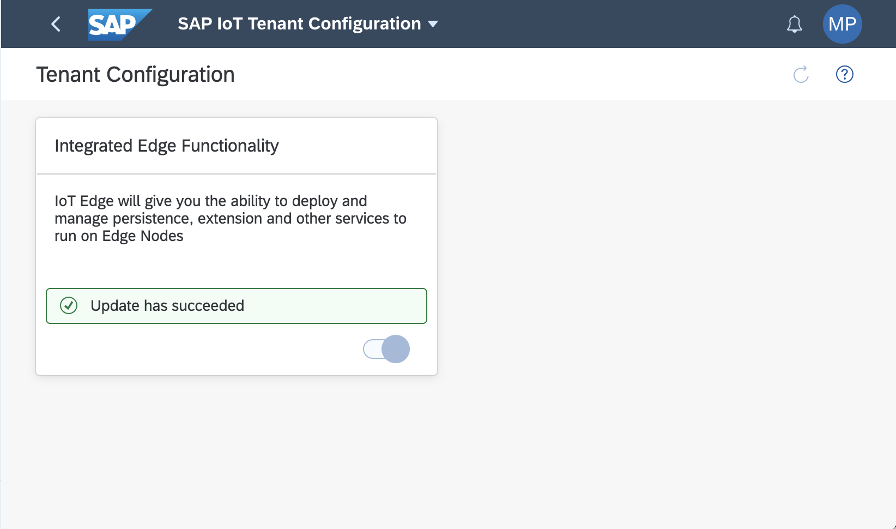
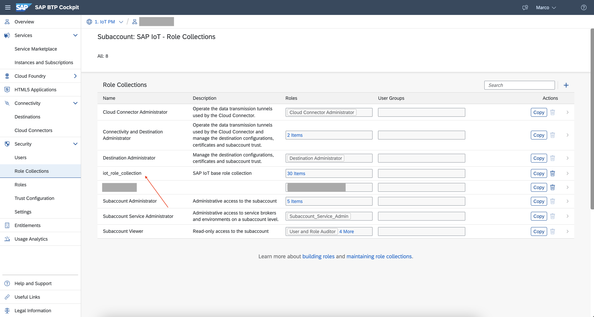
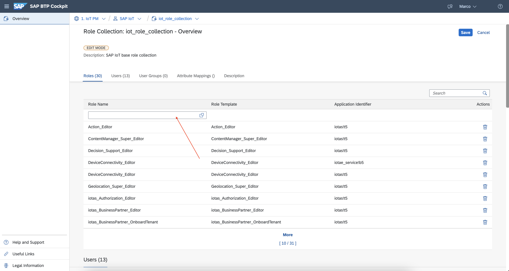
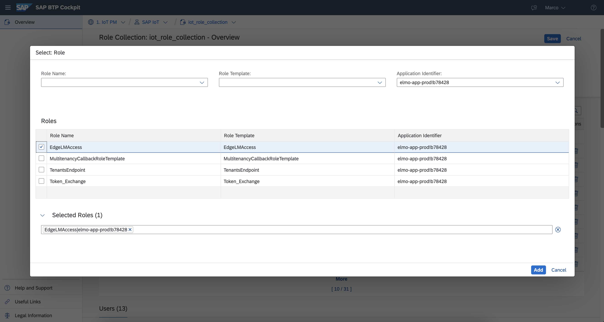

## Prerequisites

 -   You have licensed SAP Internet of Things (with the new capacity unit based licensing introduced in August 2020, your company has a Cloud Platform Enterprise Agreement or Pay-As-You-Go for SAP BTP and you have subscribed to the `oneproduct` service plan)
 -   You have setup the subscription for SAP IoT in your global account in a tenant (e.g. in the DEV tenant, the guide for the basic setup is at [Get Started with Your SAP IoT Account](https://help.sap.com/viewer/195126f4601945cba0886cbbcbf3d364/latest/en-US/bfe6a46a13d14222949072bf330ff2f4.html) ).
 - You have knowledge how to [manage users](https://help.sap.com/viewer/65de2977205c403bbc107264b8eccf4b/Cloud/en-US/a3bc7e863ac54c23ab856863b681c9f8.html) and [role collections](https://help.sap.com/viewer/65de2977205c403bbc107264b8eccf4b/Cloud/en-US/9e1bf57130ef466e8017eab298b40e5e.html) in the SAP Business Technology Platform
 - Your SAP User has at a minimum the `iot_role_collection` created during onboarding of your tenant and the associated roles (see [SAP Help on Providing Authorizations](https://help.sap.com/viewer/195126f4601945cba0886cbbcbf3d364/latest/en-US/2810dd61e0a8446d839c936f341ec46d.html) )
 -   You have already completed the [initial setup for the Identity Authentication Service](https://help.sap.com/viewer/6d6d63354d1242d185ab4830fc04feb1/Cloud/en-US/31af7da133874e199a7df1d42905241b.html)

## Details
### You will learn
  - How to enable IoT Edge applications in the SAP IoT tenant

---

[ACCORDION-BEGIN [Step 1: ](Enable IoT Edge Feature)]

1.  In the navigation area **Tenant Administrator**, choose the **Tenant Configuration** application in the SAP Internet of Things Fiori Launchpad

2.  Click the slider button in the area of **Integrated Edge Functionality**.

    !

3.  Press **Save** to trigger the enablement. A screen informing you that enabling the feature you could incur in additional cost (accordingly with the IoT Edge pricing metrics).

    !

4.  Tick the checkbox and press **Confirm** to enable the feature.

5.  Wait for the process complete. This could take some minutes.

    !

[DONE]
[ACCORDION-END]

[ACCORDION-BEGIN [Step 2: ](Add Required User Roles)]

Once the **Integrated Edge Functionality** is enabled, new roles will become available in your Business Technology Platform subaccount. These roles are required to make the IoT Edge applications visible in the SAP IoT Fiori Launchpad.

1.  Open the sub-account containing your SAP IoT tenant in the Business Technology Platform Cockpit. In the left menu expand **Security** and click on **Role Collections**.

    !

2.  Open the existing role collection for SAP IoT (i.e. `iot_role_collection`), or create a new one.

    >Ensure the role collection is assigned to your BTP user. For further references see [Configure Role Collections for Users](https://help.sap.com/viewer/247022ddd1744053af376344471c0821/2109b/en-US)

3.  Click on **Edit** and select the textbox in the first line of the **Role Name** column to start defining new roles.

    !

4.  Using the **Application Identifier** combo box, filter by application identifier starting with `elmo-app-prod!`. Select the `EdgeLMAccess` role.

    !

4.  Using the **Application Identifier** combo box, filter by application identifier starting with `les-admin-reuse-service!`. Select the `IoTEdge_Preprocessing` and `IoTEdge_Extensions` roles.

    !

6.  Confirm with the **Add** button. Press **Save** to save the modified role collection.

[VALIDATE_3]
[ACCORDION-END]

---
