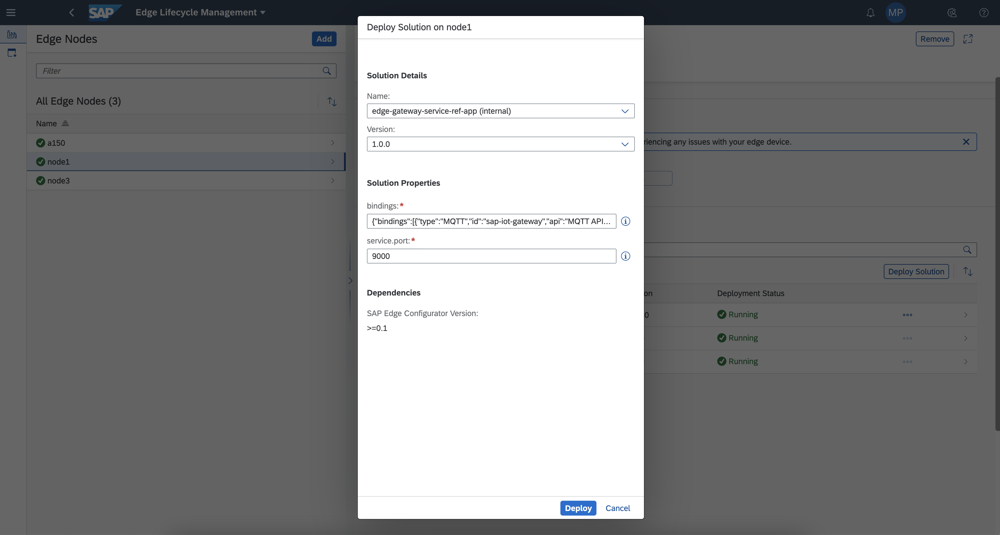
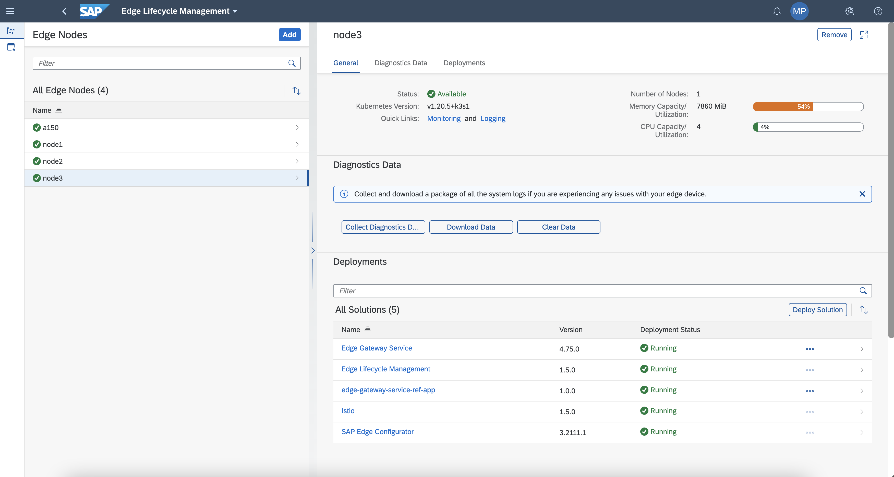
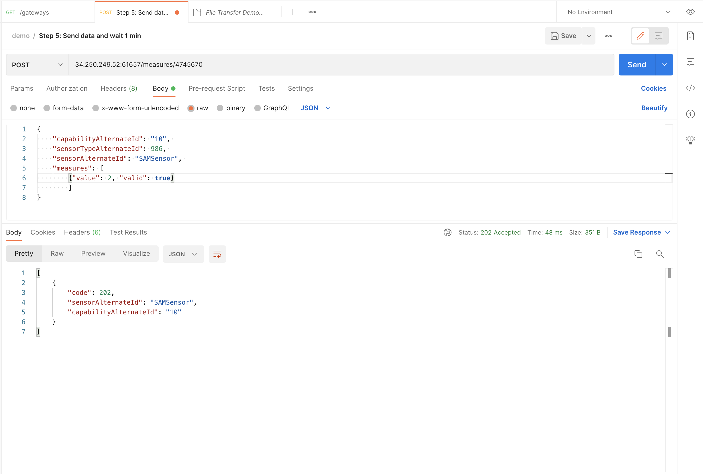
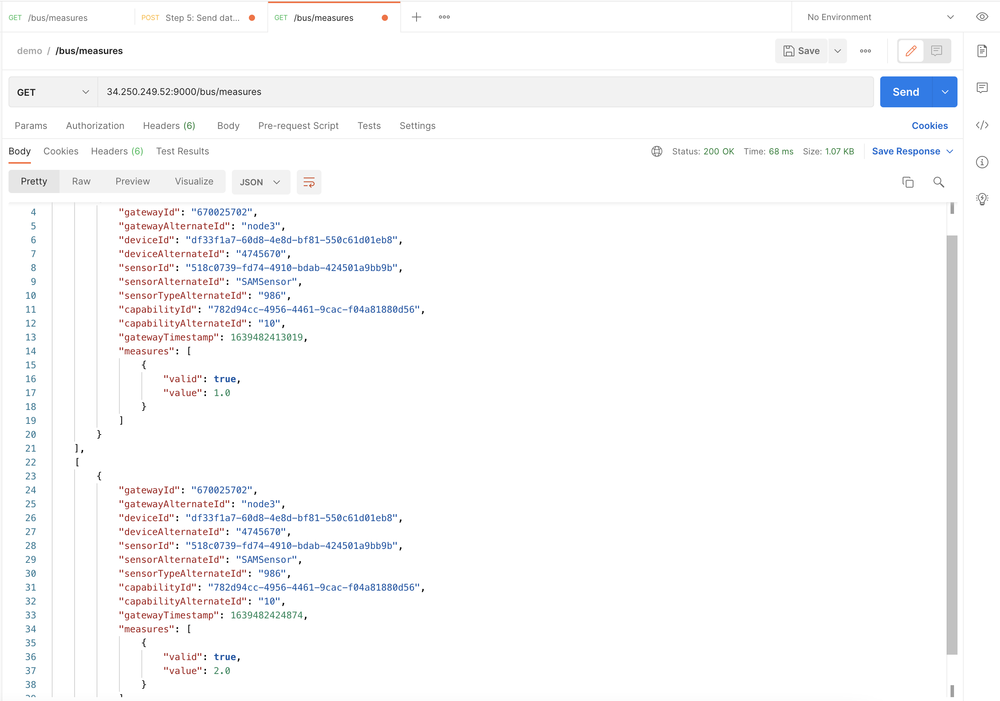

## Prerequisites

 -   You have licensed SAP Internet of Things (with the new capacity unit based licensing introduced in August 2020, your company has a Cloud Platform Enterprise Agreement or Pay-As-You-Go for SAP BTP and you have subscribed to the `oneproduct` service plan)
 -   You have setup the subscription for SAP IoT in your global account in a tenant (e.g. in the DEV tenant, the guide for the basic setup is at [Get Started with Your SAP IoT Account](https://help.sap.com/viewer/195126f4601945cba0886cbbcbf3d364/latest/en-US/bfe6a46a13d14222949072bf330ff2f4.html) ).
 - You have knowledge how to [manage users](https://help.sap.com/viewer/65de2977205c403bbc107264b8eccf4b/Cloud/en-US/a3bc7e863ac54c23ab856863b681c9f8.html) and [role collections](https://help.sap.com/viewer/65de2977205c403bbc107264b8eccf4b/Cloud/en-US/9e1bf57130ef466e8017eab298b40e5e.html) in the SAP Business Technology Platform
 - Your SAP User has at a minimum the `iot_role_collection` created during onboarding of your tenant and the associated roles (see [SAP Help on Providing Authorizations](https://help.sap.com/viewer/195126f4601945cba0886cbbcbf3d364/latest/en-US/2810dd61e0a8446d839c936f341ec46d.html) ) and all the required roles for the SAP Internet of Things Edge feature, see [Configure Role Collections for Users](https://help.sap.com/viewer/247022ddd1744053af376344471c0821/2109b/en-US/7e0ddf3d1ef24a42b68cd75fc526302c.html#5f0427eab54d467bb18871ce0d41e862.html)

## Details
### You will learn
  - How to install an extension service
  - How to test APIs provided by standard services

---

[ACCORDION-BEGIN [Step 1: ](Install extension service)]

With the creation of an extension service, the service is deployed and available in the cloud, but not yet deployed in any edge node. With the following process you are deploying it in an existing edge node with the **Edge Gateway Service** already installed.

1.  In the navigation area **IoT Edge**, click on the **Edge Lifecycle Management** application in the SAP Internet of Things Fiori Launchpad

2.  Select an edge node from the list in the left side of the browser window. This node must have the **Edge Gateway Service** already deployed and running. Click the **Deploy Solution** button.

    !

3.  In the first combo box, **Name**, select the solution **edge-gateway-service-ref-app (internal)**.

4.  Some parameters are editable in the section **Solution Properties**. These parameters as defined in the tutorial [Deploy Extension Service Helm Solution](iot-edge-extension-helm), permit to make the solution dynamically configurable at deploy time. You can keep the default values and press **Deploy**.

5. The installation of the service will start automatically. When the deployment process is completed the **Status** of the service will be **Running**.

    !

[DONE]
[ACCORDION-END]

[ACCORDION-BEGIN [Step 2: ](Invoke extension service APIs)]

The **Extension Service** implemented is exposing APIs on the specified service port (the default value is `9000`).

In this tutorial you will check for two different APIs:

-  The `/gateways` API to get the details of the existing **Edge Gateway Service**. With this invocation you are testing the REST local APIs exposed by the **Edge Gateway Service**.

- The `/bus/measures` API to get the last sensor readings received by the **Edge Gateway Service**. Our extension service reads these measurement data with the MQTT APIs exposed by the **Edge Gateway Service**, and buffers them.

1.  Open your REST client (i.e: **Postman**) and create a GET invocation. As URL define `<IP ADDRESS>:<SERVICE PORT>/gateways`.

    Replace `<IP ADDRESS>` with a reachable IP address of hostname of your edge node; replace `<SERVICE PORT>` with the port used by your extension service, if you have kept the default deployment parameter values, the value is `9000`.

    This extension service is acting like a proxy. The executed call is invoking a local REST API exposed by the **Edge Gateway Service**, to return the details of the service itself.

    !

    The API invocation will return a payload containing all the details about the current **Edge Gateway Service** instance; you can, for example, check the field `alternateId`.

    ```JSON
    [
        {
            "id": "670025702",
            "alternateId": "node3",
            "protocolId": "rest",
            "name": "IoT Gateway REST",
            "type": "edge",
            "version": "4.75.0",
            "operatingSystem": "Linux;5.4.0-1059-aws;amd64",
            "customProperties": [
                {
                    "key": "totalMemory",
                    "value": "123822080"
                },
                {
                    "key": "osVersion",
                    "value": "Linux;5.4.0-1059-aws;amd64"
                },
                {
                    "key": "gwVersion",
                    "value": "4.75.0"
                },
                {
                    "key": "totalSpace",
                    "value": "41567858688"
                }
            ]
        }
    ]
    ```

2.  Send some data to the **Edge Gateway Service**.

    >You can follow the tutorial [Onboard a new Device and Thing](iot-edge-onboard-thing)

    !

3.  In your REST client (i.e: **Postman**) and create a GET invocation. Send the GET request to the following URL: `<IP ADDRESS>:<SERVICE PORT>/bus/measures`.

    Replace `<IP ADDRESS>` with a reachable IP address of hostname of your edge node; replace `<SERVICE PORT>` with the port used by your extension service; if you have kept the default deployment parameter values, the value is `9000`.

    With this invocation you are testing the MQTT APIs exposed by the **Edge Gateway Service**. The extension is consuming, using the MQTT APIs channel, all the measurements ingested by the **Edge Gateway Service** and storing them in a temporary buffer. This invocation will return the buffer content and flush the buffer.

    !

    This is a sample of a temporary buffer returned by the API.

    ```JSON
    [
        [
            {
                "gatewayId": "670025702",
                "gatewayAlternateId": "node3",
                "deviceId": "df33f1a7-60d8-4e8d-bf81-550c61d01eb8",
                "deviceAlternateId": "4745670",
                "sensorId": "518c0739-fd74-4910-bdab-424501a9bb9b",
                "sensorAlternateId": "SAMSensor",
                "sensorTypeAlternateId": "986",
                "capabilityId": "782d94cc-4956-4461-9cac-f04a81880d56",
                "capabilityAlternateId": "10",
                "gatewayTimestamp": 1639482413019,
                "measures": [
                    {
                        "valid": true,
                        "value": 1.0
                    }
                ]
            }
        ],
        [
            {
                "gatewayId": "670025702",
                "gatewayAlternateId": "node3",
                "deviceId": "df33f1a7-60d8-4e8d-bf81-550c61d01eb8",
                "deviceAlternateId": "4745670",
                "sensorId": "518c0739-fd74-4910-bdab-424501a9bb9b",
                "sensorAlternateId": "SAMSensor",
                "sensorTypeAlternateId": "986",
                "capabilityId": "782d94cc-4956-4461-9cac-f04a81880d56",
                "capabilityAlternateId": "10",
                "gatewayTimestamp": 1639482424874,
                "measures": [
                    {
                        "valid": true,
                        "value": 2.0
                    }
                ]
            }
        ]
    ]
    ```

[VALIDATE_1]
[ACCORDION-END]


---
