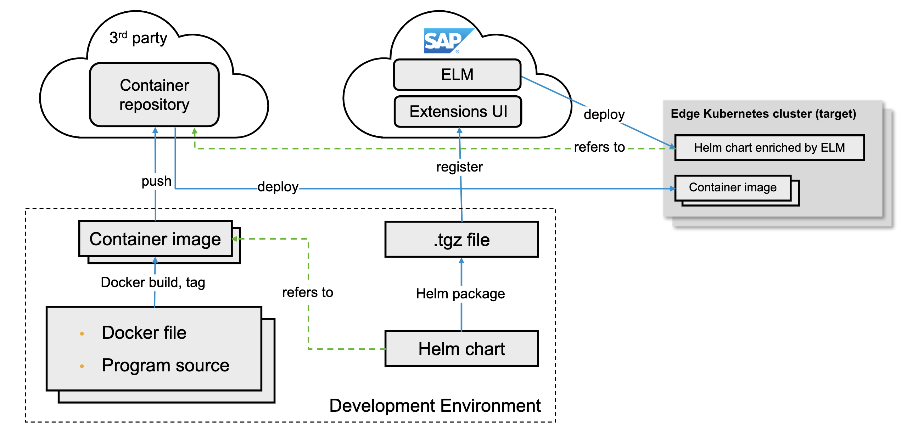
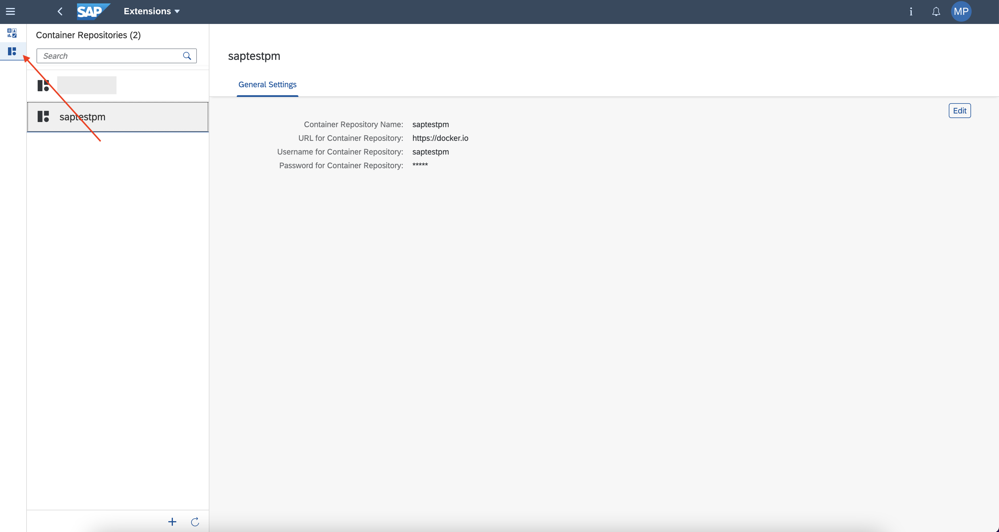
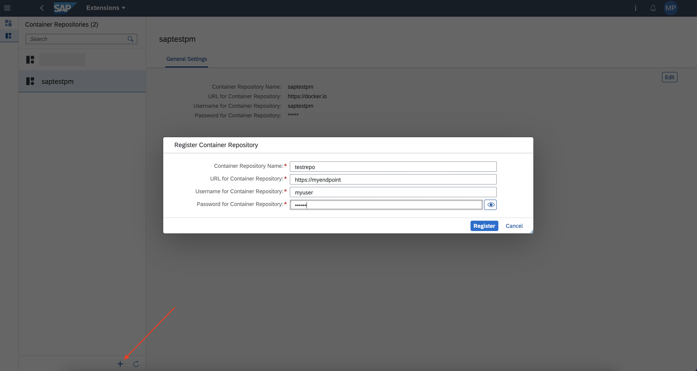

## Prerequisites

 -   You have licensed SAP Internet of Things (with the new capacity unit based licensing introduced in August 2020, your company has a Cloud Platform Enterprise Agreement or Pay-As-You-Go for SAP BTP and you have subscribed to the `oneproduct` service plan)
 -   You have setup the subscription for SAP IoT in your global account in a tenant (e.g. in the DEV tenant, the guide for the basic setup is at [Get Started with Your SAP IoT Account](https://help.sap.com/viewer/195126f4601945cba0886cbbcbf3d364/latest/en-US/bfe6a46a13d14222949072bf330ff2f4.html) ).
 - You have knowledge how to [manage users](https://help.sap.com/viewer/65de2977205c403bbc107264b8eccf4b/Cloud/en-US/a3bc7e863ac54c23ab856863b681c9f8.html) and [role collections](https://help.sap.com/viewer/65de2977205c403bbc107264b8eccf4b/Cloud/en-US/9e1bf57130ef466e8017eab298b40e5e.html) in the SAP Business Technology Platform
 - Your SAP User has at a minimum the `iot_role_collection` created during onboarding of your tenant and the associated roles (see [SAP Help on Providing Authorizations](https://help.sap.com/viewer/195126f4601945cba0886cbbcbf3d364/latest/en-US/2810dd61e0a8446d839c936f341ec46d.html) ) and all the required roles for the SAP Internet of Things Edge feature, see [Configure Role Collections for Users](https://help.sap.com/viewer/247022ddd1744053af376344471c0821/2109b/en-US/7e0ddf3d1ef24a42b68cd75fc526302c.html#5f0427eab54d467bb18871ce0d41e862.html)
 -   You have knowledge on the containerisation, i.e. [Docker](https://docker.io), and a container runtime installed

## Details
### You will learn
  - How to link a 3rd party image registry in SAP IoT Edge
  - How to push a consumable image into the 3rd party image registry
  - How security between standard SAP services and extension services is implemented
  - How to implement authentication in the extension services

The implementation of an extension service is composed in multiple parts as described in the following image

!

1.  Everything starts from the **Development Environment**, where the developer have to implement his custom logic and create a container image.

2.  The image will be then pushed to the 3rd-party **Container repository**.

3.  In the **Development Environment** the **Helm chart** is created. The container image, built and deployed in the previous steps, is used inside the chart  .

4.  The chart is packaged and loaded in the **Extensions UI**

5.  The **Edge Lifecycle Management** (<strong>ELM</strong>) orchestrates and deploy the extension in the Kubernetes cluster.

6.  The **ELM** install the HELM chart in the Kubernetes runtime. During the installation the container image linked in the HELM chart is downloaded from the specified 3rd party registry.


---

[ACCORDION-BEGIN [Step 1: ](Register 3rd party registry)]

1.  In the navigation area **IoT Edge**, click on the **Extensions** application in the SAP Internet of Things Fiori Launchpad

2.  Click on the **Container Repositories** icon to open the list of the available repositories

    !

3.  Press the **+** button in the bottom bar to register a new repository.

    !

4.  Fill the form with the following details:


    |  Field Name     | Value
    |  :------------- | :-------------
    |  Container Repository Name           | any of your choice
    |  URL for Container Repository           | The http/https address of your     registry
    |  Username for Container Repository    | An existing user for the 3rd party     registry
    |  Password for Container Repository          | The password for the 3rd party     registry user

5.  Press **Register** to store it.

[DONE]
[ACCORDION-END]


[ACCORDION-BEGIN [Step 2: ](Create a container image)]

In this tutorial you will implement a simple **Extension**. This service will expose the [**Edge Gateway Service** APIs](https://help.sap.com/viewer/DRAFT/70108a557bb24b5da8e0ac9cfb344067/2112a/en-US/a5dc24ca73e04853aadc62316f05b564.html) normally available to containers running in the same Kubernetes cluster to non-containerized applications, leveraging a sample published in the [SAP IoT Edge - Samples GitHub repository](https://github.com/SAP-samples/iot-edge-samples/tree/main/IoT_Edge/edge-gateway-service-ref-app). This makes the development and debugging cycle of other **Extensions** much faster and easier.

1.  Download the **SAP Edge Gateway Service Reference Application** from the official [SAP IoT Edge - Samples GitHub repository](https://github.com/SAP-samples/iot-edge-samples/tree/main/IoT_Edge/edge-gateway-service-ref-app#download-the-code).

2.  Navigate to the folder `app` and open the file `Dockerfile`.

    ```Shell/Bash
    FROM golang:alpine

    # Set necessary environmet variables needed for our image
    ENV GO111MODULE=on \
        CGO_ENABLED=0 \
        GOOS=linux \
        GOARCH=amd64

    ## We create an /app directory within our
    ## image that will hold our application source
    ## files
    RUN mkdir /app
    ## We copy everything in the root directory
    ## into our /app directory
    ADD . /app
    ## We specify that we now wish to execute
    ## any further commands inside our /app
    ## directory
    WORKDIR /app
    ## we run go build to compile the binary
    ## executable of our Go program
    RUN go build -o main ./cmd/main.go

    # Command to run when starting the container
    CMD ["/app/main"]

    ```

    The created container is starting from the [official Goland image](https://hub.docker.com/_/golang) containing the Go runtime.

    In the other lined of the `Dockerfile` the image is just providing the correct environment and copying the Go application in the container runtime, and finally starting it when the container is up and running.

3.  From the `app` folder build and tag the docker image with [Docker](https://docker.io).

    ```Shell/Bash
    docker build -t <repository/image:tag> .

    ```

    Replace `<repository/image:tag>` with your repository name in the 3rd party registry, image name and version.

    For example, if you are using dockerhub.io with the user `saptestpm`, the command could be updated to `docker build -t saptestpm/gw-ref-app:1.0.0 .` and you will build an image called `gw-ref-app` with the version `1.0.0`.


    >The `repository/image` categorization fields could be different based on your 3rd party registry provider/distribution

    You should have an output similar to the below sample code:

    ```Shell/Bash[2]
    % docker build -t saptestpm/gw-ref-app:1.0.0 .
    [+] Building 176.4s (11/11)     FINISHED                                                                                                                                                                                                                            
     => [internal] load build definition from     Dockerfile                                                                                                                                                                                                       0.4s
     => => transferring dockerfile:     720B                                                                                                                                                                                                                       0.0s
     => [internal] load     .dockerignore                                                                                                                                                                                                                          0.5s
     => => transferring context:     2B                                                                                                                                                                                                                            0.0s
     => [internal] load metadata for docker.io/library/    golang:alpine                                                                                                                                                                                           3.5s
     => [auth] library/golang:pull token for registry-    1.docker.io                                                                                                                                                                                              0.0s
     => [1/5] FROM docker.io/library/    golang:alpine@sha256:a207b29286084e7342286de809756f61558b00b81f794406399027631e0dba8b                                                                                                                                    60.7s
     => => resolve docker.io/library/    golang:alpine@sha256:a207b29286084e7342286de809756f61558b00b81f794406399027631e0dba8b                                                                                                                                     0.2s
     => => sha256:a207b29286084e7342286de809756f61558b00b81f794406399027631e0dba8b 1.65kB /     1.65kB                                                                                                                                                         0.0s
     => => sha256:33730119e82d830083e1be6f0c3061caab12842c714704bdc1a172bb54f7b33f 1.36kB /     1.36kB                                                                                                                                                         0.0s
     => => sha256:861f73fe2c7f31dfd8cb97cd183393e76f902db2f9008c1293e2d8b34678ebb8 5.20kB /     5.20kB                                                                                                                                                         0.0s
     => => sha256:59bf1c3509f33515622619af21ed55bbe26d24913cedbca106468a5fb37a50c3 2.82MB /     2.82MB                                                                                                                                                         1.1s
     => => sha256:8ed8ca4862056a130f714accb3538decfa0663fec84e635d8b5a0a3305353dee 155B /     155B                                                                                                                                                             0.9s
     => => sha256:666ba61612fd7c93393f9a5bc1751d8a9929e32d51501dba691da9e8232bc87b 282.16kB /     282.16kB                                                                                                                                                     1.2s
     => => sha256:bfe7d510f5225716e23f112aa0f9a19ba47c87fc22888c74bde73a32f06167a4 110.12MB /     110.12MB                                                                                                                                                    20.3s
     => => extracting     sha256:59bf1c3509f33515622619af21ed55bbe26d24913cedbca106468a5fb37a50c3                                                                                                                                                                  1.7s
     => => sha256:560f678454b3736bd0a5429b3beafb27808cbc44489ff7d3e2165689b0f2e6cf 156B /     156B                                                                                                                                                             1.7s
     => => extracting     sha256:666ba61612fd7c93393f9a5bc1751d8a9929e32d51501dba691da9e8232bc87b                                                                                                                                                                  0.8s
     => => extracting     sha256:8ed8ca4862056a130f714accb3538decfa0663fec84e635d8b5a0a3305353dee                                                                                                                                                                  0.0s
     => => extracting     sha256:bfe7d510f5225716e23f112aa0f9a19ba47c87fc22888c74bde73a32f06167a4                                                                                                                                                                 33.4s
     => => extracting     sha256:560f678454b3736bd0a5429b3beafb27808cbc44489ff7d3e2165689b0f2e6cf                                                                                                                                                                  0.0s
     => [internal] load build     context                                                                                                                                                                                                                          0.5s
     => => transferring context:     93.78kB                                                                                                                                                                                                                       0.1s
     => [2/5] RUN mkdir /    app                                                                                                                                                                                                                                   4.2s
     => [3/5] ADD . /    app                                                                                                                                                                                                                                       1.1s
     => [4/5] WORKDIR /    app                                                                                                                                                                                                                                     0.8s
     => [5/5] RUN go build -o main ./cmd/    main.go                                                                                                                                                                                                              93.4s
     => exporting to     image                                                                                                                                                                                                                                    10.8s
     => => exporting     layers                                                                                                                                                                                                                                   10.5s
     => => writing image     sha256:2b2028bb4629448e12f2da4108c449d74710f7eb03d4d22e8dbe533f95c77a75                                                                                                                                                               0.1s
     => => naming to docker.io/saptestpm/gw-ref-app:1.0.0
    ```


4.  Since some registry providers require to explicitly create the image repository into it before pushing the image, check and satisfy this condition; then push the container image in you registry

    ```Shell/Bash
    docker push -a <repository/image>
    ```

    Replace `<repository/image>` with your repository name in the 3rd party registry and image name.

    For example, if you are using dockerhub.io with the user `saptestpm`, the command could be updated to `docker push -a saptestpm/gw-ref-app`. It will push all the existing tags (versions) into your registry.

    >If you are not already logged in the process will ask you for your registry credentials.

    You should have an output similar to the below sample code:

    ```Shell/Bash
    % docker push -a saptestpm/gw-ref-app      
    The push refers to repository [docker.io/saptestpm/gw-ref-app]
    8dc25be642aa: Pushed
    5f70bf18a086: Pushed
    647baf4a7600: Pushed
    26410daae0ee: Pushed
    85da18ef7a99: Pushed
    fc22cd7e5fa7: Pushed
    b6f786c730a9: Pushed
    63a6bdb95b08: Pushed
    8d3ac3489996: Pushed
    1.0.0: digest:     sha256:bebde6b7eb7002f69962cf904e4379dc25392898b905f6ac78ee49285045e688 size: 2199
    ```

    >You  can found further reference about how to [build](https://docs.docker.com/engine/reference/commandline/build/) and [push](https://docs.docker.com/engine/reference/commandline/push/) docker images in the official Docker documentation.

5.  Optionally check your container image has been pushed correctly. With the following example you can fetch all the existing tags from Docker Hub. Replace `saptestpm/gw-ref-app` with your repository/image combination

    ```Shell/Bash
    curl -L -s 'https://registry.hub.docker.com/v2/repositories/saptestpm/gw-ref-app/tags'
    ```

    It will produce an output like the one below

    ```JSON[31,25]
    {
    	"count": 1,
    	"next": null,
    	"previous": null,
    	"results": [{
    		"creator": 14551125,
    		"id": 180280084,
    		"image_id": null,
    		"images": [{
    			"architecture": "amd64",
    			"features": "",
    			"variant": null,
    			"digest":     "sha256:bebde6b7eb7002f69962cf904e4379dc25392898b905f6ac78ee49285045e688",
    			"os": "linux",
    			"os_features": "",
    			"os_version": null,
    			"size": 162932850,
    			"status": "active",
    			"last_pulled": "2021-12-02T11:14:26.981984Z",
    			"last_pushed": "2021-12-02T11:14:26.752575Z"
    		}],
    		"last_updated": "2021-12-02T11:14:26.752575Z",
    		"last_updater": 14551125,
    		"last_updater_username": "saptestpm",
    		"name": "1.0.0",
    		"repository": 15954195,
    		"full_size": 162932850,
    		"v2": true,
    		"tag_status": "active",
    		"tag_last_pulled": "2021-12-02T11:14:26.981984Z",
    		"tag_last_pushed": "2021-12-02T11:14:26.752575Z"
    	}]
    }
    ```

[VALIDATE_1]
[ACCORDION-END]

[ACCORDION-BEGIN [Step 3: ](Inspect the code)]

The target of this section is to identify how to connect securely to the local edge APIs from an extension service.

The communication between services in the **IoT Edge** is done securely, and the security is implemented using the [`Istio` technology](https://istio.io/), which means the developer of the extensions doesn't have to implement any TLS mechanism to secure the communication. The `istio sidecar` is also automatically provided and added to your extension within the **Extensions** UI.

Additionally the SAP services (such as **Edge Gateway Service** or **Persistence Service**) are enforcing the security by asking to provide a JWT token to use with both REST and MQTT APIs.

-   Navigate and open the file `./app/internal/apis/apiUtils.go` to identify how the security is implemented to use the REST APIs.

    Inside this file you have the methods `CallPostApi` and `CallGetApi`, the first is to execute a POST request and the second to execute a GET. Please focus on the authentication and security.

    Both the methods execute standard HTTP requests by using an authentication token loaded with the method `addAuthHeader`.

    Inside this method the code is loading the existing (auto-provided) JTW bearer token contained inside the file `/var/run/secrets/kubernetes.io/serviceaccount/token`, and providing it as Authentication header for the requests.

    >Additional details are available in the official [JWT documentation](https://jwt.io/introduction)

    Finally, you are sending the request using the cluster DNS name of the **Edge Gateway Service**, `edge-gateway-service.sap-iot-gateway:<REST API TCP Port>` (where the `<REST API TCP Port>` is the port specified during the deployment of the **Edge Gateway Service**, its default value is `61660`).

-   Navigate and open the file `./app/internal/apis/mqttBusClient.go` to identify how the security is implemented for using the MQTT APIs. Your extension service can consume the data of the sensor readings using the edge message bus over MQTT.

    Inside this file you have the method `ConnectToBus` to issue the connection with the edge message bus.

    Inside this method you are providing the `ClientID` parameter filled with the `namespace` name as described in the [official documentation](https://help.sap.com/viewer/70108a557bb24b5da8e0ac9cfb344067/latest/en-US/e8ce4f2fcb48464f94ef63420fe2d5a6.html). In this extension service you are reading it from the file `/var/run/secrets/kubernetes.io/serviceaccount/namespace` thought the function `readNamespace`.

    You are also providing the credentials: the `username` could be any string and the `password` is the JWT token string contained inside the file `/var/run/secrets/kubernetes.io/serviceaccount/token`, read with the function `readKubernetesToken`.

    Finally, you are connecting to the broker using the cluster DNS name of the **Edge Gateway Service**, `edge-gateway-service.sap-iot-gateway:<MQTT Bus TCP Port>` (where the `<MQTT Bus TCP Port>` is the port specified during the deployment of the **Edge Gateway Service**, his default value is `61658`).

[VALIDATE_2]
[ACCORDION-END]


---
