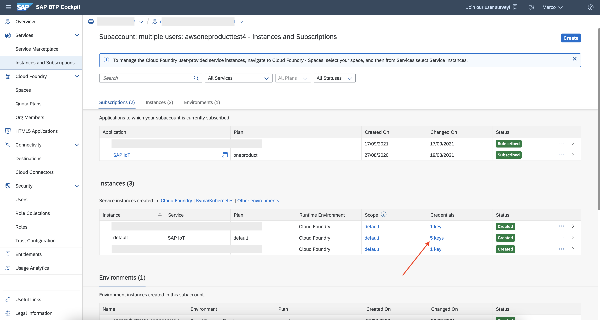
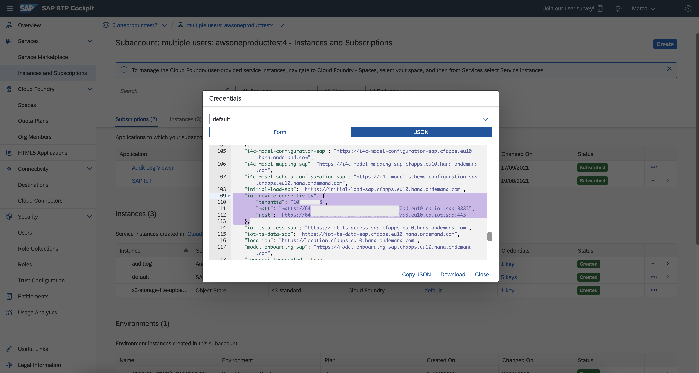
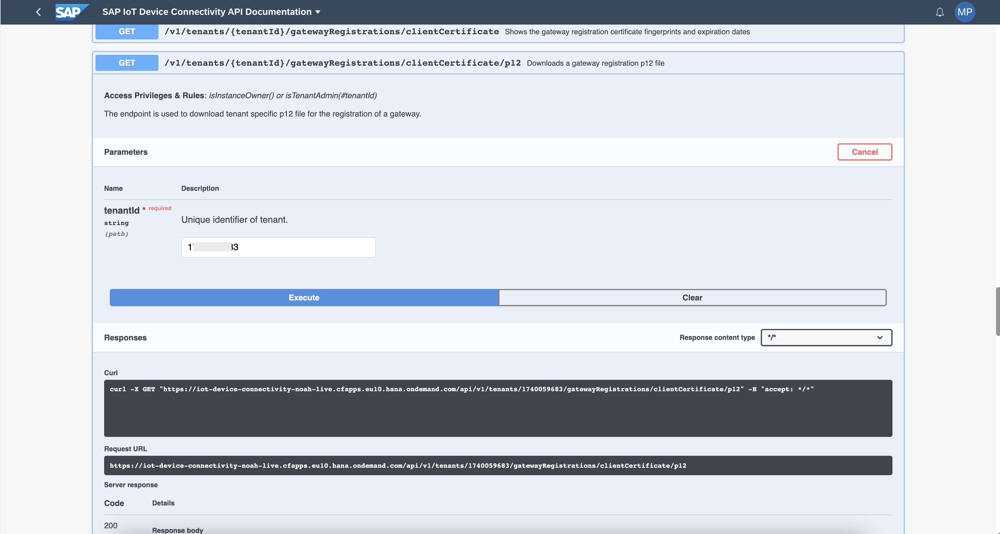
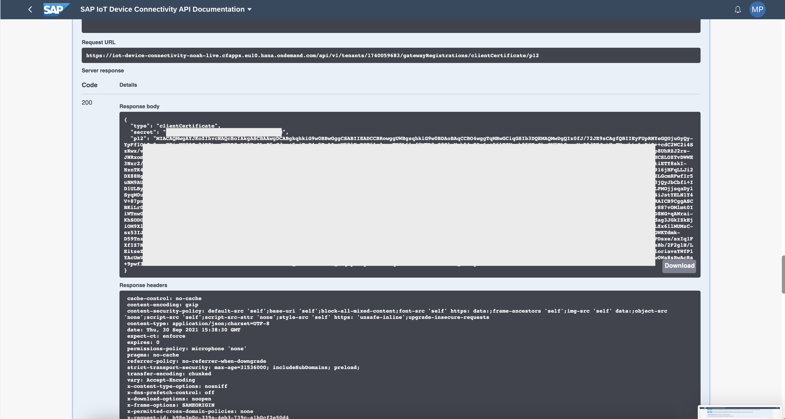
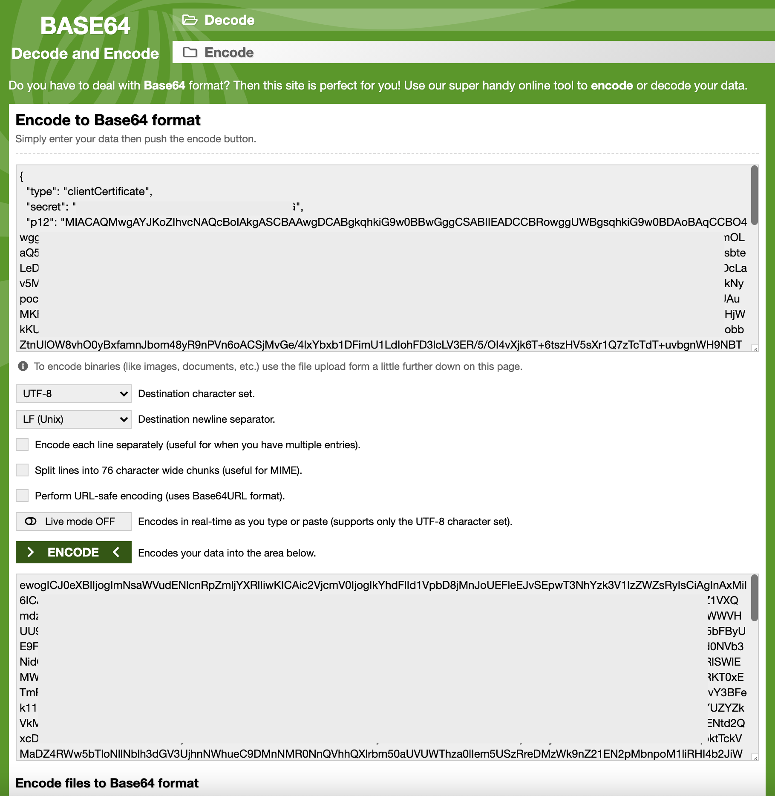

## Prerequisites
 -   You have licensed SAP Internet of Things (with the new capacity unit based licensing introduced in August 2020, your company has a Cloud Platform Enterprise Agreement or Pay-As-You-Go for SAP BTP and you have subscribed to the `oneproduct` service plan)
 -   You have setup the subscription for SAP IoT in your global account in a tenant (e.g. in the DEV tenant, the guide for the basic setup is at [Get Started with Your SAP IoT Account](https://help.sap.com/viewer/195126f4601945cba0886cbbcbf3d364/latest/en-US/bfe6a46a13d14222949072bf330ff2f4.html) ).
 - You have knowledge how to [manage users](https://help.sap.com/viewer/65de2977205c403bbc107264b8eccf4b/Cloud/en-US/a3bc7e863ac54c23ab856863b681c9f8.html) and [role collections](https://help.sap.com/viewer/65de2977205c403bbc107264b8eccf4b/Cloud/en-US/9e1bf57130ef466e8017eab298b40e5e.html) in the SAP Business Technology Platform
 - Your SAP User has at a minimum the `iot_role_collection` created during onboarding of your tenant and the associated roles (see [SAP Help on Providing Authorizations](https://help.sap.com/viewer/195126f4601945cba0886cbbcbf3d364/latest/en-US/2810dd61e0a8446d839c936f341ec46d.html) ) and all the required roles for the SAP Internet of Things Edge feature, see [Configure Role Collections for Users](https://help.sap.com/viewer/247022ddd1744053af376344471c0821/2109b/en-US/7e0ddf3d1ef24a42b68cd75fc526302c.html#5f0427eab54d467bb18871ce0d41e862.html)
 -   You have already completed the [initial setup for the Identity Authentication Service](https://help.sap.com/viewer/6d6d63354d1242d185ab4830fc04feb1/Cloud/en-US/31af7da133874e199a7df1d42905241b.html)
 -   You have already completed to [Onboard an Edge Node](iot-edge-onboard-node)

## Details
### You will learn
  - How to get Device Connectivity details
  - How to create an onboarding certificate

---

[ACCORDION-BEGIN [Step 1: ](Get Device Connectivity details)]

This step will show you how to get some service details to connect correctly your Edge Gateway Service to the SAP IoT tenant.

1.  Open The Business Technology Platform and navigate to the SAP IoT sub-account.

2.  Open **Instances and Subscriptions**

    !

3.  Click in the column **Credentials** for the instance of SAP IoT on the field **X Keys** to open the service keys.

    > If there are no key available for SAP IoT, you need to create them, see [Create service keys](https://help.sap.com/viewer/65de2977205c403bbc107264b8eccf4b/Cloud/en-US/cdf4f200db3e4c248fa67401937b2f78.html)

    !

4.  A set of keys written as JSON object are shown. Scroll the list and search for the node `iot-device-connectivity`.

5.  Copy in an empty document the value of `tenantid`, you will need it later.

6.  Copy the address of the `mqtt` or `rest` field (i.e.: `XXXXXXXX-XXXX-XXXX-XXXX-XXXXXXXXXXXX.eu10.cp.iot.sap`).

7.  Split the address in two parts: the `hostname` (i.e.: `XXXXXXXX-XXXX-XXXX-XXXX-XXXXXXXXXXXX`) and the `domain name` (i.e.: `eu10.cp.iot.sap`) and save them in the document with the `tenantid`.

[DONE]
[ACCORDION-END]

[ACCORDION-BEGIN [Step 2: ](Create the onboarding certificate)]

To complete the onboarding process you will need to generate an onboarding certificate for your Edge Gateway Service, to establish a secure connection with the cloud.

1.  In the navigation area **Ingestion**, click on the **Device Connectivity** application in the SAP Internet of Things Fiori Launchpad.

2.  In the Swagger UI of **Device Connectivity**, navigate to the `/v1/tenants/{tenantId}/gatewayRegistrations/clientCertificate/p12` API.

3.  Click on the **Try it out** button.

4.  fill the field **`tenantId - Unique identifier of tenant`** with the **`tenantid`** obtained in the element 5 of the **Step 1: Get Device Connectivity details**.

    !

5.  Press **Execute**.

    !

6.  Copy the payload returned by the API and convert it in base64 format.

    ```JSON
    {
      "type": "clientCertificate",
      "secret": "F!tYHwUil?#4rhPAexBoHJpOsac97WR3eflG",
      "p12": "MIACAQMwgAYJKoZIhvcNAQcBoIAkgASCBAAwgDCABgkqhkiG9w0BBwGggCSABIIEADCCBRowggUWBgsqhkiG9w0BDAoBAqCCBO4ewogICJ0eXBlIjogImNsaWVudENlcnRpZmljYXRlIiwKICAic2VjcmV0IjogIkYhdFlId1VpbD8jMnJoUEFleEJvSEpwT3NhYzk3V1IzZWZsRyIsCiAgInAxMiI6ICJNSUFDQVFNd2dBWUpLb1pJaHZjTkFRY0JvSUFrZ0FTQ0JBQXdnRENBQmdrcWhraUc5dzBCQndHZ2dDU0FCSUlFQURDQ0JSb3dnZ1VXQmdzcWhraUc5dzBCREFvQkFxQ0NCTzR3Z2dUcU1Cd0dDaXFHU0liM0RRRU1BUU13RGdRSXowZkovNzJKRTlzQ0FnZlFCSUlFeUZVcFJOWWVHUU9qdU95UXlZcEZmMU90R3kwb3dyRVhqbktYOFFHdjI0QjB0d3hOTkRSR3pEUTlIbU9MYVE1ZUNkcXorNXFpRXNYNGU3Rm9BSXgrVTU5bFByUE9FNjFzM3Buc1RLOUw2bHNmOE1URDh1WjBDbHZVbWg1NHcwSXI2cis1NjFFU1Z5YWIyNUtYYU9rc1FWN0JMMHZlZU1jUjlkWkVKeXRId0NVb3NidGVMZURpUSsrY2RDMldDMmk0U3pLd3gvdnRZclFZSVpRM2NTUC9pWjIyNG5KbEVLdHYrZExWcW1uQTdJZmJFUjdmSWYrWXJhUURlSWlEMWlOVThwVzRHOXJhR0gyaWJ2dlByS2ZZQ0NLZk5VVmZzQmFsUnlhb0RjTGF2NU1lSVJVL0tTZmFRSjFKRFVqaWVCM3FPVXBYMjJyWERKT0xETmFKM0ZuNUEzQUt5M0Z1amx4ODZhbkgxcDhVaFJaSjJyc0pOUnhvbVd4TkhsYzI0czJVQW8wQ3BDdmZ2bU16d09KVktpMXpYVWtOeXBvY3BFek11NzcxV2RGUHlKWTIwazlrY21IWFJuSktKUlZoaSswMVdxZzkza2pNMExuM3MwTVBKUmVncG5ORGRGc29FcnkxOUV6eDlhQ0Q1Z1VJYUZYZkVkMkRITlJrWWlvNERKTXNsNW1BOFVBdU1LRnlPbFgyRVZQSENTTE9aVHZEV1dFM054cjIvWmFXTXJZTGFrU2tydHkzSHByN0F0WVN4UENtd2QxcDlORW5XWCt5cGk5c1ZweFZjTXYxSmV0aDFua1E5YUlQSk5DSnNsbjhJZVlUbW5aRXBIaldrS1VJdjVtSnlyMkZLSlBibWRFVTBlalc0dzBqbktTckVMaDZ4RWw5bTloNllNblh3dGV3UjhnNWhueC9DMnNMR0NnQVhhQXlrbm50aUVUWThza0lIem5USzRreDMzWk9nZ21EN2pMbnpoM1liRHI4b2JiWnRuVWxPVzh2aE8weUJ4ZmFtbkpib200OHlSOW5QVm42b0FDU2pNdkdlLzRseFlieGIxREZpbVUxTGRJb2hGRDNsY0xWM0VSLzUvT0k0dlhqazZUKzZ0c3pIVjVzWHIxUTd6VGNUZFQrdXZiZ25XSDlOQlRPY2FGdmovSVAxQUMvcHUvRDkxNmpIRnFMTEppMkRYODhIZzR0R21iUDB2VFJqOW01TU16eFBrdFlJSSs2YklIUmMvNzZiSm85aXptVlhuVFppV3JBem03OGJ2ejN4aS8rS0VnUFJZM1NDdnNCQUlOUVRYdStoNXpvMHlKYTMrYVpybW40Q0JPYUZTU3NlWGJ6VVpOc0VjdndKdXJPeXBvMVIzZ0IrdWlnazBDVWtyczdLVGdEeHVXeXdhWVN0TGpNWkxHY21SRndmSXI1dUhNOUFVcU9ZQU4xSmVWOEgyYjA0VW8rVS9nOE5wblcyWVVWcmhsbmVkL2ZCK2JJTGJlWmg5U3RaNk9va1lPa1RKQ3NBM0oxQVJkQ2gyYXdVeDNxSTZKRkh2djJ0MXRKb3BONVlyNnpLN1BzMVNhWFhPMzNWNGpqMWxBMEFsK21qT2w0RmpScmZLZTAySngzYXR2RzZIUmplYXV1Tlp1Mm5zMTQzalF5SmJDYmZpK0lEMVVMQnljK0JJSUVBR3V1MEJQb1l0THNXWWlRNjcxVEVkUXbU8wd3o4T3JwVjU1c0N6NXNma0lmdEEzTnAwak5JeE1TQWtHTTRyWVFFdHlSZ3RZa2VweGVoZ2ZJa2FVMUNxdnlSM0ZEZTF5NVdTYnJRZ1REeW8zSnVTZVhIamNkQVhreHhWRFlBVVQ3RENFN3JMOFAwRnlVTzBqM20xTkp2bC9XQndtNDF1d0dsb3JpYXZzWVdmUDFZQWNVbVZoQk5pUUNLRBzdWFLdmZ2TEJJSUJIZ1c5TE9GSzFLNnBFbFpEeWFTaTFGSHgxdGJxZjA4QzNNV01kRGtxUFU1WWpkQWlqclNtVVR5YTdOeVZaYTVkQXdrRHI2VFMzSld4VHM5SERIVU1MT3VBUVpPQVFnWDVpUTJkL0E0ajd4ZExBbmRGSnEyMUxQTU9qanNxYUR5bFN5cU0wdVh1R1lHRmM3TktnOE9EWUI0Y0twOVpmSjhmMXpRaUxvbnZuMVovTitaZUVpcEdEaHJpZEpvQklJcDRRcHI2NWRUMjNzWEM2c1pQckFnaFQ3TkwyQjNEUE5Tb1NmVXdQWW9kSTUrSTNQUHFCOUdLQmFIeXJUZUt6Wm9jNHcwSkZjQUt1STRnRVpuVlhhVnlBQWlVZm1XZm9LNGMyN1BDNGlKc3RZRUxOMVk0Vis4N3BuZHM4YnBlRk1PS0VSblIwUkt5dGZraTRkdXZuYjh4QkNFWUxPY2d4a1d2TVJVd0V3WUpLb1pJaHZjTkFRa1ZNUVlFQkFFQUFBQUFBQUFBQUFBd2dBWUpLb1pJaHZjTkFRY0dvSUF3Z0FJQkFEQ0FCZ2txaGtpRzl3MEJCd0V3SEFZS0tvWklodmNOQVF3QkJqQU9CQWpUem11K0dGMk1SQUlDQjlDZ2dBU0NCS2lMcjArVzFETzBIY1oxOTYwUVd4QlQ0eC9XZGdid0ZadWdub2l2ZmpjRk9QY1VRWE9ncDNKSWZYWmdxZm5pVEJtejRYL3ZkSzBNd0YwQlh4cEttSmpOYjFrOGtxVjBqQTJyTmlhbE8xOHJDcjZjQXAvUFZrS0Zzcng4VUUzUXZ2TFVrMElZVm1JRHNEcVVRZVRDSFU1TzkyWTl3Qmd6UGt0MXI4ODd2T01sbXQwSWlXVG53MDlxZTRONFpSazZDUGVaMDNjem1vcGtSTTgwbFZ1NlNhbTJtTFl5cldsYjdYdjhyRldGQ1MyeFR6YlRwRHBNUVhuczRjOUdCODk2c20vZEhhWnBweFM1V2lhcklGeXlINFF2TkY5cHltTVEyTDF2N2RrbDFKY1pIU25nbjFENy9vdWxDMnltMkJ1SFBLZ3Y1WFpvM2d1NU9UN29PQkgxRDhORytxQVdyYWlLaFNPRE9zeHZTWUFMRTIzOVhhYXJEMmdYamZvbEdDc0RBZ1dwc29ZbktYa3ZkTWRyZCtSME1iRXZZeXN3bldKTXNNdWRZOVpiK1JuMTh2UG1hMkVsa3FVcGx4NjVsY1dZeEJJMk5sYUZRekRGSWJiYm0rSnZwYkZJU1g2VUw3cmRnZGpoNEJSRFZTL1VzVFBPdTkxUFh6MzdQU0x6MmVvT1UxTmRhZzNKR2tJWmtIamlPTTlYbEFCMVJDZ1RFaE56Skp0REpyQlAxdHpteXQ2YU0rcWZtbTcxQjYzWm9IRWEzNmlvV24vcFB4OUFXOW9hcGlXaXZrQzJJU1R2NWIwaWY5WGpVU2ZJcCtjR0svL1hUd0JwT1BsaUhlMGhhazRBSDRsd05RxdmpucGd6SlpYTHI4MzRTcVI5VlRPWE41UVVIMmxLRHR4dHFDc2NFNUtzbzRLQm1tT2MvcWtiVStJRUxsa2dPYXVSY3hTcDI4TTUwUm0yRXlBYk1rNElIK2pxTkExVUJOaVNIaEJBK2xSOXlUd1VQZjdrZ0NxZFF2T1AvcGowdjd2WWZtUUlyWkR0WnBSalBEc3hlL3N4SXExRlhmSVo3TlZvYUtMR2FSZXhKdGFxbWtjdUlLaEhjQVFZOENZTGljV1oya0tPeU00ZTRsUmVHV0NDSFNvOFZnb2lpS2hDdlVsTEVMVlFMRlRHWDN2dUh3RGJ0ZmlZbTh3Y2ZCaVhUMlQrd20yaWlDMmZIVklGMHlEYjgvK0pvMXJ6RG5YK3FsN05RR0NiSlVrS3pnV1NLT3h6a3cxVyt4RC9OWW9Uc0JiLzJGMmdsSC9MRWl0c2VaSDF3Y0wyUjI4dXlQMFRlMmdsd2pMkhTV0Q2VVd6YkhXTmNUMjZsZC9GUDIrVnUxQmZZQ3V0RGhFOVlwMUJTYnRjbjBSSFNlR2tUNjk2MnRuUzlibFdEa215MndEQ2tTNE9QS2ZEWGZZL2QyK2ZUNWgvM3BIYldzbWRhektRZ1ArRVhGbCtaeUplNk42OWtUT0tLVFY1SlhVZzl1WEtEUSt1VWpiTmFJOTlJb3cwV2E4c1J3QWNScys5cHdmM05FL1NrTDJIMXQ2MzFsQUFBQUFBQUFBQUFBQUFBQUFBQUFBQUFBREF4TUNFd0NRWUZLdzREQWhvRkFBUVVOcUx5VTlvZzk0ZW9oVFRKcXVUeHZVVy93VGNFQ0Q3Q1Jyc1VRL2NEQWdJSDBBQUEiCn0=AAAAAAAAAAAAAAAAAAAAAAAADAxMCEwCQYFKw4DAhoFAAQUNqLyU9og94eohTTJquTxvUW/wTcECD7CRrsUQ/cDAgIH0AAA"
    }
    ```


    > You can use any online/offline base64 encoder tool (i.e.: [online base 64 encoder](https://www.base64encode.org/)).

    !

The encoded certificate should look as follows.

```
ewogICJ0eXBlIjogImNsaWVudENlcnRpZmljYXRlIiwKICAic2VjcmV0IjogIkYhdFlId1VpbD8jMnJoUEFleEJvSEpwT3NhYzk3V1IzZWZsRyIsCiAgInAxMiI6ICJNSUFDQVFNd2dBWUpLb1pJaHZjTkFRY0JvSUFrZ0FTQ0JBQXdnRENBQmdrcWhraUc5dzBCQndHZ2dDU0FCSUlFQURDQ0JSb3dnZ1VXQmdzcWhraUc5dzBCREFvQkFxQ0NCTzRld29nSUNKMGVYQmxJam9nSW1Oc2FXVnVkRU5sY25ScFptbGpZWFJsSWl3S0lDQWljMlZqY21WMElqb2dJa1loZEZsSWQxVnBiRDhqTW5Kb1VFRmxlRUp2U0Vwd1QzTmhZemszVjFJelpXWnNSeUlzQ2lBZ0luQXhNaUk2SUNKTlNVRkRRVkZOZDJkQldVcExiMXBKYUhaalRrRlJZMEp2U1VGclowRlRRMEpCUVhkblJFTkJRbWRyY1docmFVYzVkekJDUW5kSFoyZERVMEZDU1VsRlFVUkRRMEpTYjNkbloxVlhRbWR6Y1docmFVYzVkekJDUkVGdlFrRnhRME5DVHpSM1oyZFVjVTFDZDBkRGFYRkhVMGxpTTBSUlJVMUJVVTEzUkdkUlNYb3daa292TnpKS1JUbHpRMEZuWmxGQ1NVbEZlVVpWY0ZKT1dXVkhVVTlxZFU5NVVYbFpjRVptTVU5MFIza3diM2R5UlZocWJrdFlPRkZIZGpJMFFqQjBkM2hPVGtSU1IzcEVVVGxJYlU5TVlWRTFaVU5rY1hvck5YRnBSWE5ZTkdVM1JtOUJTWGdyVlRVNWJGQnlVRTlGTmpGek0zQnVjMVJMT1V3MmJITm1PRTFVUkRoMVdqQkRiSFpWYldnMU5IY3dTWEkyY2lzMU5qRkZVMVo1WVdJeU5VdFlZVTlyYzFGV04wSk1NSFpsWlUxalVqbGtXa1ZLZVhSSWQwTlZiM05pZEdWTVpVUnBVU3NyWTJSRE1sZERNbWswVTNwTGQzZ3ZkblJaY2xGWlNWcFJNMk5UVUM5cFdqSXlORzVLYkVWTGRIWXJaRXhXY1cxdVFUZEpabUpGVWpkbVNXWXJXWEpoVVVSbFNXbEVNV2xPVlRod1Z6UkhPWEpoUjBneWFXSjJkbEJ5UzJaWlEwTkxaazVWVm1aelFtRnNVbmxoYjBSalRHRjJOVTFsU1ZKVkwwdFRabUZSU2pGS1JGVnFhV1ZDTTNGUFZYQllNakp5V0VSS1QweEVUbUZLTTBadU5VRXpRVXQ1TTBaMWFteDRPRFpoYmtneGNEaFZhRkphU2pKeWMwcE9Vbmh2YlZkNFRraHNZekkwY3pKVlFXOHdRM0JEZG1aMmJVMTZkMDlLVmt0cE1YcFlWV3RPZVhCdlkzQkZlazExTnpjeFYyUkdVSGxLV1RJd2F6bHJZMjFJV0ZKdVNrdEtVbFpvYVNzd01WZHhaemt6YTJwTk1FeHVNM013VFZCS1VtVm5jRzVPUkdSR2MyOUZjbmt4T1VWNmVEbGhRMFExWjFWSllVWllaa1ZrTWtSSVRsSnJXV2x2TkVSS1RYTnNOVzFCT0ZWQmRVMUxSbmxQYkZneVJWWlFTRU5UVEU5YVZIWkVWMWRGTTA1NGNqSXZXbUZYVFhKWlRHRnJVMnR5ZEhrelNIQnlOMEYwV1ZONFVFTnRkMlF4Y0RsT1JXNVhXQ3Q1Y0drNWMxWndlRlpqVFhZeFNtVjBhREZ1YTFFNVlVbFFTazVEU25Oc2JqaEpaVmxVYlc1YVJYQklhbGRyUzFWSmRqVnRTbmx5TWtaTFNsQmliV1JGVlRCbGFsYzBkekJxYmt0VGNrVk1hRFo0Uld3NWJUbG9ObGxOYmxoM2RHVjNVamhuTldodWVDOURNbk5NUjBOblFWaGhRWGxyYm01MGFVVlVXVGh6YTBsSWVtNVVTelJyZURNeldrOW5aMjFFTjJwTWJucG9NMWxpUkhJNGIySmlXblJ1Vld4UFZ6aDJhRTh3ZVVKNFptRnRia3BpYjIwME9IbFNPVzVRVm00MmIwRkRVMnBOZGtkbEx6UnNlRmxpZUdJeFJFWnBiVlV4VEdSSmIyaEdSRE5zWTB4V00wVlNMelV2VDBrMGRsaHFhelpVS3paMGMzcElWalZ6V0hJeFVUZDZWR05VWkZRcmRYWmlaMjVYU0RsT1FsUlBZMkZHZG1vdlNWQXhRVU12Y0hVdlJEa3hObXBJUm5GTVRFcHBNa1JZT0RoSVp6UjBSMjFpVURCMlZGSnFPVzAxVFUxNmVGQnJkRmxKU1NzMllrbElVbU12TnpaaVNtODVhWHB0VmxodVZGcHBWM0pCZW0wM09HSjJlak40YVM4clMwVm5VRkpaTTFORGRuTkNRVWxPVVZSWWRTdG9OWHB2TUhsS1lUTXJZVnB5Ylc0MFEwSlBZVVpUVTNObFdHSjZWVnBPYzBWamRuZEtkWEpQZVhCdk1WSXpaMElyZFdsbmF6QkRWV3R5Y3pkTFZHZEVlSFZYZVhkaFdWTjBUR3BOV2t4SFkyMVNSbmRtU1hJMWRVaE5PVUZWY1U5WlFVNHhTbVZXT0VneVlqQTBWVzhyVlM5bk9FNXdibGN5V1ZWV2NtaHNibVZrTDJaQ0sySkpUR0psV21nNVUzUmFOazl2YTFsUGExUktRM05CTTBveFFWSmtRMmd5WVhkVmVETnhTVFpLUmtoMmRqSjBNWFJLYjNCT05WbHlObnBMTjFCek1WTmhXRmhQTXpOV05HcHFNV3hCTUVGc0syMXFUMncwUm1wU2NtWkxaVEF5U25nellYUjJSelpJVW1wbFlYVjFUbHAxTW01ek1UUXphbEY1U21KRFltWnBLMGxFTVZWTVFubGpLMEpKU1VWQlIzVjFNRUpRYjFsMFRITlhXV2xSTmpjeFZFVmtVWGJVOHdkM280VDNKd1ZqVTFjME42TlhObWEwbG1kRUV6VG5Bd2FrNUplRTFUUVd0SFRUUnlXVkZGZEhsU1ozUlphMlZ3ZUdWb1oyWkphMkZWTVVOeGRubFNNMFpFWlRGNU5WZFRZbkpSWjFSRWVXOHpTblZUWlZoSWFtTmtRVmhyZUhoV1JGbEJWVlEzUkVORk4zSk1PRkF3Um5sVlR6QnFNMjB4VGtwMmJDOVhRbmR0TkRGMWQwZHNiM0pwWVhaeldWZG1VREZaUVdOVmJWWm9RazVwVVVOTFJCemRXRkxkbVoyVEVKSlNVSklaMWM1VEU5R1N6RkxObkJGYkZwRWVXRlRhVEZHU0hneGRHSnhaakE0UXpOTlYwMWtSR3R4VUZVMVdXcGtRV2xxY2xOdFZWUjVZVGRPZVZaYVlUVmtRWGRyUkhJMlZGTXpTbGQ0VkhNNVNFUklWVTFNVDNWQlVWcFBRVkZuV0RWcFVUSmtMMEUwYWpkNFpFeEJibVJHU25FeU1VeFFUVTlxYW5OeFlVUjViRk41Y1Uwd2RWaDFSMWxIUm1NM1RrdG5PRTlFV1VJMFkwdHdPVnBtU2pobU1YcFJhVXh2Ym5adU1Wb3ZUaXRhWlVWcGNFZEVhSEpwWkVwdlFrbEpjRFJSY0hJMk5XUlVNak56V0VNMmMxcFFja0ZuYUZRM1Rrd3lRak5FVUU1VGIxTm1WWGRRV1c5a1NUVXJTVE5RVUhGQ09VZExRbUZJZVhKVVpVdDZXbTlqTkhjd1NrWmpRVXQxU1RSblJWcHVWbGhoVm5sQlFXbFZabTFYWm05TE5HTXlOMUJETkdsS2MzUlpSVXhPTVZrMFZpczROM0J1WkhNNFluQmxSazFQUzBWU2JsSXdVa3Q1ZEdacmFUUmtkWFp1WWpoNFFrTkZXVXhQWTJkNGExZDJUVkpWZDBWM1dVcExiMXBKYUhaalRrRlJhMVpOVVZsRlFrRkZRVUZCUVVGQlFVRkJRVUZCZDJkQldVcExiMXBKYUhaalRrRlJZMGR2U1VGM1owRkpRa0ZFUTBGQ1oydHhhR3RwUnpsM01FSkNkMFYzU0VGWlMwdHZXa2xvZG1OT1FWRjNRa0pxUVU5Q1FXcFVlbTExSzBkR01rMVNRVWxEUWpsRFoyZEJVME5DUzJsTWNqQXJWekZFVHpCSVkxb3hPVFl3VVZkNFFsUTBlQzlYWkdkaWQwWmFkV2R1YjJsMlptcGpSazlRWTFWUldFOW5jRE5LU1daWVdtZHhabTVwVkVKdGVqUllMM1prU3pCTmQwWXdRbGg0Y0V0dFNtcE9ZakZyT0d0eFZqQnFRVEp5VG1saGJFOHhPSEpEY2paalFYQXZVRlpyUzBaemNuZzRWVVV6VVhaMlRGVnJNRWxaVm0xSlJITkVjVlZSWlZSRFNGVTFUemt5V1RsM1FtZDZVR3QwTVhJNE9EZDJUMDFzYlhRd1NXbFhWRzUzTURseFpUUk9ORnBTYXpaRFVHVmFNRE5qZW0xdmNHdFNUVGd3YkZaMU5sTmhiVEp0VEZsNWNsZHNZamRZZGpoeVJsZEdRMU15ZUZSNllsUndSSEJOVVZodWN6UmpPVWRDT0RrMmMyMHZaRWhoV25Cd2VGTTFWMmxoY2tsR2VYbElORkYyVGtZNWNIbHRUVkV5VERGMk4yUnJiREZLWTFwSVUyNW5iakZFTnk5dmRXeERNbmx0TWtKMVNGQkxaM1kxV0Zwdk0yZDFOVTlVTjI5UFFrZ3hSRGhPUnl0eFFWZHlZV2xMYUZOUFJFOXplSFpUV1VGTVJUSXpPVmhoWVhKRU1tZFlhbVp2YkVkRGMwUkJaMWR3YzI5WmJrdFlhM1prVFdSeVpDdFNNRTFpUlhaWmVYTjNibGRLVFhOTmRXUlpPVnBpSzFKdU1UaDJVRzFoTWtWc2EzRlZjR3g0TmpWc1kxZFplRUpKTWs1c1lVWlJla1JHU1dKaVltMHJTblp3WWtaSlUxZzJWVXczY21SblpHcG9ORUpTUkZaVEwxVnpWRkJQZFRreFVGaDZNemRRVTB4Nk1tVnZUMVV4VG1SaFp6TktSMnRKV210SWFtbFBUVGxZYkVGQ01WSkRaMVJGYUU1NlNrcDBSRXB5UWxBeGRIcHRlWFEyWVUwcmNXWnRiVGN4UWpZeldtOUlSV0V6Tm1sdlYyNHZjRkI0T1VGWE9XOWhjR2xYYVhaclF6SkpVMVIyTldJd2FXWTVXR3BWVTJaSmNDdGpSMHN2TDFoVWQwSndUMUJzYVVobE1HaGhhelJCU0RSc2QwNVJ4ZG1wdWNHZDZTbHBZVEhJNE16UlRjVkk1VmxSUFdFNDFVVlZJTW14TFJIUjRkSEZEYzJORk5VdHpielJMUW0xdFQyTXZjV3RpVlN0SlJVeHNhMmRQWVhWU1kzaFRjREk0VFRVd1VtMHlSWGxCWWsxck5FbElLMnB4VGtFeFZVSk9hVk5JYUVKQksyeFNPWGxVZDFWUVpqZHJaME54WkZGMlQxQXZjR293ZGpkMldXWnRVVWx5V2tSMFduQlNhbEJFYzNobEwzTjRTWEV4UmxobVNWbzNUbFp2WVV0TVIyRlNaWGhLZEdGeGJXdGpkVWxMYUVoalFWRlpPRU5aVEdsalYxb3lhMHRQZVUwMFpUUnNVbVZIVjBORFNGTnZPRlpuYjJscFMyaERkbFZzVEVWTVZsRk1SbFJIV0ROMmRVaDNSR0owWm1sWmJUaDNZMlpDYVZoVU1sUXJkMjB5YVdsRE1tWklWa2xHTUhsRVlqZ3ZLMHB2TVhKNlJHNVlLM0ZzTjA1UlIwTmlTbFZyUzNwblYxTkxUM2g2YTNjeFZ5dDRSQzlPV1c5VWMwSmlMekpHTW1kc1NDOU1SV2wwYzJWYVNERjNZMHd5VWpJNGRYbFFNRlJsTW1kc2QycE1raFRWMFEyVlZkNllraFhUbU5VTWpac1pDOUdVRElyVm5VeFFtWlpRM1YwUkdoRk9WbHdNVUpUWW5SamJqQlNTRk5sUjJ0VU5qazJNblJ1VXpsaWJGZEVhMjE1TW5kRVEydFRORTlRUzJaRVdHWlpMMlF5SzJaVU5XZ3ZNM0JJWWxkemJXUmhla3RSWjFBclJWaEdiQ3RhZVVwbE5rNDJPV3RVVDB0TFZGWTFTbGhWWnpsMVdFdEVVU3QxVldwaVRtRkpPVGxKYjNjd1YyRTRjMUozUVdOU2N5czVjSGRtTTA1RkwxTnJUREpJTVhRMk16RnNRVUZCUVVGQlFVRkJRVUZCUVVGQlFVRkJRVUZCUVVGQlJFRjRUVU5GZDBOUldVWkxkelJFUVdodlJrRkJVVlZPY1V4NVZUbHZaemswWlc5b1ZGUktjWFZVZUhaVlZ5OTNWR05GUTBRM1ExSnljMVZSTDJORVFXZEpTREJCUVVFaUNuMD1BQUFBQUFBQUFBQUFBQUFBQUFBQUFBQUFEQXhNQ0V3Q1FZRkt3NERBaG9GQUFRVU5xTHlVOW9nOTRlb2hUVEpxdVR4dlVXL3dUY0VDRDdDUnJzVVEvY0RBZ0lIMEFBQSIKfQ==

```


[VALIDATE_1]
[ACCORDION-END]


---
