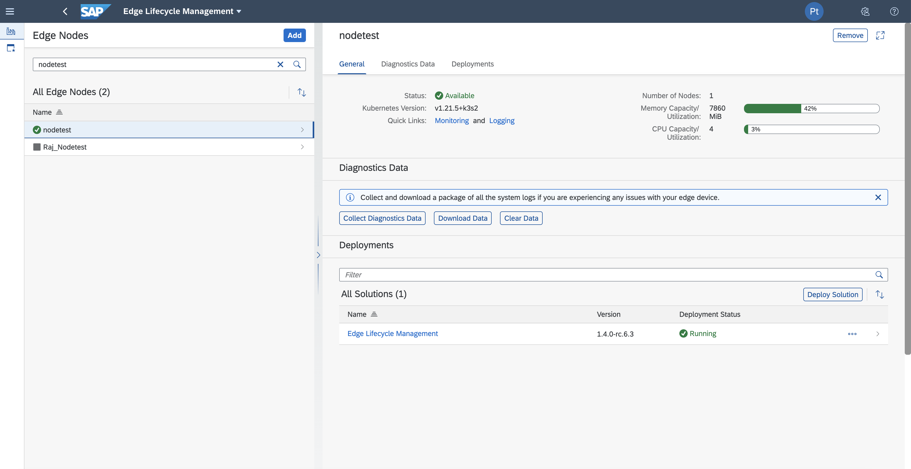
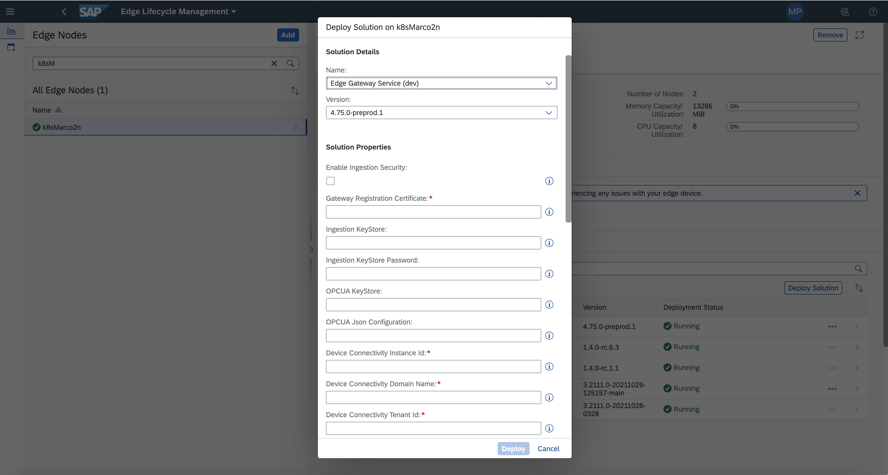
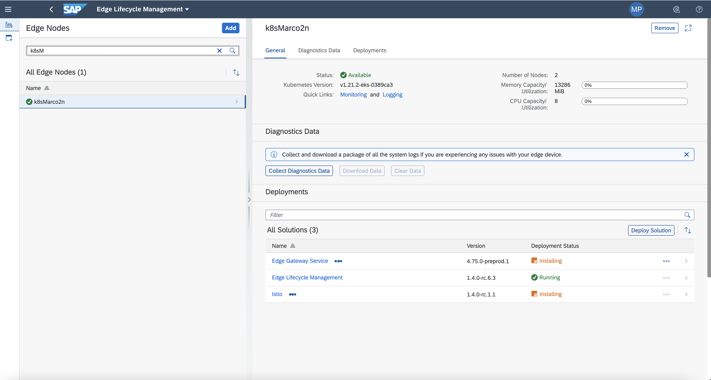
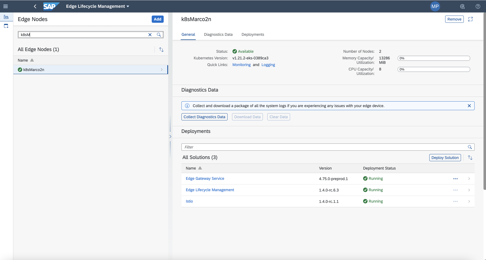
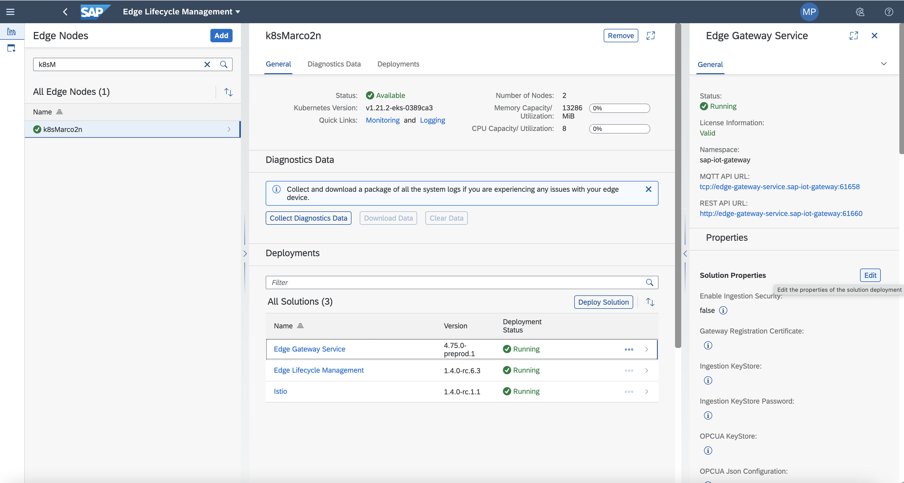
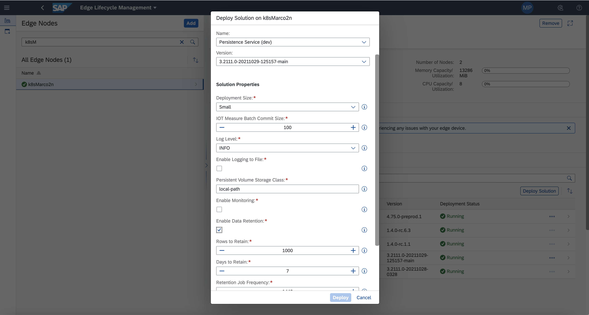
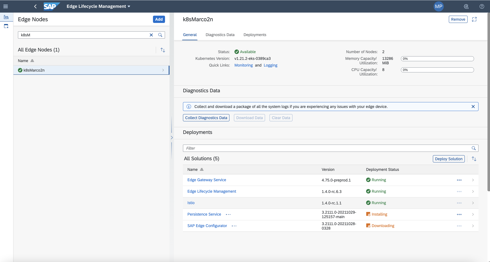
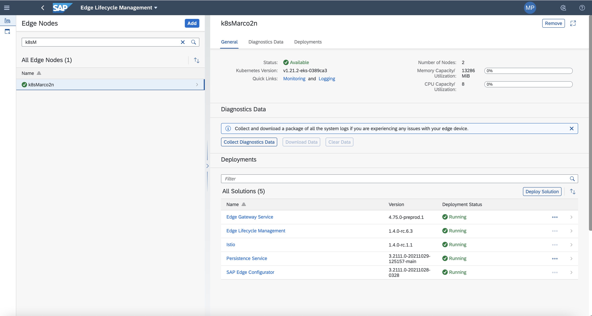

## Prerequisites
 -   You have licensed SAP Internet of Things (with the new capacity unit based licensing introduced in August 2020, your company has a Cloud Platform Enterprise Agreement or Pay-As-You-Go for SAP BTP and you have subscribed to the `oneproduct` service plan)
 -   You have setup the subscription for SAP IoT in your global account in a tenant (e.g. in the DEV tenant, the guide for the basic setup is at [Get Started with Your SAP IoT Account](https://help.sap.com/viewer/195126f4601945cba0886cbbcbf3d364/latest/en-US/bfe6a46a13d14222949072bf330ff2f4.html) ).
 - You have knowledge how to [manage users](https://help.sap.com/viewer/65de2977205c403bbc107264b8eccf4b/Cloud/en-US/a3bc7e863ac54c23ab856863b681c9f8.html) and [role collections](https://help.sap.com/viewer/65de2977205c403bbc107264b8eccf4b/Cloud/en-US/9e1bf57130ef466e8017eab298b40e5e.html) in the SAP Business Technology Platform
 - Your SAP User has at a minimum the `iot_role_collection` created during onboarding of your tenant and the associated roles (see [SAP Help on Providing Authorizations](https://help.sap.com/viewer/195126f4601945cba0886cbbcbf3d364/latest/en-US/2810dd61e0a8446d839c936f341ec46d.html) ) and all the required roles for the SAP Internet of Things Edge feature, see [Configure Role Collections for Users](https://help.sap.com/viewer/247022ddd1744053af376344471c0821/2109b/en-US/7e0ddf3d1ef24a42b68cd75fc526302c.html#5f0427eab54d467bb18871ce0d41e862.html)
 -   You have already completed [Get Configuration for the Edge Gateway Service](iot-edge-get-gateway-details)

## Details
### You will learn
  - How to install the Edge Gateway Service
  - Features available for the Edge Gateway Service
  - How to tune configuration parameters for the Edge Gateway Service
  - How to install the Persistence Service
  - Features available for the Persistence Service
  - How to tune configuration parameters for the Persistence Service

---

[ACCORDION-BEGIN [Step 1: ](Install Edge Gateway Service)]

The **Edge Gateway Service** provides the base capabilities to provide the connectivity with an IoT enabled device. Out of the box the platform exposes several protocols to provide connectivity between an IoT enabled device and our SAP IoT in cloud.

Additionally, the platform also provides APIs to consume at the edge the device model, and the capability to extend the logic via **Extension Service** consuming and producing the validated data exposed in the **MQTT Bus Measure Flow** (i.e.: consume live data to produce an additional insight, like an aggregation).

1.  In the navigation area **IoT Edge**, click on the **Edge Lifecycle Management** application in the SAP Internet of Things Fiori Launchpad

2.  Select an edge node in the list of edge nodes and click the button  **Deploy Solution**.

    !

3.  In the first combo box, **Name**, select the solution **Edge Gateway Service**.

    !

4.  Fill in the form with the following details:

    |  Field Name     | Value
    |  :------------- | :-------------
    |  Gateway Registration Certificate           | Put here the base64 converted certificate obtained in the **Create the onboarding certificate**, **step 6** of the [Get Configuration for the Edge Gateway Service](iot-edge-get-gateway-details) tutorial
    |  Device Connectivity Instance Id           | Put here the base64 converted certificate obtained in the **Get Device Connectivity details**, **step 7**, **`hostname`** of the [Get Configuration for the Edge Gateway Service](iot-edge-get-gateway-details) tutorial
    |  Device Connectivity Domain Name    | Put here the base64 converted certificate obtained in the **Get Device Connectivity details**, **step 7**, **`domain name`** of the [Get Configuration for the Edge Gateway Service](iot-edge-get-gateway-details) tutorial
    |  Device Connectivity Tenant Id          | Put here the base64 converted certificate obtained in the **Get Device Connectivity details**, **step 5** of the [Get Configuration for the Edge Gateway Service](iot-edge-get-gateway-details) tutorial
    |  Gateway Alternate Id   | Any non existing unique name of your choice (i.e.: **`mytestNode`**)
    |  Protocol | Of your choice (select **`REST`** for tutorial consistency)
    |  Persistent Volumes Storage Class | If you are using k3s you probably would use **`local-path`**, otherwise you can chose from any [standard Storage Class implementation](https://kubernetes.io/docs/concepts/storage/storage-classes/) you have installed in your cluster, of from any custom provisioner implemented in your setup.

    >There are some other parameters you can configure; you will be probably interested in forwarding the data in the cloud or block them at the edge by using the parameter `MQTT Bus Measure Flow` or to enable to end to end security to communicate securely, with certificate between the device and the Edge Gateway Service with the parameter `Enable Ingestion Security` or to provide a port used for the data ingestion for the selected protocol with `Ingestion TCP Port` or others; you can find a full reference in the [SAP Help portal](https://help.sap.com/viewer/514083962b9644beb3f4304f25cc4d47/LATEST/en-US/f52e3a44455340749ffaacfe80245876.html)

5.  Press **Confirm** to start the deployment.

    !

[DONE]
[ACCORDION-END]

[ACCORDION-BEGIN [Step 2: ](Check deployment completed)]

To complete the deployment the process will take some minutes and you will be informed in the UI. The status of a correctly installed Edge Gateway Service is **Running**.

!

-  To review the deployed parameters click in the line (i.e.: on the **>** button) of the **Edge Gateway Service** solution. A new tile is opened in the right of the screen; you can navigate across all the **Solution Properties** and change some of them with the **Edit** button.
   >Note that not all the parameters could be changed with undesired effects on the bindings

  !

[VALIDATE_1]
[ACCORDION-END]

[ACCORDION-BEGIN [Step 3: ](Install Persistence Service)]

If your goal is to just ingest IoT data and forward  it to the cloud, probably **Persistence Service** will be not required in your setup.

Vice-versa, if you also need to store data at the edge, to compute some additional calculation based on the historical data with the usage of an **Extension Service**; if you need to have custom edge dashboards, to work disconnected from the cloud; or if you have an application which needs to store custom or configuration data in a database, **Persistence Service** will be the perfect managed solution to rely upon.

1.  Over the navigation area **IoT Edge**, click on the **Edge Lifecycle Management** application in the SAP Internet of Things Fiori Launchpad

2.  Select an edge node in the list of edge nodes and click the button  **Deploy Solution**.

    !

3.  In the first combo box, **Name**, select the solution **Edge Gateway Service**.

    !

4.  Fill in the form with the following details:

    |  Field Name     | Value
    |  :------------- | :-------------
    |  Deployment Size           | This is the size (in terms of hardware) used by Persistence Service. There are several t-size. Additional references available in [the official documentation](https://help.sap.com/viewer/6bb247ab496348cb8cc5b5c2b433aeed/LATEST/en-US/a543ccf2ecd948b29d76c2dcbe363827.html); probably for test purpose you will use the **`Small`** t-size.
    |  IOT Measure Batch Commit Size           | Batch commit size for IoT measures in Persistence Service application; probably for test purpose you will leave the default value.
    |  Log Level    | The verbosity of the logs; probably for test purpose you will use **`INFO`** or **`DEBUG`**, in production **`WARNING`** or **`ERROR`**.
    |  Enable Logging to File         | Enable to store the log into files; probably for test purpose you will leave the default value.
    |  Persistent Volume Storage Class   | If you are using k3s you probably would use **`local-path`**, otherwise you can chose from any [standard Storage Class implementation](https://kubernetes.io/docs/concepts/storage/storage-classes/) you have installed in your cluster, of from any custom provisioner implemented in your setup.
    |  Enable Monitoring | Enable to control persistence with the monitoring tool; probably for test purpose you will leave the default value.
    |  Enable Data Retention | Specify the retention policy for the IoT measurements automatically stored in the Persistence database. It permits to specify the number **`Rows to Retain`** to keep just the latest number specified of measurements (i.e.: **1000**) and the **`Days to Retain`** to discard the data older than the specified amount of days (i.e.: **7**). You could also specify the **`Retention Job Frequency`**, in minutes, to establish how often run the retention task.

5.  Press **Confirm** to start the deployment.

    !

[DONE]
[ACCORDION-END]

[ACCORDION-BEGIN [Step 4: ](Check deployment completed)]

To complete the deployment the process will take some minutes and you will be informed in the UI. The status of a correctly installed Edge Gateway Service is **Running**.

!

-  To review the deployed parameters click in the line (i.e.: on the **>** button) of the **Persistence Service** solution. A new tile is opened in the right of the screen; you can navigate across all the **Solution Properties** and change some of them with the **Edit** button.

[VALIDATE_2]
[ACCORDION-END]

---
