## Prerequisites
 -   You have licensed SAP Internet of Things (with the new capacity unit based licensing introduced in August 2020, your company has a Cloud Platform Enterprise Agreement or Pay-As-You-Go for SAP BTP and you have subscribed to the `oneproduct` service plan)
 -   You have setup the subscription for SAP IoT in your global account in a tenant (e.g. in the DEV tenant, the guide for the basic setup is at [Get Started with Your SAP IoT Account](https://help.sap.com/viewer/195126f4601945cba0886cbbcbf3d364/latest/en-US/bfe6a46a13d14222949072bf330ff2f4.html) ).
 - Your tenant has been enrolled in the [SAP Early Adopter Care Program](http://help.sap.com/disclaimer?site=https://apps.support.sap.com/sap/support/ons/default.htm?ons_version=2&ons_hotlink_id=0894EF24669E1EDA8EA120ADCC1900E4)
 - You have knowledge how to [manage users](https://help.sap.com/viewer/65de2977205c403bbc107264b8eccf4b/Cloud/en-US/a3bc7e863ac54c23ab856863b681c9f8.html) and [role collections](https://help.sap.com/viewer/65de2977205c403bbc107264b8eccf4b/Cloud/en-US/9e1bf57130ef466e8017eab298b40e5e.html) in the SAP Business Technology Platform
 - Your SAP User has at a minimum the `iot_role_collection` created during onboarding of your tenant and the associated roles (see [SAP Help on Providing Authorizations in](https://help.sap.com/viewer/195126f4601945cba0886cbbcbf3d364/latest/en-US/2810dd61e0a8446d839c936f341ec46d.html) ) and all the required roles for the SAP Internet of Things Edge feature, see [Configure Role Collections for Users](https://help.sap.com/viewer/247022ddd1744053af376344471c0821/2109b/en-US/7e0ddf3d1ef24a42b68cd75fc526302c.html#5f0427eab54d467bb18871ce0d41e862.html)
 -   You have already completed the [initial setup for the Identity Authentication Service](https://help.sap.com/viewer/6d6d63354d1242d185ab4830fc04feb1/Cloud/en-US/31af7da133874e199a7df1d42905241b.html)
 -   You have already configured the [Edge Lifecycle Management users and application](iot-edge-configure-account)

## Details
### You will learn
  - How to connect a K3s or K8s cluster to SAP IoT Edge
  - How to verify the current node status
  - How to use SAP Edge Lifecycle Management Bridge

---

[ACCORDION-BEGIN [Step 1: ](Register a new node)]

1.  Over the navigation area **Edge Services**, click on the **Edge Lifecycle Management** application in the SAP Internet of Things Fiori Launchpad

2.  Click on the **Add** button, or **Add Edge Node** and check all the checkboxes and press **Continue** if there is not yet any node onboarded in the platform.

    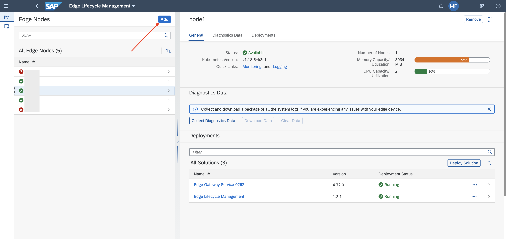

3.  The form is partially populated; you can click **Step3**.

    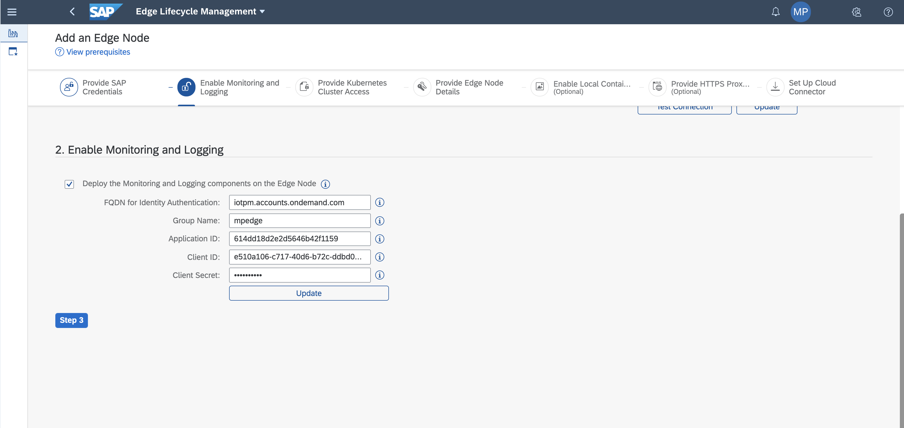

[DONE]
[ACCORDION-END]

[ACCORDION-BEGIN [Step 2: ](Complete the registration)]

To complete the registration process the UI is asking for some configuration parameters and the `kubeconfig.yaml` file.

1.  The **Step 3** consists in the specification of the `kubeconfig.yaml` file of you cluster. Click **Upload** to select the configuration file.

    > Please remember to check the `server` configuration in your `kubeconfig.yaml` file. The server should be an IP address reachable (i.e. in the same network) from the machine where you will launch the onboard script (i.e. your computer)

    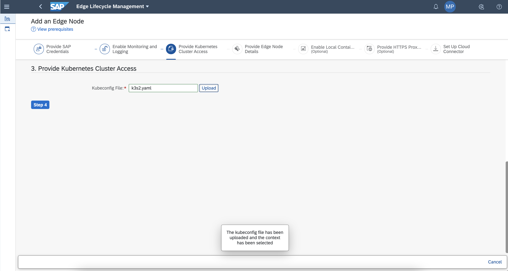

2.  The UI shows in a bubble message that the file has been accepted. Click **Step 4** to go to the next step

3.  **Step 4** is to **Provide Edge Node Details**. Specify a name for the node and an encryption password which will be used to encrypt the configuration file (used by the bootstrap process) you will download and use later, and press the button **Step 5**.

4.  Uncheck the checkbox for **Enable Local Container Registry** and go the **Step 6**.

5.  Keep clean the checkbox if your edge node is not in a proxied network, otherwise check it and specify all the proxy details for the **Provide HTTPS Proxy Details** configuration step. Click **Step 7** to go to the next operation.

    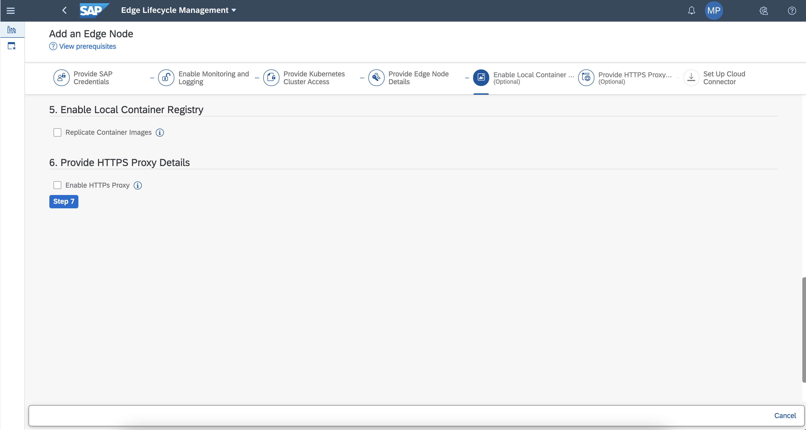

6.  The step **Set Up Cloud Connector** provide a description of what are the next operations you need to execute. Press **Download** to save the `context.cfg` file.

    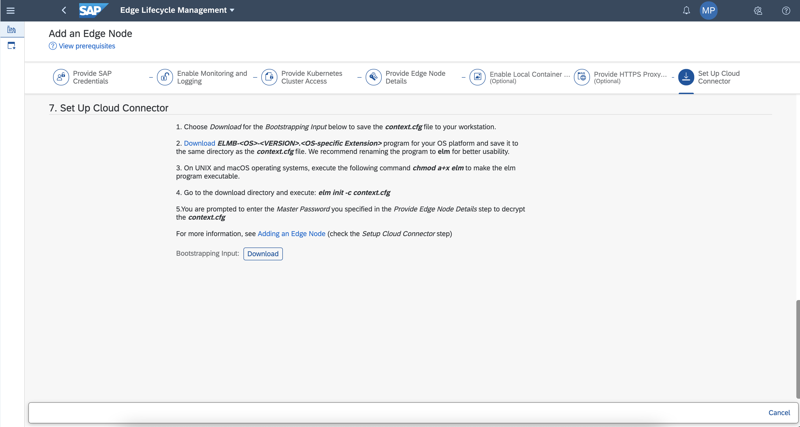

[VALIDATE_1]
[ACCORDION-END]

[ACCORDION-BEGIN [Step 3: ](Complete the onboarding)]

The next operation is required to complete the onboarding process correctly. You need to execute all the operations Explained in the element 6 of the **Step2: Complete the registration**.

1.  [Download](https://launchpad.support.sap.com/#/softwarecenter/template/products/_APP=00200682500000001943&_EVENT=DISPHIER&HEADER=Y&FUNCTIONBAR=N&EVENT=TREE&NE=NAVIGATE&ENR=73554900100200013888&V=MAINT) **ELMB-<OS>-<VERSION>.<OS-specific Extension>** program from the SAP Marketplace for your OS platform and save it to the same directory as the context.cfg file. We recommend renaming the program to elm for better usability.

2.  On UNIX and macOS operating systems, execute the following command `chmod a+x elm` to make the elm program executable.

3.  From the download directory open a bash and execute `elm init -c context.cfg`

    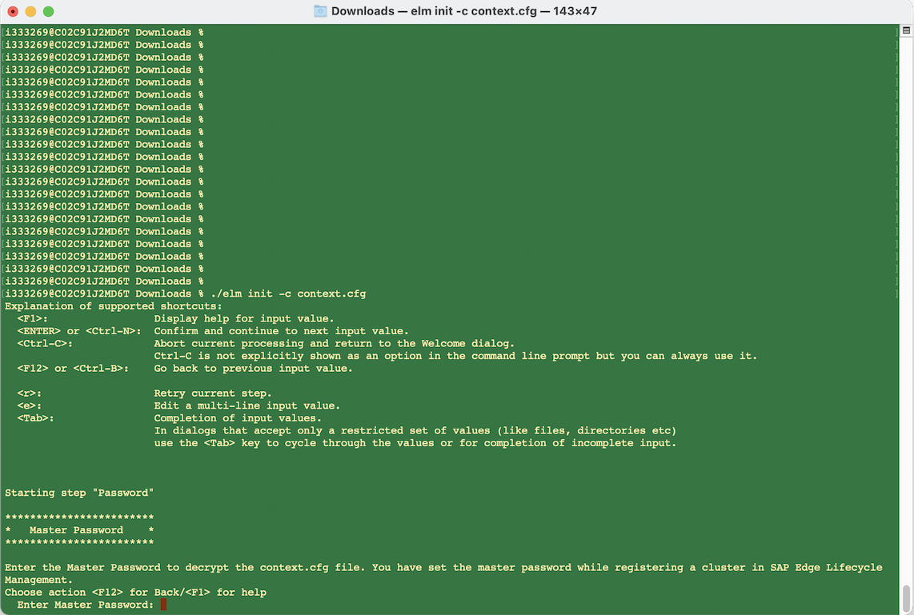

4.  Insert the **`master password`** specified in the element 3 of the **Step 2: Complete the registration**.

5.  Review the provided details and type **`n`** and **`Enter key`** to continue the process.

    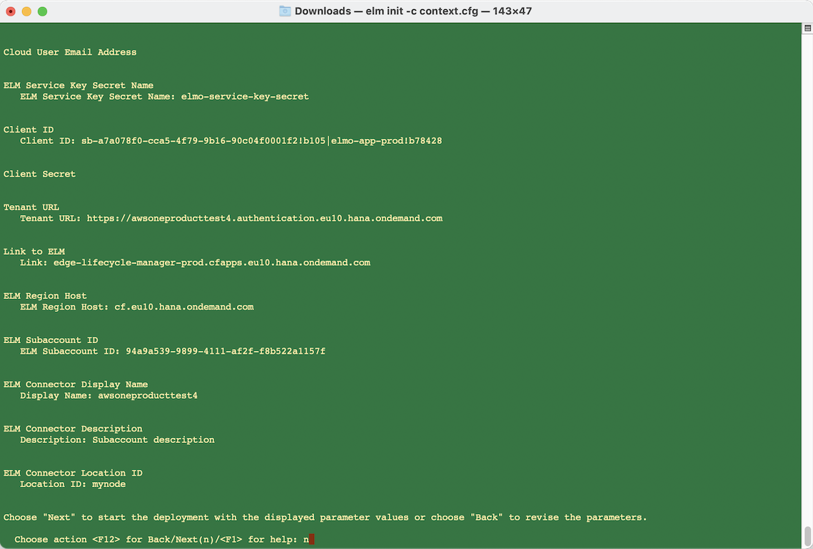

6.  The ELM bridge bootstrap process is now installing all the Edge Lifecycle Management components into your cluster.

    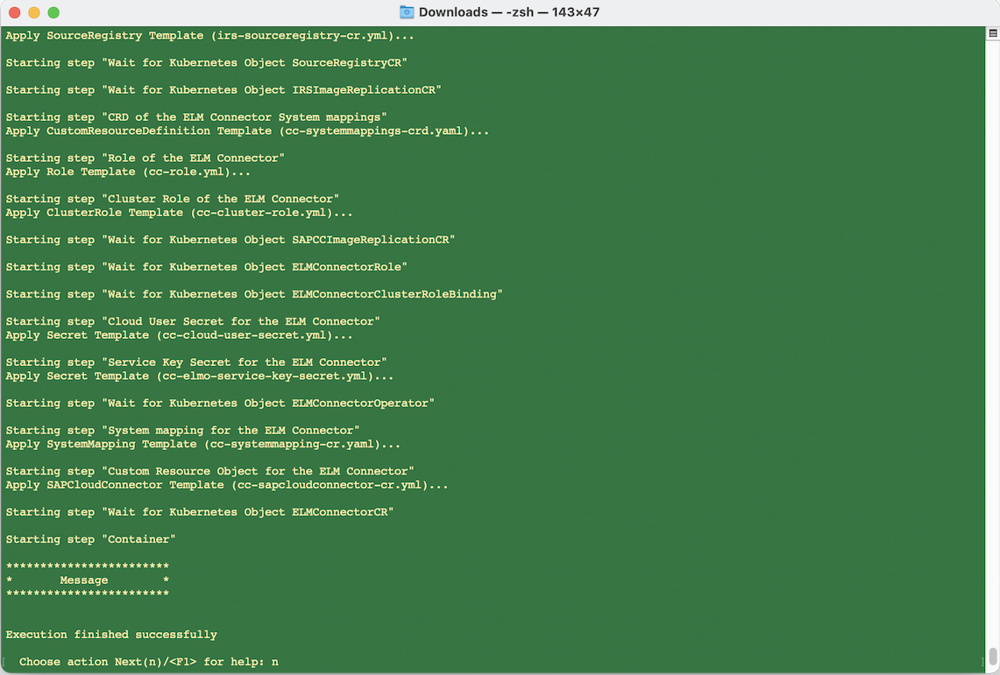

7.  Type **n** and **Enter key** to end the process.

    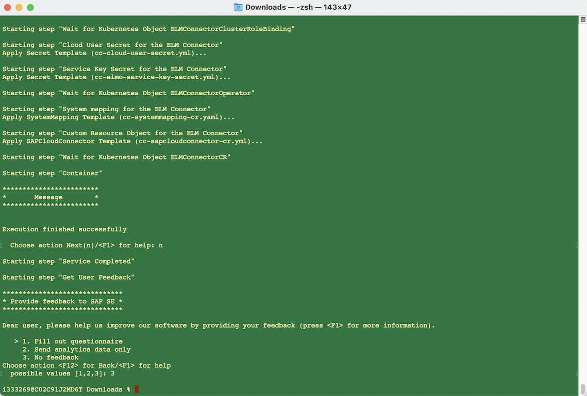

8.  If you are not planning to provide a feedback for your user experience just type **`3`** and press **`Enter key`**.

9.  Go back in the UI of SAP IoT and over the navigation area **Edge Services**, click on the **Edge Lifecycle Management** application, select your node in the list. Verify that the node status is `Initializing` and the status of the Edge Lifecycle Management component is `Installing`. You need to wait till the end of the installation process. It will be completed in some minutes.

    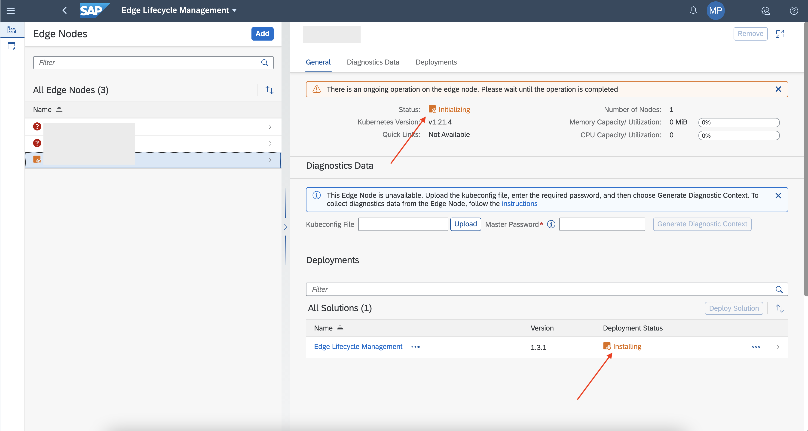

When the onboarding is completed the result should be like in the following image.

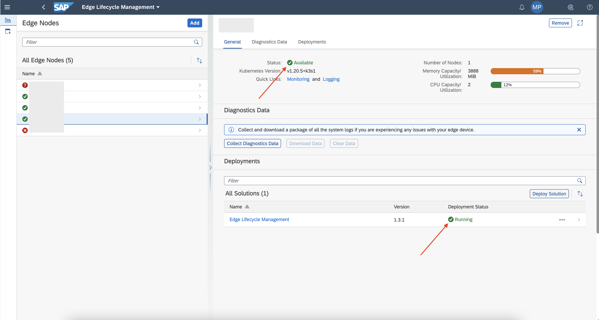

[VALIDATE_2]
[ACCORDION-END]

---
