## Prerequisites
- Basic knowledge of application configurations and IoT concept
- Familiarity with the concept of device model in SAP IoT
- Laptop or PC with browser
- You have configured SAP Edge Service as described in the [Edge Services Onboarding Guide](https://help.sap.com/viewer/product/EDGE_SERVICES/2002/en-US).
- You have followed the steps to enable the backend synchronization as described in [Synchronization Service](https://help.sap.com/viewer/a1c5f93025864b6f9a867a12caf6dd06/2002/en-US/4f6e63e58b9d474f9827864088c99535.html).

## Details
### You will learn
- End to end hands-on experience in building and executing edge scenarios
- How to create streaming rule
- How to create work order action
- How to deploy project to edge node from cloud tool

In this tutorial, you create a SAP Edge Services project. A project is an aggregation of entities such as sensor models, rules, rule data sources, actions, connectors, and runtime settings where you can define and manage each entity and publish the project, which creates a configuration for the Streaming Service.

---

[ACCORDION-BEGIN [Step 1: ](Create edge designer project)]

1. Log onto SAP Edge Services.

    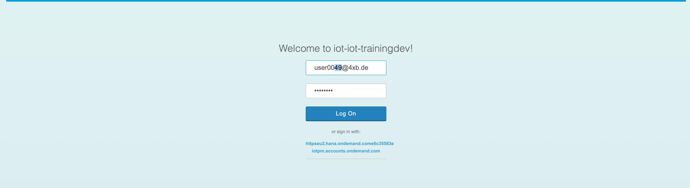

    After logon you will land on the main SAP Edge services screen.

2. Click the **Edge Designer** tile.

    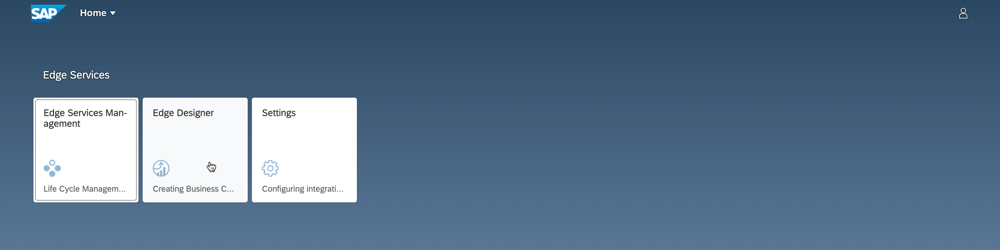

3. Click **+** to add a new project.

    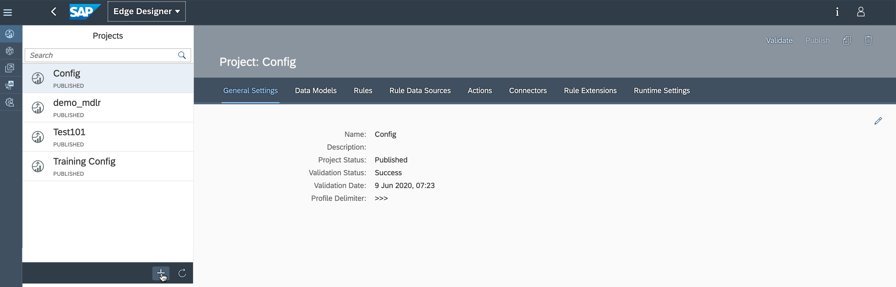

    >A project is an aggregation of entities such as sensor models, rules, rule data sources, actions, connectors, and runtime settings where you can define and manage each entity and publish the project, which creates a configuration for the Streaming Service.

4. Enter the following details in the next screen, and click **Create**.

    >Please note that throughout the tutorial you must replace `XX` with your own assigned number

    |  Field Name     | Value
    |  :------------- | :-------------
    |  Name    | **`TrainingXX`**
    |  Description    | **`TrainingXX`**
    |  Profile Delimiter    | **`>>>`**

    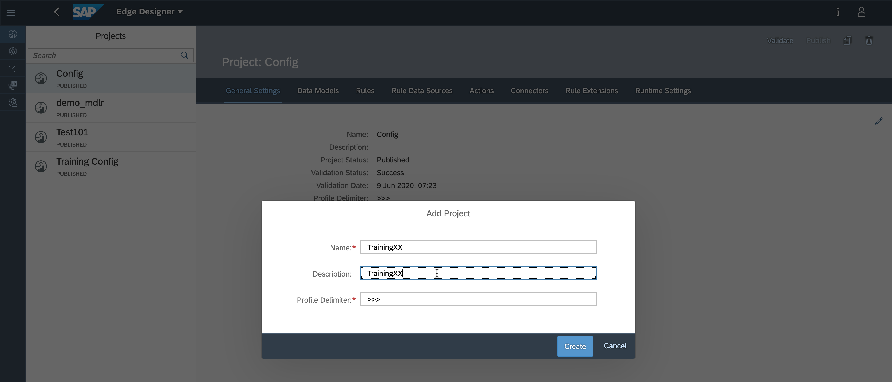

[DONE]
[ACCORDION-END]

[ACCORDION-BEGIN [Step 2: ](Add data model to project)]

1. Click **Data Model**, and then press **+**.

    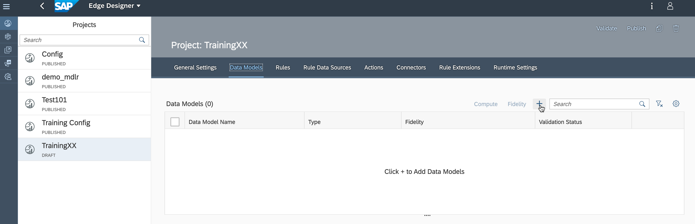

    In SAP IoT services, we have already defined a sensor type **Boiler**, which you are going to use in this project. The Boiler sensor type has two capabilities:  `Temperature` and `Pressure`

2. Select the following values from the dropdown, and then click **Create**:

    |  Field Name     | Value
    |  :------------- | :-------------
    |  Sensor Type    | **`Boiler`**
    |  Capability Name    | **`BoilerTraining`**
    |  Temperature    | **`Check`**

    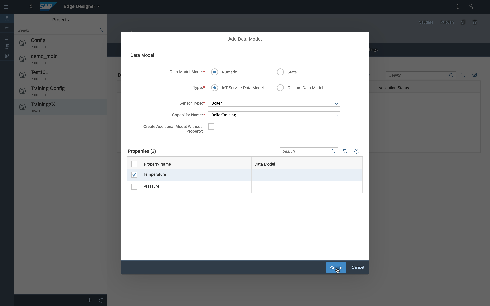

3. Fidelity enables you to configure the SAP Edge Services to selectively send IoT data to cloud (or other target applications) or save at the edge in the configured time interval.

    To set fidelity, select your data model and click **Fidelity**.

    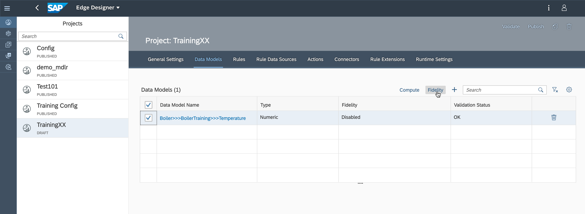

    Set the **Edge Fidelity** and the **Outbound Fidelity** to **Enabled**, and enable **IoT Service Cloud Connector**.

    Click **Save**.

    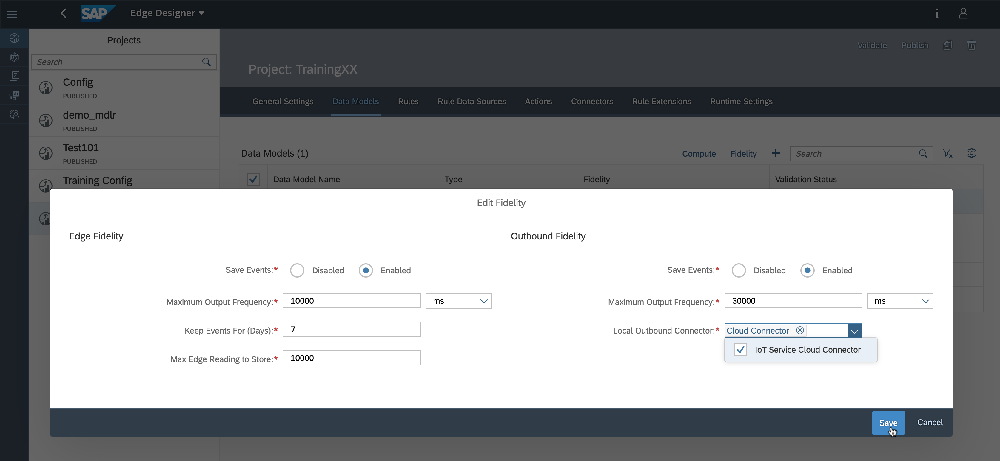

4. Click **Validate** at the top-right.

After a successful validation your screen should look like this:

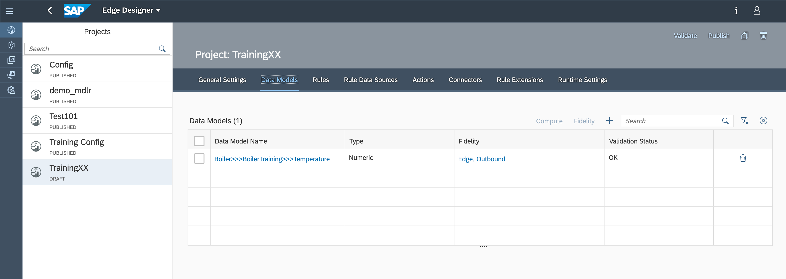

[DONE]
[ACCORDION-END]

[ACCORDION-BEGIN [Step 3: ](Define action)]

Here you define an action that will trigger the creation of the work order. The action will be triggered by a streaming rule that will be created later.

1. Select **Actions**, and then click **+** to the right.

    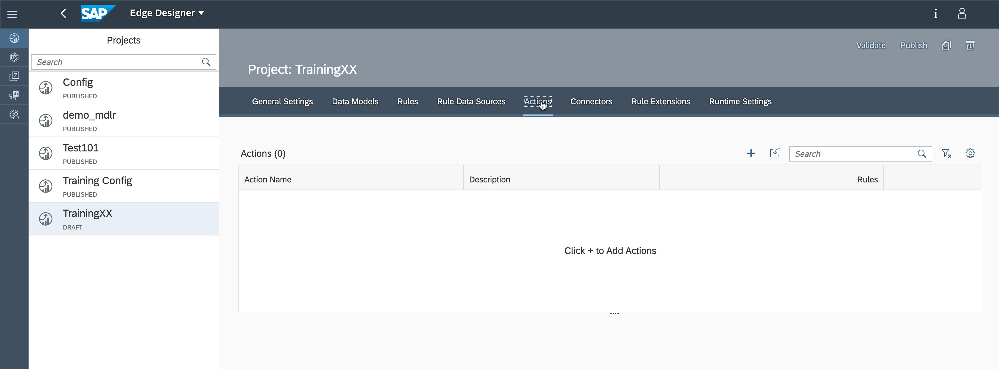

2. Enter the following values for your action, and then click **Save**.

    |  Field Name     | Value
    |  :------------- | :-------------
    |  Action Name | **`Create Work Order`**
    |  Description    | **`Create Work Order in backend`**
    |  Action Type | **`Create Work Order from dropdown`**
    |  Device ID | **`${deviceId}`** |
    |  Subject | **`${deviceId} : Temperature too high`** |
    |  Remarks | **`${deviceId} : Temperature too high`** |
    |  Main Work Center | **`RES-0100`** |

    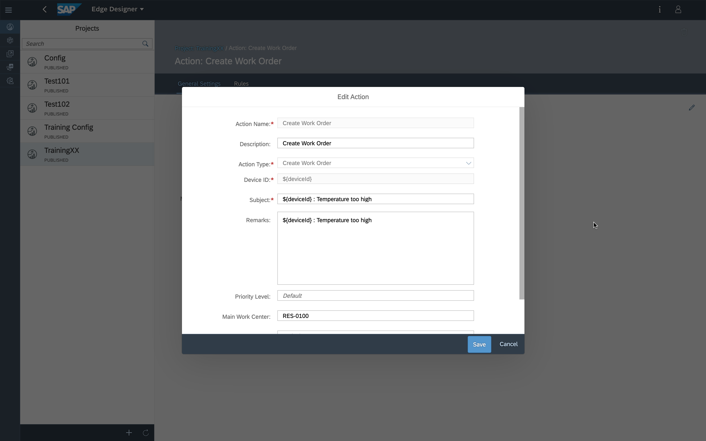

[DONE]
[ACCORDION-END]

[ACCORDION-BEGIN [Step 4: ](Define rule)]

Here you will define the rule that will trigger the action we created in the previous step.

1. Click **Rules**, and then click **+**.

    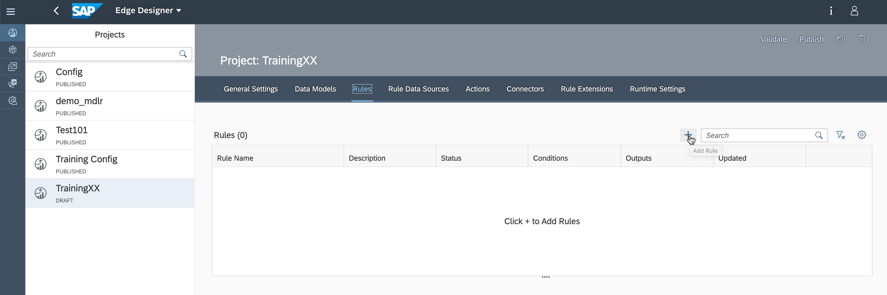

2. Add the following values to the rule definition, and then click **Create**.

    |  Field Name     | Value
    |  :------------- | :-------------
    |  Name | *Check Temperature*
    |  Description | *Check Temperature rule*
    |  Send Edge Event | *enabled*

    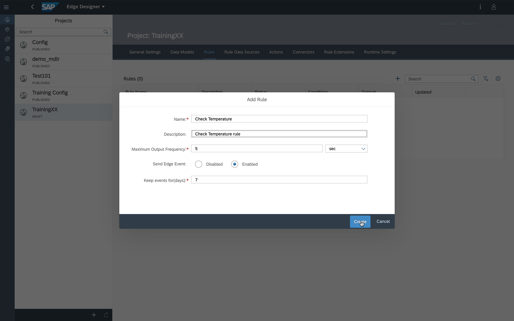

3. Select the rule by clicking its name.

    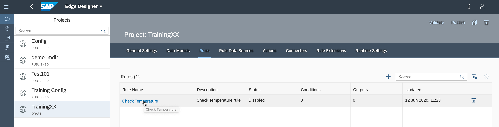

4. Click **Conditions**.

    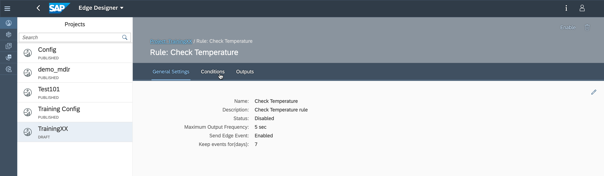

5. Click **+** to add a condition.

    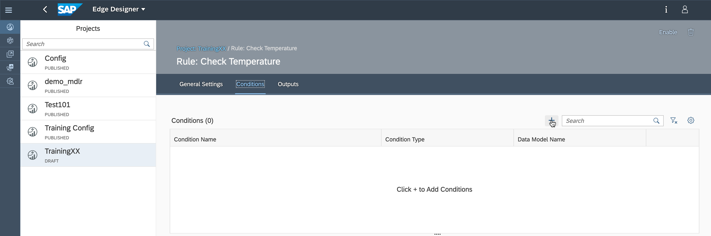

6. Add the following values to the condition, and then click **Create**.

    |  Field Name     | Value
    |  :------------------- | :------------------
    |  Name | **`temperature over 80`**
    |  Filter | **`Any`**
    |  Condition Type | **`Value monitoring`**
    |  Data Model Name | **`Boiler>>>BoilerTraining>>>Temperature`**
    |  Operator | **`>`**
    |  Threshold Value | **`80`**

    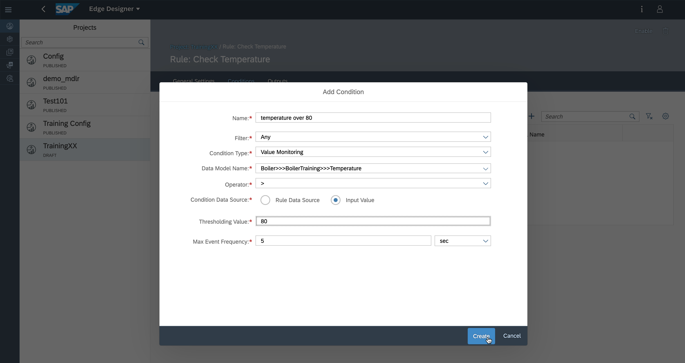

7. Click **Outputs**, and then click **+** to define what should be triggered if this rule is true.

    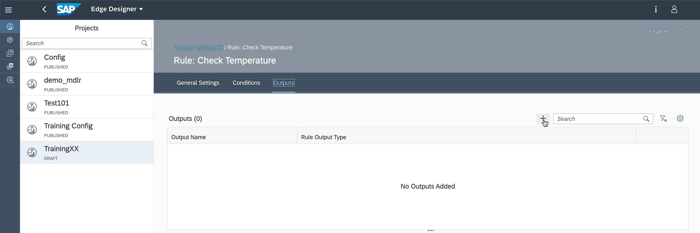

8. For **Output Type**, select **Action**, and then enter **`Create Work Order`**, and then click **Create**.

    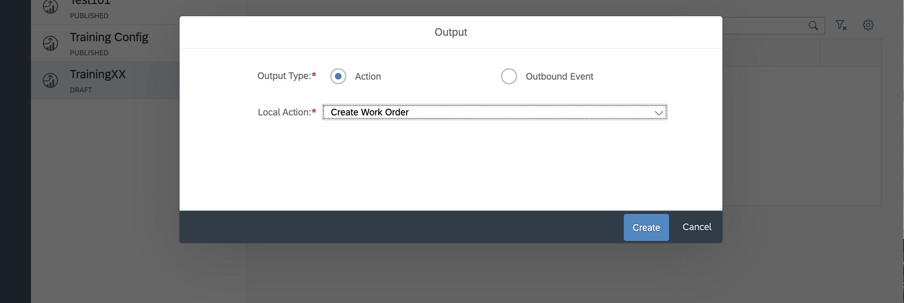

9. Click **Enable** on the top-right to enable the rule.

    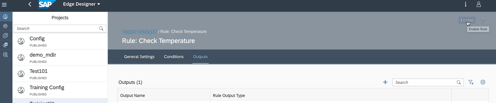

[DONE]
[ACCORDION-END]

[ACCORDION-BEGIN [Step 5: ](Define runtime settings)]

The gateway needs to connect to a central edge gateway (EBF service), which is configured to create the work order in S/4HANA.

1. Select your project from the navigation.

    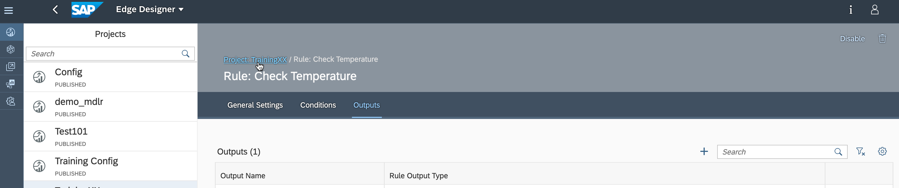

2. Click **Runtime Settings**, and then click the pencil icon.

    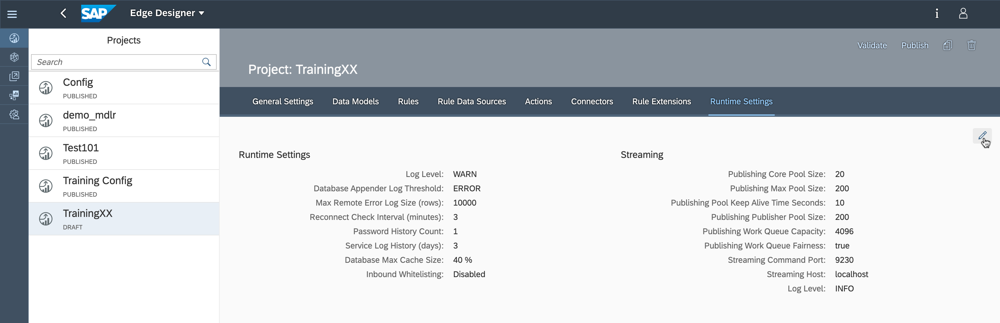

    In runtime settings, enter the following values, and then click **Save**.

    |  Field Name     | Value
    |  :------------------- | :------------------
    |  Enable EBF Configurations | **On**
    |  Host Name  | **`https://3.123.194.136`**
    |  Port | **`8443`**
    |  Authentication (Base64) | **`RUJFRjpJbml0aWFs`**
    |  Validate Certificates | Unchecked

    >The last 4 values will only be display if you **Enable EBF Configurations**.

    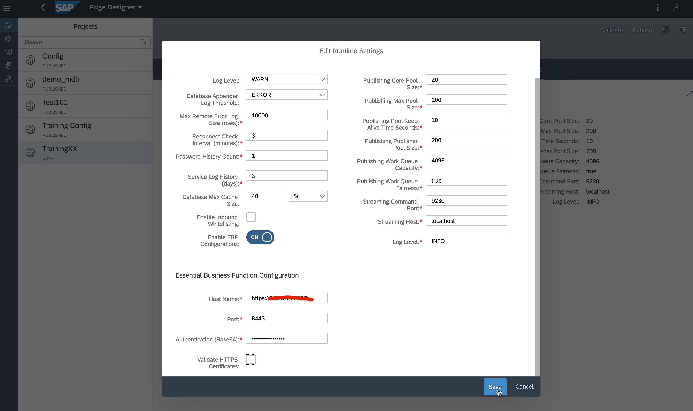

Your screen should look like this now.

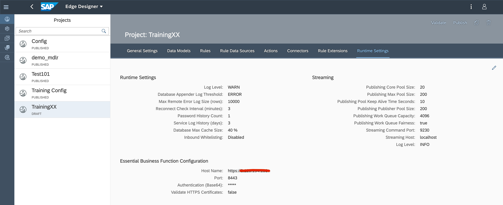

[DONE]
[ACCORDION-END]

[ACCORDION-BEGIN [Step 6: ](Define connector settings)]

Go to **Connectors** and select **HTTP Inbound Connector**.

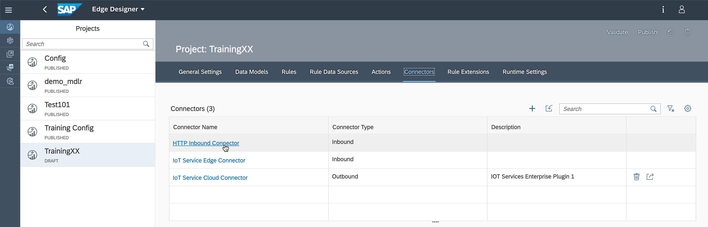

Use the pencil icon to change the values of the following configuration parameters:

|  Field Name     | Value
|  :------------------- | :------------------
|  Authentication Type | **None**
|  Secure only  | **false**

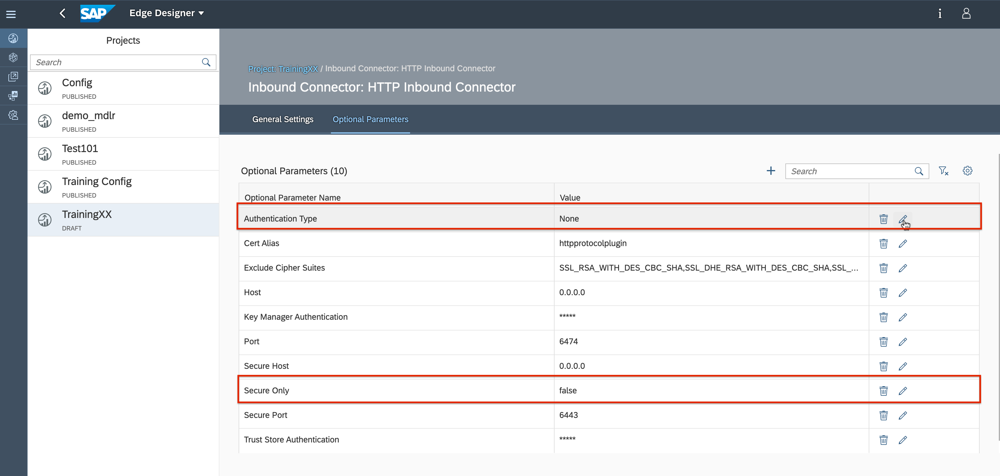

[DONE]
[ACCORDION-END]

[ACCORDION-BEGIN [Step 7: ](Publish project)]

In this step, you perform a final validation of the project, and then publish the project so it can be deployed to the gateways.

Click **Validate** on the top-right.

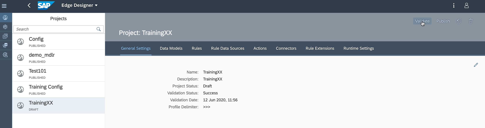

Publish it with a configuration name that you can later find, like Training-XX-V1.

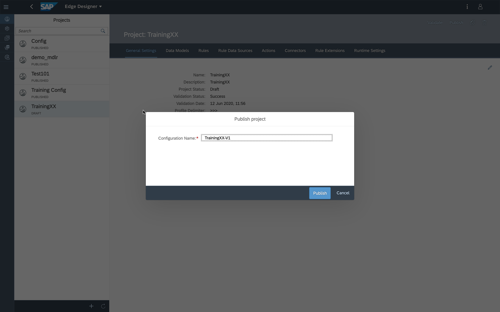

[VALIDATE_1]
[ACCORDION-END]

In the [next tutorial](iot-edge-plant-maintenance-2), you will deploy the project to an SAP Edge Gateway.
