## Prerequisites
- Basic knowledge of application configurations and IoT concept
- Familiarity with the concept of device model in SAP IoT
- Laptop or PC with browser
- You should have already created a SAP Edge Services project by completing [the first](iot-edge-plant-maintenance-1)

## Details
### You will learn
- End to end hands-on experience in building and executing edge scenarios
- How to create streaming rule
- How to create work order action
- How to deploy project to edge node from cloud tool

---

[ACCORDION-BEGIN [Step 1: ](Deploy project to gateway)]

1. Log onto SAP Edge Services.

    After logon, you will land on the main SAP Edge Services screen.

    Click on **SAP Edge Services Management**.

    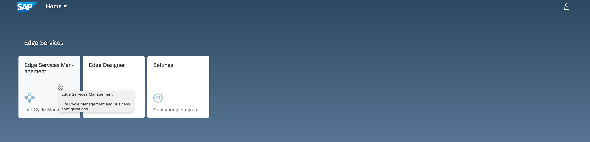

2. Select the gateway where you want to deploy your project (Gateway XX).

    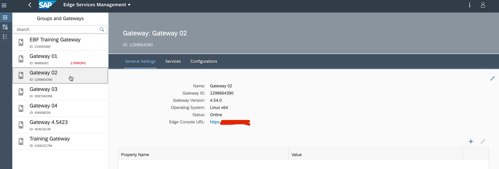

3. Select **Configurations** and click **+** on the right.

    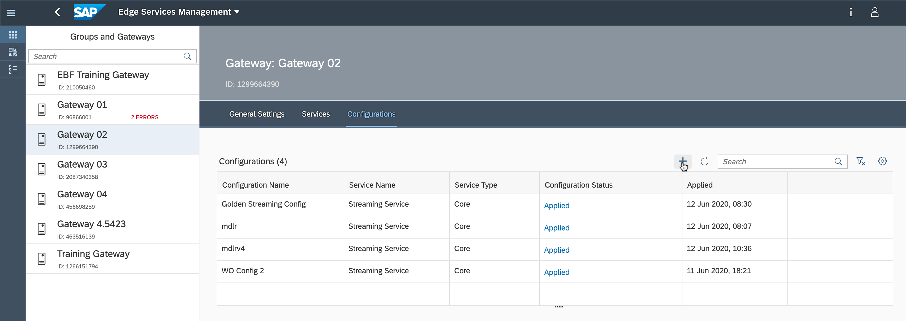

4. From the dropdown, select **Streaming Service**, for **Configuration** select your published project, and then click **Apply**.

    If you followed the naming given in the first part of the tutorial, it should be named something like  `TrainingXX-v`.

    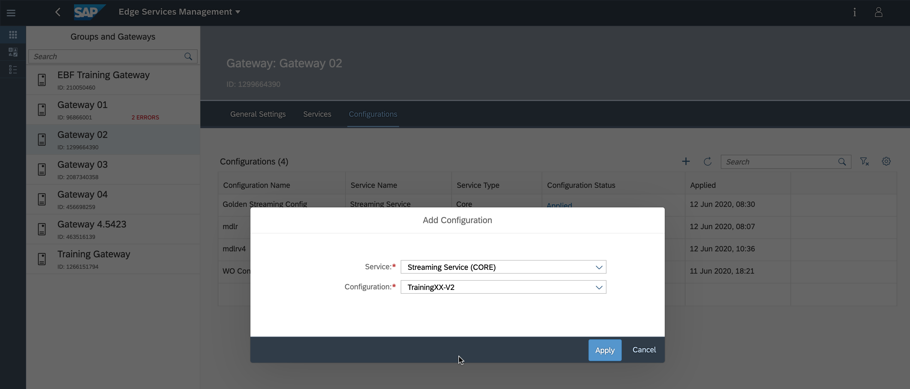

    The configuration will be downloaded to the gateway. This might take a few seconds.

    Click the refresh button on the right until you see the configuration status **Applied**.

    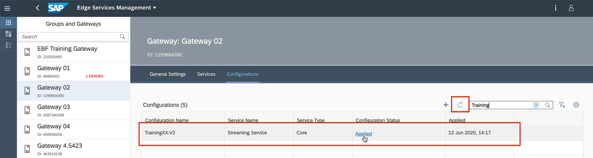

[DONE]
[ACCORDION-END]

[ACCORDION-BEGIN [Step 2: ](Verify deployment in SAP Edge Gateway)]

In this step, you will log into the SAP Edge Services gateway and verify that the deployment was done correctly.

1. Go to **General Settings** of your gateway, and click the **Edge Console URL**.

    > **Important Note for Mac Users** : Use the Safari browser for this part of the exercise. If you want to use any other browser make sure you import the server certificate into your Keychain  Access app and modify the certificate trust to `Always Trust`

    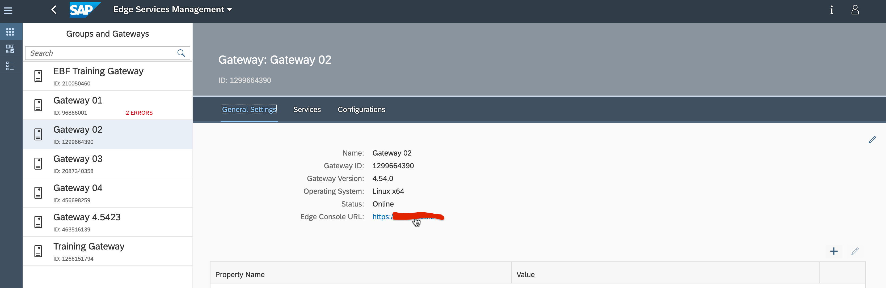

    A new window will open and you will land on the logon page of the SAP Edge Services gateway.

2. Log on with the following credentials:

    |  Field Name     | Value
    |  :------------- | :-------------
    |  Name    | **`admin`**
    |  Password    | **`AdminAdmin1`**

    

3. You should see a Sensor Profile named `BoilerTraining>>>2...3>>>Boiler ...`

    Please verify that both rules are enabled.

    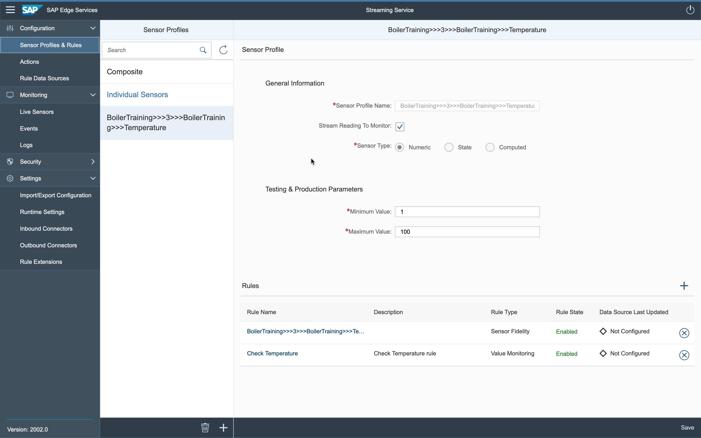

    Under **Actions**, you should see your action `Create Work Order`.

    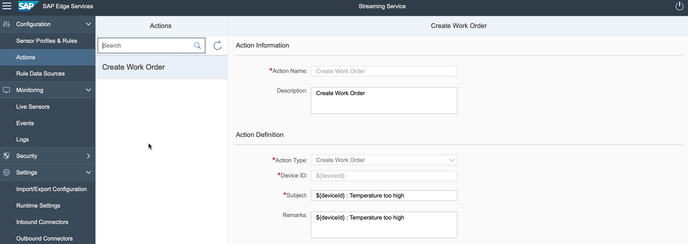

    Finally, verify under **Runtime Settings** that you have unchecked the **Validate HTTPS Certificates** flag.

    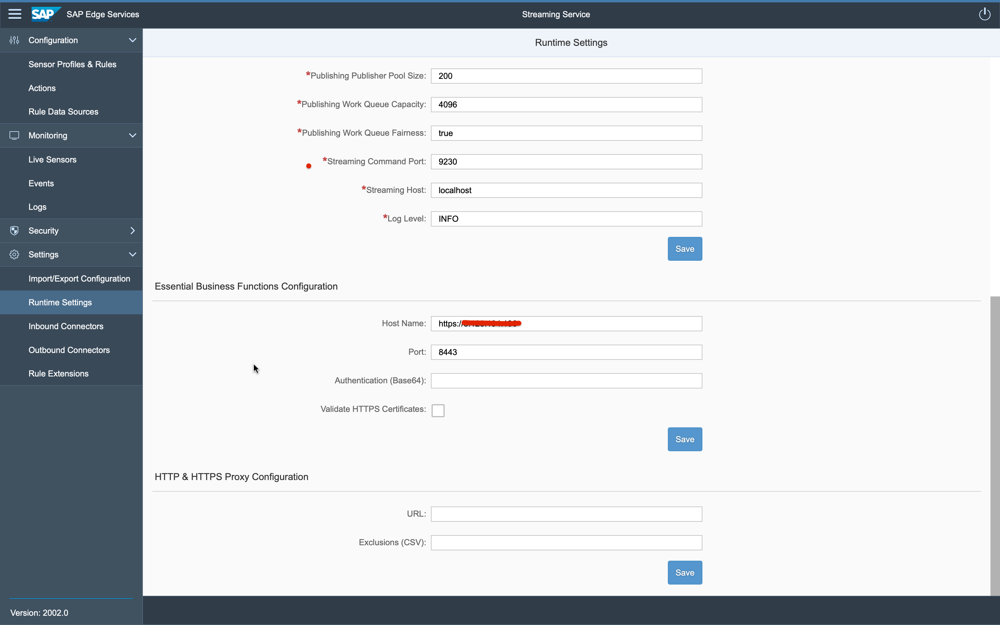

[DONE]
[ACCORDION-END]

[ACCORDION-BEGIN [Step 3: ](Simulate device)]

You can test end-to-end rule logic using the built-in emulated device and emulated sensor controls. The **Live Sensors Emulation** view displays all sensor profiles configured to Stream Readings to Monitor.

We will use this functionality to trigger the rule that we created in the previous tutorial. This rule will trigger the creation of the work order.

1. Select the **Sensor Profiles** option on the left and then your sensor profile.

2. Check the option **Stream Reading to Monitor**, and click **Save**.

    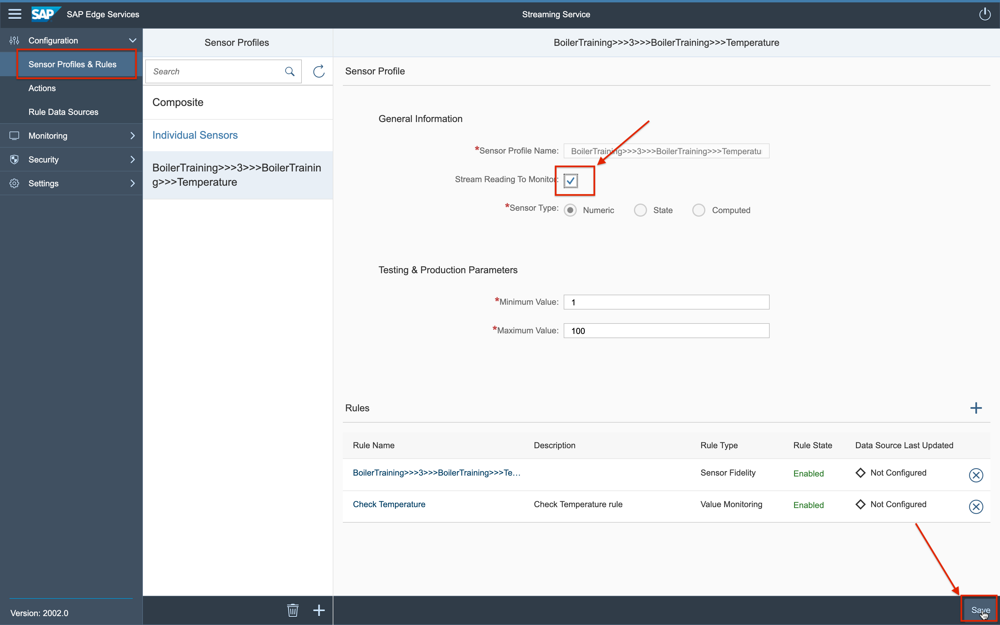

3. Now simulate sensor readings by doing the following:

    - Select **Live Sensors** on the left sidebar.
    - Enter  **`Student_X`** as the device under **Device ID** , e.g. Student_2.
    - Click the play button.

    You can move the slider to increase and decrease the value of the reading but keep it under 80 for now. The simulated values will start populating the screen.

    Remember that we defined a rule that will trigger when the temperature exceeds 80.

    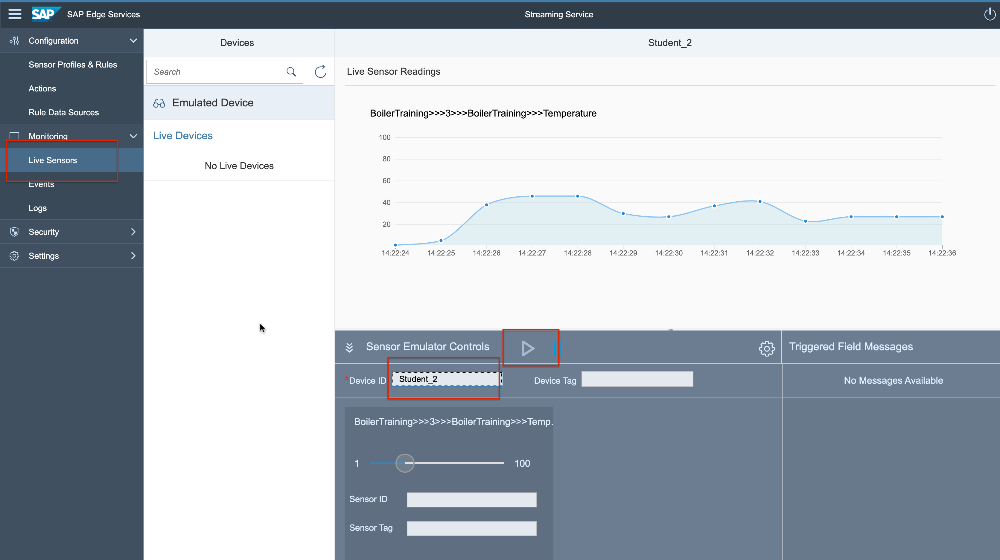

[DONE]
[ACCORDION-END]

[ACCORDION-BEGIN [Step 4: ](Trigger rule and create work order)]

1. Move the slider to the right until it reaches a value over 80. Wait until you have 2 readings and slide the value back to under 80.

    You can now pause the emulator by pressing the Pause button.

    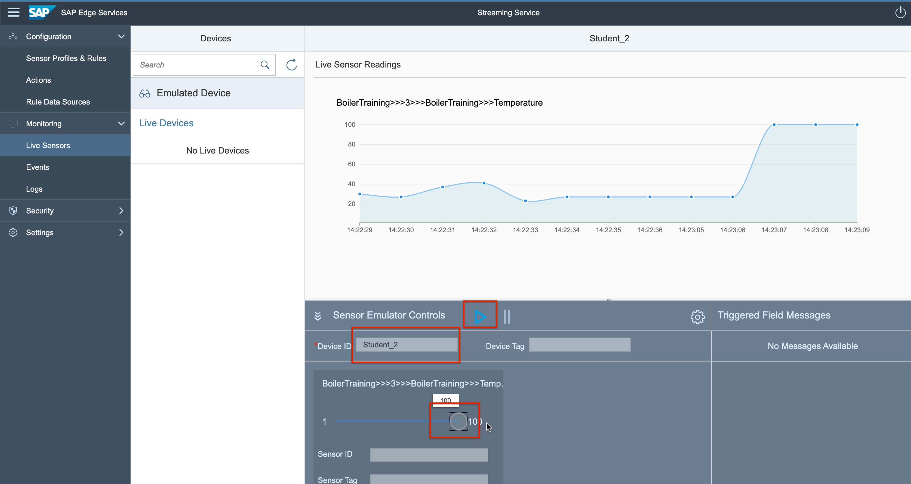

2. Now check if the temperature increase has triggered an event.

    Select **Events** on the left sidebar. You should see an event called  **`Check Temperature`**.

    

    The event **`Check Temperature`** will trigger the action **`Create Work Order`**.

If the order was created, it can only be verified in the EBF system.

This is how it would look there:

!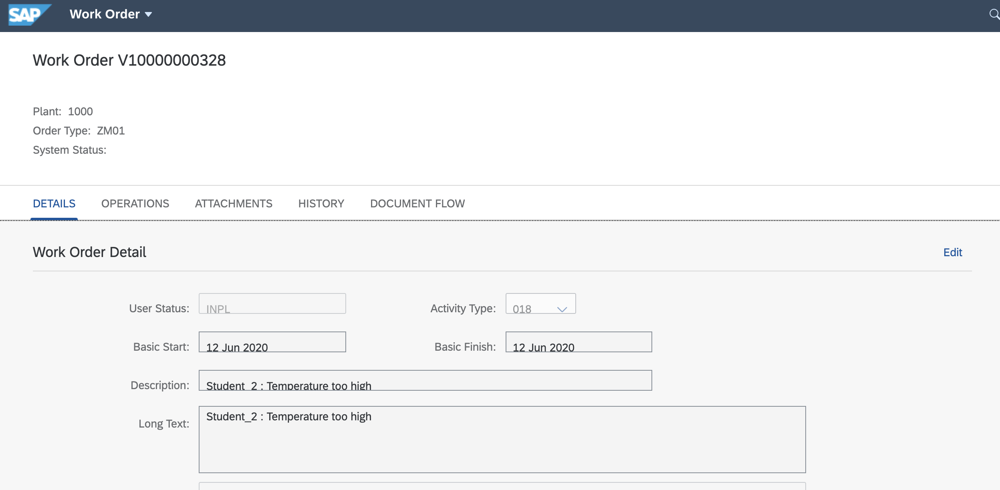

Please ask a person with access to the system to verify if the order was created.

[VALIDATE_1]
[ACCORDION-END]
