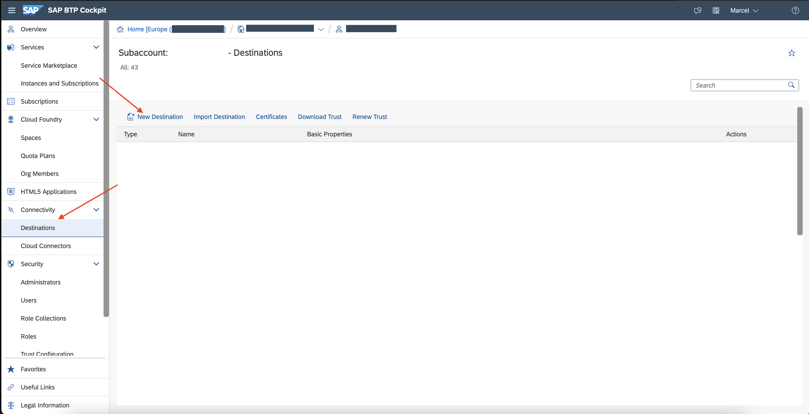
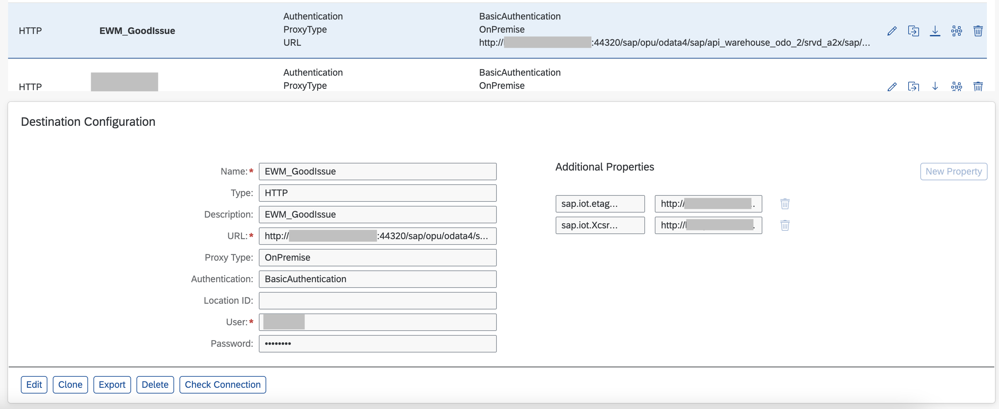
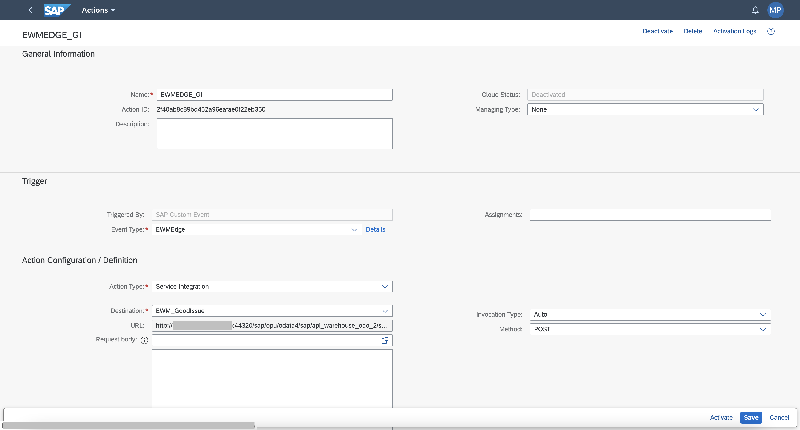
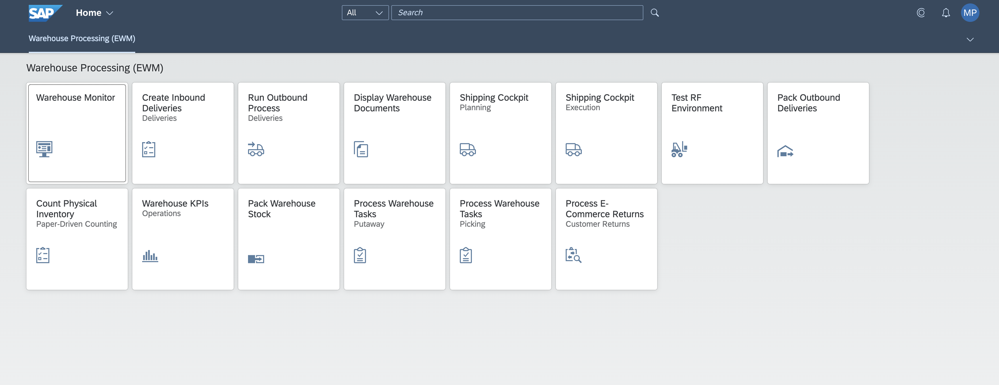
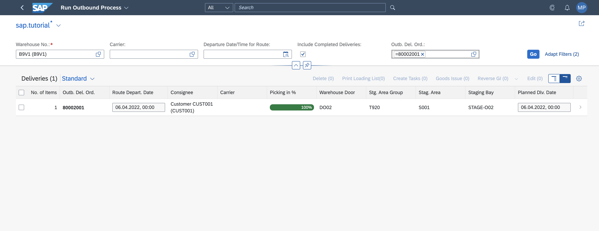
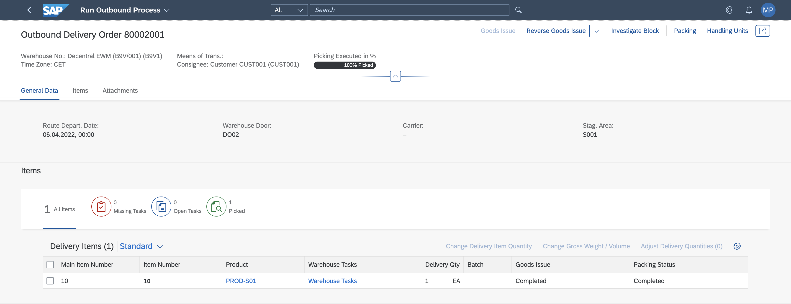

## Prerequisites

## Prerequisites
 -   You have licensed SAP Internet of Things (with the new capacity unit based licensing introduced in August 2020, your company has a Cloud Platform Enterprise Agreement or Pay-As-You-Go for SAP BTP and you have subscribed to the `oneproduct` service plan)
 -   You have setup the subscription for SAP IoT in your global account in a tenant (e.g. in the DEV tenant, the guide for the basic setup is at [Get Started with Your SAP IoT Account](https://help.sap.com/viewer/195126f4601945cba0886cbbcbf3d364/latest/en-US/bfe6a46a13d14222949072bf330ff2f4.html) ).
 - You have knowledge how to [manage users](https://help.sap.com/viewer/65de2977205c403bbc107264b8eccf4b/Cloud/en-US/a3bc7e863ac54c23ab856863b681c9f8.html) and [role collections](https://help.sap.com/viewer/65de2977205c403bbc107264b8eccf4b/Cloud/en-US/9e1bf57130ef466e8017eab298b40e5e.html) in the SAP Business Technology Platform
 - Your SAP User has at a minimum the `iot_role_collection` created during onboarding of your tenant and the associated roles (see [SAP Help on Providing Authorizations](https://help.sap.com/viewer/195126f4601945cba0886cbbcbf3d364/latest/en-US/2810dd61e0a8446d839c936f341ec46d.html) ) and all the required roles for the SAP Internet of Things Edge feature, see [Configure Role Collections for Users](https://help.sap.com/viewer/247022ddd1744053af376344471c0821/2109b/en-US/7e0ddf3d1ef24a42b68cd75fc526302c.html#5f0427eab54d467bb18871ce0d41e862.html)
 -   You have already completed [Install Smart Sensing Edge](iot-edge-smartsensing-install)

## Details
### You will learn
-   How to shape and deploy an action in an existing edge node
-   How to ingest an EPCIS to trigger the Good Issue directly from the edge

---
[ACCORDION-BEGIN [Step 1:](Add the Good Issue BTP Destination)]

Create a Destination to be used in your action to invoke the Good Issue for your goods movement scenario.

1.  Go to your Cloud Foundry subaccount at <https://hana.ondemand.com/>, click **Connectivity** on the left panel and then click **Destinations** and **New Destination**

    !

2.  Under **Destination Configuration**, add the information according to your SAP EWM setup:

    |  Property Name     | Sample Value          | Remark   |        
    |  :------------- |  :------------- |  :-------------
    |  Name           | **`EWM_GoodIssue`**  | of your choice |
    |  Type           | `HTTP` |  |
    |  Description    | **`EWM_GoodIssue`** | of your choice |
    |  URL            | **`http://myonprem.com:44320/sap/opu/odata4/sap/api_warehouse_odo_2/srvd_a2x/sap/warehouseoutbdeliveryorder
    /0001/WhseOutboundDeliveryOrderHead('^{lastValue(${EWMEdge.HandlingUnitReferenceDocument})}')
    /SAP__self.PostGoodsIssue?sap-client=131`** | URL of the Good Issue. Replace `myonprem.com:44320` with the real URL of your system and the value of the query parameter `sap-client` with the value set in your system, if different from `131` |
    |  Proxy Type     | `OnPremise`| Since the system is Decentralized EWM it's expected to be `OnPremise`. If you are using a different system (i.e. the embedded Warehouse Management), if publicly exposed, it could be `Internet`. Please note that in case of `OnPremise`, it's expected to have the SAP Cloud Connector already set for the Business Technology Platform. |
    |  Authentication | `BasicAuthentication`, `OAuth2ClientCredentials` ... | based on your setup in the Communication Arrangement or Cloud Connector |

    >The **URL** field depends on the physical address of your Decentralised SAP Extended Warehouse Management (SAP EWM).
    >The placeholder token `^{lastValue(${EWMEdge.HandlingUnitReferenceDocument})}` is replaced at runtime by Actions in SAP Internet of Things with the actual values.
    >
    >The value is set trough the event enrichment. The above placeholders contain the `EWMEdge` string, this is the name of your event enrichment. Replace it with the desired value if you are planning to use a different one.


3.  Under the **Additional Properties** section, choose **New Property** and add the following properties:

    |  Property Name    | Sample Value |     Remark  |
    |  :-------------   | :-------------    | :-------------
    |  `sap.iot.etagURL`          | **`http://myonprem.com:44320/sap/opu/odata4/sap/api_warehouse_odo_2/srvd_a2x/sap/warehouseoutbdeliveryorder
    /0001/WhseOutboundDeliveryOrderHead('^{lastValue(${EWMEdge.HandlingUnitReferenceDocument})}')?sap-client=131`** | It permits to fetch automatically the `etag` value for your post Good Issue. Replace `myonprem.com:44320` with the real URL of your system and the value of the query parameter `sap-client` with the value set in your system, if different from `131` |
    |  `sap.iot.XcsrfURL`          | **`http://myonprem.com:44320/sap/opu/odata4/sap/api_warehouse_odo_2/srvd_a2x/sap/warehouseoutbdeliveryorder
    /0001/WhseOutboundDeliveryOrderHead('^{lastValue(${EWMEdge.HandlingUnitReferenceDocument})}')?sap-client=131`** | It permits to fetch automatically the `X-csrf` header to be used in your post Good Issue to made it compliant with the cross-site request forgeries check. Replace `myonprem.com:44320` with the real URL of your system and the value of the query parameter `sap-client` with the value set in your system, if different from `131` |

    >Identically with the definition of the URL of the destination, the placeholder token `^{lastValue(${EWMEdge.HandlingUnitReferenceDocument})}` is replaced at runtime by Actions in SAP Internet of Things with the actual values. The `EWMEdge` string is the name of your event enrichment. Replace it with the desired value if you are planning to use a different one.

    !


[DONE]
[ACCORDION-END]

[ACCORDION-BEGIN [Step 2: ](Create Actions)]

The invocation of actions could be triggered directly by custom events generated automatically within the **Event Enrichment**, while scanning a tag and ingesting an EPCIS event. In this scenario we are automatically invoking the Good Issue for an Outbound Delivery, processing the event and computing the action at the edge.

1.  In the Fiori launchpad of SAP IoT open the application **Actions**.

2.  In the list of existing actions select the **Version 2** in the combo box **Version**. Press **Create** to create a new action.

3.  Compile the **General Information** by providing a name i.e. `EWMEdge_GoodIssue`.

4.  In the **Trigger** area select the **Event Type** with the same name of your enrichment, i.e. `EWMEdge`.

5.  In the **Action Configuration / Definition** area, select **Service Integration** as **Action Type**

6.  Select the destination modelled in the Step 1 of the current tutorial to create the EWM Good Issue, i.e. `EWM_GoodIssue`

    !

7.  **Save**, reopen your action and **Activate** it.

8.  In the activation screen keep selected **Activate on Cloud** and select **Activate on Edge**. Input the **Edge Node Descriptor** you have already defined and configured in your edge node, i.e. `ewm`.

[VALIDATE_1]
[ACCORDION-END]

[ACCORDION-BEGIN [Step 3: ](Create EPCIS Device)]

The action created in the previous step will be triggered directly while receiving an EPCIS event. A device representing the scanner, onboarded into the Edge Gateway Service is required to complete this operation.

The creation of the device model for the EPCIS scanner is also explained in [this tutorial](iot-autoid-device).

We have provided a set of sample Postman collections on GitHub for you to download. Please clone or download/unzip the repository [sap-iot-samples](https://github.com/SAP-samples/sap-iot-samples/tree/main/iot-smart-sensing-samples/Smart%20Sensing%20Edge%20-%20Good%20Issue%20-%20Postman). The Postman collections and environment (in folder `iot-smart-sensing-samples/Smart Sensing Edge - Good Issue - Postman`) includes all the API calls used in these tutorials and the payload structures for the same. Import both into your Postman.

Before stating to do invocations you need to select the Environment in Postman an change the **Current Value** of some variables.

>For further information you can check the [official Postman documentation](https://learning.postman.com/docs/sending-requests/managing-environments/)

1.  Select the `SAP-IoT-Edge` environment.

2.  Change the value of **`gatewayAlternateId`** variable with the value of the **Alternate Id** specified during the installation of the **Edge Gateway Service**.

3.  Change the parameter **local-ip** with a reachable IP address of your edge node and for the **local-port** use the value **Ingestion TCP Port** parameter of the Edge Gateway Service

4.  Change the value of **package** with your SAP IoT package, i.e. `sap.tutorial`.

5.  Refer to this document to [retrieve Client ID and Client Secret](https://help.sap.com/viewer/fffd6ca18e374c2e80688dab5c31527f/2009a/en-US/a41c28db0cf449059d48c23fa5f7b24b.html). You can use the client credentials to retrieve the OAuth token. You can access all the APIs and data within the subaccount using this OAuth token.

    -   Update the `identityzone` value (take it from the service keys generated in your subaccount) in the Postman environment variable.

    -   Update the `uaadomain` value (take it from the service keys generated in your subaccount) in the Postman environment variable.

    -   Copy the Client ID and Client Secret from the service keys generated in your subaccount into the `client_id` and `client_secret` Postman environment variables.

> You can refer to the [SAP Help Portal](https://help.sap.com/viewer/fffd6ca18e374c2e80688dab5c31527f/latest/en-US/7b3a94e68be9460680a915138a160c67.html) to create an OAuth Token if you would like to understand the steps for generating the token in detail.

6.  Verify the endpoints, i.e. `deviceService`, URL in the Postman environment. All the endpoints are available in the service keys; for `deviceService` you  can use the value of **`iot-device-connectivity`** removing initial **`https://`**, for example **`iot-device-connectivity-noah-live.cfapps.eu10.hana.ondemand.com`**.

7.  Perform in order all the steps of the collection from **Step 0: GET OAuth Token** to **Step 3.5: Map Thing** and verify for each step the answer of the invocation is success (HTTP codes 2XX).

[DONE]
[ACCORDION-END]

[ACCORDION-BEGIN [Step 4: ](Simulate EPCIS event)]

The activation of the event enrichment happen every time a valid EPCIS message is received.

the structure of a EPCIS message is similar to the following sample code

```XML[10]
<?xml version="1.0" encoding="UTF-8"?>
<epcis:EPCISDocument xmlns:epcis="urn:epcglobal:epcis:xsd:1" xmlns:example="http://ns.example.com/epcis" xmlns:xsi="http://www.w3.org/2001/XMLSchema-instance" creationDate="2005-07-11T11:30:47.0Z" schemaVersion="1.2">
   <EPCISBody>
      <EventList>
         <ObjectEvent>
            <readPoint>
              <id>ReaderEdge</id>
            </readPoint>
            <epcList>
               <epc>urn:epc:id:sscc:0614141.1234567800</epc>
            </epcList>
            <bizStep>urn:epcglobal:cbv:bizstep:shipping</bizStep>
            <disposition>urn:epcglobal:cbv:disp:in_process</disposition>
         </ObjectEvent>
      </EventList>
   </EPCISBody>
</epcis:EPCISDocument>
```

Escape the XML snippets (e.g. using a JSON String Escape tool) and copy it as value in the JSON Payload for the field `eventxml` in the **Step 5: Send data** of your Postman collection. The result will look similar to the JSON example below.

```JSON
{
  "capabilityAlternateId": "{{EPCIS_Capability_AlternateId}}",
  "sensorAlternateId": "{{EPCIS_Device_Name}}",
	"measures": [{
		"eventxml": "<?xml version=\"1.0\" encoding=\"UTF-8\"?>\r\n<epcis:EPCISDocument\r\n    xmlns:epcis=\"urn:epcglobal:epcis:xsd:1\">\r\n    <EPCISBody>\r\n        <EventList>\r\n            <ObjectEvent>\r\n                <readPoint>\r\n                    <id>ReaderEdge<\/id>\r\n                <\/readPoint>\r\n                <epcList>\r\n                    <epc>urn:epc:id:sscc:6666666.0000000507<\/epc>\r\n                <\/epcList>\r\n                <bizStep>urn:epcglobal:cbv:bizstep:shipping<\/bizStep>\r\n                <disposition>urn:epcglobal:cbv:disp:in_process<\/disposition>\r\n            <\/ObjectEvent>\r\n         <\/EventList>\r\n    <\/EPCISBody>\r\n<\/epcis:EPCISDocument>"
	}]
}
```

-   Press **Send** to send the event.

Now you can check the status of the Good Issue.

1.  Open the the Fiori Launchpad of your EWM system and click on **Run Outbound Process** application.

    !

2.  Fill up the search fields by specifying the **Warehouse No.** and other relevant parameters, i.e. `Outb. Del. Ord.` (which is the reference document field of your Handling Unit).

    !

3.  In the **Delivery Items** table, check the status of the **Good Issue**. It's now **Completed**.

    !


>You can also obtain the same information via [API](https://api.sap.com/api/WAREHOUSEOUTBDELIVERYORDER_0001/resource) by searching in your EWM system for the delivery linked to the Handling Unit which have been scanned (using the reference document).
>
>Check the status of the field `GoodsIssueStatus` is now equal to `9`
>
>```JSON[21]
>{
>    "@odata.context": "../$metadata#WhseOutboundDeliveryOrderItem",
>    "@odata.metadataEtag": "W/\"20220429085209\"",
>    "value": [
>        {
>            "@odata.etag": "W/\"SADL-020220429145238C~20220429145238\"",
>            "EWMOutboundDeliveryOrder": "80002001",
>            "EWMOutboundDeliveryOrderItem": "10",
>            "EWMWarehouse": "B9V1",
>            "EWMDeliveryDocumentCategory": "PDO",
>            "EWMOutbDelivOrderItemCategory": "DLV",
>            "EWMOutbDeliveryOrderItemType": "ODLV",
>            "Product": "PROD-S01",
>            "ProductExternalID": "PROD-S01",
>            "Batch": "",
>            "ProductQuantity": 1,
>            "QuantityUnit": "EA",
>            "StagingArea": "S001",
>            "StagingAreaGroup": "T920",
>            "StagingBay": "STAGE-O02",
>            "GoodsIssueStatus": "9",
>            "PlannedPickingStatus": "9",
>            "PickingStatus": "9",
>            "CompletionStatus": "9",
>            "WarehouseProcessType": "P211",
>            "ShippingCondition": "01",
>            "GoodsMovementBin": "",
>            "EWMProductionSupplyArea": "",
>            "EWMDelivLastChangeUTCDateTime": "2022-04-29T14:52:38Z",
>            "EWMStorageType": "",
>            "EWMStorageSection": "",
>            "PlndGoodsIssueStartUTCDateTime": null,
>            "ActlGoodsIssueStartUTCDateTime": "2022-04-29T14:52:37Z",
>            "RouteSchedule": "",
>            "EntitledToDisposeParty": "BPQM73V",
>            "EWMStockUsage": "",
>            "EWMStockType": "F2",
>            "EWMStockOwner": "BPQM73V",
>            "DeliveryItemStockTypeDetnCode": "E",
>            "CountryOfOrigin": "",
>            "WBSElementInternalID": "0",
>            "WBSElementExternalID": "",
>            "SpecialStockIdfgSalesOrder": "",
>            "SpecialStockIdfgSalesOrderItem": "0",
>            "SalesOrder": "804",
>            "SalesOrderItem": "",
>            "ManufacturingOrder": "",
>            "SAP__Messages": []
>        }
>    ]
>}
>```

[VALIDATE_2]
[ACCORDION-END]

---
