## Prerequisites

## Prerequisites
 -   You have licensed SAP Internet of Things (with the new capacity unit based licensing introduced in August 2020, your company has a Cloud Platform Enterprise Agreement or Pay-As-You-Go for SAP BTP and you have subscribed to the `oneproduct` service plan)
 -   You have setup the subscription for SAP IoT in your global account in a tenant (e.g. in the DEV tenant, the guide for the basic setup is at [Get Started with Your SAP IoT Account](https://help.sap.com/viewer/195126f4601945cba0886cbbcbf3d364/latest/en-US/bfe6a46a13d14222949072bf330ff2f4.html) ).
 - You have knowledge how to [manage users](https://help.sap.com/viewer/65de2977205c403bbc107264b8eccf4b/Cloud/en-US/a3bc7e863ac54c23ab856863b681c9f8.html) and [role collections](https://help.sap.com/viewer/65de2977205c403bbc107264b8eccf4b/Cloud/en-US/9e1bf57130ef466e8017eab298b40e5e.html) in the SAP Business Technology Platform
 - Your SAP User has at a minimum the `iot_role_collection` created during onboarding of your tenant and the associated roles (see [SAP Help on Providing Authorizations](https://help.sap.com/viewer/195126f4601945cba0886cbbcbf3d364/latest/en-US/2810dd61e0a8446d839c936f341ec46d.html) ) and all the required roles for the SAP Internet of Things Edge feature, see [Configure Role Collections for Users](https://help.sap.com/viewer/247022ddd1744053af376344471c0821/2109b/en-US/7e0ddf3d1ef24a42b68cd75fc526302c.html#5f0427eab54d467bb18871ce0d41e862.html)
 -   You have already completed [Set Up an Edge Node with Components Provided by SAP](group.edge-node-with-services)

## Details
### You will learn
-   How to install Smart Sensing Edge for an existing edge node
-   How to configure Smart Sensing Edge

---

[ACCORDION-BEGIN [Step 1:](Create Edge Node Descriptors)]

**Smart Sensing** edge service enables to run the Smart Sensing, rules and actions runtime at the edge.

The usage of edge deployments for Smart Sensing is key differentiator in several use cases, for example:

-   Low latency scenarios: every scenario you need to run business automations based on a time constraint.

-   EPCIS events and/or data cannot be forwarded in the cloud, i.e.: regulated markets

-   Scenarios with a huge amount of sensor readings or events: the possibility to operate at the edge reduces the required bandwidth and save transmission costs

-   Custom algorithms are required, i.e.: machine learning, camera or voice recognition

-   Usage of an on-premise system. In this case probably the usage of the edge is more significant, instead of invoking an on-premise system integration from the cloud

Even if Smart Sensing is deployed in an on-premise system, i.e.: an industrial PC, or a virtual machine in a local data center in the plant, the device is used to run just the runtime of your implemented scenario.

The modeling of the scenario, the identification of the business context, shaping of the event enrichment details, as well as the creation of rules and action is still done in the cloud of SAP IoT like for the cloud scenarios of Smart Sensing.

While the modeling is done in the cloud, the storage of the business data, the physical execution of rules and action, the enrichment of the received events are executed at the edge.

To start creating the scenario as first operation you need to define the edge node descriptors to map the physical plants to the nodes.

1.  Open the Fiori launchpad and Navigate to the **Smart Sensing** tab and start to the app **Edge Node Descriptors**

2.  Press **Create** to start the creation of your configuration.

3.  In the dropdown **Partition Entity**, select the desire entity to make the partition, i.e.: `Warehouse`.

4.  Define a **Name**, i.e.: `ewm` and the **Partition Entity Value** accordingly with the physical warehouse implemented in you SAP Extended Warehouse Management, i.e.: `B9V1`.

5.  Confirm the partition value, if prompted.

    !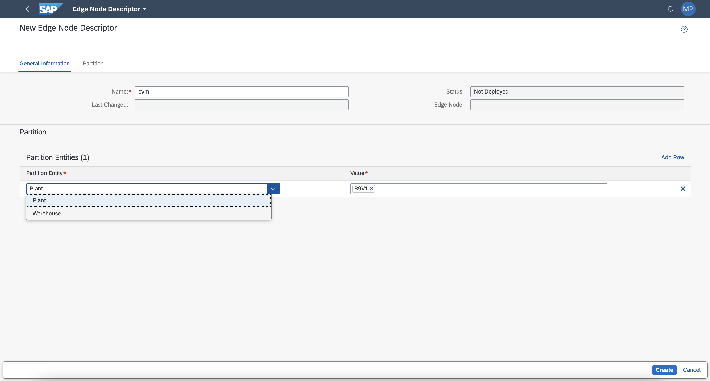

6.  When completed, press **Create**.

[DONE]
[ACCORDION-END]

[ACCORDION-BEGIN [Step 2: ](Deploy smart sensing at the edge)]

1.  In the navigation area **IoT Edge**, click on the **Edge Lifecycle Management** application in the SAP Internet of Things Fiori Launchpad

2.  Select an edge node in the list of edge nodes and click the button  **Deploy Solution**.

    !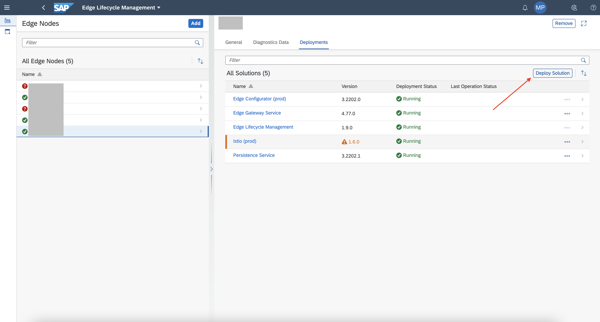

3.  In the first combo box, **Name**, select the solution **Smart Sensing**.

    !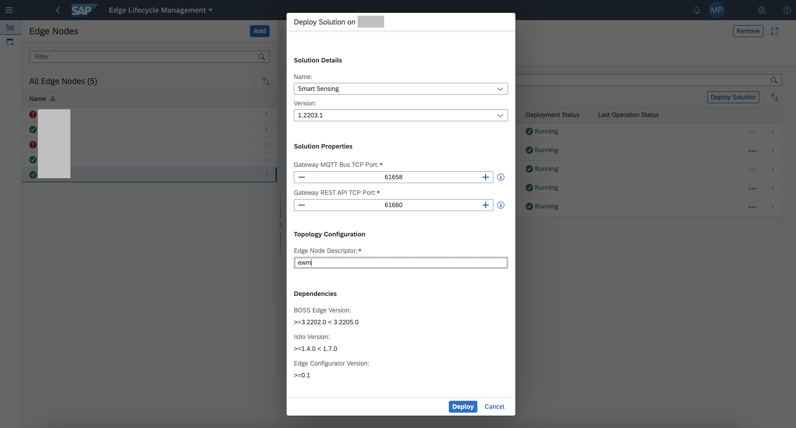

4.  Fill in the form with the following details:

    |  Field Name     | Value
    |  :------------- | :-------------
    |  Gateway MQTT Bus TCP Port           | Check this parameter is identical to the one defined during the implementation of the [Install Edge Gateway Service and Persistence Service](iot-edge-get-gateway-details) tutorial, **Step 1**, parameter **MQTT Bus TCP Port**
    |  Gateway REST API TCP Port           | Check this parameter is identical to the one defined during the implementation of the [Install Edge Gateway Service and Persistence Service](iot-edge-get-gateway-details) tutorial, **Step 1**, parameter **REST API TCP Port**
    |  Edge Node Descriptor    | Compile this area with the node descriptor you have created with the **Step 1** of this tutorial, i.e.: `ewm`

5.  Press **Confirm** to start the deployment.

    !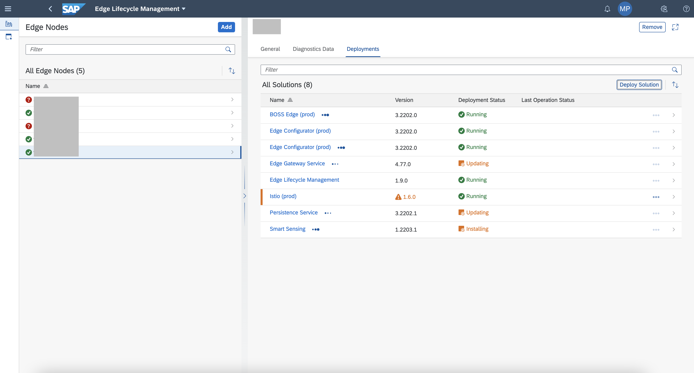

    >The installation of **Smart Sensing** has several dependencies, some of them are explicit, other implicit.
    >
    > As in the deployment form it requires `BOSS Edge`, `Istio` and `Edge Configurator`. All these explicit dependencies will be automatically installed by **Edge Lifecycle Management** if they are not yet installed. `Edge Configurator` will be installed also if already present in the node; it's mandatory to manage the service bindings.
    >
    > Implicit dependencies are **Edge Gateway Service** and **Persistence Service**. Both of them are required by **Smart Sensing** and need to be installed by the user before installing **Smart Sensing**.

[DONE]
[ACCORDION-END]

[ACCORDION-BEGIN [Step 3: ](Model the EWM outbound scenario)]

The creation of  the Smart Sensing scenario is done by using several applications available in the SAP IoT Fiori Launchpad.

The process logic for the creation of the **Business Context**, **Business Context Hierarchy** and **Auto-ID Event Enrichment** is broadly documented [in this tutorial](iot-smartsensing-odata).

>The EWM APIs are accessible only as `CUSTOM`, since they are  not available in the SAP API Hub, so you also need to create a Business Technology Platform Destination implementing a `CUSTOM` type, as documented [in the same tutorial](iot-smartsensing-odata).

For the modeling of the outbound scenario compatible with the edge, you can use the following sample parameters:

-   **Business Context**

    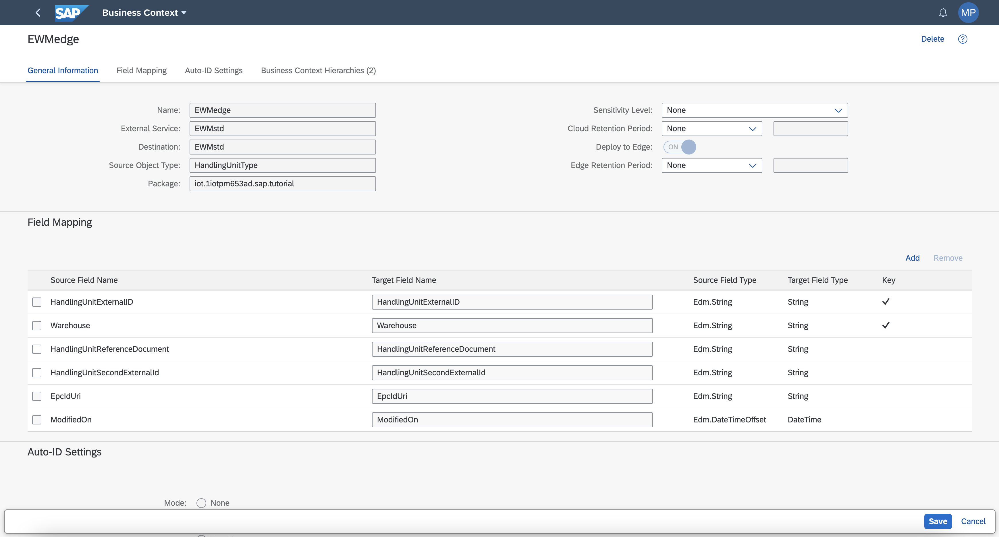

    |  Field Name     | Value
    |  :------------- | :-------------
    |  Name           | A name for the scenario, i.e. `EWMedge`
    |  External Service          | use the `CUSTOM` type destination you have already created in the Business Technology Platform, or create a new one like explained   [in this tutorial](iot-smartsensing-odata), i.e. `EWMstd`
    |  Source Object Type    | Select the `HandlingUnitType` object
    |  Package    | Select a package , i.e.: `iot.mytenant.sap.tutorial`
    |  Deploy to Edge    | You must set it to **ON**
    |  Field Mapping    | Compile this area with the `Masterdata` properties you would like to copy to SAP IoT and the Edge Node. Probably you need at least to have   `HandlingUnitExternalID`, `Warehouse`, `HandlingUnitReferenceDocument`
    |  Auto-ID Settings    | Define a schema, i.e. `SSCC-96`, with **EPC URI Generation** checked if you would Smart Sensing to auto-generate the RFID tags

    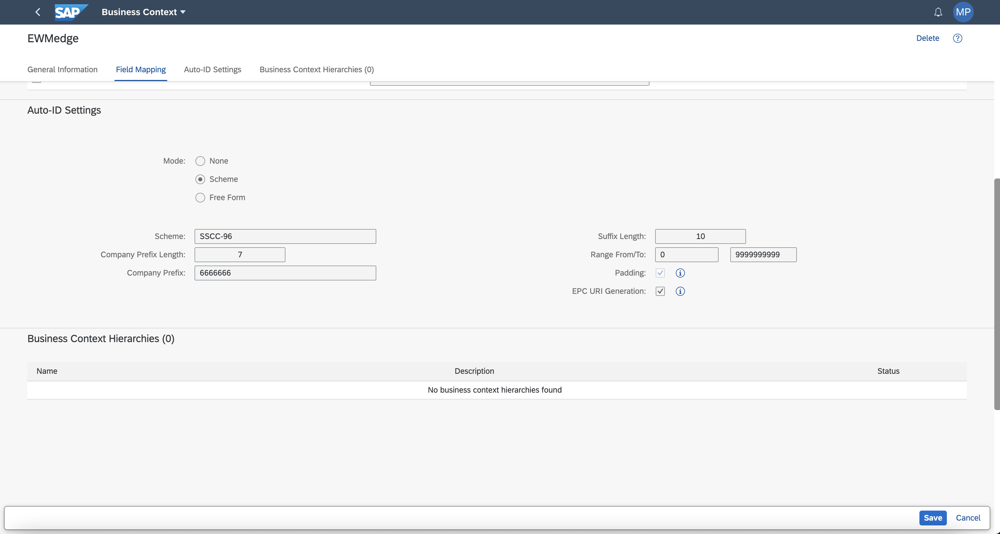

-   **Business Context Hierarchy**

    In the **General Information** area use a **Name** of your choice, a **Package** (i.e.: `iot.mytenant.sap.tutorial`), and switch the **Deploy to Edge** control to **ON**.

    !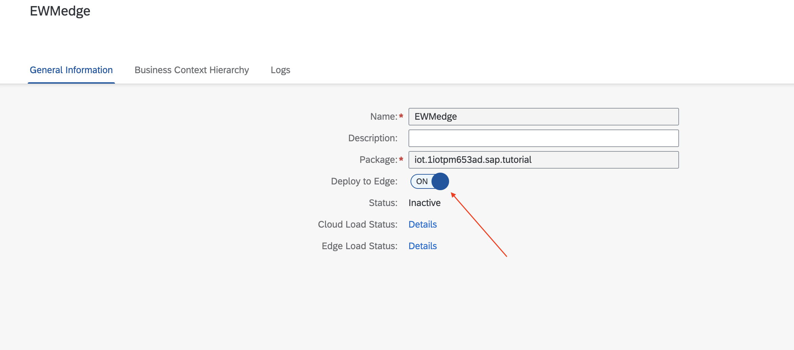

    In the **Business Context Hierarchy** area click on **Add Root Node**, and specify the following parameters.

    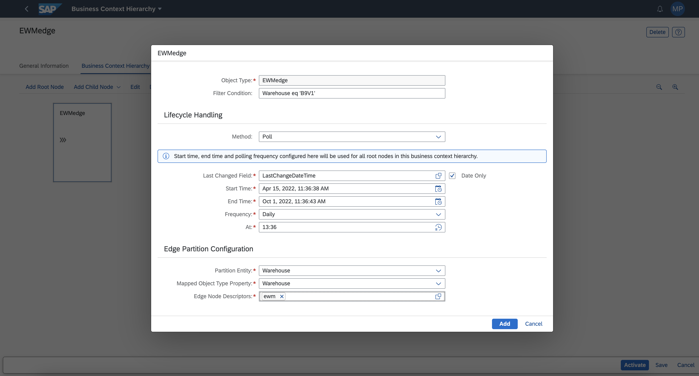

    |  Field Name     | Value
    |  :------------- | :-------------
    |  Object Type           | Select your `Business Context`, i.e. `EWMedge`
    |  Filter Condition         | Create your OData filter to limit the amount of data you are fetching, i.e. `Warehouse eq 'B9V1'`
    |  Lifecycle Handling - Method    | Select the Synch mechanism `Poll`
    |  Lifecycle Handling - Last Changed Field    | Use the suggested parameter `LastChangeDateTime`
    |  Lifecycle Handling - Start Time    | Specify the date when the synchronization mechanism starts
    |  Lifecycle Handling - End Time    | Specify the date when the synchronization mechanism end
    |  Lifecycle Handling - Frequency    | Select how often is executed the synchronization i.e. `By Minutes`
    |  Lifecycle Handling - Interval    | Select the entity of the **Frequency**, i.e. `02`
    |  Edge Partition Configuration - Partition Entity    | Select the entity type , i.e.: `Plant` or `Warehouse`
    |  Edge Partition Configuration - Mapped Object Type Property    | Select the business data property used to map the partition entity, i.e.: `Warehouse`
    |  Edge Partition Configuration - Edge Node Descriptors   | Select the edge node descriptor created previously, i.e.: `ewm`

-   **Auto-ID Event Enrichment**  

    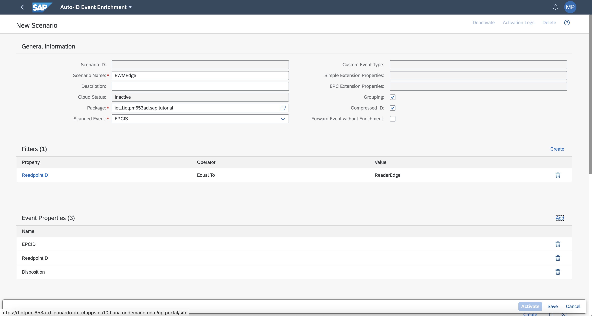

    |  Field Name     | Value
    |  :------------- | :-------------
    |  Scenario Name           | Choose a name, i.e. `EWMEdge`
    |  Package         | your package, i.e. `xxxxx.sap.tutorial`
    |  Scanned Event    | use the standard `EPCIS`
    |  Grouping    | You can use the grouping feature, if you are using SSCC-96 it's not relevant. Keep clear the checkbox
    |  Compressed ID    | It permits to use the compressed EPCIS IDs (i.e. without the dot to separate in the SSCC-96 the company code from the rest of the tag). Keep clear the checkbox
    |  Forward Event without Enrichment    | Keep clear the checkbox

    -  Define at least a filter for the enrichment. it's required to make your enrichment unique, i.e `ReadpointID Equal To ReaderEdge`

    -  Put all the relevant **Event Properties** you would like to have included and valued in the automatically generated custom event, i.e. `EPCID, ReadpointID, Disposition`

    Create the following enrichment in the **Enrichment Details** area.

    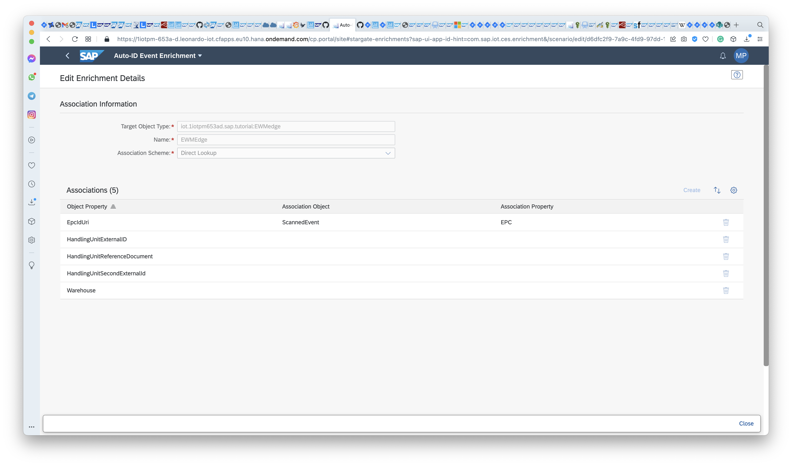

    |  Field Name     | Value
    |  :------------- | :-------------
    |  Target Object Type           | Select your `Business Context`, i.e. `EWMedge`
    |  Name         | Choose a name, i.e. `EWMEdge`

    -  Add the association between the business data and the EPCIS event, i.e. the following mapping: `EpcIdUri ScannedEvent EPC`.

    -  Include in the custom event also the relevant business data (i.e. without association), for example `HandlingUnitReferenceDocument` that is a mandatory parameter to be able to create the Good Issue correctly, and maybe others like `HandlingUnitExternalID` `HandlingUnitSecondExternalID` `Warehouse` if you need to do other operations different from the Good Issue.

1.  Open your Business Context Hierarchy and push **Activate** then do the **Initial Load**.

2.  **Activate** the Event Enrichment. In the activation screen unselect **Activate on Cloud**, select **Activate on Edge** and input the **Edge Node Descriptor**, i.e. `ewm`.

    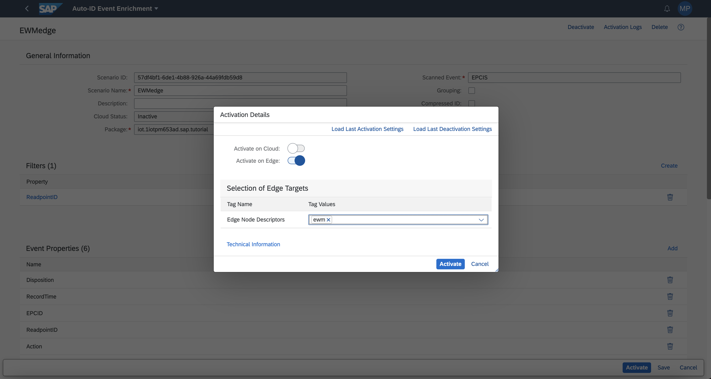

    >You can activate the scenario both cloud and edge. In this hybrid scenario, the enrichment could be computed both directly in the edge node or in the cloud. It could be useful for example in case of some events, need to be processed in the edge node, for example for a low latency reason, and others are arriving directly in the cloud.

[VALIDATE_2]
[ACCORDION-END]

---
