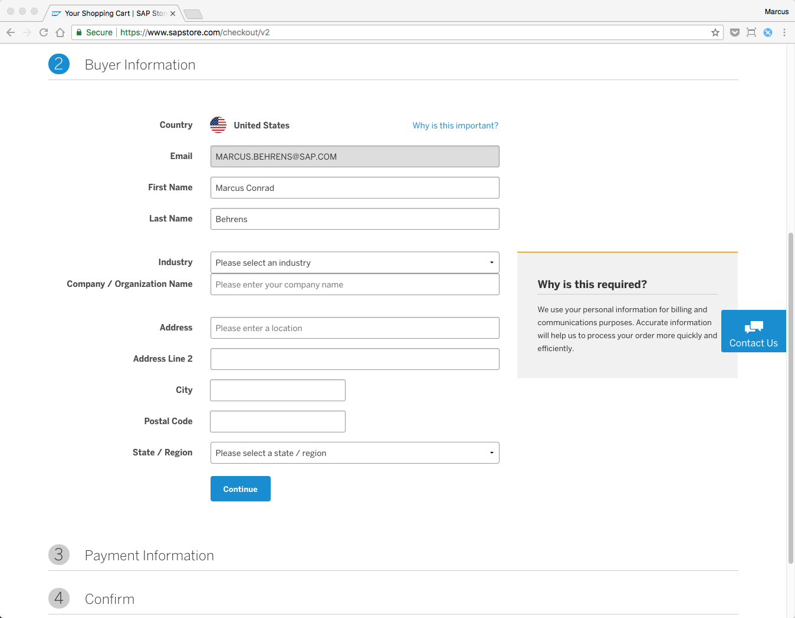
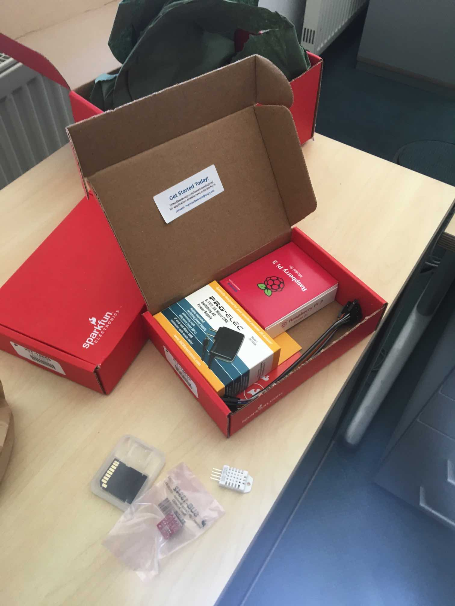

## Prerequisites  
 - **Proficiency:** Beginner
 - You will need a credit card and email account.

## Next Steps
 - [Create Device Model](https://www.sap.com/developer/tutorials/iot-express-2-create-device-model.html)

## Details
### You will learn  
You will learn which services from SAP Cloud Platform are required for building and deploying applications. You will see how to acquire them. You will also get guidance on a simple hardware kit to get you started with sensors.

---

[ACCORDION-BEGIN [Step 1: ](Acquire SAP Cloud Platform)]

The simplest way to get the set of required accounts is to register at [http://www.sapstore.com/](https://www.sapstore.com/solutions/40108/SAP-Leonardo-IoT-Foundation%2C-express-edition) and purchase the SAP Leonardo IoT Foundation Express Edition package. This way all of the communication relative to the setup will reach you directly based on your email address.

You will receive a so-called s-user (user id is starting with s) and a global account via email. At this point it's critical that you or someone you onboard to the global account as an administrator walk through the following end-to-end configuration and onboarding guide at [SAP IoT Application Enablement: Onboarding - Setting up Your Account](https://help.sap.com/viewer/9dfedbe95cbe4a9f9a5ceddbef7f88e5/latest/en-US/c5b72d23880240dcb4b0d7b9523b065a.html). Do go through all of the steps in full to make sure everything is set up correctly and you can really get started building IoT applications.

The aforementioned guide will enable you to have the following configured for you in your new global account:

- A Cloud Foundry sub-account and space to allow you to subscribe to services, store data and deploy applications with the help of IoT Application Enablement
- An instance of IoT (device management) for Cloud Foundry that allows you to manage IoT devices securely and onboard them with different protocols
- A NEO sub-account to allow you to use the Full-Stack Web IDE service for building HTML5 based user interfaces
- All the necessary configuration and a minimum set of roles assigned to your user so you can make use of all of the above

[VALIDATE_1]

[ACCORDION-END]

[ACCORDION-BEGIN [Step 2: ](Acquire prototyping hardware)]

If you need hardware for prototyping or subsequent tutorials, we recommend you acquire this kit to get started [https://www.sparkfun.com/products/14659?custom\_code=SAP](https://www.sparkfun.com/products/14659?custom_code=SAP). Of course, you can choose any device hardware or any supplier but the subsequent tutorials will be based on this example containing a temperature, humidity and light sensor.

[DONE]

[ACCORDION-END]
