## Prerequisites  
- **Tutorials:** [Get Your Hands on SAP IoT Software and Hardware](iot-express-1-buy-sapstore)
- **Configuration:**
1. You or someone from your team should has followed this guide [Enabling the Internet of Things Service for the Cloud Foundry Environment](https://help.sap.com/viewer/c48328a1bee749da9902d52f080dba0d/Cloud/en-US).
2. You or someone from your team has created a tenant and a user to work in for yourself based on the instance owner credentials from the previous step and this guide [Creating User and Tenant](https://help.sap.com/viewer/78ac6b240a97447986e09b991d8a570a/Cloud/en-US).
3. To be able to see the data created in this tutorial in SAP IoT, it is necessary to follow [this guide](https://help.sap.com/viewer/a7172eb02bf54229add4664fff702676/Cloud/en-US/b15fcfae611f400cb582a8ece97306b1.html) for configuring the message processing of SAP Internet of Things.

## Details
### You will learn
- How to create a device model
- How to ingest simulated data using a Node.js script
- How to ingest data using SAP IoT Starter Kit


---

[ACCORDION-BEGIN [Step 1: ](Log into your IoT service instance)]

1. Open the IoT Service Cockpit
    - Open the [Cloud Platform Cockpit](http://hana.ondemand.com/) and select your `Global Account`
    - Click on the `Subaccounts` menu and select your *Cloud Foundry* `Subaccount`
    - Click on the `Spaces` menu and select to your `Space`
    - Open the `Service Instances` list and click on the `Open Dashboard` icon in the *Actions* column

2. If you have not done so then create a user and a tenant by logging in using the service credentials  
   (found in [`Cloud Platform Cockpit`](http://hana.ondemand.com/) -> `Global Account` -> `Cloud Foundry Subaccount` -> `Space` -> `IoT Service Instance` -> `Service Keys`) and then create a tenant and a user for yourself. Make sure you assign your user to the tenant as an administrator. Subsequently log out.

2. Login with your user id and password.   

3. Click on your `tenant`.

!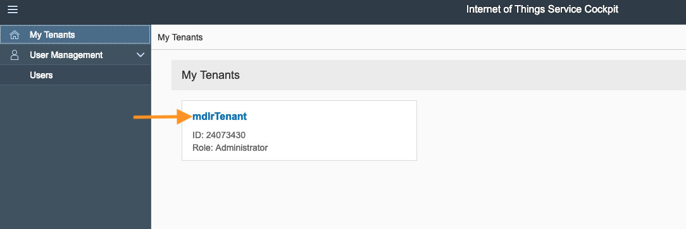

!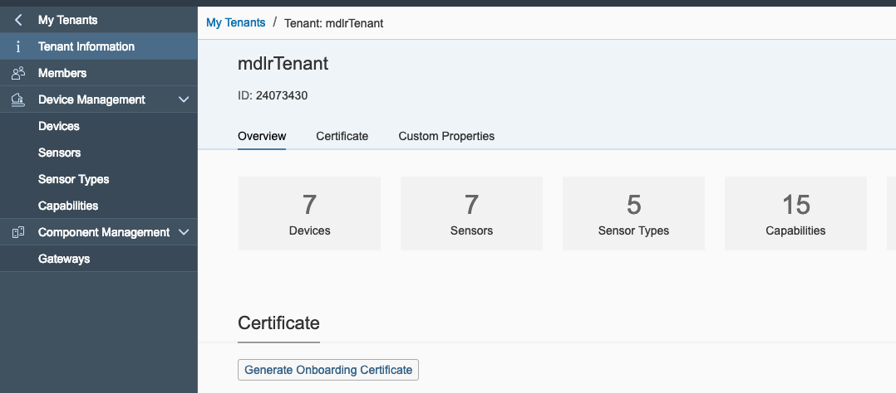


[DONE]

[ACCORDION-END]


[ACCORDION-BEGIN [Step 2: ](Create a new capability)]

1. On the left-side menu, expand `Device Management` and click on `Capabilities`.

2. Create a new capability by clicking the `+` at the top right.

3. Set **`Name`** and **`AlternateID`** to `envData`.

4. Set **`AlternateID`** to `envData`.

5. Add the following properties to the list by clicking on the **`+`**.

    | Name | Type | Unit of Measure |
    |------|------|-----------------|
    |`temperature`|`integer`|`°C`|
    |`humidity`|`integer`|`%`|
    |`light`|`integer`|`lux`|

6.  Click **Create**.

!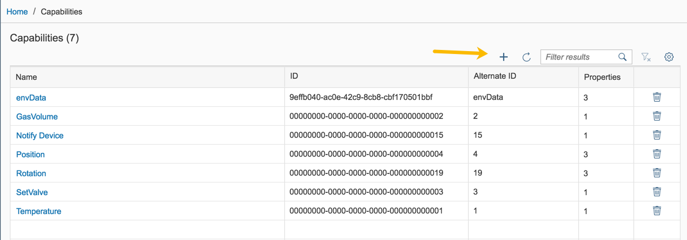

!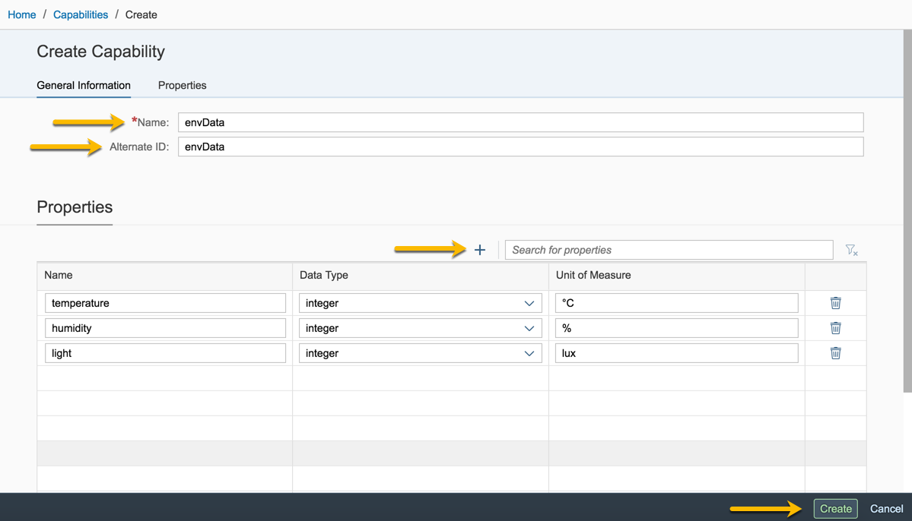


[DONE]

[ACCORDION-END]


[ACCORDION-BEGIN [Step 3: ](Create a new sensor type)]

You need to define a sensor type to assign sensors to the devices.

1. On the left-side menu, expand **Device Management**, navigate to **Sensor Types** and click on `+` to create a new sensor type
2. Set **Name** to `envSensorType` and **Alternate ID** to an integer between 0 and 2147483647
3. In the **Capabilities** table below, add a row and set **Capability** to `envData` *(the capability we created in Step 2)* and **Type** to `measure`
4. Click **Create**

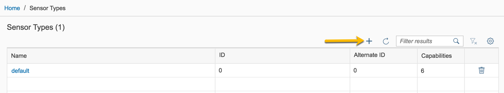

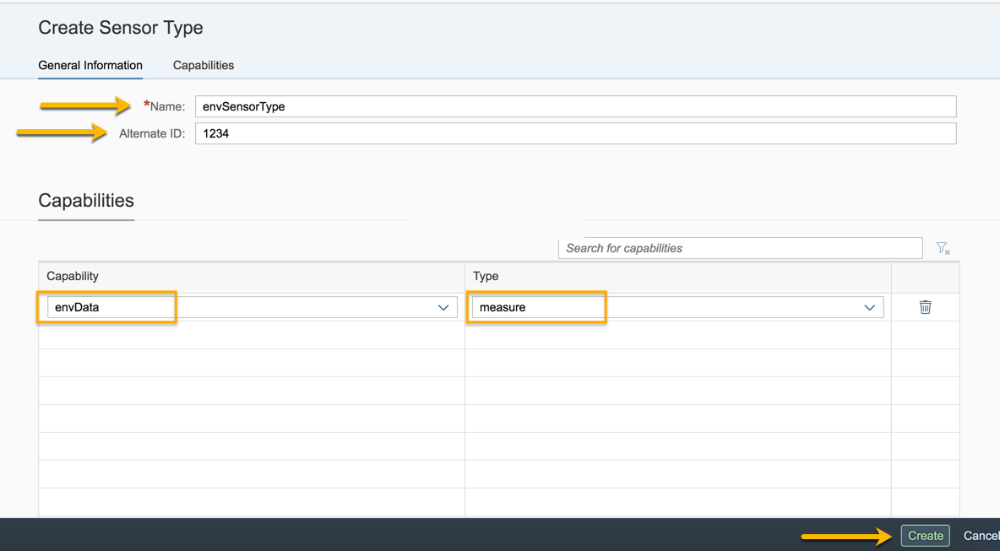

[DONE]

[ACCORDION-END]


[ACCORDION-BEGIN [Step 4: ](Create a new MQTT device)]

You will create a new device with a sensor using the already defined sensor type and capability described in previous steps.

1. On the left-side menu, expand **Device Management**.

2. Click **Devices**.

3. With the `+` on top right of **Devices** list, create a new device and set the following fields

    | Name | Value |
    |------|------|
    | **Name** |`device1`|
    | **Gateway** | Select the MQTT gateway |
    | **Alternate ID** |`device1`|

4. Click **Create**.

5. After the device is created, add a new sensor. You can do this by selecting the `Sensors` tab and clicking on the `+`.  

    Set its name to `sensor1`, its type to `envSensorType` and its alternate ID to `sensor1`. Finally, click on **Create**.

!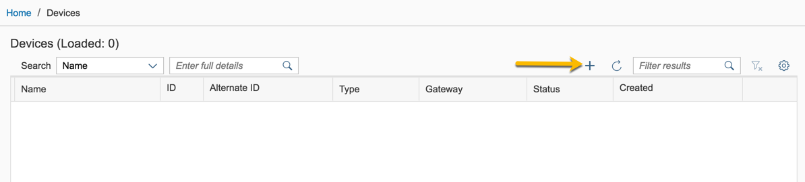

!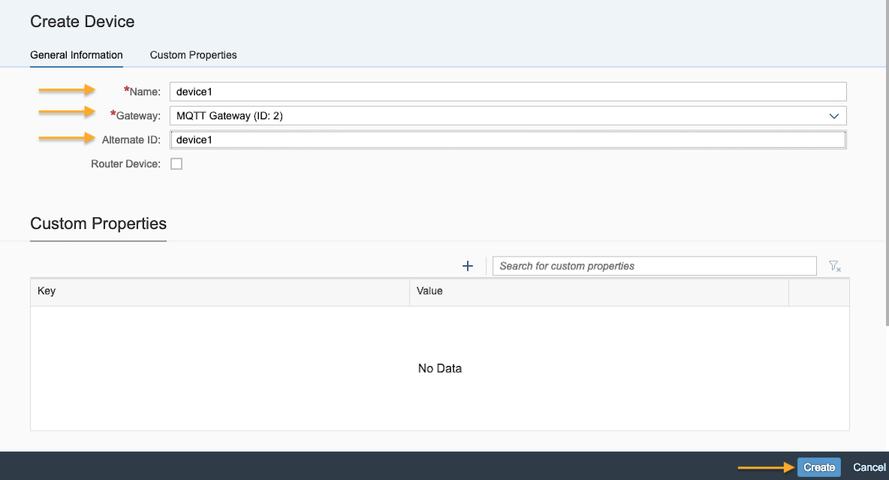

!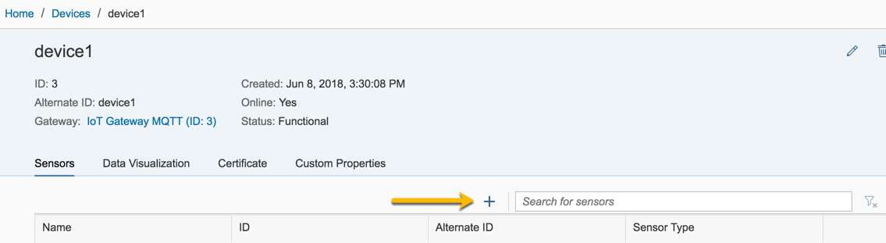

!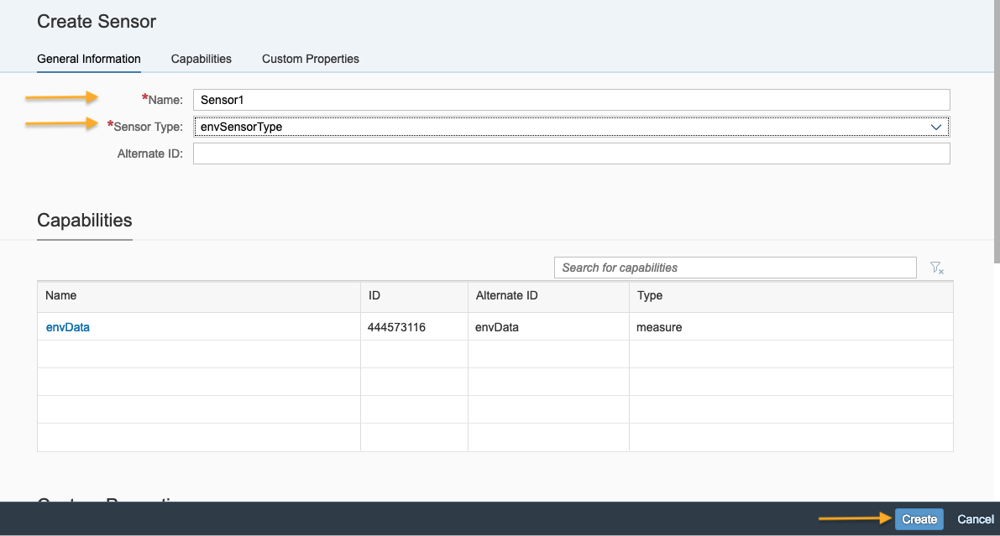

[DONE]

[ACCORDION-END]

[ACCORDION-BEGIN [Step 5: ](Download PEM certificate for device)]

Before you can start sending data from your device, it needs to be authenticated.

1. Navigate to the newly created device using the **Devices** list _(see Step 4 if you need more details)_.

2. Click the **Certificate** tab.

3. Click on **Generate Certificate**.

4. Set **Certificate Type** to `pem`.

5. Click **Generate**. This will download the certificate.

6. Copy-paste and persist the secret displayed - it can't be viewed after the dialog is closed

>You can always generate a new certificate. The old one will remain valid.

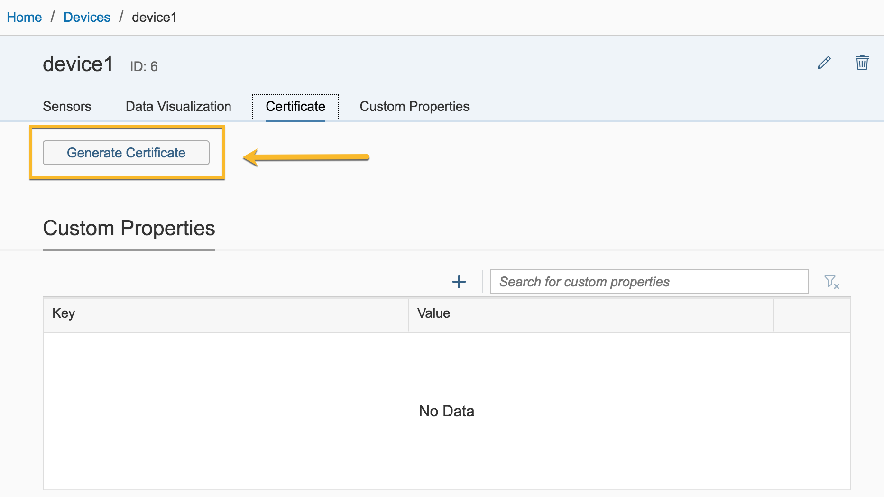

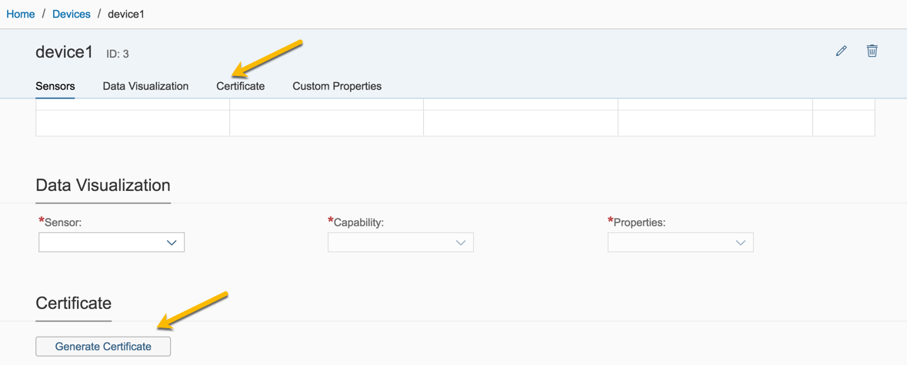

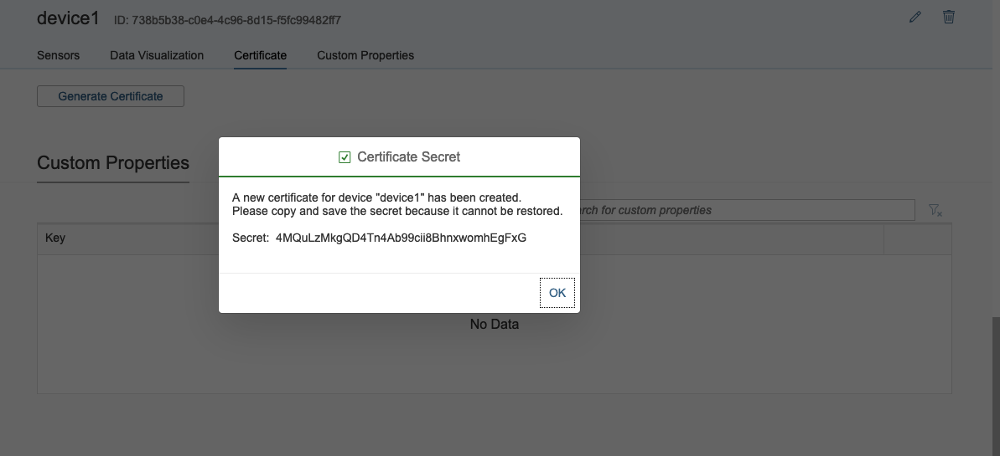

[DONE]

[ACCORDION-END]


[ACCORDION-BEGIN [Step 6: ](Send simulated data to device via MQTT)]

You'll need to have installed Node.js on your machine or on the SAP IoT Foundation Hardware Kit to continue.

You will learn to Ingest Simulated Data using MQTT using Node.js and the device certificate.
If you have the hardware kit, then modify the function `generateData()` to actually read from the attached sensors.

1. Create a folder named `node-mqtt-simulator`.

2. In the folder, create a file called `package.json` and copy-paste the following code :

    ```JSON
    {
      "name": "data-ingestion-iot-services",
      "version": "1.0.0",
      "description": "",
      "main": "index.js",
      "author": "",
      "license": "ISC",
      "dependencies": {
        "mqtt": "^2.15.2"
      }
    }
    ```

3. In the folder, create a file called `app.js` and copy-paste the following code :

    ```JavaScript
    const mqtt = require('mqtt')
    const fs = require("fs");

    const HOST_ADDRESS = "76eae3d3-9de6-4345-b26c-ff35be052652.eu10.cp.iot.sap"; // Replace with your IoT Service instance
    const DEVICE_ALTERNATE_ID = "device1";
    const SENSOR_ALTERNATE_ID = "sensor1";
    const CAPABILITY_ALTERNATE_ID = "envData";
    const CERTIFICATE_FILE = "./certificates/device1_certificate.pem";
    const PASSPHRASE_FILE = "./certificates/device1_passphrase.txt";

    var lastData = {
        temperature: 25,
        humidity: 70,
        light: 800
    }

    var mqttClient = connectToMQTT()

    setInterval(() => {
        generateData()
        sendDataViaMQTT()
    }, 1000);

    function generateData() {
        lastData = {
            temperature: lastData.temperature + randomInteger(-1, 1),
            humidity: lastData.humidity + randomInteger(-10, 10),
            light: lastData.light + randomInteger(-100, 100)
        }
    }

    function sendDataViaMQTT() {
        var payload = {
            sensorAlternateId: SENSOR_ALTERNATE_ID,
            capabilityAlternateId: CAPABILITY_ALTERNATE_ID,
            measures: [
                lastData.temperature, lastData.humidity, lastData.light
            ]
        }

        var topicName = 'measures/' + DEVICE_ALTERNATE_ID;

        mqttClient.publish(topicName, JSON.stringify(payload), [], error => {
            if(!error) {
                console.log("Data successfully sent!");
            } else {
                console.log("An unecpected error occurred:", error);
            }
        });
    }

    function connectToMQTT() {
        var options = {
            keepalive: 10,
            clientId: DEVICE_ALTERNATE_ID,
            clean: true,
            reconnectPeriod: 2000,
            connectTimeout: 2000,
            cert: fs.readFileSync(CERTIFICATE_FILE),
            key: fs.readFileSync(CERTIFICATE_FILE),
            passphrase: fs.readFileSync(PASSPHRASE_FILE).toString(),
            rejectUnauthorized: false
        };

        var mqttClient = mqtt.connect(`mqtts://${HOST_ADDRESS}:8883`, options);

        mqttClient.subscribe('ack/' + DEVICE_ALTERNATE_ID);
        mqttClient.on('connect', () => console.log("Connection established!"));
        mqttClient.on("error", err => console.log("Unexpected error occurred:", err));
        mqttClient.on('reconnect', () => console.log("Reconnected!"));
        mqttClient.on('close', () => console.log("Disconnected!"));
        mqttClient.on('message', (topic, msg) => console.log("Received acknowledgement for message:", msg.toString()));

        return mqttClient
    }

    function randomInteger(min, max) {
        min = Math.ceil(min);
        max = Math.floor(max);
        return Math.floor(Math.random() * (max - min + 1)) + min;
    }
    ```

4. Change the endpoint for MQTT to your endpoint on line 4 (check the URL of the cockpit which you brought up earlier to create the device model).

5. Through the command line tool on your computer, change into the directory created before and then run `npm install` to install required modules.

6. Create a subfolder called `certificates`.

7. Copy the certificate you downloaded in step 5 into the `certificates` directory. Rename it to `device1_certificate.pem`.

8. Create a new file with the name `device1_passphrase.txt` in the `certificates` directory. Paste the secret from step 5 into it.

9.  Run `node app.js` to start the app.

10. Check the console log for errors and additional information. The console log should look like this:

    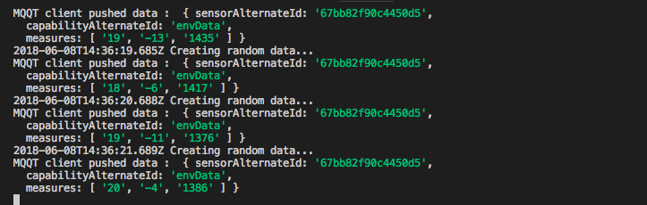

[DONE]

[ACCORDION-END]

[ACCORDION-BEGIN [Step 7: ](Check device ingested data)]

1. Navigate to your device:
   **`Device Management` > `Devices` > `device1`**

2. Click on the `Data Visualization` tab.

3. Select your sensor, `sensor1`.

You should see data flowing in the system.

!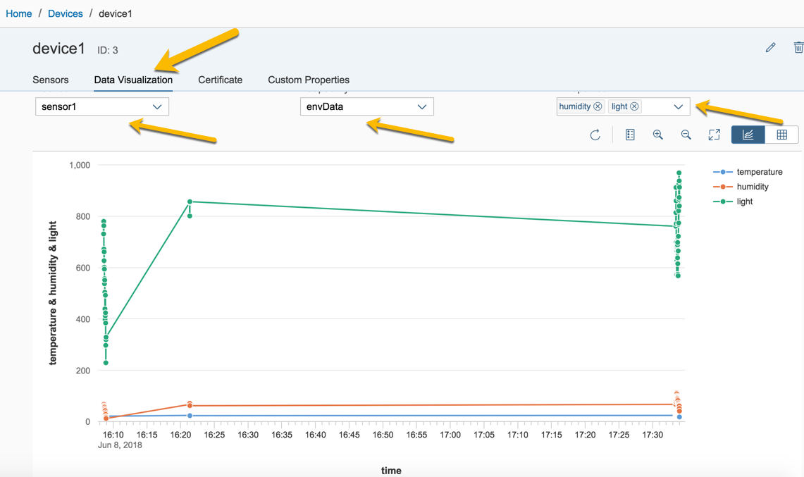

[VALIDATE_1]

[ACCORDION-END]

---
