## Prerequisites  
 - **Tutorials:** [Assemble and Configure Device Hardware](iot-express-3-configure-device) or at least [Create a Simple IoT Device Model](iot-express-2-create-device-model)
 - **Configuration** You or someone else that is an administrator in your global account has walked through the following end-to-end configuration and onboarding guide: [Getting Started with SAP IoT](https://help.sap.com/viewer/195126f4601945cba0886cbbcbf3d364/latest).

## Details
### You will learn
- How to create new thing packages
- How to manage thing properties and thing property sets
- How to use thing types
- How to add a new thing connected to your device
- How to secure thing data using access rights

---

[ACCORDION-BEGIN [Step 1: ](Access Fiori Launchpad with SAP IoT apps)]

  The Launchpad provides all the tools for creating thing types, properties, things but also persons, companies and KPI's. In this first step you find out how to access it.

  1. Go to the [SAP Cloud Platform cockpit](https://account.eu1.hana.ondemand.com/cockpit#/home/allaccounts).
  2. Drill down into the **Global Account** and the Cloud Foundry **Sub-account** where you have configured the subscription to SAP IoT.
  5. From the left-side menu, click **Subscriptions**.
  6. Click **Go to Application** from the `SAP IoT` tile.

>Enter the email address used with your SAP Cloud Platform account and the password if you are asked for one.

  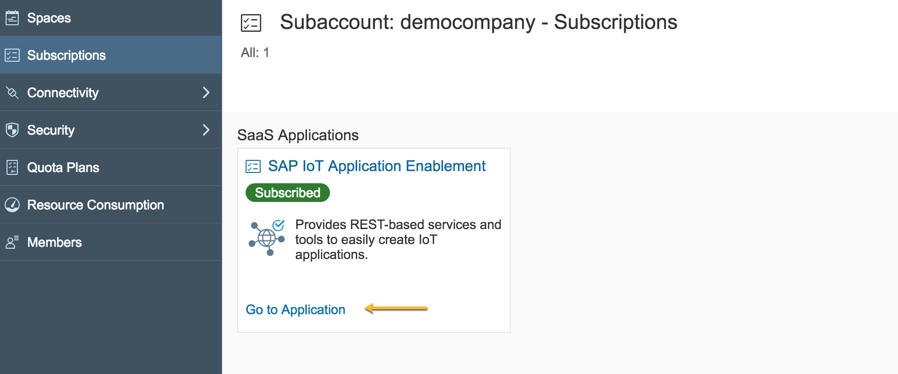

[DONE]

[ACCORDION-END]

[ACCORDION-BEGIN [Step 2: ](Create a package greenhouse)]

  The next step is to create a package. A package allows re-use of thing types and properties within your tenant and across tenants. As we want to put the environment sensor that we have to use in the context of a greenhouse condition monitoring application, we call this package `greenhouse`.

  1. Click **Go to Application** link from the **SAP IoT** tile (more info in Step 2).
  2. From **IoT Thing Modeler**, click the **Packages** tile.
  3. Make sure no similar package already exists using the top-right search field.
  4. Create a new package by clicking the `+` in the right of the search field.
  5. Enter your package name as `greenhouse`. You can create a namespace using dots (e.g., `my.first.greenhouse`). Take notice on the scope selection: mark your package as private if you do not want to share its content in the tenant.
  6. Click **Save** (bottom right grey slice of the page).

  !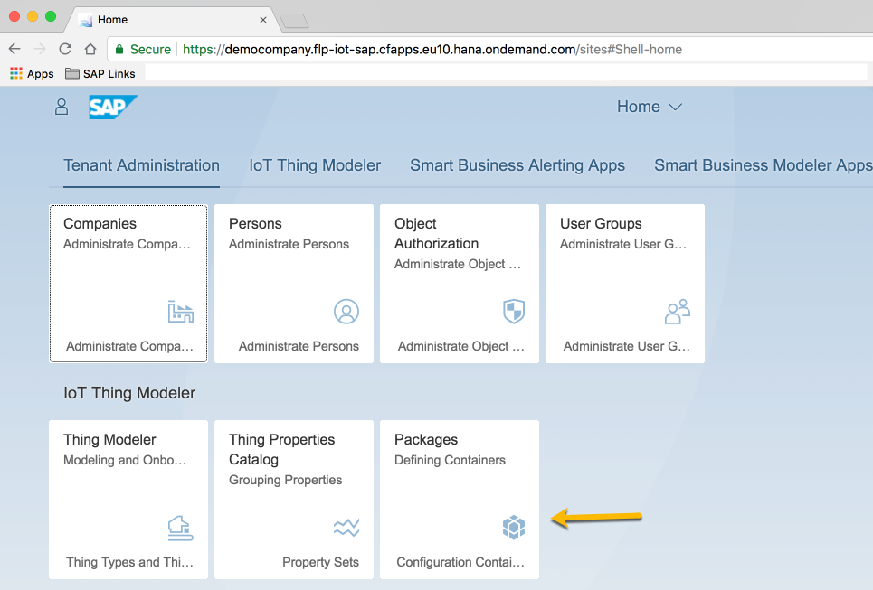

  !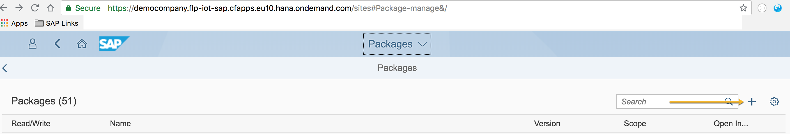

  !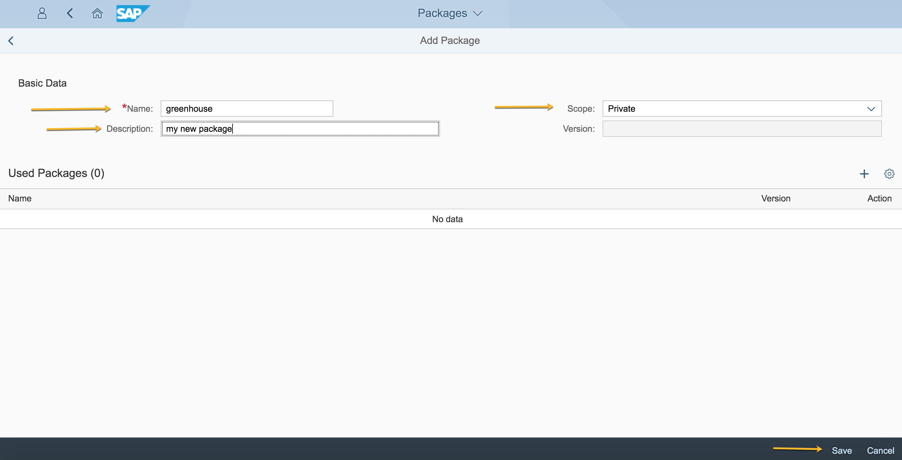

[DONE]

[ACCORDION-END]

[ACCORDION-BEGIN [Step 3: ](Add property to Default property set)]

 Now that we have a package, we can start putting properties reflecting the measurements but also the master data that we need for out things. Let's assume we are producing this greenhouse for processing warranty claims, we use a serial number to track every individual greenhouse.

  Please make sure you use the thing modeler based on OData. You can check this by checking that you choose the package in the thing modeler at the top with a drop down instead of at the bottom. If the later is the case please check your role collection established when you initially configured the tenant to include `Thing_Engineer_Odata` and not `Thing_Engineer` or `Thing_Engineer_Fiori_Launchpad`.

  1. Go to the **Thing Properties Catalog** by clicking on the tile with the same name in the home page.
  2. Select your `greenhouse` package.
  3. Select the `Default` property set from the left-side list (or create it for Basic Data Properties if it is not there).
  4. On the **Properties** list on the right side, click `+` just to the right of the search field.
  6. Enter the new property name as `serialNumber`.
  7. Set the type to `String`.
  8. Set the **Length** field value (no chars) to 64.
  9. Click **Save** (on the grey bar, bottom-right of the page).

>If you have sensitive data or personal data (defined as personal by EU GDPR), mark the property set `Sensitivity Level` as `Personal Data` or `Sensitive Data`.

  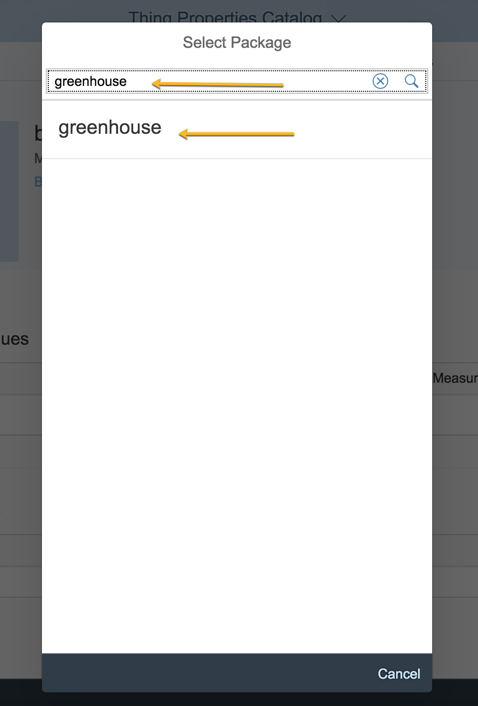

  !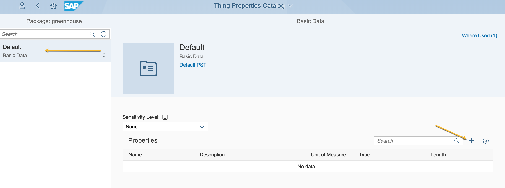

  

  !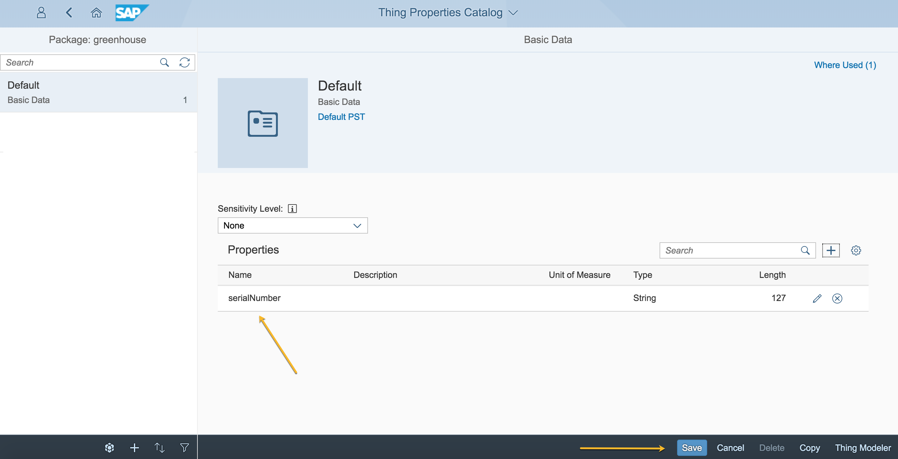

[DONE]

[ACCORDION-END]

[ACCORDION-BEGIN [Step 4: ](Create new property set)]

Now that our greenhouse has a property set to capture the serial number for business process integration, let's add the properties required to capture the measurements/time series of data coming from the environment sensor.

Note that we focus on the data we want to use in the business application -- the actual physical sensor or its manufacturer does not matter. We could even get the different measurements from different devices across different communication technologies. What matters in the thing model is what you need to know in the applications built on top.

1. Click the **Home** icon at the top-left of the page after the package creation, or click **Go to Application** from the **SAP IoT** tile (more info in Step 2).
2. From the **IoT Thing Modeler** section, click the **Thing Properties Catalog** tile. On the left side, you'll see the list of existing property sets in the selected package that is written on the top of the search field of the list.
4. Select your package from the grey slice of the screen found below the list. Click the package icon (first one).
5. Search and choose your package by entering `greenhouse` in the search field and click on the search icon or press **Enter**.
6. Click the package name to select it. Your property sets list (left side) will refresh and you will see the `Default` property set that is meant for master data and that is created along with the package.
7. To create a new property set, click `+` near the package selection button (second icon on the grey bar, under the property set list).
8. Set the name of the property set to `envData`.
9. Set **Property Set Category** as `Measured Values` (third option).
10. Click **Save**.
12. In the **Measured Values** list (see Step 4 for details about adding a new property) add a property called `temperature` with type `Integer` and unit of measure `DegreeCelsius`, symbol `°C`, and choose to have an upper and lower threshold for the temperature.
13. Add a property called `humidity`, type `Integer` and unit of measure `Percentage`, symbol `%`.
14. Add a property called `light`, type `Integer` and without a unit of measure.
15. Click `Save` (on the bottom grey bar, right side of the screen).

!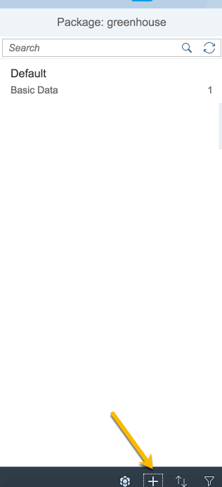

!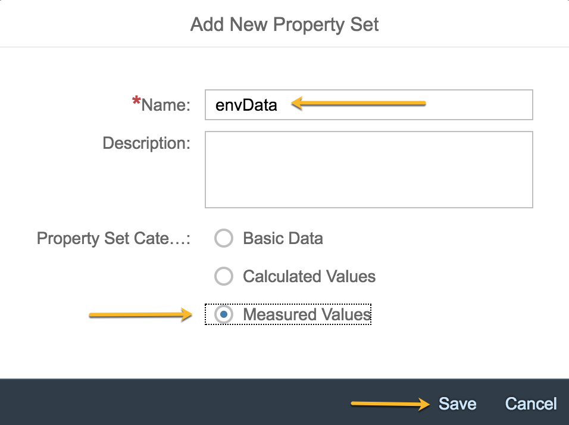

!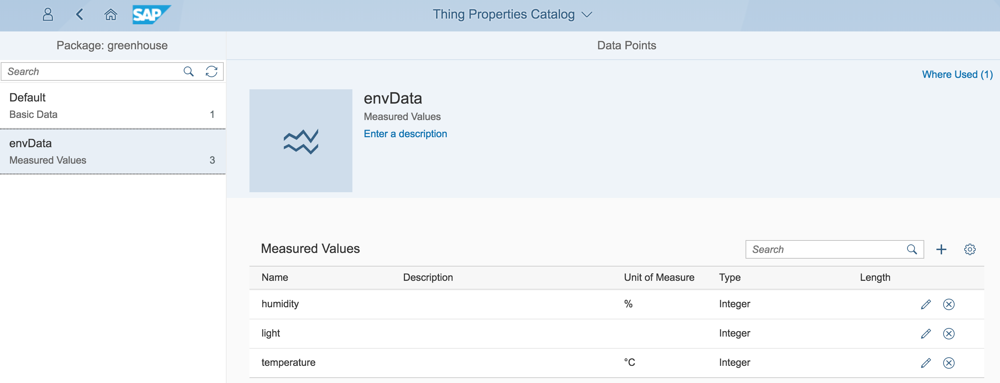

[DONE]

[ACCORDION-END]

[ACCORDION-BEGIN [Step 5: ](Create a new thing type using Thing Modeler)]

The last step to set up our metadata and required to capture things and measurements is the creation of a thing type. A thing type brings together multiple property sets and adds additional generic properties like location, name, and description to allow to understand the full context of the thing.

1. Use the **Thing Modeler** button in the lower right corner to jump from the **Properties Catalog** to the **Thing Modeler**.
2. Click `+` at the bottom-left to add a new thing type. Call it `greenhouseType`.
3. Add the 2 property sets you worked on earlier and save your work. The thing type will then look like this:

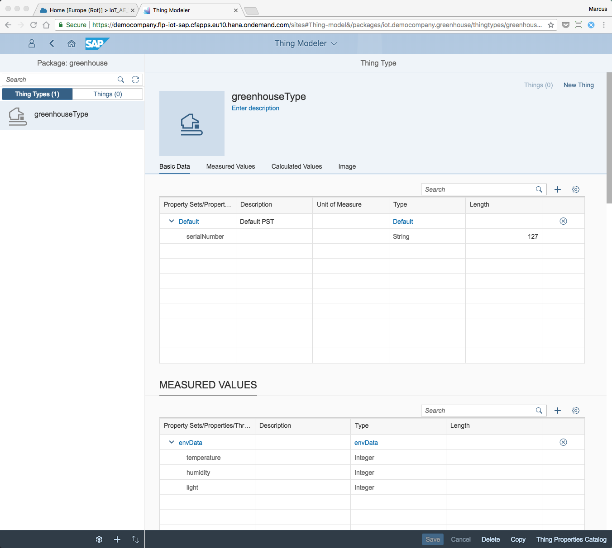

[DONE]

[ACCORDION-END]

[ACCORDION-BEGIN [Step 6: ](Map thing type to sensor type)]

Now create a new mapping from this thing type to the sensor type you have created earlier using the connectivity tab and the plus sign:

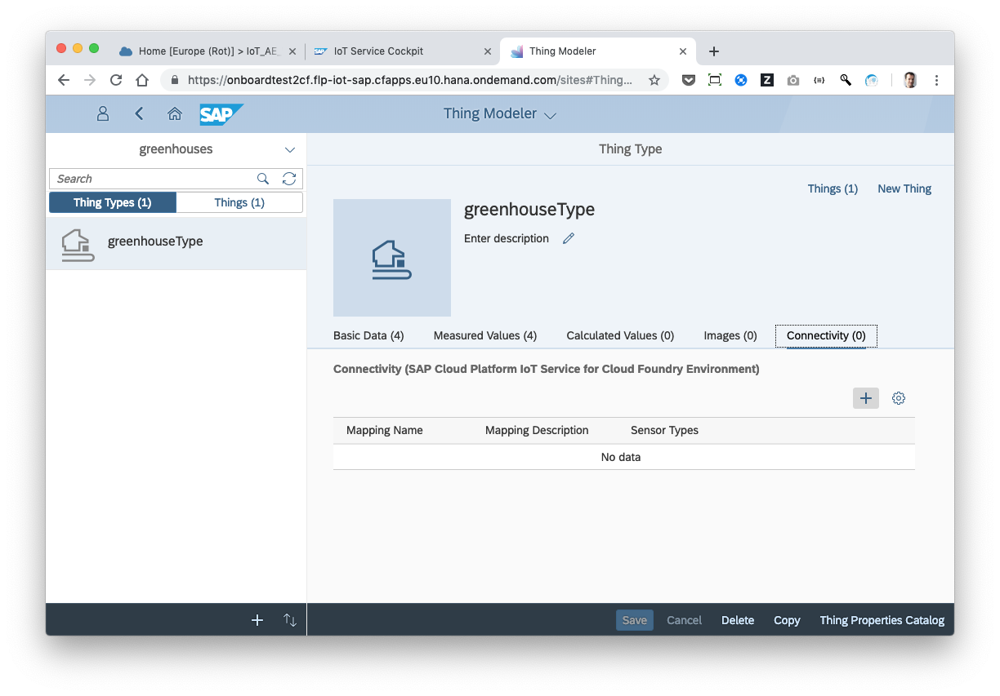

First choose the sensor type from the list in the upper right and then choose the device properties that match the thing properties. In this example the names are the same but they do not have to be the same:

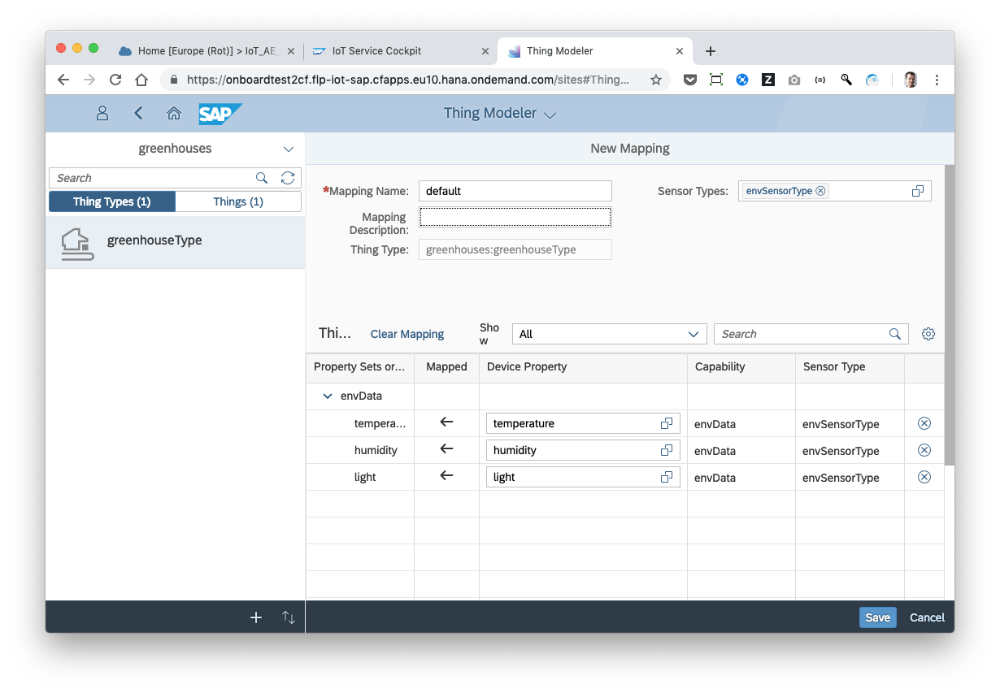

[DONE]

[ACCORDION-END]

[ACCORDION-BEGIN [Step 7: ](Create new thing of the new thing type)]

Now we are ready to create a new thing and map it to the device you created earlier.

1. Click **New Thing** from the upper-right corner.
2. In the dialog, enter `greenhouse1` or `greenhouse2` as the name (`1` or `2`indicates that this is your first or second instance of this type of greenhouse).
3. Add a description and select the default authorization group. Note that this authorization group will be something that later, when you automate onboarding of things and you define differentiated access rights to the time series, will be very specific authorization groups you have created to make sure the your application users see only the things and time series data for those things, that they should see.

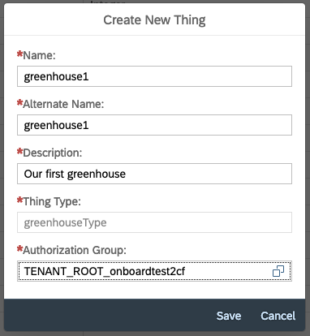

[DONE]

[ACCORDION-END]

[ACCORDION-BEGIN [Step 8: ](Set thing master data properties and location)]

Lastly we will set the things serial number and the location to make sure we can integrate into business processes and to be able to show it on a map.

1. In the Thing Modeler, set a value for the property `serialNumber` for the thing (not for the thing type). See the image below for where to enter it.
2. Use [HTML5 geolocation lookup example](https://www.w3schools.com/Html/tryit.asp?filename=tryhtml5_geolocation) to find your current location or choose any other location using another tool (mobile phone, Google maps).
3. Enter the location in the location fields in the Thing Modeler (see image below).
4. Enter a lower and upper threshold for the temperature (under **Measured Values**).
5. Then connect the device and sensors created in the earlier Tutorials in the connectivity tab.
6. Save your change.

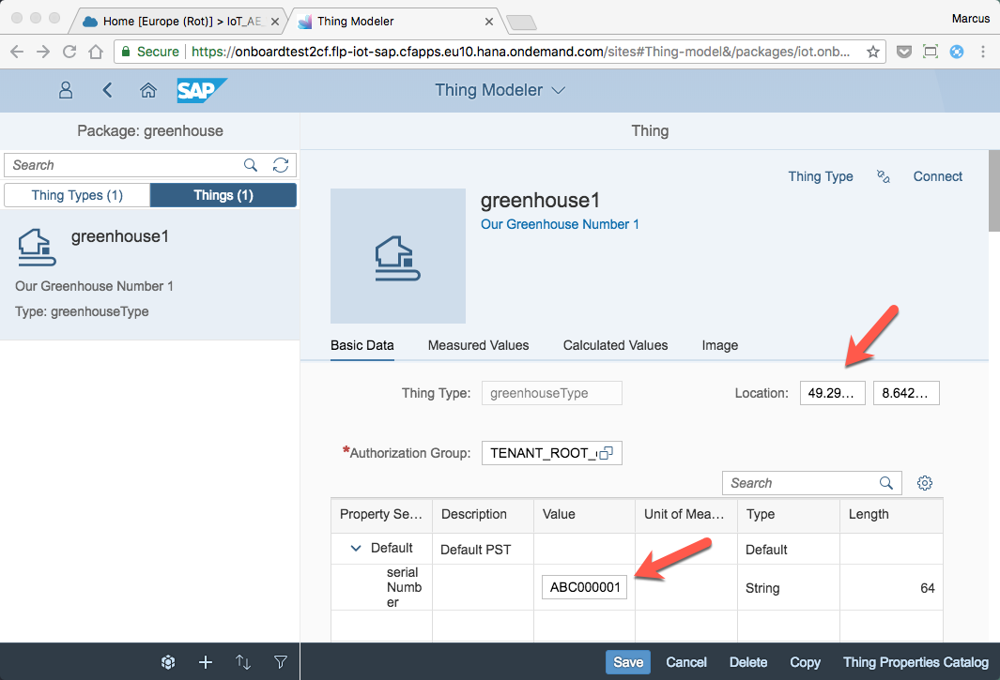

If you are ingesting data you should see this data showing up in the thing in the thing modeler under `measured values`. If not please check first in IoT service and then also in the data ingestion error log app in the SAP Fiori launchpad.

You are now ready to build interactive or batch applications on top of your greenhouse things.

[VALIDATE_1]

[ACCORDION-END]
