## Prerequisites  
 - **Tutorials:** [Create a Simple IoT Device Model](iot-express-2-create-device-model) and [Create Thing Model](iot-express-4-create-thing-model)
 - **Configuration** You or someone else that is an administrator in your global account has walked through the following end-to-end configuration and onboarding guide: [Getting Started with SAP Leonardo IoT](https://help.sap.com/viewer/195126f4601945cba0886cbbcbf3d364/latest).

## Details
### You will learn
  - How to define and create a rule
  - How to activate a rule
  - How to create a rule context
  - How to set up an Email server
  - How to create an action to send an Email notification

---

In this tutorial, we will define a rule to check if the temperature is too high. If this is the case, an email should be sent.

---

[ACCORDION-BEGIN [Step 1: ](Configure your Mail Server (SMTP))]

1.	On the launchpad, choose the **Settings - Configure Mail Server** tile.

2.	Enter the **SMTP Server host** address - example shows Google server host detail.

3.  Enter the **SMTP Server Port** detail.

4.	Enter the **SMTP Server Authentication User** name.

5.	Enter the **SMTP Server Authentication Password**.

6.	Enter the Email address of the notification sender in the **Notification Sender Email Address** field.

7.	Enter the default subject of the notification in the **Default Notification Address** field.

8.	Choose **Save** to save your change.

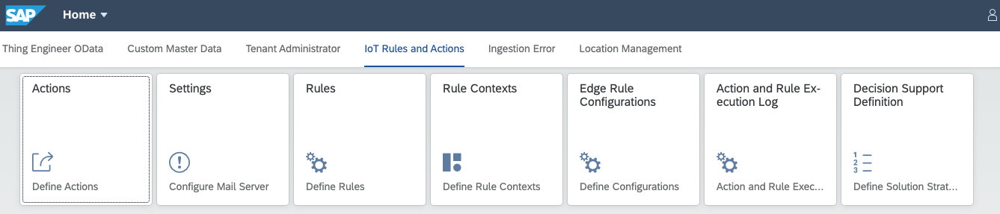

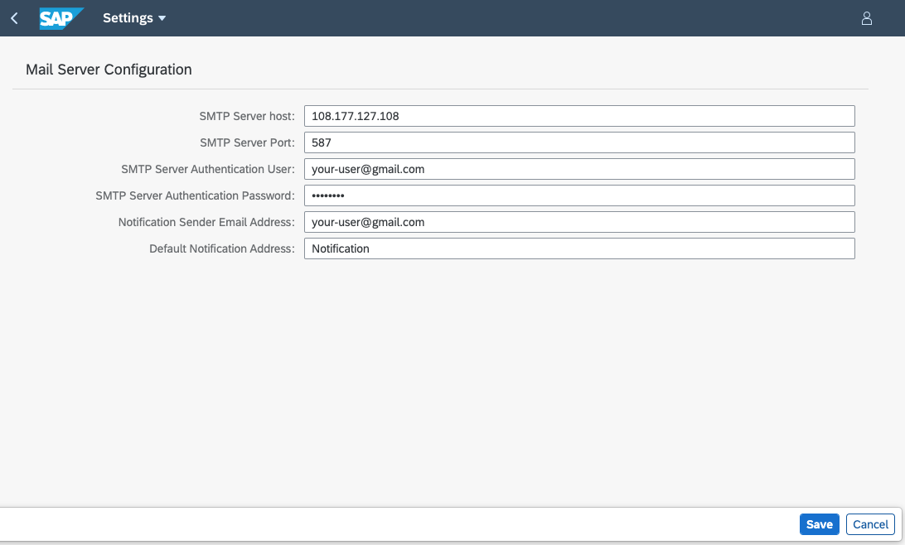

[DONE]

[ACCORDION-END]

[ACCORDION-BEGIN [Step 2: ](Create a rule context)]
The Rule Context defines the data objects that can be used in a rule. Currently, this is one Property Set. In the future, several data objects could be defined as part of a Rule Context.

1. From the launchpad, choose the **Rule Contexts** tile.

2. Choose **New**.

3. Set **Name** for the rule context to `envData` for `Greenhouse`. Optionally, you can also enter a **Short Text** and a **Description**.

4. Click **Add** button in **Data Objects** and  **Thing Data - Property Sets**.

5. In the popup window click on value help for **Package** and select your package for example `greenhouse`, also click on value help for **Thing Type** and select your thing type for example `greenhouseType`.

6. Choose the property set `envData` for the new rule context and click **OK**.
   The system immediately associates the selected property set with the rule context and navigates you back to the rule context detail screen.

7. Click on selected `envData` property set to check the properties and details. Click **Close** once reviewed.

8. Choose **Save** to save your change.

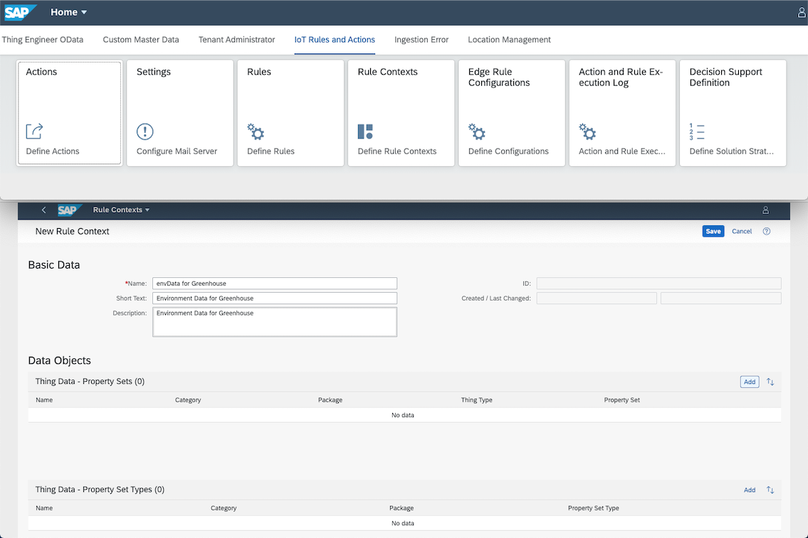

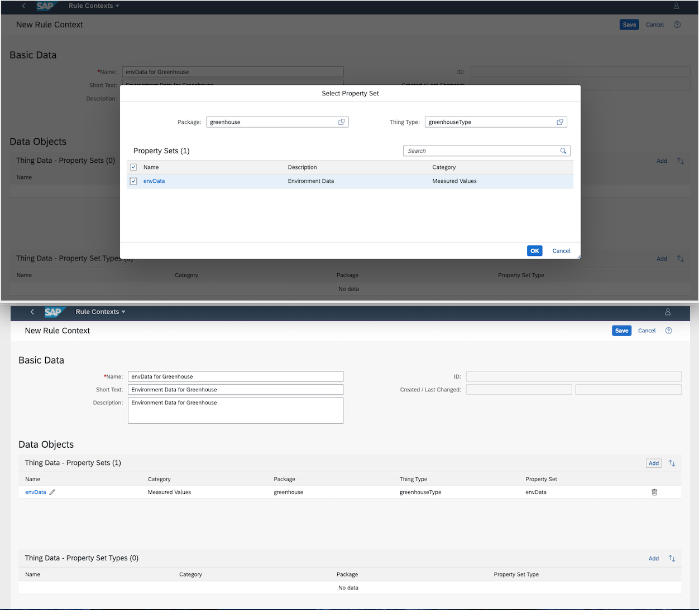

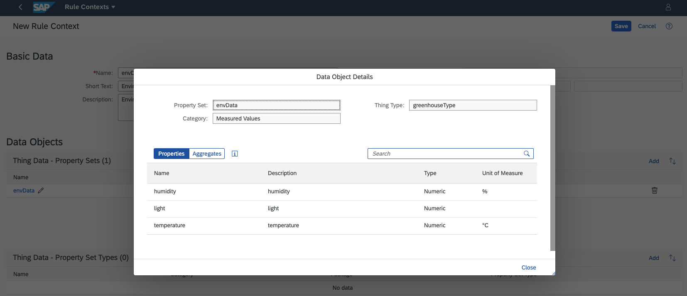

[DONE]

[ACCORDION-END]

[ACCORDION-BEGIN [Step 3: ](Create a rule)]

In this step, we define a `Streaming Rule`, that should be triggered each time when a temperature value is going to exceed a given value.

There are 3 types of rules today:

-	Streaming Cloud Rules are executed immediately when measurements arrive in the system via **SAP Cloud Platform Internet of Things for the Cloud Foundry Environment**. A rule is executed on each individual incoming measurement in the defined Rule Context (that is, Property Set).

- Scheduled Rules are executed by schedule defined by the user. The Scheduled Rules work based on the Time Series Aggregates (see here: https://help.sap.com/viewer/080fabc6cae6423fb45fca7752adb61e/latest/en-US/8e70388fc8814b77a7c0567de93a035e.html). Using Scheduled Rules, you can express rules on aggregated time series data for a specific time window, like the  maximum temperature in 24 hours.

In this tutorial, we will concentrate on a streaming rule.

1. From the launchpad, click on the **Rules** tile.

2. Choose **New Rule**.

3. From the menu, choose `Streaming Cloud` for the type of the rule that you want to create.
   The system presents an empty detail screen where you can enter the settings for the new rule on the **General Information** page.

4. Set **Name** to `Temperature above 70` for the rule. Optionally, you can also enter a **Short Text** and a **Description**.

5. Optionally, you may define a set of freely defined **Tags** that you can attach to a rule.

6. Once you are done with the **General Information**, move on to the **Definition** tab.

7. From the list of **Rule Contexts**, select your rule context `envData for Greenhouse` as example.

8. Once you have selected your rule context it will open another window to select the **Property Set** for this rule context. Click on `envData` to select as example here.
   The system informs you that the rule context cannot be changed anymore, once it has been assigned to a rule. **Confirm** the information to assign the rule context. The system automatically displays the **Thing Type** to which the rule context belongs.

9. In the **Rule Definition** section, define the **If** condition that the rule shall test. For example, `temperature of the envData is greater than 70`. Hint: Entering a `space` in the **If** condition, will give you a context dialog that enables you to select the right object or operator of the rule. By this way, you cannot enter an erroneous rule.

10. Set `IoT Event Name` to `High Temperature` and `IoT Event Severity` to `Medium`. Hint: The Event name that you can use in the Action to give a meaningful context. To set the Event Severity, use **Low**, **Medium** or **High**.

11. Click **Save**. The system goes back to the Rule list view.

12. Select the rule from the list, click **Activate**.You also have an option to **Activate** the rule while you are in the rule definition screen in previous step where you saved.

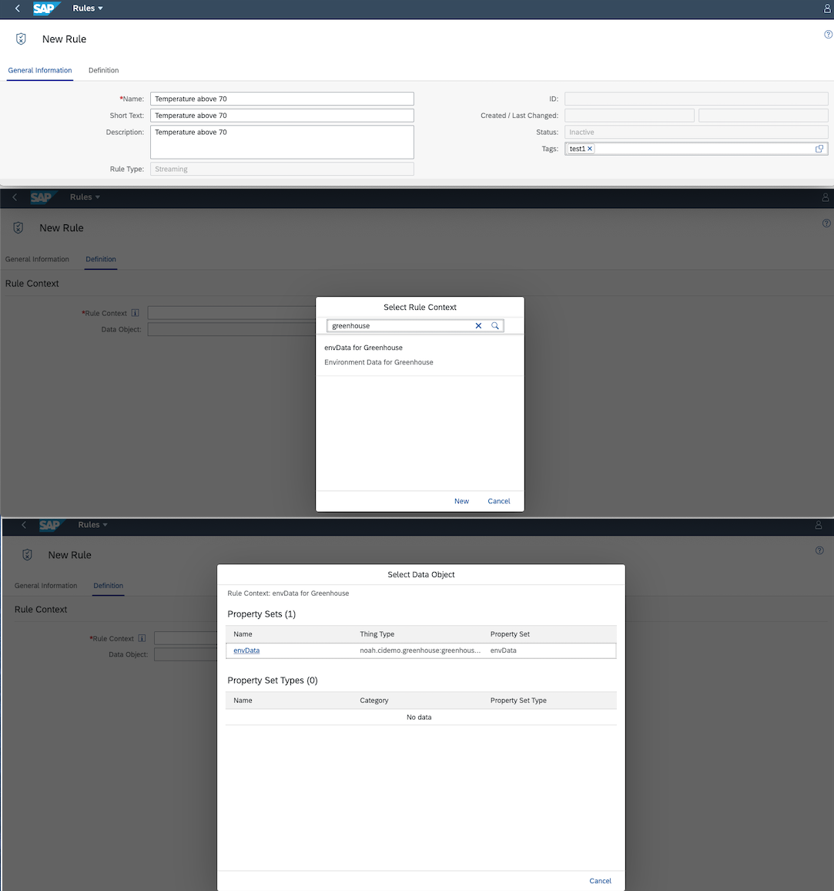

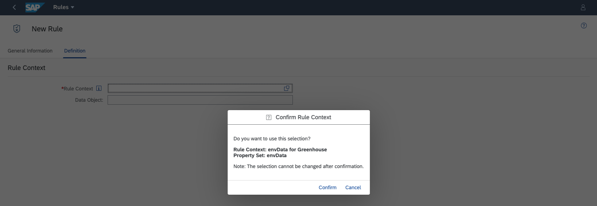

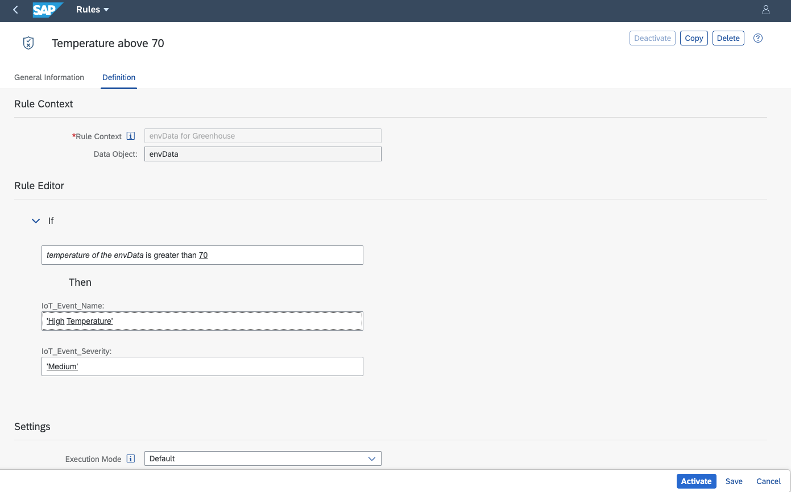

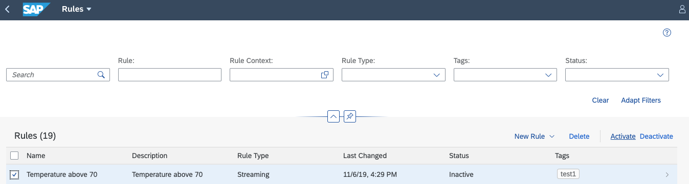

[DONE]

[ACCORDION-END]

[ACCORDION-BEGIN [Step 5: ](Create action to send email)]

In the final step, we define an action that sends an Email.

1.	On the launchpad, select the **Actions** tile.

2.	On the **Actions** page, choose **New** to create a new action.

3.	Set the **Name** field to `Email Alert: high temperature is detected`.

4.	Enter the **Description** optionally.

5.	In the **Trigger by** field, select **Event from Rule**.

6.	In the **Rule** dropdown, select `Temperature above 70`.
    The system populates `Thing Type` automatically.

7.	In the **Action Type** dropdown, select `Email Notification`.

8.	Enter value in the **Email Information** fields. Hint: By entering "${" + another letter(s), you will get a context menu with variables that you can use in the notification text.

9.	Choose **Save** to save your change.

10. Once saved you can see your Action in the list view. In your action right corner you can see **Details**. Click on it, a new popup window appears. This is basically to show the last 10 errors that occurred while this Action was triggered.

11.	Click on your Action, Action detail window will open. In the upper right corner you can see **Test** button. You can test your Action once created and saved by providing the `Thing ID` of the associated `Thing Type`.

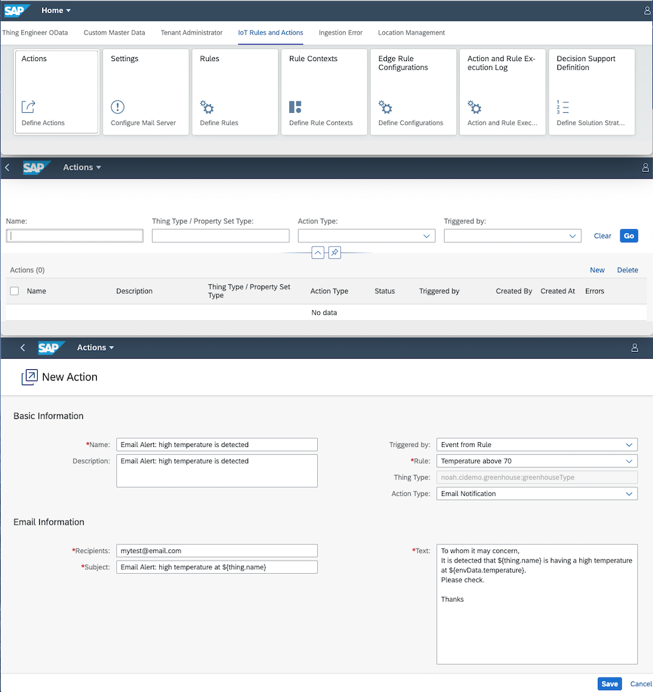

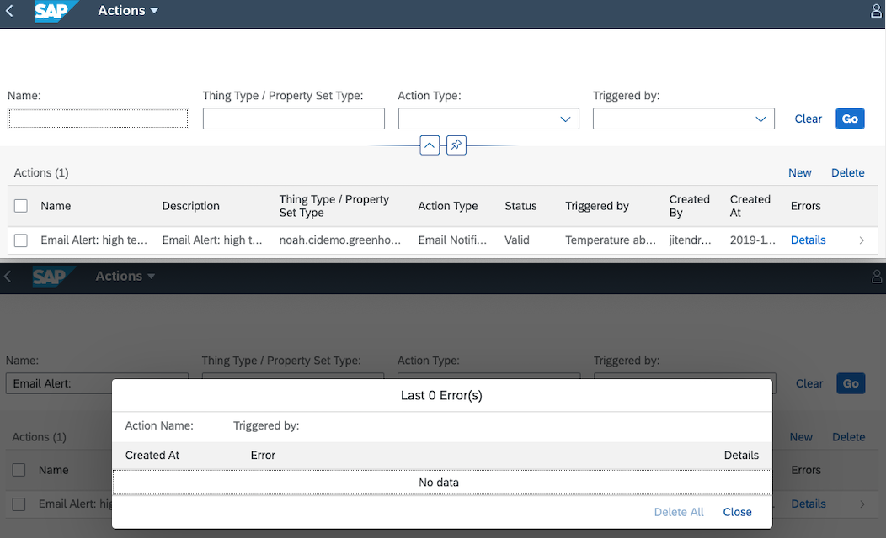

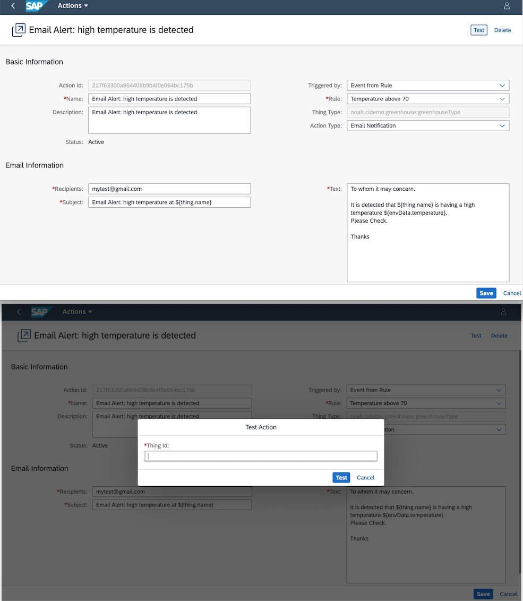

Further notification types supported are http calls to another system, for instance, for business process integration, or an in-app notification to show up in a user's Fiori Launchpad.

For http calls, there exist 2 sample payloads that fit to sample CPI content provided for the integration scenarios **Service Ticket** and **Purchase Requisition**. These sample payloads only work together with the respective CPI content. However, they can serve as an example for your concrete integration scenario.

[DONE]

[ACCORDION-END]

[ACCORDION-BEGIN [Step 6: ](Test rule)]

If you are ingesting data from IoT service:

1.	Pick the device mapped to `greenhouse1`.

2.	Ingest a value of 75 for temperature.

3.	You will get an email.

          To: mytest@email.com

          Subject: Alert: high temperature at greenhouse1

          Body:

          To whom it may concern,

          It is detected that greenhouse1 is having a high temperature at 75.

          Please check.

          Thanks

[VALIDATE_6]

[ACCORDION-END]
---
