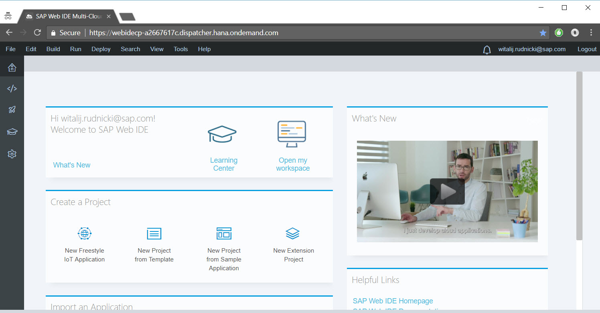
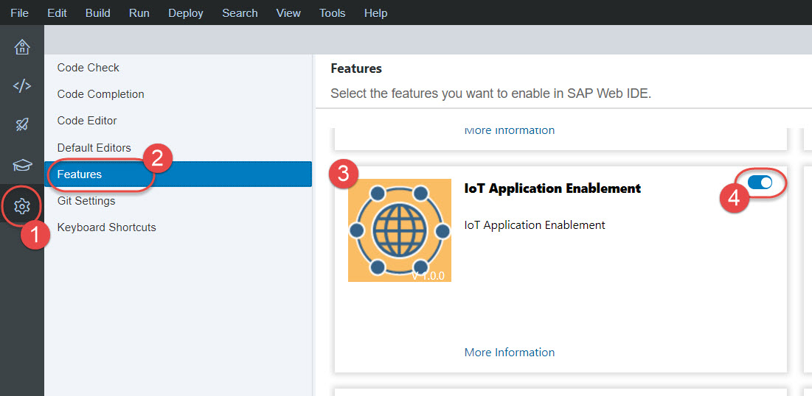
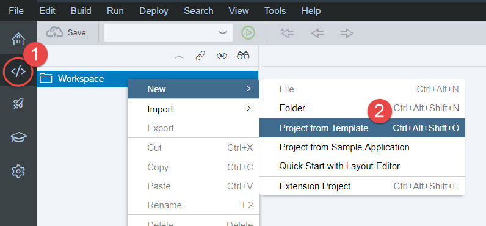
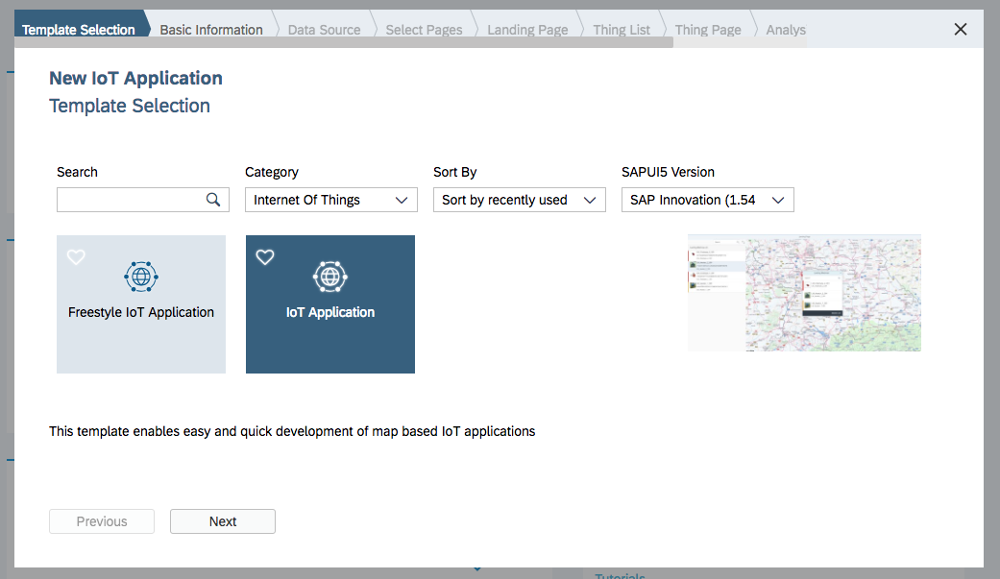
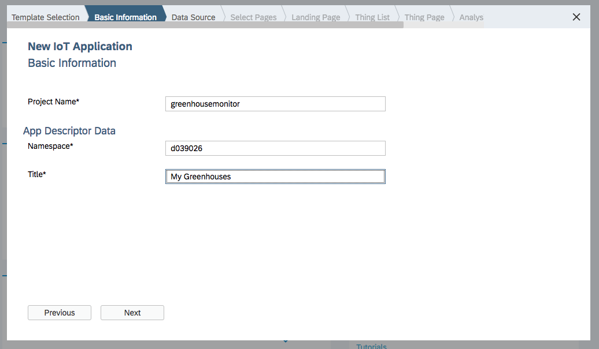
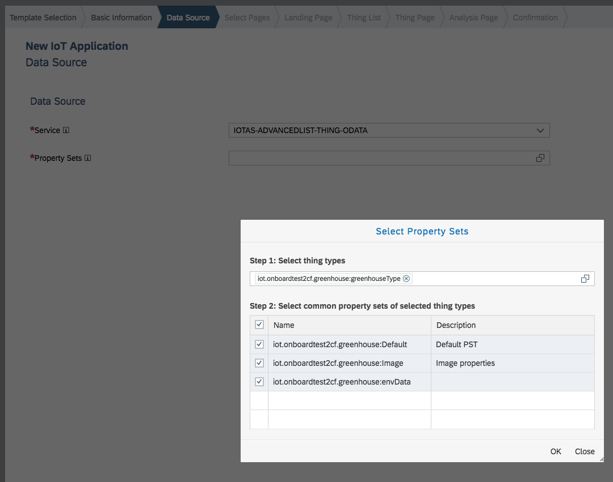
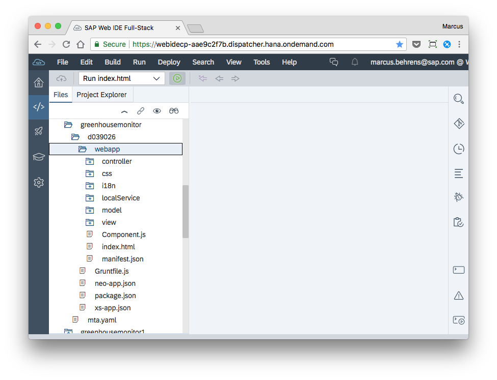
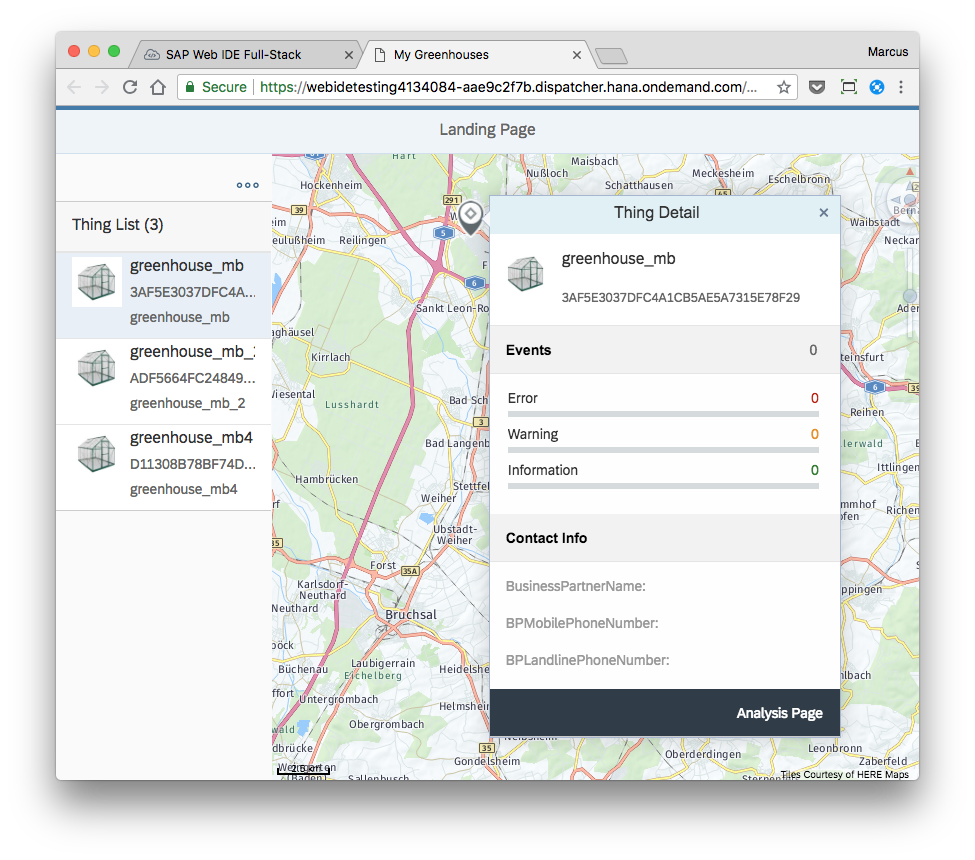
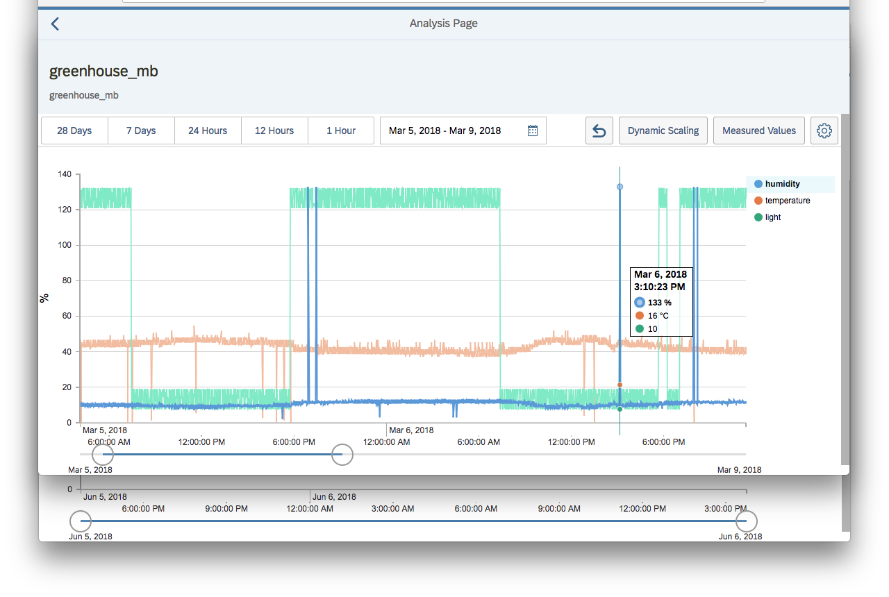
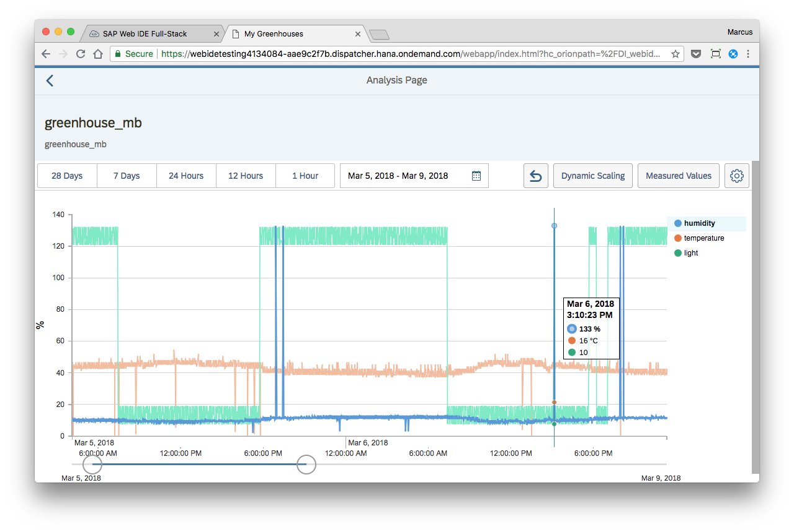

## Prerequisites  
 - **Configuration** You or someone else, that is an administrator in your global account, has walked through the following end-to-end configuration and onboarding guide: [Getting Started with SAP IoT](https://help.sap.com/viewer/195126f4601945cba0886cbbcbf3d364/latest).
 - **Tutorials:** [Create Thing Model](iot-express-4-create-thing-model)

## Details
### You will learn
- How to use SAP Web IDE to build an application that leverages UI controls and data from SAP IoT
- How to use templates to speed up developing prototypes for certain use cases
- How to use the sensor chart UI control to discover patterns in your initial sensor data

---

[ACCORDION-BEGIN [Step 1: ](Start SAP Web IDE)]
SAP Web IDE Full-Stack is a powerful, extensible, web-based integrated development tool that simplifies end-to-end application development for SAP Cloud Platform.

Start SAP Web IDE Full-Stack using the URL provided by your team administrator. The URL would look something like this: `https://webidecp-aae9c2f7b.dispatcher.hana.ondemand.com/` only that the account ID would be different. You would find it at  [http://hana.ondemand.com/](http://hana.ondemand.com/), where you should find your global account, your Neo sub-account, and SAP Web IDE Full-Stack under **Services**.

To log in, use the same email address and password you are using  within the thing modeler. The home screen looks like this:

[DONE]

[ACCORDION-END]

[ACCORDION-BEGIN [Step 2: ](Enable the SAP IoT feature)]
In SAP Web IDE go to **Preferences** > **Features**.

Turn on the following features:

  - **SAP IoT**
  - **Layout Editor**
  - **Storyboard**.

[DONE]

[ACCORDION-END]

[ACCORDION-BEGIN [Step 3: ](Create new project from IoT template)]
In the **Development** perspective, right-click  **Workspace** and create a new project from a template (there are other ways to do this, for example, from the home page).

[DONE]

[ACCORDION-END]

[ACCORDION-BEGIN [Step 4: ](Create app using wizard)]
Choose **IoT Application** from the **Internet of Things** category, and click **Next**.

Enter `greenhousemonitor` as a project name and your user ID as the namespace, then click **Next**.

On the **Data Source** tab, select:

 - `IoTAS-ADVANCEDLIST-THING-ODATA` or similar as a service
 - All property sets for your greenhouse thing type in your package (search for `greenhouse`)

Click **Next**, keeping all of the default settings for each of the page types until the wizard is finished. This generates a multi-page IoT application for you.

SAP Web IDE will generate the code and will open the new application in the Code Editor. Now open the application folder and select any of the subfolders to examine the generated source files.

[DONE]

[ACCORDION-END]

[ACCORDION-BEGIN [Step 5: ](Run app and explore data)]

You can change the generated source code afterwards as you see fit. Right now we want to explore the data that we have collected with the application. So to see a preview of the application you can start it right from SAP Web IDE. To do so, click the green button (below the **Deploy** menu in the picture above). This should bring up the application in a new tab.

Depending on how many devices you have on-boarded, you will see one or multiple greenhouses in the list on the left. Click one to zoom in and once you have zoomed in to see only one click on it in the map, and then click **Analysis Page**. (Feel free to explore the other options on how to navigate the application another time).

This will show this chart:

Now you can add measures other then humidity with the **Measured Values** button, change the time-frame with the slider at the bottom or with the buttons labeled **7 Days**, and you can look for patterns in the data.

The example below shows 2 patterns -- the light sensor in this case seems to jump between two extremes, day vs night. Let's look at the second one: the humidity provides 140% values at times -- these values are probably due to an error in the sensor.

You will discover that if you collect sensor data from the real world, there will always be surprises, both in that you cannot see what you thought you would find in the data, and also that you see patterns in the data that you did not expect to see.

For more support on in-depth topics on building an IoT Application, refer to [http://developers.sap.com/](http://developers.sap.com/) and look for the SAP IoT product.

[VALIDATE_1]

[ACCORDION-END]

---
