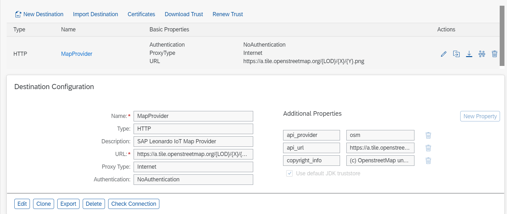
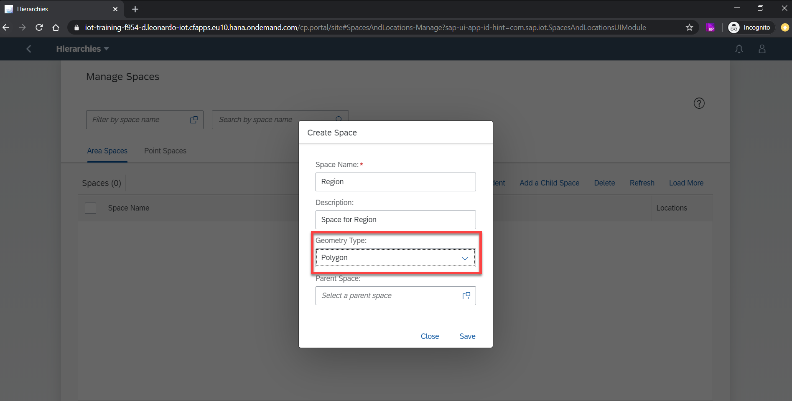
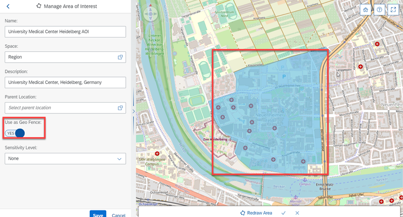
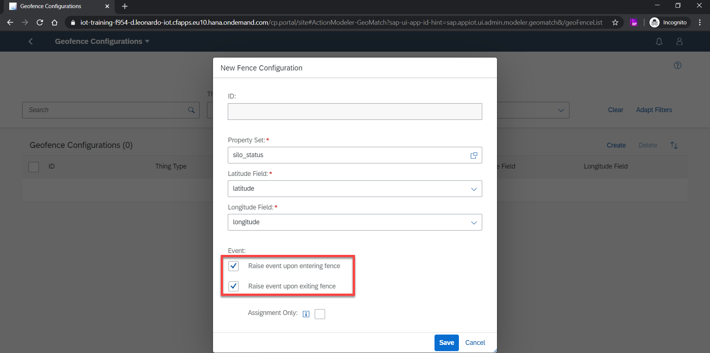
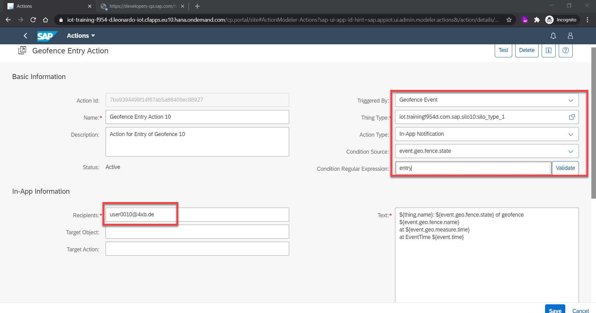
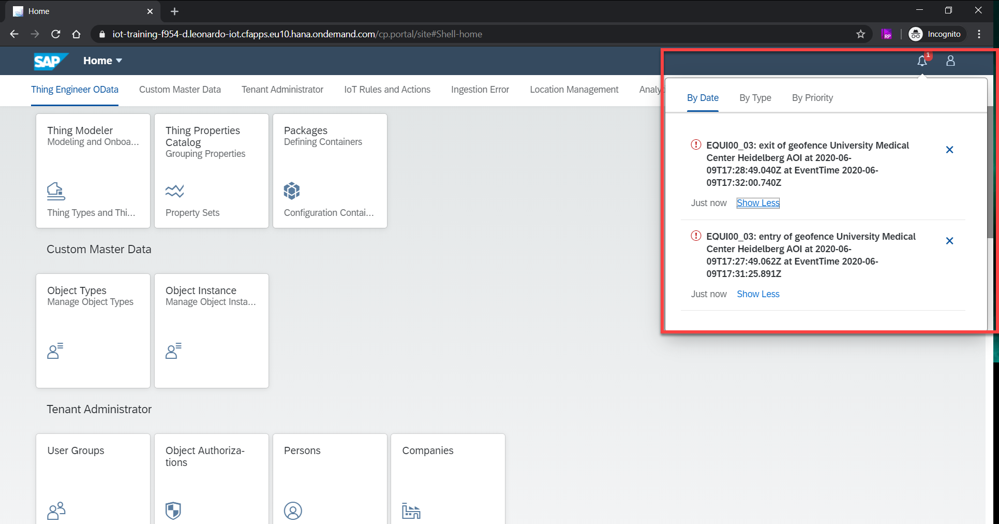
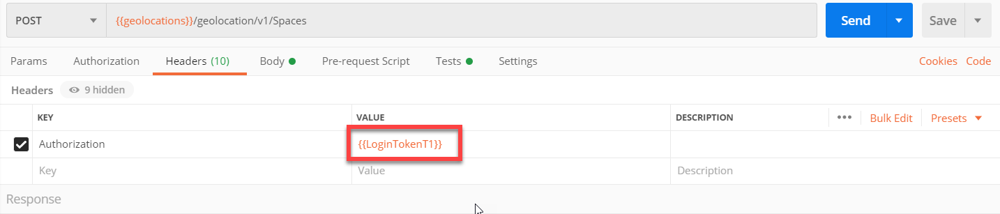
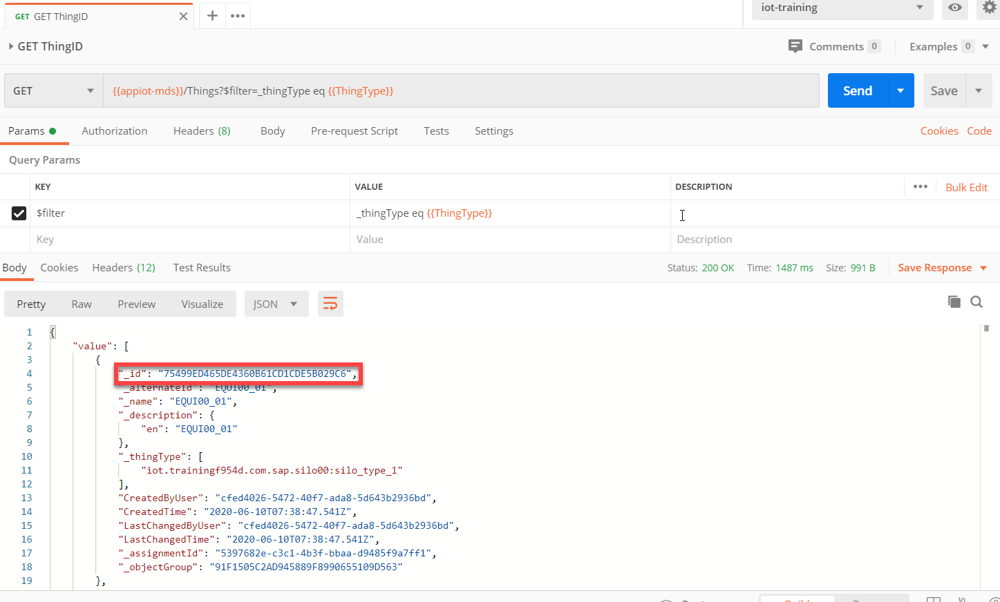
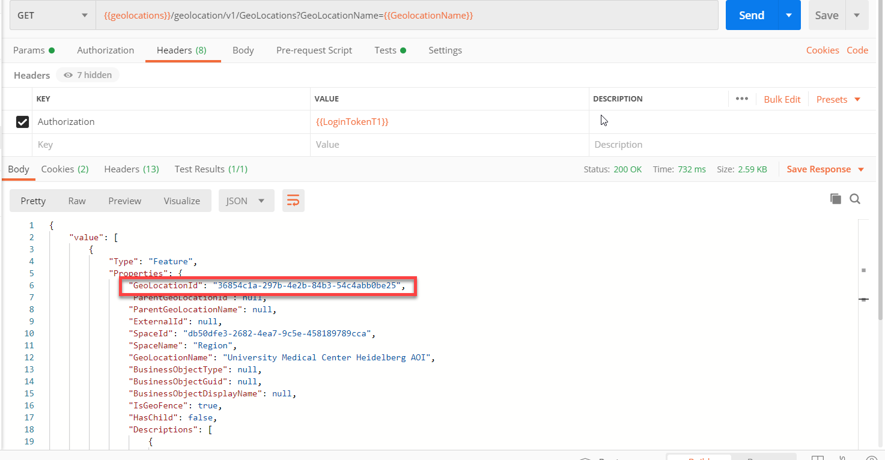
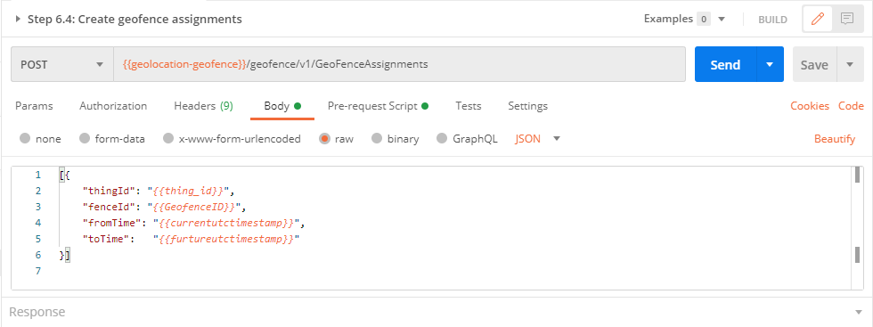

## Prerequisites
 - Basic knowledge of Rest-APIs.
 - Basic knowledge of [Postman](https://www.postman.com/) (Version 7.29.1 and above).
 - Your SAP user from <accounts.sap.com> has been added to the Cloud Foundry space in this tenant as a Space Developer so you can retrieve the required credentials for accessing the APIs.
 - Your user has at a minimum the `iot_role_collection` created during onboarding of your tenant and the associated roles.
 - Have a working thing with continuous data ingestion according to the [Onboard Virtual Devices Sending Data from Your Computer](iot-onboard-device) tutorial.
 - Basic understanding of SAP IoT Actions services.
 - Have one of the map providers (ESRI Maps, HERE Maps, OpenStreetMap, Google Maps) configured for the subaccount. Refer to the [map provider configuration](https://help.sap.com/viewer/3e1f5a3b795d4a24a1edf5fea5d454f6/2007b/en-US/d03b803ef2ac45419e97311447f867b1.html) document for more details.

## Details
### You will learn
- How to define a space
- How to define an area of interest geolocation (geofence)
- How to configure geofence
- How to configure geofence assignments
- How to configure an action on geofencing to create notifications

---

SAP IoT Location services enables you to achieve business outcomes for real-time things - like vehicles equipped with GPS sensors. It allows you to define geolocations –- point of interest and area of interest, configure geofence. Geofencing can be used to notify events like entry or exit of a thing in a defined area. This tutorial helps you with the first steps of setting up geolocations, configuring a geofence, configuring actions for the geofence events.

[ACCORDION-BEGIN [Step 1: ](Configure destination for map provider)]

The first step for creating the geolocations is to configure a map provider of your choice (ESRI Maps, HERE Maps, OpenStreetMap, Google Maps are supported for now). You can do so by creating a destination by going to your Cloud Foundry subaccount at [https://hana.ondemand.com/](https://hana.ondemand.com/), drilling down to **Destinations** (under connectivity on the left panel) and creating/ importing a destination.

Refer to the [map provider configuration](https://help.sap.com/viewer/3e1f5a3b795d4a24a1edf5fea5d454f6/2007b/en-US/d03b803ef2ac45419e97311447f867b1.html) document for more details.

!

[DONE]
[ACCORDION-END]

[ACCORDION-BEGIN [Step 2: ](Define space)]

A geolocation space represents the semantics such as geometry, related geolocations and hierarchy of a geolocation. A geolocation space can be of geometry type point or polygon.

In this case, let us assume a truck is delivering the items from ACME GmbH to the University Medical Centre Heidelberg. You can create the University Medical Centre Heidelberg and ACME GmbH as the points of interest and a geofence around the University Medical Centre Heidelberg and ACME GmbH to track the entry and exit of the truck. To create a point of interest / area of interest (geofence) geolocations, a space of geometry type point/ polygon respectively should exist.

+ **Open the Fiori launchpad**

To be able to create a space, you could use the UIs. You can find the SAP IoT Fiori launchpad by going to your 'Cloud Foundry subaccount' and launching it from the Subscriptions. If you know the tenant name (in Cloud Foundry developer lingo called 'subdomain' and in SAP cloud platform lingo called 'Cloud Foundry subaccount') you can also invoke it by replacing **'iot-training-f954-d'** with your tenant name in the following:

[https://iot-training-f954-d.leonardo-iot.cfapps.eu10.hana.ondemand.com/](https://iot-training-f954-d.leonardo-iot.cfapps.eu10.hana.ondemand.com/)

You can use your SAP user credentials to login to the Fiori launchpad.

+ **Navigate to Hierarchies tile**

Once you are logged in to the Fiori launchpad, navigate to the **Location Management** tab and then to **Hierarchies** tile to create a space. In the hierarchies screen, you must click on **Create a New Space** button. A dialog box will open where you can fill in the details. An example is provided below for creating a space of geometry type polygon using the Hierarchies UI.

!

In the above example, we have selected the Geometry type as **Polygon** from the dropdown. Using a **unique name** for the space, enables this space to not be in conflict with other spaces (Ex: **Region 0001**)

[DONE]
[ACCORDION-END]

[ACCORDION-BEGIN [Step 3: ](Define geofence)]

Once a space is defined, you can create geolocations. An area of interest is a closed polygon with a minimum of three vertices. To track the movement of the thing around a location, you can define an area of interest as a geofence. A geofence is a geolocation of geometry type polygon.

To be able to create a geofence, you must navigate to the **Location Management** tab and then to the **Locations** tile in the Fiori launchpad. Click on **Create** button and select **Create Area**. Once you are in the create screen, follow the below steps to create an area of interest:

- Click on **Draw Area**
- Zoom in on the map where you want to create the geofence. Click on the map to create the area of interest. The area of interest will be completed when the last point and the first point are the same (i.e, a closed polygon). Hint: Click at least 2 times (2 vertices) to see the shape of the area coming on the map.
- Once you are satisfied with the area of interest you have drawn on the map, **confirm it** by clicking on the **tick mark** at the footer of the map
- Fill in the form details (provide a **unique name** for the geolocation to avoid conflicts - Ex: **University Medical Centre Heidelberg 0001**)
- To define the area of interest as a geofence, you must mark **Use as Geo Fence** as **YES**

In this case, let us assume you want to track the entry and exit of the truck around the University Medical Centre Heidelberg. For this, you can create an area of interest around the University Medical Centre Heidelberg and define it as a geofence.

An example is provided below for defining an area of interest geolocation as geofence.

!

You can create an area of interest geolocation according to your scenario and mark it as geofence to track the thing's movement around the area. If you face any errors regarding the size of the geofence, please create a smaller geofence and try again.

[DONE]
[ACCORDION-END]

[ACCORDION-BEGIN [Step 4: ](Define geofence configuration)]

In the current scenario, you have a geofence around the University Medical Centre Heidelberg premises. You can now configure the geofence to trigger events on entry and exit of the truck.

To be able to define geofence configurations, you could use the UIs. You must navigate to the **Location Management** tab and then to the **Geofence Configurations** tile in the Fiori launchpad. Click on **Create** button. Once the create dialog is opened, follow the below steps to define the geofence configurations:

- Open the value help dialog for the Property Set. Select the package that you created for your thing model (refer to [Onboard Virtual Devices Sending Data from Your Computer](iot-onboard-device) tutorial to create a thing model and ingest data)
- Choose the Thing Type (Ex: `silo_type_1`) which has measured values (Ex: `silo_status`)
- Select **latitude** and **longitude** from the dropdown values for **Latitude Field** and **Longitude Field** respectively
- Select both the **Entry** and **Exit** events (you can also select either of the options depending on your scenario)
- **Uncheck** the **Assignment Only** option and save (details of this usage is given in step 6 of this tutorial)

An example is provided below for defining the geofence configurations for the entry and exit events.

!

[DONE]
[ACCORDION-END]

[ACCORDION-BEGIN [Step 5: ](Define Actions for Geofence Events)]

In the current scenario, you have the following:

- An area of interest defined as geofence around the University Medical Centre Heidelberg
- A truck that is moving towards the University Medical Centre Heidelberg area

Now you can create an action to send notifications on the truck's entry or exit from the geofence.

An action can be a receiver of an event. You can use the Actions UI from the Fiori launchpad to define an action. You must navigate to the **IoT Rules and Actions** tab and then to the **Actions** tile in the Fiori Launchpad.

To create an action, click on **Create** button. Once you are in the create screen, fill in the name and description fields by providing a **unique name** to avoid conflicts (Ex: **Geofence entry action 0001**) and follow the below steps to create a geofence action.

- You must select **Geofence Event** from the dropdown for **Triggered by**.
- Select the thing type you created for your thing model (Ex: `iot.trainingf954d.com.sap.silo01:silo_type_1`). Refer to [Onboard Virtual Devices Sending Data from Your Computer](iot-onboard-device) tutorial to create a thing model and ingest data.
- Select the **Action Type** as **In-App Notification**
- Provide the **Condition Source** as **event.geo.fence.state**
- Provide the **Condition Regular Expression** as **entry**
- Provide your SAP user email address (the email you used to login to the Fiori launchpad) for the **Recipients**
- Text (sample text is given below. You may provide your own text message):
```
${thing.name}: ${event.geo.fence.state} of geofence ${event.geo.fence.name}  
at ${event.geo.measure.time}
at EventTime ${event.time}
```
- Click on **Save**
- Confirm the email address (the email you used to login to the Fiori launchpad)

An example is provided below of an action for the entry of the truck in the geofence:

!

Once the truck starts moving, data is ingested continuously. You can check the truck's (thing) data using the Thing Modeler UI in the Fiori launchpad. The action is triggered when the truck enters the University Medical Centre Heidelberg Geofence and you will receive a notification in the Fiori Launchpad with the action text that you have defined above. You can check the notifications by clicking on **Notifications** button in the Fiori launchpad.

!

Similarly, you can create another action for the exit of the truck from the geofence.

[DONE]
[ACCORDION-END]

[ACCORDION-BEGIN [Step 6: ](Configure geofence assignments)]

To avoid receiving events from non-relevant geofences, you must select the Assignment Only option in the geofence configuration. With this configuration, you are assigning the geofence to a thing, for which you would like to receive the events. If the Assignment Only option is selected in the geofence configuration, an assignment of the thing to the geofence must be done else, the geofence events and notifications will not be generated. You can select the **Assignment Only** option by editing your geofence configuration using the **Geofence Configurations** tile in the Fiori launchpad.

!

We have provided a set of sample postman collections on GitHub for you to download. Please clone or download/unzip the repository **sap-iot-samples** at [https://github.com/SAP-samples/sap-iot-samples](https://github.com/SAP-samples/sap-iot-samples)

+ **Retrieve client credentials**

You can access the SAP IoT APIs using an OAuth Token. After you subscribe your subaccount to SAP IoT, you can retrieve the client secret from the service keys you created for your subaccount. Refer to the document to [retrieve Client ID and Client Secret](https://help.sap.com/viewer/fffd6ca18e374c2e80688dab5c31527f/2009a/en-US/a41c28db0cf449059d48c23fa5f7b24b.html). You can use the client secret to retrieve the OAuth token. The client secret is unique for a subaccount. You can access all the APIs and data within the subaccount using this OAuth token. This kind of authentication is used when you build backend applications, where you don't have a user context.

+ **Install Postman**

Postman is a popular and easy to use REST client using which you can access the SAP IoT APIs. Please refer to the [introduction guide](https://learning.postman.com/docs/getting-started/introduction/) for understanding the usage of Postman. The postman collection (iot-location-services-samples -> Geofence - the one you downloaded from the above GitHub link) includes all the API calls used in this tutorial and the payload structures for the same. However, if you would like to try out the APIs on your own, we have provided the details in this tutorial on the consumption of the APIs.

+ **Generate OAuth token**

Before retrieving the OAuth token, you must update the following in the [Postman environment variables](https://learning.postman.com/docs/sending-requests/managing-environments/)

1. Update the tenant name (your subaccount name - Ex:iot.trainingf954d) to the  `tenant_name` Postman environment variable.
2. Update the `uaadomain` from the service key to `uaadomain` Postman environment variable.
3. Update the client ID and client secret from the service key you generated for your subaccount to `client_id` and `client_secret` Postman environment variable respectively.

You can retrieve the `OAuth` token by using the Postman collection (Geofence collection) and triggering the request **'Step 6.1: GET OAuth Token'**

You can refer to the below Developer Guide to create an OAuth Token if you would like to understand the steps for generating the token in detail.

[Generate OAuth Token](https://help.sap.com/viewer/fffd6ca18e374c2e80688dab5c31527f/2005b/en-US/7b3a94e68be9460680a915138a160c67.html)

 Update the generated token to `LoginToken1` Postman environment variable appending 'Bearer' at the beginning. For accessing the SAP IoT APIs, enter this OAuth token as an Authorization Header in the Postman.



To create a Geofence Assignment, the `ThingID` and `GeofenceId` must be known. Use the provided postman collection (Geofence collection) to retrieve the `ThingID`, `GeofenceId` and create geofence assignments.

+ **Retrieve the `ThingID`**

1. First, update the thing type name in the Postman environment variable (`ThingType`) with the thing type you created for your thing model (EX: `iot.trainingf954d.com.sap.silo00:silo_type_1`).
2. Next, trigger the **'Step 6.2: GET `ThingID`'** request to get the `ThingID`.

However, if you would like to try out on your own, you must replace 'appiot-mds.cfapps.eu10.hana.ondemand.com' with the 'appiot-mds' endpoint from the service key you generated for your subaccount in the below URL and replace `iot.trainingf954d.com.sap.silo00:silo_type_1` with the thing type you created for your thing model.

```
https://appiot-mds.cfapps.eu10.hana.ondemand.com/Things?$filter=_thingType eq 'iot.trainingf954d.com.sap.silo00:silo_type_1'
```

The above API will return all the things for the thing type provided in the request. You can select the `ThingID` (`_id` in the response) you want to use. Update the `ThingID`(`_id` in the response) you retrieved here, to the Postman environment variable `thing_id` for future use.

!

+ **Retrieve the `GeofenceId`**

1. Use the Postman collection (Geofence collection) that you downloaded from the GitHub link and update the geolocation name (Ex: University Medical Center Heidelberg AOI) you want use to the `GeolocationName` postman environment variable.
2. Next, trigger the **'Step 6.3: GET `GeofenceId`'** request to get the `GeofenceId`. Update the `GeofenceId` (`GeoLocationId` in the response) to the `GeofenceID` Postman environment variable for future use.

Below is the sample endpoint for the same. You must replace 'sap-iot-noah-live-geolocation-runtime.cfapps.eu10.hana.ondemand.com' with the 'geolocation' endpoint from the service key you generated for your subaccount and replace University Medical Center Heidelberg AOI with the geolocation name you want to use.

```
https://sap-iot-noah-live-geolocation-runtime.cfapps.eu10.hana.ondemand.com/geolocation/v1/GeoLocations?GeoLocationName=University Medical Center Heidelberg AOI
```

!

+ **Configure geofence assignments**

Now that you have the `ThingID` and `GeofenceId`, you can create a geofence assignment. Use the Postman collection (Geofence collection) that you downloaded form the GitHub link and execute **'Step 6.4: Create geofence assignments'** request.

!

Below is the sample API endpoint and payload. You must replace 'sap-iot-noah-live-geolocation-geofence.cfapps.eu10.hana.ondemand.com' with the 'geolocation-geofence' endpoint from the service key you generated for your subaccount.

```
https://sap-iot-noah-live-geolocation-geofence.cfapps.eu10.hana.ondemand.com/geofence/v1/GeoFenceAssignments
```

```JavaScript
[{
    "thingId": "{{thing_id}}",
    "fenceId": "{{fence_id}}",
    "fromTime": "2020-06-18T22:08:00.000Z",
    "toTime": "2020-06-18T22:22:00.000Z"
  }]
```

The `ThingID` and `GeofenceId` retrieved in the previous steps are to be used in the above payload as values for `thing_id` and `fence_id` keys respectively. The `fromTime` and `toTime` will be the timestamp in UTC format (which is basically the same as GMT time).

Once you have assigned a thing to a geofence, you will receive geofence events only for that thing for the assigned geofence. If the assignments are not created, then you will not receive any notifications.

In conclusion, geofencing can be used to track the movements of the Things around a particular location.

[VALIDATE_7]
[ACCORDION-END]
