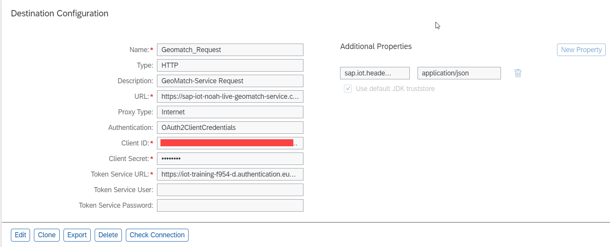
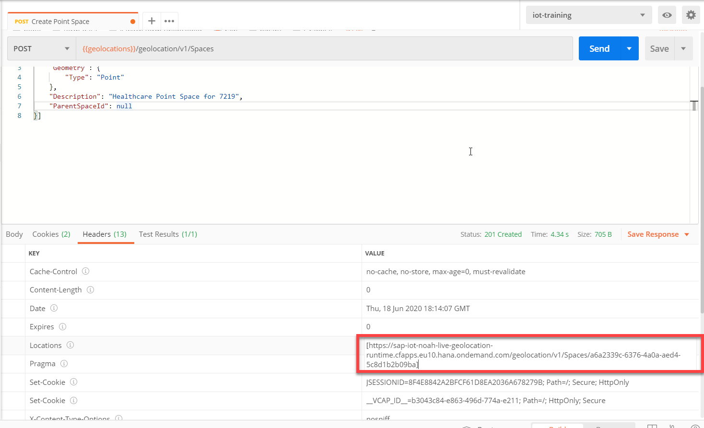
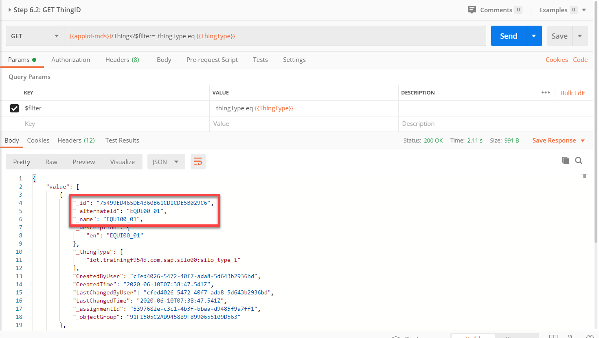
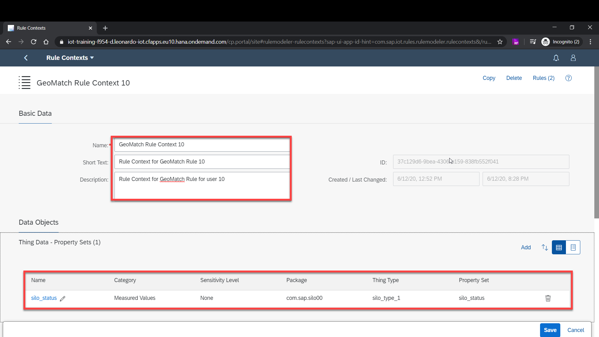
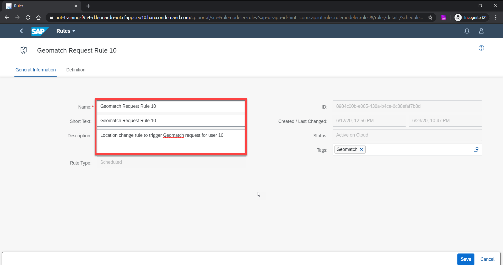
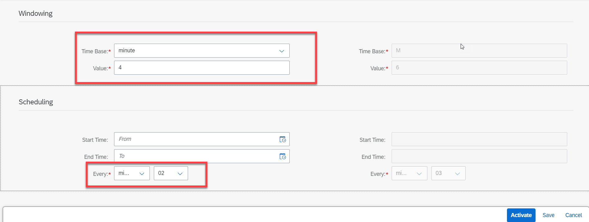
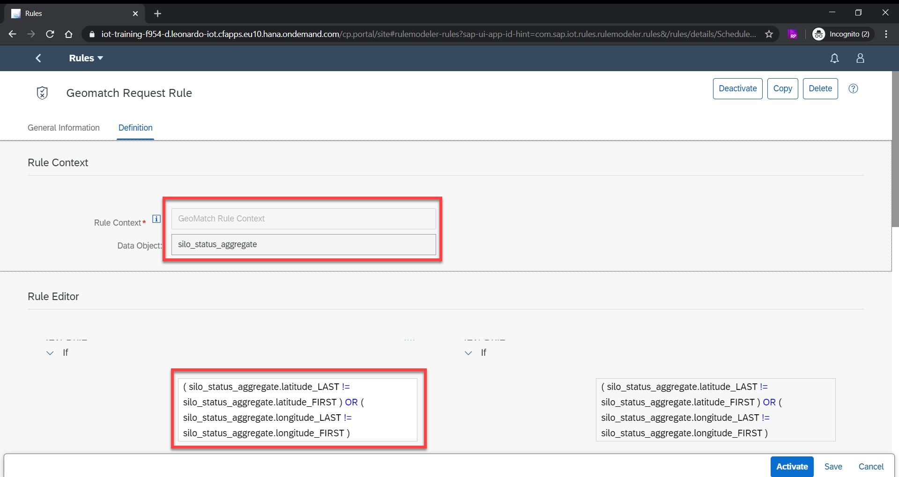
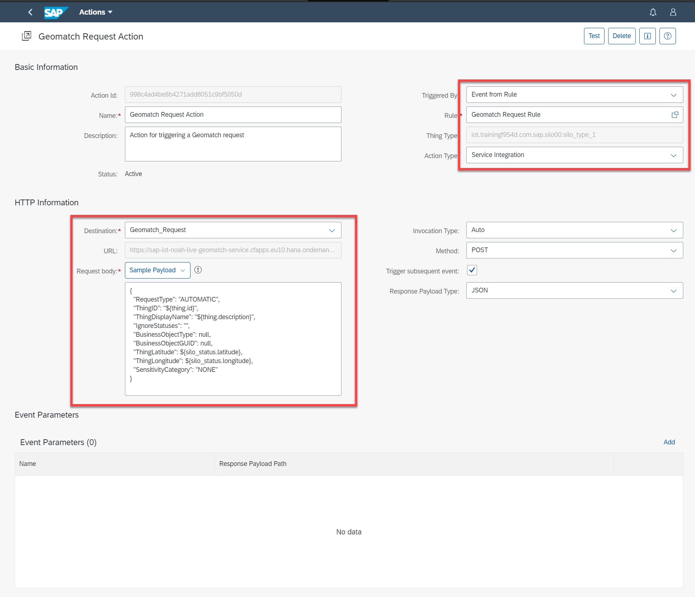
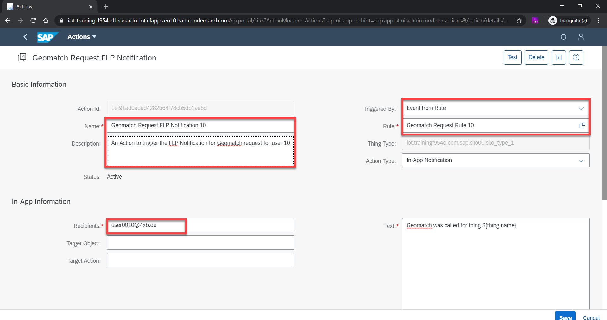
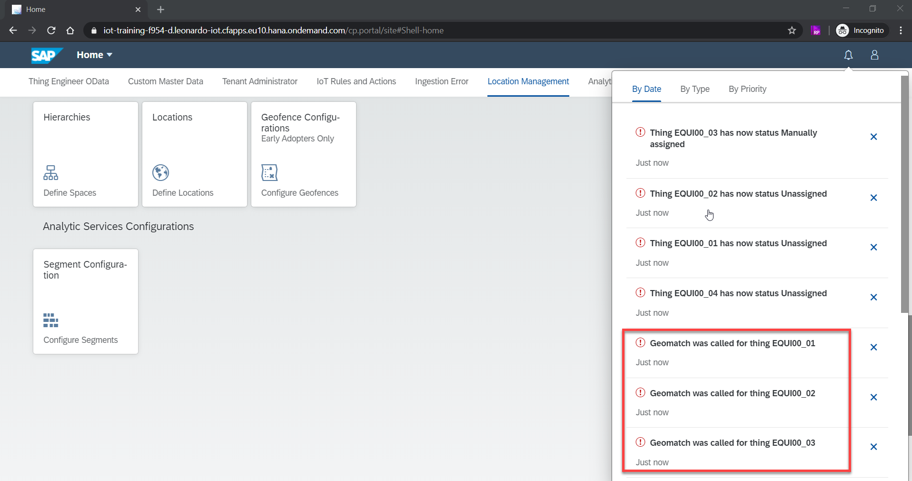

## Prerequisites
 - Basic knowledge of [REST](https://www.restapitutorial.com/) APIs.
 - Basic knowledge of [Postman](https://www.postman.com/) (Version 7.29.1 and above).
 - Have a working thing with continuous data ingestion according to the [Onboard Virtual Devices Sending Data from Your Computer](iot-onboard-device) tutorial.
 - Your SAP user from <accounts.sap.com> has been added to the Cloud Foundry space in this tenant as a Space Developer so you can retrieve the required credentials for accessing the APIs.
 - Your user has at a minimum the `iot_role_collection` permission created during onboarding of your tenant and the associated roles.
 - Basic understanding of SAP Internet of Things (IoT) rules and actions services.


## Details
### You will learn
  - How to define a space of geometry type point
  - How to define a point of interest geolocation
  - How to define radius settings for geomatch
  - How to trigger a manual geomatch request
  - How to read geomatch associations
  - How to configure rules and actions to trigger geomatch automatically, if relevant

SAP Internet of Things (IoT) geolocation services enable you to locate a specific object or device (real-time things -- like vehicles equipped with GPS sensors) based on the geographical coordinates. It allows you to define geolocations -- point of interest and area of interest (geofence).

This tutorial helps you with the first steps of setting up geolocations, configuring geomatch, associating a thing to a business location via a geomatch request and reading the associations for the thing.

---

[ACCORDION-BEGIN [Step 1: ](Configure destination for geomatch request)]

To trigger the geomatch request automatically, a destination must be configured with the geomatch request API endpoint. To create the destination, go to your Cloud Foundry subaccount at [https://hana.ondemand.com/](https://hana.ondemand.com/), click **Connectivity** on the left panel and then click **Destinations**.

1.    Provide the `geomatch-service` API endpoint (for example, `sap-iot-noah-live-geomatch-service.cfapps.eu10.hana.ondemand.com/api/v1/geomatch/request`) from the service key you generated for your subaccount as the URL in the destination.

2.    You can retrieve the Client ID, Client Secret and the Token Service URL (authentication URL) from the service key and provide the same in the destination.

3.    Also, add 'sap.iot.header.Content-Type' as 'application/json' for the additional properties.

     An example is provided below.

    !

[DONE]
[ACCORDION-END]

[ACCORDION-BEGIN [Step 2: ](Retrieve OAuth token)]

In this case, let us assume that the University Medical Center Heidelberg has a vending machine with some food items in it. Since the location of the vending machine and University Medical Center Heidelberg is very close, the vending machine will get assigned to it. You can create the University Medical Centre Heidelberg as a point of interest. To create a point of interest, a space of geometry type point is needed, which you will create in the following steps.

1.    Retrieve client credentials.

    You can access the SAP IoT APIs using an OAuth token. After you subscribe your subaccount to SAP IoT, you can retrieve the client secret from the service keys you created for your subaccount. Refer to [retrieving Client ID and Client Secret](https://help.sap.com/viewer/fffd6ca18e374c2e80688dab5c31527f/2009a/en-US/a41c28db0cf449059d48c23fa5f7b24b.html) document for more details. You can use the client secret to retrieve the OAuth token. The client secret is unique for a subaccount and you can access all APIs and data within the subaccount using this OAuth token. This kind of authentication is used when you build backend applications, where you don't have a user context.

2.    Set up Postman collection.

    Postman is a popular and easy to use REST client using which you can access the SAP IoT APIs. Refer to the [introduction guide](https://learning.postman.com/docs/getting-started/introduction/) for understanding the usage of Postman.

    We have provided a set of sample Postman collections on GitHub for you to download. Please clone or download/unzip the repository **sap-iot-samples** at [https://github.com/SAP-samples/sap-iot-samples](https://github.com/SAP-samples/sap-iot-samples). The Postman collection (iot-location-services-samples > Geomatch) includes all the API calls used in this tutorial and the payload structures for the same. However, if you would like to try out the APIs on your own, we have provided the details in this tutorial on the consumption of the APIs.

3.    Generate OAuth token.

    Before retrieving the OAuth token, update the following in the [Postman environment variables](https://learning.postman.com/docs/sending-requests/managing-environments/).

    - Update the tenant name (your subaccount name - for example, iot.trainingf954d) to the `tenant_name` Postman environment variable.

    - Update the `uaadomain` from the service key to `uaadomain` Postman environment variable.

    - Update the Client ID and Client Secret from the service key you generated for your subaccount to `client_id` and `client_secret` Postman environment variable.

    - You can now generate the OAuth token by using the Postman collection (Geomatch collection) and triggering the request **Step 1: GET OAuth Token**.

    - Update the generated token to `LoginToken1` Postman environment variable appending 'Bearer' at the beginning. For accessing the SAP IoT APIs, enter this OAuth token as an Authorization Header in the Postman.

    !

    >You can refer to the [Developer Guide](https://help.sap.com/viewer/fffd6ca18e374c2e80688dab5c31527f/2005b/en-US/7b3a94e68be9460680a915138a160c67.html) to create an OAuth Token if you would like to understand the steps for generating the token in detail.

[DONE]
[ACCORDION-END]

[ACCORDION-BEGIN [Step 3: ](Define geolocation space of geometry type point)]

A geolocation space is needed before creating a geolocation. To create a geolocation space, you can use the UIs or APIs. In this case, let us use the APIs to define a geolocation space of geometry type **point**. You can refer to the [Create Geolocations and Configure Geofence](iot-locations-geofence) tutorial for creating geolocations and spaces using the UI.

1.    Create geolocation space.

    You can get the API endpoints for the services from the service key that you generated for your subaccount. In the  Postman collection (the Geomatch collection you downloaded from the GitHub link), execute the **Step 3.1: Create a point space** request by providing a **unique name** for the geolocation space to avoid conflicts (for example, **Healthcare 0001**). However, if you want to try out, below is the sample API endpoint and payload. Replace `sap-iot-noah-live-geolocation-runtime.cfapps.eu10.hana.ondemand.com` with the `geolocation` domain from the service key you generated for your subaccount in the below URL.

    ```URL
    https://sap-iot-noah-live-geolocation-runtime.cfapps.eu10.hana.ondemand.com/geolocation/v1/Spaces
    ```

    ```JSON
    [{
    	"SpaceName": "Healthcare 0001",
    	"Geometry": {
    		"Type": "Point"
    	},
    	"Description": "Healthcare Point Space",
    	"ParentSpaceId": null
    }]
    ```
    In the above example, we have defined the geometry type as **point**.

2.    Fetch the `SpaceId`.

    You can now get the `SpaceId` for the above space by checking the **Locations** key in the **Response Headers**. Select the alphanumeric string after '/Spaces' for getting the ID. Update this `SpaceId` to `point_space_id` in the Postman environment variables for future use.

    !

3.    Read the point space.

    Read the above space with a GET request to the same endpoint, but with the `SpaceId` as the parameter. Use the Postman collection (Geomatch collection) and execute **Step 3.2: Read point space** request.

    However, if you want to try out, below is the sample API endpoint. Replace `sap-iot-noah-live-geolocation-runtime.cfapps.eu10.hana.ondemand.com` with the `geolocation` domain from the service key you generated for your subaccount in the below URL. Use the `SpaceId` you retrieved above in place of `ee2002d6-57d6-4553-b9b5-eff164yuw3d`.

    ```URL
    https://sap-iot-noah-live-geolocation-runtime.cfapps.eu10.hana.ondemand.com/geolocation/v1/Spaces/ee2002d6-57d6-4553-b9b5-eff164yuw3d
    ```

[DONE]
[ACCORDION-END]

[ACCORDION-BEGIN [Step 4: ](Define business location -- point of interest)]

A location for the business object (business location) is needed for associating a thing to it using the manual geomatch request. A business location is a point of interest geolocation. Before triggering the geomatch request, do the following changes in the payload (Body tab in Postman):

1.    Generate a GUID for the business location.

    Manual geomatch works for geolocations with `BusinessObjectGUID`. For the `BusinessObjectGuid`, generate a 32 character GUID using the [GUID Generator](https://www.guidgenerator.com/online-guid-generator.aspx). Update the generated GUID to the `BusinessObjectGuid` Postman environment variable.

2.    Update the coordinates.

    The format of the coordinates in the payload is as below:

    ```JSON
       "coordinates":[
            longitude,
            latitude
            ]
    ```

    You can get the coordinates for an address using [https://www.gps-coordinates.net/](https://www.gps-coordinates.net/). You must update the `latitude` and `longitude` values you are using in the `latitude` and `longitude` Postman environment variables for future use.

3.    Create business location.

     Provide a **unique name** for `GeoLocationName` and `BusinessObjectDisplayName`(for example, **University Medical Center Heidelberg POI 0001**) in the payload to avoid conflicts and trigger the **Step 4.1: Create Business Location** request from the Postman collection (Geomatch collection).

    However, if you would like to try out, below is the sample API endpoint and payload. Replace `sap-iot-noah-live-geolocation-runtime.cfapps.eu10.hana.ondemand.com` with the `geolocation` domain from the service key you generated for your subaccount in the below URL and trigger a POST request.

    ```URL
    https://sap-iot-noah-live-geolocation-runtime.cfapps.eu10.hana.ondemand.com/geolocation/v1/GeoLocations
    ```

    ```JSON
    [{
          "Type":"Feature",
          "Properties":{
             "ParentGeoLocationId":null,
             "ExternalId":null,
             "SpaceId":"ee2002d6-57d6-4553-b9b5-eff164yuw3d",
             "GeoLocationName":"University Medical Center Heidelberg POI 0001",
             "BusinessObjectType":"Hospital",
             "BusinessObjectGuid":"b3f24275-c351-4f1e-8389-a94ed431f097",
             "BusinessObjectDisplayName":"University Medical Center Heidelberg 0001",
             "IsGeoFence":false,
             "HasChild":false,
             "Descriptions":[
                {
                   "Locale":"en",
                   "Label":"University Medical Center Heidelberg"
                }
             ],
             "Addresses":[
                {
                   "Locale":"en",
                   "Address":{
                      "House":"672",
                      "Street":"Im Neuenheimer Feld",
                      "CityDistrict":null,
                      "City":"Heidelberg",
                      "District":null,
                      "RegionCode":"BW",
                      "Region":"Baden-Wurttemberg",
                      "CountryCode":"DE",
                      "Country":"Germany",
                      "PostalCode":"69120"
                   }
                }
             ]
          },
          "Geometry":{
             "type":"Point",
             "coordinates":[
                8.671045303344727,
                49.41686867456883
             ]
          },
          "SensitivityCategory":null
       }]
    ```

    As a user, you can choose to define a geolocation as personal information, personal sensitive information or none. You can define the `SensitivityCategory` as `com.sap.appiot.security:spi` for personal sensitive information, `com.sap.appiot.security:pii` for personal information or `null`. This is with respect to the Global Data Protection Regulation (GDPR).

4.    Read the business location.

    You can now get the `GeoLocationID` for the above geolocation by checking the **Locations** key in the **Response Headers**. Select the alphanumeric string after `/GeoLocations` for getting the ID (similar to retrieving the `SpaceId`). Update this `GeoLocationID` to `point_geolocation_id` in the Postman environment variables for future use.

    Read the above business location using the Postman collection (Geomatch collection) and trigger **Step 4.2: Read Business Location**. However, if you want to try out the API, below is the sample API endpoint. Replace `sap-iot-noah-live-geolocation-runtime.cfapps.eu10.hana.ondemand.com` with the `geolocation` domain from the service key you generated for your subaccount in the below URL, replace `0bc4d7b4-bef9-4e0f-8f60-354673cc43ea` with the `GeoLocationID` retrieved earlier and trigger a GET request.

    ```URL
    https://sap-iot-noah-live-geolocation-runtime.cfapps.eu10.hana.ondemand.com/geolocation/v1/GeoLocations/0bc4d7b4-bef9-4e0f-8f60-354673cc43ea
    ```

[DONE]
[ACCORDION-END]

[ACCORDION-BEGIN [Step 5: ](Configure geomatch radius settings)]

Geomatch is the process of comparing the location of the thing against the location of business objects and assigning the thing to the business object based on certain criteria like the distance between the thing and business object. Geomatch can be used to automatically detect the movement of a thing and accordingly do the assignment/un-assignment with a business object. Further, notifications can be generated to notify the person responsible if there is any unplanned movement of the thing and they can take further actions.

Geomatch functionality is based on the GPS data that a thing is generating. To configure the geomatch service to a business case, the radius values for calculations should be configured conforming to certain constraints. There can be only **One Configuration** per subaccount for geomatch. You can always modify the configurations if required.

1.    Create geomatch radius settings.

    To create the geomatch radius settings, use the Postman collection (Geomatch collection) and execute **Step 5.1: Configure GeoMatch Radius Settings**. However, if you would like to try out, below is the sample API endpoint and the payload. Replace `sap-iot-noah-live-geomatch-service.cfapps.eu10.hana.ondemand.com` with the `geomatch-service` domain from the service key you generated for your subaccount in the below URL.

    ```URL
    https://sap-iot-noah-live-geomatch-service.cfapps.eu10.hana.ondemand.com/api/v1/geomatch/Configuration/geomatchRadiusSettings
    ```

    ```JSON
    {
      "InitialRadius": {
        "Radius": 50,
        "Status": "Assigned",
        "CreateBOAssociation": true,
        "TreatMultipleMatchesWithSameStatus": false
      },
      "IntermediateRadius": [
        {
          "Radius": 100,
          "Status": "Nearby"
        },
        {
          "Radius": 200,
          "Status": "In 200m range"
        }
      ],
      "RestAllStatus": "Unassigned",
      "ManualMappedState": "Manually assigned",
      "ManualUnmappedState": "Manually unassigned",
      "AllowedDistanceError": 10
    }
    ```
    In the above payload, we have defined the radius settings with three statuses for different ranges of radius in meters.

2.    Read the geomatch radius settings.

    Use the Postman collection (Geomatch collection that you downloaded from the GitHub link) and trigger the **Step 5.2: Read GeoMatch Radius Settings Configuration** request. If you want to try out, below is the sample API endpoint. Replace `sap-iot-noah-live-geomatch-service.cfapps.eu10.hana.ondemand.com` with the `geomatch-service` domain from the service key you generated for your subaccount in the below URL.

    ```URL
    https://sap-iot-noah-live-geomatch-service.cfapps.eu10.hana.ondemand.com/api/v1/geomatch/Configuration/GeoMatchRadiusSettings
    ```

[DONE]
[ACCORDION-END]

[ACCORDION-BEGIN [Step 6: ](Trigger manual geomatch request)]

Now that the radius settings are configured for the subaccount, you can trigger a geomatch request.

The geomatch request API is a REST API, which allows you to request one of the supported actions like 'Automatic geomatch', 'Manual geomatch', 'Manual Un-mapping' and 'Clearing of Manual Mappings' to be performed on a single thing. For triggering the geomatch request for a thing, the location of the thing is needed.

1.    Retrieve the `ThingID`.

    - First, update the thing type name in the Postman environment variable `ThingType` with the thing type (for example, `iot.trainingf954d.com.sap.silo10:silo_type_1`) you created for your thing model (Refer to [Onboard Virtual Devices Sending Data from Your Computer](iot-onboard-device) tutorial to create a thing model and ingest data).

    - Next, trigger the **Step 6.1: GET `ThingID`** request to get the `ThingID`. However, if you would like to try out, you can use the below endpoint.

    ```URL
    https://appiot-mds.cfapps.eu10.hana.ondemand.com/Things?$filter=_thingType eq 'iot.trainingf954d.com.sap.silo00:silo_type_1'
    ```
    In the above API, replace `appiot-mds.cfapps.eu10.hana.ondemand.com` with the `appiot-mds` domain from the service key and replace `iot.trainingf954d.com.sap.silo00:silo_type_1` with the thing type from your thing model.

    The above API will return all the things for the thing type provided in the request. Select the `ThingID`(`_id` in the response) you want to use. Update the `ThingID`(`_id` in the response) and the `ThingDisplayName`(`_name` in the response) you retrieved here, in the Postman environment variables `thing_id` and `thing_displayName` for future use.

    !

2.    Trigger manual geomatch request.

    Manual geomatch requires that the geolocation is a business location, i.e, it has a `BusinessObjectGUID` for associating a thing to a geolocation. This will be the Business Partner information. The `BusinessObjectType` and `BusinessObjectGUID` are the type and ID of the business object to which the thing shall be manually assigned.

    For the manual geomatch request, the `ThingLatitude` and `ThingLongitude` can be the same as the business location (point of interest) coordinates values which you created earlier.

    As a user, you can choose to define a geomatch request as personal information, personal sensitive information or none. Define the `SensitivityCategory` as `com.sap.appiot.security:spi` for personal sensitive information, `com.sap.appiot.security:pii` for personal information or `NONE`. This is with respect to the Global Data Protection Regulation (GDPR).

    Use the Postman collection (Geomatch collection) and trigger **Step 6.2: Manual Geomatch Assignment** request. However, if you would like to try out, below is the sample API endpoint and payload. Replace `sap-iot-noah-live-geomatch-service.cfapps.eu10.hana.ondemand.com` with the `geomatch-service` domain from the service key you generated for your subaccount in the below URL. In the below sample payload, use the `ThingID`, `ThingDisplayName` (from the thing details),`BusinessObjectGUID` and `BusinessObjectType` (from the geolocation details) you retrieved above.

    ```URL
    https://sap-iot-noah-live-geomatch-service.cfapps.eu10.hana.ondemand.com/api/v1/geomatch/request
    ```

    ```JSON
    {
       "RequestType": "MANUAL_ASSIGN",
       "ThingID": "{{thing_id}}",
       "ThingDisplayName": "{{thing_displayName}}",
       "IgnoreStatuses": "",
       "BusinessObjectType": "<Geolocation-BusinessObjectType>",
       "BusinessObjectGUID": "<Geolocation-BusinessObjectGUID>",
       "ThingLatitude": {{thing_latitude}},
       "ThingLongitude": {{thing_longitude}},
       "RequestTime": {{requestutctimestamp}},
       "SensitivityCategory": "NONE"
    }
    ```

[DONE]
[ACCORDION-END]

[ACCORDION-BEGIN [Step 7: ](Read geomatch association for the thing)]

Now that a geomatch request is triggered for a thing, the status of the thing will be based on the request type, radius settings and thing's location. The results of the geomatch requests will be persisted as a Geo association data. The same is exposed as an OData API.

Trigger the **Step 7: Latest Geo-Associations for one Thing** request from the Postman collection (Geomatch collection) to fetch the latest associations for the thing. However, if you'd like to try out, below is the sample API Endpoint. Replace `sap-iot-noah-live-geomatch-association-odata.cfapps.eu10.hana.ondemand.com` with the `geoassociation-odata` domain from the service key you generated for your subaccount in the below URL.

```URL
https://sap-iot-noah-live-geomatch-association-odata.cfapps.eu10.hana.ondemand.com/api/v1/geomatch/odata/LatestgeomatchAssociationBythings?thingId={{thing_id}}
```

In the above API endpoint, the `thing_id` is the `ThingID` you used for triggering the geomatch request. You can read the latest geomatch associations or all the geomatch associations for the thing. The sample response for `LatestGeoMatchAssociationByThings` is as below:

!

The `Matching_Status` of the thing's association depends on the request type, radius settings and the thing's location.

[DONE]
[ACCORDION-END]

[ACCORDION-BEGIN [Step 8: ](Define rules for automatic geomatch)]

You can define rules to specify the conditions to generate events which can be consumed in actions to trigger a geomatch request for the things that are ingesting data continuously. To make this cost effective, define a **Scheduled rule** to trigger an action in case of any change in the thing's location for a certain time window. A rule context is needed before creating a rule, which you will create in this step.

1.    Open the Fiori launchpad.

    - Go to your subaccount, click **Subscriptions**, and then click **Go to Application** link for **SAP IoT** tile.

    >If you know the tenant name (in Cloud Foundry developer lingo called 'subdomain' and in SAP Cloud Platform lingo called 'Cloud Foundry subaccount') you can also invoke it by replacing **'iot-training-f954-d'** with your tenant name in the following URL:

    >[https://iot-training-f954-d.leonardo-iot.cfapps.eu10.hana.ondemand.com/](https://iot-training-f954-d.leonardo-iot.cfapps.eu10.hana.ondemand.com/)

    - Use your SAP user credentials to log in to the Fiori launchpad.

    - Navigate to the **IoT Rules and Actions** tab and then to **Rule Context** tile in the Fiori Launchpad to create a rule context and the **Rules** tile to create a rule.

2.    Create rule context.

    Click **New** button and follow the below steps to create a rule context.

    - Provide a **unique name** for the name and description fields (for example, **Geomatch rule context 0001**) to avoid conflicts.

    - Add the measured value (for example, `silo_status`) of your thing model (refer to [Onboard Virtual Devices Sending Data from Your Computer](iot-onboard-device) tutorial to create a thing model and ingest data) as the 'Thing Data - Property Sets'. An example is provided below for creating a rule context:

    !

3.    Create rule.

    Now that you have a rule context, you can create a rule. Navigate to the **IoT Rules and Actions** tab and then to **Rules** tile in the Fiori launchpad and create a **Scheduled rule**.

    - Provide a **unique name** for the name and description fields (for example, **Geomatch request rule 0001**).

    !

    - In the **Definition** tab, select the rule context (for example, **GeoMatch Rule Context 0001**) you created earlier for **Rule Context** field.

    - Provide **4 minutes** for the **Windowing** and **2 minutes** for the **Scheduling**. The timings indicate that the rule will be executed every two minutes (scheduling) and checks for any change in the thing's location in the past four minutes (windowing). You may define the scheduling and windowing according to your scenario.

      !

    - Sample rule condition is provided below (you have to type the condition as the tool doesn't allow you to copy-paste the condition). The below condition indicates to trigger the rule action if there is a change in the thing's location.

    ```
    ( silo_status_aggregate.latitude_LAST != silo_status_aggregate.latitude_FIRST ) OR ( silo_status_aggregate.longitude_LAST != silo_status_aggregate.longitude_FIRST )
    ```

    !

    - Once all the details are filled, **Activate** the rule.

[DONE]
[ACCORDION-END]

[ACCORDION-BEGIN [Step 9: ](Define actions for geomatch)]

Before defining an action, configure a **Destination** for the geomatch request API Endpoint for your subaccount. Please refer to the **Step 1: Configure destination for geomatch request** part of this tutorial.

1.    Create an action to trigger geomatch request.

    If the above rule condition is satisfied, the rule will trigger an action. To define an action to trigger the geomatch request, navigate to the **IoT Rules and Actions** tab and then to **Actions** tile in the Fiori launchpad.

    - Once you are in the create screen, provide a **unique name** for the name and description fields (for example, **Geomatch Request Action 0001**) to avoid conflicts.

    - Select **Event from rule** for **Triggered by** field.

    - Select the rule you created (for example, **Geomatch request rule 0001**) in the previous step for the **Rule** field.

    - Select the **Action Type** as **Service Integration**, select the destination you created for **Destination** field and define the sample payload for the geomatch request. We have provided the sample payload below:

    ```JSON
    {         
      "RequestType": "AUTOMATIC",     
      "ThingID": "${thing.id}",     
      "ThingDisplayName": "${thing.description}",     
      "IgnoreStatuses": "",     
      "BusinessObjectType": null,     
      "BusinessObjectGUID": null,     
      "ThingLatitude": ${silo_status.latitude},
      "ThingLongitude": ${silo_status.longitude},
      "SensitivityCategory": "NONE"
    }
    ```
    In the above payload, the `RequestType` of the geomatch request will be `AUTOMATIC`. The `ThingLatitude` and `ThingLongitude` values are the coordinates of the thing which comes from the thing model.

    An example of an action is below:

    !

2.    Create an action for FLP (Fiori launchpad) notification.

    As a follow-up, you can define another action to be triggered with the **Action Type** as **In-App Notification** after the completion of the previous action. This will trigger an FLP notification for the user.

    - Provide a **unique name** for the name and description fields (for example, **Geomatch request FLP notification 0001**) in the action screen.

    - Provide the email you are logged on with (SAP user) for the **Recipients** to receive notifications.

    - For **Text** field, you can use the below sample text or any other text of your choice.

    ```Text
    Geomatch was called for thing ${thing.name}
    ```
     An example of an action is provided below:

    !

    Once the geomatch request is triggered by the action, the user will get a Fiori launchpad notification for the same.

    !

    You can now retrieve the latest geomatch associations for the thing by using the APIs (like shown above in **Read geomatch association for the thing**) or create more actions for the same. A destination (similar to the geomatch request destination) must be configured for the associations API for consuming the API in the actions.

    In conclusion, the vending machine will now be assigned to the University Medical Center Heidelberg business object, which we did using manual geomatch. For the other things, geomatch request will be triggered from rules and actions as the data gets ingested with different locations. Based on the distance between thing and business location, assignment/un-assignment will happen.

[VALIDATE_7]
[ACCORDION-END]

---
