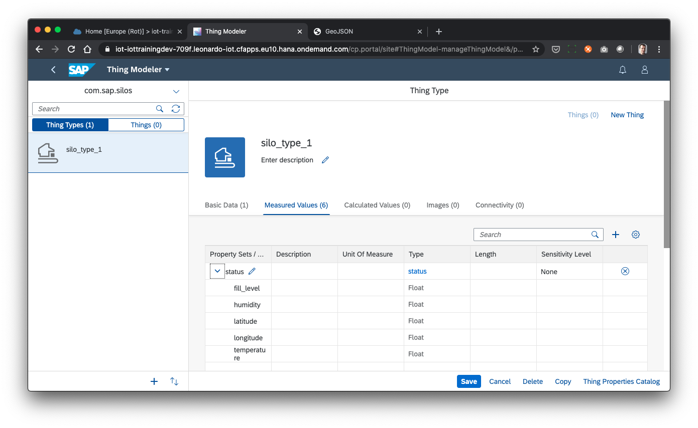
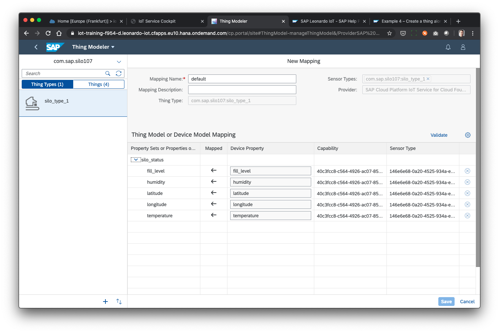

## Prerequisites
 - `Node.js` is installed on your computer. Check by calling `node -v` and `npm -v`. Version 12.16 respectively 6.13 and higher should work.
 - Git installed on your computer. check by running `git --version`. Version 2.19 and higher should work.
 - Your company has licensed SAP IoT with the new capacity unit based licensing introduced in August 2020 or your company has a Cloud Platform Enterprise Agreement and you have subscribed to the `oneproduct` service plan.
 - Your project team has setup the subscription for SAP IoT in your company's global account in a tenant (e.g. in the DEV tenant, the guide for the basic setup is at [http://help.sap.com/](https://help.sap.com/viewer/195126f4601945cba0886cbbcbf3d364/latest/en-US/bfe6a46a13d14222949072bf330ff2f4.html) ).
 - Your SAP User from accounts.sap.com has been added to the Cloud Foundry space in this tenant as a Space Developer so you can retrieve the required credentials for accessing the APIs.
 - Your SAP User has at a minimum the `iot_role_collection` created during onboarding of your tenant and the associated roles.


## Details
### You will learn
  - Where device and application model come from
  - Where to find sample code for using SAP IoT
  - How to call SAP IoT APIs from `node.js`
  - How to generate initial device and application model
  - How to check the models in SAP IoT tools

---

[ACCORDION-BEGIN [Step 1: ](Figure out what your application model and your device model is)]

SAP IoT allows you to put sensor data into business context during data ingestion and at rest. The tutorial helps you with the first steps of setting it up, and enables you to start onboarding devices into the system in subsequent tutorials.

IoT is all about sensors and the data they generate. So when you have a use case on your mind you are probably already thinking about which sensor you want to use. A sensor can generate one or multiple measurements that are sent to the cloud.

In this case let's assume you want to track a silo. The sensors you have in mind would collect the following information from the inside of the silo: temperature, humidity, fill level. Additionally you might want to know, where the (portable) silo is during its use. This would be done with a GPS sensor which provides as measurements latitude, longitude. The GPS sensor is hooked up to satellites with powerful clocks running on them - this gives you also a timestamp in UTC time. Machines do not care about timezones - hence all times they talk about are in UTC (which is basically the same as GMT time). This part of the data model is called the ´device model´.

Now the other part of tracking the silo is the application side. Applications care about the silo as an asset with an equipment id. This would for example be used for maintenance and cleaning if its empty. Other applications (for example SAP S/4) consider the silo a ´handling unit´ from the point of view of transporting it. All of these master data attributes are relevant to understand what the fill level or the GPS location really means. This part of the data model is called the ´thing model´.

We provided an example of a combined declarative device and application model below:

```JSON
{
	"package": "com.sap.silo0000",
	"version": 1,
	"capability_data_sets": [{
		"id": "silo_status",
		"properties": [{
				"id": "temperature",
				"type": "float",
        "max": 40,
        "min": 0
			},
			{
				"id": "humidity",
				"type": "float",
        "max": 100,
        "min": 0
			},
			{
				"id": "latitude",
				"type": "float",
        "max": 49.417057,
        "min": 49.293683
			},
			{
				"id": "longitude",
				"type": "float",
        "max": 8.668077,
        "min": 8.6410001
			},
			{
				"id": "fill_level",
				"type": "float",
        "max": 100,
        "min": 0
			}
		]
	}],
	"application_data_sets": [{
		"id": "silo_process_data",
		"properties": [{
				"id": "EQUI",
				"type": "string"
			},
			{
				"id": "HANU",
				"type": "string"
			}
		]
	}],
	"types": [{
		"id": "silo_type_1",
		"data_sets": [
      "silo_status",
			"silo_process_data"
		]
	}]
}
```
In above example is a package with a globally unique name called `com.sap.silo9960`. Using a package name enables this model to not be in conflict with other models referring to silos.

A silo has 2 capabilities: one to store measures in it and one to store process or application data in it. For measures one of the common things for a silo is the current fill level.

Lastly the model above defines a type of silo that has both of the capabilities linked to it. One will be for measures to store time series data of measurements coming from the device. The other will be for data for which the values that are changing over time would be coming from a backend application. For example the equipment number would remain constant throughout the lifecycle of a silo (relative to your company's ownership/maintenance of the silo) whereas the handling unit id changes as the same silo acts as a handling unit for one order and later as another handling unit for another order.

If you are OK with above example model please continue with the next step.

[DONE]
[ACCORDION-END]

[ACCORDION-BEGIN [Step 2: ](Find and configure sample scripts for calling SAP IoT APIs)]

To create the above data model in SAP IoT you could use our UIs or you could also use the APIs individually. But to be able to apply the same data model in multiple tenants (DEV, Q, PROD) or to be able to use different versions in parallel in one tenant we recommend to use scripts to setup or update the model. This will also make sure, that for a simple model like the one above, the thing model and the device model can be generated from one source and can be kept in sync more easily.

We provide a set of sample scripts on GitHub for you to download. Please clone or download/unzip the repository `sap-iot-samples` at [https://github.com/SAP-samples/sap-iot-samples](https://github.com/SAP-samples/sap-iot-samples).

Go to the folder where you put the cloned/extracted files on your computer. Go to the `iot-bootstrap-scripts` folder and inside of it create a new file called `default-env.json` in an editor of your choice.

Please edit this file as described in the "Node.JS" SDK for SAP IoT at [https://github.com/SAP/leonardo-iot-sdk-nodejs#download-and-installation](https://github.com/SAP/leonardo-iot-sdk-nodejs#download-and-installation) step 2 "Setup authorisation for local usage".

The file then looks similar to this:

```JSON
{
  "VCAP_SERVICES": {
    "iotae": [
      {
        "name": "leonardo-iot-service",
        "tags": [
          "leonardoiot"
        ],
        "credentials": {
  "tmcomposite": "https://tmcomposite.cfapps.eu10.hana.ondemand.com",
  "events-sap": "https://events-sap.cfapps.eu10.hana.ondemand.com",
  ...
  "iot-device-connectivity": {
    "tenantid": "1050480728",
    "mqtt": "mqtts://64fd0e5a-714b-428a-b652-02e2e77d78ad.eu10.cp.iot.sap:8883",
    "rest": "https://64fd0e5a-714b-428a-b652-02e2e77d78ad.eu10.cp.iot.sap:443"
  }
}
      }
    ],
    "user-provided": []
  }
}
```

Now save this file.

The last configuration step, that is important, is to change the name of the package to one, that does not collide with an existing data model in the system. We recommend you change it to something unique. If you are for example the second person doing this in a shared tenant please change model.json as follows:

```JSON
{
  "package": "com.sap.silo0002",
  ...
}
```

[DONE]
[ACCORDION-END]


[ACCORDION-BEGIN [Step 3: ](Create an application and device model based on the model provided)]

Now to start the scripts please open up a terminal window on your computer (called `terminal` on the Mac and `cmd` on a Windows computer).

Go to the directory, where you cloned or unzipped the repository for example like this:

```Shell
cd sap-iot-samples/iot-bootstrap-scripts
```

Then download all the necessary dependent node libraries  by running the following command:

```Shell
npm install
```

In the provided sample code the included `.npmrc` sets the `npm` registry like this `@sap:registry = "https://npm.sap.com"` which will allow you to simply download the SAP IoT SDK for `Node.js` from `github`.

Now you come to the final step: to create the data model. Do this by running this command:

```Shell
node create-data-models.js
```

There will be output in the terminal window indicating success or failure. On failure please check the output carefully on what might have gone wrong. If the output ends with `Device and thing model successfully created.` it should have worked.

If you get an error containing `Already exists iot.trainingf954d.com.sap.silo0001` or similar then you should make sure to use a unique number for the package you want to create as described in the previous step.

Now you might want to check, if the data model has been created. To do so you can use the Thing Modeler tool in the SAP IoT Launchpad.

You (or someone in your team with the right privileges) can find the the SAP IoT Launchpad by going to your cloud foundry sub-account and launching it from the 'Subscriptions'.

If you know the tenant name (in cloud foundry developer lingo called 'subdomain' and in SAP cloud platform lingo called 'cloud foundry sub-account') you can also invoke it by replacing `iot-training-f954-d` with your tenant name in the following:

[https://iot-training-f954-d.leonardo-iot.cfapps.eu10.hana.ondemand.com/](https://iot-training-f954-d.leonardo-iot.cfapps.eu10.hana.ondemand.com/)

Then go the thing modeler app, switch to the `com.sap.silo0001` (or if you are the 2nd user doing this tutorial `com.sap.silo0002`) package at the top left corner and check that your thing model looks as expected:



[DONE]
[ACCORDION-END]

[ACCORDION-BEGIN [Step 4: ](Check that device model and application model are mapped 1:1)]

For many reasons the device model and the application model can have a different lifecycle from each other. You might not be able to alter the firmware of the device sending data. Or the changes on the application side are happening more frequently. For this reason one of the possibilities to deal with this real-life problem is the flexible mapping between those 2 worlds that SAP IoT provides. In this step you will check how this mapping looks like for our simple example.

Go again to the Thing Modeler and look at the connectivity tab of the thing type. Here you can see the below image for the mapping called 'default'.



So all properties are mapped 1:1 between the device model and the application model. Once you define the lifecycle for both models in your implementation you can start using the ability to do this mapping differently.

Besides doing this mapping in the cloud with this mapping capability it is possible to do this on the Edge with a 'Edge Gateway Adapter' or you can do this in your firmware. Each approach has advantages in regards of where you want to make decisions on the data, and which other data you need to make those decisions. This is also where Edge Services comes in that will allow you to have your application model at the Edge e.g., for  doing streaming processing and even calls to business applications on the Edge.

The next tutorial to consider doing might be this one to create devices and start ingesting data: [Create virtual devices and start ingesting data](iot-onboard-device).

If you have any question about SAP IoT in general please consider checking for it in our online community at [https://community.sap.com/topics/internet-of-things](https://community.sap.com/topics/internet-of-things).

[VALIDATE_7]
[ACCORDION-END]


---
