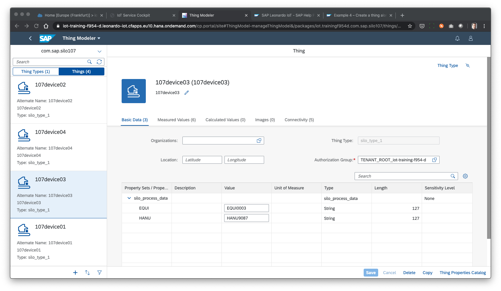
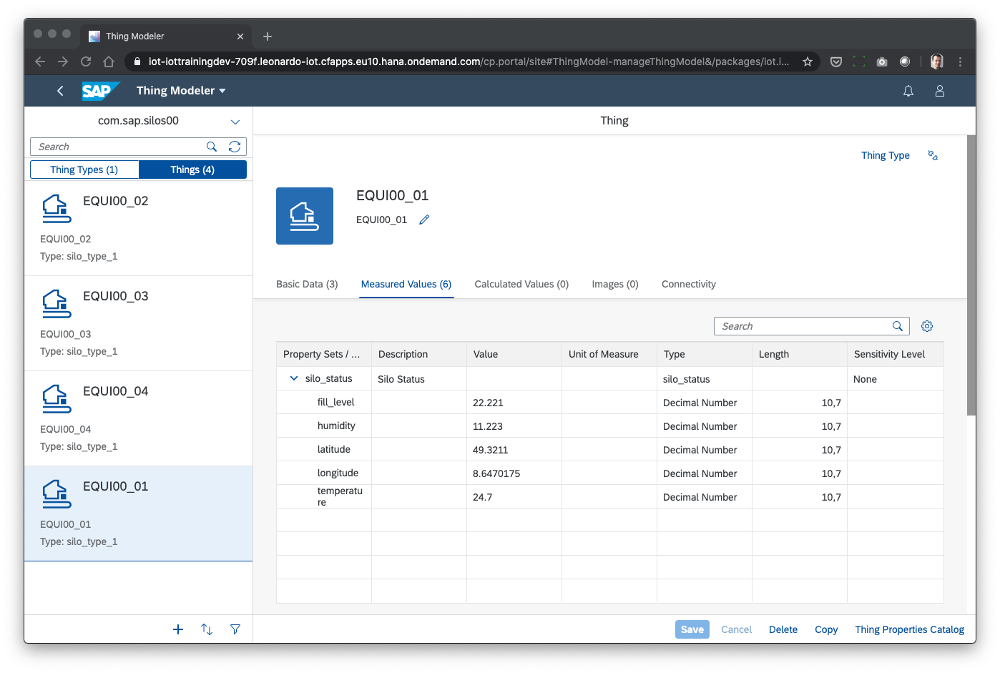

## Prerequisites
 - **Tutorials:** [Create Model for your devices in the DEV tenant](iot-model-create)

## Details
### You will learn
  - How to quickly onboard multiple devices
  - How to trigger that devices send mock data regularly

---

[ACCORDION-BEGIN [Step 1: ](Decide which devices to onboard)]

Onboarding of devices is not just something that you do one-time when establishing a data model for your IoT application. You do this continuously (and also off-boarding) during the operation of your IoT application. To make this a smooth process where you can be sure the device works but also all other systems are aware of the device automating this with scripts is essential. You will also use a script in this tutorial.

When onboarding a device and when doing this in the context of a business application you need to bring together the technical activation and the application integration into a coherent process. For example a SIM card might need to be activated or a handling unit in ERP might need to know, that there is now a tracker which is supposed to send data on the geographic position of the handling unit.

So to be able to do this one first has to collect the technical ids of the involved devices and the application ids of the involved application objects as a basis. Such a list could look like this:

```JSON
[
  {"id":"EQUI0001_01","EQUI":"EQUI0001_01","HANU":"HANU5658","IMEI":"0456456580934"},
  {"id":"EQUI0001_02","EQUI":"EQUI0001_02","HANU":"HANU4234","IMEI":"9823065469902"},
  {"id":"EQUI0001_03","EQUI":"EQUI0001_03","HANU":"HANU7458","IMEI":"0983409580934"},
  {"id":"EQUI0001_04","EQUI":"EQUI0001_04","HANU":"HANU4568","IMEI":"9823098409902"}
]
```

In above case there are 2 process application identifiers, one for equipment maintenance and one for handling units used during sales order processing. Then there is a technical id that refers to a telemetry module's IMEI number (check your mobile phone system properties for a similar IMEI number). Both the IMEI and the EQUI number could be used as the device id as both will be assigned long-term to the device - which one you use really depends on what the device is capable of using. Let's assume for now the device "knows" its equipment id. The HANU id is subject to change or might be unknown during onboarding as the silos, considered in this example, could be used as a handling unit with one id on Monday and get a different one on Tuesday assigned dynamically. So this would not be a good device id.

Now that you have figured out, which devices to onboard and what the business context is the next step is to onboard devices.

[DONE]
[ACCORDION-END]

[ACCORDION-BEGIN [Step 2: ](Onboard some example devices using a script)]

The script you can use is part of the same set of scripts used in the previous tutorial.

The folder with the scripts also contains a file `devices.json` that includes above list. Feel free to add additional devices with additional, unique ids. If the devices exist already in the tenant that you use the onboarding script will fail. To prevent this from happening you might want to change the id used for identifying the device. If you are the 2nd person using the script we suggest for you to modify the `devices.json` file to this (replace 0001 with 0002):

```JSON
[
  {"id":"EQUI0002_01","EQUI":"EQUI0002_01","HANU":"HANU5658","IMEI":"0456456580934"},
  {"id":"EQUI0002_02","EQUI":"EQUI0002_02","HANU":"HANU4234","IMEI":"9823065469902"},
  {"id":"EQUI0002_03","EQUI":"EQUI0002_03","HANU":"HANU7458","IMEI":"0983409580934"},
  {"id":"EQUI0002_04","EQUI":"EQUI0002_04","HANU":"HANU4568","IMEI":"9823098409902"}
]
```

To run the script go to your command prompt and enter the following to create a new directory for the certificates to be used for the devices.

```Shell
mkdir certificates
```

Then enter the following to start the script.

```Shell
node create-devices-and-sensors.js
```

If you see the message `Devices and a sensor created successfully.` it should have worked. If you do not see the message scroll up to get an idea what might have gone wrong. If you get an error indicating that `Alternate ID 'EQUI0001_01' already exists` then you should make sure you choose new, unique device ids based on another number (e.g. 'EQUI0002_01' with 0002 beeing the number you choose), put them in the devices.json file and run the script again.

To check the resulting devices you might want to go to the thing modeler app again, switch to the `com.sap.silo0001` package (or the package that is yours instead) at the top left corner and check that the new devices show up as expected:



You can also check the mapping of all of the measures in the last tab if you want.

[DONE]
[ACCORDION-END]


[ACCORDION-BEGIN [Step 3: ](Start ingesting some data for the devices)]
In reality, you would now configure the firmware of the devices or of an edge to route data coming from the device to the SAP IoT endpoint for MQTT data ingestion. But in lieu of having hardware handy when doing this tutorial we provided a sample script that emulates devices from your computer. It basically picks up from the list of devices you have used earlier in the current tutorial and the model you have established in the previous tutorial and it generates values and sends them via MQTT to the cloud endpoint established in your tenant.

To run the script enter:

```Shell
node create-measurements-via-ingestion.js
```

This will every minute send data to all listed devices that is changing over time. The minimum and maximum values defined in the `model.json` file are used to determine the ranges of values that are meaningful.

If you go into the thing modeler again you can see this data arriving - at least you can see the latest value:




In some tenants the ingestion takes a few minutes but the data will arrive with the timestamp used in the ingestion in the time series.

For both the measurements and the master data (e.g. handling unit id) a time series is created which means for all values you will have the value and the timestamp when this value was ingested.

You can now use batch or streaming rules to react to the incoming data across time windows or as they come in. Or you can for example use analytical applications that allow you to do dashboards or reports on the aggregation of the measured data and on the master data it relates to.

Please refer to the other tutorials with 'IoT' in their name to get up to speed on these topics.

If you remove `greenhouse.` from the file names of the provided `greenhouse.model.json` and `greenhouse.devices.json` and then run the 3 scripts again you get data that directly works with the following tutorial group: [Create a Decision Support App and Enable Notification in SAP Fiori Launchpad](group.iot-app-decision-support).

[VALIDATE_7]
[ACCORDION-END]

---
