## Prerequisites  
 - **Proficiency:** Beginner
 - **Tutorials:** [Internet of Things (IoT) Viewing your Tessel data from IoT Services](http://www.sap.com/developer/tutorials/iot-part9-hcp-services-viewdata.html)

## Next Steps
 - [Internet of Things (IoT) Viewing your Tessel data in a graph](http://www.sap.com/developer/tutorials/iot-part12-hcp-services-xsgraph.html)


## Details
### You will learn  
Now that your IoT Services are collecting data and you were able to view it your deployed Java application, now how about redirecting the data to a shared SAP HANA MDC instance and making a small SAP HANA XSC application to show the data.  


### Time to Complete
**20 Min**.

---

1. To be on the safe side go ahead and stop your `iotmms` Java application.


2. From within the cockpit now choose Databases & Schemas.

    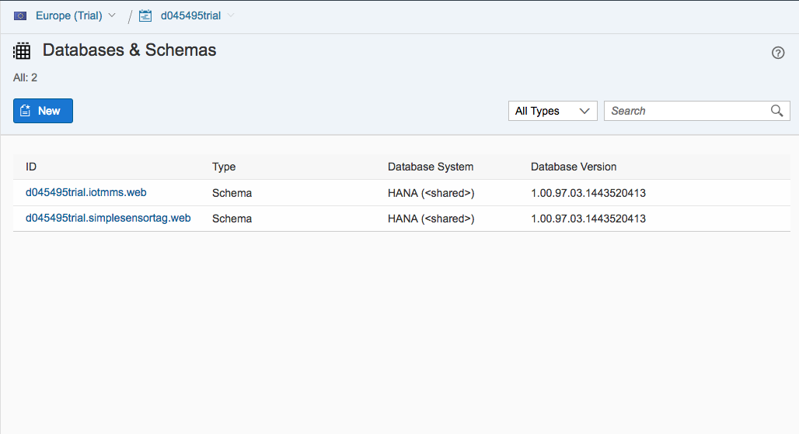

    Create a new SAP HANA MDC instance. MDC stands for Multi-database Container. Your MDC instance is your own within a shared SAP HANA system.

    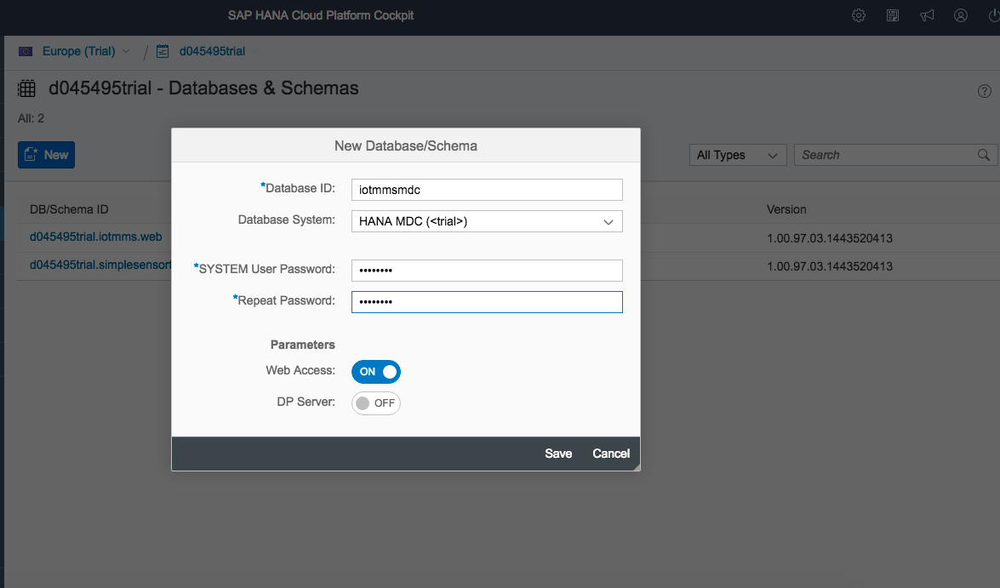

3. Once the instance has fully created you will need to follow a couple of steps to allocate your user the proper authorizations.

  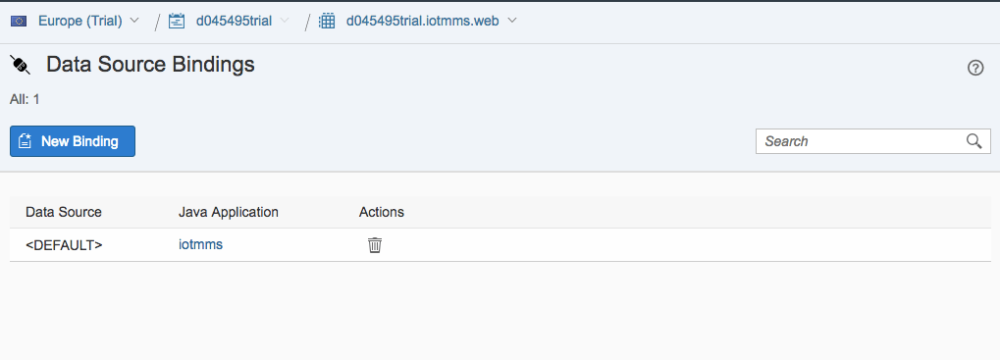

4. Now select the "SAP HANA Cockpit" link where you will receive two messages indicating a missing authorization followed by authorizations being granted.

  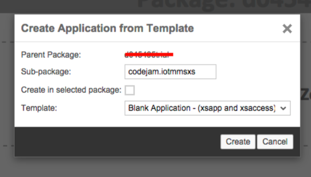
  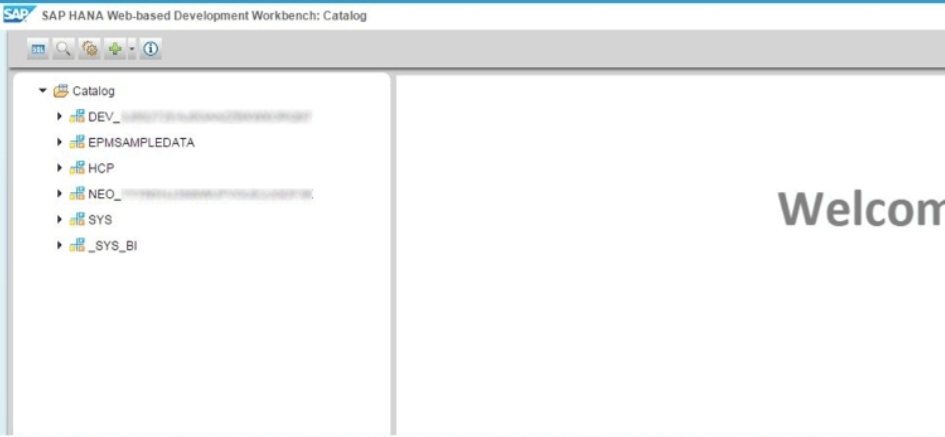

5. Now select the "Manage Users and Roles" where you will apply additional authorizations to your user or to a new user.

  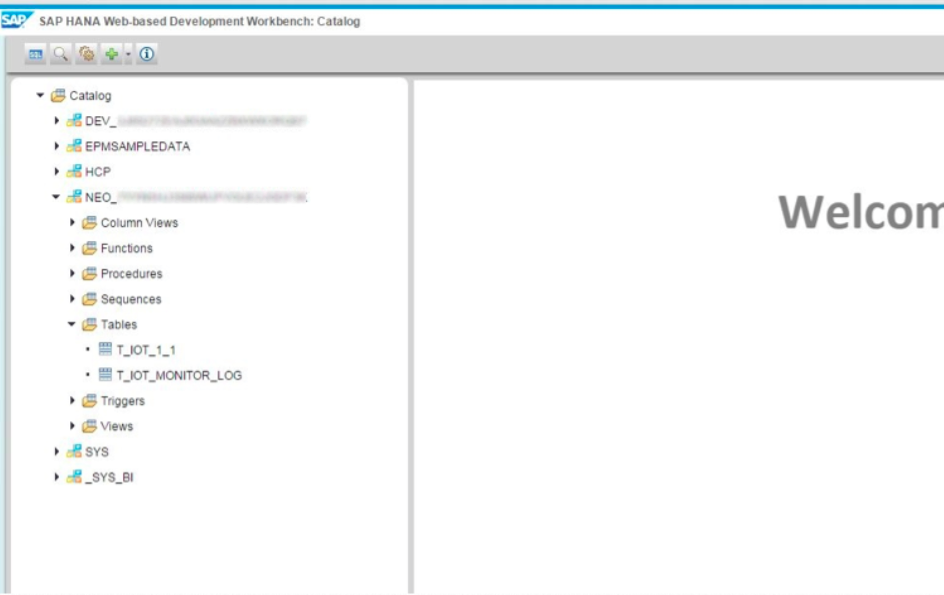

6. Once you here you will select the "SYSTEM" user or right click on the "SYSTEM" user and choose copy user first. Then under the first tab "Granted Roles" you will select the "+" symbol and search for "developer" then select each role listed and mark "OK" then again search for "admin" and do the same. Basically this gives your user "super user" access to the database. As you are currently the only one with access use it wisely.

  

7. Now return to your Java applications within the SAP Cloud Platform and choose the `iotmms` application and then the data bindings option. Delete the existing binding to `XXXXXXtrial.iotmms.web` database. Then create a  new binding to your new HANA MDC instance.

  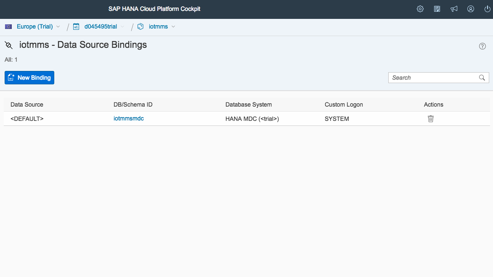

7. Now start (or restart) the `iotmms` Java application.

8. With that finished you should be able to go back to your MDC instance and select the "Catalog" under the menu options along the top of the page and see your tables now listed under "SYSTEM" schema - if not return to the IoT Services and send another test message. ([see tutorial](http://www.sap.com/developer/tutorials/iot-part7-add-device.html)). So provided you received the "200" status in your messages then you should now have data in your tables and can begin working on your XS application.

  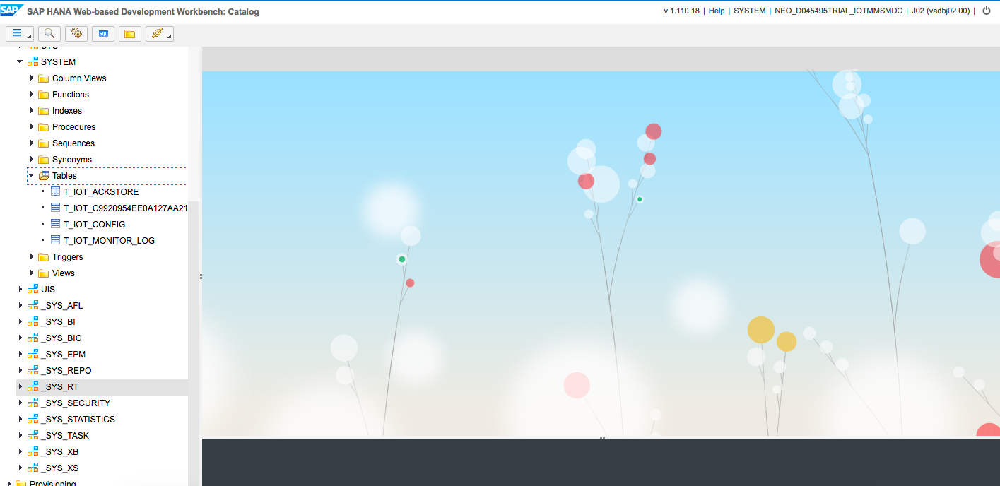

9. Your table `T_IOT_XXXXXXXXXXXXX` will be the other item you need to make note of for use in a moment.

10. Choose the "SAP HANA Web-based Development Workbench," now right click on the top level, `Content`, and choose Create Application". Choose the Empty Application" option and the "sub package" - `codejam.iotmmsxs`

  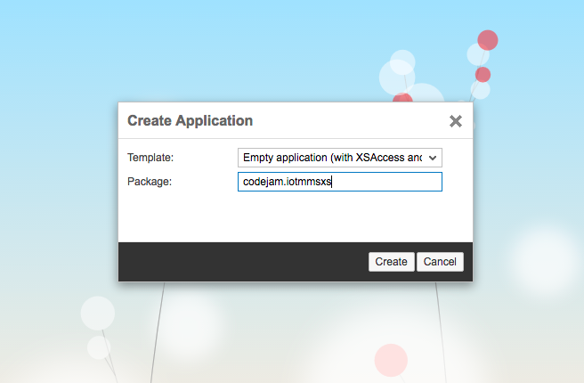

11. Now modify the `.xsaccess` file, line 13 you need to change the "true" to "false".

12. Select your sub package `iotmmsxs` and then add a new sub package called `services`. There you will add a new file called `iotservice.xsodata`.

  ```
  service {
    "SYSTEM"."T_IOT_<table_postfix>" key generate local "GEN_ID";
  }
  ```

  So this file you can open in your web browser right now and have full access to all of the built in OData functionality.

13. Now you will use the created service in the `index.html` file.

  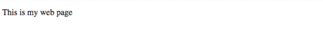

14. You will replace the existing code with the following, which is quite a bit but should be easily readable and understandable as we are adding a table to a page. This is not the only way to do but that is a matter for you to explore and discover!

    > Make sure you replace `<MESSAGE_ID>` below with the name of your table with corresponding message type table, like `T_IOT_15B1E994B520C8D65A42`

    ```html
    <!DOCTYPE HTML>
     <html>
     <head>
       <meta http-equiv="X-UA-Compatible" content="IE=edge" />
       <meta charset="UTF-8"/>
       <title>My Sensor Data</title>
       <script id='sap-ui-bootstrap'
         src='/sap/ui5/1/resources/sap-ui-core.js'
         data-sap-ui-theme='sap_goldreflection'
         data-sap-ui-libs='sap.ui.core,sap.ui.commons,sap.ui.table'>
       </script>
       <script language="JavaScript">
         var oModel = new sap.ui.model.odata.ODataModel("/codejam/iotmmsxs/services/iotservice.xsodata/", false);
         var arrayHeaders = new Array();
         oTable = new sap.ui.table.Table("test",{tableId: "tableID", visibleRowCount: 10});
         //Bring the table onto the UI
         oTable.placeAt("sensor_table");
         //Table Column Definitions
         var oMeta = oModel.getServiceMetadata();
         var oControl;
         for ( var i = 0; i < oMeta.dataServices.schema[0].entityType[0].property.length; i++) {
            var property = oMeta.dataServices.schema[0].entityType[0].property[i];
            oControl = new sap.ui.commons.TextField().bindProperty("value",property.name);
            oTable.addColumn(new sap.ui.table.Column({label:new sap.ui.commons.Label({text: property.name}), template: oControl, sortProperty: property.name, filterProperty: property.name, filterOperator: sap.ui.model.FilterOperator.EQ, flexible: true, width: "125px" }));
         }
         oTable.setModel(oModel);
         var sort1 = new sap.ui.model.Sorter("C_TIMESTAMP");
         //Replace <MESSAGE_ID> below with the name of your table with corresponding message type table, like T_IOT_15B1E994B520C8D65A42
         oTable.bindRows("/<MESSAGE_ID>",sort1);
       </script>
     </head>
     <body>
          <div id="sensor_table"/>
     </body>
     </html>
    ```

  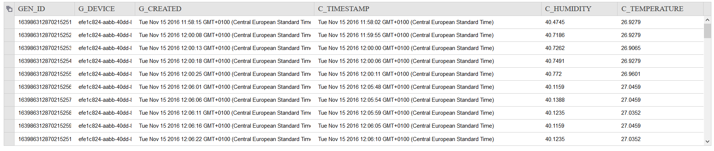


## Next Steps
 - [Internet of Things (IoT) Viewing your Tessel data in a graph](http://www.sap.com/developer/tutorials/iot-part12-hcp-services-xsgraph.html)
