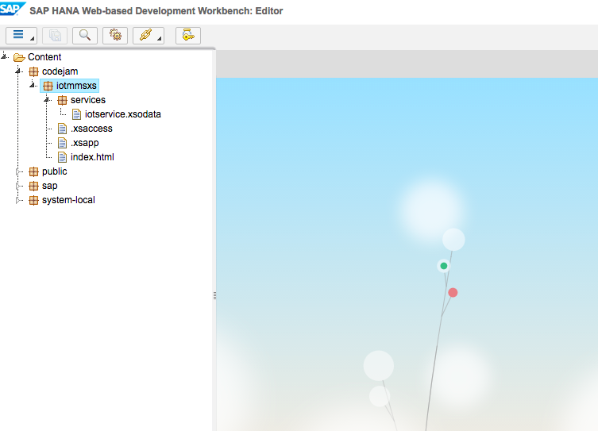
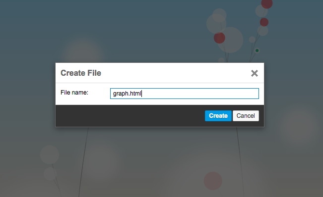
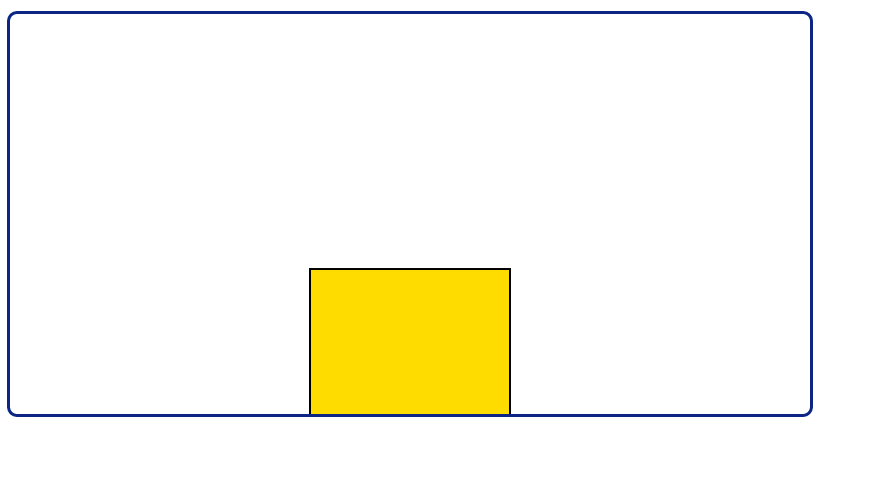

## Prerequisites  
 - **Proficiency:** Beginner
 - **Tutorials:** [Internet of Things (IoT) Viewing your Tessel data in a SAP HANA XS application](http://www.sap.com/developer/tutorials/iot-part10-hcp-services-hanaxs.html)

## Next Steps
 - Select a tutorial from the [Tutorial Navigator](http://www.sap.com/developer/tutorial-navigator.html) or the [Tutorial Catalog](http://www.sap.com/developer/tutorials.html)


## Details
### You will learn  
Now that you have a basic application and service created you can now do a bit more dynamic displaying of the your data.  


### Time to Complete
**10 Min**.

---

1. Return to the "SAP HANA Web-based Development Workbench" and go to the "sub package" - `codejam.iotmmsxs`

  

  

2. Right click and create a new file called `graph.html`. You will use the following code to display your data now in a graph as opposed to the table from the previous tutorial. There are a ton of open source and other libraries out there for creating graphs, below is a simple use of the canvas tag.

    ```html
    <!DOCTYPE html>
    <html>
    <head>
    <meta http-equiv="X-UA-Compatible" content="IE=edge" />
    <meta http-equiv="Content-Type" content="text/html;charset=UTF-8" />
    <meta name="apple-mobile-web-app-capable" content="yes" />
    <meta name="viewport" content="width=device-width,initial-scale=1">
    <script id='sap-ui-bootstrap'
       src='/sap/ui5/1/resources/sap-ui-core.js'
       data-sap-ui-theme='sap_goldreflection'
       data-sap-ui-libs='sap.ui.core,sap.ui.commons,sap.ui.table'>
       </script>
       <style>
        .canvas {
          margin:5px;
          border-radius: 10px;
          border:3px solid #003283;
        }
    </style>
    </head>
    <body>
    <canvas class="canvas" id="myCanvas" width="800" height="400"></canvas>

    <script>
        var canvas = document.getElementById('myCanvas');
        var context = canvas.getContext('2d');

        context.beginPath();
        context.rect(300, 400-1, 200, 1);
        context.fillStyle = 'gold';
        context.fill();
        context.lineWidth = 2;
        context.stroke();

        setInterval(function() {
            // Do something every 1 seconds
            getLatestValue();
        }, 1000);

        function getLatestValue(){
            var aData;
        $.ajax({
          type: "GET",
          url: "/codejam/iotmmsxs/services/iotservice.xsodata/T_IOT_15B1E994B520C8D65A42?$format=json&$orderby=C_TIMESTAMP desc&$top=1",
          dataType: 'json',
          async: false,
          success: function (data, status){
            aData = data.d.results[0]['C_TEMPERATURE'];
          }
        });
        console.log("Called for data");
        redraw(aData);
        }

        function redraw(aData){
            // clear the canvas
            context.clearRect(0,0,canvas.width,canvas.height);

            // redraw one or more things based on their javascript objects
            context.beginPath();
            context.rect(300, 400-aData*10, 200, aData*10);
            context.fillStyle = 'gold';
            context.fill();
            context.lineWidth = 2;
            context.stroke();
            context.closePath();
            context.font="40px Georgia";
            context.strokeText(aData+'C',10,50);
        }
    </script>
    </body>
    </html>
    ```

    

## Next Steps
 - Select a tutorial from the [Tutorial Navigator](http://www.sap.com/developer/tutorial-navigator.html) or the [Tutorial Catalog](http://www.sap.com/developer/tutorials.html)
