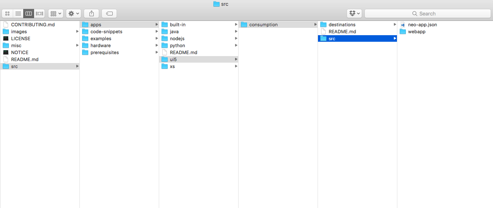
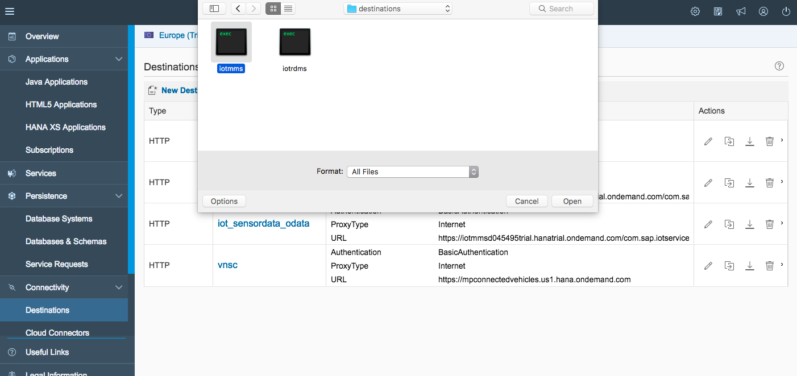
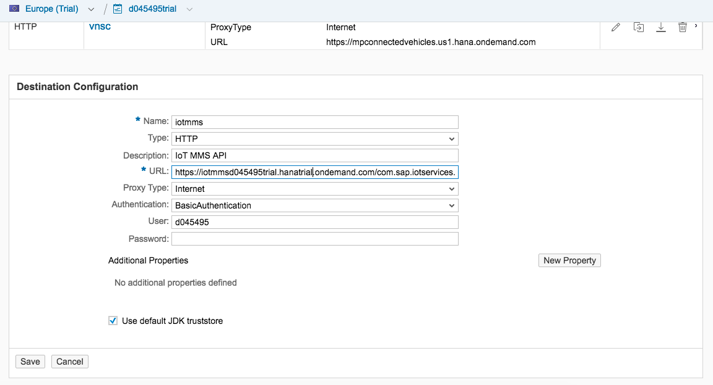
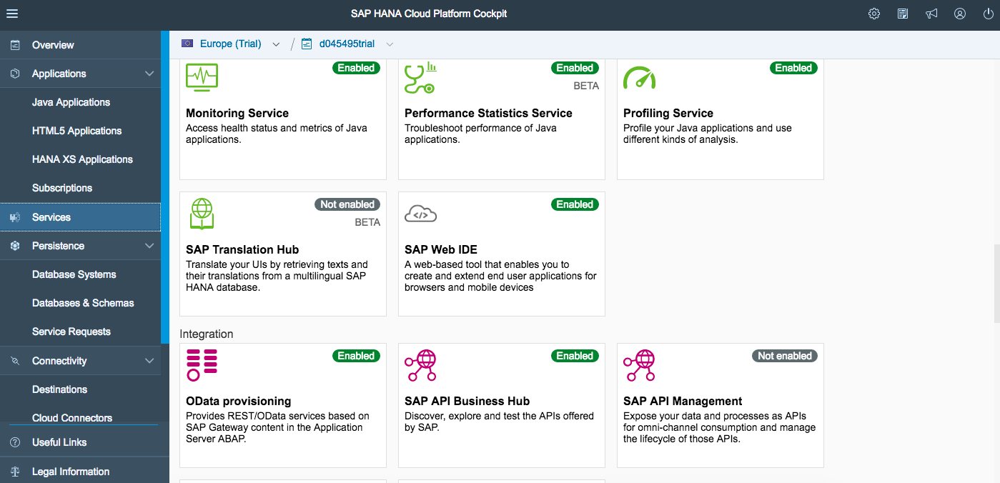
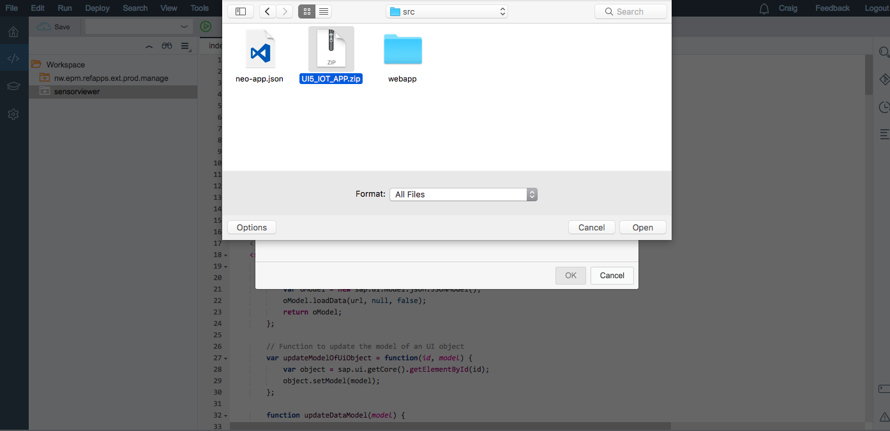
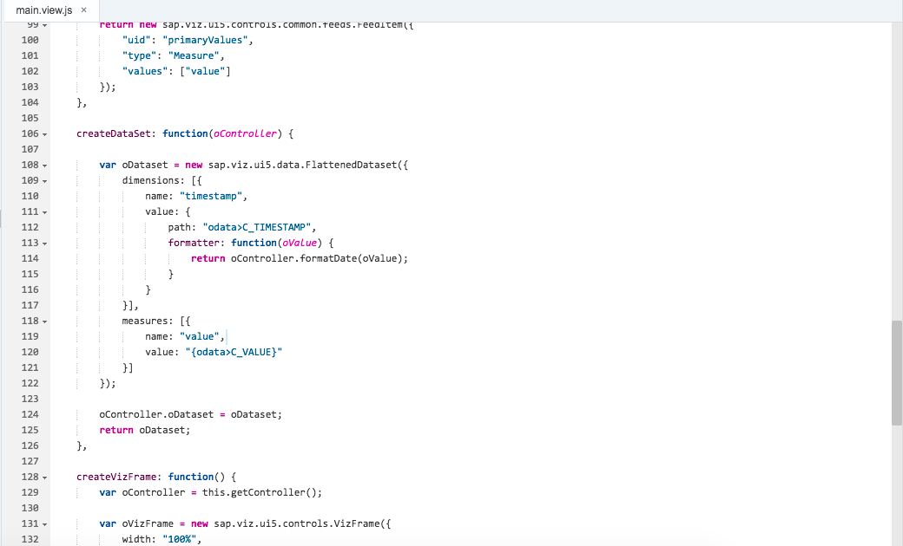
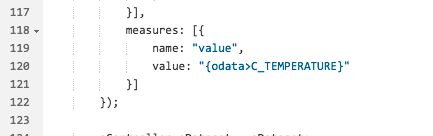
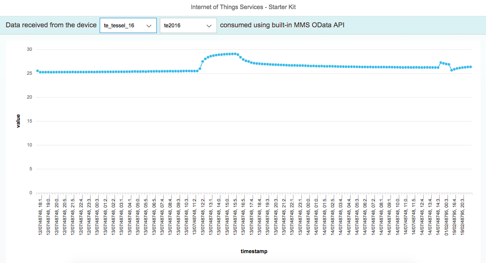

## Prerequisites  
 - **Proficiency:** Beginner
 - **Tutorials:**  [Internet of Things (IoT) Connecting your Tessel to IoT Services](http://www.sap.com/developer/tutorials/iot-part8-hcp-services-tessel.html)

## Next Steps
 - [Internet of Things (IoT) Connecting IoT Services to SAP HANA XS](http://www.sap.com/developer/tutorials/iot-part10-hcp-services-hanaxs.html)


## Details
### You will learn  
Now that you have data stored in the system its time to display that data within an application. To do that you need to create a new application that can interface with data service and display the data our device has been generating. What you will find next are the steps necessary to do just that. You will need basic knowledge in using GitHub.


### Time to Complete
**10 Min**.

---

1. Go to [IoT Starter Kit](https://github.com/SAP/iot-starterkit). Choose either to download the ZIP file. 

    

2. Unpack the archive and navigate to the folder `iot-starterkit-master > src > apps > ui5 > consumption > src` here you will find a file `neo-app.json` and a folder `webapp` you will need to compress or pack these two items into a new archive file (`ZIP`).

    

3. Now in the HCP Cockpit select "Connectivity" in the left sidebar menu and now choose the Destinations. Then click on "Import From File", and through your directory structure to the folder `iot-starterkit-master > src > apps > ui5 > consumption > destinations` and select the file `iotmms`.

	 

4. Be sure to replace `%account_id%` with your Account ID e.g `d045495trial`. As well as `%User_id%` with your user User ID e.g `d045495`, enter your password and then save. Then repeat with the file `iotrdms`

	 
5. Now under the "Services" section in the sidebar menu and choose the "SAP Web IDE"

	 

6. Next import a new project from your local file system, this will be the new archive you created. Then select the path.

	 
	 
7. Open the `	main.view.js` file and you will need to modify the name of the OData field to match that of your Message Type. In the case of the climate example that would be changing line 120 to `value: "{odata>C_TEMPERATURE}"` instead of the `value: "{odata>C_VALUE}"`

	 
	 
	 

8. Open the `index.html` file and you can launch it as is.
	 

9. You can now use your expertise with SAPUI5 and start making modifications. Such as the following lines (158 to 164) controlling the `y axis`.

	```
				yAxis: new sap.viz.ui5.types.Axis({
				scale: new sap.viz.ui5.types.Axis_scale({
					fixedRange: false,
					minValue: 20,
					maxValue: 40
				})
			}),
	```

## Next Steps
 - [Internet of Things (IoT) Connecting IoT Services to SAP HANA XS](http://www.sap.com/developer/tutorials/iot-part10-hcp-services-hanaxs.html)
