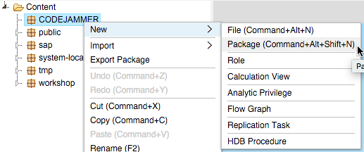
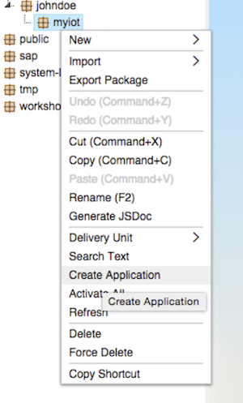
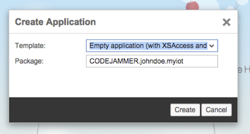
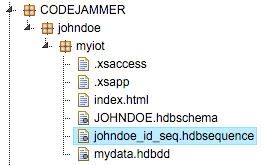
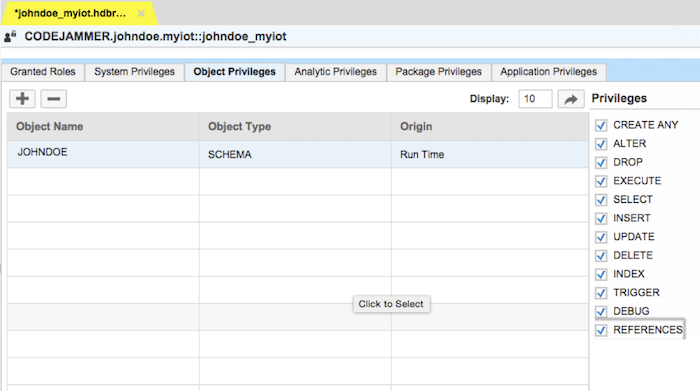
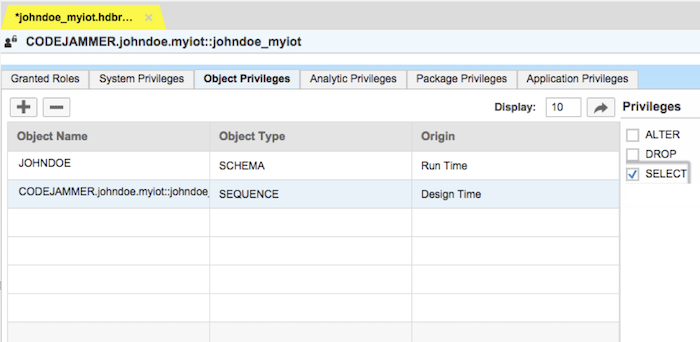
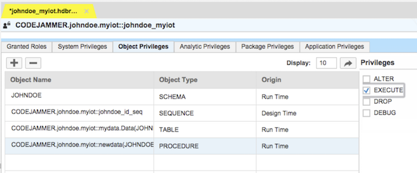
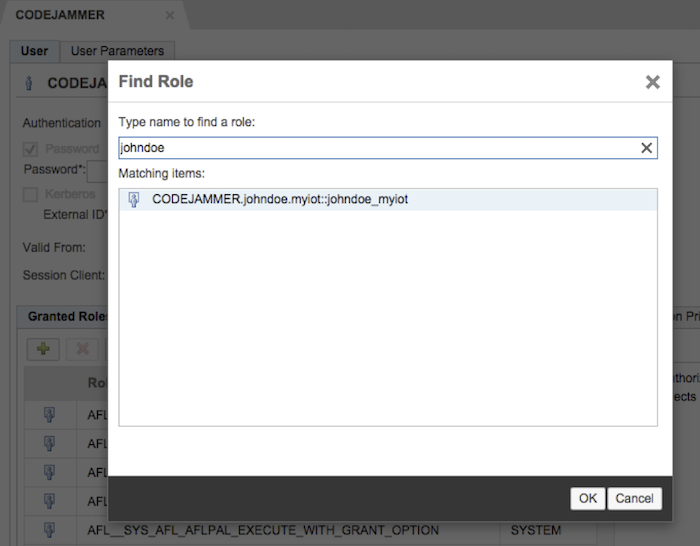

## Prerequisites  
- **Proficiency:** Beginner
- **Tutorials:** [Internet of Things (IoT) Setup the Tessel](http://www.sap.com/developer/how-tos/2016/09/iot-tessel.html)


## Next Steps
- [Internet of Things (IoT) Posting data with a REST Client](http://www.sap.com/developer/tutorials/iot-part3-posting-data-hana.html)

## Details
### You will learn  

You are now going to build a simple and quick SAP HANA XS application, if you already have experience doing this feel free to jump ahead as you feel fit.

SAP HANA XS are extended services applications based on JavaScript, HTML and CSS, as you well as several built in features such as OData within the SAP HANA environment.

### Time to Complete
**< 5 Min**.

---

[ACCORDION-BEGIN [Step 1: ](Log into server)]

Login to the server provided during this event or to your own SAP HANA server and go to the SAP HANA Web Based Development Workbench

`http://xx.xx.xx.xx/sap/hana/xs/ide/editor`

Your login is: user name `CODEJAMMER` and `CodeJam2015` (or whichever username and password you have been given to login with)


[ACCORDION-END]

[ACCORDION-BEGIN [Step 2: ](Create new package)]

Once you have your editor loaded you will need to create a package name under the **CODEJAMMER** package with your name. This is done by right clicking on the **CODEJAMMER** package and choosing **New > Package** and then entering your name. If the **CODEJAMMER** package does not exist then simply create a new package under the **root** package which is simply the "Content" folder.




[ACCORDION-END]

[ACCORDION-BEGIN [Step 3: ](Create another new package)]

Then under your new package you will want to create another new package called `myiot`. This will be the package that you place all of our XS code under for our application.


[ACCORDION-END]

[ACCORDION-BEGIN [Step 4: ](Create application)]

Now you will need to right-click on your `myiot` package and choose **Create Application**.




[ACCORDION-END]

[ACCORDION-BEGIN [Step 5: ](Accept defaults)]

Accept the default values, and an empty application with the basic `.xsapp` and `.xsaccess` files you need will be created.



[ACCORDION-END]

[ACCORDION-BEGIN [Step 6: ](Add data objects)]

Now that you have the basic application you will add in some data objects so you can store data from your devices. The first object you need will be a schema file. Select your `myiot` package, right-click and choose **New > File**. Use something simple like your name (in all caps) for the first part of the file name. In this example, `JOHNDOE` was used.

Name the file: `YOURNAME.hdbschema`

>Be sure to use all capital letters for the schema filename




[ACCORDION-END]

[ACCORDION-BEGIN [Step 7: ](Add content)]

Enter the following content into your `.hdbschema` file, replacing `JOHNDOE` with your name.

>Ensure you use all capital letters for the schema name

```
schema_name="JOHNDOE";
```




[ACCORDION-END]

[ACCORDION-BEGIN [Step 8: ](Create table definition file)]

The the next file you need to create is a table definition file. Right-click on your `myiot` package, select **New > File** and name the file `mydata.hdbdd`. This file will define the table and data types that you will use to store the data as well as access it later.


[ACCORDION-END]

[ACCORDION-BEGIN [Step 9: ](Add content)]

Enter the following content in your `mydata.hdbdd` file, and replace instances of `johndoe` and `JOHNDOE` with the name you used.

```
namespace CODEJAMMER.johndoe.myiot;

@Schema: 'JOHNDOE'
context mydata {
type SDate : UTCTimestamp;
type tt_error {
 HTTP_STATUS_CODE: Integer;
 ERROR_MESSAGE: String(100);
 DETAIL: String(200);
};
type tt_details {
 ID: Integer;
TIMESTAMP: SDate;
TEMPERATURE: Decimal(9,5);
HUMIDITY: Double;
BRIGHTNESS: Double;
};

@Catalog.tableType : #COLUMN
Entity Data {
key ID: Integer;
TIMESTAMP: SDate;
TEMPERATURE: Decimal(9,5);
HUMIDITY: Double;
BRIGHTNESS: Double;
};

};  
```


[ACCORDION-END]

[ACCORDION-BEGIN [Step 10: ](Create stored procedure)]

Once table definition file is saved it will activate and create your table. You will now need to create a stored procedure and an OData service file. The OData service file will allow you to access any data and set the connection to the stored procedure for enabling the insertion of new data into the table.


[ACCORDION-END]

[ACCORDION-BEGIN [Step 11: ](Create a sequence)]

To create a sequence (an incrementing number for the ID field in your table), right-click on your `myiot` package, select **New > File** and name the file `johndoe_id_seq.hdbsequence`.

You will notice the use of the "name" in these examples it is "JOHNDOE" so be sure to make the appropriate changes.



[ACCORDION-END]

[ACCORDION-BEGIN [Step 12: ](Add content)]

Enter the following content in your `.hdbsequence` file, and replace instances of `johndoe` and `JOHNDOE` with the name you used.

```
schema="JOHNDOE";
start_with=100;
minvalue=1;
cycles=false;
depends_on_table="CODEJAMMER.johndoe.myiot::mydata.Data";
```


[ACCORDION-END]

[ACCORDION-BEGIN [Step 13: ](Create stored procedure to insert new data)]

Now that you have your table and incrementing ID field you need to create the stored procedure that will insert new data into the table. Follow the same procedure as above to add new file to your `myiot` package and name it: `newdata.hdbprocedure`


[ACCORDION-END]

[ACCORDION-BEGIN [Step 14: ](Enter content)]

Enter the following content in your `.hdbprocedure` file, and replace instances of `johndoe` and `JOHNDOE` with the name you used.

```
PROCEDURE "JOHNDOE"."CODEJAMMER.johndoe.myiot::newdata" (
IN row JOHNDOE."CODEJAMMER.johndoe.myiot::mydata.tt_details",
OUT error JOHNDOE."CODEJAMMER.johndoe.myiot::mydata.tt_error" )  
LANGUAGE SQLSCRIPT
SQL SECURITY INVOKER
DEFAULT SCHEMA JOHNDOE
AS
BEGIN
/*****************************
Write your procedure logic
*****************************/

declare lv_temperature string;
declare lv_humidity string;
declare lv_bright string;
select TEMPERATURE, HUMIDITY, BRIGHTNESS into lv_temperature, lv_humidity, lv_bright  from :row;

if :lv_temperature = ' ' then
error = select 400 as http_status_code,
'invalid date' as error_message,
  'Invalid response from sensor' as detail from dummy;
else
insert into "CODEJAMMER.johndoe.myiot::mydata.Data" values ("CODEJAMMER.johndoe.myiot::johndoe_id_seq".NEXTVAL, now(), CAST(lv_temperature AS decimal(9,5)), CAST(lv_humidity AS double), CAST(lv_bright AS double) );

end if;

END;
```
This code will use the "types" you defined in the table definition and then do an insert to the table with the "value" passed to it.


[ACCORDION-END]

[ACCORDION-BEGIN [Step 15: ](Create an OData service)]

In order to activate or utilize this new procedure you will need to create an OData service. To do so, create another new file in your `myiot` package called `mydata.xsodata`.


[ACCORDION-END]

[ACCORDION-BEGIN [Step 16: ](Add content)]

Enter the following content in your `.xsodata` file, and make the appropriate name changes. This file will provide us the ability to read data but also insert data into our table.

```
service namespace "CODEJAMMER.johndoe.myiot" {
"JOHNDOE"."CODEJAMMER.johndoe.myiot::mydata.Data" as "HISTORY";
"JOHNDOE"."CODEJAMMER.johndoe.myiot::mydata.Data" as "DATA"
create using "CODEJAMMER.johndoe.myiot::newdata";
}
```


[ACCORDION-END]

[ACCORDION-BEGIN [Step 17: ](Create a role)]

Your service enabled table is almost ready for use. You also need to give some authorizations and to do this you will create a "ROLE". Right-click on your `myiot` package and select **New > Role**. Enter `johndoe_myiot` for the role name (modify the name accordingly) and click **Create**.


[ACCORDION-END]

[ACCORDION-BEGIN [Step 18: ](Add your name)]

Once created, click on **Object Privileges**, then the **+** sign. Enter your name (**JOHNDOE** used here) and a schema and sequence Object Type should appear in the Matching Items list.


[ACCORDION-END]

[ACCORDION-BEGIN [Step 19: ](Add the role)]

Select the schema item then click OK to add it to the role.


[ACCORDION-END]

[ACCORDION-BEGIN [Step 20: ](Select all privileges)]

Once the schema is added, select all the checkboxes under **Privileges** (on the right hand side).


[ACCORDION-END]

[ACCORDION-BEGIN [Step 21: ](Enter your name)]

Click the **+** sign again, enter your name again, select the sequence item and click **OK**. Once added, mark the SELECT checkbox under **Privileges**.

You will need to add your schema, table, sequence and procedure to this and then save.








[ACCORDION-END]

[ACCORDION-BEGIN [Step 22: ](Apply role to user)]

Now that you have a role defined you need to apply that role to your user. Be sure to SAVE the role before continuing! To apply the role to your user, click the small **link** icon in the editor and choose **Security**. When the page updates, unroll the **Users** hierarchy, and select **CODEJAMMER** (or which ever user you were given for this server).


[ACCORDION-END]

[ACCORDION-BEGIN [Step 23: ](Select your role)]

Click the **+** symbol under the **Granted Roles** tab and search for the role you created (e.g. `johndoe`). Select your role, click **OK** and **Save**.



Now it's time to test...


[ACCORDION-END]


## Next Steps
- [Internet of Things (IoT) Posting data with a REST Client](http://www.sap.com/developer/tutorials/iot-part3-posting-data-hana.html)
