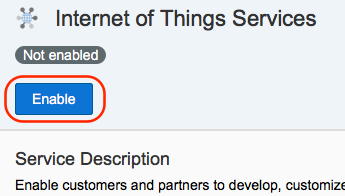
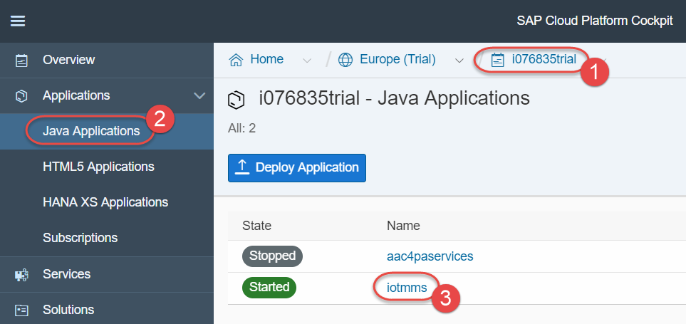
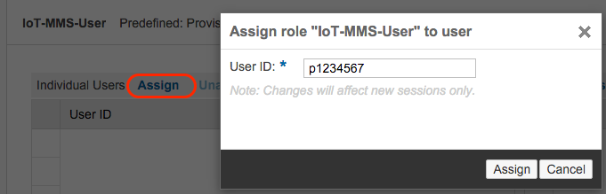

## Prerequisites  
- **Proficiency:** Beginner
- **Tutorials:** [Internet of Things (IoT) Setup the Tessel](http://www.sap.com/developer/how-tos/2016/09/iot-tessel.html)

## Next Steps
- [Internet of Things (IoT) Adding a new device to the IoT Services](http://www.sap.com/developer/tutorials/iot-part7-add-device.html)

## Details
### You will learn

This tutorial will detail the steps needed to simply the process of connecting your hardware device to SAP.

SAP's IoT Services provide a robust and secure way of connecting your device as well as simplified way of specifying your data structures and changing those structures.

This procedure assumes you are using the trial account of the SAP Cloud Platform, but you can use a production account if you have one.

### Time to Complete
**15 Min**.

---

[ACCORDION-BEGIN [Step 1: ](Register or log into SAP Cloud Platform trial)]

Go to the [SAP Cloud Platform trial edition](https://account.hanatrial.ondemand.com/cockpit) log in (or sign up if you don't have an account yet).

[DONE]
[ACCORDION-END]

[ACCORDION-BEGIN [Step 2: ](Open Internet of Things Services)]

Once you log in, click on **Services** in the left-hand navigation bar, scroll down to find **Internet of Things** tile and click on it.

[DONE]
[ACCORDION-END]

[ACCORDION-BEGIN [Step 3: ](Enable IoT the service)]

Click on the **Enable** button. After a few seconds the page will update and show **Enabled**.

[DONE]
[ACCORDION-END]

[ACCORDION-BEGIN [Step 4: ](Open the service)]

Once the service is enabled click the **Go to Service** link and a new browser tab will open.

[DONE]
[ACCORDION-END]

[ACCORDION-BEGIN [Step 5: ](Configure Message Management Service)]

With IoT Services enabled, you can begin the steps necessary to configure your device's digital twin and to enable message communication.

The first step will be to configure and deploy the Message Management Service (MMS). Click on the **Deploy Message Management Service** tile.

[DONE]
[ACCORDION-END]

[ACCORDION-BEGIN [Step 6: ](Enter user name and password)]

Enter in your information in the fields, where your account ID is your p-number (or s-number if you are SAP's customer or partner, or i-/d-number if you are SAP employee) with the world "trial" (no space between the p-number and trial) and your user name is just your p-number.

[DONE]
[ACCORDION-END]

[ACCORDION-BEGIN [Step 7: ](Go to IoT MMS application dashboard)]

Once successfully deployed then Java application `iotmms` is started in your account.

Return to the SAP Cloud Platform cockpit view and click on **Java Applications** in the left navigation bar. You will see the new `iotmms` application you just deployed. Click on the `iotmms` link to display the **IoT MMS dashboard**.

[DONE]
[ACCORDION-END]

[ACCORDION-BEGIN [Step 8: ](Assign role)]

With the **IoT MMS dashboard** displayed click on the Roles link in the left navigation bar. Select the **IoT-MMS-User** (click the empty cell next to the Name to select the row if it is not highlighted in blue).

Then under **Individual Users**, click **Assign** and enter your SAP Cloud Platform user ID (e.g. your p-number without the word "trial" on the end).

Once user is assigned to the role, stop and start `iotmms` application.

[DONE]
[ACCORDION-END]

## Next Steps
- [Internet of Things (IoT) Adding a new device to the IoT Services](http://www.sap.com/developer/tutorials/iot-part7-add-device.html)
