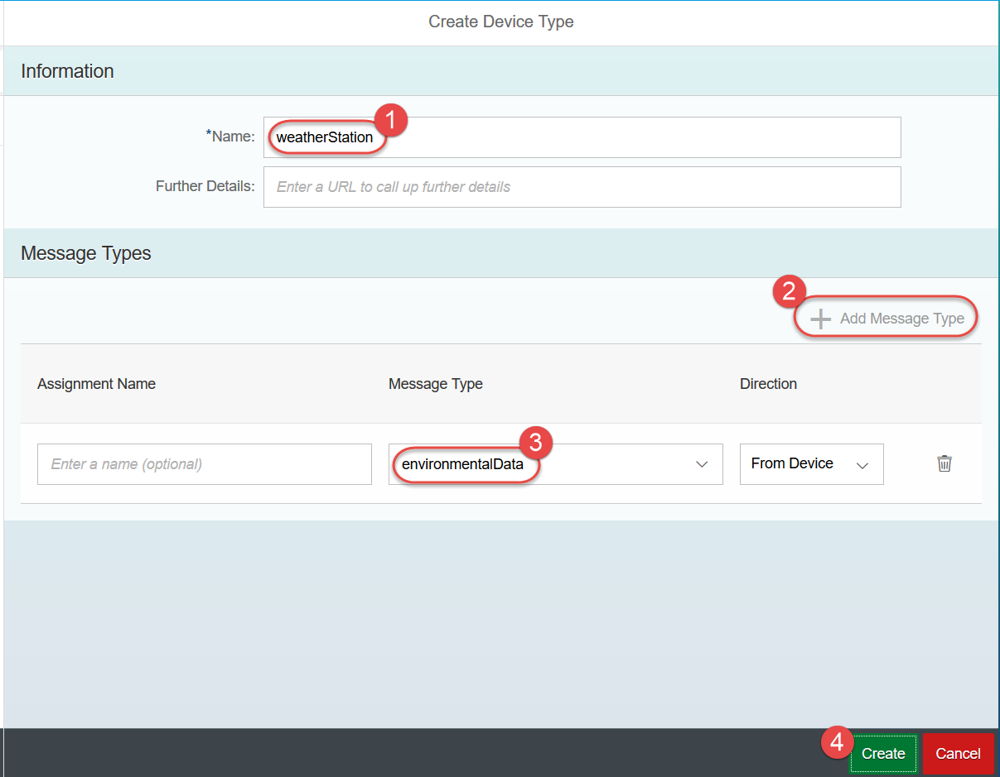
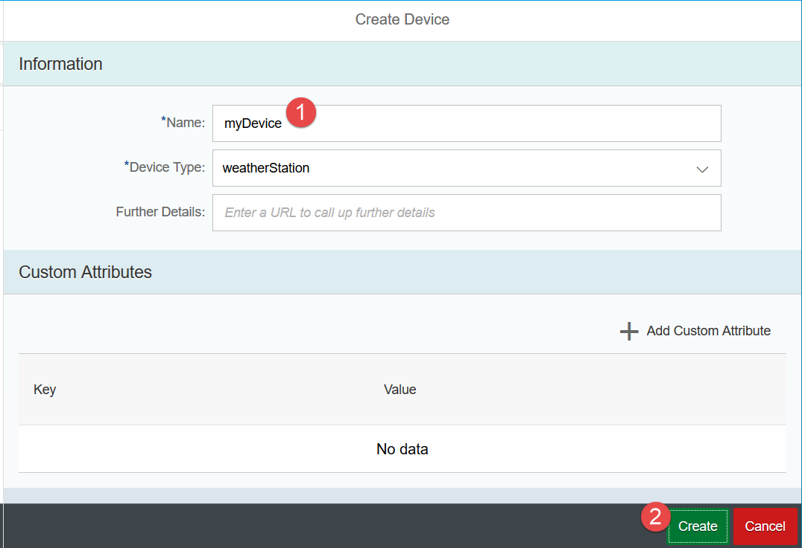
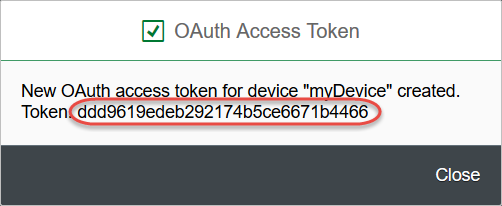
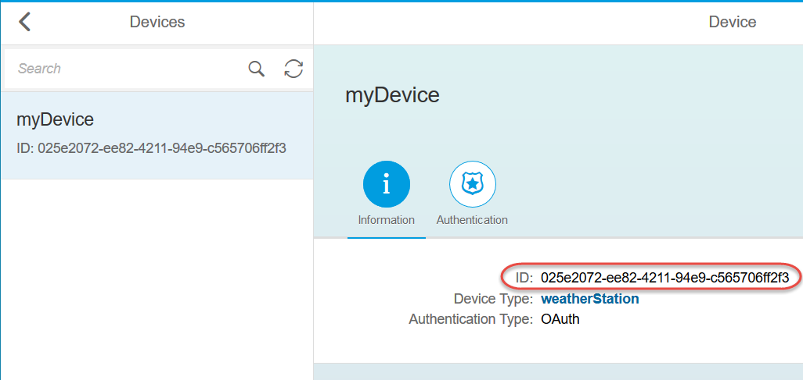
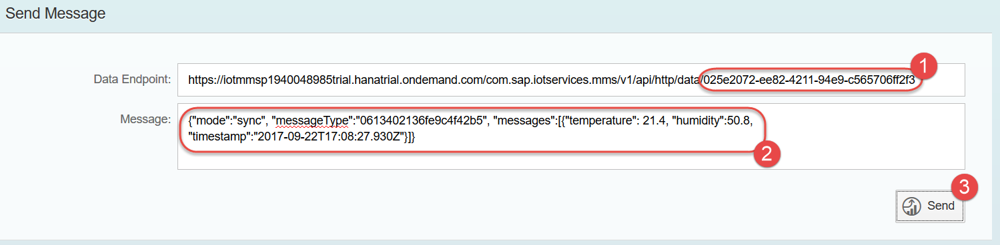
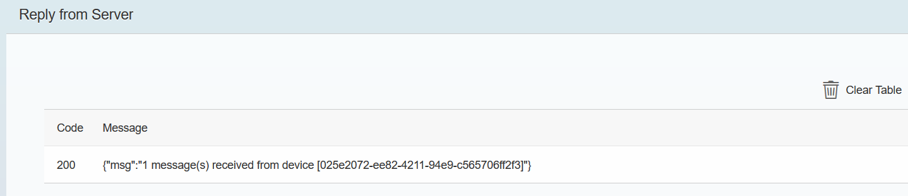
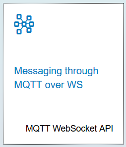
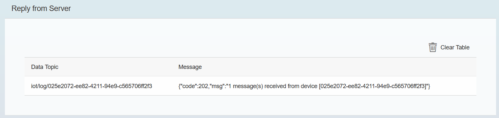
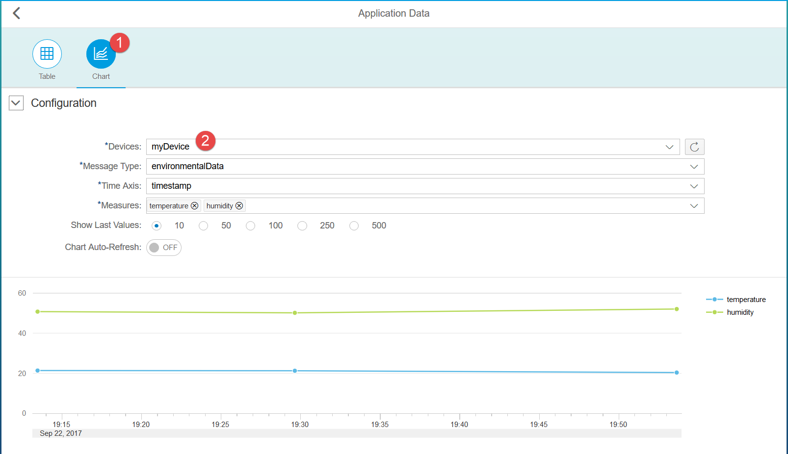

## Prerequisites  
- **Proficiency:** Beginner
- **Tutorials:** [SAP Cloud Platform IoT for Neo: Enable and configure](https://www.sap.com/developer/tutorials/iot-part6-hcp-services.html)


## Next Steps
- [SAP Cloud Platform IoT for Neo: Sending messages from Tessel1 device](https://www.sap.com/developer/tutorials/iot-part8-hcp-services-tessel.html)
- [SAP Cloud Platform IoT for Neo: Sending messages from TI SensorTag device](https://www.sap.com/developer/tutorials/iot-part11-hcp-services-ti.html)

## Details
### You will learn  
With the MMS service now deployed to SAP Cloud Platform for Neo environment, and your user assigned the appropriate role it's time for to configure your virtual device(s) so real devices can send sensors data to them.

### Time to Complete
**10 Min**.

---


[ACCORDION-BEGIN [Step 1: ](Open Message Management Service Cockpit)]

From the [SAP Cloud Platform account dashboard](https://account.hanatrial.ondemand.com/cockpit), select **Applications**, then **Java Applications**, then select the `iotmms` application. The application should have the state `Started` for you to proceed further with the tutorial.

Open the **Message Management Service Cockpit** by clicking on the **Application URL**.


[ACCORDION-END]

[ACCORDION-BEGIN [Step 2: ](Open IoT Service Cockpit)]

Click on the **View registered devices and device types** tile to open the **IoT Service Cockpit**.

>You will use this page frequently, so it is worth bookmarking it.


[ACCORDION-END]

[ACCORDION-BEGIN [Step 3: ](Create a message type for environmental data)]

Click the **Message Types** tile, then the **+** symbol at the bottom of the list to add a new message type and to define the structure of the data you will collect.

In the **Information** section, enter a name "`environmentalData`".


In the **Fields** section, click the **+ Add Field** button to add in two more fields, then enter the following for name and data types.

> Note: Be sure to follow the names and capitalization specified below.

Name            | Type
--------------- | -------------
`timestamp`     | `date`
`temperature`   | `double`
`humidity`      | `double`

Click the **Create** button (bottom right corner) when complete. When the message type is created, copy the **ID** string. You will need it later.


[ACCORDION-END]

[ACCORDION-BEGIN [Step 4: ](Create a device type for weather stations)]

Click the `<` ("back arrow") again to return the the IoT Service Cockpit. Click on **Device Types**, then the **+** symbol to create a new device. Give it a simple name that makes sense for what you are doing, like "`weatherStation`".

Now click the  **+ Add Message Type** to attach your previously created message type "`climateData`". Make sure the **Direction** is "From Device".



 Click **Create**.


The `OAuth Token` can be used later on for self-registration of new physical devices. But for now you will create a virtual device manually.

[ACCORDION-END]

[ACCORDION-BEGIN [Step 5: ](Create a virtual device)]

Click the `<` ("back arrow") icon and click on **Devices** tile.

Click `+` to add a new device, name it `myDevice` and make sure its device type is `weatherStation`. No other fields need to be populated at this step.

> This is extremely important, once you click **Create** a pop-up will appear that will display the **OAuth access token** for this new device. Copy that and save it somewhere, as you will need it soon.  Should you lose it, click into the **Authorization** tab and generate a new token.



When the OAuth Access Token is displayed, copy the token ID and save it. Click **Close**.



Now copy and save the **Device ID** string.



By now you should have collected IDs for:
- message type,
- device,
- device's authorization token.

[ACCORDION-END]

[ACCORDION-BEGIN [Step 6: ](Test the configuration using HTTP API built-in client)]

With the device type, message type and device configured, it is time to test sending some sensors data.

First you will do it using built-in client. Go to the **IoT Service Cockpit** and click the **Send and view messages...** tile to open **Message Management Service Cockpit**.


There are different protocols available to send messages with sensor data to the SAP Cloud Platform IoT Service for Neo environment. For now you will use HTTP REST protocol.

Click the **Messaging through HTTP** tile in **Data Services** group.


On the **HTTP API** page, you will have a client to **Send Message** with an **Data Endpoint** like this:

`https://iotmmsYOURUSERtrial.hanatrial.ondemand.com/com.sap.iotservices.mms/v1/api/http/data/d000-e000-v000-i000-c000-e001`

Change `d000-e000-v000-i000-c000-e001` to your device's ID you copied above. Note: It is the device ID, not its authorization token.

Example: `https://iotmmsp1234567trial.hanatrial.ondemand.com/com.sap.iotservices.mms/v1/api/http/data/025e2072-ee82-4211-94e9-c565706ff2f3`

You will next formulate your HTTP POST payload. Since you are sending it as a JSON format, numbers (`float`, `int`, `double`, etc) are not placed in double quotes, while strings and the Key of the Key/Value pair are in quotes.

Under **Message to post** replace the existing content with the following which matches the message type your used earlier.

```json
{"mode":"sync", "messageType":"m0t0y0p0e1", "messages":[{"temperature": 21.5, "humidity":50.7, "timestamp":"2017-09-22T17:07:37.930Z"}]}
```

> NOTE - the `messageType` value `"m0t0y0p0e1"` must be changed to match your `message type ID`.

> The date format is a combined date and time representation in ISO 8601 format. It is in UTC (Coordinated Universal Time) as indicated by a `Z` directly after the time without a space.



Click the **Send** button. If everything goes OK, you should see a response code of `200` similar to this screen shot or response code `202` when you post for the very first time.



You receive response code `202` when your request was not immediately processed, but instead was placed in a processing queue. You should copy returned HTTP endpoint into **Receive acknowledgments** field and click **Send** to receive the status of your queued request.

Response codes `4xx` or `5xx` indicate that post request has failed.


[ACCORDION-END]

[ACCORDION-BEGIN [Step 7: ](Display received messages)]

To verify that the posting worked, switch back **IoT Service Cockpit**, click **Send and view messages, or perform other actions** tile, then click the **Display stored messages** tile.

Find table `T_IOT_<YourMessageType>` and click on it. When the page updates you should see something like this:


Please note **OData API** link in the up right corner. Clicking it will give you the URL which you can use to query this data from your applications using OData protocol.

You can as well see data on the chart, when have more values stored.

[ACCORDION-END]

[ACCORDION-BEGIN [Step 8: ](Test the configuration using MQTT WebSocket built-in client)]
Go back to Message Management Service Cockpit and now choose the **Messaging through MQTT over WS** tile in **Data Services** group.

>MQTT is a connectivity protocol for the Internet of Things. It was designed as an extremely lightweight publish/subscribe messaging transport. You can find more at <http://mqtt.org/>.



In the **Connect Client** area change the **Device ID** to the id of your virtual device. And click **Connect**


Once connected update the message payload. Please note that the communication mode here is `async`, i.e. asynchronous.

```JSON
{"mode":"async", "messageType":"m0t0y0p0e1", "messages":[{"temperature": 21.3, "humidity":50.2, "timestamp":"2017-09-22T17:29:37.930Z"}]}
```

Click **Send**


Scroll down to check **Reply from Server**. You should see a message received from the service with the code `202`. It is not `200` as it was in case of synchronous communication using HTTP REST above, because in MQTT now you used asynchronous communication.



As in the previous step go to check the posted data in the table.

[ACCORDION-END]

[ACCORDION-BEGIN [Step 9: ](Test the configuration using Postman application)]

Now you will an external REST client to post from. This will require authentication mechanism not needed when used platform's built-in client.

In this step you will use [Postman Application](https://chrome.google.com/webstore/detail/postman/fhbjgbiflinjbdggehcddcbncdddomop) for Google Chrome.

>There is no need to create a Postman account, if you are asked during the first run of the Postman application.

In Postman select **POST** from the drop down menu. Copy the HTTP endpoint from your account's built-in REST client to Postman's `Enter request URL` field.

Open the **Headers** section and set:

- the "`Authorization`" value to "`Bearer [TOKEN ID]`" using the authorization token id you copied when created your virtual device,
- the "`Content-Type`" to "`application/json`".


Select **Body**, then the **RAW** type. Copy and paste the same content you just had in a simple client. Make a few value changes to make easier spotting this insert. Make sure you change the `messageType` to your ID.

```json
{"mode":"sync", "messageType":"m0t0y0p0e1", "messages":[{"temperature": 20.4, "humidity":52.1, "timestamp":"2017-09-22T17:53:37.930Z"}]}
```

Click **Send** and you should receive a message similar to that from the SAP Cloud Platform simple client.


This indicates that your POST was successful.

If you return to the "Display Stored Messages" in SAP Cloud Platform you should see this new entry sent from the Postman application.

You can switch as well to a chart view of received values.



[ACCORDION-END]

### Additional Information
- [SAP Cloud Platform IoT for Neo: Sending messages from Tessel1 device](https://www.sap.com/developer/tutorials/iot-part8-hcp-services-tessel.html)
- [SAP Cloud Platform IoT for Neo: Sending messages from TI SensorTag device](https://www.sap.com/developer/tutorials/iot-part11-hcp-services-ti.html)
