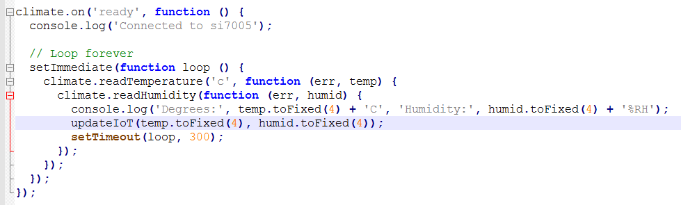
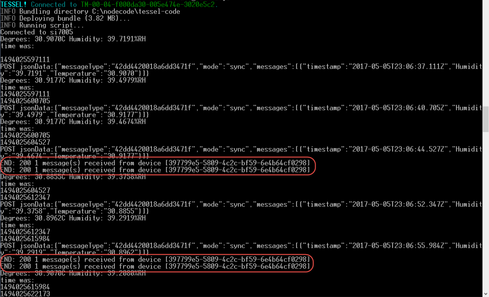
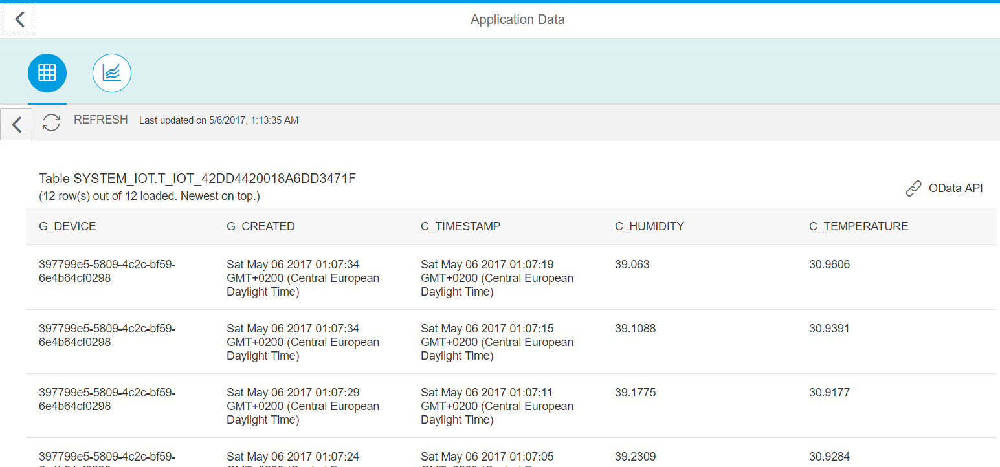
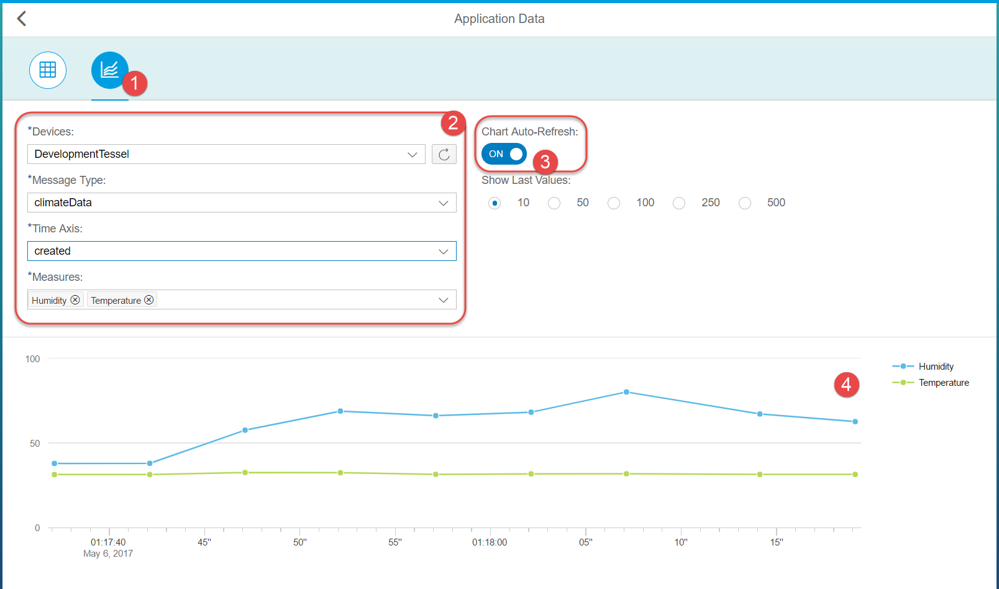

## Prerequisites  
- **Proficiency:** Beginner
- **Tutorials:** [Internet of Things (IoT) Adding a new device to the IoT Services](http://www.sap.com/developer/tutorials/iot-part7-add-device.html)

## Next Steps
- [Internet of Things (IoT) Viewing your Tessel data from IoT Services](http://www.sap.com/developer/tutorials/iot-part13-hcp-services-viewdataui5.html)


## Details
### You will learn  
Now its time to insert data from your Tessel to SAP IoT Services.   


### Time to Complete
**15 Min**.

---

[ACCORDION-BEGIN [Step 1: ](Edit your climate JavaScript file)]

Open your existing `climate.js` file in your editor and make these changes to the section after you assign the climate module to port "A" and before you actually read the temperature from the module itself.

These changes set the parameters needed to post your data. Notice you will need to make the changes for your information for the TOKEN, Account, Device ID, etc.
If you are using the same code from the previous sections you will need to modify it to match your message type definition now.  
In this example instead of sending a single value as you did in the previous section you are sending multiple values.

```javascript
// Connect to SAP IoT Services parameters
var hostIoT = 'iotmms########trial.hanatrial.ondemand.com';
var portIoT = 443;
var pathIoT = '/com.sap.iotservices.mms/v1/api/http/data/';
var authStrIoT = 'Bearer e352bcc5dfdec1cdc6fc3e5ea0b2a66b';
var deviceId = '78863a3a-e7b0-47df-acd3-b0d8ca67067e';
var messageTypeID = '6c7a02f24cc32ee07174';
```


[DONE]
[ACCORDION-END]

[ACCORDION-BEGIN [Step 2: ](Add new function)]

Insert the new `updateIoT` function at the bottom of your `climate.js` file. After the very last line of your current code.

```javascript
function updateIoT(temp, humid) {
var http = require('https');
var options = {
  host: hostIoT,
  port: portIoT,
  path: pathIoT + deviceId,
  agent: false,
  headers: {
    'Authorization': authStrIoT,
    'Content-Type': 'application/json;charset=utf-8'
  },
  method: 'POST',
};
options.agent = new http.Agent(options);
callback = function (response) {
  var body = '';
  response.on('data', function (data) {
    body += data;
  });
  response.on('end', function () {
    console.log("END:", response.statusCode, JSON.parse(body).msg);
  });
  response.on('error', function (e) {
    console.error(e);
  });
}
var req = http.request(options, callback);
req.on('error', function (e) {
  console.error(e);
});
console.log("time was:");
console.log(time);
date = new Date();
time = date.getTime();
console.log(time);

req.shouldKeepAlive = false;
var jsonData = {
  "mode": "sync",
  "messageType": messageTypeID,
  "messages": [{
      "Humidity": humid,
      "Temperature": temp,
      "timestamp": date
    }
  ]
}
var strData = JSON.stringify(jsonData);
console.log("POST jsonData:" + strData);
req.write(strData);
req.end();
}
```

>NOTE: `messageType` needs to be changed to match your `messageTypeID`.


[DONE]
[ACCORDION-END]

[ACCORDION-BEGIN [Step 3: ](Insert function call)]

Insert the call to `updateIot` just after your `console.log` output of your sensor data and before your `setTimeout` loop continues.

```javascript
updateIoT(temp.toFixed(4), humid.toFixed(4));
```



[DONE]
[ACCORDION-END]

[ACCORDION-BEGIN [Step 4: ](Check connection)]

Check that your Tessel is still connected to Wi-Fi by running the command `tessel wifi -l`. If you do not get a response like that below, you should reconnect to the network with the command below with the correct SSID and password. If your access point has spaces in the name then just put it inside of quotes like this: `"Wifi name"`.

```shell
tessel wifi -n SSID -p password
```


[DONE]
[ACCORDION-END]

[ACCORDION-BEGIN [Step 5: ](Run the code)]

Run your code, and you should see an output like the one below:

```shell
tessel run climate.js
```




[DONE]
[ACCORDION-END]

[ACCORDION-BEGIN [Step 6: ](View stored messages)]

Return to the **IoT Services Cockpit**, click the **View messages received, use sample clients, etc.** tile, click the **View stored messages** tile, then select your **table**. You will see the latest messages showing up there. You can also click the **REFRESH** button as your script runs.



You can switch as well from table display to live chart to see climate data changing in real-time.



[DONE]
[ACCORDION-END]


## Next Steps
- [Internet of Things (IoT) Viewing your Tessel data from IoT Services](http://www.sap.com/developer/tutorials/iot-part13-hcp-services-viewdataui5.html)
