## Prerequisites

 - Your company has licensed SAP IoT, has a Cloud Platform Enterprise Agreement, or has purchased SAP IoT at the sapstore.com ([http://www.sapstore.com/](https://www.sapstore.com/solutions/40108/SAP-Leonardo-IoT-Foundation%2C-express-edition))
 - Your company has licensed SAP Analytics Cloud.
 - Your project team has set up the subscription for SAP IoT in your company's global account in a tenant (e.g. in the DEV tenant, the guide for the basic set up is at [http://help.sap.com/](https://help.sap.com/viewer/195126f4601945cba0886cbbcbf3d364/2005a/en-US/bf128e1333534c04a1cfa18ae548e2b9.html))
 - Your SAP user from <https://accounts.sap.com> has been added to the Cloud Foundry space in this tenant as a Space Developer so you can retrieve the required credentials for accessing the APIs.
 - Your SAP user has at a minimum the `leonardoiot_role_collection` created during onboarding of your tenant and the associated roles.
 - Basic knowledge of REST APIs and working with Postman.
 - Postman installation done on your machine (works best with version 7.26.0 or above).

## Details
### You will learn
  - How to define dimensions, measures and aggregates
  - How to create a data model using dimensions, measures and aggregates
  - How to establish live connectivity between SAP IoT and SAP Analytics Cloud
  - How to create models and stories in SAP Analytics Cloud by consuming the data model created in SAP IoT

---
[ACCORDION-BEGIN [Step 1: ](Set up Postman)]

 Set up Postman parameters before you start working with SAP Analytics Cloud Integration with SAP IoT. We provide a set of APIs with sample model payload on GitHub for you to download. Using the Postman collection of APIs you will run thru the tutorial to complete our exercise.

1. Go to the GitHub repository **sap-iot-samples** at [https://github.com/SAP-samples/sap-iot-samples](https://github.com/SAP-samples/sap-iot-samples).

2. Download and unzip the collection, and open the folder **`iot-sac-integration-samples`** for Postman collection and Postman environment files.

    !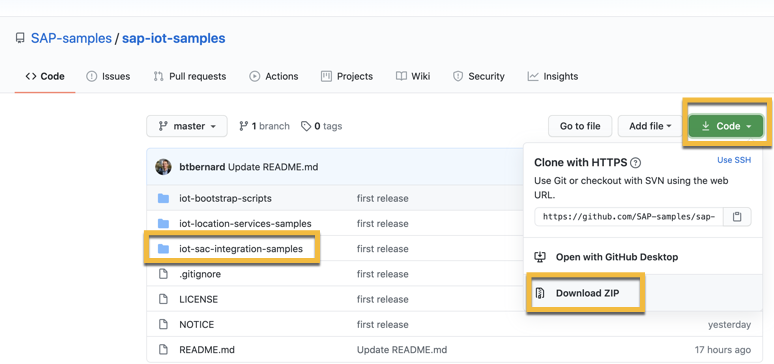

3. Open Postman and click **Import** button on top left. Upload the unzipped Postman collection and environment files from folder **`iot-sac-integration-samples`**.

    !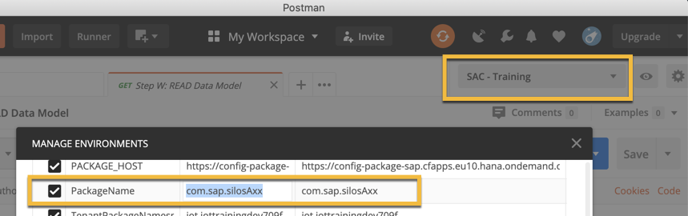

    > Pick the tenant name (or subdomain in developer lingo) from Cloud Foundry in SAP Cloud Platform.

4. Go to variable **`tenant_name`** and update the tenant name.

5. Go to variables **`client_id`** and **`client_secret`** and update your tenant client credentials.

    > This will be found in the service key of the service instance in your tenant (in Cloud Foundry lingo called subdomain and in SAP Cloud Platform lingo called 'Cloud Foundry sub-account').

6. From the Postman collection run **Step A: GET JWT Token** followed by next step **Pre 1:F etch Tenant Name Space**. Copy **package** from the response payload received and update the Postman environment variable **`TenantPackageNamespace`**

    ``` Postman
    GET https://business-partner.cfapps.eu10.hana.ondemand.com/Tenants
    ```

7. From the Postman collection run **Pre 2: Fetch Object Group ID** step. Copy `objectGroupID` from the response payload received and update the Postman environment variable **`ObjectGroupId`**

    ``` Postman
    GET https://authorization.cfapps.eu10.hana.ondemand.com/ObjectGroups/?$filter=objectGroupParentID%20eq%20null&$format=json
    ```

8. Click **Update**.

    Upon updating the Postman environment parameters successfully, you are done with the Postman setup.


[DONE]
[ACCORDION-END]

[ACCORDION-BEGIN [Step 2: ](Configure thing model and ingest data)]

Configure the thing model including data ingestion before proceeding to data model configuration. To complete this, you will run through the thing modelling using APIs provided in the Postman collection.

1. Go to Postman collection and choose the imported collection and environment **`SAC - Training`**. Execute from **Step A** to **Step F** for thing model configuration.

    - **Step A: Authentication to fetch JWT token** (should return **200 OK**).

    - **Step B: Create package** (should return **201 Created**).

    - **Step C: Create master data property set type** (should return **201 Created**).

    - **Step D: Create time series property set type** (should return **201 Created**).

    - **Step E: Create silo thing type** (should return **201 Created**).

    - **Step F: Read the newly created silo thing type** (should return **200 OK**).

    !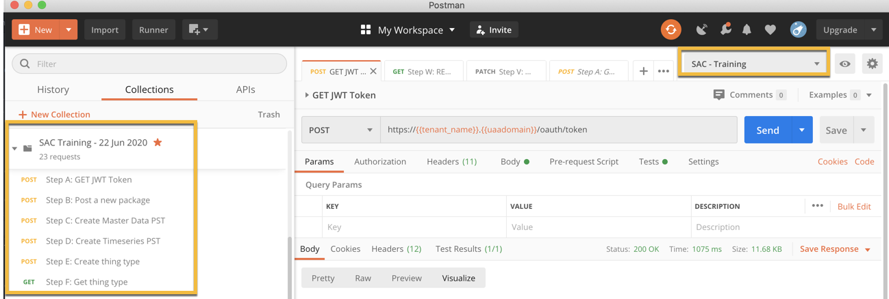

2. Go to Postman collection and execute from **Step G** to **Step J** for onboarding 4 Silos.

    - **Step G: Onboard Silo 1** (should return **201 Created**).

    - **Step H: Onboard Silo 2** (should return **201 Created**).

    - **Step I: Onboard Silo 3** (should return **201 Created**).

    - **Step J: Onboard Silo 4** (should return **201 Created**).

    !

    > Update the ingestion data time stamps in the below API call payloads such that they are immediate last X days from current date. Sample payload is already provided in the Postman collection.

3. Go to Postman collection and execute from **Step K** to **Step S** for creating master data and ingesting time series data for the silos.

    - **Step K: Read the newly created Silo** to ensure everything is correct (should return **200 OK**).

    - **Step L: Create master data for Silo 1** (should return **200 OK**).

    - **Step M: Create master data for Silo 2** (should return **200 OK**).

    - **Step N: Create master data for Silo 3** (should return **200 OK**).

    - **Step O: Create master data for Silo 4** (should return **200 OK**).

    - **Step P: Ingest time series data for Silo 1** (should return **200 OK**).

    - **Step Q: Ingest time series data for Silo 2** (should return **200 OK**).

    - **Step R: Ingest time series data for Silo 3** (should return **200 OK**).

    - **Step S: Ingest time series data for Silo 4** (should return **200 OK**).

    !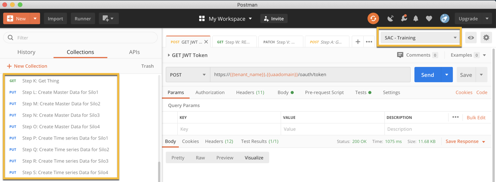

    You are done with the thing model configuration and ingesting the data. Please proceed with further steps.

[DONE]
[ACCORDION-END]

[ACCORDION-BEGIN [Step 3: ](Configure the data model)]

1. To check the thing model that you just configured go to the **Thing Modeler** app in the SAP IoT launchpad by replacing **iot-iottrainingdev-709f** with the tenant name in the following:

    [https://iot-iottrainingdev-709f.leonardo-iot.cfapps.eu10.hana.ondemand.com/](https://iot-iottrainingdev-709f.leonardo-iot.cfapps.eu10.hana.ondemand.com/)

    >User with the right privileges can find the the SAP IoT Launchpad by going to the Cloud Foundry sub-account and launching it from the 'Subscriptions'.

2. Go to the top left corner dropdown and switch to the package `com.sap.silosaXX` (XX is the random number as updated in Step 1). Check that the thing model looks as expected.

    !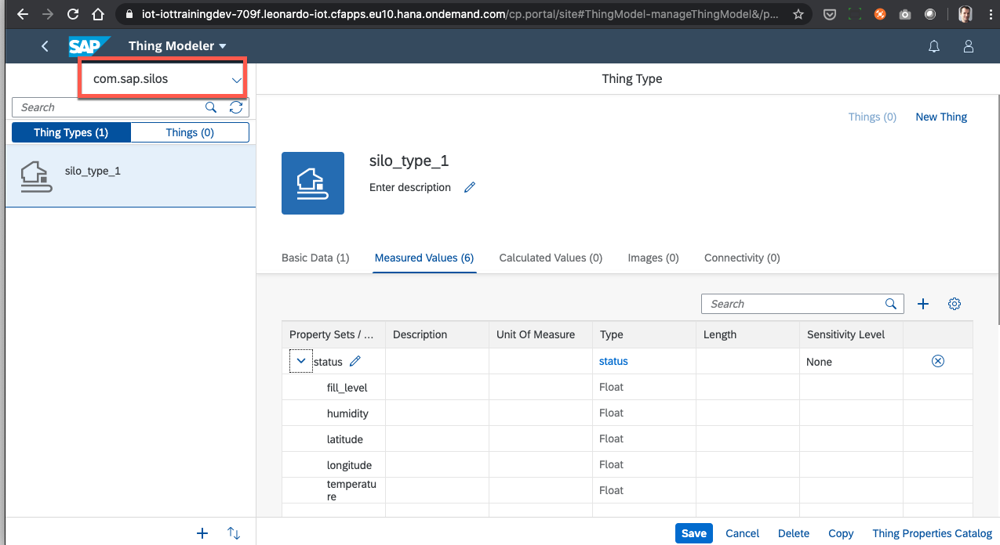

3. Use case definition: Based on the business needs, user can configure the dimensions and measures based on property set types available in the thing model.

    Let us configure a chart in SAP Analytics Cloud to map the Average Temperature of each silo for last 7 days of data where the data is aggregated Daily.

    Sample data model with daily aggregates for the last 7 days:

    ``` JSON

    {
      "Name": "TrainingModelXX",
      "AggregationWindow": "DAILY",
      "TimeWindowIdentifier": "day",
      "TimeWindowValue": 7,
      "Descriptions": [
        {
          "Description": "Daily Silo Temperature Analysis XX",
          "LanguageCode": "en"
        }
      ],
      "Fields": [
        {
          "FriendlyName": "EQUI",
          "AnalyticType": "Dimension",
          "CatalogName": "{{TenantPackageNamespace}}.{{PackageName}}:silo_type_1",
          "CatalogType": "ThingType",
          "DatasetName": "silo_process_data",
          "DatasetType": "MasterData",
          "Name": "EQUI"
        },
        {
          "FriendlyName": "HANU",
          "AnalyticType": "Dimension",
          "CatalogName": "{{TenantPackageNamespace}}.{{PackageName}}:silo_type_1",
          "CatalogType": "ThingType",
          "DatasetName": "silo_process_data",
          "DatasetType": "MasterData",
          "Name": "HANU"
        },
        {
          "FriendlyName": "HumidityMAX",
          "AnalyticType": "Measure",
          "CatalogName": "{{TenantPackageNamespace}}.{{PackageName}}:silo_type_1",
          "CatalogType": "ThingType",
          "DatasetName": "silo_status",
          "DatasetType": "TimeSeriesData",
          "Name": "humidity",
          "AggregationType": "MAX"
        },
        {
          "FriendlyName": "HumidityMIN",
          "AnalyticType": "Measure",
          "CatalogName": "{{TenantPackageNamespace}}.{{PackageName}}:silo_type_1",
          "CatalogType": "ThingType",
          "DatasetName": "silo_status",
          "DatasetType": "TimeSeriesData",
          "Name": "humidity",
          "AggregationType": "MIN"
        },
        {
          "FriendlyName": "HumidityCOUNT",
          "AnalyticType": "Measure",
          "CatalogName": "{{TenantPackageNamespace}}.{{PackageName}}:silo_type_1",
          "CatalogType": "ThingType",
          "DatasetName": "silo_status",
          "DatasetType": "TimeSeriesData",
          "Name": "humidity",
          "AggregationType": "COUNT"
        },
        {
          "FriendlyName": "HumiditySUM",
          "AnalyticType": "Measure",
          "CatalogName": "{{TenantPackageNamespace}}.{{PackageName}}:silo_type_1",
          "CatalogType": "ThingType",
          "DatasetName": "silo_status",
          "DatasetType": "TimeSeriesData",
          "Name": "humidity",
          "AggregationType": "SUM"
        },
        {
          "FriendlyName": "TemperatureMAX",
          "AnalyticType": "Measure",
          "CatalogName": "{{TenantPackageNamespace}}.{{PackageName}}:silo_type_1",
          "CatalogType": "ThingType",
          "DatasetName": "silo_status",
          "DatasetType": "TimeSeriesData",
          "Name": "temperature",
          "AggregationType": "MAX"
        },
        {
          "FriendlyName": "TemperatureMIN",
          "AnalyticType": "Measure",
          "CatalogName": "{{TenantPackageNamespace}}.{{PackageName}}:silo_type_1",
          "CatalogType": "ThingType",
          "DatasetName": "silo_status",
          "DatasetType": "TimeSeriesData",
          "Name": "temperature",
          "AggregationType": "MIN"
        },
        {
          "FriendlyName": "TemperatureCOUNT",
          "AnalyticType": "Measure",
          "CatalogName": "{{TenantPackageNamespace}}.{{PackageName}}:silo_type_1",
          "CatalogType": "ThingType",
          "DatasetName": "silo_status",
          "DatasetType": "TimeSeriesData",
          "Name": "temperature",
          "AggregationType": "COUNT"
        },
        {
          "FriendlyName": "TemperatureSUM",
          "AnalyticType": "Measure",
          "CatalogName": "{{TenantPackageNamespace}}.{{PackageName}}:silo_type_1",
          "CatalogType": "ThingType",
          "DatasetName": "silo_status",
          "DatasetType": "TimeSeriesData",
          "Name": "temperature",
          "AggregationType": "SUM"
        }
      ]
    }
    ```

    This model has both dimension and time series measure configured out of the existing properties. "Temperature" with all possible aggregates - SUM, COUNT, MIN, MAX. Currently you are allowed to configure aggregates only to measures but not the dimensions.

4. Go to **Step T** request payload body and update the model name and model description in Postman collection -- replace **XX** with random number as updated in **Step 1**.

5. Execute **Step T: Create the  data model** with the payload provided in the API (should return **201 Created**).

    ```Postman
    POST https://sap-iot-noah-live-cm-metadata-management.cfapps.eu10.hana.ondemand.com/metadata/v1/model.svc/DataModels
    ```

    !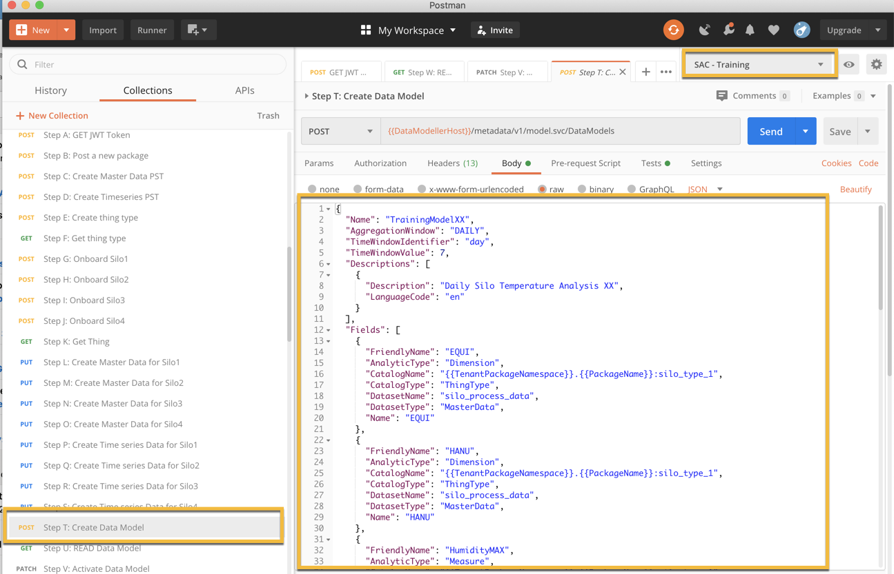

6. Check that the model status is shown as **NEW** in the API response.

    >- **Aggregates:** Currently following are supported - SUM, MIN, MAX, COUNT.
    - **Time window:** Currently time aggregate frequency supported are – Hourly, Daily, Weekly, and Monthly.
    - **Dimension:** It is a property based on which properties can be aggregated.
    - **Data model:** The combination of information the dimension, measure and aggregations are called a data model.
    - **Retention period:** It sets the boundary condition for how much aggregated data will be persisted at any point in time.
    - **Lag period:** which becomes useful in cases where the data arrives late. The changes of late data is high in cases of low internet connectivity for sensors.

    You are now done with data model definition.

[DONE]
[ACCORDION-END]

[ACCORDION-BEGIN [Step 4: ](Activate the data model)]

Activation of a data model creates and persists aggregated data based on the input parameters defined in the data model.

1. Execute **Step U: Read the data model** to fetch the ETAG -- ETAG is required to execute the model activation (should return **200 OK**).

    !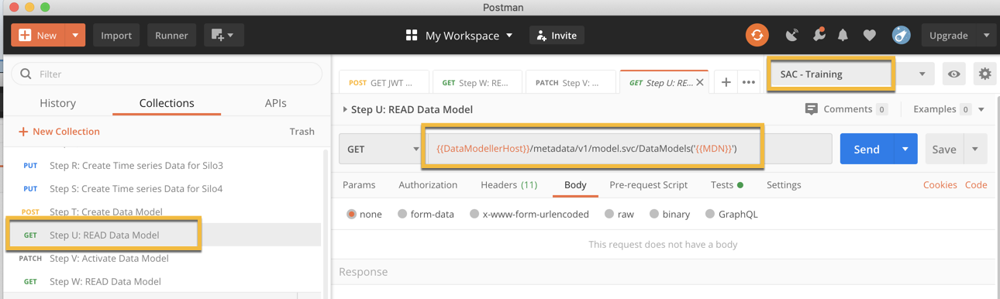

    ```Postman
    GET https://sap-iot-noah-live-cm-metadata-management.cfapps.eu10.hana.ondemand.com/metadata/v1/model.svc/DataModels('<Model ID>')
    ```

2. Execute **Step V: Activate the data model** with the payload provided in the Postman (should return **202 Accepted**).

    !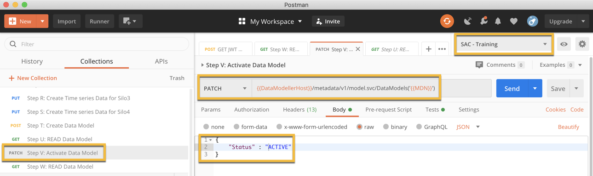

    ```Postman
    PATCH https://sap-iot-noah-live-cm-metadata-management.cfapps.eu10.hana.ondemand.com/metadata/v1/model.svc/DataModels('<Model ID>')

    {
    	"Status" : "Active"
    }
    ```

3. Execute **Step W: Read the data model** to check the model activation status. On triggering activation model status turns "ACTIVATION REQUESTED" and subsequently changes as "Activation In Progress". In few minutes, the status will turn to **Active** status - you are good if the returned status code is **200 OK**.

    !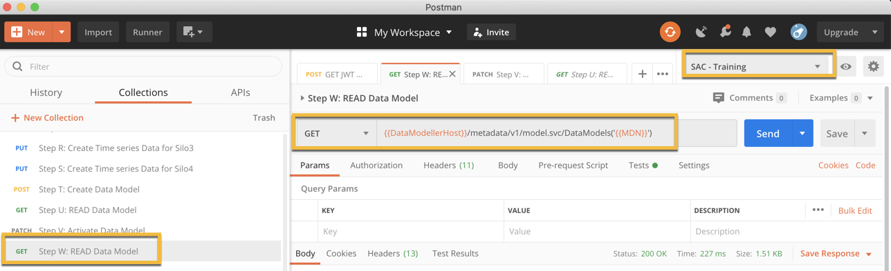

    ``` JSON
    GET https://sap-iot-noah-live-cm-metadata-management.cfapps.eu10.hana.ondemand.com/metadata/v1/model.svc/DataModels('<Model ID>')
    ```

    > ### Info:
    - Depending on the model and number of aggregates configured it may take few minutes to activate the model as - the process behind activation is to generate all the aggregates configured in the data model and generate the aggregated data.
    - Calculation view is auto generated from activation and cannot be manually accessed or edited.
    - Different data model states.
          - 'New' on creation
          - 'Activation Requested' on triggering activation.
          - 'Activation in Progress' while activation is on going.
          - 'Active' upon successful activation.
          - 'Deactivation in Progress' while deactivation is on going.
          - 'Deactive' upon successful deactivation.

    You are done with data model activation. Upon activation, aggregates are created and calculation view is generated that will be exposed in SAP Analytics Cloud. Please proceed with further steps.

[DONE]
[ACCORDION-END]

[ACCORDION-BEGIN [Step 5: ](Establish SAP HANA Live Connectivity)]

To consume the above generated calculation view in SAP Analytics Cloud, you need to establish SAP HANA Live connection between SAP Analytics Cloud and SAP IoT. This is a one time activity and you do not need to repeat this step  again for the same tenant.

1.	Open your licensed SAP Analytics Cloud tenant URL and log in with valid credentials that are assigned with right roles that authorise to create live connection, create models and stories.

     [https://acme-iot.eu10.sapanalytics.cloud/](https://acme-iot.eu10.sapanalytics.cloud/) (replace **acme-iot** with actual SAP Analytics Cloud tenant name)

2.	Click  !  and select **Connection**.

    !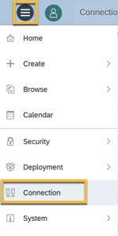

3.	In the **Connection** page, under **Connections** tab, click   ! to add a new connection.

4. In the **Select Data Source** window, expand **Connect to Live Data**.

    !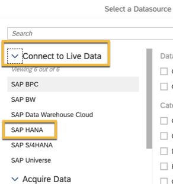

5.	From the **Connect to Live Data** list, choose **SAP HANA**. New HANA Live Connection window will be opened.

6.	In the **New HANA Live Connection** window box, fill in the following:

    | Field | Value |
    |-------|-------|
    | **Name** | **`TrainingEU`**  (could be any user defined name for Live Connection)|
    | **Description** | **Live Connection to IoT Training tenant** |
    | **Connection Type** | **Direct** |
    | **Host** | **<<tenant name>>.leonardo-iot.cfapps.eu10.hana.ondemand.com/cm** (IoT launchpad URL suffixed with **/cm** and without https://)|
    | **HTTPS Port** | **443** |
    | **Default Language** (Optional)|  Once you have clicked **OK** to save the live connection, the default language can only be changed by the administrator. If the language you choose is not installed on your SAP Analytics Cloud system, SAP Analytics Cloud will choose the default language. |
    | **Authentication Method** | **SAML Single Sign On** system will prompt to authenticate IoT launchpad URL (entered in same table above) |
    | **Save** | Click **OK** |

7. User should be able to see the newly created live connection.

    You are done with establishing a live SAP Analytics Cloud connection with IoT tenant.

[DONE]
[ACCORDION-END]

[ACCORDION-BEGIN [Step 6: ](Configure SAP Analytics Cloud model)]

1. Click  and then select **Create**.

    !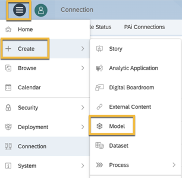

2. Click **Model**.

3. From the New Model screen, click **Get data from a data source**.

    !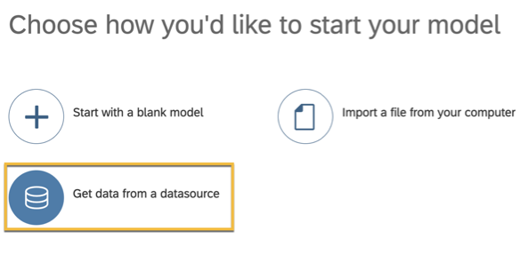

4. At top right under **Connect to live data**, click **Live Data connection**.

    !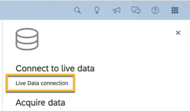

5. From the popup window, choose **System Type** as **SAP HANA**.

    !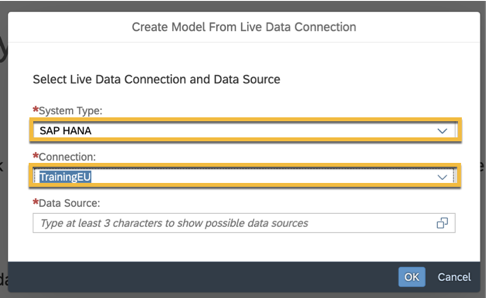

6. From the **Connection** dropdown, choose **`TrainingEU`** (the live connection that you had configured in the previous **Step 4**).

7. An SAP Cloud Platform authentication popup will be displayed. Authenticate using the authorized credentials.

    > Enter the authentication credentials using keyboard and navigate using TAB key. In case you have the same identity provider configured for both SAP Analytics Cloud and the Cloud Foundry subaccount, then this additional login is not required.

    !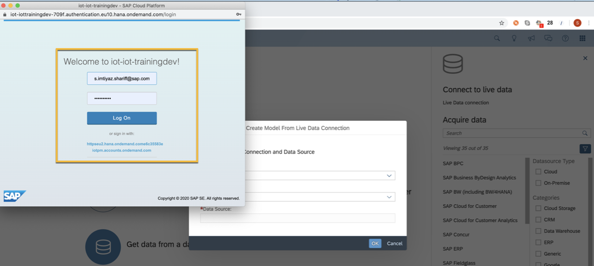

8. Click **Data Source** and search for the data model name that you have created in Step 1, **TRAININGMODELXX** (XX is the random number as updated in Step 1).

    Choose the model name **TRAININGMODELXX**.

    !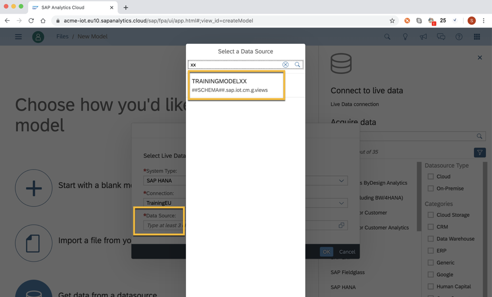

9. Click **OK**.

    New model screen is displayed listing all the generated / configured aggregates.

    Click **Save**.

    !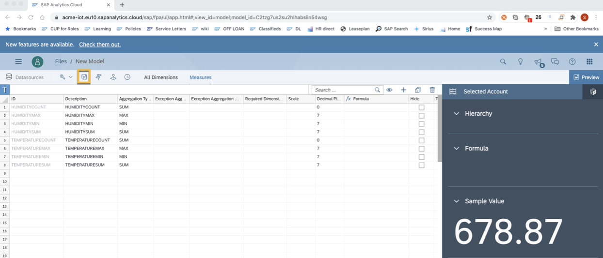

10. Enter the model name as **`ModelXX`** (XX is the random number as updated in Step 1) and click **OK**.

    Model should be saved as **`ModelXX`**.

    !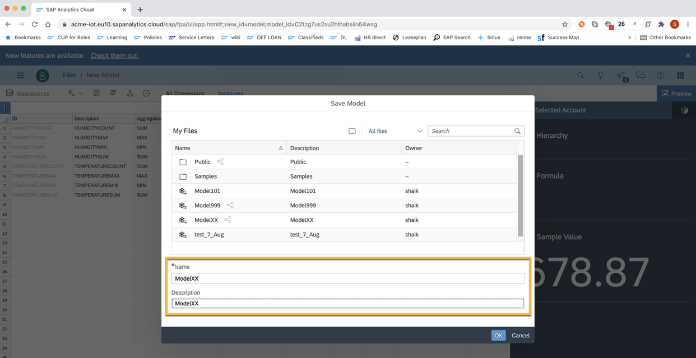

    You are done with creating a SAP Analytics Cloud model.

[DONE]
[ACCORDION-END]

[ACCORDION-BEGIN [Step 7: ](Create SAP Analytics Cloud story)]

1. Click ! and select **Create > Story**.

    !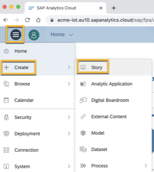

2. Click **Add a Canvas Page** template.

    !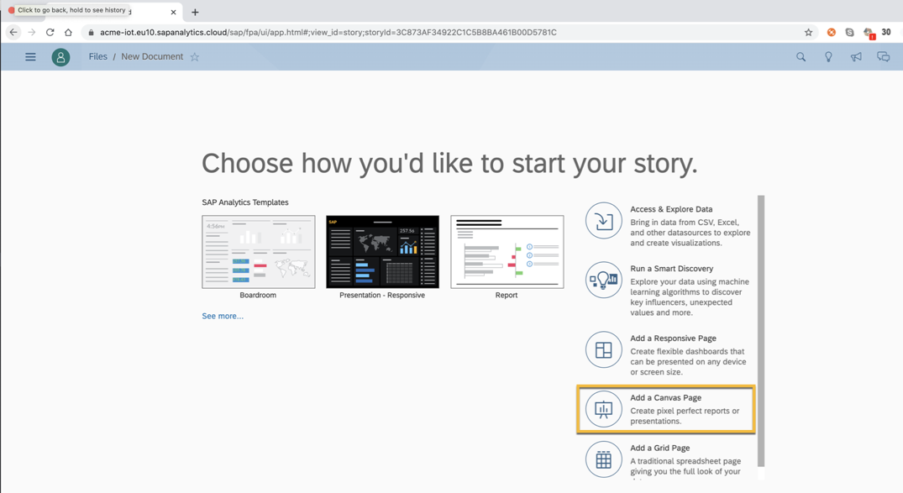

3. From the story canvas page, add an object to the story, and click **Chart**.

    !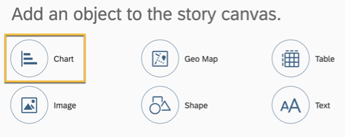

4. From the popup window, select the model created in Step 5 -- **`ModelXX`** (XX is the random number as updated in Step 1).

    !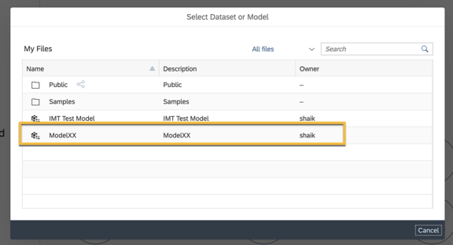

5. SAP Cloud Platform authentication popup will be displayed. Authenticate using the authorized credentials.

    > Enter the authentication credentials using keyboard and navigate using TAB key. In case you have the same identity provider configured for both analytics cloud and the Cloud Foundry sub-account, then this additional login is not required.

    !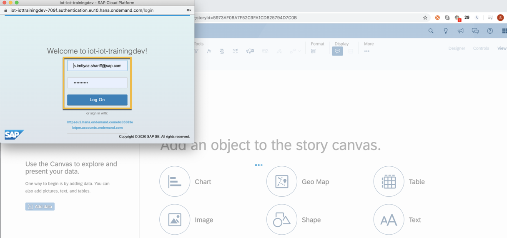

6. In the **New Document** screen, go to **Designer** > **Measures**, and click **+ Add Measure**.

    !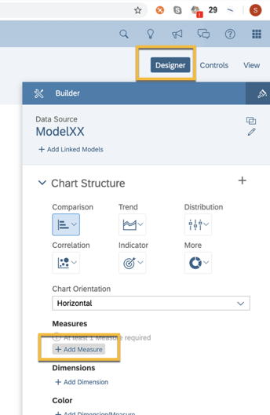

7. Under **CALCULATIONS**, click **+Create Calculation**.

    !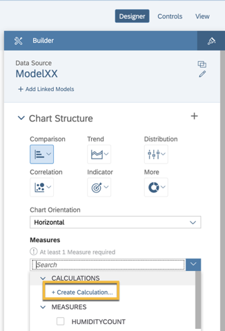

8. In the calculation editor, select **Type** > **Calculated Measure**.

    !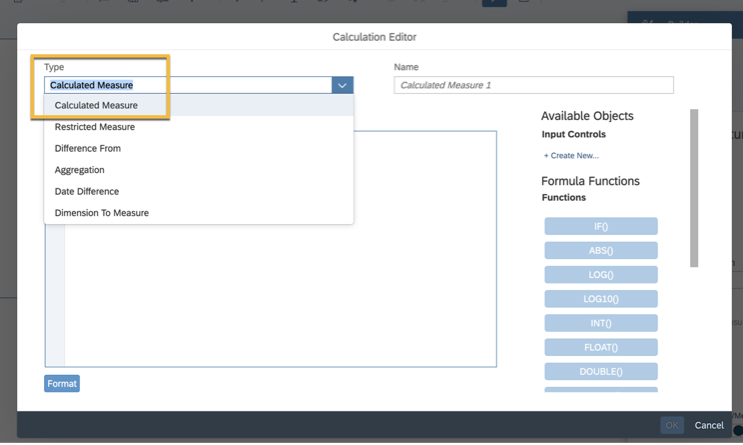

9. For **Name**, enter **Average Temperature**.

    !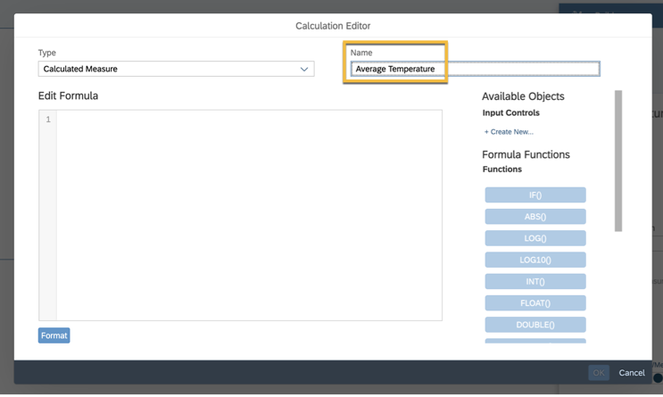

10. For **Edit Formula**, enter **SUM**.

    The editor displays the help text to pick the available `SUM` aggregated measures. Choose **`[ModelXX:TEMPERATURESUM]`**.

    !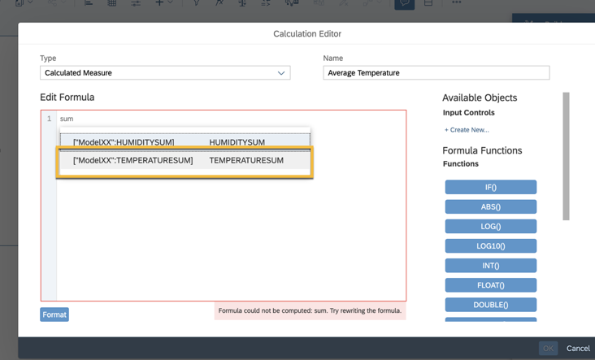

11. Under **Available Objects** on right side, scroll to the **Operations** section and choose **'/'**

    !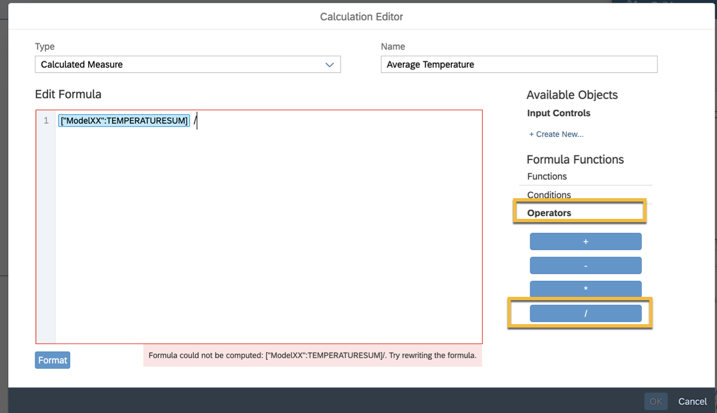

12. In the **Edit Formula** box, enter **`COUNT`**.

    The editor displays the help text to pick the available `COUNT` aggregated measures. Choose **`[ModelXX:TEMPERATURECOUNT]`**.  

    !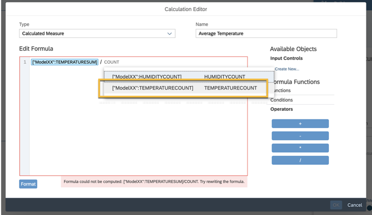

13. Click **OK** and go to **Designer > Builder > Dimensions** and click **+ Add Dimensions**.

    !

14. Scroll down to choose **`EQUI`** and the chart is refreshed to fetch the data based on the chosen measures and dimensions.

    !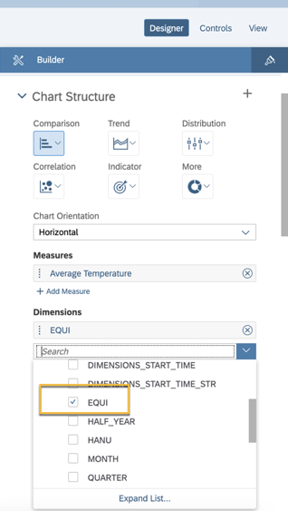

15. Click **Save** and provide **Name** as `StoryXX` and **Description** as `StoryXX` (XX is the random number as updated in Step 1).

    !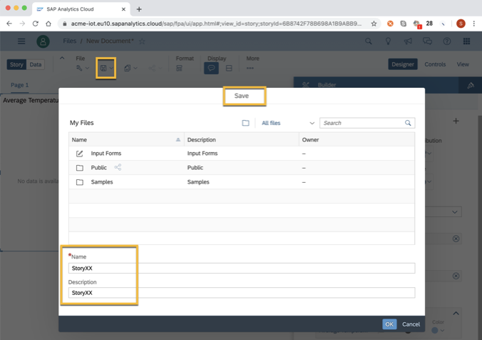

16. Click **OK**.

    The chart showing the average temperature per each silo is plotted.

    !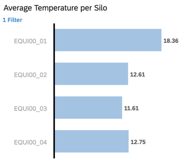

    You are done with creating an SAP Analytics Cloud story out of the SAP Analytics Cloud model. On saving the story, you completed the end-to-end flow.

[VALIDATE_9]

[ACCORDION-END]


---
