## Prerequisites

-   Basic knowledge of REST, APIs and Postman
-   Followed the Tutorial [Install Postman Rest Client](api-tools-postman-install)
-   You have installed a supported [Java](https://www.oracle.com/java/technologies/javase/javase-jdk8-downloads.html) distribution
-   You have installed and set up [MQTT.fx 1.7.1](http://www.jensd.de/apps/mqttfx/1.7.1/)
-   You have licensed SAP Internet of Things (with the new capacity unit based licensing introduced in August 2020, your company has a Cloud Platform Enterprise Agreement or Pay-As-You-Go for SAP BTP and you have subscribed to the `oneproduct` service plan)
-   You have setup the subscription for SAP IoT in your global account in a tenant (e.g. in the DEV tenant, the guide for the basic setup is at [Get Started with Your SAP IoT Account](https://help.sap.com/viewer/195126f4601945cba0886cbbcbf3d364/latest/en-US/bfe6a46a13d14222949072bf330ff2f4.html) ).
-   Your SAP User has at a minimum the `iot_role_collection` created during onboarding of your tenant and the associated roles (see [SAP Help on Providing Authorizations in SAP IoT](https://help.sap.com/viewer/195126f4601945cba0886cbbcbf3d364/latest/en-US/2810dd61e0a8446d839c936f341ec46d.html) )
-   You have created an empty package in SAP Internet of Things (see [SAP Help on Creating a Package](https://help.sap.com/viewer/e057ad687acc4d2d8f2893609aff248b/latest/en-US/5ba36c7bc9af4576997f72d6dddfc951.html) )

## Details
### You will learn
-   How to create Device Model by using Device Connectivity in Postman collection
-   How to create Things and link them with the Thing Modeler
-   How to simulate physical Device Data ingestion
-   How to ingest EPICS events

---

[ACCORDION-BEGIN [Step 1:](Set up Postman and retrieve OAuth token)]

You can access the SAP IoT APIs using an OAuth Token. After you subscribe your subaccount to SAP IoT, you can retrieve the client secret from the service keys you created for your subaccount.

1.  Retrieve client credentials

    Refer to this document to [retrieve Client ID and Client Secret](https://help.sap.com/viewer/fffd6ca18e374c2e80688dab5c31527f/2009a/en-US/a41c28db0cf449059d48c23fa5f7b24b.html). You can use the client credentials to retrieve the OAuth token. You can access all the APIs and data within the subaccount using this OAuth token.

2.  Set up Postman collection

    Postman is a popular and easy to use REST client which you can use to access the SAP IoT APIs. Please refer to the introduction guide for understanding the usage of Postman.

      We have provided a set of sample Postman collections on GitHub for you to download. Please clone or download/unzip the repository [sap-iot-samples](https://github.com/SAP-samples/sap-iot-samples/tree/master/iot-autoid-services-samples/Smart%20Sensing%20-%20Quality%20Control%20of%20Goods%20Receipt%20-%20Postman). The Postman collections and environment (in folder `iot-autoid-services-samples/Smart Sensing - Quality Control of Goods Receipt - Postman`) includes all the API calls used in these tutorials and the payload structures for the same. Import both into your Postman.


3.  Generate OAuth token

    To retrieve the OAuth token, you must do the following:

    - Select the environment you have imported as active--------

    -   Update the tenant name (your subaccount name - for example, trainingf954d) to the `tenant_name` Postman environment variable.

    -   Update the `uaadomain` from the service key to `uaadomain` Postman environment variable.

    -   Copy the Client ID and Client Secret from the service key you generated in your subaccount into the `client_id` and `client_secret` Postman environment variables.

    -   You can retrieve the `OAuth` token by using the Postman collection (`SAP IoT Smart Sensing - Create Device Model`) and triggering the request **Step 1: GET OAuth Token**.

    -   Update the generated token to `LoginTokenT1` Postman environment variable appending 'Bearer ' at the beginning. For accessing the SAP IoT APIs, enter this OAuth token as an authorization header in the Postman calls (the script in **Tests** should take care of this for you).

        !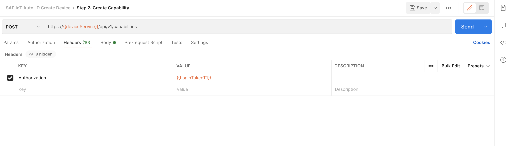

> You can refer to the [SAP Help Portal](https://help.sap.com/viewer/fffd6ca18e374c2e80688dab5c31527f/latest/en-US/7b3a94e68be9460680a915138a160c67.html) to create an OAuth Token if you would like to understand the steps for generating the token in detail.

[DONE]
[ACCORDION-END]

[ACCORDION-BEGIN [Step 2: ](Create device model and generate certificate)]

In order to create a digital twin of a physical asset (e.g. a RFID scanner that generates EPCIS events) in the SAP Internet of Things system, the Device entity needs to be onboarded. This is done by creating a Device Model, which includes four entities: Capability, Sensor Type, Device with a Sensor. The following steps will guide you through this setup. For more information on the Device Model see [SAP Help Portal on IoT Device Connectivity](https://help.sap.com/viewer/104567de4c2547a4ac32ba9b362e60ec/latest/en-US/2b5ac1ae2bf843d691ed763a96b10712.html)

Note: The following process will set up several Postman environmental variables, keep the order as follows.

1.  Update the `deviceService` URL in the Postman environment. You can find it in the service key (use the value of **`iot-device-connectivity`** removing initial **`https://`**) you generated in your subaccount, for example **`iot-device-connectivity-noah-live.cfapps.eu10.hana.ondemand.com`**

2.  Trigger the request **Step 2.1 Create Capability**.

3.  Trigger the request **Step 2.2 Create Sensor Type**.

4.  Trigger the request **Step 2.3 Create Device**.

    The EPCIS device model has been created. The next steps will onboard the device model for two IoT devices which represents a thermometer capable to measure temperature:

5.  Trigger the request **Step 3.1 Create Capability for IoT Device**.

6.  Trigger the request **Step 3.2 Create Sensor Type for IoT Device**.

7.  Trigger the request **Step 3.3 Create Device Fridge001**.

8.  Trigger the request **Step 3.4 Create Device Fridge002**

    The communication with the Cloud both in case of EPCIS and IoT devices is always with security. To simplify the management of certificates we are creating an additional Router Device to authenticate all the devices with the same certificate
    >For further information see [Router Device Authentication](https://help.sap.com/viewer/9133dbb5799740f8b1e8a1c3f0234776/LATEST/en-US/e3d24612-c4bd-45b7-85d0-efa23aa30efb.html)

9.  Trigger the request **Step 4.1 Create Router Device**.

10. Trigger the request **Step 4.2 GET Device Certificate**, save the content of the `secret` object and copy the content of the `pem` object into an editor of your choice (e.g. Notepad++, Atom) and save it as **key1.pem**.

    !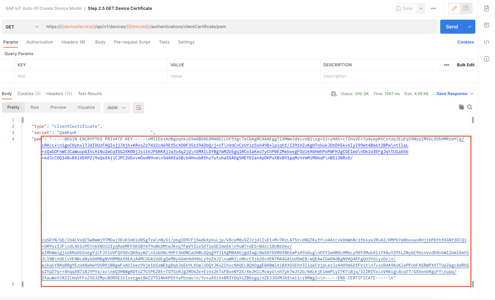

11. Change new line characters in the **key1.pem** file.
    -    If you are running on a Unix machine (e.g. MacOS) start a terminal at the same place the **key1.pem** file is stored and execute the following command `sed 's/\\n/\n/g' key1.pem > key.pem`

    -    If you are running on a Windows machine open the **key1.pem** file in an editor and replace all `\n` with line breaks using the search & replace function (Control+F) of your editor and save it as **key.pem**.

    The result of formatting the `.pem` file should look like this:

    !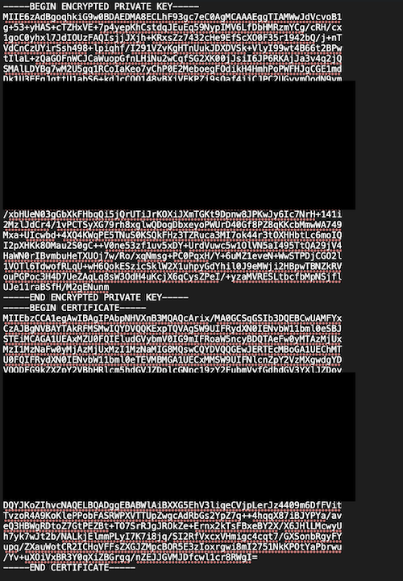

    MQTT.fx tool uses certificates in JKS format. It's obtained easily with the usage of **`OpenSSL`** and **`Keytool`**.

    Open a command prompt and execute the following commands:

12. Execute `openssl pkcs12 -export -in key.pem -out cert.p12` to convert the PEM certificate into a standard p12 certificate. Specify the certificate password when prompted by using the `secret` field of the payload returned in the step 10; use the same password for the p12 certificate.

13. Execute `keytool -importkeystore -srckeystore cert.p12 -srcstoretype pkcs12 -destkeystore cert.jks` to create the JKS key store. Specify the certificate password when prompted; use the same password for the JKS key store.

> You will use the `JKS` file store later on to authenticate against SAP IoT's Device Connectivity to send your EPCIS event and IoT measures via MQTT.

[DONE]
[ACCORDION-END]

[ACCORDION-BEGIN [Step 3: ](Create thing model for EPCIS and IoT devices)]

Open the Fiori launchpad of your SAP Internet of Things tenant and navigate to the **Thing Engineer OData** tab and open the app **Thing Modeler**

1.  Open your **Package** (in this example a package with name  `sap.tutorial` is used ) in the **Select Package** dialog.

2.  Create a new **Thing Type** **`Fridge`** and **Save**

3.  Create a new **Thing Type** **`epcis`** and **Save**

4.  Open the **Thing Properties Catalog**:

5.  Create a new **Property Set** called **`epcis_data`** of type **Measured Values**

6.  Add a new **Measured Value** **`eventxml`** of type **Large String** and **Save** the created **Thing Property**

    !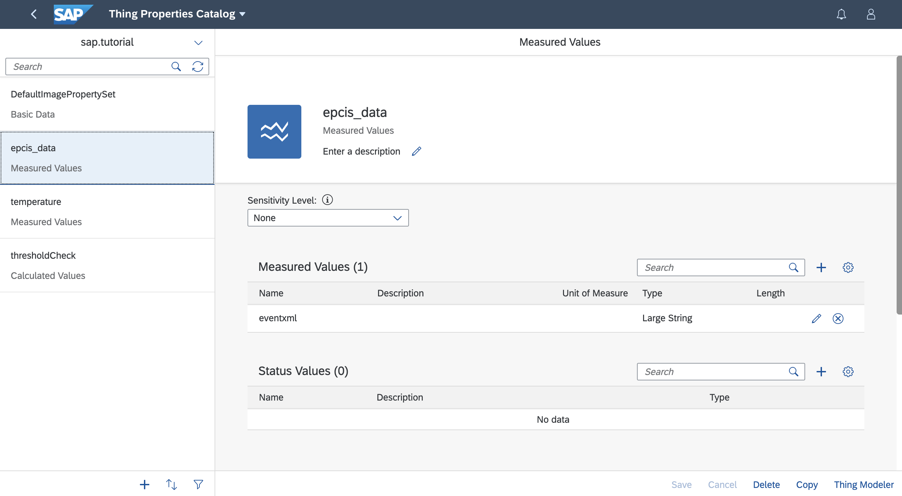

7.  Create a new **Property Set** called **`temperature`** of type **Measured Values**

8.  Add a new **Measured Value** **`temperature`** of type **Float** and **Save** the created **Thing Property**

    !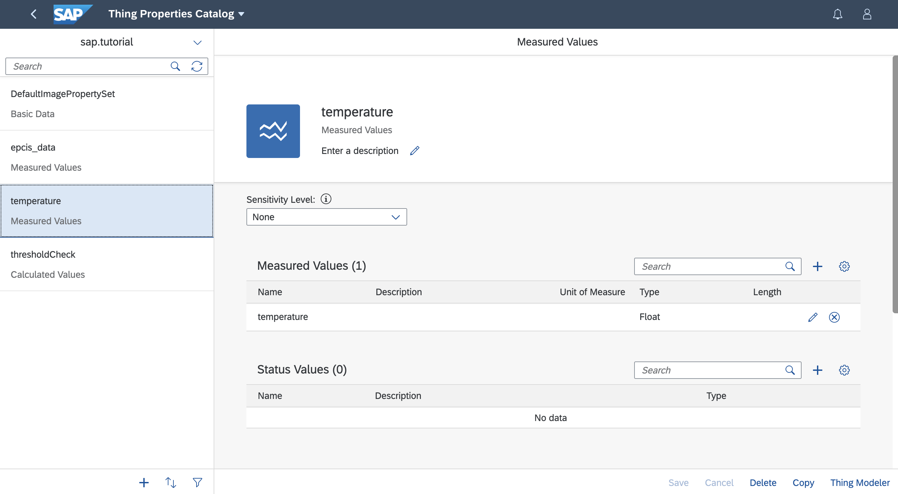

9. Create a new **Property Set** called **`thresholdCheck`** of type **Calculated Values**

10. Add a new **Calculated Value** **`scanningTime`** of type **String**, a new **Calculated Value** **`threshold`** of type **Date and Time**, a new **Calculated Value** **`deliveryDocument`** of type **Large String**; then **Save** the created **Thing Property**

    !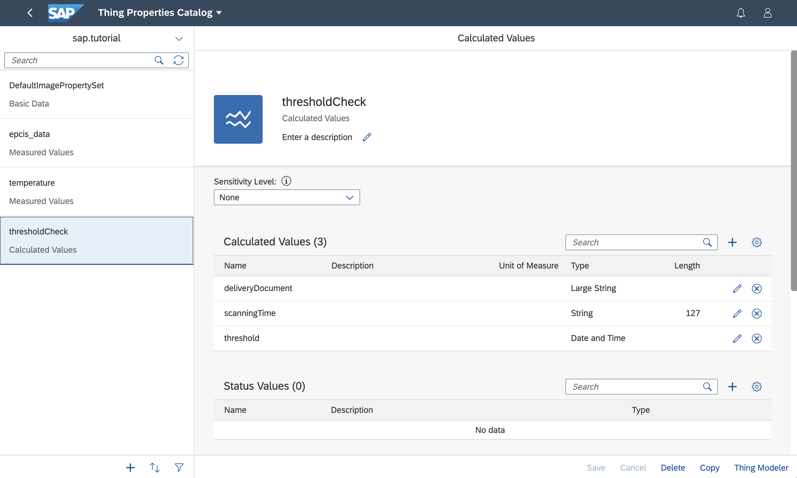

11. Switch back to the **Thing Modeler**

12. On your **Thing Type** `Fridge` switch to the **Measured Values (0)** tab and click **+** to add your property set `temperature`

    !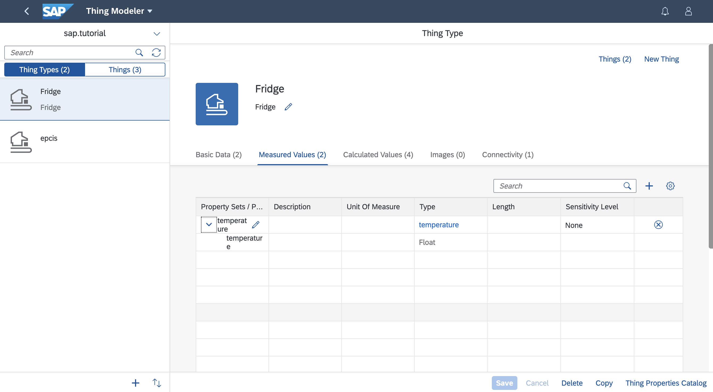

13. Switch to the **Calculated Values (0)** tab and click **+** to add your property set `thresholdCheck`

    !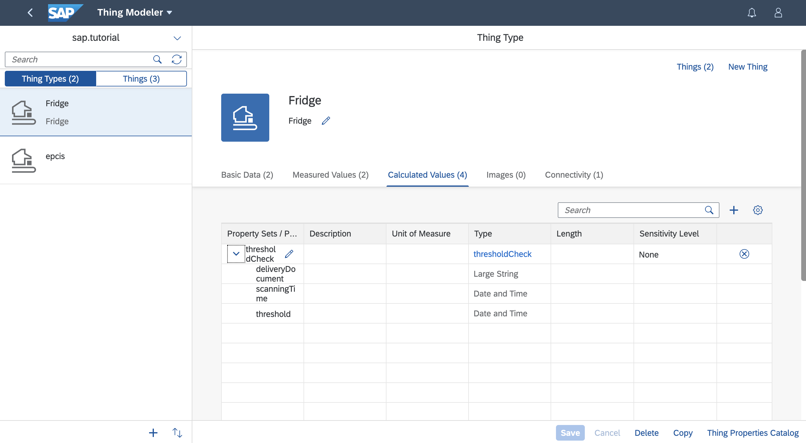

14. Finally **Save** the **Thing Type**

15. On your **Thing Type** `epcis` switch to the **Measured Values (0)** tab and click **+** to add your property set `epcis_data`

    !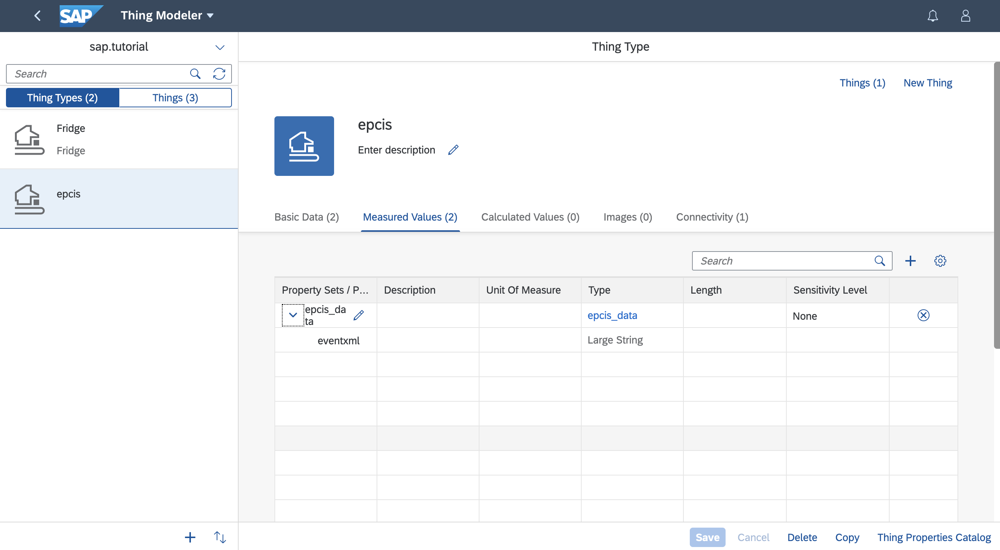

16. Finally **Save** the **Thing Type**

[DONE]
[ACCORDION-END]

[ACCORDION-BEGIN [Step 4: ](Create mapping in Thing Type)]
Open the Fiori launchpad of your SAP Internet of Things tenant and navigate to the **Thing Engineer OData** tab and open the app **Thing Modeler**

1.  Open the **Package** `sap.tutorial` in the **Select Package** dialog.

    !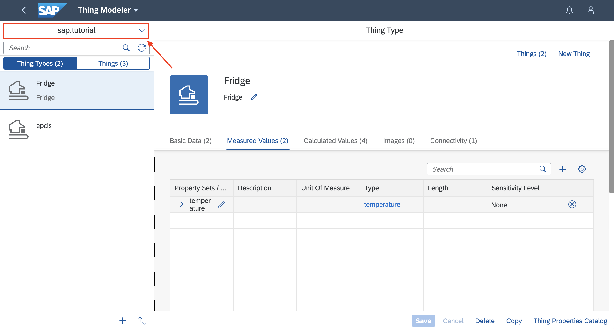

2.  On the **Thing Type** `epcis` switch to the tab **Connectivity** and select `SAP Cloud Platform IoT Service for Cloud Foundry Environment`.

    !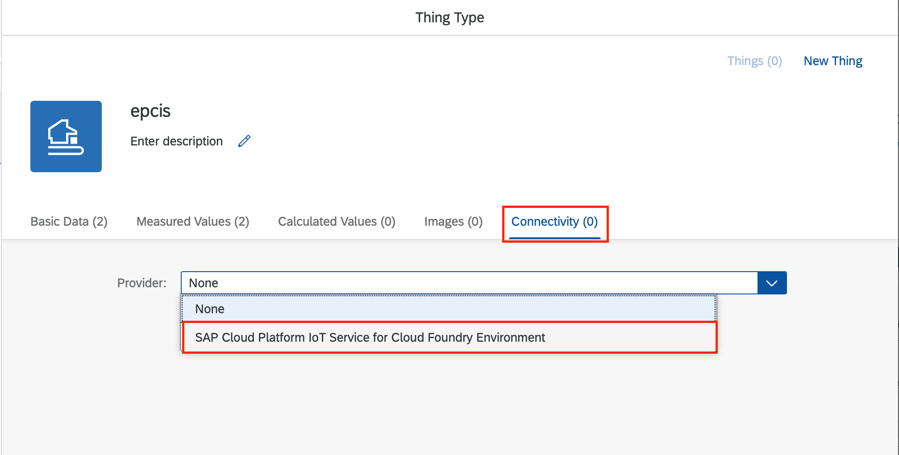

3.  Create a new **Mapping** called **`epcis_mapping`**, select your **Sensor Type** `epcis_sensortype` created previously and map the Property `eventxml` to your **Device Property** `eventxml` and **Save** it.

    !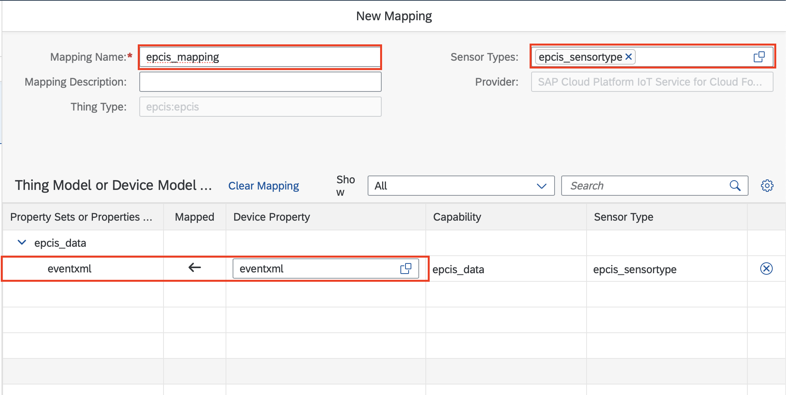

At the end the result you look like this:

!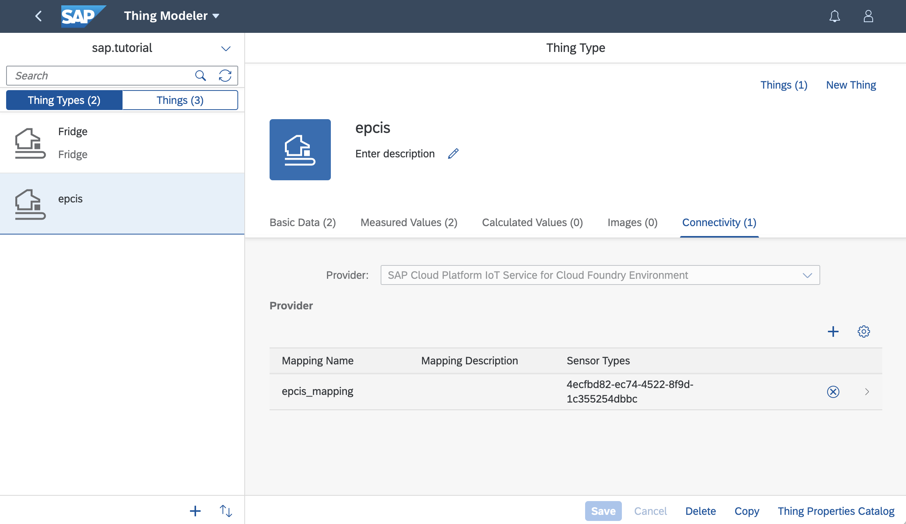

With the same procedure create a mapping for the `Fridge` Thing Type, using the Sensor Type `fridge_ST` previously created:

!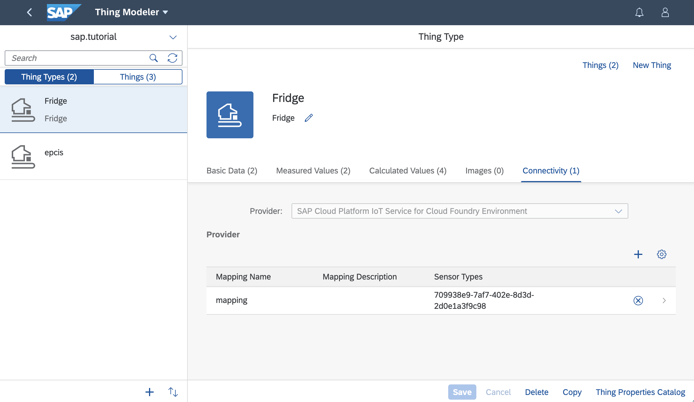

[DONE]
[ACCORDION-END]

[ACCORDION-BEGIN [Step 5: ](Create Thing and assign Device)]
Open the Fiori launchpad of your SAP Internet of Things tenant and navigate to the **Thing Engineer OData**, open the app **Thing Modeler** and select again the `sap.tutorial` package.

1.  Switch to the **Things** tab and create a new Thing. Provide an appropriate name (e.g. **`epcis_scanner`** ) and description and select `epcis` as **Thing Type** and choose `TENANT_ROOT` as Authorization Group and **Save**.

    !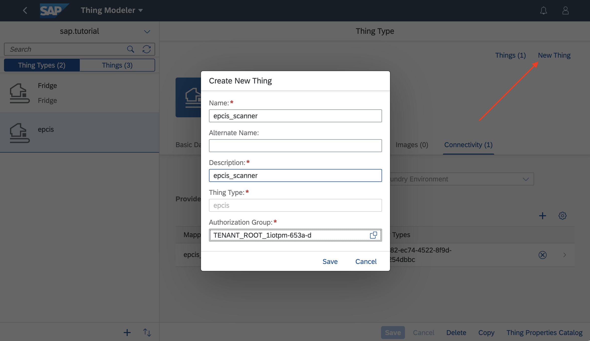

2.  On the **Thing** `epcis_scanner` switch to the tab **Connectivity** and select `SAP Cloud Platform IoT Service for Cloud Foundry Environment`.

    !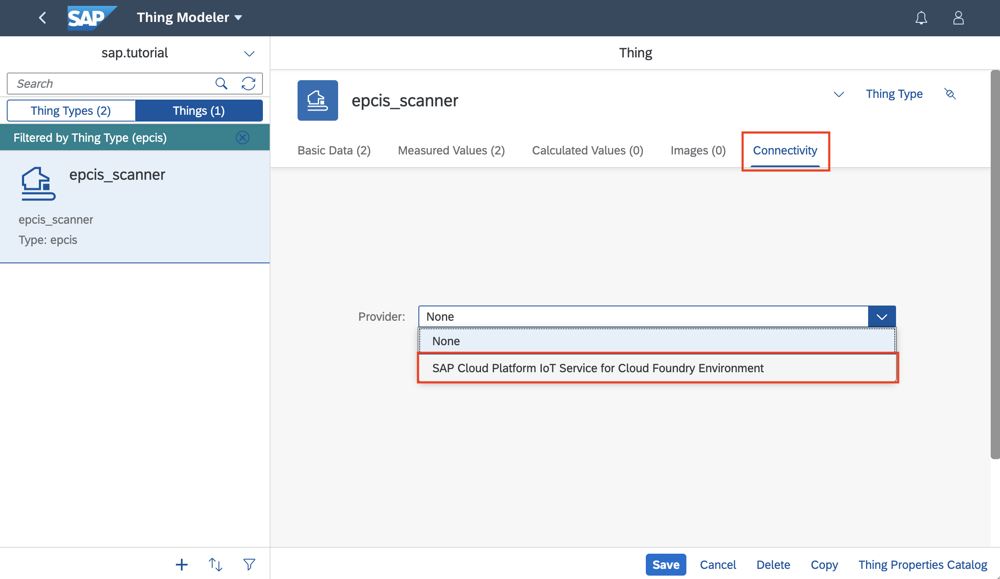

3.  Select your **Mapping** and **Sensor** and **Save** the changes.

    !

    The IoT Fridge device will be connected to an **Handling Unit** created in the backend.

4.  Open the **Object Instance** Fiori application and fill in the filters for **Package Name** with your package (e.g. `sap.tutorial`) and **Object Type Name** with the **Handling Unit** type downloaded with the initial load of your Smart Sensing scenario.

    !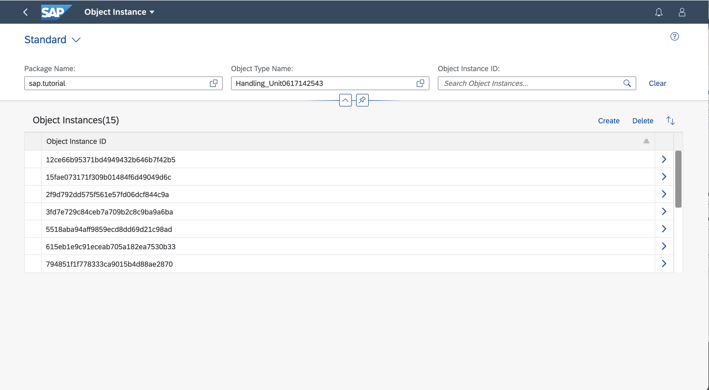

5.  Open an existing **Handling Unit** in the list, and modify the field `EpcIdUri` with the id of the RFID tag stick to the Handling Unit, and copy the value of `HandlingUnitExternalID`, it will be required for the creation of the Thing.

    !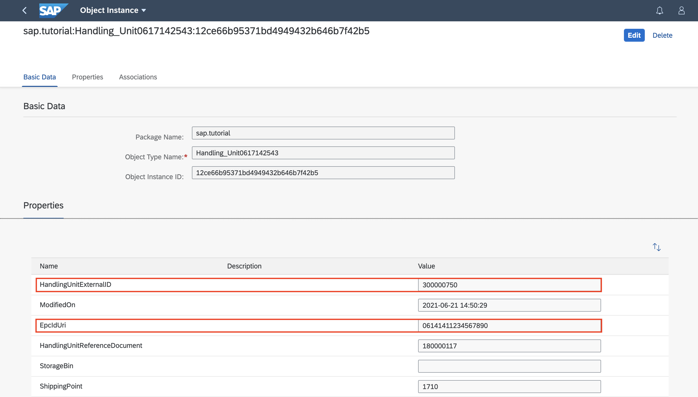

6.  Open the **Thing Modeler** application and create a new **Thing** for the Thing Type `Fridge`. Use the following details:

    | Property Name  | Value                                                                                                           |
    | :------------- | :-------------------------------------------------------------------------------------------------------------- |
    | Name           | Use a representative name (e.g. **`Fridge001`**)                                                                |
    | Alternate Name | it must be correlated to Handling Unit, use the `HandlingUnitExternalID` you have copied from the Handling Unit |
    | Description    | Any significant description (e.g. **`Fridge001`**)                                                              |
    | Authorization Group | Select one group from the existing(e.g. `ROOT`) |


7.  Switch to the tab **Connectivity** and select `SAP Cloud Platform IoT Service for Cloud Foundry Environment`.

8.  Select your **Mapping** and **Sensor** and **Save** the changes.

This is the final result:

!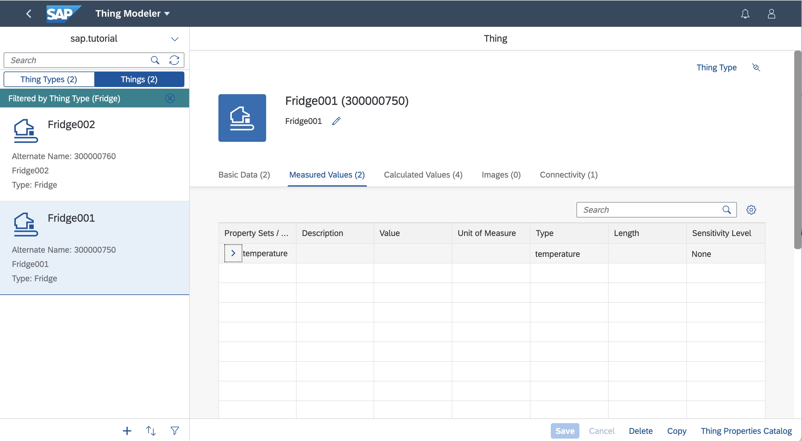

With the same procedure, using a different **Handling Unit**, create the `Fridge002` Thing:

!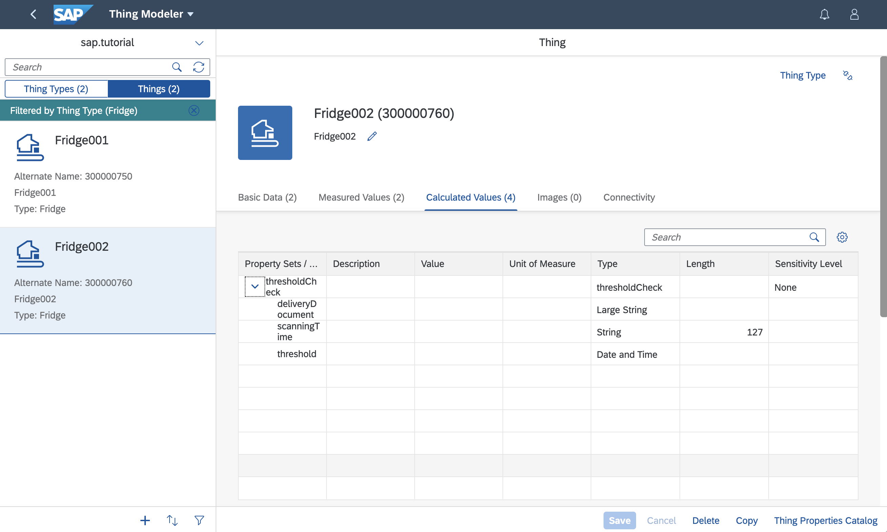

[VALIDATE_1]
[ACCORDION-END]

[ACCORDION-BEGIN [Step 6: ](Set up MQTT.fx)]

Start the `MQTT.fx` application and click on **Settings** icon to change the connection setup. Create a new profile or edit an existing one with the following details for the **MQTT Broker Profile Settings**:

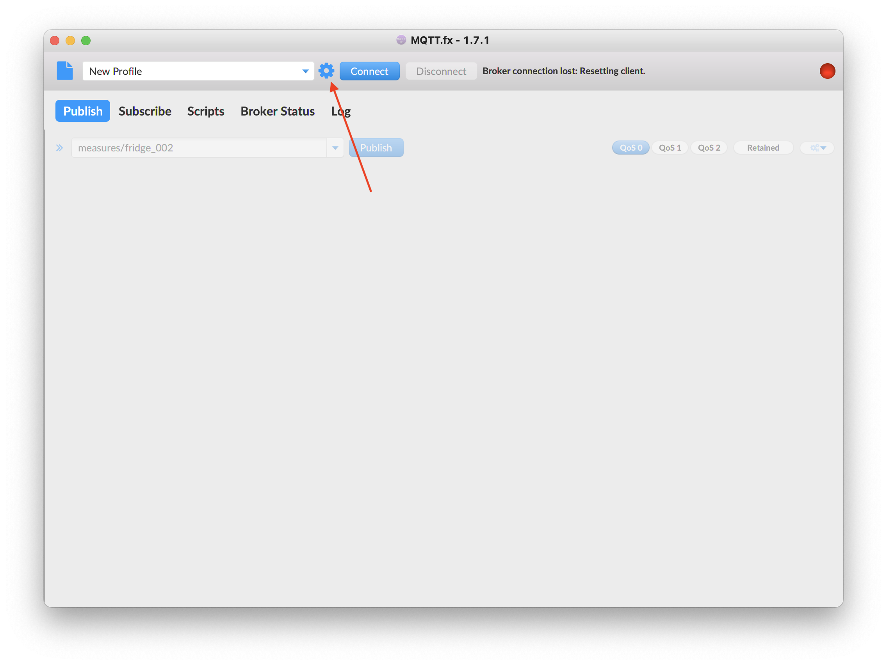

> For more information see [SAP Help Portal on Sending Data with MQTT](https://help.sap.com/viewer/5ada15f8efb64fccad30b87f1d94a068/latest/en-US/7c1018348c7743a8abb950f6d82a4159.html)

| Property Name  | Value                                                                                                                                                      |
| :------------- | :--------------------------------------------------------------------------------------------------------------------------------------------------------- |
| Broker Address | MQTT iot-device-connectivity endpoint which you can retrieve from your service key (e.g. **`1234556-1234-12345-h4563-93193ad8348.eu10.cp.iot.sap`** ) |
| Broker Port    | It's in the MQTT iot-device-connectivity endpoint (usually **`8883`**)                                                                                     |
| MQTT Client Id | Use the router `alternateId` (e.g. **`router_good_quality`**)                                     |

Switch to **`SSL/TLS`**, and check the checkbox **`Enable SSL/TLS`**. Select the radio button **`Self signed certificates in keystores`** and fill up the form as follows:

| Property Name             | Value                                                                                           |
| :------------------------ | :---------------------------------------------------------------------------------------------- |
| Keystore File             | Search for your Java distribution folder and select the file `jre/lib/security/cacerts`         |
| Trusted Keystore Alias    | Leave it empty                                                                                  |
| Trusted Keystore Password | Check with your Java distribution specifications (usually, and if not changed, it's `changeit`) |
| Client Keystore           | Select the JKS file store built starting from the PEM certificate of your router device         |
| Client KeyPair Alias     | Keep it empty                                                                                   |
| Client KeyPair Password  | Use the JKS store password (in this tutorial we have used the same of the PEM certificate)      |
| PEM Formatted             | Keep clear the checkbox                                                                         |

The configurations should look similar to this:

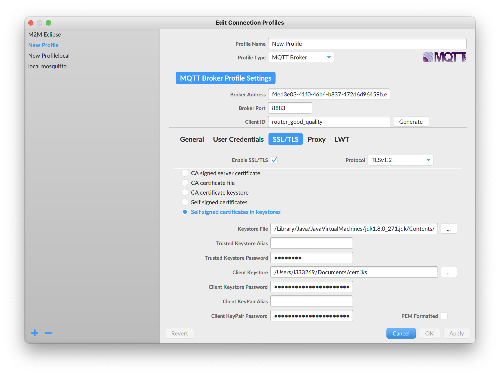

Now you can press **OK** to save the Configuration and press **Connect** to check your connection settings. You now need to maintain the **Topic** in the **Publish** tab and the **Topic** in the **Subscribe** tab:

-   **Topics to subscribe:** You can subscribe multiple topics, for multiple devices, in the format **`ack/<DEVICE_ALTERNATE_ID>`** and press **Subscribe** button (e.g. `ack/fridge_001`, `ack/fridge_002`, `ack/epcis_scanner`)

-   **Topic to publish:** **`measures/<DEVICE_ALTERNATE_ID>`**. Before press **Publish** button, you need also to fill up a valid body

Furthermore you can test if your Device Model is set up correctly and the MQTT connection works by sending a test message as array of JSON objects where the name of each property (e.g. `temperature` ) defined in the capability is the key. You should see a **code 202** message on the subscribed topic.

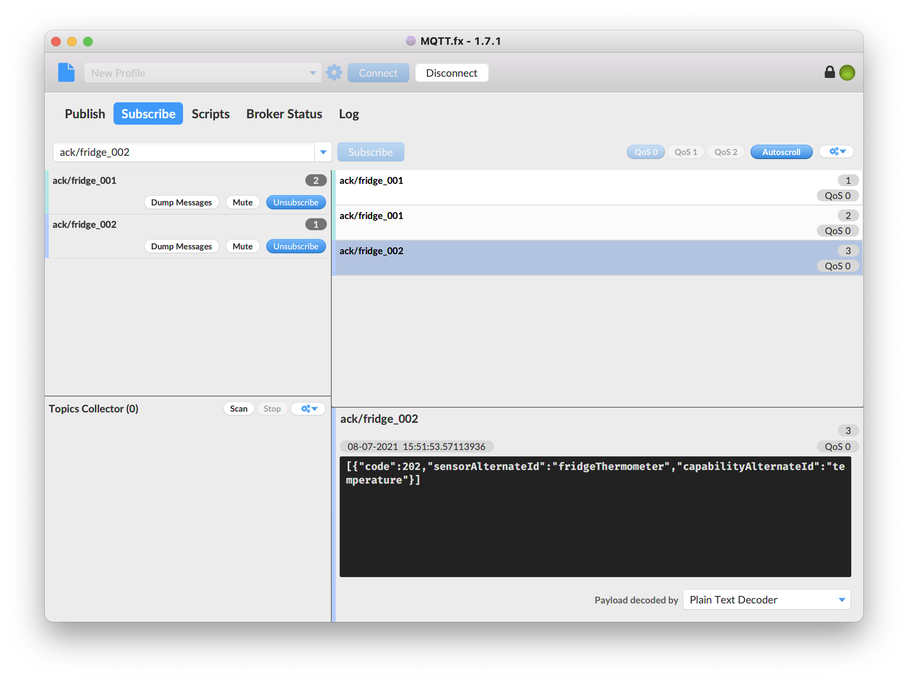

If you have used the `alternateIds` maintained in the Postman collection you can use the following topic `measures/fridge_002` or `measures/fridge_001` with this example payload:

```JSON
{
    "capabilityAlternateId": "temperature",
    "sensorAlternateId": "fridgeThermometer",
    "measures": [{
        "temperature": "21"
      }]
}
```

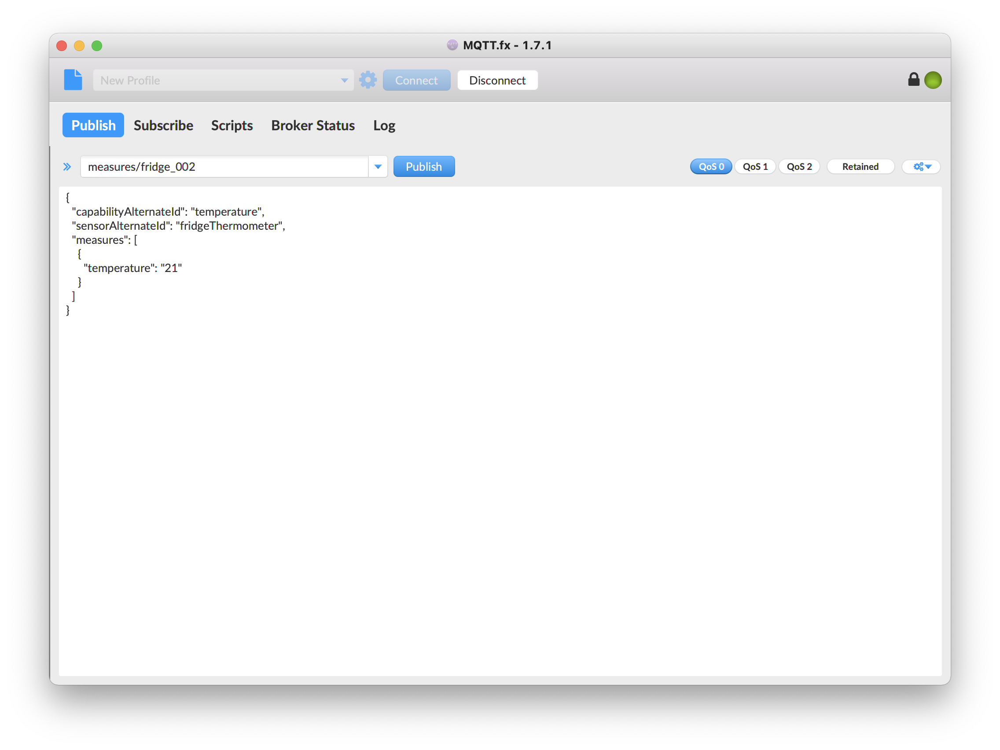

You can also test **EPCIS scanner** using the following topic `measures/epcis_scanner` and this example payload:

```JSON
{
    "capabilityAlternateId": "epcis_data",
    "sensorAlternateId": "epcis_sensor",
    "measures": [{
        "eventxml": "test"
    }]
}
```

[DONE]
[ACCORDION-END]

[ACCORDION-BEGIN [Step 7: ](Ingest EPCIS event)]
Once you have established the connection you can try to send an EPCIS event via MQTT. To do so you have to escape the the XML format based EPCIS and send it is value of `eventxml`. Here you can find an example payload:

```JSON
{
	"capabilityAlternateId": "epcis_data",
	"sensorAlternateId": "epcis_sensor",
	"measures": [{
		"eventxml": "<?xml version=\"1.0\" encoding=\"UTF-8\"?> <epcis:EPCISDocument xmlns:epcis=\"urn:epcglobal:epcis:xsd:1\" xmlns:example=\"http://ns.example.com/epcis\" xmlns:xsi=\"http://www.w3.org/2001/XMLSchema-instance\" creationDate=\"2005-07-11T11:30:47.0Z\" schemaVersion=\"1.2\"> <EPCISBody> <EventList> <ObjectEvent> <recordTime>2021-01-21T20:35:31.116-06:00</recordTime> <eventTime>2021-01-21T20:35:31.116-06:00</eventTime> <eventTimeZoneOffset>-06:00</eventTimeZoneOffset> <epcList> <epc>urn:epc:id:sscc:0614141.1234567800</epc> </epcList> <action>OBSERVE</action> <disposition>urn:epcglobal:cbv:disp:in_process</disposition> <readPoint> <id>Reader_01</id> </readPoint> </ObjectEvent> </EventList> </EPCISBody> </epcis:EPCISDocument>"
	}]
}
```

You can see the result of the ingestion in the **Measured Values** tab of your Thing:

!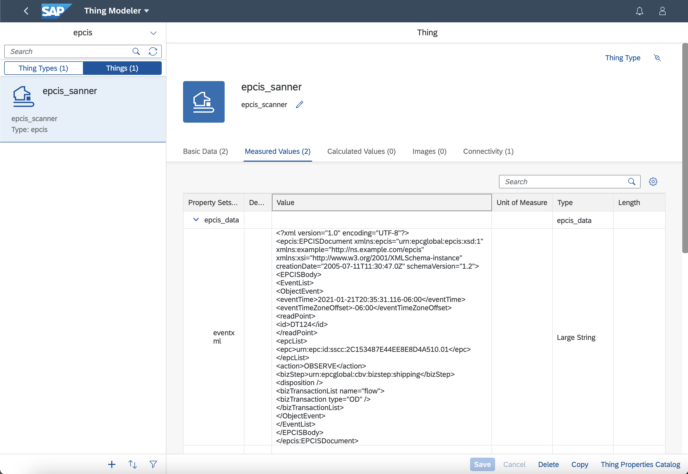

[VALIDATE_2]
[ACCORDION-END]

---
