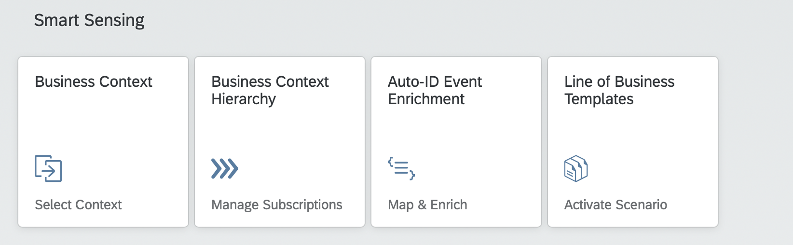
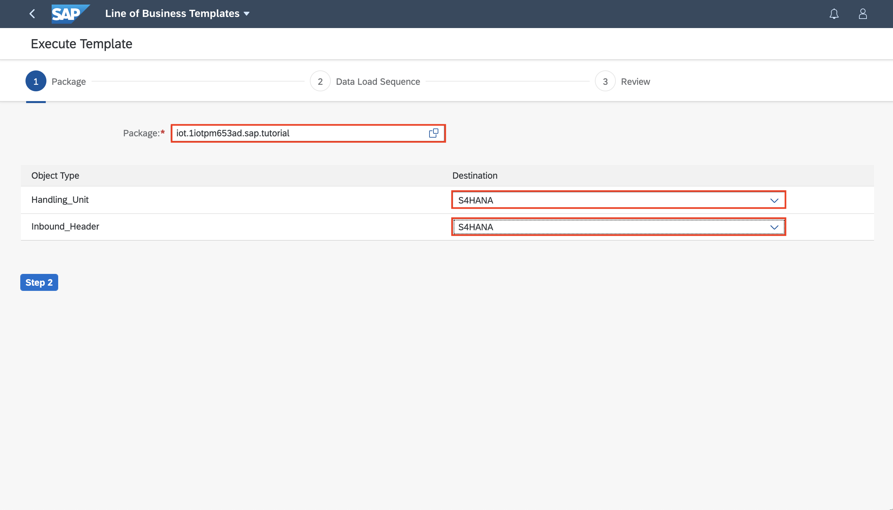
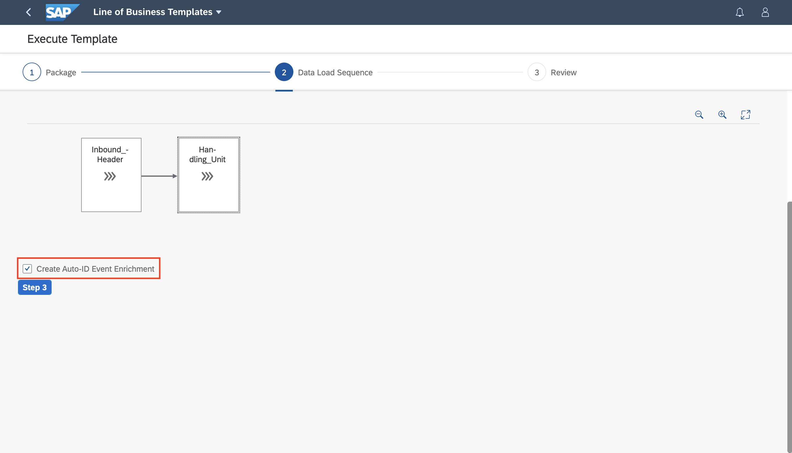
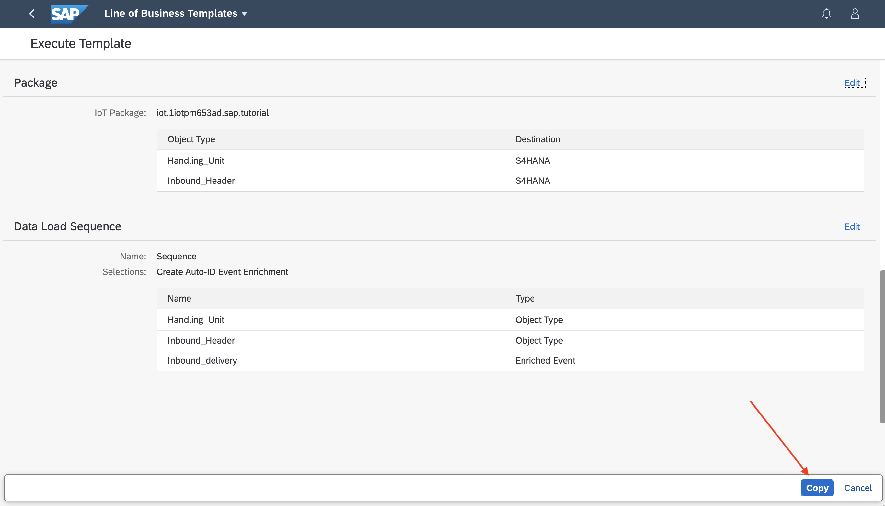
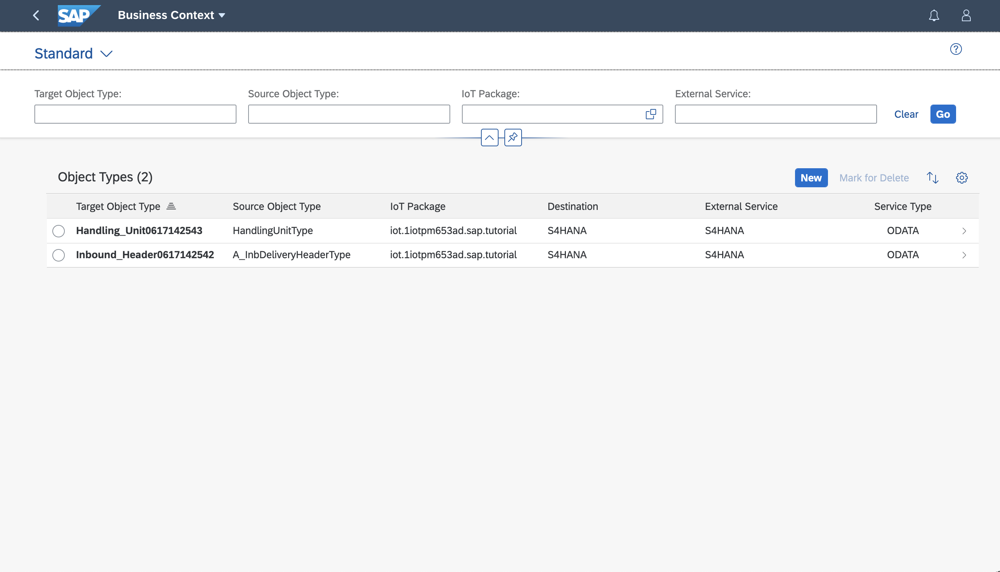
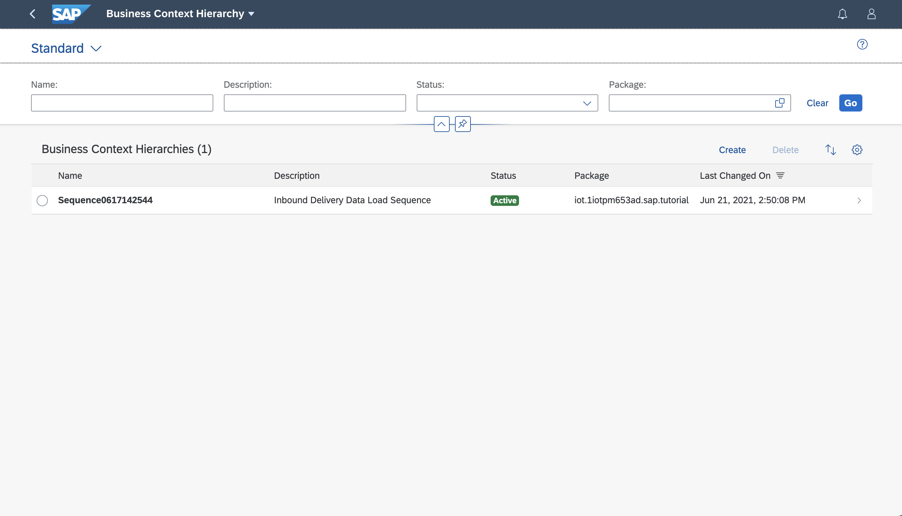
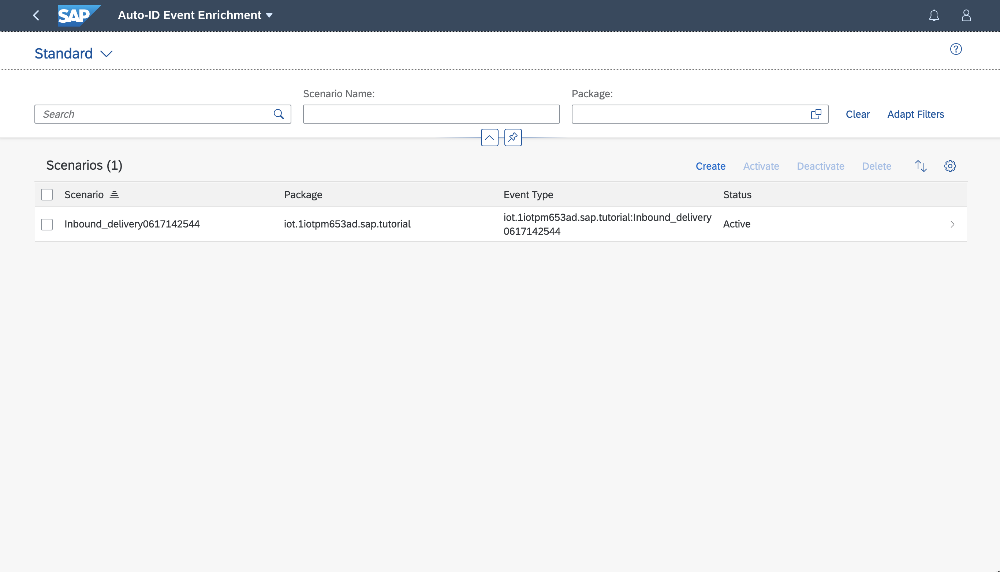

## Prerequisites
-   You have licensed SAP Internet of Things (with the new capacity unit based licensing introduced in August 2020, your company has a Cloud Platform Enterprise Agreement or Pay-As-You-Go for SAP BTP and you have subscribed to the `oneproduct` service plan)
-   You have setup the subscription for SAP IoT in your global account in a tenant (e.g. in the DEV tenant, the guide for the basic setup is at [Get Started with Your SAP IoT Account](https://help.sap.com/viewer/195126f4601945cba0886cbbcbf3d364/latest/en-US/bfe6a46a13d14222949072bf330ff2f4.html) ).
-   Your SAP User has at a minimum the `iot_role_collection` created during onboarding of your tenant and the associated roles (see [SAP Help on Providing Authorizations in](https://help.sap.com/viewer/195126f4601945cba0886cbbcbf3d364/latest/en-US/2810dd61e0a8446d839c936f341ec46d.html) )
-   You have created an empty `package` in SAP Internet of Things (see [SAP Help on Creating a Package](https://help.sap.com/viewer/e057ad687acc4d2d8f2893609aff248b/latest/en-US/5ba36c7bc9af4576997f72d6dddfc951.html) )
-   You have created the destination for the SAP S/4HANA or SAP S/4HANA Cloud APIs as described in [Create SAP S/4HANA destination for Smart Sensing](iot-smartsensing-s4destinations)
-   You have created at least two Inbound Delivery in the [SAP S/4HANA](https://help.sap.com/viewer/2f36056ae9a044bba55bcbad204b7bc5/LATEST/en-US/439204028f9c4c7e9b91f04432db3879.html) or [SAP S/4HANA Cloud](https://help.sap.com/viewer/588780cab2774a7ab9fffca3a7f919fe/LATEST/en-US/439204028f9c4c7e9b91f04432db3879.html) systems

## Details
### You will learn
-   What the new Fiori Apps on Smart Sensing in SAP Internet of Things are about
-   How to activate a pre-delivered Business Template
-   How the Business Templates help you to get started with Smart Sensing easily

Smart Sensing Services in SAP Internet of Things allow you to enable business processes based on Auto-ID Events (e.g. EPCIS events). Those events are usually captured by RFID scanners, gates or similar hardware. The hardware can be connected directly to SAP IoT using MQTT or REST or via a 3rd party gateway.

---

[ACCORDION-BEGIN [Step 1: ](Get to know the Smart Sensing Fiori apps)]
Currently Smart Sensing is a set of five applications.

!

-   **Business Context**

      Here you can set up a data connection to any business system e.g. SAP S/4HANA Cloud and specify the business objects that you're interested in (e.g. `Inbound Delivery` and `Handling Unit`). The selected business objects will be used in the subsequent steps.

-   **Business Context Hierarchy**

      Here you can specify the relationships between various business objects selected in the **Business Context** app. This is a prerequisite for being able to properly fetch all related business objects in the right sequence. Furthermore, you configure when and for which objects the data load should happen.

-   **Auto-ID Event Enrichment**

      Here you can configure the enrichment of incoming scanning events with information form the business objects (e.g. `Inbound Delivery`) as well as with additional properties that have been collected in the scanning event. This enriched Auto-ID events can then be used to design and run rules on them.

-   **Line of Business Templates**

      In this app, you can choose between various predefined templates (e.g. `Inbound Delivery Scenario`) representing selected business scenarios. You are going to use this app in the next steps.

-   **Edge Node Descriptor**      

      This application permits you to define data partitioning used when you are deploying Smart Sensing to edge nodes in the **IoT Edge**. It permits to partition data based on Plant(s) or Warehouse(s).

[DONE]
[ACCORDION-END]

[ACCORDION-BEGIN [Step 2: ](Activate the Inbound Delivery Business Template)]
Open the Fiori launchpad and Navigate to the **Smart Sensing** tab and start to the app **Line of Business Templates** and click **Execute** for the **Inbound Delivery** scenario:

!

1.  On the next screen select your **Package** (in this example a package with name  **`sap.tutorial`** is used ) and your **Destination** created in the previous Tutorial [Create destinations for Quality Control during Goods Receipt APIs](iot-smartsensing-qcgr-destinations) and move on to **Step 2**:

    !

    > Destinations took a while to became visible in SAP IoT, if they are not visible, log off your user and log on it again.

2.  In **Step 2** set the flag for creating sample Auto-ID Event Enrichments and move on to **Step 3**:

    !

3.  Finally review your entries and click **Copy**:

    !

This will trigger the creation of the **Business Context**, **Business Context Hierarchy** and **Auto-ID Event Enrichment** for you. You can see the result in the success message shown.

[DONE]
[ACCORDION-END]

[ACCORDION-BEGIN [Step 3: ](Review the result of the activation)]
You can now use the Smart Sensing apps to review the objects created in Step 2:

-   **Business Context**:

    !

-   **Business Context Hierarchy**:

    !

-   **Auto-ID Event Enrichment**:

    !

[VALIDATE_1]
[ACCORDION-END]

---
