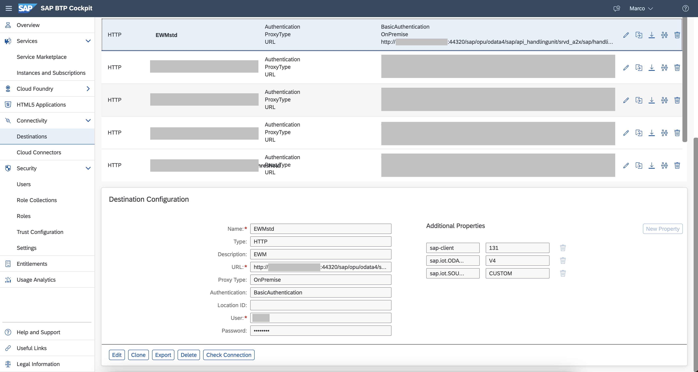
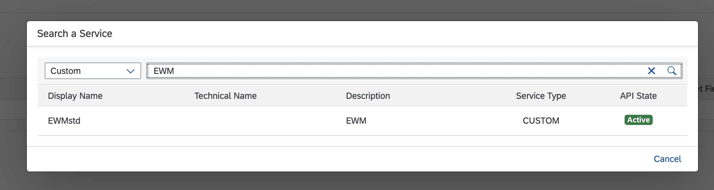
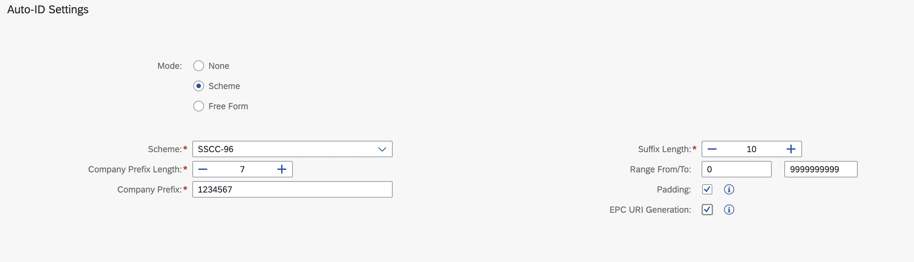
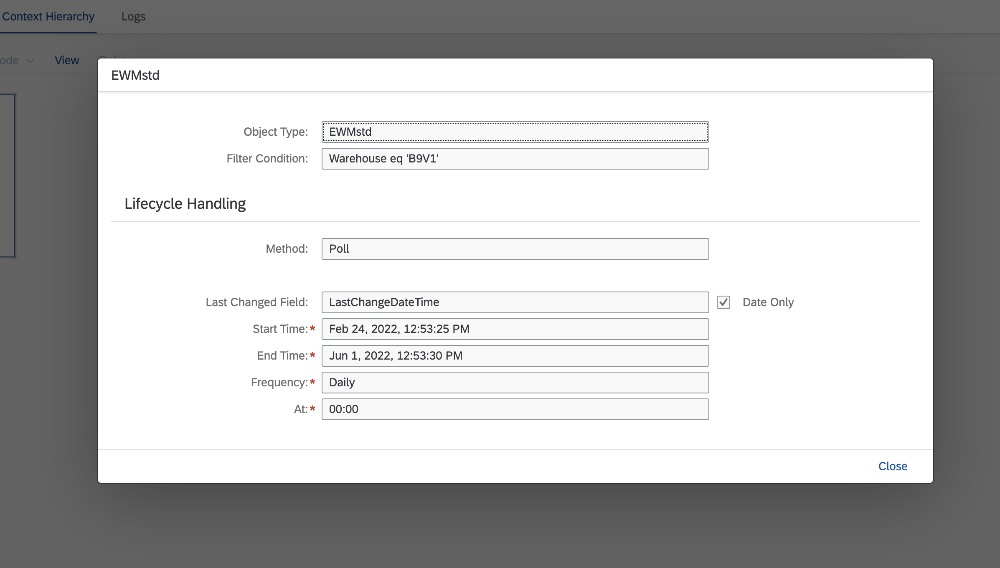
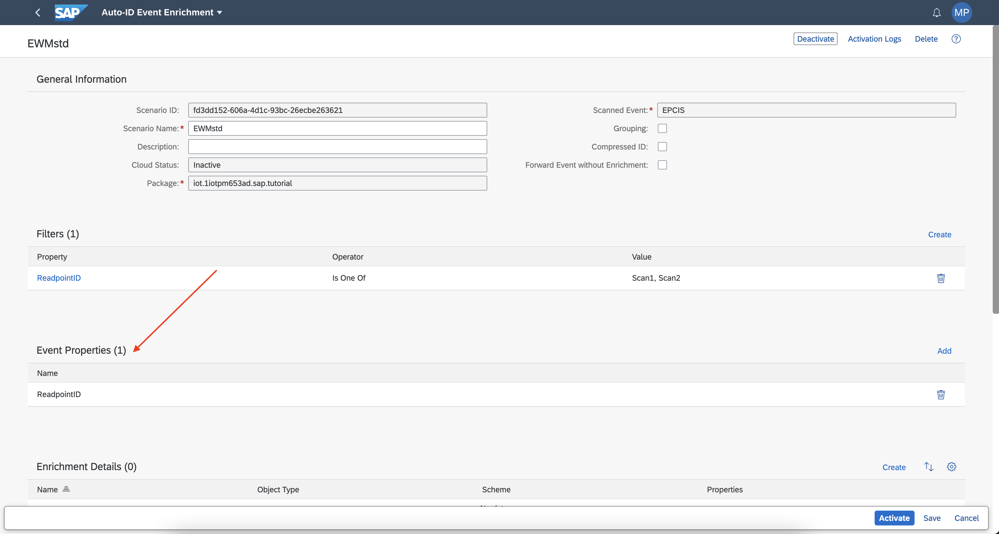
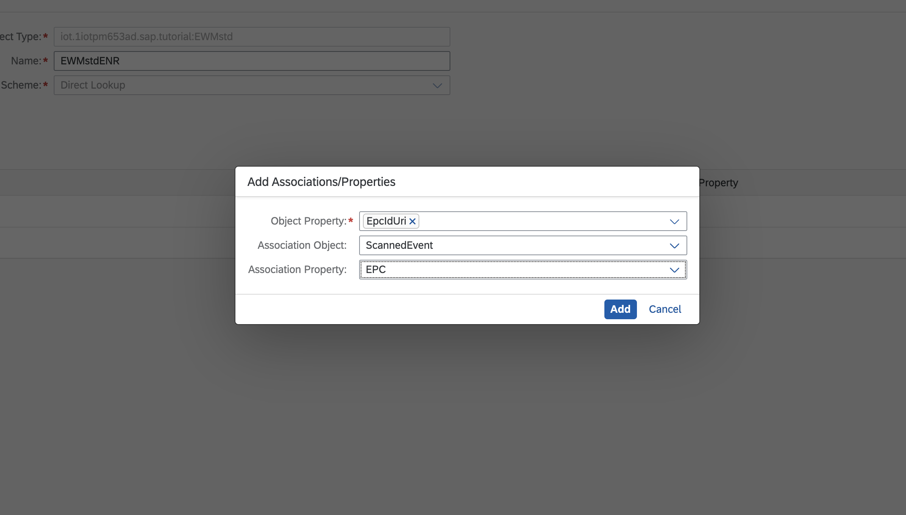
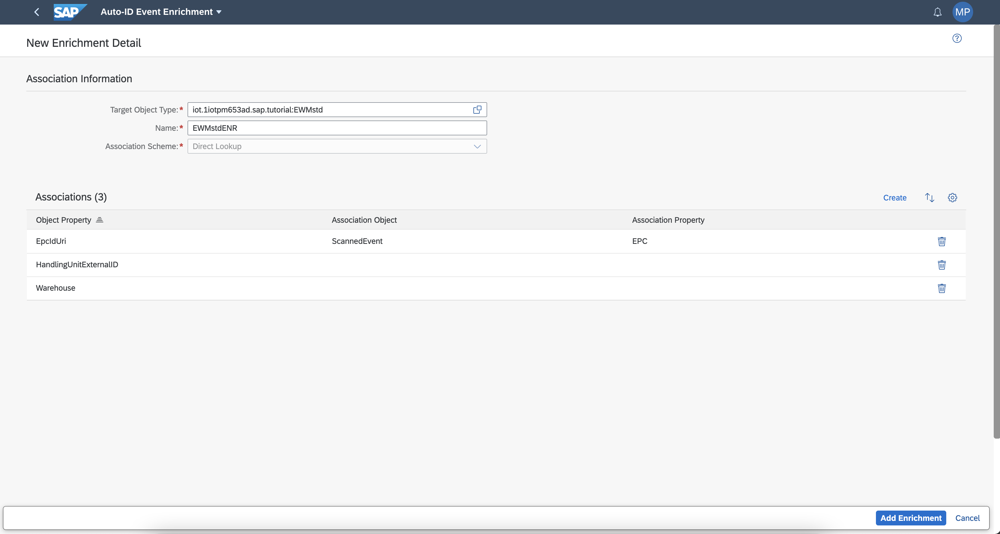
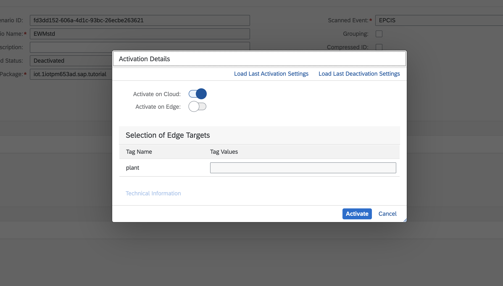

## Prerequisites

-   Basic knowledge of REST and APIs
-   You have licensed SAP Internet of Things (with the new capacity unit based licensing introduced in August 2020, your company has a Cloud Platform Enterprise Agreement or Pay-As-You-Go for SAP BTP and you have subscribed to the `oneproduct` service plan)
-   You have setup the subscription for SAP IoT in your global account in a tenant (e.g. in the DEV tenant, the guide for the basic setup is at [Get Started with Your SAP IoT Account](https://help.sap.com/viewer/195126f4601945cba0886cbbcbf3d364/latest/en-US/bfe6a46a13d14222949072bf330ff2f4.html) ).
-   Your SAP user must at least have the `iot_role_collection` created during onboarding of your tenant and the associated roles (see [SAP Help on Providing Authorizations in SAP IoT](https://help.sap.com/viewer/195126f4601945cba0886cbbcbf3d364/latest/en-US/2810dd61e0a8446d839c936f341ec46d.html) )
-   You have created an empty package in SAP Internet of Things (see [SAP Help on Creating a Package](https://help.sap.com/viewer/e057ad687acc4d2d8f2893609aff248b/latest/en-US/5ba36c7bc9af4576997f72d6dddfc951.html) )

## Details
### You will learn
-   How to import business data from a custom OData service
-   How to create a Smart Sensing scenario based on custom OData services
-   How to use custom implemented OData services in the Actions (i.e.: Load/Unload for SAP Extended Warehouse Management)

---

>In this example we are using a Decentralised **SAP Extended Warehouse Management**, but the same procedure could be applied to any other system exposing custom OData endpoints.

[ACCORDION-BEGIN [Step 1:](Add Destinations)]

Create a Destination which allows you to synchronize business data with your custom OData service. You will use it in the Smart Sensing application of SAP Internet of Things.

1.  Go to your Cloud Foundry subaccount at <https://hana.ondemand.com/>, click **Connectivity** on the left panel and then click **Destinations** and **New Destination**

    !

2.  Under **Destination Configuration**, add the information according to your SAP S/4HANA setup:

    |  Property Name     | Sample Value          | Remark          
    |  :------------- |  :------------- |  :-------------
    |  Name           | **`EWMstd`**  | of your choice |
    |  Type           | `HTTP` |  |
    |  Description    | **`EWMstd`** | of your choice |
    |  URL            | **`http://myonprem.com:44320/sap/opu/odata4/sap/api_handlingunit/srvd_a2x/sap/handlingunit/0001`** | URL of the custom OData service. For this example we are using a Decentralised SAP EWM |
    |  Proxy Type     | `Internet` or `OnPremise`| depending if the system is accessible trough the public internet |
    |  Authentication | `BasicAuthentication`, `OAuth2ClientCredentials` ... | based on your setup in the Communication Arrangement or Cloud Connector |

    >The **URL** field depends on your custom OData service. It could also refer to the implementation of a custom OData endpoint for S/4HANA or Decentralised SAP Extended Warehouse Management (SAP EWM).
    >You can also use it for exposing to Smart Sensing a set of REST APIs which are not available for the existing modules of your ERP system.

3.  Under the **Additional Properties** section, choose **New Property** and add the following property:

    |  Property Name    | Sample Value |     Remark
    |  :-------------   | :-------------    | :-------------
    |  `sap.iot.SOURCE_TYPE`          | **`CUSTOM`** | Identification of the source type |

    This property enables to get the OData destination listed in the SAP IoT Destinations available for Smart Sensing, with type `custom`.

    In this sample, the destination created connects to **Decentralized SAP EWM** custom OData APIs includes two additional properties:

    |  Property Name    | Sample Value |     Remark
    |  :-------------   | :-------------    | :-------------
    |  `sap.iot.ODATA_VERSION`          | **`V4`** | The version of the OData APIs |
    |  `sap-client`          | **`131`** | the `sap client` value |

    !

4.  If you are planning to use a **Decentralized SAP EWM** system, you can implement additional custom OData APIs to implement features which are not currently exposed as REST endpoint. An example of OData implementation for `Load` and `Unload` APIs for EWM is available [in our public GitHub](https://github.com/SAP-samples/sap-iot-samples/tree/main/iot-autoid-services-samples/EWM%20-%20Load%20Unload%20OData%20APIs).

    -  The **Destination** for the `Load`:

    |  Property Name     | Sample Value          | Remark          
    |  :------------- |  :------------- |  :-------------
    |  Name           | **`EWM_custom_load`**  | of your choice |
    |  Type           | `HTTP` |  |
    |  Description    | **`EWM_custom_load`**  | of your choice |
    |  URL            | **`http://myonprem.com:44320/sap/opu/odata/sap/Z_HU_SMART_SENSING_SRV/load?huident='^{lastValue(${EWMstdENR.HandlingUnitExternalID})}'&lgnum='^{lastValue(${EWMstdENR.Warehouse})}'`** | URL of the custom OData `Load` service incl. placeholder tokens for `Handling Unit` and `Warehouse`. The sample is built considering `EWMstdENR` will be your event enrichment name, defined in the next steps of the tutorial.  |
    |  Proxy Type     | `Internet` or `OnPremise`| depending if the system is accessible trough the public internet |
    |  Authentication | `BasicAuthentication`, `OAuth2ClientCredentials` ... | based on your setup in the Communication Arrangement or Cloud Connector |

    >The placeholder tokens `^{lastValue(${EWMstdENR.HandlingUnitExternalID})}` and `^{lastValue(${EWMstdENR.Warehouse})}` are  replaced at runtime by Actions in SAP Internet of Things with the actual values.
    >
    >The value is set trough the event enrichment. The above placeholders contain the `EWMstdENR` string, this is the event enrichment name you will reuse in the next steps. Replace it with the desired value if you are planning to use a different one.

    -  The **Destination** for the `Unload`:

    |  Property Name     | Sample Value          | Remark          
    |  :------------- |  :------------- |  :-------------
    |  Name           | **`EWM_custom_unload`**  | of your choice |
    |  Type           | `HTTP` |  |
    |  Description    | **`EWM_custom_unload`**  | of your choice |
    |  URL            | **`http://myonprem.com:44320/sap/opu/odata/sap/Z_HU_SMART_SENSING_SRV/unload?huident='^{lastValue(${EWMstdENR.HandlingUnitExternalID})}'&lgnum='^{lastValue(${EWMstdENR.Warehouse})}'`** | URL of the custom OData `Unload` service incl. placeholder tokens for `Handling Unit` and `Warehouse`. The sample is built considering `EWMstdENR` will be your event enrichment name, defined in the next steps of the tutorial.  |
    |  Proxy Type     | `Internet` or `OnPremise`| depending if the system is accessible trough the public internet |
    |  Authentication | `BasicAuthentication`, `OAuth2ClientCredentials` ... | based on your setup in the Communication Arrangement or Cloud Connector |

    >Also for the unload, the placeholder tokens `^{lastValue(${EWMstdENR.HandlingUnitExternalID})}` and `^{lastValue(${EWMstdENR.Warehouse})}` are  replaced at runtime by Actions in SAP Internet of Things with the actual values.

[DONE]
[ACCORDION-END]

[ACCORDION-BEGIN [Step 2: ](Create Business Context)]

The creation of a Smart Sensing scenario is done using several applications available in the SAP IoT Fiori Launchpad.

-   **Business Context**

      Here you can set up a data connection to any business system and specify the business objects that you're interested in, including custom OData compatible systems (e.g. SAP EWM). The selected business objects will be used in the subsequent steps.

-   **Business Context Hierarchy**

      Here you can specify the relationships between various business objects selected in the **Business Context** app. This is a prerequisite for being able to properly fetch all related business objects in the right sequence. Furthermore, you configure when and for which objects the data load should happen.

-   **Auto-ID Event Enrichment**

      Here you can configure the enrichment of incoming scanning events with information form the business objects and with additional properties that have been collected in the scanning event. Enriched Auto-ID events can then be used to design and run rules against them.

-   **Line of Business Templates**

      In this app, you can choose between various predefined templates (e.g. `Inbound Delivery Scenario`) representing selected business scenarios. Since this application permits to create standard scenarios, it cannot be used with custom OData endpoints.

1.  Open the **Business Context** application and press **Create** to create a new business context.

2.  Click on **External Service** to start defining the OData endpoint used for this business context.

3.  In the modal screen to **Search a Service**, select `Custom` in the drop down in the top left of the window.

4.  Start searching for the custom OData endpoint defined in the **Destinations** of the Business Technology Platform, by using the textbox, i.e. **`EWMstd`**.

    !

5.  Select your endpoint in the list, i.e. **`EWMstd`**.

    !

6.  Fill the **General Information** with a **Name** of your choice, the previously created **Package** and the **Source Object Type**, i.e: `HandlingUnitType`.

    >The **Source Object Type** content depends on the selected custom OData endpoint used. For the endpoint used in this tutorial we are using the `HandlingUnitType`

    If you would like to set the **Auto-ID Settings** and define the schema for the EPICS event. You can define for example the `SSCC-96` schema and check the **EPC URI Generation** to have the TAG identifiers automatically generated by Smart Sensing.

    !

7.  Once completed press **Save**.

[DONE]
[ACCORDION-END]

[ACCORDION-BEGIN [Step 3: ](Create Business Context Hierarchy)]

1.  Open the **Business Context Hierarchy** application and press **Create** to create a new business context hierarchy.

2.  Type a **Name** and a **Package**. Confirm any configuration message and go to the tab **Business Context Hierarchy**.

3.  Click **Add Root Node** to insert a new element in the hierarchy.

    You can add other root nodes and children, based on the scenario you are implementing. In case of `Load` and `Unload` processes you just need to synchronise the list of handling units.

4.  Select as **Object Type** the business context you have created previously.

    You may also add a filter condition for it, i.e.: `Warehouse eq 'B9V1'`.

    You can also add a **Lifecycle Handling** configuration, i.e.: `Polling`.

    >You can find further references on how to configure the **Lifecycle Handling** [in the following tutorial](iot-autoid-kanban-dls).

    !

    Once completed press **Add** to save your configuration.

5.  If required, create other nodes then press **Activate** and execute the **Initial Load**.

    >You can check the **Initial Load** status in the **Logs** tab.

[DONE]
[ACCORDION-END]

[ACCORDION-BEGIN [Step 4: ](Create Event Enrichment)]

1.  Open the **Auto-ID Event Enrichment** application and press **Create**.

2.  Provide in the **General Information** area a **Name** for the scenario, i.e. **`EWMstd`** and your **Package**. There are few other settings to be aware of:

    -  **Grouping**: If you have used `SSCC-96` schema, you don't need to use this option since it's not supported by the schema.

    -  **Compressed ID**: This could be used to provide the EPC id in the compressed format (without the dot between company code and suffix). Since in this sample the id is automatically generated, with the dot, this field is unchecked.

    -  **Forward Event without Enrichment**: to be checked only if the implemented scenario doesn't need to enrich the event. In this sample it is kept unchecked.

3.  Create the filters for the scenario, i.e.:

    -  **Property**: `ReadpointID`

    -  **Operator**: `Is One Of`

    -  **Value**: `Scan1, Scan2`, or any other scanner id you have.

4.  Add all the required **Event Properties**, i.e.: `ReadpointID`.

    >Only the properties added in the **Event Properties** will be included in the event enrichment and are valued in the runtime of your actions. Properties not included, if used in the actions have undefined as value.

    !

5.  Under **Enrichment Details** press **Create**. You will be asked to save the scenario. Confirm it by pressing the **Save** button.

6.  A new screen is shown fill the details of **Target Object Type** providing the already created object type, i.e.: **`EWMstd`**, and a name of your choice for the enrichment, i.e.: `EWMstdENR`.

    >If You are using the automatic replacement of the tokens in the destination like in the point 4 of the Step 1 (i.e.: `Load` or `Unload` destination), you need to provide for the enrichment name the same token identifier provided inside the destination (excluding the event property), in this case `EWMstdENR`.  

7.  Under **Association** press **Create**. Define an association for the **Object Property** `EpcIdUri` and use as **Association Object** the `Scanned Event`. Finally set the **Association Property** with `EPC`.

    !

8.  Define all the other object properties you would like to have included in the enrichment. It's specific for the implemented scenario; in this sample the **`HandlingUnitExternalID`** and the **`Warehouse`** are also included without defining any **Association Object** nor **Association Property**.

    !

9.  Once completed press **Add Enrichment**. Press **Activate**, select the targets (i.e.: **Activate on Cloud**) and press **Activate** again to complete the process.

    !

[DONE]
[ACCORDION-END]

[ACCORDION-BEGIN [Step 3: ](Create Actions)]

The EPCIS event management is completed. The next operation will be to setup a set of rules and actions to implement the business process.

You can find how to set rules and actions for a Smart Sensing scenario in the following tutorial to [Create Custom Kanban Event, Rule Project and Action](iot-autoid-kanban-custom-event).

For the SAP EWM system, you might create a rule to check for `EPCISEvent.ReadpointID = 'Scan1'`: In this case the `EWM_custom_load` destination is invoked and the load process is automatically executed.

In case of `EPCISEvent.ReadpointID = 'Scan2'`, the `EWM_custom_unload` destination is invoked and the unload process is automatically completed.

[VALIDATE_2]
[ACCORDION-END]

---
