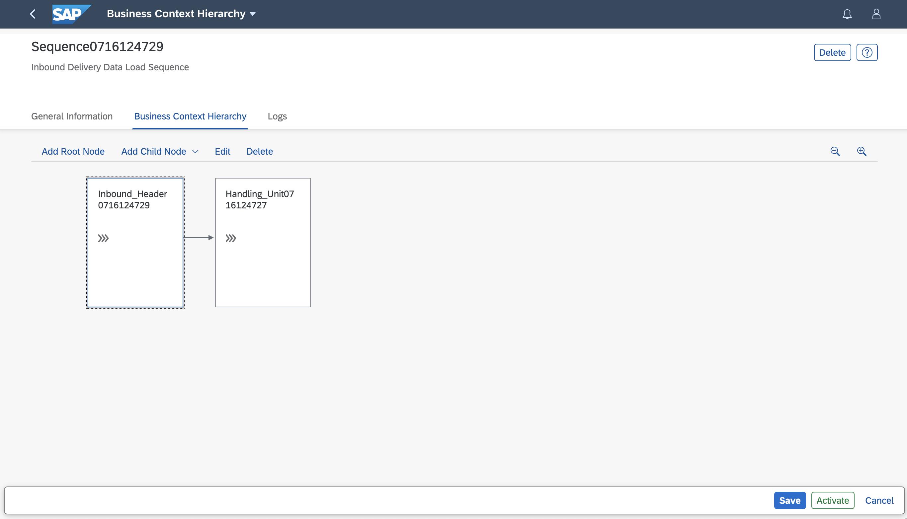
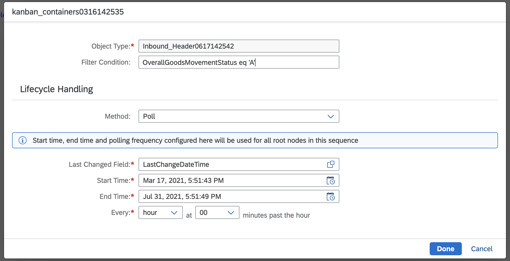
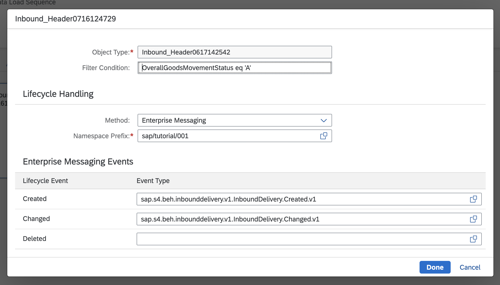
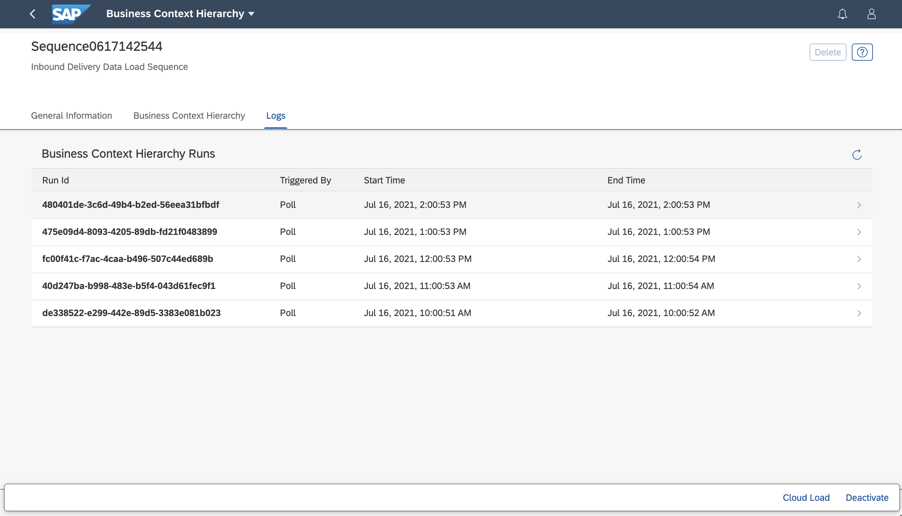
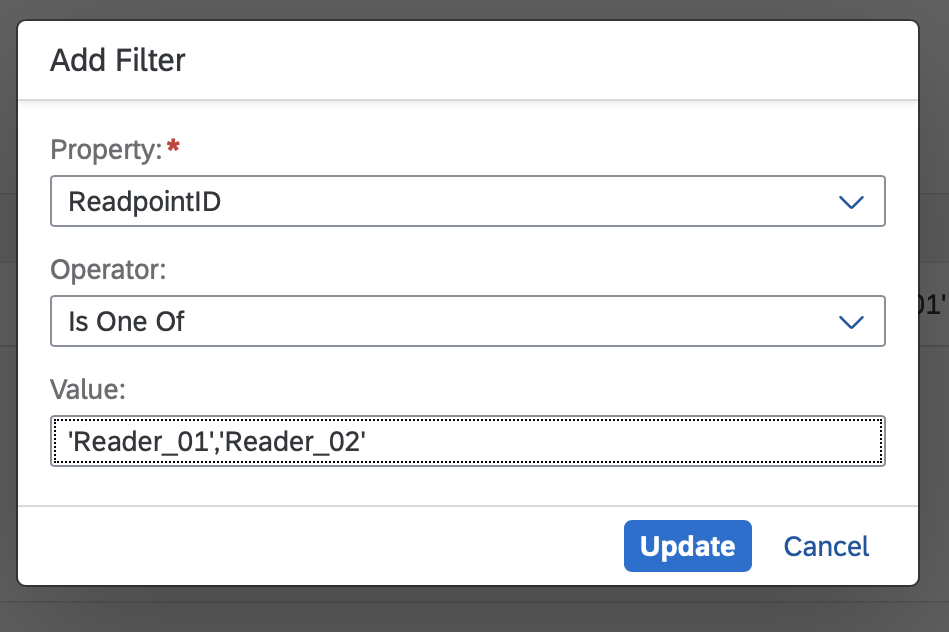

## Prerequisites
-   You have licensed SAP Internet of Things (with the new capacity unit based licensing introduced in August 2020, your company has a Cloud Platform Enterprise Agreement or Pay-As-You-Go for SAP BTP and you have subscribed to the `oneproduct` service plan)
-   You have setup the subscription for SAP IoT in your global account in a tenant (e.g. in the DEV tenant, the guide for the basic setup is at [Get Started with Your SAP IoT Account](https://help.sap.com/viewer/195126f4601945cba0886cbbcbf3d364/latest/en-US/bfe6a46a13d14222949072bf330ff2f4.html) ).
-   Your SAP User has at a minimum the `iot_role_collection` created during onboarding of your tenant and the associated roles (see [SAP Help on Providing Authorizations in](https://help.sap.com/viewer/195126f4601945cba0886cbbcbf3d364/latest/en-US/2810dd61e0a8446d839c936f341ec46d.html) )
-   You have created destinations for the Goods Receipt API as described in [Create SAP S/4HANA destination for Smart Sensing](iot-smartsensing-s4destinations) and [Create Destinations for Inbound Delivery APIs and Scanning Event](iot-smartsensing-qcgr-destinations)
-   You have created Business Context Hierarchy using the [Activate Business Template for Inbound Delivery](iot-smartsensing-inbounddelivery-template) tutorial.
-   Optional for Event based setup: You have subscribed to SAP Event Mesh and created a Service Instance of it [SAP Help Portal on Creating an Event Mesh Service Instance](https://help.sap.com/viewer/bf82e6b26456494cbdd197057c09979f/Cloud/en-US/d0483a9e38434f23a4579d6fcc72654b.html)
-   Optional for Event based setup: You have setup the Business Event Handling in your SAP S/4HANA or SAP S/4HANA Cloud system according to [Scope Item 1NN](https://rapid.sap.com/bp/#/browse/scopeitems/1NN)

## Details
### You will learn
-   How the Business Context Hierarchy works
-   How to configure the Business Context Hierarchy to use OData polling or SAP Event Mesh
-   How to activate the Business Context Hierarchy

The Business Context Hierarchy (created by activating the inbound Delivery template) needs to be adjusted to use SAP Enterprise Mesh or polling via OData to query the business data from SAP S/4HANA or SAP S/4HANA Cloud. Furthermore the Auto-ID Event Enrichment needs to be adjusted and activated by you.

SAP Event Mesh enables you to trigger a data load based on Business Event send near real-time.

---

[ACCORDION-BEGIN [Step 1: ](Access your Business Context Hierarchy)]

The **Business Context Hierarchy** for Inbound Delivery defines how the business objects shall be retrieved from SAP S/4HANA Cloud. To view or edit open the app **Business Context Hierarchy** from the Fiori Launchpad in you SAP Internet of Things tenant and search for your Hierarchy (e.g. by filtering on you package name) and open it. In the **General Information** tab you can see **Name**, **Description**, **Package** and the **Activation Status** of the hierarchy. For now leave it in status **Inactive** continue with the next Step.

[DONE]
[ACCORDION-END]

[ACCORDION-BEGIN [Step 2: ](Adjust the data load)]

You now need to adjust the hierarchy for the business objects from your SAP S/4HANA Cloud system. You can either use **SAP Event Mesh** to trigger a data load based on Business Event send by SAP S/4HANA Cloud or using **OData polling**.

> Use the two tabs above to select the option of your choice (SAP Event Mesh or OData polling). The content of this step is then adjusted automatically.

- Open the App **Business Context Hierarchy** and open your sequence which you have created following the tutorial [Activate Business Template for Inbound Delivery](iot-smartsensing-inbounddelivery-template). Switch to the tab **Business Context Hierarchy** and select the available **Root Node** to activate the **Edit** button:

    !

[OPTION BEGIN [OData Polling]]

-   If you would like to use the polling mechanism via OData you have to choose  `Poll` as **Method** and enter the following in the shown dialog:

    |  Property Name    | Value           | Remark
    |  :-------------   | :-------------  | :-------------
    |  `Filter Condition`       | e.g **`OverallGoodsMovementStatus eq 'A'`** | of your choice, here we are filtering all the Inbound Deliveries with Status `Open` defined in SAP S/4HANA Cloud |
    |  `Last Changed Field`     | e.g. **`LastChangeDate`** | of your choice  |
    |  `Start Time`             | e.g. **`Today`** | of your choice |
    |  `End Time`               | e.g. **`next two weeks`** | of your choice |
    |  `Every`                  | e.g. **`hour at 00 minutes past the hour'`** | of your choice |

At the end the configuration should look as follows:

!

Finally press **Done** and continue with the next Step.

[OPTION END]

[OPTION BEGIN [SAP Event Mesh]]

-   If you would like to use SAP Event Mesh select as the **Method** `Enterprise Messaging` and enter the following in the shown dialog:

    |  Property Name    | Value           | Remark
    |  :-------------   | :-------------  | :-------------
    |  `Filter Condition`          | **`OverallGoodsMovementStatus eq 'A'`** | of your choice, here we are filtering all the Inbound Deliveries with Status `Open` defined in SAP S/4HANA Cloud
    |  `Namespace Prefix`     | **`sap/name/001`** | The prefix you have chosen for your SAP Event Mesh Instance. You can also look it up in the **Service Key** of the SAP Enterprise Mesh Instance.

-   Select the **Event Type** `sap.s4.beh.inbounddelivery.v1.InboundDelivery.Created.v1` as **Created Lifecycle Event** and `sap.s4.beh.inbounddelivery.v1.InboundDelivery.Changed.v1` as **Changed Lifecycle Event**. If you like you can also use the value help to explore all available **Event Types**.

At the end the configuration should look as follows:

!

Finally press **Done** and continue with the next Step.

[OPTION END]

[DONE]
[ACCORDION-END]

[ACCORDION-BEGIN [Step 3:](Activate your Business Context Hierarchy)]

After making the necessary changes you can go ahead an **Activate** your hierarchy. By doing so the configured data load will start. You can see the process of the data load by looking at the **Logs** inside your **Business Context Hierarchy** configuration:

!

[DONE]
[ACCORDION-END]

[ACCORDION-BEGIN [Step 4:](Adjust and activate Event Enrichment)]
The **Event Enrichment** configures which scanner devices ( `ReadpointID` ) used to determine the presence, absence, or movement of the business objects you're interested in. Moreover, you associate information from the business object with additional properties that have been collected in the scanning event.

To view or edit the enrichment open the app **Auto-ID Event Enrichment** from the Fiori Launchpad in you SAP Internet of Things tenant and search for you scenario (e.g. by filtering on your package name) and open it.

In the **Filters** section you can see a predefined filter on `ReadpointID`. Change this to **Is One Of** and **`Reader_01, Reader_02`** by clicking on the **Property** name:

!

After doing so you can go ahead and set the **Event Enrichment** to active by clicking the **Activate** button.

[VALIDATE_1]
[ACCORDION-END]

---
