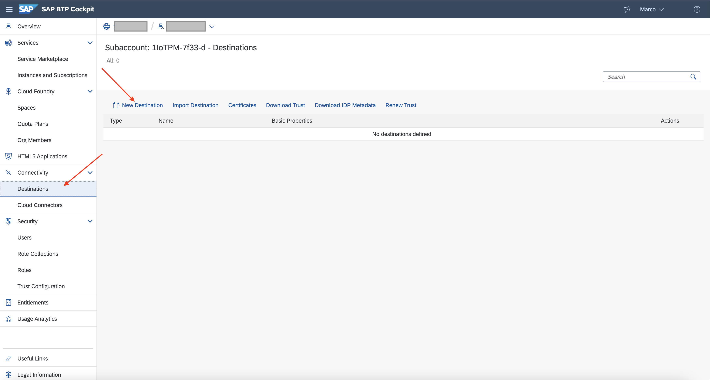

## Prerequisites
- Your `accounts.sap.com` user has been added to this tenant as a `OrgManager`, `SpaceManager` or `SpaceDeveloper` to manage destinations.
- You have setup the APIs for the `Inbound Delivery` and `Handling Unit` in your SAP S/4HANA system including SAP Cloud Connector setup. See [API Business Hub Inbound Delivery](https://api.sap.com/api/API_INBOUND_DELIVERY_SRV_0002/overview), [API Business Hub Handling Unit](https://api.sap.com/api/HANDLINGUNIT_0001/overview) and [SAP Help Portal on SAP Cloud Connector](https://help.sap.com/viewer/cca91383641e40ffbe03bdc78f00f681/Cloud/en-US/e6c7616abb5710148cfcf3e75d96d596.html) for further information.
- You have already started a Line of Business Inbound Delivery Template [Activate Business Template for Inbound Delivery](iot-smartsensing-inbounddelivery-template)

## Details
### You will learn
- How to create a destination to post Goods Receipts in SAP S/4HANA or SAP S/4HANA Cloud
- How to create a destination to ingest event data via Actions in SAP Internet of Things
- How to create a destination to read Snapshot data from SAP Internet of Things via Actions
- How to specify the SAP Internet of Things specific additional properties in the destination

Destinations are key building blocks in SAP Business Technology Platform, and are used to define connections for outbound communication from your application to remote systems. Here we would like to define connections to your SAP S/4HANA or SAP S/4HANA Cloud system.

---

[ACCORDION-BEGIN [Step 1: ](Create destination for the creation of Goods Receipt)]
Create a Destination which will allow you to create a Goods Receipt. You will invoke it in upcoming tutorials to create an **Action** in SAP Internet of Things.

1.  Go to your Cloud Foundry subaccount at <https://hana.ondemand.com/>, click **Connectivity** on the left panel and then click **Destinations** and **New Destination**

    !

2.  Under **Destination Configuration**, add the information according to your SAP S/4HANA setup:

    |  Property Name     | Value          | Remark          
    |  :------------- |  :------------- |  :-------------
    |  Name           | **`E5Z_PostGoodsReceipt_SAP_COM_0106`**  | of your choice, will be used in SAP IoT Action |
    |  Type           | `HTTP` |  |
    |  Description    |  | of your choice |
    |  URL            | **`https://my300000.s4hana.ondemand.com/sap/opu/odata/sap/API_INBOUND_DELIVERY_SRV;v=0002/PostGoodsReceipt?DeliveryDocument='^{lastValue(${thresholdCheck.deliveryDocument})}'`** | URL to the Goods Receipt API incl. placeholder tokens of your SAP S/4HANA Cloud system or Virtual Host for SAP S/4HANA |
    |  Proxy Type     | `Internet` or `OnPremise`| depending on Cloud or On-premise system |
    |  Authentication | `BasicAuthentication`, `OAuth2ClientCredentials` ... | based on your setup in the Communication Arrangement or Cloud Connector |

    > The placeholder tokens `^{lastValue(${thresholdCheck.deliveryDocument})}` is replaced at runtime of Actions in SAP Internet of Things with the actual values. The value of the `Delivery Document` will be set in the calculated measurement with an Action executed for every scanning event. It's also indirectly leveraging the last Destination created in this tutorial.
    >   For further information see [SAP Help on Creating an Action](https://help.sap.com/viewer/1ab61090ec4c4c779cd4360372ab95b5/latest/en-US/4f3f9a4388fa4df8b55260a8deca1c0d.html)

3.  Choose **New Property** under Additional Properties and add the following properties:

    |  Property Name    | Value |     Remark
    |  :-------------   | :-------------    | :-------------
    |  `sap.iot.etagURL`          | **`https://my300000.s4hana.ondemand.com/sap/opu/odata/sap/API_INBOUND_DELIVERY_SRV;v=0002/A_InbDeliveryHeader('^{lastValue(${thresholdCheck.deliveryDocument})}')`** | URL to the Goods Receipt APIs incl. placeholder tokens of your SAP S/4HANA Cloud system or Virtual Host for SAP S/4HANA |
    |  `sap.iot.XcsrfURL`     | **`https://my300000.s4hana.ondemand.com/sap/opu/odata/sap/API_INBOUND_DELIVERY_SRV;v=0002/A_InbDeliveryHeader('^{lastValue(${thresholdCheck.deliveryDocument})}')`**  | URL to the Goods Receipt APIs incl. placeholder tokens of your SAP S/4HANA Cloud system or Virtual Host for SAP S/4HANA |

    > The property `sap.iot.etagURL` retrieves and adds an `ETag` Token during Action execution. It is an identifier for a specific version of a resource and helps to prevent simultaneous updates of a resource from overwriting each other.
    >
    > SAP systems are often requiring a `CRSF` token. The destination definition can be enhanced using the property `sap.iot.XcsrfURL` to retrieve and add it during the Action execution.

4.  Check **Use default JDK truststore** and **Save** the Destination.

[DONE]
[ACCORDION-END]

[ACCORDION-BEGIN [Step 2: ](Create destination to read Property Set last values)]

This destination allows to read the last status of the existing violations to be able to combine it with the EPCIS events details and transfer it all together inside derived data. You will invoke it in upcoming tutorials to create an **Action** in SAP Internet of Things.

1.  Go again to your Cloud Foundry subaccount click **Connectivity** on the left panel and then click **Destinations** and **New Destination**.

2.  Under **Destination Configuration**, add the information according to your SAP Internet of Things setup:

    |  Property Name  | Value          | Remark
    |  :---------------------- | :------------- | :-------------
    |  Name                   | **`snapshotAPI_select_thresholdCheck_threshold`**  | of your choice, will be used in SAP IoT Action |
    |  Type                   | `HTTP` |  |
    |  Description            | **`Last Status API`**  | of your choice |
    |  URL                    | **`https://appiot-mds.cfapps.eu10.hana.ondemand.com/Snapshot
    (thingId='^{lastValue(${<HANDLING_UNIT_SEQUENCE_ID>.HandlingUnitExternalID})}',fromTime='',dataCategory='')
    ?$select=thresholdCheck/threshold`** | URL to the SAP Internet of Things API to ingest data. Replace in the destinations the value of the place holders **`<HANDLING_UNIT_SEQUENCE_ID>`** with the value generated with the **Line of Business Template** (you can found it in the **Business Context** application).  |
    |  Proxy Type             | `Internet` |  |
    |  Authentication         | `OAuth2ClientCredentials` |  |
    |  Client ID              |  | Use the client id for SAP IoT authentication. It's contained in the Service Keys. |
    |  Client Secret          |  | Use the client secret for SAP IoT authentication. It's contained in the Service Keys. |
    |  Token Service URL      | `https://xxxxxxx.authentication.eu10.hana.ondemand.com/oauth/token` | Use the `url` field of the `uaa` node contained in the Service Keys of SAP IoT and add at the end `/oauth/token`. |
    |  Token Service User     |  | Keep it empty. |
    |  Token Service Password |  | Keep it empty. |

    > The **service keys** could be created directly in the Business Technology Platform.
    > For further information see [SAP Internet of Things Security](https://help.sap.com/viewer/2903b4da5b77448498f36d5769803776/LATEST/en-US/6713e1ea264b42ecb8334e7c2222159e.html)

3.  Check **Use default JDK truststore** and **Save** the Destination.

[DONE]
[ACCORDION-END]

[ACCORDION-BEGIN [Step 3: ](Create destination for data ingestion)]

Create another Destination which will allow you to ingest data contained in the EPCIS events and transfer it inside derived data. You will invoke it in upcoming tutorials to create an **Action** in SAP Internet of Things.

1.  Go again to your Cloud Foundry subaccount click **Connectivity** on the left panel and then click **Destinations** and **New Destination**.

2.  Under **Destination Configuration**, add the information according to your SAP Internet of Things setup:

    |  Property Name  | Value          | Remark
    |  :---------------------- | :------------- | :-------------
    |  Name                   | **`scanningEvent`**  | of your choice, will be used in SAP IoT Action |
    |  Type                   | `HTTP` |  |
    |  Description            | **`Data Ingestion`**  | of your choice |
    |  URL                    | **`https://appiot-mds.cfapps.eu10.hana.ondemand.com/ThingsByAlternateId
      ('^{lastValue(${<HANDLING_UNIT_SEQUENCE_ID>.HandlingUnitExternalID})}')/
      <FULL_QUALIFIED PACKAGE>:Fridge/thresholdCheck`** | URL to the SAP Internet of Things API to ingest data. Replace in the destinations the value of the place holders **`<HANDLING_UNIT_SEQUENCE_ID>`** with the value generated with the **Line of Business Template** (you can found it in the **Business Context** application). Replace also **`<FULL_QUALIFIED PACKAGE>`** with the full qualified package of your property set (you can found it in the **Business Context** application in the column **IoT Package**) |
    |  Proxy Type             | `Internet` |  |
    |  Authentication         | `OAuth2ClientCredentials` |  |
    |  Client ID              |  | Use the client id for SAP IoT authentication. It's contained in the Service Keys. |
    |  Client Secret          |  | Use the client secret for SAP IoT authentication. It's contained in the Service Keys. |
    |  Token Service URL      | `https://xxxxxxx.authentication.eu10.hana.ondemand.com/oauth/token` | Use the `url` field of the `uaa` node contained in the Service Keys of SAP IoT and add at the end `/oauth/token`. |
    |  Token Service User     |  | Keep it empty. |
    |  Token Service Password |  | Keep it empty. |

3.  Check **Use default JDK truststore** and **Save** the Destination.

[VALIDATE_3]
[ACCORDION-END]

---
