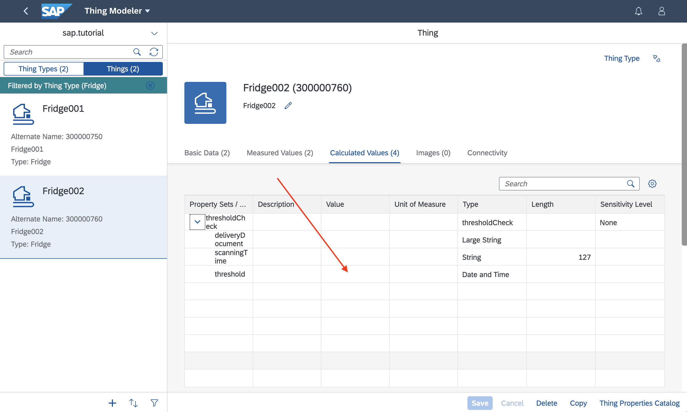
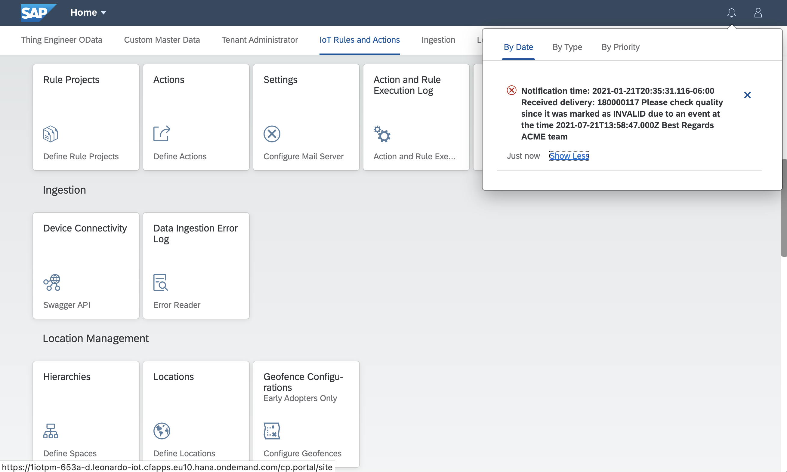
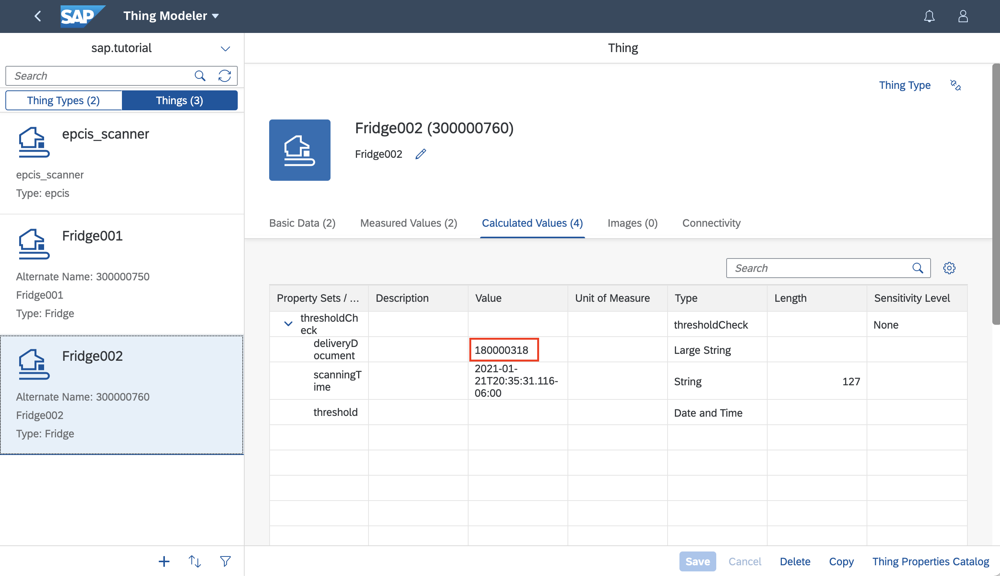
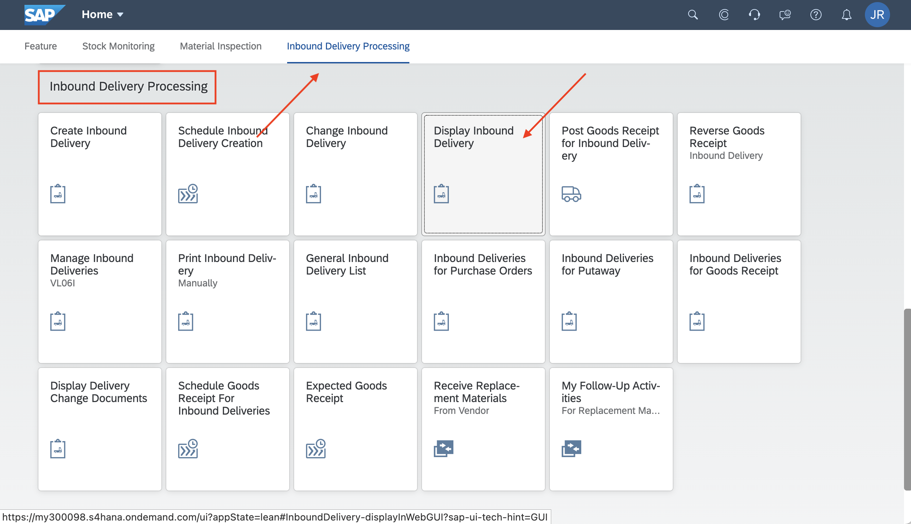
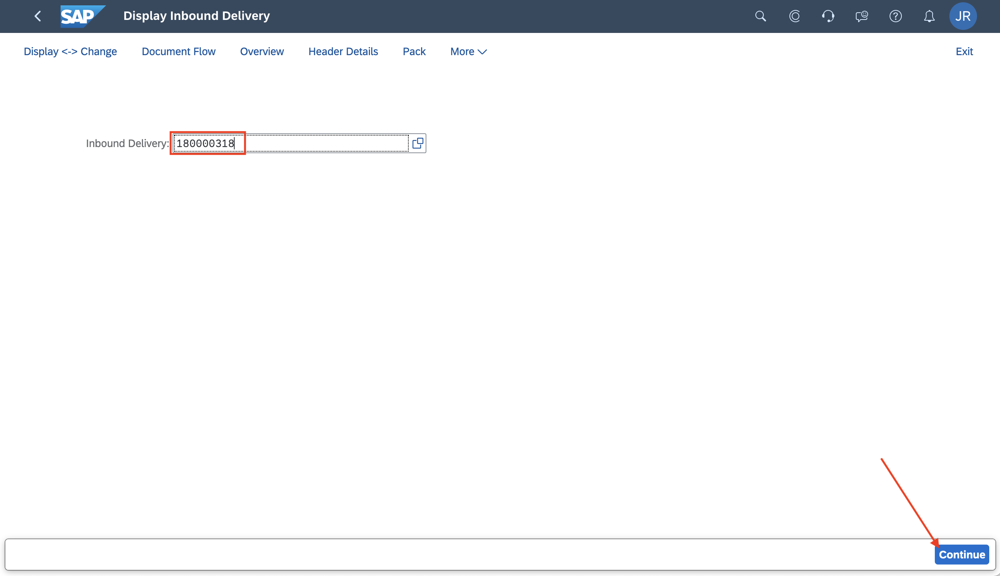
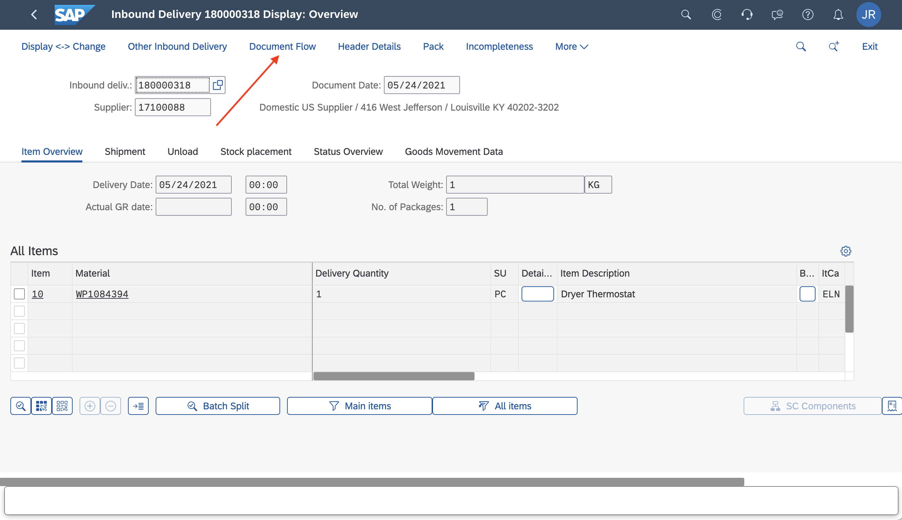
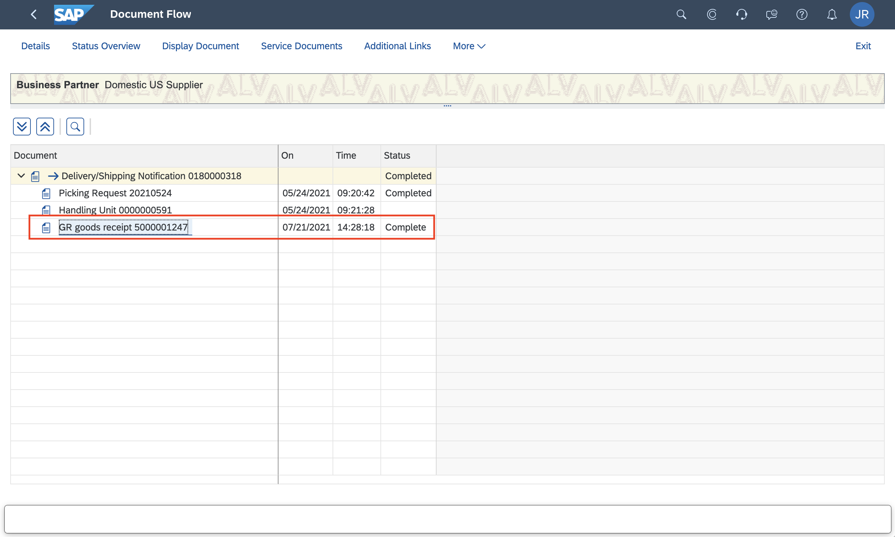

## Prerequisites
-   You have licensed SAP Internet of Things (with the new capacity unit based licensing introduced in August 2020, your company has a Cloud Platform Enterprise Agreement or Pay-As-You-Go for SAP BTP and you have subscribed to the `oneproduct` service plan)
-   You have setup the subscription for SAP IoT in your global account in a tenant (e.g. in the DEV tenant, the guide for the basic setup is at [Get Started with Your SAP IoT Account](https://help.sap.com/viewer/195126f4601945cba0886cbbcbf3d364/latest/en-US/bfe6a46a13d14222949072bf330ff2f4.html) ).
-   Your SAP User has at a minimum the `iot_role_collection` created during onboarding of your tenant and the associated roles (see [SAP Help on Providing Authorizations in](https://help.sap.com/viewer/195126f4601945cba0886cbbcbf3d364/latest/en-US/2810dd61e0a8446d839c936f341ec46d.html) )
-   You have created and setup the Inbound Delivery **Business Context Hierarchy** and **Auto-ID Event Enrichment** using the [Activate Business Template for Inbound Delivery](iot-smartsensing-inbounddelivery-template) and [Adjust the Business Context Hierarchy for Inbound Delivery](iot-smartsensing-quality-control-business-context-hierarchy) tutorials.
-   You have created destinations for the Goods Receipt API as described in [Create SAP S/4HANA Destination for Smart Sensing](iot-smartsensing-s4destinations) and [Create destinations for Inbound Delivery APIs and scanning event](iot-smartsensing-quality-control-goods-receipt-destinations)
-   You have created your Rule Project and Action as described in [Create Rule Projects and Actions For Quality Control of Goods Receipt scenario](iot-smartsensing-quality-control-rules-actions)
-   You have access to your SAP S/4HANA Cloud system and your user has a role collection assigned the includes the Business Catalog `SAP_LE_BC_IDLV_DISPLAY_PC`

## Details
### You will learn
-   How to ingest IoT data to create different conditions of the current delivery and identify alerts
-   How to maintain the EPC ID of you business object instance
-   How to ingest an EPCIS event that triggers the creation of a Goods Receipt
-   How to ingest an EPCIS event that triggers the creation of a Quality Control notification
-   How to review the Inbound Delivery process flow in SAP S/4HANA or SAP S/4HANA Cloud

---

[ACCORDION-BEGIN [Step 1: ](Ingest IoT data)]

In this tutorial we will create the Good Receipt for one device and a Quality Control notification for the other.
To permit the creation of a Good Receipt we will send data for one of the two Things (e.g. `Fridge002`) always below the threshold you have set with the **Derivation Rule**, and we will send data for the other (e.g. `Fridge001`) over the threshold value to be able to test also the Quality Check scenario.

1.   Open the **Thing Modeler** application and check the Thing you are sending data below the threshold set in the **Derivation Rule** (e.g. `Fridge002`) has no value for the `threshold` parameter. If not you need to **Delete** the Thing, and recreate the it as in the step 5 of the tutorial [Create Things and Devices for Measured Goods and EPCIS scanner](iot-smartsensing-devices-things-create)

    !

2.   Open MQTT.fx to start sending some data for `Fridge001` and `Fridge002`.

    For example use the following setup for `Fridge001` as described in the step 6 of the tutorial [Create Things and Devices for Measured Goods and EPCIS scanner](iot-smartsensing-devices-things-create)

    -   Topic: `measures/fridge_001`
    -   Payload:

    ```JSON
    {
        "capabilityAlternateId": "temperature",
        "sensorAlternateId": "fridgeThermometer",
        "measures": [{
            "temperature": "21"
          }]
    }
    ```

    Sample for `Fridge002`:

    -   Topic: `measures/fridge_002`
    -   Payload:

    ```JSON
    {
        "capabilityAlternateId": "temperature",
        "sensorAlternateId": "fridgeThermometer",
        "measures": [{
            "temperature": "0"
          }]
    }
    ```

[DONE]
[ACCORDION-END]

[ACCORDION-BEGIN [Step 2: ](Adjust EPCIS XML)]

This is an example of an EPCIS event in XML format for the configuration used in this tutorial for `Fridge001`:

```XML[10]
<?xml version="1.0" encoding="UTF-8"?>
<epcis:EPCISDocument xmlns:epcis="urn:epcglobal:epcis:xsd:1" xmlns:example="http://ns.example.com/epcis" xmlns:xsi="http://www.w3.org/2001/XMLSchema-instance" creationDate="2005-07-11T11:30:47.0Z" schemaVersion="1.2">
   <EPCISBody>
      <EventList>
         <ObjectEvent>
        <recordTime>2021-01-21T20:35:31.116-06:00</recordTime>
            <eventTime>2021-01-21T20:35:31.116-06:00</eventTime>
            <eventTimeZoneOffset>-06:00</eventTimeZoneOffset>
            <epcList>
               <epc>urn:epc:id:sscc:0614141.1234567890</epc>
            </epcList>
            <action>OBSERVE</action>
            <disposition>urn:epcglobal:cbv:disp:in_process</disposition>
            <readPoint>
               <id>Reader_01</id>
            </readPoint>
         </ObjectEvent>
      </EventList>
   </EPCISBody>
</epcis:EPCISDocument>
```

Copy this XML snippet to an editor of your choice as have to adjust line 10 to your needs. Create two copies of it the one with the `EpcIdUri` you have specified for the Handling Unit connected to `Fridge001` and the other with the value specified to for the Handling Unit connected to `Fridge002`, copied in the step 5.5 and assigned in the step 5.6 of the tutorial [Create Things and Devices for Measured Goods and EPCIS scanner](iot-smartsensing-devices-things-create)

For `Fridge002` it became:

```XML[10]
<?xml version="1.0" encoding="UTF-8"?>
<epcis:EPCISDocument xmlns:epcis="urn:epcglobal:epcis:xsd:1" xmlns:example="http://ns.example.com/epcis" xmlns:xsi="http://www.w3.org/2001/XMLSchema-instance" creationDate="2005-07-11T11:30:47.0Z" schemaVersion="1.2">
   <EPCISBody>
      <EventList>
         <ObjectEvent>
        <recordTime>2021-01-21T20:35:31.116-06:00</recordTime>
            <eventTime>2021-01-21T20:35:31.116-06:00</eventTime>
            <eventTimeZoneOffset>-06:00</eventTimeZoneOffset>
            <epcList>
               <epc>urn:epc:id:sscc:0614141.1234567800</epc>
            </epcList>
            <action>OBSERVE</action>
            <disposition>urn:epcglobal:cbv:disp:in_process</disposition>
            <readPoint>
               <id>Reader_01</id>
            </readPoint>
         </ObjectEvent>
      </EventList>
   </EPCISBody>
</epcis:EPCISDocument>
```

[DONE]
[ACCORDION-END]

[ACCORDION-BEGIN [Step 3: ](Ingest EPCIS event via MQTT)]
Escape both XML snippets (e.g. using a JSON String Escape tool) and copy it into the value of `eventxml` in the MQTT JSON Payload. The result will look similar to the two JSON examples below.

Publish the following payload to the `measures/<SCANNER_ALTERNATE_ID>` (replace `<SCANNER_ALTERNATE_ID>` with the alternate id of the scanner e.g. `measures/epcis_scanner`) to create a scanning event for `Fridge001`. It will trigger the processing of a check for existing violations in the threshold parameter and, finally it will create a Goods Receipt in the **S/4HANA Cloud** or a Quality Check notification:

```JSON
{
	"capabilityAlternateId": "epcis_data",
	"sensorAlternateId": "epcis_sensor",
	"measures": [{
		"eventxml": "<?xml version=\"1.0\" encoding=\"UTF-8\"?> <epcis:EPCISDocument xmlns:epcis=\"urn:epcglobal:epcis:xsd:1\" xmlns:example=\"http://ns.example.com/epcis\" xmlns:xsi=\"http://www.w3.org/2001/XMLSchema-instance\" creationDate=\"2005-07-11T11:30:47.0Z\" schemaVersion=\"1.2\"> <EPCISBody> <EventList> <ObjectEvent> <recordTime>2021-01-21T20:35:31.116-06:00</recordTime> <eventTime>2021-01-21T20:35:31.116-06:00</eventTime> <eventTimeZoneOffset>-06:00</eventTimeZoneOffset> <epcList> <epc>urn:epc:id:sscc:0614141.1234567890</epc> </epcList> <action>OBSERVE</action> <disposition>urn:epcglobal:cbv:disp:in_process</disposition> <readPoint> <id>Reader_01</id> </readPoint> </ObjectEvent> </EventList> </EPCISBody> </epcis:EPCISDocument>"
	}]
}
```

For the Thing `Fridge002` described in this tutorial it became:

```JSON
{
  "capabilityAlternateId": "epcis_data",
  "sensorAlternateId": "epcis_sensor",
  "measures": [{
    "eventxml": "<?xml version=\"1.0\" encoding=\"UTF-8\"?> <epcis:EPCISDocument xmlns:epcis=\"urn:epcglobal:epcis:xsd:1\" xmlns:example=\"http://ns.example.com/epcis\" xmlns:xsi=\"http://www.w3.org/2001/XMLSchema-instance\" creationDate=\"2005-07-11T11:30:47.0Z\" schemaVersion=\"1.2\"> <EPCISBody> <EventList> <ObjectEvent> <recordTime>2021-01-21T20:35:31.116-06:00</recordTime> <eventTime>2021-01-21T20:35:31.116-06:00</eventTime> <eventTimeZoneOffset>-06:00</eventTimeZoneOffset> <epcList> <epc>urn:epc:id:sscc:0614141.1234567800</epc> </epcList> <action>OBSERVE</action> <disposition>urn:epcglobal:cbv:disp:in_process</disposition> <readPoint> <id>Reader_01</id> </readPoint> </ObjectEvent> </EventList> </EPCISBody> </epcis:EPCISDocument>"
  }]
}
```

[VALIDATE_1]
[ACCORDION-END]

[ACCORDION-BEGIN [Step 4: ](Check creation of Quality Control notification)]
After the Handling Unit linked to the Thing `Fridge001` is scanned and the EPCIS event is ingested, the users involved for the `In-App` or `Email` notification will be informed.

For the `In-App Notification` a notification will be generated in the Fiori Launchpad, in the following format:

!

[DONE]
[ACCORDION-END]

[ACCORDION-BEGIN [Step 5: ](Check creation of a Goods Receipt in SAP S/4HANA Cloud)]

Open the Fiori launchpad of your SAP Internet of Things tenant and navigate to the **Thing Engineer OData**, open the app **Thing Modeler** and select again the your package (e.g.: `sap.tutorial`).

1.   Switch to the Thing list and select the Thing that should have generated the **Goods Receipt** (e.g. `Fridge002`).

2.   Switch the tab **Calculated Values** and copy the value of the property **`deliveryDocument`**.

    !

3.   Go to the Fiori launchpad of your SAP S/4HANA or SAP S/4HANA Cloud system and navigate to the **Inbound Delivery Processing** tab, open the app **Display Inbound Delivery**:

    !

4.   Search for the Inbound Delivery using the value of the `deliveryDocument` you have copied from the Thing in SAP Internet of Things and press **Continue**.

    !

5.   Switch to the tab **Document Flow**.

    !

6.   In the list of Documents for the delivery a **Goods Receipt** document have been created.

    !

[VALIDATE_3]
[ACCORDION-END]

---
