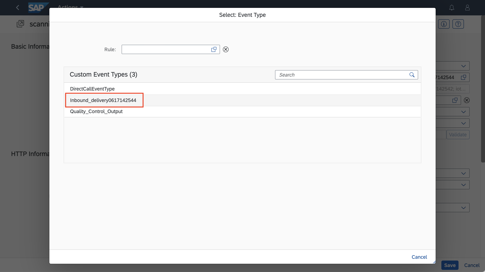
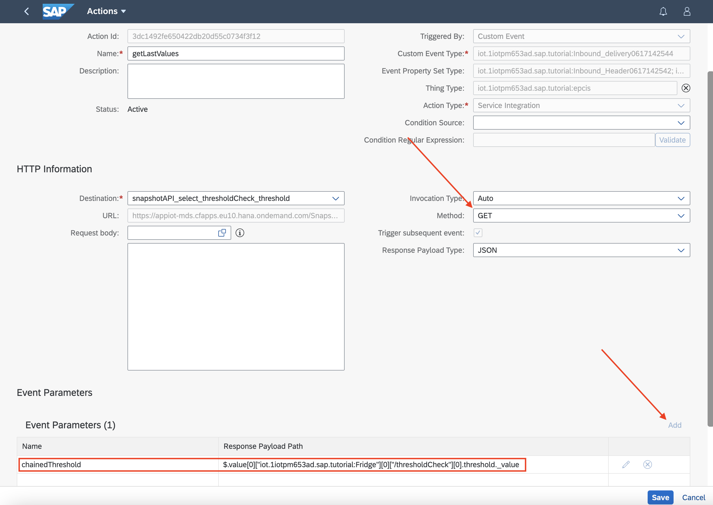
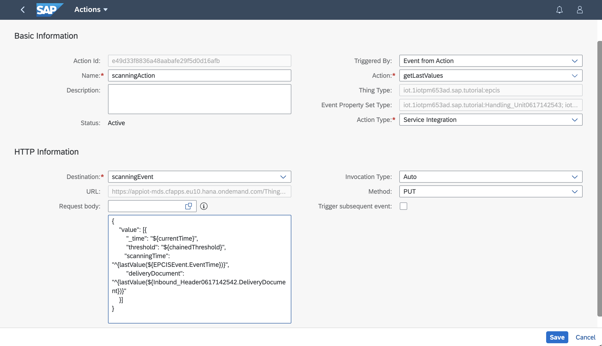
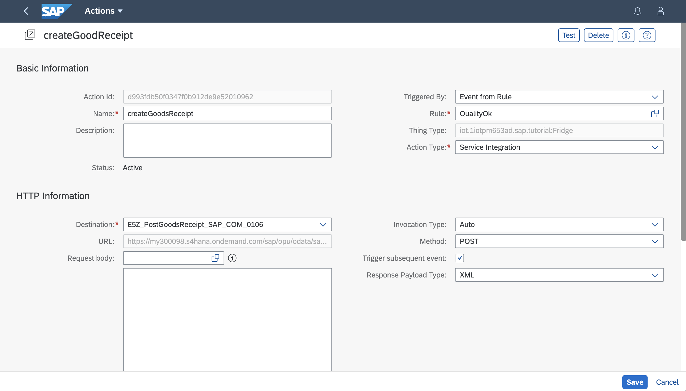
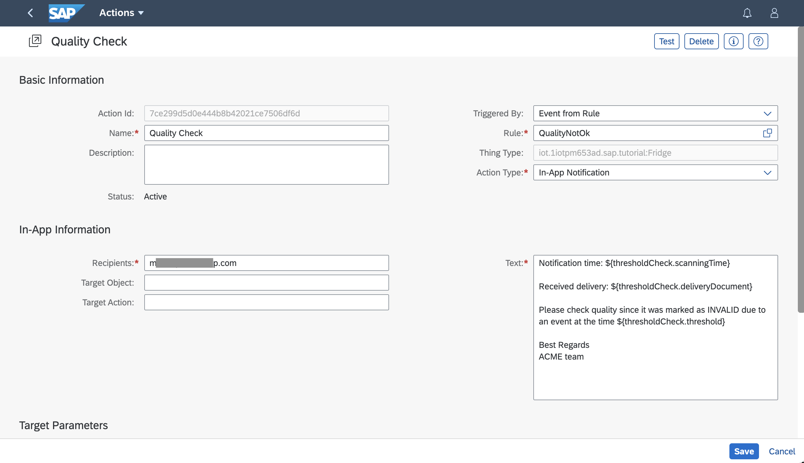
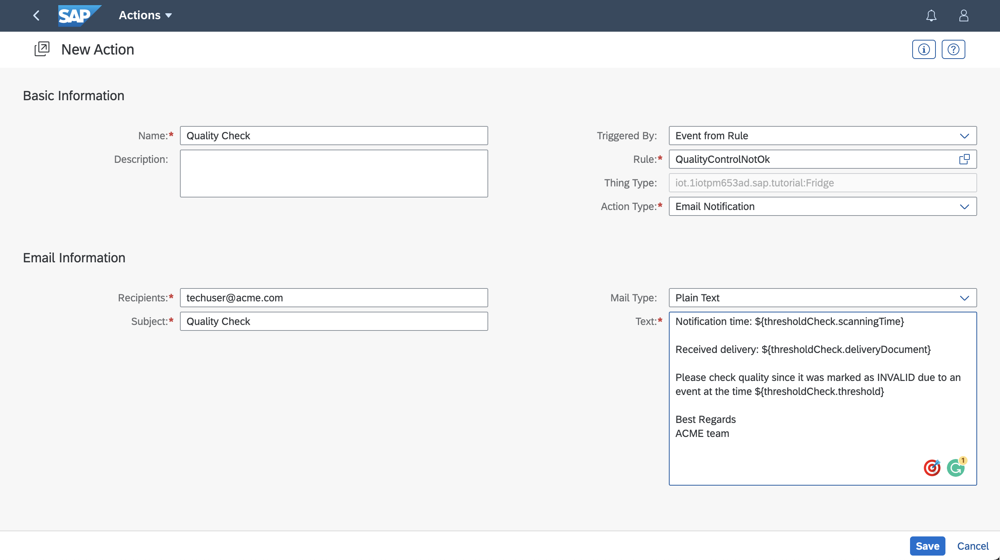

## Prerequisites
-   You have licensed SAP Internet of Things (with the new capacity unit based licensing introduced in August 2020, your company has a Cloud Platform Enterprise Agreement or Pay-As-You-Go for SAP BTP and you have subscribed to the `oneproduct` service plan)
-   You have setup the subscription for SAP IoT in your global account in a tenant (e.g. in the DEV tenant, the guide for the basic setup is at [Get Started with Your SAP IoT Account](https://help.sap.com/viewer/195126f4601945cba0886cbbcbf3d364/latest/en-US/bfe6a46a13d14222949072bf330ff2f4.html) ).
-   Your SAP User has at a minimum the `iot_role_collection` created during onboarding of your tenant and the associated roles (see [SAP Help on Providing Authorizations in](https://help.sap.com/viewer/195126f4601945cba0886cbbcbf3d364/latest/en-US/2810dd61e0a8446d839c936f341ec46d.html) )
-   You have created and setup the Inbound Delivery **Business Context Hierarchy** and **Auto-ID Event Enrichment** using the [Activate Business Template for Inbound Delivery](iot-smartsensing-inbounddelivery-template) and [Adjust the Business Context Hierarchy for Inbound Delivery](iot-smartsensing-qcbc-hierarchy) tutorials.
-   You have created destinations for the goods receipt API as described in [Create SAP S/4HANA Destination for Smart Sensing](iot-smartsensing-s4destinations) and [Create Destinations for Inbound Delivery APIs and Scanning Event](iot-smartsensing-qcgr-destinations)
-   Optional: You have configured the [Notification and Email setup](https://help.sap.com/viewer/fbf2583f7bcf47fcb5107bf4d358770e/LATEST/en-US/c31a2362f5b848138cb5a1e709ef9fe2.html)

## Details
### You will learn
-   How to create Rule Projects and Rules
-   How to create Service Integration Actions
-   How to create an Action invoked by another Action
-   How to enrich the event used inside an Action with data provided by another Action
-   How to create Notifications

The process flow for the Quality Control of Goods Receipt is composed of two different rule projects monitoring two different entities: the first rule monitor the IoT data and detect threshold violations, the second is monitoring the EPCIS events (items entering warehouse) and trigger different business processes based on the presence of any violation during the delivery process.

---

[ACCORDION-BEGIN [Step 1:](Create Rule Project)]

The first rule project will be composed with a single rule which is monitoring the value of the temperature of the Handling Unit and will fill up a property if certain conditions have been reached. A more complex scenario could include multiple rules that can be bundled all together into a **Rule Project**.

1.  Open the Fiori launchpad and Navigate to the **IoT Rules and Actions** tab and open the app **Rule Projects** in the Fiori Launchpad to create a new project by clicking **Create**.

2.  Provide a unique name for the name and description fields (for example, **`checkTemperature`**) and confirm.

3.  Add the measured property set `temperature` and the calculated `thresholdCheck` created for the Thing Type `Fridge` in the `Property Set-based` group.

    !

[DONE]
[ACCORDION-END]

[ACCORDION-BEGIN [Step 2:](Check data violation with a rule)]

Now that you have a **Rule Project**, you can create a rule. In the **Rule Projects** app navigate to the **Rules** tab and create a **Streaming - Derivation** rule.

1.  Provide a unique name for the name and description (for example, **`setTimestamp`**).

2.  Use the Property Set `temperature` and include `SAP_Stream_Derivation` as **Input**.

3.  Use the Property Set `thresholdCheck` as **Output**.

4.  Click **Save and Continue** and **Confirm** to initialize the rule. The **Rule Editor** section will appear to permit you to specify the rule condition.

5.  Using the interactive editor create your rule condition. In this condition we are not providing any value to `scanningTime` that will be populated differently.

    ```Rule
    IF  temperature.temperature > 4.0

    threshold:
    SAP_Stream_Derivation.BusinessTime
    ```

6.  Now you can **Save** and **Activate** the **Rule on Cloud**.

    > If the rule condition is met just the value of `threshold` is automatically filled with the timestamp of the rule derivation.

[DONE]
[ACCORDION-END]

[ACCORDION-BEGIN [Step 3:](Create rules for good quality conditions)]

The following rules are designed to react on EPCIS scanner events. It will be composed with two rules: the first rule is checking for a good condition, to create a Goods Receipt; the second is detecting bad conditions to trigger a Warehouse clerk conducts quality check. Since these rules are complementary by construction, only one will trigger for each scanning event and fire his linked actions.

In the **Rule Projects** app navigate to the **Rules** tab and create a **Streaming - Event Creation** rule.

1.  Provide a unique name for the name and description (for example, **`QualityOk`**).

2.  Use the Property Set `thresholdCheck` and include `SAP_Stream_Event` as **Input**.

3.  Use the `Result_Stream` as **Output**.

4.  Click **Save and Continue** and **Confirm** to initialize the rule. The **Rule Editor** section will appear to permit you to specify the rule condition.

5.  Using the interactive editor create your rule condition. In this condition we are not providing any value to `IoT_Event_Name` that will be populated differently.

    ```Rule
    IF  ISNULL( thresholdCheck.threshold ) AND ISNOTNULL( thresholdCheck.scanningTime )  
    ```

    Create another Rule:

6.  Provide a unique name for the name and description (for example, **`QualityNotOk`**).

7.  Use the Property Set `thresholdCheck` and include `SAP_Stream_Event` as **Input**.

8.  Use the `Result_Stream` as **Output**.

9.  Click **Save and Continue** and **Confirm** to initialize the rule. The **Rule Editor** section will appear to permit you to specify the rule condition.

10. Using the interactive editor create your rule condition. In this condition we are not providing any value to `IoT_Event_Name` that will be populated differently.

    ```Rule
    IF  ISNOTNULL( thresholdCheck.threshold ) AND ISNOTNULL( thresholdCheck.scanningTime )  
    ```

11. Activate both the rules.

[DONE]
[ACCORDION-END]

[ACCORDION-BEGIN [Step 4: ](Create action to get existing violations)]

> To define this action, you need to configure a Destination to get Snapshot data from SAP Internet of Things. Please refer to the tutorial [Create destination to read Property Set last values](iot-smartsensing-qcgr-destinations) for more details.

The scanning event is asynchronous from the computation of violations. Since this scenario is using live Streaming Rules, the property, which tracks the status of the violations, is not contained in the scanning event context.

After the scanning event is received, we must chain two actions:

-   A first action is getting via APIs the last status of the `threshold` property in the `Fridge` Thing and enriching the existing context with his value.

-   A second action will populate correctly all the fields of the `thresholdCheck` Property Set, to permit a correct invocation of the Rules to trigger Quality Check or to create a Goods Receipt.

1. Navigate to the **IoT Rules and Actions** tab and then to **Actions** tile in the Fiori launchpad.

1.   Once you are in the create screen, provide a unique name for **Name** and **Description** (for example, **`getLastValues`**) to avoid conflicts.

2.   Select `Custom Event` for **Triggered by** field.

3.   Select the event automatically generated by the **Inbound Delivery Template** (e.g. `iot.1iotpm653ad.sap.tutorial:Inbound_delivery0617142544`)

    !

4.   Select `epcis` as **Thing Type** ( **Package Name**: `epcis`)

5.   Select `Service Integration` as **Action Type**

6.   Select your **Destination** created in paragraph **Create destination to read Property Set last values** of the tutorial [Create destinations for Inbound Delivery APIs and scanning event](iot-smartsensing-qcgr-destinations) (e.g. `snapshotAPI_select_thresholdCheck_threshold`)

7.   Press **Add** in the **Event Parameters** section to create an event parameter that will be passed to the next chained Action. Provide a name (e.g: `chainedThreshold`) and as **Response Payload Path** provide the following payload which is unwrapping correctly it from the JSON response `$.value[0]["<FULL_QUALIFIED PACKAGE>:Fridge"][0]["/thresholdCheck"][0].threshold._value`, replace **`<FULL_QUALIFIED PACKAGE>`** with the full qualified package of your property set (you can found it in the **Business Context** application in the column **IoT Package**).

8.   Change the value of the field **Method** to `GET`

9.   Change **Response Payload Type** to `JSON` and  **Save** your **Action**.

The action should look like the following:

!

[DONE]
[ACCORDION-END]

[ACCORDION-BEGIN [Step 5: ](Merge scanning event with IoT data)]

> To define this action, you need to configure a Destination to ingest data via API into SAP Internet of Things. Please refer to the tutorial [Create destination for data ingestion](iot-smartsensing-qcgr-destinations) for more details.

Every time a scanning event is received, the relevant data must be written into the derived property set of the Thing linked to the Handling Unit to check, accordingly with the related IoT data, if the item entering the warehouse should automatically generate a Goods Receipt or a Quality Check.

1.   Once you are in the create screen, provide a unique name for **Name** and **Description** (for example, **`scanningAction`**) to avoid conflicts.

2.   Select `Event From Action` for **Triggered by** field.

    > It's required to merge the IoT data / derived data with the existing scanning event, to create a merged unique event or status into the Thing which represent the Handling Unit.

    > This means it's required to start our Service Integration action, not directly from the scanning event, but from the action created in the previous step that is starting from the scanning event and capable to inject additional data / parameters in the same object of the scanning details.

3.   Select the Action created in the previous step (e.g. `getLastValues`)

4.   Select `Service Integration` as **Action Type**

5.   Select your **Destination** created in paragraph **Create destination for data ingestion** of the tutorial [Create destinations for Inbound Delivery APIs and scanning event](iot-smartsensing-qcgr-destinations) (e.g. `scanningEvent`)

6.   Fill up the body of the request with a body compatible with the SAP Internet of Things Time series ingestion APIs as in the following sample.

    ```JSON
    {
      "value": [{
        "_time": "${currentTime}",
        "threshold": "${chainedThreshold}",
        "scanningTime": "^{lastValue(${EPCISEvent.EventTime})}",
        "deliveryDocument":     "^{lastValue(${Inbound_Header0617142542.DeliveryDocument})}"
      }]
    }
    ```

    > Note that you have to replace the `Inbound_Header0617142542` with your unique Inbound delivery sequence number generated by the template. You could easily complete it by using the actions built-in editor.

7.   Change the value of the field **Method** to `PUT`

8.   Finally, **Save** your **Action**.

The action should look like the following:

!

[DONE]
[ACCORDION-END]

[ACCORDION-BEGIN [Step 6: ](Create service integration action for Goods Receipt)]

> To define this action, you need to configure a Destination for the creation of a Goods Receipt API in SAP S/4HANA Cloud. Please refer to the tutorial [Create destination for the creation of Goods Receipt](iot-smartsensing-qcgr-destinations) for more details.

If the **`QualityOk`** rule condition is satisfied, you can define one or more action to trigger the API call to the SAP S/4HANA or SAP S/4HANA Cloud system. To do so navigate to the **IoT Rules and Actions** tab and then to **Actions** tile in the Fiori launchpad.

1.   Once you are in the create screen, provide a unique name for **Name** and **Description** (for example, **`createGoodsReceipt`**) to avoid conflicts.

2.   Select `Event from Rule` for **Triggered by** field.

3.   Select the Rule created in Step 4.1 that identify the condition of the quality is good, e.g.: `QualityOk`

4.   Select `Service Integration` as **Action Type**

5.   Finally, select your **Destination** created in the step **Create Destination for the creation of goods receipts** with the tutorial [Create destinations for Inbound Delivery APIs and scanning event](iot-smartsensing-qcgr-destinations) (e.g. `scanningEvent`) and **Save** your **Action**.

!

[DONE]
[ACCORDION-END]

[ACCORDION-BEGIN [Step 7: ](Create notification for Quality Check)]

If the **`QualityNotOk`** rule condition is satisfied, you can define one or more action to create a notification to ask for a Quality Check. Navigate to the **IoT Rules and Actions** tab and then to **Actions** tile in the Fiori launchpad.

1.   Once you are in the create screen, provide a unique name for **Name** and **Description** (for example, **`createGoodReceipt`**) to avoid conflicts.

2.   Select `Event from Rule` for **Triggered by** field.

3.   Select the Rule created in Step 4.1 that identify the condition of the quality is not good, e.g.: `QualityNotOk`

4.   Select `In-App Notification` (or `Email Notification`) as **Action Type**

    > To use the Email Notification action type you must have already defined the email server setup in SAP Internet of Things, as defined in [the documentation](https://help.sap.com/viewer/fbf2583f7bcf47fcb5107bf4d358770e/LATEST/en-US/c31a2362f5b848138cb5a1e709ef9fe2.html)

5.   Fill in the values of **Recipients** with the user addresses those must be notified and write the **Text** of the notification and, with the built-in editor, you can insert dynamic elements into, like data properties triggered with the rule. If Email has been selected as notification type fill the **Subject** of the email; you can also select to write the body of the email as HTML or plain text.

    > If you are using `In-App Notification` and you want to inform the current logged user, just put your SAP Login into the **Recipients** field.


    Text sample:
    ```
    Notification time: ${thresholdCheck.scanningTime}

    Received delivery: ${thresholdCheck.deliveryDocument}

    Please check quality since it was marked as INVALID due to an event at the time ${thresholdCheck.threshold}

    Best Regards
    ACME team
    ```

6.   Finally, **Save** your **Action**.

    !

This is how the action looks like for the **Email Notification**:

!


[VALIDATE_5]
[ACCORDION-END]

---
