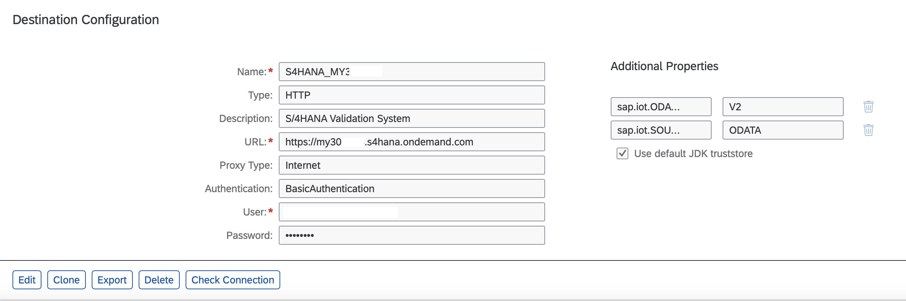

## Prerequisites
-   Your accounts.sap.com User has been added to this tenant as a `OrgManager`, `SpaceManager` or `SpaceDeveloper` to manage destinations.
-   You have setup the APIs for the `Inbound Delivery` and `Handling Unit` in your SAP S/4HANA system including SAP Cloud Connector setup. See [API Business Hub Inbound Delivery](https://api.sap.com/api/API_INBOUND_DELIVERY_SRV_0002/overview), [API Business Hub Handling Unit](https://api.sap.com/api/HANDLINGUNIT_0001/overview) and [SAP Help Portal on SAP Cloud Connector](https://help.sap.com/viewer/cca91383641e40ffbe03bdc78f00f681/Cloud/en-US/e6c7616abb5710148cfcf3e75d96d596.html) for further information.

## Details
### You will learn
-   How to create a destination to get business data from SAP S/4HANA or SAP S/4HANA Cloud

Destinations are key building blocks in SAP Business Technology Platform, and are used to define connections for outbound communication from your application to remote systems. Here we would like to define connections to your SAP S/4HANA or SAP S/4HANA Cloud system.

---

[ACCORDION-BEGIN [Step 1: ](Create new destination)]
You will create a Destination which will allow you the read the Business Data from SAP S/4HANA or SAP S/4HANA Cloud

1.  Go to your Cloud Foundry subaccount at [https://hana.ondemand.com/](https://hana.ondemand.com/), click **Connectivity** on the left panel and then click **Destinations** and **New Destination**

    !

    Under Destination Configuration, add the information of your SAP S/4HANA Cloud system.

    |  Property Name  | Value          | Remark
    |  :------------- | :------------- | :-------------
    |  Name           | **`S4HANA_MY30000`**  | of your choice, will be used in SAP IoT Action |
    |  Type           | `HTTP` |  |
    |  Description    | **`S/4HANA Development System`**  | of your choice |
    |  URL            | **`https://my300000.s4hana.ondemand.com`** | URL of your SAP S/4HANA Cloud system or Virtual Host for SAP S/4HANA |
    |  Proxy Type     | `Internet` or `OnPremise`| depending on Cloud or On-premise system |
    |  Authentication | `BasicAuthentication`, `OAuth2ClientCredentials` ... | based on your setup in the Communication Arrangement or Cloud Connector |

2.  Choose **New Property** under Additional Properties and add the following properties:

    |  Property Name    | Value
    |  :-------------   | :-------------
    |  `sap.iot.ODATA_VERSION`          | **`V2`**
    |  `sap.iot.SOURCE_TYPE`     | **`ODATA`**

3.  Check `Use default JDK truststore` and **Save** the Destination.

You destination should look similar to this one at the end:

!

> Further information on Destinations and supported Authentication methods see [SAP Help Portal of Internet of Things](https://help.sap.com/viewer/fbf2583f7bcf47fcb5107bf4d358770e/latest/en-US/87ec372e20ea48ba9843fc60a4723895.html) and [SAP Help Portal of SAP BTP Connectivity](https://help.sap.com/viewer/cca91383641e40ffbe03bdc78f00f681/Cloud/en-US/42a0e6b966924f2e902090bdf435e1b2.html)

[DONE]
[ACCORDION-END]

[ACCORDION-BEGIN [Step 2: ](Test yourself)]

[VALIDATE_5]
[ACCORDION-END]

---
