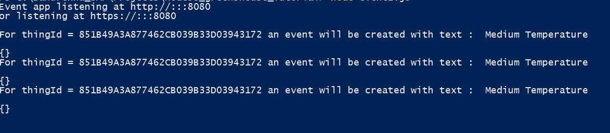
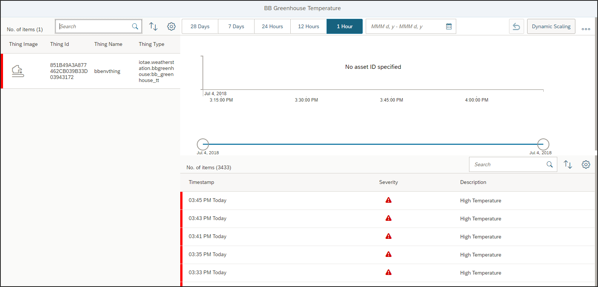

## Prerequisites  
 - Install [Node.js](https://nodejs.org/en/).


## Details
### You will learn
  - How to use Node.js script to read the measured values from SAP IoT
  - How to create a standard event if the measured values are beyond the defined threshold value

---

[ACCORDION-BEGIN [Step 1: ](Prepare for creating a Node.js application)]

After you install `Node.js`, perform the following steps:

 1. Create a folder `greenhouse_project`.
 2. Go to command prompt and navigate to the folder you created.
 3. Run the command `npm init`.
 4. Accept the default values the system prompts. As a result, the `package.json` file is created in your folder.
 5. Edit the `package.json` file to add/update the `dependencies` block as follows:
    ```JavaScript
    "dependencies": {
        "mqtt": "^2.15.2",
        "iot-application-services-sdk-nodejs": "SAP/iot-application-services-sdk-nodejs",
        "dotenv": "^5.0.1",
      }
    ```

    > The SDK for SAP IoT `iot-application-services-sdk-nodejs` is available open source. The SDK provides a `NodeJS` package that acts as thin wrapper over the API of SAP IoT. In addition, you must include this as one of the dependencies in your `package.json` file.

 6. Run the command `npm install`. This creates the `package-lock.json` file and all other dependencies in the `node_modules` folder within the folder `greenhouse_project`.

[DONE]

[ACCORDION-END]

[ACCORDION-BEGIN [Step 2: ](Create events if temperature is beyond threshold values)]

 1. You must have already made a note of the tenant, package, thing type, property set, and properties that you have used or created in the tutorials listed in the `Prerequisites` section. These information will be used in this step.

 2. On your computer, create a file `event.js` in your folder and paste the following `Node.js` script into it.

    ```JavaScript
    'use strict';

    require('dotenv').config();

    const express = require('express');
    const delaybetweenchecks = process.env.DELAYBETWEENCHECKS || 120000;
    const PORT = process.env.PORT || 8080;

    var NodeAE = require('iot-application-services-sdk-nodejs');
    var nodeAE = new NodeAE();

    // check temperature data for event generation
    function checkEventForTemps() {

    	var d = new Date();

    	var fourminutesago = new Date(d.valueOf()-240000).toISOString();
    	var twominutesago = new Date(d.valueOf()-120000).toISOString();
    	nodeAE.setBaseUrl('analytics-thing-sap');

    	var url = '/iotae.weatherstation.greenhouse:envData/aggregates?' +
    		'$select=id,temperature_AVG,time&' +
    		'$filter=time ge datetime\'' +
    		fourminutesago.slice(0, -1) +
    		'\' and time lt datetime\'' +
    		twominutesago.slice(0, -1) +
    		'\'&' +
    		'$format=json';

    	var checkValuesCall = nodeAE.request(url);
    	checkValuesCall.then(
      		function success(oResponse) {
    			var parsedThings = oResponse.d.results;

    			for(var thing of parsedThings) {
    				console.log("Selected thing ID " + thing.id + " and its temperature is " + thing.temperature_AVG);

    				readReferenceProperties(thing.id, twominutesago, thing.temperature_AVG);
    			}       

    		console.log("");
      		},
      		function error(err) {
        		throw err;
      		}
      	).catch( function(error) {
    		console.log(error)
      	});
    }

    // read reference properties function

    function readReferenceProperties(thingid, twominutesago, temp) {
    	nodeAE.setBaseUrl('appiot-mds');
    	var url1 = "/Things('" + thingid + "')/iotae.weatherstation.greenhouse:greenhouseType/ReferenceProperties/'envData,temperature'";
    	var checkValuesCall = nodeAE.request(url1);
    	checkValuesCall.then(
      		function success(oResponse) {
    			var parsedValues = oResponse.values;

    var upthrearray=parsedValues['/envData/temperature']['com.sap.iot.core.UpperThreshold']['value'];
    var lowthrearray=parsedValues['/envData/temperature']['com.sap.iot.core.LowerThreshold']['value'];
    var upthresval=upthrearray[upthrearray.length-1].value;
    var lowthresval=lowthrearray[lowthrearray.length-1].value;

    console.log("Upper threshold value for temperature: " + upthresval);
    console.log("Lower threshold value for temperature: " + lowthresval);

    			if (parseFloat(temp) > upthresval)
    			{
    			var severity = 1;  
    			var desc = "High Temperature";
    			console.log("High temperature. Event will be created.");
    				createEventForReal(twominutesago, thingid, desc, severity);
    		}
    		else if (parseFloat(temp) > lowthresval && parseFloat(temp) < upthresval)
    		{
    			severity = 2;
    			desc = "Medium Temperature";
    			console.log("Medium temperature. Event will be created.");
    			createEventForReal(twominutesago, thingid, desc, severity);
    		}
    			else
    			 {
    				 console.log("Low temperature. No event will be created.");
    				}

    		console.log("");
      		},
      		function error(err) {
        		throw err;
      		}
      	).catch( function(error) {
    		console.log(error)
      	});
    }
    function toArray(parsedValues) {
    	const result = [];
    	for (const prop in parsedValues) {
    		const value = parsedValues[prop];
    		if (typeof value === 'object') {

    						result.push(toArray(value)); // <- recursive call
    	}
    		else {
    			result.push(value);
    		}
    	}
    	return result;
    	console.log(toArray(data));
    }

    // create event function
    function createEventForReal(timestamp, thingid, desc, severity) {
    	nodeAE.setBaseUrl('appiot-mds');
    	var url =  '/Events';
    	var method = 'POST';
    	var body = {
    		"_businessTimeStamp": timestamp,
    		"_status": "Open",
    		"_type": "Alert",
    		"_severity": severity,
    		"_source": "node-event-generator",
    		"_code": "1",
    		"_thingId": thingid,
    		"_thingProperty": "iotae.weatherstation.greenhouse:greenhouseType/envData",
    		"_description": desc,
    		"_data": "test"
    	};

    	var requestConfig =
    		({url, method, body}
    		);
    	var createEventCall = nodeAE.request(requestConfig);
    		console.log("For thingId = " +  thingid + " an event will be created with text : " + desc);
    	createEventCall.then(
      		function success(oResponse) {
    			console.log("event created")
    			},
      		function error(err) {
        		throw err;
      		}
      	).catch( function(error) {
    		console.log(error)
      	})
    }

    // set automatic check for events
    setInterval(checkEventForTemps, delaybetweenchecks);
    console.log("now checking tresholds ...");

    ```

    You must replace values for some of the entities in the `event.js` file by the values you specified in the tutorials of the `Prerequisites` section. The following table illustrates the various entities involved in the above example `Node.js` script:

    |Entity|Description|
    |-------------|-------------|
    |`iotae.weatherstation`|Tenant name|
    |`greenhouse`|Package name|
    |`greenhouseType`|Thing type|
    |`envData`|property set|
    |`temperature`|property|

    The tenant name typically is the sub-account/subdomain name with `iot.` as a prefix - you can find it in the thing modeler when you look at the thing type in the URL. You have to replace above in 2 places in the code where an URL is composed.

3. Create another file called `.env` and provide the client id and client secret for the tenant you use in this file.

    - If you have a new tenant/subaccount then you will find this in the cloud platform cockpit cloud foundry space in the sub-account in the application enablement service instance in the service key (create a default service key if there is none).

    - If you have an old tenant it will not show up in your cloud platform cockpit but you will have to retrieve it from an email that was sent to you or someone else in your company when your tenant was provisioned to you. The file content looks similar to this:

        ```
        AE_OAUTH_CLIENT_ID=sb-a13c2e72-f84a-40a9-adf3-4c02bd3c4765!b4080|iotae_service!b5
        AE_OAUTH_CLIENT_SECRET=a/CNF1jadajadajadajadambOlc=
        AE_TENANT=weatherstation
        AE_LANDSCAPE=eu10
        AE_HOST=hana.ondemand.com
        ```

        In here please also use your tenant name without the `iot.` prefix.

3. Run the app with the command `node event.js`.

4. Now its a good idea to change the temperature to go above or below the thresholds you have defined to generate an event. You should see the console log outcome as follows once an event is generated:

    

[DONE]

[ACCORDION-END]

[ACCORDION-BEGIN [Step 3: ](Check created events using the API in Postman)]

 1. Read all the events raised on the property set `envData` using the request URL `https://iotae-weather-station.iot-sap.cfapps.eu10.hana.ondemand.com/appiot-mds/Events?$filter=_thingProperty eq 'iotae.weatherstation.greenhouse:greenhouseType/envData'&$orderby=_businessTimeStamp desc`.

The list of events in the result set is sorted by the business timestamp in descending order.

```JSON
       {
       "value": [
        {
        "_id": "AF296CD1EF1243668835C7816892084F",
        "_businessTimeStamp": "2018-05-23T05:55:46.370Z",
        "_status": "Open",
        "_type": "Alert",
        "_severity": 1,
        "_source": "node-event-generator",
        "_code": "1",
        "_thingId": "70A74E9CE63A44FFA1A1A345B767B219",
        "_thingProperty": "iotae.weatherstation.greenhouse:greenhouseType/envData",
        "_description": "High Temperature"
        }
     ]
  }
```

[DONE]

[ACCORDION-END]

[ACCORDION-BEGIN [Step 4: ](Check created events in an IoT Application)]

 You can create an IoT Application using the SAP Web IDE Full-Stack to view the events created as shown in the below image.
    

If you want to learn how to do this please consider this tutorial: [Build an IoT Condition Monitoring App](iot-express-5-use-webide-template).

To deploy the app for automatic operation please follow this tutorial: [Deploy Your Node.js App with the Cloud Foundry CLI](cp-node-deploy-cf-cli).

[VALIDATE_1]

[ACCORDION-END]


---
