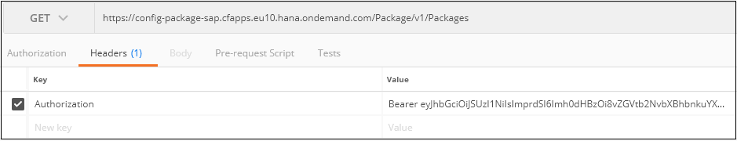
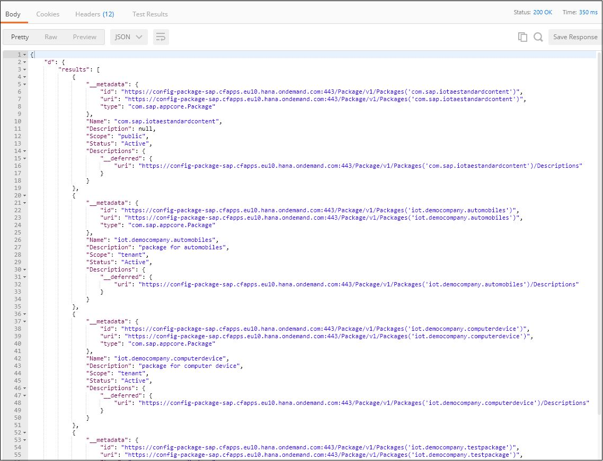
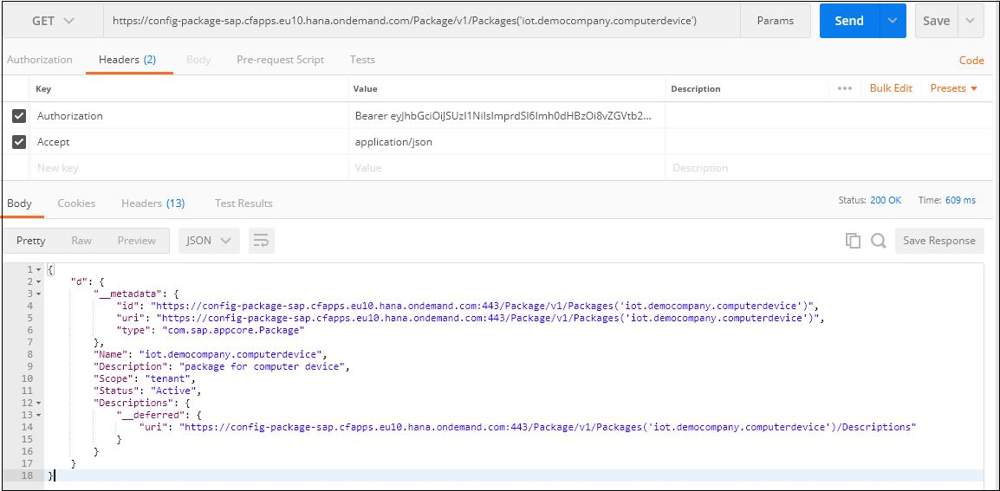
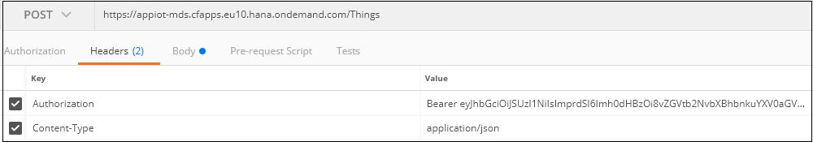
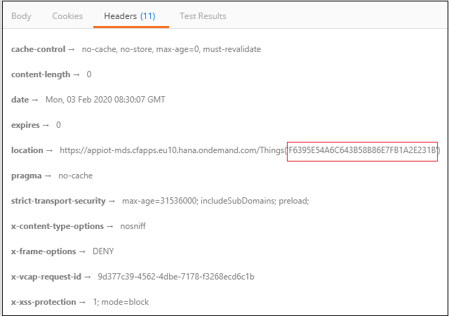

## Prerequisites  
 - **Tutorials:** [Install Postman Rest Client](api-tools-postman-install)
 - Access to a tenant specific to SAP IoT. In this tutorial, tenant `democompany` is used.

## Details
### You will learn
- How to retrieve OAuth token to access APIs
- How to read thing metadata
- How to onboard a thing and create data

In [previous tutorials](iot-express-4-create-thing-model), you learned about using Thing Modeler to onboard a thing, send data to the thing, and retrieve data from the thing. Now, you'll learn to access SAP IoT APIs using Postman.

---

[ACCORDION-BEGIN [Step 1: ](Retrieve OAuth Token)]

You can retrieve the OAuth token specific for your tenant using Postman. The retrieved token is used to access the API endpoints described in this tutorial.

For more information, see

- [How to retrieve OAuth Token](https://help.sap.com/viewer/fffd6ca18e374c2e80688dab5c31527f/latest/en-US/7b3a94e68be9460680a915138a160c67.html)

- [Authorization concept in SAP IoT](https://help.sap.com/viewer/fffd6ca18e374c2e80688dab5c31527f/latest/en-US/5f1a38d7048042fa8c00314bc619e262.html)

[DONE]

[ACCORDION-END]


[ACCORDION-BEGIN [Step 2: ](Display package details)]

1. In Postman, choose the **GET** method.

2. Enter the following request URL: `https://config-package-sap.cfapps.eu10.hana.ondemand.com/Package/v1/Packages`.

3. In the **Headers** tab, enter `Authorization` in the **Key** column and enter `Bearer <<your token>>` in the **Value** column.

    

4. Click the **Send** button.
    The result set contains all packages to which the user has access authorization. It includes all packages with scope tenant and private from the same tenant to which the user has access.

    

    The response payload contains the following details for every package:

    | Field | Description |
    |------|--------------|
    |Name|Unique identifier of the package|
    |Description|Text describing the package|
    |Scope|Scope of the package (public and private)|
    |Status|Status of the package (Active and Freeze)|

5. Enter the request URL `https://config-package-sap.cfapps.eu10.hana.ondemand.com/Package/v1/Packages('iot.democompany.testpackage')` to retrieve  details of the package `iot.democompany.testpackage`.

6. Click the **Send** button.

    

    The response payload contains the following details for every package:

    | Field | Description |
    |------|--------------|
    |Name|Unique identifier of the package|
    |Description|Description of the configuration package for each language with the corresponding ISO language code|
    |Scope|Scope of the package (private and tenant)|
    |Status|Status of the package (Active and Freeze)|

[DONE]

[ACCORDION-END]


[ACCORDION-BEGIN [Step 3: ](Read thing type details)]
To create data for a thing, you must identify the property set type that is used to define property sets for a thing type. Firstly, identify thing types that belong to a package, and then read details of a thing type along with its property sets and properties.

1. In Postman, choose the **GET** method.

2. Enter the following request URL: `https://config-thing-sap.cfapps.eu10.hana.ondemand.com/ThingConfiguration/v1/Packages('iot.democompany.computerdevice')/ThingTypes`.

3. Click the **Send** button. Thing types of the package `iot.democompany.computerdevice` are retrieved.

    ```JSON

    {
    "d": {
        "results": [
            {
                "__metadata": {
                    "id": "https://config-thing-sap.cfapps.eu10.hana.ondemand.com:443/ThingConfiguration/v1/ThingTypes('iot.democompany.computerdevice%3Ageneric_computer')",
                    "uri": "https://config-thing-sap.cfapps.eu10.hana.ondemand.com:443/ThingConfiguration/v1/ThingTypes('iot.democompany.computerdevice%3Ageneric_computer')",
                    "type": "com.sap.appiot.ThingType"
                },
                "Name": "iot.democompany.computerdevice:generic_computer",
                "PackageName": "iot.democompany.computerdevice",
                "Description": "generic use computer",
                "ExtendedThingType": "",
                "CopySource": null,
                "PropertySets": {
                    "__deferred": {
                        "uri": "https://config-thing-sap.cfapps.eu10.hana.ondemand.com:443/ThingConfiguration/v1/ThingTypes('iot.democompany.computerdevice%3Ageneric_computer')/PropertySets"
                    }
                },
                "Descriptions": {
                    "__deferred": {
                        "uri": "https://config-thing-sap.cfapps.eu10.hana.ondemand.com:443/ThingConfiguration/v1/ThingTypes('iot.democompany.computerdevice%3Ageneric_computer')/Descriptions"
                    }
                },
                "ThingTemplates": {
                    "__deferred": {
                        "uri": "https://config-thing-sap.cfapps.eu10.hana.ondemand.com:443/ThingConfiguration/v1/ThingTypes('iot.democompany.computerdevice%3Ageneric_computer')/ThingTemplates"
                    }
                },
                "ObjectAssociations": {
                    "__deferred": {
                        "uri": "https://config-thing-sap.cfapps.eu10.hana.ondemand.com:443/ThingConfiguration/v1/ThingTypes('iot.democompany.computerdevice%3Ageneric_computer')/ObjectAssociations"
                    }
                }
            }
        ]
    }
}
```

4. To read details of a thing type  `iot.democompany.computerdevice:generic_computer` along with its property sets and properties, enter the following request URL: `https://config-thing-sap.cfapps.eu10.hana.ondemand.com/ThingConfiguration/v1/ThingTypes('iot.democompany.computerdevice:generic_computer')?$expand=PropertySets/Properties`.

5. Click the **Send** button. Thing type details along with the property sets and properties are retrieved.

    ```JSON

    {
    "d": {
        "__metadata": {
            "id": "https://config-thing-sap.cfapps.eu10.hana.ondemand.com:443/ThingConfiguration/v1/ThingTypes('iot.democompany.computerdevice%3Ageneric_computer')",
            "uri": "https://config-thing-sap.cfapps.eu10.hana.ondemand.com:443/ThingConfiguration/v1/ThingTypes('iot.democompany.computerdevice%3Ageneric_computer')",
            "type": "com.sap.appiot.ThingType"
        },
        "Name": "iot.democompany.computerdevice:generic_computer",
        "PackageName": "iot.democompany.computerdevice",
        "Description": "generic use computer",
        "ExtendedThingType": null,
        "CopySource": null,
        "PropertySets": {
            "results": [
                {
                    "__metadata": {
                        "id": "https://config-thing-sap.cfapps.eu10.hana.ondemand.com:443/ThingConfiguration/v1/PropertySets('Model')",
                        "uri": "https://config-thing-sap.cfapps.eu10.hana.ondemand.com:443/ThingConfiguration/v1/PropertySets('Model')",
                        "type": "com.sap.appiot.PropertySet"
                    },
                    "Name": "Model",
                    "ThingType": "iot.democompany.computerdevice:generic_computer",
                    "Description": "Model of the computer",
                    "PropertySetType": "iot.democompany.computerdevice:Model",
                    "DataCategory": "MasterData",
                    "Operation": "",
                    "ThingTypes": {
                        "__deferred": {
                            "uri": "https://config-thing-sap.cfapps.eu10.hana.ondemand.com:443/ThingConfiguration/v1/PropertySets('Model')/ThingTypes"
                        }
                    },
                    "PropertySetTypes": {
                        "__deferred": {
                            "uri": "https://config-thing-sap.cfapps.eu10.hana.ondemand.com:443/ThingConfiguration/v1/PropertySets('Model')/PropertySetTypes"
                        }
                    },
                    "Properties": {
                        "results": [
                            {
                                "Name": "Manufacturer",
                                "PropertySetType": "iot.democompany.computerdevice:Model",
                                "Description": "Manufacturer of the model",
                                "Type": "String",
                                "PropertyLength": "127",
                                "QualityCode": "0",
                                "UnitOfMeasure": "",
                                "ReferenceProperty": null,
                                "AttributeType": null,
                                "Operation": "",
                                "PropertyType": null,
                                "IsMultiLingual": null
                            },
                            {
                                "Name": "Series",
                                "PropertySetType": "iot.democompany.computerdevice:Model",
                                "Description": "Series of the model",
                                "Type": "String",
                                "PropertyLength": "127",
                                "QualityCode": "0",
                                "UnitOfMeasure": "",
                                "ReferenceProperty": null,
                                "AttributeType": null,
                                "Operation": "",
                                "PropertyType": null,
                                "IsMultiLingual": null
                            }
                        ]
                    },
                    "Descriptions": {
                        "__deferred": {
                            "uri": "https://config-thing-sap.cfapps.eu10.hana.ondemand.com:443/ThingConfiguration/v1/PropertySets('Model')/Descriptions"
                        }
                    }
                },
                {
                    "__metadata": {
                        "id": "https://config-thing-sap.cfapps.eu10.hana.ondemand.com:443/ThingConfiguration/v1/PropertySets('CPU_Data')",
                        "uri": "https://config-thing-sap.cfapps.eu10.hana.ondemand.com:443/ThingConfiguration/v1/PropertySets('CPU_Data')",
                        "type": "com.sap.appiot.PropertySet"
                    },
                    "Name": "CPU_Data",
                    "ThingType": "iot.democompany.computerdevice:generic_computer",
                    "Description": "CPU type and usage data",
                    "PropertySetType": "iot.democompany.computerdevice:CPU_Data",
                    "DataCategory": "TimeSeriesData",
                    "Operation": "",
                    "ThingTypes": {
                        "__deferred": {
                            "uri": "https://config-thing-sap.cfapps.eu10.hana.ondemand.com:443/ThingConfiguration/v1/PropertySets('CPU_Data')/ThingTypes"
                        }
                    },
                    "PropertySetTypes": {
                        "__deferred": {
                            "uri": "https://config-thing-sap.cfapps.eu10.hana.ondemand.com:443/ThingConfiguration/v1/PropertySets('CPU_Data')/PropertySetTypes"
                        }
                    },
                    "Properties": {
                        "results": [
                            {
                                "Name": "cpu_type",
                                "PropertySetType": "iot.democompany.computerdevice:CPU_Data",
                                "Description": "type and model of the CPU",
                                "Type": "String",
                                "PropertyLength": "127",
                                "QualityCode": "0",
                                "UnitOfMeasure": "",
                                "ReferenceProperty": null,
                                "AttributeType": null,
                                "Operation": "",
                                "PropertyType": null,
                                "IsMultiLingual": null
                            },
                            {
                                "Name": "cpu_usage",
                                "PropertySetType": "iot.democompany.computerdevice:CPU_Data",
                                "Description": "usage of the CPU",
                                "Type": "Numeric",
                                "PropertyLength": "",
                                "QualityCode": "0",
                                "UnitOfMeasure": "MHZ",
                                "ReferenceProperty": null,
                                "AttributeType": null,
                                "Operation": "",
                                "PropertyType": null,
                                "IsMultiLingual": null
                            }
                        ]
                    },
                    "Descriptions": {
                        "__deferred": {
                            "uri": "https://config-thing-sap.cfapps.eu10.hana.ondemand.com:443/ThingConfiguration/v1/PropertySets('CPU_Data')/Descriptions"
                        }
                    }
                }
            ]
        },
        "Descriptions": {
            "__deferred": {
                "uri": "https://config-thing-sap.cfapps.eu10.hana.ondemand.com:443/ThingConfiguration/v1/ThingTypes('iot.democompany.computerdevice%3Ageneric_computer')/Descriptions"
            }
        },
        "ThingTemplates": {
            "__deferred": {
                "uri": "https://config-thing-sap.cfapps.eu10.hana.ondemand.com:443/ThingConfiguration/v1/ThingTypes('iot.democompany.computerdevice%3Ageneric_computer')/ThingTemplates"
            }
        },
        "ObjectAssociations": {
            "__deferred": {
                "uri": "https://config-thing-sap.cfapps.eu10.hana.ondemand.com:443/ThingConfiguration/v1/ThingTypes('iot.democompany.computerdevice%3Ageneric_computer')/ObjectAssociations"
            }
        }
    }
}
```

    You can use the property set `CPU_Data` to create data for a thing.

[DONE]

[ACCORDION-END]


[ACCORDION-BEGIN [Step 4: ](Onboard computer device as a thing)]
Object group is a technical object used for assigning object-based authorizations to user groups. When you assign an object group to a thing, you are allowed to carry out the functions based on the capabilities defined for the user group. You must identify what object group to use while creating a thing.

1. In Postman, choose the **GET** method.

2. Enter the following request URL: `https://appiot-mds.cfapps.eu10.hana.ondemand.com/Things`.

3. You can choose an object group ID from one of the things listed in the response payload. You must specify this ID in the request payload for creating a thing.

4. In Postman, choose the **POST** method.

5. Enter the following request URL: `https://appiot-mds.cfapps.eu10.hana.ondemand.com/Things`.

6. Go to the **Body** tab.

7. Choose the **raw** option.

8. Choose **JSON (application/json)** from the dropdown list.

9. Enter the following request payload.

    ```JSON

    {
      "_externalId": "lenova_a3",
      "_alternateId": "lenova_a3_altId",
      "_name": "lenova_a3",
      "_description": {
        "en": "Lenova A3 series"
      },
      "_thingType": [
        "iot.democompany.computerdevice:generic_computer"
      ],
      "_objectGroup": "45758A9B7CB041B98A13977F92E7AD50"
    }
```

10. In the **Headers** tab, enter `Authorization` in the **Key** column and enter `Bearer <<your token>>` in the **Value** column.

    

    >**Note**: While working on tutorials in a shared environment, for easy identification of your own objects, use your own user IDs (S-user or P-user depending on the system used) for the object names. To know your ID, see <https://iotae-handson.accounts400.ondemand.com/ui/protected/profilemanagement> or <https://accounts.sap.com/ui/protected/profilemanagement>.

11. Click the **Send** button. Digital twin of your computer device as a thing is created. The URL of the thing created is returned in the **Location** field of the **Header** in the response payload.

    

    For example, the digital twin `lenova_a3` of your computer device is created with a unique thing ID `F6395E54A6C643B58B86E7FB1A2E231B`. You can use this unique ID to retrieve details of the thing.

12. In Postman, choose the **GET** method.

13. Enter the following request URL: `https://appiot-mds.cfapps.eu10.hana.ondemand.com/Things('F6395E54A6C643B58B86E7FB1A2E231B')`. Thing details are retrieved and displayed in the response payload.

    ```JSON
    {
      "_id": "F6395E54A6C643B58B86E7FB1A2E231B",
      "_externalId": "lenova_a3",
      "_alternateId": "lenova_a3_altId",
      "_name": "lenova_a3",
      "_description": {
        "en": "Lenova A3 series"
      },
      "_thingType": [
        "iot.democompany.computerdevice:generic_computer"
      ],
      "CreatedByUser": "8afb7261-49e8-4f24-8b2b-9d5abd9b81d6",
      "CreatedTime": "2020-02-03T08:30:07.660Z",
      "LastChangedByUser": "8afb7261-49e8-4f24-8b2b-9d5abd9b81d6",
      "LastChangedTime": "2020-02-03T08:30:07.660Z",
      "_objectGroup": "45758A9B7CB041B98A13977F92E7AD50"
    }
```

[DONE]

[ACCORDION-END]


[ACCORDION-BEGIN [Step 5: ](Create time series data)]
Using API endpoints is one of the ways to directly ingest data for a thing. Alternatively, using device management too you can ingest data for a thing.

1. In Postman, choose the **PUT** method.

2. Enter the following request URL: `https://appiot-mds.cfapps.eu10.hana.ondemand.com/Things('F6395E54A6C643B58B86E7FB1A2E231B')/iot.democompany.computerdevice:generic_computer/CPU_Data`.

    | Field | Description |
    |------|--------------|
    |Thing ID|`F6395E54A6C643B58B86E7FB1A2E231B`|
    |Thing Type|`iot.democompany.computerdevice:generic_computer`|
    |Property Set|`CPU_Data`|
    |Property|`cpu_usage`|

3. Go to the **Body** tab.

4. Choose the **raw** option.

5. Choose **JSON (application/json)** from the dropdown list.

6. Enter the request payload as illustrated below:

    ```JSON
{
"value": [{
		"_time": "2020-02-01T09:20:00Z",
		"cpu_usage": 120
	},
	{
		"_time": "2020-02-01T09:10:00Z",
		"cpu_usage": 110
	}
]
}
```

7. In the **Headers** tab, enter the `Authorization` in the **Key** column and enter `Bearer <<your token>>` in the **Value** column.

8. Click the **Send** button. A numeric value is created for the property `cpu_usage` with time stamp for the thing `F6395E54A6C643B58B86E7FB1A2E231B`.

[DONE]

[ACCORDION-END]

[ACCORDION-BEGIN [Step 6: ](Read time series data)]
1. In Postman, choose the **GET** method.

2. Enter the following request URL:
    `https://appiot-mds.cfapps.eu10.hana.ondemand.com/Things('F6395E54A6C643B58B86E7FB1A2E231B')/iot.democompany.computerdevice:generic_computer/CPU_Data?timrange=1W`.

    Data is requested for a time range=1 week. The other possible values are:

      - #D - For the specified number days
      - #M - For the specified number months
      - #H - For the specified number of hours
      - From time - To time

    Data retrieved successfully.

    ```JSON
    {
    "value": [
        {
            "_time": "2020-02-01T09:20:00.000Z",
            "cpu_type": null,
            "cpu_usage": 120
        },
        {
            "_time": "2020-02-01T09:10:00.000Z",
            "cpu_type": null,
            "cpu_usage": 110
        },
        {
            "_time": "2020-02-01T09:00:00.000Z",
            "cpu_type": null,
            "cpu_usage": 100
        }]
      }
```

    >Similarly, you can retrieve thing data in various other ways such as Snapshot data, using M4 algorithm, and aggregates using OData services. For more information, see https://help.sap.com/viewer/p/SAP_IoT > Develop > SAP IoT Services.

[VALIDATE_6]

[ACCORDION-END]


[ACCORDION-BEGIN [Step 7: ](Explore IoT APIs in SAP API Hub (optional))]
To better understand SAP IoT APIs, you can go to SAP API Hub at <https://api.sap.com/package/IOTAE?section=Artifacts> and review and execute different APIs in its sandbox.

[DONE]

[ACCORDION-END]
